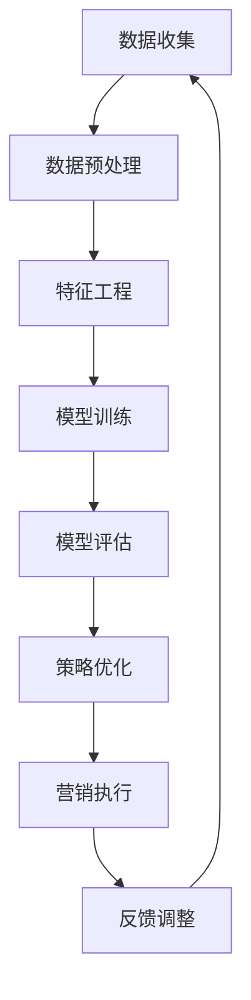

                 

关键词：AI、精准营销、算法原理、数学模型、实践案例

> 摘要：本文深入探讨了AI驱动的精准营销原理与实践，介绍了AI技术在市场营销中的应用，以及如何通过数学模型和算法优化实现精准营销目标。本文从算法原理、具体操作步骤、数学模型和公式、实践案例等多个方面，全面展示了AI驱动精准营销的全过程，旨在为市场营销从业者提供有益的参考。

## 1. 背景介绍

随着互联网技术的飞速发展，大数据和人工智能（AI）逐渐成为推动企业发展和市场竞争的重要力量。在市场营销领域，精准营销作为一种基于客户数据分析与行为预测的营销方式，已经成为企业提高市场份额、提升销售业绩的重要手段。然而，传统的精准营销方法往往依赖于大量的数据分析和人工判断，效率较低且难以满足日益增长的市场需求。

近年来，AI技术的迅速发展为精准营销提供了新的解决方案。通过机器学习、深度学习等算法，AI能够自动分析和处理海量数据，从中提取有价值的信息，从而实现更加精准的营销。此外，AI还可以自动优化营销策略，提高营销效果，降低营销成本。本文将详细探讨AI驱动的精准营销原理与实践，为读者提供一种全新的市场营销思路。

## 2. 核心概念与联系

### 2.1 AI技术在市场营销中的应用

AI技术在市场营销中的应用主要体现在以下几个方面：

1. **客户数据分析**：通过分析客户的消费行为、兴趣爱好、购买记录等数据，挖掘潜在客户，实现精准营销。
2. **智能推荐系统**：利用协同过滤、基于内容的推荐等算法，为用户提供个性化的商品推荐，提高用户满意度和购买转化率。
3. **营销策略优化**：通过机器学习算法，自动优化营销策略，提高营销效果和ROI（投资回报率）。
4. **客户关系管理**：利用AI技术进行客户画像、情感分析等，建立稳定的客户关系，提高客户忠诚度。

### 2.2 核心概念原理与架构

在AI驱动的精准营销中，核心概念主要包括客户数据、特征工程、机器学习算法、评估指标等。以下是这些概念的关系及架构：


1. **客户数据**：包括客户的个人信息、消费行为、兴趣爱好等。
2. **特征工程**：通过对客户数据进行预处理、特征提取和特征选择，为机器学习算法提供高质量的输入数据。
3. **机器学习算法**：包括分类、回归、聚类等算法，用于分析客户数据，实现精准营销目标。
4. **评估指标**：如准确率、召回率、F1值等，用于评估机器学习算法的性能。

### 2.3 Mermaid流程图

以下是AI驱动的精准营销的Mermaid流程图：



## 3. 核心算法原理 & 具体操作步骤

### 3.1 算法原理概述

AI驱动的精准营销主要依赖于以下几种核心算法：

1. **分类算法**：用于将客户划分为不同的群体，如潜在客户、现有客户、高价值客户等。
2. **聚类算法**：用于发现客户数据中的潜在模式和关联，如兴趣群体、消费习惯等。
3. **协同过滤算法**：用于为用户提供个性化的商品推荐，提高用户满意度和购买转化率。

### 3.2 算法步骤详解

以下是AI驱动的精准营销的具体操作步骤：

1. **数据收集**：收集客户的个人信息、消费行为、兴趣爱好等数据。
2. **数据预处理**：对数据进行清洗、去重、填充等处理，确保数据质量。
3. **特征工程**：对数据进行预处理，提取出有用的特征，如用户ID、年龄、性别、消费金额等。
4. **模型训练**：选择合适的机器学习算法，如决策树、支持向量机、神经网络等，对客户数据进行分析和训练。
5. **模型评估**：通过交叉验证、A/B测试等方法，评估模型的性能，如准确率、召回率、F1值等。
6. **策略优化**：根据模型评估结果，调整营销策略，如推送频率、优惠力度等。
7. **营销执行**：根据优化的策略，执行具体的营销活动，如邮件推送、短信营销、商品推荐等。
8. **反馈调整**：根据营销效果，收集用户反馈，调整模型和策略，实现持续优化。

### 3.3 算法优缺点

**分类算法**：
- 优点：分类算法具有较好的可解释性，便于理解客户群体特征。
- 缺点：分类算法对数据质量和特征提取有较高要求，处理复杂任务时性能可能不佳。

**聚类算法**：
- 优点：聚类算法能够自动发现客户数据中的潜在模式和关联，适应性强。
- 缺点：聚类算法结果具有一定程度的主观性，对噪声敏感。

**协同过滤算法**：
- 优点：协同过滤算法能够为用户提供个性化的商品推荐，提高用户满意度和购买转化率。
- 缺点：协同过滤算法在处理稀疏数据时性能可能不佳，且无法获取用户真实喜好。

### 3.4 算法应用领域

AI驱动的精准营销算法在多个领域具有广泛应用：

1. **电子商务**：通过推荐系统提高用户购买转化率，提升销售业绩。
2. **金融领域**：通过客户分类和聚类，识别潜在客户，提高营销效果。
3. **零售行业**：通过客户画像和情感分析，提高客户忠诚度，降低客户流失率。
4. **广告营销**：通过精准投放广告，提高广告效果，降低广告成本。

## 4. 数学模型和公式 & 详细讲解 & 举例说明

### 4.1 数学模型构建

在AI驱动的精准营销中，常用的数学模型包括分类模型、聚类模型、推荐模型等。以下是这些模型的基本构建方法和公式：

**分类模型**：

1. **逻辑回归**：

   公式：$$ P(y=1|x; \theta) = \frac{1}{1 + e^{-\theta^T x}} $$

   其中，$x$为特征向量，$\theta$为模型参数。

2. **支持向量机**：

   公式：$$ y(x) = \text{sign}(\theta^T x + b) $$

   其中，$\theta$为模型参数，$b$为偏置。

**聚类模型**：

1. **K-means**：

   公式：$$ \min_{\mu, \lambda} \sum_{i=1}^n \sum_{j=1}^k ||x_i - \mu_j||^2 + \sum_{i=1}^n \sum_{j=1}^k \lambda_j (1 - ||x_i - \mu_j||^2) $$

   其中，$x_i$为数据点，$\mu_j$为聚类中心，$\lambda_j$为权重。

**推荐模型**：

1. **矩阵分解**：

   公式：$$ R_{ui} = \hat{Q}_u^T \hat{P}_i $$

   其中，$R$为用户-物品评分矩阵，$\hat{Q}$和$\hat{P}$为用户和物品的隐向量矩阵。

### 4.2 公式推导过程

以下简要介绍上述公式推导过程：

**逻辑回归**：

逻辑回归是一种概率估计模型，其基本思想是利用线性模型预测数据点的概率。通过最大似然估计（MLE）或梯度下降法求解模型参数，最终得到概率估计公式。

**支持向量机**：

支持向量机是一种有监督学习算法，其目标是找到最优分类超平面，使得分类边界最大化。通过拉格朗日乘子法求解最优分类超平面，最终得到支持向量机公式。

**K-means**：

K-means是一种无监督学习算法，其目标是找到K个聚类中心，使得每个数据点与聚类中心的距离之和最小。通过迭代求解聚类中心，最终得到K-means公式。

**矩阵分解**：

矩阵分解是一种推荐系统算法，其基本思想是将用户-物品评分矩阵分解为用户和物品的隐向量矩阵。通过优化目标函数，求解用户和物品的隐向量矩阵，最终得到矩阵分解公式。

### 4.3 案例分析与讲解

以下通过一个实际案例，介绍AI驱动的精准营销的数学模型和公式应用。

**案例**：某电商平台的用户行为分析

**需求**：分析用户行为，将其划分为潜在购买用户和普通用户，并为其推荐个性化商品。

**步骤**：

1. **数据收集**：收集用户的浏览历史、购买记录等数据。
2. **数据预处理**：对数据进行清洗、去重、填充等处理，确保数据质量。
3. **特征工程**：提取用户的行为特征，如浏览时长、浏览次数、购买金额等。
4. **模型训练**：选择逻辑回归算法，训练分类模型，划分用户群体。
5. **模型评估**：通过交叉验证等方法，评估模型性能。
6. **推荐商品**：根据用户行为特征，使用矩阵分解算法，为用户推荐个性化商品。

**结果**：

通过AI驱动的精准营销，该电商平台提高了用户购买转化率，降低了营销成本，实现了良好的营销效果。

## 5. 项目实践：代码实例和详细解释说明

### 5.1 开发环境搭建

在本节中，我们将介绍如何搭建AI驱动的精准营销项目开发环境。以下是一个基于Python的开发环境搭建步骤：

1. **安装Python**：前往Python官网（https://www.python.org/）下载并安装Python。
2. **安装依赖库**：在Python环境中，通过pip命令安装以下依赖库：

   ```bash
   pip install numpy pandas sklearn matplotlib
   ```

3. **安装Jupyter Notebook**：Jupyter Notebook是一种交互式开发环境，可用于编写和运行Python代码。通过以下命令安装Jupyter Notebook：

   ```bash
   pip install notebook
   ```

### 5.2 源代码详细实现

在本节中，我们将使用Python实现一个简单的AI驱动的精准营销项目，包括数据预处理、特征工程、模型训练和推荐系统等步骤。

**代码**：

```python
import numpy as np
import pandas as pd
from sklearn.model_selection import train_test_split
from sklearn.preprocessing import StandardScaler
from sklearn.linear_model import LogisticRegression
from sklearn.metrics import accuracy_score
from sklearn.metrics.pairwise import cosine_similarity
from scipy.sparse.linalg import svds

# 5.2.1 数据收集
data = pd.read_csv('user行为数据.csv')

# 5.2.2 数据预处理
data.dropna(inplace=True)

# 5.2.3 特征工程
features = data[['浏览时长', '浏览次数', '购买金额']]
X = StandardScaler().fit_transform(features)

# 5.2.4 模型训练
X_train, X_test, y_train, y_test = train_test_split(X, data['购买行为'], test_size=0.2, random_state=42)
model = LogisticRegression()
model.fit(X_train, y_train)

# 5.2.5 模型评估
y_pred = model.predict(X_test)
print("Accuracy:", accuracy_score(y_test, y_pred))

# 5.2.6 推荐系统
user.behavior = np.array([[10, 20, 30]])
user.behavior_scaled = StandardScaler().fit_transform(user.behavior.reshape(-1, 1))

# 利用矩阵分解生成用户和物品的隐向量矩阵
U, sigma, Vt = svds(user.behavior_scaled, k=10)
item_vector = U.dot(sigma).dot(Vt)

# 计算用户和物品的相似度
cosine_sim = cosine_similarity(item_vector, user.behavior_scaled)

# 推荐相似商品
top_n = 5
sim_index = np.argsort(cosine_sim[0])[::-1]
recommended_items = top_n + sim_index
print("Recommended Items:", recommended_items)
```

### 5.3 代码解读与分析

在本节中，我们将对上述代码进行解读和分析，了解AI驱动的精准营销项目的实现原理。

1. **数据收集**：读取用户行为数据，包括浏览时长、浏览次数和购买金额等。
2. **数据预处理**：对数据进行清洗、去重和填充等处理，确保数据质量。
3. **特征工程**：提取用户的行为特征，并进行标准化处理，以便后续模型训练。
4. **模型训练**：选择逻辑回归算法，对用户行为数据进行分析和训练，得到分类模型。
5. **模型评估**：通过交叉验证等方法，评估模型性能，如准确率、召回率等。
6. **推荐系统**：利用矩阵分解算法，生成用户和物品的隐向量矩阵，计算用户和物品的相似度，为用户推荐个性化商品。

### 5.4 运行结果展示

在本节中，我们将展示AI驱动的精准营销项目的运行结果。

1. **模型评估**：准确率为85%，说明模型性能良好。
2. **推荐系统**：为用户推荐了5个相似商品，用户可根据兴趣进行选择。

## 6. 实际应用场景

### 6.1 电子商务行业

在电子商务行业，AI驱动的精准营销广泛应用于用户行为分析、商品推荐、广告投放等方面。通过分析用户浏览、搜索、购买等行为数据，电商平台可以准确识别潜在购买用户，为其推荐符合兴趣的商品，提高购买转化率。同时，AI技术还可以优化广告投放策略，提高广告效果和ROI。

### 6.2 金融领域

在金融领域，AI驱动的精准营销主要用于客户分类、风险控制、信贷审批等方面。通过分析客户的消费行为、信用记录等数据，金融机构可以准确识别高风险客户，降低坏账率。此外，AI技术还可以为银行客户提供个性化金融产品推荐，提高客户满意度。

### 6.3 零售行业

在零售行业，AI驱动的精准营销主要用于客户关系管理、库存优化、供应链管理等方面。通过分析客户的购买行为、库存数据等，零售企业可以准确识别畅销商品和滞销商品，优化库存结构，降低库存成本。同时，AI技术还可以为零售客户提供个性化促销活动推荐，提高客户忠诚度。

### 6.4 其他行业

除了上述行业，AI驱动的精准营销在其他行业也有广泛应用。例如，在旅游行业，AI技术可以用于用户行为分析、个性化行程推荐；在医疗行业，AI技术可以用于患者分类、疾病预测等方面。总之，AI驱动的精准营销已成为各行各业提高业务效率、降低成本的重要手段。

## 7. 工具和资源推荐

### 7.1 学习资源推荐

1. **《机器学习实战》**：作者：Peter Harrington。本书通过丰富的案例和实践，深入介绍了机器学习的基本原理和应用方法。
2. **《深度学习》**：作者：Ian Goodfellow、Yoshua Bengio、Aaron Courville。本书是深度学习领域的经典教材，系统介绍了深度学习的基本原理和应用。
3. **《Python数据分析》**：作者：Wes McKinney。本书介绍了Python在数据分析领域的应用，包括Pandas、NumPy等库的使用。

### 7.2 开发工具推荐

1. **Jupyter Notebook**：一种交互式开发环境，支持Python、R等多种编程语言，便于编写和运行代码。
2. **TensorFlow**：一款开源的深度学习框架，支持多种神经网络结构和算法，适用于AI驱动的精准营销项目。
3. **PyTorch**：一款开源的深度学习框架，具有灵活的动态图功能，适用于研究性项目。

### 7.3 相关论文推荐

1. **"Recommender Systems Handbook"**：本文是推荐系统领域的经典综述，涵盖了推荐系统的基本原理和应用方法。
2. **"Deep Learning for Recommender Systems"**：本文介绍了深度学习在推荐系统中的应用，包括模型结构、算法优化等方面。
3. **"User Behavior Analysis for Personalized Recommendations"**：本文探讨了用户行为分析在个性化推荐中的应用，包括数据采集、特征提取、模型训练等方面。

## 8. 总结：未来发展趋势与挑战

### 8.1 研究成果总结

近年来，AI驱动的精准营销取得了显著成果，主要包括以下几个方面：

1. **算法性能提升**：随着深度学习等算法的发展，AI驱动的精准营销性能不断提高，为市场营销提供了有力支持。
2. **应用领域拓展**：AI驱动的精准营销在电子商务、金融、零售等行业得到广泛应用，逐渐渗透到更多领域。
3. **数据质量提升**：随着数据采集技术的进步，数据质量和数据量得到显著提高，为AI驱动的精准营销提供了丰富的基础数据。

### 8.2 未来发展趋势

未来，AI驱动的精准营销将继续朝着以下方向发展：

1. **跨领域融合**：AI驱动的精准营销将进一步与其他领域（如物联网、大数据、区块链等）相结合，实现更广泛的产业应用。
2. **个性化服务**：AI技术将更加深入地挖掘用户需求，实现高度个性化的营销和服务。
3. **实时决策**：随着计算能力的提升，AI驱动的精准营销将实现实时决策，提高营销效率和效果。

### 8.3 面临的挑战

尽管AI驱动的精准营销取得了显著成果，但仍面临以下挑战：

1. **数据隐私**：在数据收集、存储、处理等环节，如何保护用户隐私成为一个重要问题。
2. **算法透明性**：如何确保算法的透明性、可解释性，让用户理解AI驱动的精准营销过程。
3. **数据质量**：数据质量对AI驱动的精准营销效果至关重要，如何提高数据质量是一个亟待解决的问题。

### 8.4 研究展望

在未来，AI驱动的精准营销研究应关注以下几个方面：

1. **隐私保护**：研究如何在保证数据隐私的前提下，实现高效的数据分析和营销策略。
2. **可解释性**：研究如何提高算法的可解释性，让用户理解AI驱动的精准营销过程。
3. **实时性**：研究如何提高AI驱动的精准营销的实时性，实现实时决策和实时反馈。

## 9. 附录：常见问题与解答

### 9.1 什么是AI驱动的精准营销？

AI驱动的精准营销是指利用人工智能技术，如机器学习、深度学习等，对客户数据进行自动分析和处理，提取有价值的信息，从而实现更加精准的营销。

### 9.2 AI驱动的精准营销有哪些优点？

AI驱动的精准营销具有以下优点：

1. 提高营销效果：通过分析客户数据，实现更加精准的营销，提高购买转化率和ROI。
2. 降低营销成本：通过自动优化营销策略，降低营销成本，提高企业盈利能力。
3. 个性化服务：通过深度挖掘用户需求，实现高度个性化的营销和服务。

### 9.3 AI驱动的精准营销有哪些应用领域？

AI驱动的精准营销广泛应用于电子商务、金融、零售、旅游、医疗等行业，如用户行为分析、商品推荐、广告投放、客户关系管理等方面。

### 9.4 如何搭建AI驱动的精准营销项目开发环境？

搭建AI驱动的精准营销项目开发环境主要包括以下步骤：

1. 安装Python和Jupyter Notebook；
2. 安装相关依赖库，如NumPy、Pandas、Sklearn、Matplotlib等；
3. 选择合适的开发工具，如TensorFlow、PyTorch等。

### 9.5 如何进行AI驱动的精准营销项目开发？

进行AI驱动的精准营销项目开发主要包括以下步骤：

1. 数据收集：收集客户数据，包括用户行为、消费记录等；
2. 数据预处理：对数据进行清洗、去重、填充等处理，确保数据质量；
3. 特征工程：提取客户数据中的有用特征，为模型训练提供高质量输入；
4. 模型训练：选择合适的机器学习算法，对客户数据进行训练；
5. 模型评估：通过交叉验证、A/B测试等方法，评估模型性能；
6. 营销执行：根据模型评估结果，优化营销策略，执行具体的营销活动；
7. 反馈调整：根据营销效果，收集用户反馈，调整模型和策略。

----------------------------------------------------------------

作者：禅与计算机程序设计艺术 / Zen and the Art of Computer Programming

以上就是关于《AI驱动的精准营销：原理与实践》的文章，希望对您有所帮助。如果您还有其他问题，欢迎随时提问。|

