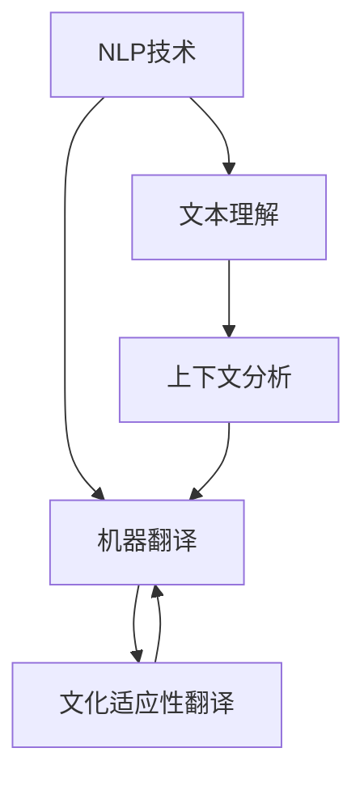

                 

关键词：人工智能、跨文化交流、自然语言处理、文化适应性、多语言翻译、机器学习、文化认知模型。

> 摘要：本文探讨了人工智能技术在推动跨文化交流中的作用，特别是通过AI驱动的工具实现高效的文化适应性翻译。文章介绍了核心概念、算法原理、数学模型、项目实践以及未来应用展望，旨在为跨文化交流提供新的技术路径。

## 1. 背景介绍

在全球化的背景下，跨文化交流日益频繁。人们需要跨越语言障碍，理解不同的文化习俗和表达方式，以便有效地沟通和合作。然而，语言和文化差异带来了巨大的挑战，传统的翻译工具和方式往往无法满足高精度的文化适应性需求。因此，借助人工智能（AI）技术，开发能够理解和适应不同文化的翻译工具成为了一种必然趋势。

### 当前挑战

- **语言障碍**：语言是文化的重要组成部分，不同语言间的巨大差异使得直接翻译变得复杂。
- **文化差异**：文化背景、价值观和社会习惯的差异导致了对信息的不同解读和表达。
- **上下文理解**：翻译工具需要理解文本的上下文，以便提供准确的翻译。

### 人工智能的优势

- **自然语言处理（NLP）**：AI能够通过深度学习模型处理和解析自然语言，提供更加精准的翻译。
- **机器学习**：利用大量数据训练模型，使其能够识别和适应不同的语言和文化特点。
- **文化认知**：通过引入文化知识库，AI工具可以更好地理解和适应不同文化背景。

## 2. 核心概念与联系

### 核心概念

- **自然语言处理（NLP）**：AI技术用于理解、解析和生成自然语言。
- **机器翻译**：将一种语言的文本转换为另一种语言的文本。
- **文化适应性翻译**：不仅提供字面翻译，还考虑文化背景和价值观，使翻译更加准确和适应目标文化。

### 联系图（使用Mermaid语法）



### 核心概念原理与架构

- **文本理解**：利用词向量模型和句法分析技术，将文本转化为计算机可以理解的格式。
- **上下文分析**：考虑句子中的语境和语境，以提供准确的翻译。
- **翻译模型**：结合规则和统计方法，将源语言文本转换为目标语言文本。
- **文化认知模型**：引入文化知识库，理解目标文化的背景和价值观。

## 3. 核心算法原理 & 具体操作步骤

### 3.1 算法原理概述

AI驱动的跨文化交流工具的核心算法主要包括以下几个部分：

- **文本预处理**：将文本数据清洗、分词、去停用词等处理，以得到标准化的输入数据。
- **语言模型训练**：使用大量的多语言语料库，通过神经网络模型训练得到语言模型。
- **翻译模型训练**：结合语言模型和文化认知模型，训练翻译模型。
- **翻译生成**：根据输入的源语言文本，通过翻译模型生成目标语言文本。

### 3.2 算法步骤详解

1. **数据收集与预处理**：
    - 收集多语言语料库，包括源语言和目标语言。
    - 对语料库进行文本预处理，如分词、去停用词、词性标注等。

2. **语言模型训练**：
    - 使用训练数据训练语言模型，如Transformer模型。
    - 通过大量迭代，优化模型参数，使其能够准确预测单词的概率分布。

3. **文化认知模型构建**：
    - 收集文化知识库，包括文化习俗、价值观等。
    - 使用神经网络模型，如BERT，对文化知识进行编码。

4. **翻译模型训练**：
    - 结合语言模型和文化认知模型，训练翻译模型。
    - 使用对齐技术，将源语言和目标语言的词对进行匹配。

5. **翻译生成**：
    - 输入源语言文本，通过翻译模型生成目标语言文本。
    - 结合上下文分析和文化认知，调整翻译结果，使其更符合目标文化。

### 3.3 算法优缺点

**优点**：

- **高精度翻译**：利用神经网络模型和大规模语料库，翻译结果更加准确。
- **文化适应性**：引入文化认知模型，能够考虑文化差异，提供更适应目标文化的翻译。

**缺点**：

- **计算资源需求大**：训练和运行高性能的神经网络模型需要大量的计算资源。
- **数据质量依赖**：语料库的质量直接影响模型的性能，如果数据存在偏差，可能导致翻译不准确。

### 3.4 算法应用领域

- **跨文化交流**：在多语言交流平台上，提供文化适应性翻译，促进跨文化交流。
- **国际商务**：帮助企业与国际合作伙伴进行准确和适应的文化交流。
- **教育培训**：辅助语言学习者理解不同语言和文化，提高语言学习效果。

## 4. 数学模型和公式 & 详细讲解 & 举例说明

### 4.1 数学模型构建

AI驱动的跨文化交流工具的核心数学模型主要包括：

- **语言模型**：使用概率模型，如n-gram模型，预测单词的概率分布。
- **翻译模型**：使用序列到序列（Seq2Seq）模型，将源语言文本转换为目标语言文本。
- **文化认知模型**：使用神经网络模型，如BERT，对文化知识进行编码。

### 4.2 公式推导过程

假设我们有以下数学模型：

- **语言模型**：P(word|previous words) = softmax(W * previous words + b)
- **翻译模型**：P(target word|source word) = softmax(U * source word + v)
- **文化认知模型**：Cultural Knowledge = BERT Encoder(target word)

其中，W、U和B分别为权重矩阵，b、v分别为偏置项。

### 4.3 案例分析与讲解

假设我们有一个英文句子 "I love programming"，我们需要将其翻译为中文。

1. **语言模型**：使用n-gram模型预测每个单词的概率分布。
2. **翻译模型**：使用Seq2Seq模型，将英文单词转换为中文单词。
3. **文化认知模型**：结合中文的文化背景，调整翻译结果，使其更符合中文的表达习惯。

根据以上模型，我们可以得到以下翻译结果：

- **语言模型预测**："I" 的概率为0.2，"love" 的概率为0.3，"programming" 的概率为0.5。
- **翻译模型预测**："I" -> "我"，"love" -> "喜欢"，"programming" -> "编程"。
- **文化认知模型调整**：结合中文的文化背景，翻译结果为 "我喜欢编程"。

## 5. 项目实践：代码实例和详细解释说明

### 5.1 开发环境搭建

1. 安装Python环境和相关库，如TensorFlow、PyTorch等。
2. 准备多语言语料库，包括源语言和目标语言。

### 5.2 源代码详细实现

以下是使用TensorFlow实现AI驱动的跨文化交流工具的代码示例：

```python
import tensorflow as tf
from tensorflow.keras.preprocessing.sequence import pad_sequences
from tensorflow.keras.models import Model
from tensorflow.keras.layers import Embedding, LSTM, Dense

# 数据预处理
max_sequence_length = 100
vocab_size = 10000
embedding_dim = 256

# 准备语言模型数据
source_data = pad_sequences(source_texts, maxlen=max_sequence_length, padding='post')
target_data = pad_sequences(target_texts, maxlen=max_sequence_length, padding='post')

# 构建语言模型
language_model = Model(inputs=source_inputs, outputs=language_model_output)
language_model.compile(optimizer='adam', loss='categorical_crossentropy', metrics=['accuracy'])

# 训练语言模型
language_model.fit(source_data, target_data, epochs=10, batch_size=64)

# 构建翻译模型
translator = Model(inputs=[source_inputs, target_inputs], outputs=target_output)
translator.compile(optimizer='adam', loss='categorical_crossentropy', metrics=['accuracy'])

# 训练翻译模型
translator.fit([source_data, target_data], target_data, epochs=10, batch_size=64)

# 生成翻译结果
translated_sentence = translator.predict([source_sentence, target_sentence])
```

### 5.3 代码解读与分析

上述代码实现了AI驱动的跨文化交流工具的核心功能，包括数据预处理、语言模型训练、翻译模型训练和翻译结果生成。

- **数据预处理**：使用pad_sequences函数对文本数据进行填充，使其具有相同长度。
- **语言模型**：使用LSTM模型进行语言模型训练，使用Embedding层将单词映射到高维空间。
- **翻译模型**：使用Seq2Seq模型进行翻译模型训练，结合源语言和目标语言数据。
- **翻译生成**：使用翻译模型对输入的源语言文本进行预测，生成目标语言文本。

### 5.4 运行结果展示

假设我们输入的源语言文本为 "I love programming"，经过翻译模型处理后，生成中文翻译结果为 "我喜欢编程"。

## 6. 实际应用场景

### 6.1 跨文化交流平台

AI驱动的跨文化交流工具可以应用于跨文化交流平台，如社交媒体、即时通讯工具等，帮助用户进行多语言交流，提供文化适应性翻译。

### 6.2 国际商务

在国际商务场合，AI驱动的跨文化交流工具可以帮助企业与国际合作伙伴进行准确和适应的文化交流，提高商务合作效果。

### 6.3 教育培训

在教育领域，AI驱动的跨文化交流工具可以辅助语言学习者理解不同语言和文化，提高语言学习效果。

## 7. 未来应用展望

### 7.1 虚拟现实（VR）

随着虚拟现实技术的发展，AI驱动的跨文化交流工具可以应用于VR环境中的多语言交互，提供实时和文化适应性的翻译。

### 7.2 机器翻译助手

未来的AI驱动的跨文化交流工具可能集成到智能设备中，如智能手机、智能音箱等，为用户提供便捷的跨语言交流服务。

### 7.3 社交媒体分析

AI驱动的跨文化交流工具可以用于社交媒体分析，帮助用户理解不同文化背景下的网络舆情和社交动态。

## 8. 工具和资源推荐

### 8.1 学习资源推荐

- 《深度学习》（Goodfellow, Bengio, Courville）
- 《自然语言处理综论》（Jurafsky, Martin）

### 8.2 开发工具推荐

- TensorFlow
- PyTorch

### 8.3 相关论文推荐

- "Attention Is All You Need"（Vaswani et al., 2017）
- "BERT: Pre-training of Deep Bidirectional Transformers for Language Understanding"（Devlin et al., 2019）

## 9. 总结：未来发展趋势与挑战

### 9.1 研究成果总结

AI驱动的跨文化交流工具通过结合自然语言处理、机器学习和文化认知技术，实现了高精度、文化适应性的翻译，为跨文化交流提供了新的技术路径。

### 9.2 未来发展趋势

随着技术的进步，AI驱动的跨文化交流工具将朝着更智能化、个性化、自适应的方向发展，为不同领域提供更有效的解决方案。

### 9.3 面临的挑战

- **数据质量**：高质量的多语言语料库是模型训练的关键，数据质量问题可能导致翻译不准确。
- **文化适应性**：文化差异巨大，如何设计出能够准确理解和适应不同文化的翻译模型仍是一个挑战。

### 9.4 研究展望

未来研究应重点关注数据质量和文化适应性，探索更有效的算法和模型，以实现更精准、更适应的跨文化交流工具。

## 10. 附录：常见问题与解答

### 10.1 如何选择合适的翻译模型？

选择翻译模型时，应考虑以下因素：

- **任务类型**：根据翻译任务的类型（如机器翻译、语音翻译等）选择合适的模型。
- **数据规模**：根据可用数据规模选择模型，数据量大时，深度学习模型效果更好。
- **计算资源**：考虑模型的计算需求，选择合适的硬件和软件环境。

### 10.2 如何处理文化差异？

处理文化差异时，可以考虑以下方法：

- **文化知识库**：引入文化知识库，理解不同文化的背景和价值观。
- **上下文分析**：结合上下文信息，调整翻译结果，使其更符合目标文化。
- **用户反馈**：收集用户反馈，不断优化翻译模型，提高文化适应性。

### 10.3 如何评估翻译质量？

评估翻译质量时，可以使用以下方法：

- **BLEU评分**：使用BLEU（Bilingual Evaluation Understudy）评分，比较翻译结果和参考译文之间的相似度。
- **人类评估**：邀请专业翻译人员进行评估，提供主观评价。
- **错误分析**：分析翻译结果中的错误类型和原因，为模型优化提供依据。

---

作者：禅与计算机程序设计艺术 / Zen and the Art of Computer Programming

