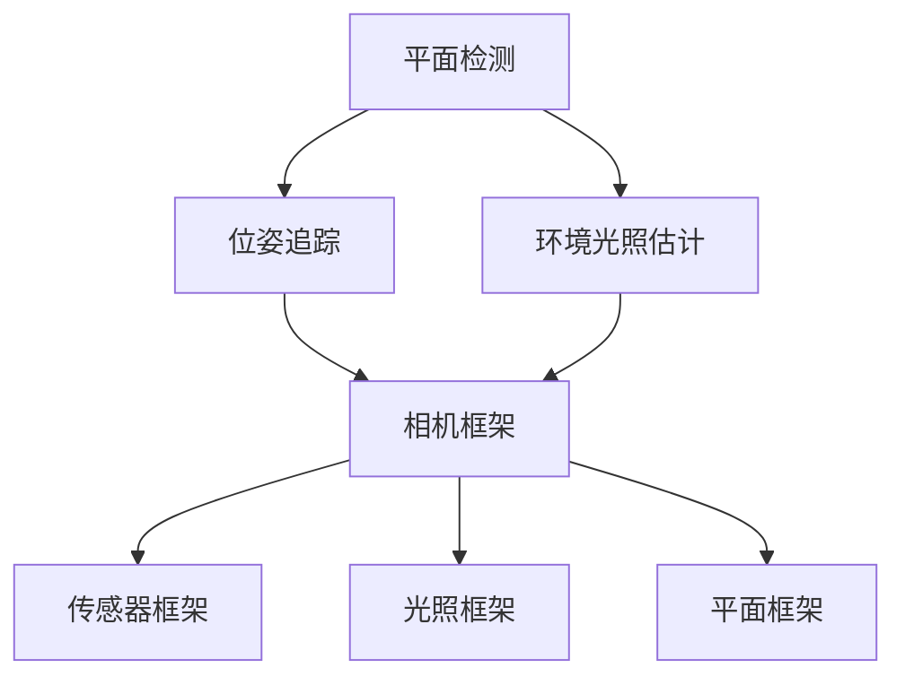

                 

关键词：ARCore，Android，增强现实，应用开发，最佳实践

> 摘要：本文将详细介绍 Google 推出的 ARCore 开发工具包，其在 Android 平台上的应用及其构建 AR 应用的最佳实践。通过本文的学习，开发者将能够深入了解 ARCore 的核心概念、功能特点以及实际应用场景，从而为 Android 平台的 AR 应用开发提供有力的技术支持。

## 1. 背景介绍

随着移动设备的普及和智能手机性能的提升，增强现实（AR）技术在近年来得到了广泛关注。AR 技术通过将虚拟信息与现实世界进行融合，为用户提供了全新的交互体验。Google 旗下的 ARCore 开发工具包正是为了满足这一需求而推出的。

ARCore 是一款专为 Android 开发者设计的增强现实开发工具包。它通过利用智能手机的摄像头、传感器和处理器等硬件资源，实现了一系列 AR 功能，如平面检测、位姿追踪、环境光照估计等。ARCore 的推出，使得开发者能够更加轻松地在 Android 平台上构建高质量的 AR 应用。

## 2. 核心概念与联系

### 2.1 ARCore 的核心概念

ARCore 的核心概念主要包括以下几个方面：

1. **平面检测（Plane Detection）**：平面检测是 ARCore 的一个重要功能，它能够识别并跟踪现实世界中的平面物体，如桌子、墙壁等。

2. **位姿追踪（Motion Tracking）**：位姿追踪是指通过使用智能手机的传感器，如加速度计和陀螺仪，来追踪用户的位置和移动。

3. **环境光照估计（Environmental Lighting Estimation）**：环境光照估计功能可以自动调整 AR 应用的光照效果，使其与现实环境更加匹配。

### 2.2 ARCore 的架构

ARCore 的架构包括以下几个主要组件：

1. **相机框架（Camera Framework）**：相机框架提供了对设备摄像头的访问，并实现了一系列的预处理操作，如图像增强、裁剪等。

2. **传感器框架（Sensor Framework）**：传感器框架集成了设备上的各种传感器，如加速度计、陀螺仪等，用于实现位姿追踪等功能。

3. **光照框架（Light Framework）**：光照框架可以根据环境光照情况自动调整 AR 应用的光照效果。

4. **平面框架（Plane Framework）**：平面框架用于检测并跟踪现实世界中的平面物体。

### 2.3 Mermaid 流程图

下面是一个 ARCore 的 Mermaid 流程图，展示了其核心概念和架构之间的关系：



## 3. 核心算法原理 & 具体操作步骤

### 3.1 算法原理概述

ARCore 使用了一系列的算法来实现在 Android 平台上的增强现实功能。这些算法包括：

1. **平面检测算法**：平面检测算法通过分析摄像头捕获的图像，识别并跟踪平面物体。

2. **位姿追踪算法**：位姿追踪算法使用传感器数据来计算设备的位姿（位置和方向）。

3. **环境光照估计算法**：环境光照估计算法通过分析图像中的颜色和亮度信息，自动调整 AR 应用的光照效果。

### 3.2 算法步骤详解

1. **平面检测算法步骤**：

   - 捕获摄像头图像；
   - 使用图像预处理技术，如高斯模糊、二值化等，提取图像的特征；
   - 使用机器学习算法，如支持向量机（SVM），对特征进行分类，识别平面物体。

2. **位姿追踪算法步骤**：

   - 使用加速度计和陀螺仪数据，计算设备的角速度和加速度；
   - 使用卡尔曼滤波算法，对传感器数据进行滤波，消除噪声；
   - 使用积分算法，将角速度和加速度转换为位姿（位置和方向）。

3. **环境光照估计算法步骤**：

   - 分析图像中的颜色和亮度信息；
   - 使用机器学习算法，如神经网络，学习环境光照模型；
   - 根据环境光照模型，调整 AR 应用的光照效果。

### 3.3 算法优缺点

1. **平面检测算法**：

   - 优点：能够准确识别并跟踪平面物体，提高 AR 应用的稳定性。
   - 缺点：对图像的预处理和特征提取过程较为复杂，计算资源消耗较大。

2. **位姿追踪算法**：

   - 优点：能够实时计算设备的位姿，提高 AR 应用的交互性。
   - 缺点：对传感器数据的精度要求较高，否则容易产生漂移。

3. **环境光照估计算法**：

   - 优点：能够自动调整 AR 应用的光照效果，提高视觉体验。
   - 缺点：对机器学习算法的模型训练和数据集要求较高，否则效果可能不理想。

### 3.4 算法应用领域

ARCore 的算法在多个领域具有广泛的应用：

1. **游戏**：ARCore 可以用于开发 AR 游戏，如《我的世界》、《 Pokemon Go》等。
2. **教育**：ARCore 可以用于开发教育应用，如虚拟实验室、历史场景重现等。
3. **零售**：ARCore 可以用于开发零售应用，如虚拟试衣、家居装修等。

## 4. 数学模型和公式 & 详细讲解 & 举例说明

### 4.1 数学模型构建

在 ARCore 中，数学模型主要用于实现平面检测、位姿追踪和环境光照估计等功能。以下是一个简单的数学模型示例：

$$
\begin{align*}
P &= C * R * T \\
Q &= A * B
\end{align*}
$$

其中，$P$ 表示位姿（位置和方向），$C$ 表示相机矩阵，$R$ 表示旋转矩阵，$T$ 表示平移矩阵，$A$ 和 $B$ 分别表示加速度计和陀螺仪的数据。

### 4.2 公式推导过程

以下是平面检测算法的推导过程：

$$
\begin{align*}
f(x, y) &= 1 \quad \text{if the pixel at (x, y) is a plane} \\
f(x, y) &= 0 \quad \text{otherwise}
\end{align*}
$$

其中，$f(x, y)$ 表示像素点的分类结果。

### 4.3 案例分析与讲解

以下是一个位姿追踪算法的案例分析：

假设设备在时间 $t$ 时的位姿为 $P_t$，加速度计和陀螺仪的数据分别为 $A_t$ 和 $B_t$。使用卡尔曼滤波算法，可以推导出时间 $t+1$ 时的位姿 $P_{t+1}$：

$$
\begin{align*}
P_{t+1} &= C * R_{t+1} * T_{t+1} \\
R_{t+1} &= R_t * \Omega_t \\
T_{t+1} &= T_t + v_t * \Delta t + \frac{1}{2} * a_t * (\Delta t)^2
\end{align*}
$$

其中，$\Omega_t$ 表示陀螺仪的角速度，$v_t$ 表示加速度，$a_t$ 表示加速度计的测量值，$\Delta t$ 表示时间间隔。

## 5. 项目实践：代码实例和详细解释说明

### 5.1 开发环境搭建

在开始项目实践之前，需要先搭建开发环境。以下是一个基本的开发环境搭建步骤：

1. 安装 Android Studio；
2. 创建一个新的 Android 项目；
3. 在项目中添加 ARCore 库；
4. 配置项目中的权限。

### 5.2 源代码详细实现

以下是一个简单的 ARCore 应用示例：

```java
import com.google.ar.core.ArSession;
import com.google.ar.core.Frame;
import com.google.ar.core.Plane;
import com.google.ar.core.Session;

public class ARCoreDemo {
    private ArSession arSession;

    public void onCreate() {
        // 创建 ARSession
        arSession = ArSession.createSession(context);

        // 配置 ARSession
        arSession.setCameraPermissionEnabled(true);
        arSession.setPlaneDetectionEnabled(true);

        // 开始 ARSession
        arSession.runOnDrawFrame(this::onDrawFrame);
    }

    private void onDrawFrame() {
        // 获取当前帧
        Frame frame = arSession.getImageCaptureFrame();

        // 检测平面
        List<Plane> planes = arSession.getPlanes();

        // 绘制平面
        for (Plane plane : planes) {
            // 绘制平面边界
            drawPlaneBoundary(plane);

            // 绘制平面上的点
            drawPointsOnPlane(plane);
        }
    }

    private void drawPlaneBoundary(Plane plane) {
        // 绘制平面边界
    }

    private void drawPointsOnPlane(Plane plane) {
        // 绘制平面上的点
    }

    public void onDestroy() {
        // 释放 ARSession
        arSession.release();
    }
}
```

### 5.3 代码解读与分析

以上代码示例展示了如何使用 ARCore 创建一个简单的 AR 应用。代码中主要包括以下几个部分：

1. **创建 ARSession**：使用 `ArSession.createSession(context)` 创建 ARSession。
2. **配置 ARSession**：设置相机权限和平面检测功能。
3. **开始 ARSession**：使用 `arSession.runOnDrawFrame(this::onDrawFrame)` 开始 ARSession。
4. **绘制平面**：在 `onDrawFrame` 方法中，获取当前帧并检测平面，然后绘制平面边界和点。
5. **释放 ARSession**：在 `onDestroy` 方法中，释放 ARSession。

### 5.4 运行结果展示

运行以上代码后，会打开一个 AR 应用界面，显示现实世界中的平面物体。用户可以在屏幕上绘制点，实现对平面的交互。

## 6. 实际应用场景

ARCore 在多个领域具有广泛的应用：

1. **游戏**：ARCore 可以用于开发 AR 游戏，如《我的世界》、《 Pokemon Go》等。
2. **教育**：ARCore 可以用于开发教育应用，如虚拟实验室、历史场景重现等。
3. **零售**：ARCore 可以用于开发零售应用，如虚拟试衣、家居装修等。

### 6.4 未来应用展望

随着 AR 技术的不断发展和普及，ARCore 在未来的应用场景将更加广泛。以下是一些未来应用展望：

1. **医疗**：ARCore 可以用于医疗领域，如手术导航、患者教育等。
2. **制造**：ARCore 可以用于制造业，如设备维护、产品组装等。
3. **军事**：ARCore 可以用于军事领域，如战场导航、目标识别等。

## 7. 工具和资源推荐

### 7.1 学习资源推荐

1. **官方文档**：Google ARCore 官方文档是学习 ARCore 的最佳资源。
2. **教程和课程**：网络上有很多关于 ARCore 的教程和课程，如 Udacity、Coursera 等。

### 7.2 开发工具推荐

1. **Android Studio**：Android Studio 是开发 ARCore 应用必备的 IDE。
2. **Unity**：Unity 是一款流行的游戏开发引擎，支持 ARCore。

### 7.3 相关论文推荐

1. **"ARCore: An Android Augmented Reality SDK"**：这是 ARCore 的官方论文，详细介绍了 ARCore 的设计理念和实现方法。
2. **"Mobile AR: A Survey"**：这是一篇关于移动 AR 技术的综述论文，涵盖了 AR 技术的各个方面。

## 8. 总结：未来发展趋势与挑战

### 8.1 研究成果总结

ARCore 自推出以来，取得了显著的成果。它为 Android 开发者提供了一系列强大的 AR 功能，推动了 AR 技术在移动平台上的发展。同时，ARCore 也成为了一个开放、可扩展的 AR 开发平台，吸引了大量的开发者加入。

### 8.2 未来发展趋势

未来，ARCore 将继续朝着以下几个方面发展：

1. **性能优化**：随着移动设备性能的提升，ARCore 将进一步优化性能，提供更高质量的 AR 体验。
2. **功能扩展**：ARCore 将引入更多的 AR 功能，如三维空间感知、声音 AR 等。
3. **生态建设**：ARCore 将与更多的第三方开发工具和平台进行合作，构建一个完善的 AR 开发生态。

### 8.3 面临的挑战

尽管 ARCore 取得了显著的成果，但它仍然面临着一些挑战：

1. **性能瓶颈**：在复杂场景下，ARCore 的性能可能无法满足用户的需求。
2. **开发者门槛**：对于初学者来说，ARCore 的学习曲线较高，需要一定的技术基础。
3. **标准化**：ARCore 需要与更多的设备和操作系统进行兼容，实现标准化。

### 8.4 研究展望

未来，ARCore 的研究将聚焦于以下几个方面：

1. **算法优化**：通过优化算法，提高 ARCore 的性能和稳定性。
2. **跨平台支持**：实现 ARCore 在更多平台的支持，如 iOS、Web 等。
3. **生态扩展**：构建一个更加丰富、多样化的 AR 开发生态。

## 9. 附录：常见问题与解答

### 9.1 问题1：如何获取 ARCore？

解答：可以在 Google ARCore 官网（https://arcore.google.com/）下载 ARCore SDK，或者通过 Android Studio 的插件市场安装。

### 9.2 问题2：ARCore 是否支持 iOS？

解答：ARCore 目前仅支持 Android 平台，但 Google 已宣布将推出 ARCore for iOS，预计未来会支持 iOS。

### 9.3 问题3：如何使用 ARCore 进行平面检测？

解答：使用 ARCore 进行平面检测需要以下几个步骤：

1. 创建 ARSession；
2. 获取当前帧；
3. 调用 `arSession.getPlanes()` 获取平面列表；
4. 对每个平面进行处理，如绘制、交互等。

----------------------------------------------------------------

作者：禅与计算机程序设计艺术 / Zen and the Art of Computer Programming

以上就是本文关于 ARCore 开发工具包教程：在 Android 平台上构建 AR 应用的最佳实践的详细讲解。希望本文能为 Android 平台的 AR 应用开发者提供有价值的参考和指导。如果您有任何问题或建议，欢迎在评论区留言讨论。谢谢！

