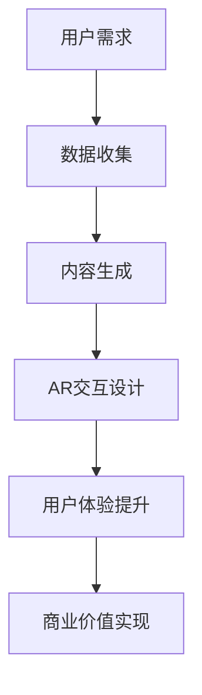

                 

关键词：增强现实（AR）、注意力经济、用户参与度、用户体验、交互设计、商业模式创新、数据驱动发展

> 摘要：随着增强现实（AR）技术的迅猛发展，其在注意力经济中的应用前景愈发广阔。本文旨在探讨AR技术在当前注意力经济背景下的应用价值、核心原理、具体操作步骤及其面临的挑战，并对未来发展趋势与商业模式的创新进行展望。

## 1. 背景介绍

随着互联网技术的不断进步，数字信息的传播速度与多样性达到了前所未有的高度。在此背景下，用户的注意力资源变得越来越稀缺，形成了所谓的“注意力经济”。注意力经济强调的是如何通过吸引和维持用户的注意力来创造经济价值。在这个过程中，增强现实（AR）技术因其能够提供沉浸式的交互体验，而成为提升用户参与度和增强用户体验的关键工具。

### 1.1 注意力经济

注意力经济源于经济学中的稀缺性理论，即当资源（如时间、注意力等）稀缺时，其价值会相应提升。在数字时代，用户的注意力成为一种特殊的资源，因为人们能用于上网、消费内容的时间是有限的。因此，如何通过创造性地吸引并维持用户的注意力，成为众多企业和商家竞相追求的目标。

### 1.2 增强现实技术

增强现实（AR）是一种将虚拟信息与现实世界融合的技术。通过AR技术，用户可以在现实环境中看到、听到、触摸和与计算机生成的虚拟对象进行交互。AR技术的核心在于其沉浸式体验，这种体验能够显著提升用户的参与度和满意度。

## 2. 核心概念与联系

为了更好地理解AR技术在注意力经济中的应用，我们需要探讨几个核心概念，包括用户体验、交互设计、商业模式创新等。

### 2.1 用户体验

用户体验（UX）是衡量用户在使用产品或服务过程中的满意度和参与度的重要指标。在注意力经济中，提升用户体验成为吸引和维持用户注意力的关键。AR技术通过提供丰富的互动性和视觉体验，可以显著提升用户的参与感和满意度。

### 2.2 交互设计

交互设计是设计学中的一个重要分支，专注于用户与产品或服务之间的互动。在AR技术中，交互设计尤为重要，因为用户的体验很大程度上取决于他们与虚拟对象的互动方式。优秀的交互设计能够提升用户的操作效率，增加他们的沉浸感。

### 2.3 商业模式创新

商业模式创新是企业在竞争激烈的市场中获得优势的重要手段。AR技术的应用为商业模式创新提供了新的可能性。例如，通过AR技术，企业可以创造全新的产品和服务，以吸引并留住用户。

### 2.4 Mermaid 流程图

下面是一个简化的AR技术在注意力经济中的应用流程图：



## 3. 核心算法原理 & 具体操作步骤

### 3.1 算法原理概述

AR技术涉及多个核心算法，包括图像识别、位置追踪、实时渲染等。这些算法共同作用，实现了虚拟信息与现实环境的无缝融合。

#### 3.1.1 图像识别

图像识别是AR技术的基石之一，它通过深度学习等技术，从摄像头捕捉的图像中识别出特定对象或场景。

#### 3.1.2 位置追踪

位置追踪算法确保虚拟信息与现实环境的准确对齐。常用的方法包括视觉SLAM（同步定位与映射）和惯性测量单元（IMU）。

#### 3.1.3 实时渲染

实时渲染是将虚拟信息以流畅的方式呈现给用户的必要技术。通过图形处理单元（GPU）和渲染引擎，实现高质量的视觉效果。

### 3.2 算法步骤详解

下面是一个简化的AR技术应用流程：

#### 3.2.1 数据收集

- 通过摄像头捕捉现实环境中的图像。
- 利用图像识别算法，标记出场景中的特定对象。

#### 3.2.2 内容生成

- 根据用户需求和场景信息，生成相应的虚拟内容。
- 内容可以是3D模型、动画或文本。

#### 3.2.3 AR交互设计

- 设计用户与虚拟内容之间的互动方式。
- 包括手势识别、语音控制等。

#### 3.2.4 用户体验提升

- 通过实时渲染技术，确保虚拟内容的质量和流畅度。
- 根据用户反馈，不断优化交互体验。

### 3.3 算法优缺点

#### 3.3.1 优点

- 提供沉浸式体验，显著提升用户的参与度和满意度。
- 拓展了数字内容的呈现方式，为商业模式创新提供了新的可能。

#### 3.3.2 缺点

- 对硬件要求较高，成本较高。
- 技术实现复杂，开发难度大。

### 3.4 算法应用领域

- 游戏和娱乐
- 教育和培训
- 零售和营销
- 医疗和健康
- 工业和制造

## 4. 数学模型和公式 & 详细讲解 & 举例说明

### 4.1 数学模型构建

在AR技术中，位置追踪和图像识别通常涉及以下数学模型：

#### 4.1.1 位置追踪

- 惯性测量单元（IMU）模型：

\[ \mathbf{p}_{IMU} = \mathbf{p}_{initial} + \mathbf{v}_{initial} \cdot t + \frac{1}{2} \mathbf{a} \cdot t^2 \]

- 视觉SLAM模型：

\[ \mathbf{T}_{camera} = \mathbf{T}_{previous} \cdot \mathbf{R}(\theta) \]

#### 4.1.2 图像识别

- 卷积神经网络（CNN）模型：

\[ \mathbf{f}(\mathbf{x}; \mathbf{w}) = \text{ReLU}(\mathbf{w} \cdot \mathbf{x}) \]

### 4.2 公式推导过程

#### 4.2.1 位置追踪

- 惯性测量单元（IMU）模型推导：

\[ \mathbf{p}_{current} = \mathbf{p}_{initial} + \mathbf{v}_{initial} \cdot t + \frac{1}{2} \mathbf{a} \cdot t^2 \]

其中，\(\mathbf{p}_{current}\) 是当前的位置，\(\mathbf{p}_{initial}\) 是初始位置，\(\mathbf{v}_{initial}\) 是初始速度，\(\mathbf{a}\) 是加速度，\(t\) 是时间。

- 视觉SLAM模型推导：

\[ \mathbf{T}_{camera} = \mathbf{T}_{previous} \cdot \mathbf{R}(\theta) \]

其中，\(\mathbf{T}_{camera}\) 是摄像机的位置和姿态，\(\mathbf{T}_{previous}\) 是前一个时刻的位置和姿态，\(\mathbf{R}(\theta)\) 是旋转矩阵，\(\theta\) 是旋转角度。

#### 4.2.2 图像识别

- 卷积神经网络（CNN）模型推导：

\[ \mathbf{f}(\mathbf{x}; \mathbf{w}) = \text{ReLU}(\mathbf{w} \cdot \mathbf{x}) \]

其中，\(\mathbf{f}(\mathbf{x}; \mathbf{w})\) 是激活函数，\(\mathbf{x}\) 是输入特征，\(\mathbf{w}\) 是权重。

### 4.3 案例分析与讲解

假设我们有一个简单的图像识别任务，目标是识别图像中的猫。

#### 4.3.1 数据集准备

我们使用一个包含1000张猫的图像数据集。

#### 4.3.2 模型构建

我们构建一个简单的卷积神经网络（CNN），包含一个卷积层、一个池化层和一个全连接层。

\[ \mathbf{f}(\mathbf{x}; \mathbf{w}) = \text{ReLU}(\mathbf{w} \cdot \mathbf{x}) \]

#### 4.3.3 训练过程

我们使用梯度下降算法对模型进行训练，通过反向传播算法更新权重。

#### 4.3.4 预测过程

对于新的图像，我们通过模型输出得到预测结果，判断图像中是否包含猫。

## 5. 项目实践：代码实例和详细解释说明

### 5.1 开发环境搭建

在本节中，我们将使用Unity游戏引擎和Vuforia AR开发平台来构建一个简单的AR应用。

#### 5.1.1 Unity安装

- 访问Unity官方网站（https://unity.com/）下载最新版本的Unity编辑器。
- 安装完成后，启动Unity编辑器。

#### 5.1.2 Vuforia安装

- 在Unity编辑器中，选择“窗口”>“包管理器”。
- 搜索“Vuforia”并安装。

### 5.2 源代码详细实现

下面是一个简单的AR应用的Unity C#代码实例：

```csharp
using UnityEngine;

public class ARMarker : MonoBehaviour
{
    public GameObject markerPrefab;

    private void Start()
    {
        // 初始化Vuforia
        VuforiaARCore.Instance.Init();
        
        // 创建标记
        GameObject marker = Instantiate(markerPrefab);
        marker.transform.position = Camera.main.transform.position + new Vector3(0, 0, 5);
        marker.transform.rotation = Camera.main.transform.rotation;
    }

    private void Update()
    {
        // 检测标记
        if (Input.GetKeyDown(KeyCode.Space))
        {
            VuforiaARCore.Instance.TrackImage("ARMarkerImage");
        }
    }
}
```

### 5.3 代码解读与分析

- `Start` 方法在场景加载时调用，用于初始化Vuforia并创建一个标记对象。
- `Update` 方法在每一帧调用，用于检测用户是否按下了空格键来触发标记的创建。

### 5.4 运行结果展示

运行应用后，用户可以看到一个虚拟的标记对象出现在摄像头视野中。通过按下空格键，用户可以创建更多的标记对象。

## 6. 实际应用场景

AR技术在注意力经济中的应用非常广泛，以下是一些具体的场景：

### 6.1 游戏和娱乐

AR游戏提供了全新的沉浸式体验，例如《Pokemon GO》和《Ingress》。这些游戏通过AR技术将虚拟角色和场景与现实世界融合，吸引了大量用户。

### 6.2 教育和培训

AR技术可以用于教育内容的呈现，例如历史事件的虚拟重现、科学实验的互动演示等。这种交互式学习方式能够显著提升学生的学习兴趣和参与度。

### 6.3 零售和营销

AR技术可以用于零售店铺的虚拟试衣、产品的360度旋转展示等。通过增强用户的购物体验，提高销售转化率。

### 6.4 医疗和健康

AR技术可以用于医疗教育和手术模拟。医生可以通过AR设备查看患者的实时数据，进行更精准的诊断和治疗。

### 6.5 工业和制造

AR技术可以用于工业维护、设备操作指导等。通过AR设备，工人可以实时查看设备的状态和维护步骤，提高工作效率和安全性。

## 7. 工具和资源推荐

### 7.1 学习资源推荐

- 《增强现实技术与应用》：详细介绍了AR技术的原理和应用。
- 《Unity 2021游戏开发实战》：涵盖Unity游戏引擎的使用，包括AR开发。

### 7.2 开发工具推荐

- Unity游戏引擎：用于开发跨平台的AR应用。
- Vuforia：提供强大的AR开发平台和工具。

### 7.3 相关论文推荐

- "Augmented Reality: Principles and Practice"：一本全面介绍AR技术的经典著作。
- "Attention, Inference and Memory in Augmented Reality"：探讨AR技术在认知心理学中的应用。

## 8. 总结：未来发展趋势与挑战

### 8.1 研究成果总结

AR技术在注意力经济中的应用已经取得了显著成果。通过提供沉浸式体验，AR技术有效提升了用户的参与度和满意度。同时，AR技术的应用领域也在不断扩展，从娱乐到教育、医疗等多个领域。

### 8.2 未来发展趋势

未来，AR技术将朝着更精细、更智能的方向发展。随着硬件性能的提升和算法的优化，AR体验将更加逼真和自然。此外，AR技术与其他前沿技术的融合，如人工智能、大数据等，也将推动AR技术的进一步创新。

### 8.3 面临的挑战

尽管AR技术前景广阔，但同时也面临着一些挑战。首先，技术实现的复杂性和成本较高，使得广泛应用受到限制。其次，隐私和安全问题也日益凸显，特别是在涉及用户数据的情况下。最后，用户体验的优化仍然是一个重要的研究方向，如何提供更加自然和舒适的AR体验，是一个需要持续探索的问题。

### 8.4 研究展望

未来的研究应重点关注以下几个方面：

- 提高AR技术的性能和可靠性。
- 探索AR技术与人工智能、大数据等前沿技术的融合。
- 加强对隐私和安全问题的研究和解决方案。
- 优化用户体验，提供更加自然和沉浸的AR体验。

## 9. 附录：常见问题与解答

### 9.1 常见问题

- **Q：AR技术有哪些应用领域？**
  - **A：** AR技术的应用领域非常广泛，包括游戏和娱乐、教育和培训、零售和营销、医疗和健康、工业和制造等。

- **Q：AR技术的核心算法是什么？**
  - **A：** AR技术的核心算法包括图像识别、位置追踪、实时渲染等。

- **Q：如何搭建AR开发环境？**
  - **A：** 可以使用Unity游戏引擎和Vuforia AR开发平台来搭建AR开发环境。

### 9.2 解答

- **Q：AR技术有哪些应用领域？**
  - **A：** AR技术的应用领域非常广泛，包括游戏和娱乐、教育和培训、零售和营销、医疗和健康、工业和制造等。例如，《Pokemon GO》利用AR技术将虚拟角色与现实世界融合，提供了全新的娱乐体验。

- **Q：AR技术的核心算法是什么？**
  - **A：** AR技术的核心算法包括图像识别、位置追踪、实时渲染等。图像识别算法用于识别现实世界中的特定对象，位置追踪算法确保虚拟信息与现实环境的准确对齐，实时渲染算法则用于呈现高质量的虚拟内容。

- **Q：如何搭建AR开发环境？**
  - **A：** 可以使用Unity游戏引擎和Vuforia AR开发平台来搭建AR开发环境。首先，下载并安装Unity编辑器，然后安装Vuforia插件，通过这两个工具，可以轻松创建和部署AR应用。

---

作者：禅与计算机程序设计艺术 / Zen and the Art of Computer Programming

