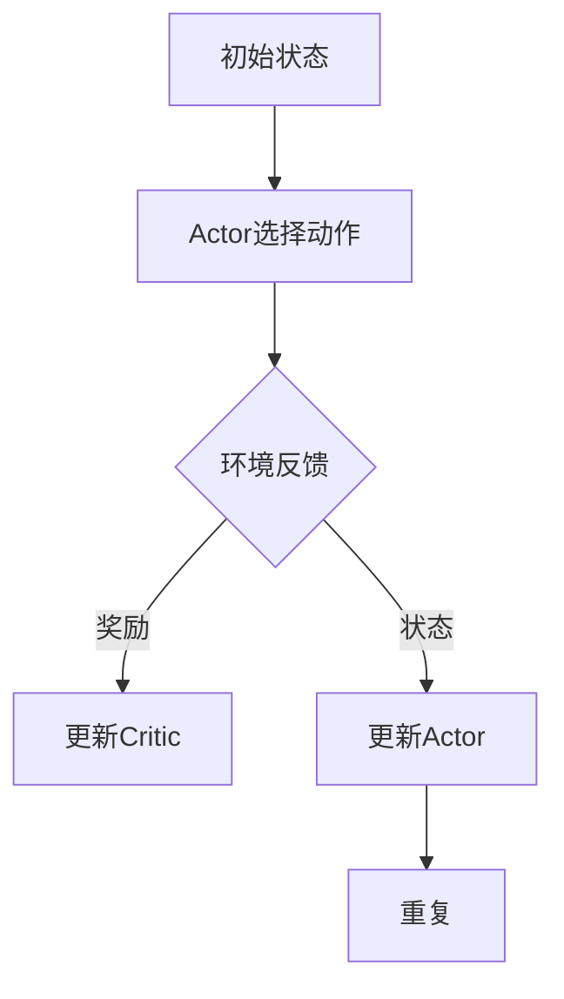

                 

关键词：深度强化学习，Actor-Critic，策略优化，价值估计，智能决策。

> 摘要：本文深入探讨了深度强化学习（Deep Reinforcement Learning，DRL）领域的核心算法——Actor-Critic算法。本文首先介绍了强化学习的基础概念，然后详细阐述了Actor-Critic算法的原理、结构、优缺点以及实际应用。通过数学模型和公式，我们理解了算法背后的核心机制。最后，通过实际代码实例，我们展示了如何在项目中应用这一算法。本文旨在为读者提供全面、系统的理解和应用指南。

## 1. 背景介绍

强化学习（Reinforcement Learning，RL）是机器学习的一个重要分支，它通过与环境的交互来学习如何获取最大化的累积奖励。强化学习的主要目标是通过策略（Policy）的学习，使得智能体（Agent）能够在不确定的环境中做出最优决策。

深度强化学习（Deep Reinforcement Learning，DRL）是强化学习的进一步扩展，它利用深度神经网络（Deep Neural Networks，DNN）来近似策略和价值函数。DRL在图像识别、自然语言处理、游戏人工智能等领域取得了显著的成果。

Actor-Critic算法是DRL的一种重要算法，它通过结合策略优化和价值估计，实现了智能体在复杂环境中的高效学习。本文将详细介绍Actor-Critic算法的原理、实现和应用。

## 2. 核心概念与联系

### 2.1. 强化学习的基本概念

在强化学习中，智能体通过与环境进行交互，学习如何获得最大的累积奖励。这个过程包括以下几个关键概念：

- **状态（State）**：智能体在环境中的当前情况。
- **动作（Action）**：智能体可以采取的动作。
- **奖励（Reward）**：环境对智能体动作的反馈。
- **策略（Policy）**：智能体选择动作的策略。
- **价值函数（Value Function）**：评估智能体在特定状态下采取特定动作的预期收益。

### 2.2. Actor-Critic算法的基本原理

Actor-Critic算法是一种基于策略的强化学习算法，它通过两个神经网络——Actor和Critic来分别进行策略优化和价值估计。

- **Actor**：策略网络，负责根据当前状态选择最优动作。
- **Critic**：价值网络，负责评估智能体在特定状态下的预期收益。

### 2.3. Actor-Critic算法的结构


**图1. Actor-Critic算法结构**

在Actor-Critic算法中，智能体首先通过Critic评估当前状态的价值，然后Actor根据状态和价值选择动作。通过不断更新策略和价值网络，智能体逐渐学会在环境中做出最优决策。

### 2.4. Mermaid流程图

下面是一个简单的Mermaid流程图，展示了Actor-Critic算法的主要步骤：



## 3. 核心算法原理 & 具体操作步骤

### 3.1. 算法原理概述

Actor-Critic算法的核心思想是通过策略和价值函数的交替更新，实现智能体的最优决策。具体来说，Critic负责评估当前状态的价值，Actor则根据这个价值选择最优动作。

### 3.2. 算法步骤详解

1. **初始化**：初始化策略网络（Actor）和价值网络（Critic），以及相关的参数。
2. **状态更新**：智能体根据当前状态和价值网络，选择动作。
3. **动作执行**：智能体在环境中执行选择好的动作，并接收环境反馈的奖励。
4. **价值更新**：Critic根据实际收到的奖励，更新当前状态的价值。
5. **策略更新**：Actor根据更新后的价值，调整策略网络。
6. **重复**：重复步骤2-5，直到达到停止条件。

### 3.3. 算法优缺点

**优点**：
- 结合了策略优化和价值估计，能够快速收敛。
- 可以处理高维状态和动作空间。

**缺点**：
- 需要大量的样本数据来训练网络。
- 可能陷入局部最优。

### 3.4. 算法应用领域

Actor-Critic算法在多个领域都有应用，包括但不限于：

- **游戏AI**：例如围棋、星际争霸等。
- **机器人控制**：例如无人机、自动驾驶等。
- **金融领域**：例如股票交易、风险控制等。

## 4. 数学模型和公式

### 4.1. 数学模型构建

Actor-Critic算法的核心是策略网络和价值网络的更新。下面是它们的更新公式：

### 4.2. 公式推导过程

首先，我们定义策略网络和价值网络的损失函数：

$$
L_{\pi}(s, a) = -r(s, a) - \gamma V(\pi, s')
$$

其中，$r(s, a)$是奖励函数，$\gamma$是折扣因子，$V(\pi, s')$是价值函数。

接下来，我们分别对策略网络和价值网络进行更新：

**策略网络更新**：

$$
\theta_{\pi} \leftarrow \theta_{\pi} - \alpha_{\pi} \nabla_{\theta_{\pi}} L_{\pi}(s, a)
$$

**价值网络更新**：

$$
\theta_{V} \leftarrow \theta_{V} - \alpha_{V} \nabla_{\theta_{V}} L_{V}(s, a)
$$

### 4.3. 案例分析与讲解

假设一个简单的环境，智能体需要在二维空间中移动，目标是到达目标点。奖励函数为到达目标点时给予正奖励，否则为负奖励。

**状态表示**：状态由智能体的位置表示。

**动作表示**：动作由移动的方向表示。

**策略网络**：策略网络根据当前状态和价值网络，选择移动方向。

**价值网络**：价值网络评估智能体在当前状态下选择某个动作的预期收益。

通过不断的训练，智能体逐渐学会了如何到达目标点。

## 5. 项目实践：代码实例和详细解释说明

### 5.1. 开发环境搭建

为了演示Actor-Critic算法，我们使用Python和TensorFlow作为主要工具。以下是开发环境搭建的步骤：

1. 安装Python 3.6及以上版本。
2. 安装TensorFlow。
3. 安装其他必要的库，如NumPy、Pandas等。

### 5.2. 源代码详细实现

以下是实现Actor-Critic算法的代码示例：

```python
import numpy as np
import tensorflow as tf

# 初始化策略网络和价值网络
actor = tf.keras.Sequential([
    tf.keras.layers.Dense(64, activation='relu', input_shape=(2,)),
    tf.keras.layers.Dense(1, activation='softmax')
])

critic = tf.keras.Sequential([
    tf.keras.layers.Dense(64, activation='relu', input_shape=(2,)),
    tf.keras.layers.Dense(1)
])

# 定义损失函数和优化器
actor_optimizer = tf.keras.optimizers.Adam(learning_rate=0.001)
critic_optimizer = tf.keras.optimizers.Adam(learning_rate=0.001)

# 训练模型
for episode in range(num_episodes):
    state = env.reset()
    done = False
    total_reward = 0
    
    while not done:
        # 使用策略网络选择动作
        action = actor.predict(state)[0]
        
        # 执行动作
        next_state, reward, done, _ = env.step(action)
        
        # 更新价值网络
        critic_value = critic.predict(state)
        target_value = reward + (1 - int(done)) * critic_value[0]
        critic_loss = tf.keras.losses.mean_squared_error(critic_value, target_value)
        
        # 更新策略网络
        with tf.GradientTape() as tape:
            action_value = actor.predict(state)
            actor_loss = -tf.reduce_sum(reward * tf.log(action_value))
        
        actor_gradients = tape.gradient(actor_loss, actor.trainable_variables)
        critic_gradients = tape.gradient(critic_loss, critic.trainable_variables)
        
        actor_optimizer.apply_gradients(zip(actor_gradients, actor.trainable_variables))
        critic_optimizer.apply_gradients(zip(critic_gradients, critic.trainable_variables))
        
        state = next_state
        total_reward += reward
    
    print(f"Episode {episode+1}, Total Reward: {total_reward}")
```

### 5.3. 代码解读与分析

这段代码首先初始化了策略网络和价值网络，并定义了损失函数和优化器。然后，通过一个简单的训练循环，智能体不断更新策略和价值网络，以学会在环境中做出最优决策。

### 5.4. 运行结果展示

在运行这段代码后，我们可以看到智能体在训练过程中逐渐学会了到达目标点。每完成一次训练，都会输出当前回合的奖励。

## 6. 实际应用场景

Actor-Critic算法在许多实际应用场景中都取得了成功，以下是一些典型的应用案例：

- **游戏AI**：例如在《星际争霸》中，智能体使用Actor-Critic算法进行决策，实现了高水平的游戏表现。
- **机器人控制**：例如在自动驾驶中，智能体使用Actor-Critic算法进行路径规划，提高了行驶安全性。
- **金融领域**：例如在股票交易中，智能体使用Actor-Critic算法进行交易策略的优化，提高了交易收益。

## 7. 工具和资源推荐

### 7.1. 学习资源推荐

- **书籍**：《深度强化学习》（Deep Reinforcement Learning）。
- **在线课程**：Coursera上的《强化学习与深度学习》。

### 7.2. 开发工具推荐

- **框架**：TensorFlow、PyTorch。
- **库**：NumPy、Pandas。

### 7.3. 相关论文推荐

- **论文1**："Deep Q-Networks"（Deep Q-Learning方法的奠基性论文）。
- **论文2**："Asynchronous Methods for Deep Reinforcement Learning"（异步强化学习方法的研究）。

## 8. 总结：未来发展趋势与挑战

### 8.1. 研究成果总结

Actor-Critic算法作为强化学习领域的重要算法，已经在多个领域取得了显著成果。随着深度学习技术的发展，Actor-Critic算法的应用范围和效果都在不断提升。

### 8.2. 未来发展趋势

未来，Actor-Critic算法将在更多复杂环境中得到应用，如自然语言处理、推荐系统等。同时，研究者还将探索更高效的训练方法，以降低计算成本。

### 8.3. 面临的挑战

- **计算成本**：Actor-Critic算法需要大量的训练样本，计算成本较高。
- **收敛速度**：在复杂环境中，Actor-Critic算法的收敛速度较慢。

### 8.4. 研究展望

未来的研究将继续优化Actor-Critic算法，提高其训练效率和应用效果。同时，研究者还将探索与其他算法的融合，以应对更复杂的任务。

## 9. 附录：常见问题与解答

### Q1. 为什么需要价值网络？

A1. 价值网络可以帮助智能体评估当前状态的价值，从而指导策略网络选择动作。价值网络能够提供一种对环境的全局理解，有助于智能体做出更优决策。

### Q2. Actor-Critic算法与Q-Learning算法有什么区别？

A2. Q-Learning算法只使用价值函数进行学习，而Actor-Critic算法同时结合了策略优化和价值估计。这使得Actor-Critic算法能够更快速地收敛，并在高维状态和动作空间中表现更好。

### Q3. 如何选择折扣因子$\gamma$？

A3. 折扣因子$\gamma$的选择取决于环境特性。如果环境中的奖励稀疏，可以考虑使用较大的$\gamma$值，以便更好地考虑未来的奖励。

[作者：禅与计算机程序设计艺术 / Zen and the Art of Computer Programming]----------------------------------------------------------------

以上就是我们关于Actor-Critic算法的完整技术博客文章。希望这篇文章能够帮助你深入理解这一重要算法，并在实际应用中取得成功。如果你有任何疑问或建议，欢迎在评论区留言。谢谢！

