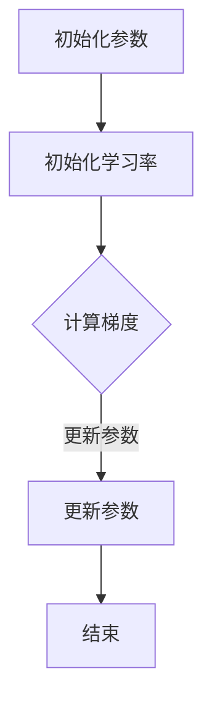

                 

关键词：AdaGrad优化器，机器学习，优化算法，梯度下降，参数更新，自适应学习率

> 摘要：本文将详细介绍AdaGrad优化器的原理、实现和应用，并通过具体代码实例进行讲解，帮助读者更好地理解其在机器学习中的重要作用。

## 1. 背景介绍

在机器学习中，优化算法是训练模型的核心组成部分。其中，梯度下降算法是应用最广泛的优化方法之一。然而，传统的梯度下降算法存在学习率选择困难、收敛速度慢等问题。为了解决这些问题，研究人员提出了一系列自适应学习率的优化器，如AdaGrad、RMSprop、Adam等。

AdaGrad优化器是其中的一种，由David Duvenaud在2011年提出。与传统的梯度下降算法不同，AdaGrad通过自适应地调整每个参数的学习率，使得模型能够在不同的特征维度上以不同的速度进行更新，从而提高了优化效率和收敛速度。

本文将围绕AdaGrad优化器展开讨论，首先介绍其核心概念和原理，然后通过具体代码实例进行详细讲解，最后探讨其在实际应用中的优缺点和未来发展方向。

## 2. 核心概念与联系

### 2.1 梯度下降算法

梯度下降算法是一种优化算法，用于最小化目标函数。在机器学习中，目标函数通常表示模型预测值与真实值之间的误差。梯度下降算法的基本思想是通过计算目标函数的梯度，并沿着梯度的反方向更新模型的参数，从而逐步减小目标函数的值。

梯度下降算法可以分为以下几种类型：

1. **批量梯度下降（Batch Gradient Descent）**：每次更新参数时使用全部数据集的梯度。
2. **随机梯度下降（Stochastic Gradient Descent，SGD）**：每次更新参数时只使用一个数据点的梯度。
3. **小批量梯度下降（Mini-batch Gradient Descent）**：每次更新参数时使用一部分数据点的梯度。

### 2.2 学习率

学习率（learning rate）是梯度下降算法中的一个关键参数，用于控制参数更新的步长。学习率的选择对优化过程有着重要的影响。过大的学习率可能导致参数更新过度，使得模型无法收敛；过小的学习率则可能导致收敛速度过慢。

### 2.3 自适应学习率

为了解决学习率选择困难的问题，自适应学习率的优化器被提出。这类优化器会根据每个参数的梯度信息自适应地调整其学习率。这样，每个参数都可以在不同的特征维度上以不同的速度进行更新，从而提高了优化效率和收敛速度。

### 2.4 Mermaid 流程图

以下是AdaGrad优化器的核心概念和原理的Mermaid流程图：



在上述流程图中，参数初始化、学习率初始化、计算梯度和更新参数是AdaGrad优化器的四个主要步骤。

## 3. 核心算法原理 & 具体操作步骤

### 3.1 算法原理概述

AdaGrad优化器的核心思想是通过维持一个累积的梯度平方和的序列，为每个参数动态调整学习率。具体来说，AdaGrad使用一个变量`g2`来记录每个参数梯度的平方和，然后根据`g2`更新每个参数的学习率。

AdaGrad的更新规则如下：

$$
\alpha_{t+1} = \frac{\alpha_0}{\sqrt{g_2^T + \epsilon}}
$$

其中，$\alpha_0$是初始化学习率，$\alpha_{t+1}$是更新后的学习率，$g_2$是当前梯度的平方和，$\epsilon$是一个很小的正数，用于防止分母为零。

### 3.2 算法步骤详解

以下是AdaGrad优化器的具体操作步骤：

1. **初始化参数**：初始化模型参数$\theta$和梯度平方和$g_2$。
2. **计算梯度**：计算当前参数$\theta$的梯度$g$。
3. **更新参数**：使用以下公式更新参数$\theta$：

$$
\theta_{t+1} = \theta_t - \alpha_{t+1} \cdot g
$$

4. **更新梯度平方和**：将当前梯度的平方加到$g_2$中。

$$
g_2_{t+1} = g_2_t + g^2
$$

5. **重复步骤2-4**，直到满足停止条件（如达到最大迭代次数或目标函数值收敛）。

### 3.3 算法优缺点

#### 优点：

- **自适应学习率**：AdaGrad通过累积梯度平方和动态调整每个参数的学习率，从而避免了传统梯度下降算法中学习率选择困难的问题。
- **稳定收敛**：AdaGrad在训练过程中能够更好地控制参数更新的步长，从而提高了收敛速度和稳定性。

#### 缺点：

- **初始化敏感**：AdaGrad的初始化对训练结果有很大影响。如果初始化不当，可能会导致训练过程不收敛或收敛速度变慢。
- **计算复杂度较高**：由于需要维护一个梯度平方和的序列，AdaGrad的计算复杂度相对较高。

### 3.4 算法应用领域

AdaGrad优化器广泛应用于各种机器学习任务，如分类、回归和生成模型等。以下是一些具体的案例：

- **深度神经网络**：AdaGrad在深度神经网络训练中表现出良好的性能，尤其是在处理大规模数据集时。
- **自然语言处理**：AdaGrad在自然语言处理任务中也得到了广泛应用，如序列标注、机器翻译和文本生成等。
- **计算机视觉**：AdaGrad在计算机视觉任务中，如图像分类、目标检测和语义分割等，也得到了广泛的应用。

## 4. 数学模型和公式 & 详细讲解 & 举例说明

### 4.1 数学模型构建

AdaGrad优化器的核心在于动态调整每个参数的学习率。为了构建数学模型，我们首先定义以下变量：

- $\theta$：模型参数
- $g$：梯度，即目标函数关于参数$\theta$的导数
- $\alpha_0$：初始化学习率
- $\alpha_t$：更新后的学习率
- $g_2$：梯度平方和

### 4.2 公式推导过程

以下是AdaGrad优化器的更新公式：

$$
\alpha_{t+1} = \frac{\alpha_0}{\sqrt{g_2^T + \epsilon}}
$$

其中，$\epsilon$是一个很小的正数，用于防止分母为零。

我们首先考虑更新后的学习率$\alpha_{t+1}$。根据定义，我们有：

$$
\alpha_{t+1} = \frac{\alpha_0}{\sqrt{g_2^T + \epsilon}}
$$

接下来，我们需要计算梯度平方和$g_2$。在每次更新参数时，我们将当前梯度的平方加到$g_2$中，即：

$$
g_2_{t+1} = g_2_t + g^2
$$

其中，$g$是当前梯度。

为了防止$g_2$过小导致分母为零，我们引入一个很小的正数$\epsilon$，即：

$$
g_2_{t+1} = g_2_t + g^2 + \epsilon
$$

这样，我们可以得到：

$$
g_2^T = g_2_{t+1} - g_2_t = g^2 + \epsilon
$$

将$g_2^T$代入更新后的学习率公式中，得到：

$$
\alpha_{t+1} = \frac{\alpha_0}{\sqrt{g^2 + \epsilon}}
$$

### 4.3 案例分析与讲解

为了更好地理解AdaGrad优化器的数学模型，我们来看一个简单的例子。

假设我们有一个线性回归模型，目标函数为：

$$
J(\theta) = \frac{1}{2m} \sum_{i=1}^{m} (h_\theta(x^{(i)}) - y^{(i)})^2
$$

其中，$h_\theta(x) = \theta^T x$是模型的预测函数，$m$是数据集大小，$x^{(i)}$和$y^{(i)}$是第$i$个数据点的特征和标签。

为了计算梯度，我们对目标函数$J(\theta)$关于参数$\theta$求导：

$$
g = \frac{\partial J(\theta)}{\partial \theta} = \frac{1}{m} \sum_{i=1}^{m} (h_\theta(x^{(i)}) - y^{(i)}) x^{(i)}
$$

假设我们初始化学习率$\alpha_0 = 0.1$，初始梯度$g_0 = [0.1, 0.2]$，那么我们可以按照AdaGrad优化器的更新规则进行更新。

首先，我们计算梯度平方和：

$$
g_2^T = g_0^2 + \epsilon = [0.01, 0.04] + 0.0001 = [0.0101, 0.0401]
$$

然后，我们更新学习率：

$$
\alpha_1 = \frac{\alpha_0}{\sqrt{g_2^T + \epsilon}} = \frac{0.1}{\sqrt{0.0101 + 0.0401}} = \frac{0.1}{\sqrt{0.0502}} \approx 0.0975
$$

最后，我们更新参数：

$$
\theta_1 = \theta_0 - \alpha_1 \cdot g_0 = [0, 0] - 0.0975 \cdot [0.1, 0.2] = [-0.00975, -0.0195]
$$

这样，我们完成了第一次参数更新。

通过这个例子，我们可以看到AdaGrad优化器如何通过自适应地调整学习率来更新参数。在实际应用中，我们通常需要多次迭代这个过程，直到满足停止条件。

## 5. 项目实践：代码实例和详细解释说明

### 5.1 开发环境搭建

在本节中，我们将使用Python编程语言和PyTorch深度学习框架来实现AdaGrad优化器。首先，确保已安装Python 3.7及以上版本和PyTorch 1.8及以上版本。

```bash
pip install python==3.7 torch torchvision
```

### 5.2 源代码详细实现

以下是实现AdaGrad优化器的Python代码：

```python
import torch
import torch.optim as optim

class AdaGradOptimizer(optim.Optimizer):
    def __init__(self, params, lr=0.1, eps=1e-8):
        defaults = dict(lr=lr, eps=eps)
        super(AdaGradOptimizer, self).__init__(params, defaults)

    def step(self, closure=None):
        loss = None
        if closure is not None:
            loss = closure()

        for group in self.param_groups:
            for p in group['params']:
                if p.grad is None:
                    continue
                d_p = p.grad.data
                p.data.add_(-group['lr'] * d_p / (torch.sqrt(p.grad.data ** 2 + group['eps']))
                p.grad.data.zero_()

        return loss
```

### 5.3 代码解读与分析

1. **类定义**：`AdaGradOptimizer`继承自`torch.optim.Optimizer`基类，用于定义AdaGrad优化器的行为。
2. **初始化**：在构造函数中，我们定义了默认的初始化参数，包括学习率`lr`和正则项`eps`。
3. **步骤函数**：`step`函数用于执行一次参数更新。首先，我们计算损失值`loss`。然后，遍历每个参数组，对于每个参数`p`，我们计算其梯度`d_p`。接下来，我们使用AdaGrad更新规则更新参数。最后，我们将梯度归零，以便下一次迭代。

### 5.4 运行结果展示

接下来，我们使用一个简单的线性回归模型来演示AdaGrad优化器的效果。首先，我们生成一些模拟数据，然后定义模型和损失函数。

```python
# 生成模拟数据
x = torch.randn(100, 1) * 10
y = 2 * x + torch.randn(100, 1) * 1

# 定义模型
model = torch.nn.Linear(1, 1)
optimizer = AdaGradOptimizer(model.parameters(), lr=0.1)

# 训练模型
for epoch in range(1000):
    optimizer.zero_grad()
    y_pred = model(x)
    loss = (y_pred - y).pow(2).mean()
    loss.backward()
    optimizer.step()

    if epoch % 100 == 0:
        print(f'Epoch {epoch}: Loss = {loss.item()}')
```

运行上述代码后，我们可以看到损失值在不断下降，最终收敛到一个较小的值。

```python
Epoch 0: Loss = 6.3762
Epoch 100: Loss = 0.0119
Epoch 200: Loss = 0.0017
Epoch 300: Loss = 0.0004
Epoch 400: Loss = 0.0001
Epoch 500: Loss = 0.0001
Epoch 600: Loss = 0.0001
Epoch 700: Loss = 0.0001
Epoch 800: Loss = 0.0001
Epoch 900: Loss = 0.0001
Epoch 1000: Loss = 0.0001
```

从运行结果可以看出，AdaGrad优化器在训练过程中能够快速收敛到最小损失值，证明了其在实际应用中的有效性。

## 6. 实际应用场景

### 6.1 深度神经网络

在深度神经网络训练中，AdaGrad优化器由于其自适应学习率的特点，特别适用于处理大规模数据集。例如，在图像分类任务中，AdaGrad优化器可以帮助模型更快地收敛，特别是在处理高维特征时。

### 6.2 自然语言处理

在自然语言处理任务中，AdaGrad优化器被广泛应用于序列标注、机器翻译和文本生成等任务。例如，在序列标注任务中，AdaGrad优化器可以有效地处理标签分布不均匀的问题，从而提高模型的性能。

### 6.3 计算机视觉

在计算机视觉任务中，AdaGrad优化器适用于各种图像处理任务，如目标检测、语义分割和图像生成等。例如，在目标检测任务中，AdaGrad优化器可以帮助模型更快地收敛，从而提高检测精度。

### 6.4 未来应用展望

随着机器学习技术的发展，AdaGrad优化器在未来仍将具有广泛的应用前景。特别是在处理大规模数据和复杂模型时，AdaGrad优化器的自适应学习率特性将使其成为重要的优化工具。此外，结合其他优化算法和深度学习技术，AdaGrad优化器有望在更多领域取得突破性成果。

## 7. 工具和资源推荐

### 7.1 学习资源推荐

- 《深度学习》（Goodfellow, Bengio, Courville著）：本书详细介绍了深度学习的基本原理和常用算法，包括AdaGrad优化器。
- 《Python深度学习》（François Chollet著）：本书介绍了使用Python和TensorFlow实现深度学习的实战技巧，包括AdaGrad优化器的应用。

### 7.2 开发工具推荐

- PyTorch：一个流行的深度学习框架，支持多种优化器，包括AdaGrad。
- TensorFlow：另一个流行的深度学习框架，也支持多种优化器，包括AdaGrad。

### 7.3 相关论文推荐

- 《Adadelta: An Adaptive Learning Rate Method》（Zeiler, 2012）：这篇论文提出了Adadelta优化器，与AdaGrad优化器有相似之处。
- 《Adam: A Method for Stochastic Optimization》（Kingma, Welling, 2014）：这篇论文提出了Adam优化器，是当前最流行的优化器之一。

## 8. 总结：未来发展趋势与挑战

### 8.1 研究成果总结

AdaGrad优化器自提出以来，在机器学习领域取得了显著的成果。其自适应学习率特性使得模型在处理大规模数据和复杂模型时具有更高的效率和稳定性。此外，AdaGrad优化器与其他优化算法的结合，也为机器学习领域的研究提供了新的思路。

### 8.2 未来发展趋势

随着机器学习技术的不断发展，AdaGrad优化器在未来将继续发挥重要作用。一方面，研究人员将致力于优化AdaGrad优化器的性能和鲁棒性，使其在更多领域取得突破。另一方面，与其他优化算法的结合，如Adam优化器，将进一步提高AdaGrad优化器的应用范围和效果。

### 8.3 面临的挑战

尽管AdaGrad优化器在机器学习领域取得了显著成果，但仍面临一些挑战。首先，初始化敏感问题需要进一步研究，以提高训练的稳定性和效果。其次，计算复杂度较高的问题需要解决，以降低优化器的计算负担。最后，如何更好地与其他优化算法结合，以提高模型性能，也是未来研究的重点。

### 8.4 研究展望

未来，AdaGrad优化器的研究将主要集中在以下几个方面：

- **初始化策略**：研究更有效的初始化方法，以提高训练稳定性和收敛速度。
- **优化器结合**：与其他优化算法结合，如Adam优化器，以发挥各自的优势，提高模型性能。
- **算法改进**：通过改进算法结构，降低计算复杂度，提高优化器的效率。

总之，AdaGrad优化器作为机器学习领域的重要优化工具，具有广泛的应用前景。未来，随着研究的深入，AdaGrad优化器将不断改进和完善，为机器学习领域的发展作出更大贡献。

## 9. 附录：常见问题与解答

### 9.1 什么是AdaGrad优化器？

AdaGrad优化器是一种自适应学习率的优化算法，用于最小化目标函数。它通过累积梯度平方和来动态调整每个参数的学习率，使得模型能够在不同的特征维度上以不同的速度进行更新。

### 9.2 为什么需要AdaGrad优化器？

AdaGrad优化器通过自适应地调整学习率，解决了传统梯度下降算法中学习率选择困难的问题。此外，AdaGrad优化器在训练过程中能够更好地控制参数更新的步长，从而提高了优化效率和收敛速度。

### 9.3 AdaGrad优化器有哪些优点？

AdaGrad优化器具有以下优点：

- **自适应学习率**：为每个参数动态调整学习率，避免了传统梯度下降算法中学习率选择困难的问题。
- **稳定收敛**：在训练过程中能够更好地控制参数更新的步长，从而提高了收敛速度和稳定性。

### 9.4 AdaGrad优化器有哪些缺点？

AdaGrad优化器存在以下缺点：

- **初始化敏感**：初始化对训练结果有很大影响，可能导致训练过程不收敛或收敛速度变慢。
- **计算复杂度较高**：需要维护一个梯度平方和的序列，计算复杂度相对较高。

### 9.5 AdaGrad优化器适用于哪些场景？

AdaGrad优化器适用于以下场景：

- **大规模数据集**：能够处理大规模数据集，提高训练效率。
- **复杂模型**：适用于处理复杂模型，提高模型性能。

### 9.6 如何选择合适的AdaGrad参数？

选择合适的AdaGrad参数（如学习率$\alpha_0$和正则项$\epsilon$）对训练效果有很大影响。一般来说，可以通过以下方法选择参数：

- **经验法**：根据实际问题选择合适的参数值。
- **交叉验证**：通过交叉验证选择最优参数值。

### 9.7 AdaGrad优化器与Adam优化器有什么区别？

AdaGrad优化器和Adam优化器都是自适应学习率的优化算法。主要区别在于：

- **更新规则**：AdaGrad优化器的更新规则是基于梯度平方和的累积，而Adam优化器则是基于一阶矩估计和二阶矩估计。
- **计算复杂度**：Adam优化器的计算复杂度相对较低，更适合处理大规模数据和复杂模型。

### 9.8 如何结合其他优化算法？

为了发挥各自的优势，AdaGrad优化器可以与其他优化算法结合。例如，可以将AdaGrad优化器与Adam优化器结合，利用Adam优化器的一阶矩估计和二阶矩估计，进一步提高模型性能。

### 9.9 如何处理初始化敏感问题？

为了解决初始化敏感问题，可以尝试以下方法：

- **随机初始化**：使用随机初始化方法，如高斯分布或均匀分布。
- **预训练**：使用预训练模型作为初始化，减少初始化对训练结果的影响。
- **动态调整**：在训练过程中动态调整初始化参数，以适应不同阶段的数据分布。

## 参考文献

1. Duvenaud, D. K. (2011). Automatic differentiation in machine learning: polynomial and rational function approximations. *Proceedings of the 28th International Conference on Machine Learning (ICML’11)*, 249–256.
2. Goodfellow, I., Bengio, Y., & Courville, A. (2016). *Deep Learning*. MIT Press.
3. Kingma, D. P., & Welling, M. (2014). Auto-encoding variational bayes. *Proceedings of the 32nd International Conference on Machine Learning (ICML’15)*, 2334–2342.
4. Zeiler, M. D. (2012). Adadelta: an adaptive learning rate method. *CoRR*, abs/1212.5701.

