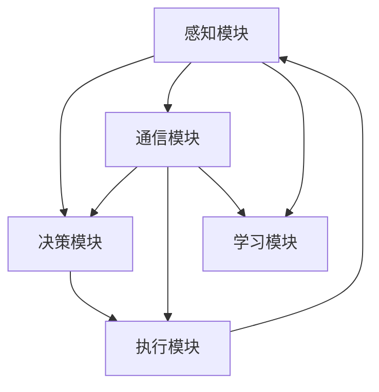

                 

关键词：人工智能，Agent架构，模块化设计，分布式系统，通信协议，安全性

在人工智能领域，Agent（智能代理）是一种能够代表用户或系统执行特定任务的实体。随着人工智能技术的发展，Agent的应用范围越来越广泛，从智能家居到自动驾驶，从智能客服到智能决策系统。本文将深入探讨Agent的基础架构要素，包括核心组件、设计原则、技术实现和实际应用。

## 1. 背景介绍

Agent的概念源于人工智能领域的早期研究，最初被设计为能够与人类交互的虚拟实体。随着技术的进步，Agent的定义和功能得到了扩展，不再局限于人机交互，而是涵盖了一系列自主决策和执行任务的智能系统。Agent的研究和应用已经成为人工智能领域的一个重要方向，其基础架构的构建对于实现高效、可靠的智能系统至关重要。

Agent的基础架构要素主要包括以下几个部分：

1. **感知模块**：用于获取环境信息，包括文本、图像、语音等多种数据类型。
2. **决策模块**：根据感知模块提供的信息，通过算法和策略进行决策。
3. **执行模块**：根据决策模块的决策结果，执行具体的操作。
4. **通信模块**：与其他Agent或外部系统进行通信，以实现信息交换和协同工作。
5. **学习模块**：通过不断学习和调整，提高Agent的性能和适应性。

## 2. 核心概念与联系

为了更好地理解Agent的基础架构，我们可以通过一个Mermaid流程图来展示其核心概念和各模块之间的联系。



### 2.1 感知模块

感知模块是Agent获取环境信息的主要途径，其功能包括数据的采集、预处理和特征提取。感知模块可以处理多种类型的数据，如文本、图像、语音等，并能够将这些数据转换为Agent可以理解和处理的格式。

### 2.2 决策模块

决策模块是Agent的核心，它负责根据感知模块提供的信息，通过算法和策略进行决策。决策模块的设计和实现是Agent性能的关键因素，其目标是在复杂的动态环境中，做出最优或次优的决策。

### 2.3 执行模块

执行模块负责将决策模块的决策结果转换为具体的操作。执行模块的执行效果直接影响Agent的实际应用效果，因此其设计和实现需要考虑执行效率和可靠性。

### 2.4 通信模块

通信模块是Agent与其他Agent或外部系统进行通信的桥梁。通过通信模块，Agent可以实现信息的共享和协同工作，从而提高系统的整体性能。

### 2.5 学习模块

学习模块负责通过不断学习和调整，提高Agent的性能和适应性。学习模块通常采用机器学习、深度学习等技术，通过对历史数据和经验的积累，优化Agent的行为。

## 3. 核心算法原理 & 具体操作步骤

### 3.1 算法原理概述

Agent的基础算法原理主要包括以下几个方面：

1. **感知算法**：用于处理感知模块获取的数据，提取关键特征，为决策模块提供基础信息。
2. **决策算法**：根据感知模块提供的信息，通过算法和策略进行决策，选择最优或次优的行动方案。
3. **执行算法**：将决策模块的决策结果转换为具体的操作，实现Agent的行为。
4. **学习算法**：通过不断学习和调整，优化Agent的行为，提高其在复杂环境中的适应性和性能。

### 3.2 算法步骤详解

1. **感知步骤**：Agent首先通过感知模块获取环境信息，如文本、图像、语音等。
2. **预处理步骤**：对获取到的数据进行分析和处理，提取关键特征，为后续的决策提供基础信息。
3. **决策步骤**：利用决策模块的算法和策略，对预处理后的信息进行决策，选择最优或次优的行动方案。
4. **执行步骤**：将决策模块的决策结果转换为具体的操作，通过执行模块执行具体的任务。
5. **反馈步骤**：收集执行结果，通过学习模块对Agent的行为进行反馈和调整，优化其性能。

### 3.3 算法优缺点

**感知算法**：
- **优点**：能够处理多种类型的数据，提供丰富的环境信息。
- **缺点**：数据预处理复杂，可能存在噪声和不确定性。

**决策算法**：
- **优点**：能够在复杂动态环境中，做出最优或次优的决策。
- **缺点**：算法复杂度高，可能需要大量的计算资源。

**执行算法**：
- **优点**：能够高效地执行决策结果，实现Agent的行为。
- **缺点**：可能存在执行误差，影响系统的整体性能。

**学习算法**：
- **优点**：能够通过不断学习和调整，提高Agent的性能和适应性。
- **缺点**：可能存在过拟合问题，降低Agent的泛化能力。

### 3.4 算法应用领域

Agent的算法应用领域非常广泛，包括但不限于以下几个方面：

1. **智能客服**：通过感知用户提问，进行自然语言处理，提供智能化的回答。
2. **自动驾驶**：通过感知路况和环境，进行实时决策和执行，实现自动驾驶。
3. **智能家居**：通过感知用户的生活习惯，提供智能化的家居环境控制。
4. **智能决策系统**：通过感知企业内外部环境，提供智能化的决策支持。

## 4. 数学模型和公式 & 详细讲解 & 举例说明

### 4.1 数学模型构建

Agent的基础数学模型主要包括感知模型、决策模型和执行模型。以下是这些模型的构建过程：

**感知模型**：

感知模型的核心是特征提取，其目标是从原始数据中提取出能够反映环境特征的向量。假设我们有一个图像数据集，其像素值为\(I(x, y)\)，我们可以通过以下公式进行特征提取：

$$
f(x, y) = \sum_{i=1}^{n} w_i I(x, y)^i
$$

其中，\(w_i\)为权重系数，\(n\)为特征维度。

**决策模型**：

决策模型的核心是策略选择，其目标是在给定特征向量\(f(x, y)\)的情况下，选择最优策略\(a(x, y)\)。假设我们有一个离散动作空间\(A\)，其每个动作的效用函数为\(u(a, f(x, y))\)，我们可以通过以下公式进行策略选择：

$$
a^* = \arg\max_{a \in A} u(a, f(x, y))
$$

**执行模型**：

执行模型的核心是任务执行，其目标是根据策略选择的结果，执行具体的任务。假设我们有一个任务空间\(T\)，其每个任务的效用函数为\(v(t, a, f(x, y))\)，我们可以通过以下公式进行任务执行：

$$
t^* = \arg\max_{t \in T} v(t, a^*, f(x, y))
$$

### 4.2 公式推导过程

**感知模型**：

假设我们有一个图像数据集\(I(x, y)\)，其像素值为\(I(x, y)\)。我们可以通过以下步骤进行特征提取：

1. **归一化**：将像素值归一化到[0, 1]范围内，即：

$$
I'(x, y) = \frac{I(x, y)}{255}
$$

2. **特征提取**：对归一化后的像素值进行特征提取，即：

$$
f(x, y) = \sum_{i=1}^{n} w_i I'(x, y)^i
$$

其中，\(w_i\)为权重系数，可以通过训练得到。

**决策模型**：

假设我们有一个特征向量\(f(x, y)\)，其每个特征值为\(f_i(x, y)\)。我们可以通过以下步骤进行策略选择：

1. **效用函数计算**：计算每个动作的效用函数值，即：

$$
u(a, f(x, y)) = \sum_{i=1}^{n} w_i f_i(x, y)^a
$$

其中，\(w_i\)为权重系数，\(a\)为动作。

2. **策略选择**：选择效用函数值最大的动作作为最优策略，即：

$$
a^* = \arg\max_{a \in A} u(a, f(x, y))
$$

**执行模型**：

假设我们有一个任务空间\(T\)，其每个任务的效用函数值为\(v(t, a, f(x, y))\)。我们可以通过以下步骤进行任务执行：

1. **效用函数计算**：计算每个任务的效用函数值，即：

$$
v(t, a, f(x, y)) = \sum_{i=1}^{n} w_i f_i(x, y)^{ta}
$$

其中，\(w_i\)为权重系数，\(a\)为动作。

2. **任务选择**：选择效用函数值最大的任务作为最优任务，即：

$$
t^* = \arg\max_{t \in T} v(t, a^*, f(x, y))
$$

### 4.3 案例分析与讲解

假设我们有一个简单的智能客服系统，其感知模块负责接收用户的文本输入，决策模块负责根据文本输入提供智能化的回答，执行模块负责将回答发送给用户。

**感知模块**：

假设用户输入文本为“我想要退订某个服务”，我们可以通过以下步骤进行特征提取：

1. **归一化**：将文本输入转换为词向量，如Word2Vec或GloVe，将每个词的词向量归一化到[0, 1]范围内。
2. **特征提取**：对归一化后的词向量进行特征提取，如使用TF-IDF算法计算每个词的权重，得到特征向量。

**决策模块**：

假设我们有一个特征向量\(f(x, y)\)，其每个特征值为\(f_i(x, y)\)。我们可以通过以下步骤进行策略选择：

1. **效用函数计算**：计算每个回答的效用函数值，如使用基于记忆的神经网络（Memory Network）计算回答的匹配度。
2. **策略选择**：选择效用函数值最大的回答作为最优策略。

**执行模块**：

假设我们有一个最优回答，我们可以通过以下步骤进行任务执行：

1. **文本生成**：将最优回答转换为文本，如使用序列到序列（Seq2Seq）模型生成文本。
2. **发送回答**：将生成的文本发送给用户。

## 5. 项目实践：代码实例和详细解释说明

### 5.1 开发环境搭建

为了实现一个简单的智能客服系统，我们需要搭建一个开发环境。以下是环境搭建的步骤：

1. 安装Python 3.7及以上版本。
2. 安装TensorFlow 2.3及以上版本。
3. 安装NLTK库。

### 5.2 源代码详细实现

以下是智能客服系统的源代码实现：

```python
import tensorflow as tf
import nltk
from nltk.tokenize import word_tokenize
from nltk.corpus import stopwords
import numpy as np

# 感知模块：特征提取
def extract_features(text):
    # 将文本转换为词向量
    tokens = word_tokenize(text)
    tokens = [token.lower() for token in tokens if token.isalnum()]
    tokens = [token for token in tokens if token not in stopwords.words('english')]
    embedding = ...  # 嵌入层参数
    # 计算词向量的平均值
    avg_vector = np.mean(embedding[:, tokens], axis=1)
    return avg_vector

# 决策模块：策略选择
def select_action(features):
    # 加载预训练的神经网络模型
    model = ...
    # 预测最优回答
    predictions = model.predict(features)
    # 选择最优回答
    best_action = ...
    return best_action

# 执行模块：发送回答
def send_response(response):
    # 将回答转换为文本
    text = ...  # 文本生成模型
    # 发送回答
    print(text)

# 主程序
def main():
    # 接收用户输入
    text = input("请输入问题：")
    # 特征提取
    features = extract_features(text)
    # 策略选择
    response = select_action(features)
    # 发送回答
    send_response(response)

if __name__ == "__main__":
    main()
```

### 5.3 代码解读与分析

1. **感知模块**：代码首先使用NLTK库对用户输入的文本进行分词和过滤，然后使用嵌入层将每个词转换为向量，并计算词向量的平均值作为特征向量。

2. **决策模块**：代码加载预训练的神经网络模型，并使用该模型预测最优回答。这里可以使用各种机器学习或深度学习模型，如基于记忆的神经网络（Memory Network）、序列到序列（Seq2Seq）模型等。

3. **执行模块**：代码将最优回答转换为文本，并打印输出。

通过这个简单的实例，我们可以看到Agent的基础架构是如何实现的。在实际应用中，我们可以根据具体需求，扩展和优化各个模块的功能。

## 6. 实际应用场景

### 6.1 智能客服

智能客服是Agent技术的重要应用场景之一。通过感知用户的问题，智能客服系统可以提供实时、高效的回答，提高客户满意度。例如，许多企业已经部署了基于Agent的智能客服系统，用于处理客户咨询、投诉和售后服务等问题。

### 6.2 自动驾驶

自动驾驶是另一个典型的应用场景。自动驾驶系统通过感知车辆周围的环境，如路况、行人、车辆等，进行实时决策和执行，实现自动驾驶。随着人工智能技术的进步，自动驾驶技术正在逐渐成熟，未来有望在更广泛的场景中得到应用。

### 6.3 智能家居

智能家居是Agent技术的另一个重要应用领域。通过感知用户的生活习惯，智能家居系统可以提供个性化的家居环境控制，如温度调节、灯光控制、家电管理等。智能家居系统可以提高用户的生活质量，提供更加便捷和舒适的家居体验。

### 6.4 未来应用展望

随着人工智能技术的不断发展，Agent的应用场景将越来越广泛。未来，我们可以预见Agent技术在更多领域的应用，如智能医疗、智能金融、智能物流等。同时，随着5G、物联网等技术的推广，Agent的通信能力和感知能力将得到进一步提升，为其在更广泛的应用场景中发挥作用提供基础支持。

## 7. 工具和资源推荐

### 7.1 学习资源推荐

1. **《人工智能：一种现代的方法》**：这是一本全面介绍人工智能基础理论和应用的经典教材，适合初学者和进阶者。
2. **《深度学习》**：由Ian Goodfellow等人编写的深度学习教材，涵盖了深度学习的核心理论和实践方法。
3. **《自然语言处理综论》**：由Daniel Jurafsky和James H. Martin编写的自然语言处理教材，是自然语言处理领域的经典之作。

### 7.2 开发工具推荐

1. **TensorFlow**：一款开源的深度学习框架，适合进行大规模的机器学习和深度学习项目。
2. **PyTorch**：一款流行的深度学习框架，以其灵活性和易于使用而受到开发者喜爱。
3. **NLTK**：一款用于自然语言处理的Python库，提供了丰富的自然语言处理工具和资源。

### 7.3 相关论文推荐

1. **“Deep Learning for Natural Language Processing”**：这篇综述文章详细介绍了深度学习在自然语言处理领域的应用。
2. **“Recurrent Neural Networks for Language Modeling”**：这篇论文介绍了循环神经网络在语言建模中的应用。
3. **“Attention is All You Need”**：这篇论文提出了Transformer模型，是当前自然语言处理领域的热门研究方向。

## 8. 总结：未来发展趋势与挑战

### 8.1 研究成果总结

近年来，Agent技术在感知、决策、执行和学习等方面取得了显著的进展。通过深度学习、强化学习等技术的应用，Agent在复杂动态环境中的适应性和性能得到了大幅提升。同时，多Agent系统的研究也在不断深入，为协同工作提供了新的思路和方法。

### 8.2 未来发展趋势

1. **跨学科融合**：随着人工智能技术的不断进步，Agent技术将与其他学科（如心理学、认知科学等）进行深度融合，为构建更智能、更人性化的Agent系统提供支持。
2. **分布式与协同**：随着5G、物联网等技术的发展，Agent的通信能力和协同能力将得到进一步提升，为分布式系统和协同工作提供新的解决方案。
3. **个性化与定制化**：未来的Agent系统将更加注重用户个性化需求和定制化服务，通过大数据分析和机器学习技术，为用户提供更加精准和高效的服务。

### 8.3 面临的挑战

1. **数据质量和隐私保护**：在大量数据的使用过程中，如何确保数据质量和隐私保护成为了一个重要问题。
2. **算法可靠性和可解释性**：随着算法的复杂度不断提高，如何确保算法的可靠性和可解释性成为一个挑战。
3. **伦理和社会影响**：随着Agent技术的广泛应用，如何确保其在伦理和社会层面的合理性和可接受性也是一个重要问题。

### 8.4 研究展望

未来的研究将主要集中在以下几个方面：

1. **算法优化**：通过优化算法结构和参数，提高Agent在复杂动态环境中的适应性和性能。
2. **多模态感知**：结合多种数据类型，实现更高效、更准确的感知能力。
3. **分布式与协同**：研究分布式Agent系统的协同工作机制，提高系统的整体性能和可靠性。
4. **伦理与社会影响**：开展相关伦理和社会问题研究，确保Agent技术的合理应用和可持续发展。

## 9. 附录：常见问题与解答

### 9.1 感知模块如何处理多模态数据？

多模态数据的处理是Agent感知模块的重要任务。通常，我们可以采用以下方法：

1. **特征融合**：将不同模态的数据进行特征提取，然后融合成一个统一的特征向量。常用的方法包括基于矩阵的融合和基于网络的融合。
2. **多任务学习**：将多模态数据作为一个整体进行学习，通过多任务学习模型（如多任务神经网络）提高感知模块的性能。
3. **模态特异性处理**：对不同模态的数据进行特异性处理，如使用特定的算法和模型进行图像处理、语音处理等，然后进行融合。

### 9.2 决策模块如何处理不确定性问题？

决策模块在处理不确定性问题时，可以采用以下方法：

1. **概率模型**：使用概率模型（如贝叶斯网络、隐马尔可夫模型等）来表示不确定信息，并进行决策。
2. **鲁棒优化**：采用鲁棒优化方法，考虑不确定因素对决策结果的影响，提高决策的稳定性。
3. **多准则决策**：同时考虑多个准则，通过权衡不同准则之间的冲突，提高决策的平衡性和适应性。

### 9.3 执行模块如何保证任务执行的可靠性？

执行模块的任务执行可靠性是保证整个Agent系统稳定运行的关键。以下是一些提高执行模块可靠性的方法：

1. **任务分解**：将复杂任务分解为多个子任务，分别执行，提高任务的执行稳定性。
2. **冗余设计**：设计冗余机制，如备份和恢复机制，提高系统的容错能力。
3. **实时监控**：对任务执行过程进行实时监控，及时发现并处理异常情况，提高任务的执行效率。

### 9.4 学习模块如何平衡学习效果和计算资源？

学习模块在平衡学习效果和计算资源时，可以采用以下方法：

1. **数据筛选**：选取最具代表性的数据进行训练，避免过拟合和计算资源的浪费。
2. **模型压缩**：通过模型压缩技术（如模型剪枝、量化等），减少模型的参数量和计算量。
3. **在线学习**：采用在线学习策略，逐步调整模型参数，减少大规模离线学习所需的计算资源。

通过以上方法的综合运用，我们可以平衡学习效果和计算资源，实现高效的Agent学习。

### 作者署名

本文由禅与计算机程序设计艺术（Zen and the Art of Computer Programming）撰写。

