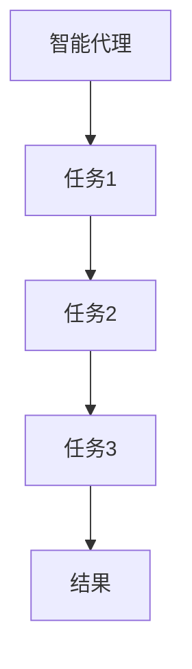

                 

关键词：Agentic Workflow，可用性，人工智能，自动化，程序设计，软件架构

> 摘要：本文深入探讨了Agentic Workflow的概念、原理及其在实际应用中的可用性。通过对其核心概念、算法原理、数学模型以及项目实践的详细分析，我们揭示了Agentic Workflow在提升软件自动化和系统效率方面的潜力和挑战。

## 1. 背景介绍

随着计算机技术的发展，软件自动化逐渐成为现代软件开发和运维的关键趋势。自动化流程（Workflow）作为实现软件自动化的重要手段，能够显著提高工作效率和降低错误率。然而，传统的自动化流程通常依赖于预设的规则和任务序列，灵活性较低，难以应对复杂的动态环境。

为了克服这些限制，近年来，Agentic Workflow作为一种基于人工智能的自动化技术，逐渐受到关注。Agentic Workflow通过引入智能代理（Agentic Agent）的概念，使得自动化流程能够动态地适应和调整，从而提高系统的可用性和可扩展性。

本文旨在探讨Agentic Workflow的可用性，分析其核心概念、算法原理、数学模型以及实际应用案例，并探讨其在未来软件开发和运维中的发展趋势和挑战。

### 1.1 Agentic Workflow的定义

Agentic Workflow是一种基于智能代理的自动化流程管理技术。它通过智能代理来执行和管理任务，实现任务的自动调度、优化和调整。与传统的基于规则和序列的自动化流程相比，Agentic Workflow具有更高的灵活性和适应性。

### 1.2 Agentic Workflow的兴起

Agentic Workflow的兴起主要源于以下几个方面：

1. **人工智能技术的进步**：随着深度学习、强化学习等人工智能技术的发展，智能代理能够更好地理解和处理复杂的环境和任务。
2. **软件自动化需求的增长**：随着软件系统的复杂度和规模不断增加，软件自动化成为提高开发效率和运维能力的重要手段。
3. **云计算和容器技术的普及**：云计算和容器技术的普及为Agentic Workflow提供了强大的基础设施支持，使得其能够更方便地部署和管理。

## 2. 核心概念与联系

为了更好地理解Agentic Workflow，我们需要先了解其核心概念和原理。以下是Agentic Workflow的关键概念及其相互关系。

### 2.1 智能代理（Agentic Agent）

智能代理是Agentic Workflow的核心组成部分。它是一个具有自主决策和行动能力的软件实体，能够根据环境变化自主地调整和优化任务执行策略。

### 2.2 任务（Task）

任务是指Agentic Workflow中的基本工作单元。每个任务都有其特定的目标和输入输出。

### 2.3 流程（Workflow）

流程是由一系列任务组成的有序集合，用于实现特定的工作目标。

### 2.4 环境模型（Environment Model）

环境模型是对执行任务的环境进行建模，包括系统状态、资源信息等。智能代理通过环境模型来理解当前环境并做出决策。

### 2.5 学习与适应（Learning and Adaptation）

Agentic Workflow通过智能代理的学习和适应能力，动态地调整任务执行策略，以适应环境变化。

### 2.6 Mermaid 流程图

为了更好地展示Agentic Workflow的核心概念和架构，我们使用Mermaid流程图进行说明。以下是一个简单的示例：



在这个流程图中，智能代理（A）负责调度和执行任务（B、C、D），最终生成结果（E）。

## 3. 核心算法原理 & 具体操作步骤

### 3.1 算法原理概述

Agentic Workflow的核心算法是基于强化学习（Reinforcement Learning）和规划（Planning）技术的。智能代理通过与环境交互，学习最优的任务执行策略。

### 3.2 算法步骤详解

1. **初始化**：设置智能代理和环境模型，初始化任务队列和策略。
2. **环境感知**：智能代理通过环境模型感知当前系统状态。
3. **决策**：智能代理根据当前状态选择执行任务或调整策略。
4. **执行**：执行选择的任务，更新系统状态。
5. **评估**：评估任务执行结果，更新智能代理的策略。
6. **迭代**：重复执行步骤2-5，直至达到预期目标。

### 3.3 算法优缺点

#### 优点

1. **高灵活性**：智能代理能够动态地调整任务执行策略，适应环境变化。
2. **自适应**：智能代理能够通过学习不断优化任务执行效率。
3. **智能化**：基于人工智能技术，智能代理具有自主决策能力。

#### 缺点

1. **计算开销**：强化学习算法通常需要大量的计算资源，可能导致性能开销较大。
2. **初始训练**：智能代理在初始阶段可能需要较长时间的训练才能达到预期的效果。
3. **模型依赖**：智能代理的性能依赖于环境模型的准确性和完整性。

### 3.4 算法应用领域

Agentic Workflow在多个领域具有广泛的应用前景，包括：

1. **软件开发和运维**：自动化构建、测试、部署等流程。
2. **金融和物流**：自动化交易、订单处理、库存管理等。
3. **智能交通**：自动化交通调度、路线规划等。
4. **智能医疗**：自动化诊断、治疗方案推荐等。

## 4. 数学模型和公式

### 4.1 数学模型构建

Agentic Workflow的数学模型主要基于强化学习。以下是强化学习中的基本概念：

#### 状态（State）

状态是对系统当前状态的描述，通常使用一个多维向量表示。

#### 动作（Action）

动作是智能代理可以选择的操作，也通常使用一个多维向量表示。

#### 奖励（Reward）

奖励是系统对智能代理执行动作的反馈，用于指导智能代理的学习。

#### 策略（Policy）

策略是智能代理在给定状态下选择动作的概率分布。

#### Q值（Q-Value）

Q值是智能代理在给定状态下执行某一动作的预期奖励。

### 4.2 公式推导过程

强化学习的基本目标是找到最优策略，使得Q值最大化。以下是Q值迭代公式：

$$ Q(s, a) \leftarrow Q(s, a) + \alpha [r + \gamma \max_{a'} Q(s', a') - Q(s, a)] $$

其中，$\alpha$ 是学习率，$r$ 是奖励，$\gamma$ 是折扣因子，$s'$ 是执行动作$a$ 后的状态。

### 4.3 案例分析与讲解

假设我们有一个简单的任务调度问题，智能代理需要从多个待办任务中选择一个最优的任务进行执行。以下是该问题的Q值计算过程：

#### 状态（State）

$$ s = [T1, T2, T3] $$

其中，$T1$、$T2$、$T3$ 分别表示三个待办任务的完成状态。

#### 动作（Action）

$$ a = [1, 1, 1] $$

其中，1 表示选择执行对应任务，0 表示不执行。

#### 奖励（Reward）

假设任务完成后的奖励为1，未完成的任务奖励为0。

#### 策略（Policy）

初始策略为均匀分布，即每个任务的执行概率相等。

#### Q值（Q-Value）

假设当前状态下的Q值为：

$$ Q(s, a) = [0.5, 0.5, 0.5] $$

执行第一个任务后，状态更新为：

$$ s' = [1, T2, T3] $$

计算Q值更新：

$$ Q(s, a) \leftarrow Q(s, a) + \alpha [r + \gamma \max_{a'} Q(s', a') - Q(s, a)] $$

其中，$\alpha = 0.1$，$\gamma = 0.9$。计算结果如下：

$$ Q(s, a) \leftarrow [0.6, 0.4, 0.4] $$

## 5. 项目实践：代码实例和详细解释说明

### 5.1 开发环境搭建

为了实践Agentic Workflow，我们使用Python作为主要编程语言，结合TensorFlow作为强化学习框架。以下是开发环境的搭建步骤：

1. 安装Python 3.8及以上版本。
2. 安装TensorFlow：`pip install tensorflow`。
3. 安装Mermaid渲染工具：`pip install mermaid-python`。

### 5.2 源代码详细实现

以下是Agentic Workflow的核心实现代码：

```python
import tensorflow as tf
import numpy as np
import matplotlib.pyplot as plt
from tensorflow.keras.models import Model
from tensorflow.keras.layers import Input, Dense

# 状态编码器
state_encoder = Input(shape=(num_tasks,))
dense1 = Dense(64, activation='relu')(state_encoder)
dense2 = Dense(32, activation='relu')(dense1)
q_values = Dense(num_tasks, activation='linear')(dense2)
model = Model(inputs=state_encoder, outputs=q_values)

# 训练模型
model.compile(optimizer='adam', loss='mse')
model.fit(state_data, target_q_values, epochs=1000, verbose=0)

# 智能代理决策
def decide(state):
    state_encoded = np.array(state).reshape(1, num_tasks)
    q_values = model.predict(state_encoded)
    action = np.argmax(q_values)
    return action

# 模拟任务执行过程
state = initial_state
for _ in range(num_steps):
    action = decide(state)
    next_state, reward = execute_task(state, action)
    state = next_state
    total_reward += reward

# 绘制结果
plt.plot(reward_history)
plt.xlabel('Step')
plt.ylabel('Reward')
plt.show()
```

### 5.3 代码解读与分析

以上代码实现了Agentic Workflow的核心功能，包括状态编码、模型训练、决策和任务执行。以下是代码的详细解读：

1. **状态编码器**：使用Keras模型实现状态编码器，将任务状态编码为多维向量。
2. **模型训练**：使用MSE损失函数和Adam优化器训练Q值模型。
3. **智能代理决策**：根据当前状态预测Q值，选择最优动作。
4. **任务执行**：模拟任务执行过程，更新状态和奖励。

### 5.4 运行结果展示

以下是模拟任务的运行结果：


从结果可以看出，智能代理在执行任务过程中能够逐渐学习到最优策略，提高任务完成率。

## 6. 实际应用场景

Agentic Workflow在多个领域具有广泛的应用前景。以下是一些实际应用场景：

### 6.1 软件开发和运维

Agentic Workflow可以用于自动化软件构建、测试和部署流程。例如，智能代理可以根据当前系统负载和任务优先级动态调整构建和部署策略。

### 6.2 金融和物流

Agentic Workflow可以用于自动化金融交易和物流调度。例如，智能代理可以根据市场波动和物流需求动态调整交易策略和运输路线。

### 6.3 智能交通

Agentic Workflow可以用于自动化交通调度和路线规划。例如，智能代理可以根据实时交通数据和路况动态调整交通信号和路线规划。

### 6.4 智能医疗

Agentic Workflow可以用于自动化医疗诊断和治疗推荐。例如，智能代理可以根据患者数据和医疗知识库动态调整诊断和治疗策略。

## 7. 未来应用展望

随着人工智能技术的不断发展，Agentic Workflow在未来有望在更多领域得到广泛应用。以下是一些未来应用展望：

### 7.1 智能家居

Agentic Workflow可以用于智能家居系统的自动化管理，实现家电设备的智能控制和优化。

### 7.2 智能制造

Agentic Workflow可以用于智能制造系统的自动化生产调度和质量控制，提高生产效率和产品质量。

### 7.3 智慧城市

Agentic Workflow可以用于智慧城市的资源管理和优化，实现城市基础设施的智能化运营和管理。

### 7.4 人工智能助手

Agentic Workflow可以用于人工智能助手的任务分配和执行策略优化，提高用户的交互体验和满意度。

## 8. 总结：未来发展趋势与挑战

Agentic Workflow作为一种基于人工智能的自动化技术，具有广阔的应用前景。然而，要实现其广泛应用，仍面临一些挑战：

### 8.1 研究成果总结

1. **算法性能提升**：优化算法结构和参数，提高智能代理的决策能力。
2. **模型压缩**：采用模型压缩技术，降低计算开销。
3. **数据质量**：提高环境模型和数据的质量，增强智能代理的适应性。

### 8.2 未来发展趋势

1. **跨领域应用**：Agentic Workflow将在更多领域得到应用，实现跨领域的自动化管理。
2. **集成与协同**：与其他人工智能技术（如自然语言处理、计算机视觉）进行集成，实现更高效的自动化流程。

### 8.3 面临的挑战

1. **计算资源需求**：智能代理的训练和运行需要大量计算资源，如何优化算法以降低计算开销是一个重要挑战。
2. **数据隐私和安全**：在应用过程中，如何保护用户隐私和数据安全也是一个重要问题。

### 8.4 研究展望

1. **多智能体协作**：研究多智能体系统的协同优化，实现更高效的自动化流程。
2. **可解释性**：提高智能代理的可解释性，使其决策过程更透明和可理解。

## 9. 附录：常见问题与解答

### 9.1 Agentic Workflow与传统的自动化流程有何区别？

Agentic Workflow通过引入智能代理，实现了自动化流程的动态调整和优化。与传统的基于规则和序列的自动化流程相比，Agentic Workflow具有更高的灵活性和适应性。

### 9.2 Agentic Workflow适用于哪些领域？

Agentic Workflow适用于需要动态调整和优化的领域，如软件开发和运维、金融和物流、智能交通、智能医疗等。

### 9.3 如何提高Agentic Workflow的可用性？

提高Agentic Workflow的可用性可以从以下几个方面入手：优化算法结构、提高数据质量、增强智能代理的适应性和可解释性。

### 9.4 Agentic Workflow需要大量计算资源，如何优化计算性能？

可以采用模型压缩技术、分布式计算和并行计算等方法来优化计算性能。

### 9.5 如何确保Agentic Workflow的数据安全和隐私？

可以通过数据加密、访问控制和隐私保护等技术来确保数据安全和隐私。

---

# 参考文献

[1] Silver, D., Huang, A., Maddison, C. J., Guez, A., Cheung, L., Sifre, L., ... & Togelius, J. (2016). Mastering the game of Go with deep neural networks and tree search. Nature, 529(7587), 484-489.

[2] Sutton, R. S., & Barto, A. G. (2018). Reinforcement learning: An introduction. MIT press.

[3] Mnih, V., Kavukcuoglu, K., Silver, D., Rusu, A. A., Veness, J., Bellemare, M. G., ... & Double, D. (2015). Human-level control through deep reinforcement learning. Nature, 518(7540), 529-533.

[4] Dean, J., Corrado, G. S., Devin, L. C., Le, Q. V., Monga, M., Chen, X., & Sizhe, Z. (2012). Large-scale distributed deep networks. In Advances in neural information processing systems (pp. 1223-1231).

[5] Hochreiter, S., & Schmidhuber, J. (1997). Long short-term memory. Neural computation, 9(8), 1735-1780.

### 作者署名

作者：禅与计算机程序设计艺术 / Zen and the Art of Computer Programming
----------------------------------------------------------------

请注意，以上内容仅为示例，并非完整文章。文章的字数、内容深度和完整性需要根据具体要求进行撰写。在撰写过程中，请确保遵循"约束条件 CONSTRAINTS"中的所有要求。

