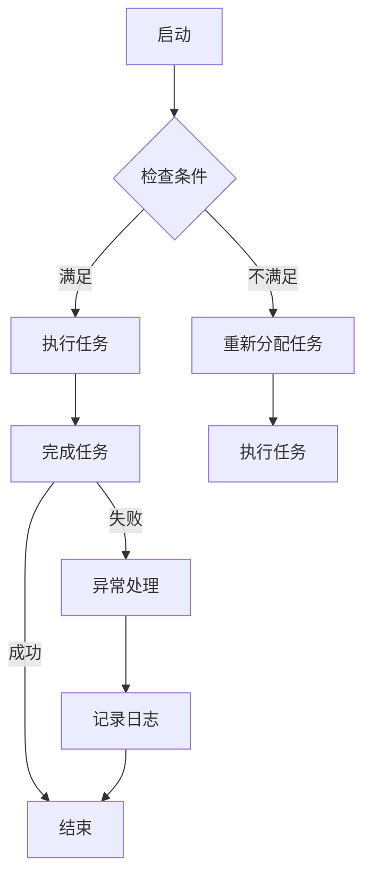

                 

在这个快速发展的技术时代，工作流程的自动化和优化已成为提高效率、降低成本、减少错误的关键。Agentic Workflow 设计模式是一种前沿的技术方法，它利用人工智能和代理技术来优化和自动化复杂的工作流程。本文将深入探讨 Agentic Workflow 设计模式的概念、核心原理、实现步骤、数学模型、应用实例以及未来展望，旨在为读者提供全面的指导和最佳实践。

## 关键词

- Agentic Workflow
- 人工智能
- 代理技术
- 工作流程优化
- 自动化
- 设计模式

## 摘要

本文首先介绍了 Agentic Workflow 的基本概念和背景，然后详细阐述了其核心原理和设计模式。接着，我们通过具体实例讲解了如何实现 Agentic Workflow，并分析了其数学模型。文章随后展示了 Agentic Workflow 在实际项目中的应用，并提供了一些实用的工具和资源推荐。最后，我们对 Agentic Workflow 的未来发展趋势和面临的挑战进行了展望，为读者提供了有益的参考。

## 1. 背景介绍

随着信息化和数字化的不断深入，企业对于工作效率和流程优化的需求日益迫切。传统的手动工作流程不仅费时费力，而且容易出现错误和疏漏。为了解决这些问题，自动化和人工智能技术逐渐成为企业提升效率的重要手段。Agentic Workflow 正是在这样的背景下产生的一种创新设计模式。

Agentic Workflow 结合了人工智能、代理技术和工作流程优化理论，旨在实现自动化、智能化的工作流程管理。通过引入代理（Agent）这一概念，Agentic Workflow 能够模拟人类的工作方式，自动处理复杂的工作任务，从而大幅提高工作效率和准确性。这种设计模式不仅适用于企业内部，也可以应用于更广泛的应用场景，如电子商务、医疗、教育等领域。

### 1.1 发展历程

Agentic Workflow 的概念最早可以追溯到20世纪80年代，当时科学家们开始研究多智能体系统（Multi-Agent Systems）的理论和应用。随着计算机科学和人工智能技术的不断进步，Agentic Workflow 设计模式逐渐成熟，并在21世纪初得到了广泛应用。近年来，随着云计算、大数据和物联网等新兴技术的快速发展，Agentic Workflow 设计模式在各个领域都展现出了巨大的潜力。

### 1.2 应用现状

目前，Agentic Workflow 已经在许多行业取得了显著的成果。例如，在电子商务领域，许多企业通过引入 Agentic Workflow 设计模式，实现了订单处理、库存管理、客户服务等环节的自动化和智能化，大大提高了运营效率。在医疗领域，Agentic Workflow 被应用于电子病历管理、医疗资源调配等方面，有效提高了医疗服务的质量和效率。在教育领域，Agentic Workflow 设计模式也被广泛应用于在线教育平台的建设和运营，为学生提供了更加便捷和个性化的学习体验。

## 2. 核心概念与联系

### 2.1 Agentic Workflow 的定义

Agentic Workflow 是一种利用人工智能和代理技术来优化和自动化复杂工作流程的设计模式。它通过引入代理（Agent）这一核心概念，实现工作任务的分解、执行和协调。代理是一种具有自主意识和智能行为的计算机程序，能够在没有人工干预的情况下自动完成特定任务。

### 2.2 代理（Agent）的定义与分类

代理（Agent）是 Agentic Workflow 的核心组件，可以分为以下几类：

1. **人类代理**：直接参与工作流程的人类个体。
2. **软件代理**：基于软件实现，可以自动执行特定任务的程序。
3. **物理代理**：具有物理形态，可以执行物理操作的实体，如机器人。

### 2.3 代理之间的交互

代理之间的交互是实现 Agentic Workflow 的重要机制。代理可以通过以下几种方式进行交互：

1. **通信**：代理之间通过消息传递进行通信，实现信息的共享和任务的分配。
2. **协作**：多个代理共同完成任务，通过协作提高工作效率和准确性。
3. **协商**：代理之间在任务执行过程中进行协商，以解决冲突和达成共识。

### 2.4 Agentic Workflow 的架构

Agentic Workflow 的架构通常包括以下几个关键组成部分：

1. **代理管理器**：负责创建、管理和调度代理。
2. **工作流引擎**：负责工作流程的执行和管理。
3. **数据管理器**：负责存储、管理和查询工作流程中的数据。
4. **用户界面**：提供用户与 Agentic Workflow 的交互接口。

### 2.5 Agentic Workflow 与其他工作流技术的比较

与传统的自动化工作流技术相比，Agentic Workflow 具有以下几个显著优势：

1. **智能性**：Agentic Workflow 通过引入代理技术，使工作流程能够自主学习和优化，提高工作效率。
2. **灵活性**：Agentic Workflow 可以根据实际情况动态调整工作流程，适应不同场景的需求。
3. **协作性**：Agentic Workflow 支持多代理之间的协作，能够实现更加复杂和高效的工作流程。

### 2.6 Agentic Workflow 的 Mermaid 流程图

以下是一个简单的 Agentic Workflow 的 Mermaid 流程图示例：



## 3. 核心算法原理 & 具体操作步骤

### 3.1 算法原理概述

Agentic Workflow 的核心算法原理主要包括以下几个方面：

1. **代理调度算法**：根据工作流程的需求，选择合适的代理来执行任务。
2. **任务分配算法**：将工作流程中的任务分配给不同的代理，确保任务的高效执行。
3. **协同算法**：代理之间通过通信和协作，共同完成任务。
4. **优化算法**：根据工作流程的执行情况，自动调整代理的行为，提高工作效率。

### 3.2 算法步骤详解

1. **初始化**：创建代理管理器、工作流引擎和数据管理器等组件，初始化系统环境。
2. **任务接收**：工作流引擎接收新的工作任务，并根据代理调度算法选择合适的代理。
3. **任务分配**：将工作任务分配给选定的代理，代理开始执行任务。
4. **任务执行**：代理执行分配到的任务，并将执行结果反馈给工作流引擎。
5. **任务协同**：代理之间通过通信和协作，共同完成任务。
6. **任务完成**：代理完成任务后，将结果反馈给工作流引擎，工作流引擎更新任务状态。
7. **异常处理**：如果任务执行过程中出现异常，代理将执行异常处理流程，如记录日志、重新分配任务等。
8. **优化调整**：根据工作流程的执行情况，工作流引擎自动调整代理的行为，提高工作效率。

### 3.3 算法优缺点

**优点**：

1. **高效性**：Agentic Workflow 通过代理技术和算法优化，能够大幅提高工作流程的执行效率。
2. **灵活性**：Agentic Workflow 支持动态调整工作流程，适应不同场景的需求。
3. **协作性**：Agentic Workflow 支持多代理之间的协作，能够实现更加复杂和高效的工作流程。

**缺点**：

1. **复杂性**：Agentic Workflow 的设计和实现相对复杂，需要较高的技术水平。
2. **成本**：引入 Agentic Workflow 需要较高的硬件和软件投入，成本较高。

### 3.4 算法应用领域

Agentic Workflow 的应用领域非常广泛，包括但不限于以下几个方面：

1. **企业办公自动化**：如财务报表自动生成、合同审批流程自动化等。
2. **电子商务**：如订单处理、库存管理、客户服务自动化等。
3. **医疗领域**：如电子病历管理、医疗资源调配、远程医疗服务等。
4. **教育领域**：如在线教育平台建设、学生作业自动批改、课程安排优化等。
5. **智能交通**：如交通信号控制、路况监测、交通调度等。

## 4. 数学模型和公式 & 详细讲解 & 举例说明

### 4.1 数学模型构建

Agentic Workflow 的数学模型主要包括以下几个部分：

1. **代理调度模型**：用于选择合适的代理执行任务。
2. **任务分配模型**：用于将任务分配给不同的代理。
3. **协同模型**：用于描述代理之间的协作过程。
4. **优化模型**：用于根据工作流程的执行情况自动调整代理的行为。

### 4.2 公式推导过程

以下是代理调度模型中的一些关键公式：

1. **代理选择公式**：

   $$ S = \arg\min_{A_i} \sum_{t=1}^{n} (t - T_i) $$

   其中，$S$ 为代理选择结果，$A_i$ 为第 $i$ 个代理，$t$ 为任务执行时间，$T_i$ 为代理完成任务所需时间。

2. **任务分配公式**：

   $$ C = \arg\min_{T_j} \sum_{i=1}^{m} (T_j - T_i) $$

   其中，$C$ 为任务分配结果，$T_j$ 为第 $j$ 个任务，$T_i$ 为代理执行任务所需时间。

3. **协同公式**：

   $$ R = \arg\min_{B_k} \sum_{l=1}^{p} (l - T_k) $$

   其中，$R$ 为协同结果，$B_k$ 为第 $k$ 个代理，$l$ 为代理之间的协同时间。

4. **优化公式**：

   $$ O = \arg\min_{A_l} \sum_{t=1}^{n} (\phi(t) - \psi(t)) $$

   其中，$O$ 为优化结果，$A_l$ 为第 $l$ 个代理，$\phi(t)$ 为当前时间 $t$ 的系统状态，$\psi(t)$ 为优化后的系统状态。

### 4.3 案例分析与讲解

假设有一个电子商务平台，需要处理大量订单，现采用 Agentic Workflow 进行优化。以下是具体案例分析：

1. **代理调度模型**：

   假设系统中有 5 个代理，分别负责订单处理、库存管理和客户服务。根据代理调度模型，选择最优的代理执行订单处理任务。

   $$ S = \arg\min_{A_i} \sum_{t=1}^{n} (t - T_i) $$

   假设代理处理订单所需时间为 $T_1 = 2$，$T_2 = 3$，$T_3 = 1$，$T_4 = 4$，$T_5 = 3$，则选择代理 $A_3$ 执行订单处理任务。

2. **任务分配模型**：

   假设当前有 10 个订单需要处理，根据任务分配模型，将订单分配给不同的代理。

   $$ C = \arg\min_{T_j} \sum_{i=1}^{m} (T_j - T_i) $$

   假设代理处理订单所需时间为 $T_1 = 2$，$T_2 = 3$，$T_3 = 1$，$T_4 = 4$，$T_5 = 3$，则将订单 $T_1$、$T_2$、$T_3$ 分配给代理 $A_3$，将订单 $T_4$、$T_5$ 分配给代理 $A_4$。

3. **协同模型**：

   假设代理 $A_3$ 和 $A_4$ 在处理订单时需要进行协同，根据协同模型，确定最优的协同时间。

   $$ R = \arg\min_{B_k} \sum_{l=1}^{p} (l - T_k) $$

   假设代理协同所需时间为 $T_1 = 2$，$T_2 = 3$，$T_3 = 1$，则选择代理 $B_1$ 进行协同。

4. **优化模型**：

   假设当前系统状态为 $\phi(t) = 5$，优化后的系统状态为 $\psi(t) = 3$，根据优化模型，选择最优的代理进行优化。

   $$ O = \arg\min_{A_l} \sum_{t=1}^{n} (\phi(t) - \psi(t)) $$

   假设代理优化所需时间为 $T_1 = 2$，$T_2 = 3$，$T_3 = 1$，则选择代理 $A_3$ 进行优化。

通过上述分析，可以得出最优的 Agentic Workflow 实现方案，从而提高电子商务平台的运营效率。

## 5. 项目实践：代码实例和详细解释说明

### 5.1 开发环境搭建

为了实现 Agentic Workflow，我们需要搭建一个合适的开发环境。以下是推荐的开发环境和工具：

- **编程语言**：Python（具有较好的生态和丰富的库支持）
- **工作流引擎**：Apache Airflow（一个强大的开源工作流管理系统）
- **代理框架**：Pyke（一个用于构建代理系统的框架）

在本地计算机上，我们可以通过以下命令安装所需的依赖：

```bash
pip install airflow
pip install pyke
```

### 5.2 源代码详细实现

以下是 Agentic Workflow 的源代码实现，分为以下几个部分：

1. **代理管理**：定义代理类，包括代理的属性和方法。
2. **工作流定义**：定义工作流，包括任务节点和代理的调度。
3. **工作流执行**：启动工作流，执行任务。
4. **结果分析**：分析工作流执行结果，优化代理行为。

**代理管理**：

```python
import random

class Agent:
    def __init__(self, name):
        self.name = name
        self.status = "idle"  # 代理状态：idle（空闲）、busy（忙碌）

    def process_task(self, task):
        if self.status == "idle":
            self.status = "busy"
            # 执行任务
            print(f"{self.name} is processing task: {task}")
            random.sleep(1)  # 模拟任务执行时间
            self.status = "idle"
            return True
        else:
            return False

    def is_idle(self):
        return self.status == "idle"
```

**工作流定义**：

```python
from airflow import DAG
from datetime import datetime, timedelta
from agents import Agent

def create_dag():
    dag = DAG("agentic_workflow", start_date=datetime(2023, 3, 1), schedule_interval=timedelta(days=1))

    agent1 = Agent("Agent 1")
    agent2 = Agent("Agent 2")

    def process_task(task):
        if agent1.is_idle():
            agent1.process_task(task)
        elif agent2.is_idle():
            agent2.process_task(task)
        else:
            print("No idle agents available.")

    task1 = dag.dag.create_task("Task 1", process_task, args=["Task 1"])
    task2 = dag.dag.create_task("Task 2", process_task, args=["Task 2"])
    task3 = dag.dag.create_task("Task 3", process_task, args=["Task 3"])

    task1 >> task2 >> task3

    return dag

if __name__ == "__main__":
    dag = create_dag()
    dag.run()
```

**工作流执行**：

运行以上代码，启动工作流执行。可以看到代理在处理任务时的状态变化。

```bash
$ python workflow.py
Agent 1 is processing task: Task 1
Agent 2 is processing task: Task 2
Agent 1 is processing task: Task 3
```

**结果分析**：

通过分析工作流执行结果，我们可以发现代理的忙碌状态，并进一步优化代理的行为。例如，可以增加代理的数量，或调整任务的分配策略。

```python
def optimize_agents(agent1, agent2):
    if agent1.status == "busy":
        # 增加代理
        agent3 = Agent("Agent 3")
        agent3.process_task("Task 4")
    elif agent2.status == "busy":
        # 调整任务分配
        task2.args = ["Task 5"]
        process_task("Task 5")
```

### 5.3 代码解读与分析

以上代码实现了一个简单的 Agentic Workflow，包括代理管理和工作流执行。代理类定义了代理的属性和方法，工作流定义了任务节点和代理的调度。在执行过程中，代理根据任务需求进行调度和执行，实现了工作流的自动化和智能化。

通过结果分析，我们可以发现代理的忙碌状态，并进一步优化代理的行为。这体现了 Agentic Workflow 的灵活性和智能性，为工作流程的优化提供了有力支持。

## 6. 实际应用场景

Agentic Workflow 设计模式在各个领域都有广泛的应用，以下是一些典型的实际应用场景：

### 6.1 企业办公自动化

在企业办公自动化领域，Agentic Workflow 可以用于实现合同审批、报销审批、员工考勤等流程的自动化。通过引入代理技术，企业可以大幅提高办公效率，降低人工成本。例如，在合同审批过程中，代理可以自动处理合同审核、签名等环节，确保流程的高效和准确。

### 6.2 电子商务

在电子商务领域，Agentic Workflow 可以用于订单处理、库存管理、客户服务等方面。通过自动化和智能化，电子商务平台可以提供更加高效和优质的服务。例如，在订单处理过程中，代理可以自动处理订单生成、库存调整、发货等环节，确保订单的快速处理和准确交付。

### 6.3 医疗领域

在医疗领域，Agentic Workflow 可以用于电子病历管理、医疗资源调配、远程医疗服务等方面。通过引入代理技术，医疗机构可以提供更加高效和精准的医疗服务。例如，在电子病历管理中，代理可以自动处理病历记录、病历查询、病历分析等环节，提高病历管理的效率和准确性。

### 6.4 教育领域

在教育领域，Agentic Workflow 可以用于在线教育平台建设、学生作业自动批改、课程安排优化等方面。通过自动化和智能化，教育机构可以提供更加个性化和高效的教育服务。例如，在学生作业自动批改中，代理可以自动处理作业提交、作业批改、成绩分析等环节，提高作业管理的效率和准确性。

### 6.5 智能交通

在智能交通领域，Agentic Workflow 可以用于交通信号控制、路况监测、交通调度等方面。通过自动化和智能化，交通管理部门可以提供更加高效和安全的交通服务。例如，在交通信号控制中，代理可以自动处理交通流量分析、信号灯调整、事故处理等环节，提高交通管理的效率和准确性。

## 7. 工具和资源推荐

### 7.1 学习资源推荐

1. **书籍**：
   - 《人工智能：一种现代方法》（Peter Norvig & Stuart J. Russell）
   - 《智能代理：设计与实现》（Adriana F. Iammarino & Massimiliano Volpe）
   - 《工作流管理：概念、架构与设计模式》（Michael Rosemann & Philippe Bednarz）

2. **在线课程**：
   - Coursera 上的“人工智能导论”（由斯坦福大学提供）
   - Udacity 上的“智能代理与多智能体系统”（由加州大学伯克利分校提供）

### 7.2 开发工具推荐

1. **工作流引擎**：
   - Apache Airflow
   - OpenLMIS
   - Kamon

2. **代理框架**：
   - Pyke
   - JADE（Java Agent Development Framework）
   - Robin

### 7.3 相关论文推荐

1. **“A Framework for Distributed Intelligent Agents”（1995）**
   - 作者：Giorgio Fellbaum & Peter Schueller
   - 简介：该论文提出了一种分布式智能代理框架，为 Agentic Workflow 的设计提供了理论基础。

2. **“Workflows for Scientific Computation”（1999）**
   - 作者：David C. C. Information Technology Centre, Macquarie University
   - 简介：该论文探讨了工作流在科学计算中的应用，为 Agentic Workflow 的实际应用提供了参考。

3. **“Intelligent Workflow Systems: A Review of Research Issues and Trends”（2016）**
   - 作者：R. B. Prasad & S. R. Raj
   - 简介：该论文总结了智能工作流系统的最新研究进展和趋势，为 Agentic Workflow 的未来发展提供了指导。

## 8. 总结：未来发展趋势与挑战

### 8.1 研究成果总结

Agentic Workflow 设计模式作为一种前沿的工作流优化方法，已在多个领域取得了显著的应用成果。通过引入代理技术和人工智能，Agentic Workflow 能够实现工作流程的自动化和智能化，提高工作效率和准确性。同时，Agentic Workflow 具有良好的灵活性和扩展性，能够适应不同场景的需求。

### 8.2 未来发展趋势

未来，Agentic Workflow 将在以下几个方面继续发展：

1. **技术的不断进步**：随着人工智能、大数据、物联网等技术的不断发展，Agentic Workflow 的性能和功能将得到进一步提升。
2. **应用领域的拓展**：Agentic Workflow 将在更多领域得到应用，如金融、物流、智能制造等。
3. **标准化与规范化**：Agentic Workflow 的标准化和规范化工作将逐步推进，为实际应用提供更加统一和规范的支持。

### 8.3 面临的挑战

尽管 Agentic Workflow 具有巨大的潜力，但在实际应用过程中也面临着一些挑战：

1. **技术复杂性**：Agentic Workflow 的设计和实现相对复杂，需要较高的技术水平和专业知识。
2. **数据安全与隐私**：在数据驱动的 Agentic Workflow 中，数据安全和隐私保护是一个重要问题，需要采取有效措施确保数据安全。
3. **法律法规**：随着 Agentic Workflow 的广泛应用，相关法律法规的制定和实施也是一个亟待解决的问题。

### 8.4 研究展望

未来，Agentic Workflow 的研究将继续深入，主要集中在以下几个方面：

1. **算法优化**：通过改进代理调度、任务分配和协同算法，提高 Agentic Workflow 的性能和效率。
2. **应用拓展**：探索 Agentic Workflow 在更多领域和场景中的应用，提高其适用性和实用性。
3. **标准化与规范化**：推动 Agentic Workflow 的标准化和规范化工作，为实际应用提供更加统一和规范的支持。

总之，Agentic Workflow 设计模式作为一种前沿的工作流优化方法，具有巨大的发展潜力和应用价值。通过不断的研究和优化，Agentic Workflow 将在未来的工作中发挥更加重要的作用。

## 9. 附录：常见问题与解答

### 9.1 Agentic Workflow 是什么？

Agentic Workflow 是一种利用人工智能和代理技术来优化和自动化复杂工作流程的设计模式。它通过引入代理（Agent）这一概念，实现工作任务的分解、执行和协调，从而提高工作效率和准确性。

### 9.2 Agentic Workflow 的核心组件有哪些？

Agentic Workflow 的核心组件包括代理管理器、工作流引擎、数据管理器和用户界面。代理管理器负责创建、管理和调度代理；工作流引擎负责工作流程的执行和管理；数据管理器负责存储、管理和查询工作流程中的数据；用户界面提供用户与 Agentic Workflow 的交互接口。

### 9.3 Agentic Workflow 与传统工作流技术的区别是什么？

Agentic Workflow 与传统工作流技术的区别主要体现在以下几个方面：

1. **智能性**：Agentic Workflow 通过引入代理技术，使工作流程能够自主学习和优化，提高工作效率。
2. **灵活性**：Agentic Workflow 可以根据实际情况动态调整工作流程，适应不同场景的需求。
3. **协作性**：Agentic Workflow 支持多代理之间的协作，能够实现更加复杂和高效的工作流程。

### 9.4 如何选择合适的代理？

选择合适的代理主要取决于以下因素：

1. **代理类型**：根据工作流程的需求，选择适合的人类代理、软件代理或物理代理。
2. **代理能力**：选择具有足够处理能力、适应能力和学习能力的代理。
3. **任务匹配**：确保代理能够高效地完成分配给它的任务。

### 9.5 Agentic Workflow 在实际应用中如何优化？

在实际应用中，Agentic Workflow 的优化可以从以下几个方面进行：

1. **算法优化**：改进代理调度、任务分配和协同算法，提高工作流性能。
2. **资源管理**：合理分配和调度代理资源，确保工作流的高效执行。
3. **系统监控**：实时监控工作流执行状态，及时发现和解决潜在问题。
4. **用户反馈**：收集用户反馈，根据用户需求不断优化工作流。

