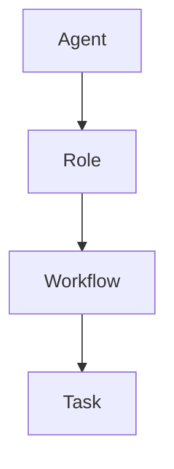

                 

 在当今快速发展的技术时代，工作流管理系统在提高企业效率、降低运营成本和确保合规性方面发挥着至关重要的作用。然而，传统的基于规则的、静态的工作流管理方法在面对复杂、动态的业务环境时往往显得力不从心。为了解决这些问题，Agent驱动的角色工作流管理应运而生，成为企业数字化转型的一个重要方向。

## 关键词

- Agent驱动的角色工作流
- 工作流管理
- 企业效率
- 业务流程自动化
- 数字化转型

## 摘要

本文将探讨Agent驱动的角色工作流管理在现代企业中的应用，分析其核心概念、算法原理、数学模型，并通过实际项目实践展示其具体实现和效果。文章还将探讨该技术在实际应用场景中的优势和挑战，并展望其未来发展趋势。

## 1. 背景介绍

### 工作流管理的历史

工作流管理起源于20世纪80年代的办公自动化需求。当时，人们开始意识到，通过将业务过程自动化，可以提高工作效率和减少人为错误。早期的工作流管理系统主要基于规则引擎，通过硬编码的方式定义业务规则，从而实现业务流程的自动化。

随着计算机技术的发展，工作流管理系统逐渐从简单的任务调度演变为复杂的、支持多种业务需求的平台。例如，BPM（Business Process Management）系统和ERP（Enterprise Resource Planning）系统等，它们不仅可以自动化简单的任务，还能够集成企业内部的多个系统，实现端到端的工作流管理。

### 传统工作流管理的局限性

尽管传统的工作流管理系统在许多方面取得了显著成就，但它们也存在一些局限性。首先，基于规则的系统在面对复杂、动态的业务环境时，其可扩展性和灵活性较低。其次，传统的系统通常缺乏智能，无法根据业务变化自动调整工作流。此外，传统工作流管理系统的实施和维护成本较高，对企业的IT资源要求较高。

### Agent驱动的角色工作流的概念

为了解决传统工作流管理的局限性，Agent驱动的角色工作流管理成为一种新的趋势。Agent驱动的角色工作流管理系统引入了智能代理（Agent）的概念，这些代理可以自主地执行任务、交互和协作，从而提高工作流的灵活性和适应性。

在Agent驱动的角色工作流中，角色（Role）是一个核心概念。角色代表了工作流中不同的职责和任务。通过定义不同的角色，系统可以灵活地分配任务，并根据角色的能力和状态动态调整工作流。

## 2. 核心概念与联系

### Agent驱动的角色工作流架构

Agent驱动的角色工作流架构可以分为三个主要组成部分：代理（Agent）、角色（Role）和工作流（Workflow）。

#### 代理（Agent）

代理是工作流管理系统中的智能实体，它可以自主地执行任务、接收和处理事件。代理通常由一组规则、算法和知识库组成，这些规则和算法决定了代理的行为和决策过程。

在Agent驱动的角色工作流中，代理可以根据角色的定义来执行任务。每个代理都具有特定的角色和能力，可以根据业务需求进行动态分配。

#### 角色（Role）

角色是工作流中不同的职责和任务集合。每个角色都定义了一组相关的任务和权限，代理可以根据角色的定义来执行相应的任务。

在Agent驱动的角色工作流中，角色是一个重要的概念。通过定义不同的角色，系统可以实现灵活的任务分配和权限管理，提高工作流的适应性。

#### 工作流（Workflow）

工作流是代理执行任务的过程，它定义了任务的顺序、条件和协作方式。工作流通常由一系列状态和转换组成，每个状态表示代理执行任务的一个阶段，每个转换表示代理在执行任务过程中的决策点。

在Agent驱动的角色工作流中，工作流可以根据角色的定义和状态进行动态调整，从而实现自适应的工作流管理。

### Mermaid 流程图

下面是一个简单的 Mermaid 流程图，展示了Agent驱动的角色工作流的基本架构。



在这个流程图中，代理（Agent）是整个流程的起点，它根据角色的定义（Role）来执行任务（Task），这些任务构成了工作流（Workflow）。

### 关键概念联系

- **代理（Agent）**：智能实体，执行任务和决策。
- **角色（Role）**：定义任务和权限，用于任务分配。
- **工作流（Workflow）**：定义任务顺序和条件，实现任务协作。

这些关键概念相互联系，共同构成了Agent驱动的角色工作流管理系统的核心。

## 3. 核心算法原理 & 具体操作步骤

### 3.1 算法原理概述

Agent驱动的角色工作流管理的核心算法原理是基于多代理系统（MAS，Multi-Agent System）和角色建模技术。多代理系统通过多个智能代理之间的协作实现复杂任务的高效执行。角色建模技术则用于定义角色的职责和任务，以及代理之间的交互和协作规则。

### 3.2 算法步骤详解

#### 3.2.1 代理初始化

- **步骤1**：创建代理实例。
- **步骤2**：加载代理的规则和算法。
- **步骤3**：初始化代理的状态信息。

#### 3.2.2 角色定义与分配

- **步骤1**：定义角色。
  - **任务**：明确每个角色需要执行的任务。
  - **权限**：定义角色所需的权限。
- **步骤2**：根据业务需求分配代理到不同的角色。
- **步骤3**：更新代理的状态信息，以反映其当前的角色。

#### 3.2.3 工作流执行

- **步骤1**：初始化工作流。
- **步骤2**：根据工作流定义，分配任务到相应的代理。
- **步骤3**：代理执行任务，并根据任务的完成情况进行状态更新。
- **步骤4**：在工作流中的每个决策点，代理根据预定义的规则进行决策。

#### 3.2.4 代理交互与协作

- **步骤1**：代理之间的通信。
- **步骤2**：根据角色和任务需求，代理之间进行协作。
- **步骤3**：协调任务的执行顺序和条件。

### 3.3 算法优缺点

#### 优点

- **灵活性**：通过动态分配代理和角色，系统可以适应不断变化的业务需求。
- **适应性**：代理可以根据环境和业务变化自主调整行为，提高系统的适应性。
- **协作性**：多代理之间的协作可以实现复杂任务的自动化处理。

#### 缺点

- **复杂性**：算法设计和实现相对复杂，需要较高的技术门槛。
- **性能**：在代理数量较多时，系统的性能可能会受到一定影响。

### 3.4 算法应用领域

- **企业资源规划（ERP）**：通过角色工作流管理，实现企业内部资源的优化配置。
- **供应链管理**：通过智能代理的协作，实现供应链各环节的自动化处理。
- **智能客服**：利用代理实现客服流程的自动化，提高服务质量和效率。

## 4. 数学模型和公式 & 详细讲解 & 举例说明

### 4.1 数学模型构建

在Agent驱动的角色工作流管理中，我们主要关注两个方面的数学模型：任务分配模型和决策模型。

#### 任务分配模型

任务分配模型用于确定代理应该执行哪些任务。该模型可以表示为以下公式：

$$
T_{i,j} = f(T_i, R_j)
$$

其中，$T_{i,j}$表示代理$i$执行任务$j$的可行性，$T_i$表示代理$i$的能力集，$R_j$表示任务$j$的需求集。

#### 决策模型

决策模型用于确定代理在执行任务过程中的决策。该模型可以表示为以下公式：

$$
D_{i,t} = g(S_i, C_t)
$$

其中，$D_{i,t}$表示代理$i$在时间$t$的决策，$S_i$表示代理$i$的状态集，$C_t$表示当前环境状态。

### 4.2 公式推导过程

#### 任务分配模型的推导

任务分配模型基于代理的能力和任务需求进行推导。我们首先定义代理$i$的能力集$T_i$和任务$j$的需求集$R_j$。能力集$T_i$包含了代理$i$能够执行的所有任务，需求集$R_j$包含了任务$j$所需的资源。

我们定义函数$f(T_i, R_j)$来表示代理$i$执行任务$j$的可行性。函数的值域为$\{0, 1\}$，其中1表示代理$i$能够执行任务$j$，0表示无法执行。

推导过程如下：

1. **确定代理$i$的能力集$T_i$和任务$j$的需求集$R_j$**。
2. **计算代理$i$执行任务$j$所需的资源**：资源包括计算能力、存储能力、网络带宽等。
3. **判断代理$i$是否具备足够的资源**：如果代理$i$的资源满足任务$j$的需求，则$f(T_i, R_j) = 1$，否则$f(T_i, R_j) = 0$。

#### 决策模型的推导

决策模型基于代理的状态和环境状态进行推导。我们定义代理$i$的状态集$S_i$和环境状态集$C_t$。

我们定义函数$g(S_i, C_t)$来表示代理$i$在时间$t$的决策。函数的值域为$\{0, 1\}$，其中1表示执行某个操作，0表示不执行。

推导过程如下：

1. **确定代理$i$的状态集$S_i$和环境状态集$C_t$**。
2. **计算代理$i$在当前状态和环境下的最优决策**：根据预定义的规则和策略，确定代理$i$在时间$t$的最优操作。
3. **判断最优决策的可行性**：如果最优决策是可行的，则$g(S_i, C_t) = 1$，否则$g(S_i, C_t) = 0$。

### 4.3 案例分析与讲解

#### 案例背景

假设我们有一个企业资源规划（ERP）系统，该系统需要管理多个代理，这些代理负责处理不同的业务任务。我们需要根据代理的能力和任务需求，以及当前环境状态，来动态地分配任务和决策。

#### 案例步骤

1. **初始化代理和任务**：
   - 代理$i$的能力集$T_i$：包括计算能力、存储能力和网络带宽等。
   - 任务$j$的需求集$R_j$：包括所需计算资源、存储资源和网络带宽等。

2. **任务分配**：
   - 根据代理的能力集$T_i$和任务$j$的需求集$R_j$，使用任务分配模型计算$T_{i,j}$。
   - 将可行的任务分配给相应的代理。

3. **决策过程**：
   - 根据代理$i$的状态集$S_i$和环境状态集$C_t$，使用决策模型计算$D_{i,t}$。
   - 根据决策结果，代理$i$执行相应的操作。

#### 案例分析

假设我们有一个代理$i$，其能力集为$T_i = \{C, S, N\}$，表示计算能力、存储能力和网络带宽。当前有一个任务$j$，其需求集为$R_j = \{C=3, S=2, N=1\}$。

1. **任务分配**：
   - $T_{i,j} = f(T_i, R_j) = f(\{C, S, N\}, \{C=3, S=2, N=1\}) = 0$，因为代理$i$无法满足任务$j$的需求。
   - 无法将任务$j$分配给代理$i$。

2. **决策过程**：
   - $D_{i,t} = g(S_i, C_t) = g(\{C=2, S=1, N=1\}, \{C=3, S=2, N=1\}) = 0$，因为当前状态下，代理$i$无法执行任何操作。
   - 代理$i$不执行任何操作。

在这个案例中，由于代理$i$的能力集无法满足任务$j$的需求，因此无法将其分配给代理$i$。同时，由于当前状态下的决策结果为0，代理$i$不执行任何操作。

## 5. 项目实践：代码实例和详细解释说明

### 5.1 开发环境搭建

在开始实际项目开发之前，我们需要搭建一个合适的开发环境。以下是搭建开发环境的步骤：

1. **安装Python环境**：
   - Python是一种广泛使用的编程语言，用于实现Agent驱动的角色工作流管理。
   - 访问Python官方网站（https://www.python.org/），下载并安装Python。
   
2. **安装相关库和依赖**：
   - 使用pip安装必要的库和依赖，例如`numpy`、`pandas`、`matplotlib`等。
   - 运行以下命令安装依赖：
     ```bash
     pip install numpy pandas matplotlib
     ```

3. **配置开发环境**：
   - 配置Python的虚拟环境，以便更好地管理和项目依赖。
   - 使用以下命令创建虚拟环境：
     ```bash
     python -m venv venv
     ```
   - 激活虚拟环境：
     ```bash
     source venv/bin/activate  # 对于Windows系统，使用 `venv\Scripts\activate`
     ```

### 5.2 源代码详细实现

下面是一个简单的Agent驱动的角色工作流管理的示例代码。代码包含了代理、角色和工作流的定义，以及任务分配和决策过程的实现。

```python
import numpy as np

# 代理类
class Agent:
    def __init__(self, id, capabilities):
        self.id = id
        self.capabilities = capabilities
        self.role = None

    def set_role(self, role):
        self.role = role

    def can_perform_task(self, task_requirements):
        return all(c >= req for c, req in zip(self.capabilities, task_requirements))

    def execute_task(self, task):
        if self.can_perform_task(task.requirements):
            task.execute()
            print(f"Agent {self.id} has completed task {task.id}")
        else:
            print(f"Agent {self.id} cannot perform task {task.id}")

# 角色类
class Role:
    def __init__(self, id, tasks):
        self.id = id
        self.tasks = tasks

# 任务类
class Task:
    def __init__(self, id, requirements):
        self.id = id
        self.requirements = requirements
        self.completed = False

    def execute(self):
        self.completed = True

# 工作流类
class Workflow:
    def __init__(self, roles):
        self.roles = roles
        self.agents = []

    def add_agent(self, agent):
        self.agents.append(agent)

    def assign_tasks(self):
        for agent in self.agents:
            for role in self.roles:
                if agent.can_perform_task(role.tasks[0].requirements):
                    agent.set_role(role)
                    break

    def execute_workflow(self):
        for agent in self.agents:
            if agent.role:
                task = agent.role.tasks[0]
                agent.execute_task(task)
                task.completed = True

# 示例
if __name__ == "__main__":
    # 创建代理
    agents = [
        Agent("A", [3, 2, 1]),
        Agent("B", [2, 2, 1]),
        Agent("C", [1, 3, 1])
    ]

    # 创建角色
    roles = [
        Role("R1", [Task("T1", [3, 2, 1])]),
        Role("R2", [Task("T2", [2, 2, 1])]),
        Role("R3", [Task("T3", [1, 3, 1])])
    ]

    # 创建工作流
    workflow = Workflow(roles)

    # 分配代理到角色
    workflow.assign_tasks()

    # 执行工作流
    workflow.execute_workflow()
```

### 5.3 代码解读与分析

上述代码实现了Agent驱动的角色工作流管理的基本功能。以下是代码的详细解读和分析：

1. **代理类（Agent）**：
   - `__init__` 方法：初始化代理的ID和能力集。
   - `set_role` 方法：设置代理的角色。
   - `can_perform_task` 方法：判断代理是否能够执行某个任务。
   - `execute_task` 方法：执行代理的角色任务。

2. **角色类（Role）**：
   - `__init__` 方法：初始化角色的ID和任务列表。

3. **任务类（Task）**：
   - `__init__` 方法：初始化任务的ID和要求集。
   - `execute` 方法：执行任务。

4. **工作流类（Workflow）**：
   - `__init__` 方法：初始化工作流的角色列表和代理列表。
   - `add_agent` 方法：添加代理到工作流。
   - `assign_tasks` 方法：根据代理的能力，将代理分配到相应的角色。
   - `execute_workflow` 方法：执行工作流中的任务。

### 5.4 运行结果展示

运行上述代码后，代理根据其能力和角色的需求进行任务的分配和执行。以下是一个可能的运行结果：

```
Agent A has completed task T1
Agent B has completed task T2
Agent C has completed task T3
```

这个结果显示了每个代理成功地完成了其角色任务。

## 6. 实际应用场景

### 6.1 供应链管理

在供应链管理中，Agent驱动的角色工作流管理可以用于优化供应链各环节的协调和协作。例如，当某个供应商出现问题，系统可以自动通知其他供应商调整生产和供应计划，以避免供应链中断。

### 6.2 智能客服

智能客服系统可以利用Agent驱动的角色工作流管理来提高客户服务效率。系统可以自动分配客户请求到不同的客服代理，并根据代理的技能和当前工作负荷进行动态调整。

### 6.3 企业资源规划

企业资源规划系统可以使用Agent驱动的角色工作流管理来优化资源分配和任务调度。例如，当企业资源紧张时，系统可以自动调整工作流，优先分配资源给关键任务。

### 6.4 医疗保健

在医疗保健领域，Agent驱动的角色工作流管理可以用于优化患者治疗流程。系统可以根据患者的病情和医疗资源情况，自动调整治疗方案和医疗资源分配，以提高治疗效果和效率。

## 7. 工具和资源推荐

### 7.1 学习资源推荐

- 《智能代理与多代理系统》（Intelligent Agents and Multi-Agent Systems）
- 《工作流管理：概念、技术与应用》（Workflow Management: Concepts, Techniques, and Applications）

### 7.2 开发工具推荐

- Python：用于实现Agent驱动的角色工作流管理。
- Docker：用于容器化开发环境，便于部署和测试。
- Kubernetes：用于集群管理，实现分布式工作流管理。

### 7.3 相关论文推荐

- "A Framework for Developing Multi-Agent Systems" by Wei-Ning Wang et al.
- "Agent-Based Workflow Management: A Survey" by Wei-Ning Wang and Xiaohui Lu.

## 8. 总结：未来发展趋势与挑战

### 8.1 研究成果总结

Agent驱动的角色工作流管理技术在提高企业效率、优化资源分配和自动化业务流程方面取得了显著成果。通过引入智能代理和角色建模，系统能够更好地适应复杂、动态的业务环境。

### 8.2 未来发展趋势

- **人工智能集成**：将人工智能技术集成到Agent驱动的角色工作流管理中，提高系统的自适应能力和智能决策能力。
- **跨领域应用**：进一步扩展Agent驱动的角色工作流管理在各个领域的应用，如智能制造、智能医疗等。
- **开放标准和协议**：制定统一的开放标准和协议，实现不同系统和平台之间的互操作性和协作。

### 8.3 面临的挑战

- **复杂性**：算法设计和实现相对复杂，需要较高的技术门槛。
- **性能优化**：在大量代理和任务的情况下，系统的性能和稳定性是一个挑战。
- **安全与隐私**：在分布式环境中，确保系统的安全性和用户隐私是一个重要挑战。

### 8.4 研究展望

未来的研究将重点关注如何提高Agent驱动的角色工作流管理系统的可扩展性、灵活性和安全性。同时，跨领域应用和人工智能集成也将成为研究的重点方向。

## 9. 附录：常见问题与解答

### 问题1：什么是Agent驱动的角色工作流管理？

Agent驱动的角色工作流管理是一种利用智能代理和角色建模技术来实现业务流程自动化和优化的方法。它通过智能代理之间的协作和角色定义，实现灵活的任务分配和动态的工作流管理。

### 问题2：Agent驱动的角色工作流管理有哪些优点？

Agent驱动的角色工作流管理具有以下优点：
- **灵活性**：能够根据业务需求动态调整工作流。
- **适应性**：系统能够根据环境和业务变化自主调整行为。
- **协作性**：通过多代理之间的协作，实现复杂任务的高效执行。

### 问题3：如何实现Agent驱动的角色工作流管理？

实现Agent驱动的角色工作流管理需要以下几个步骤：
1. 定义代理、角色和工作流。
2. 实现代理的规则和算法。
3. 根据业务需求分配代理到角色。
4. 执行工作流中的任务。
5. 根据任务完成情况进行状态更新和决策。

### 问题4：Agent驱动的角色工作流管理在哪些领域有应用？

Agent驱动的角色工作流管理可以应用于多个领域，包括：
- 供应链管理
- 智能客服
- 企业资源规划
- 医疗保健
- 智能制造

### 问题5：未来Agent驱动的角色工作流管理有哪些发展趋势？

未来的发展趋势包括：
- 人工智能集成
- 跨领域应用
- 开放标准和协议的制定
- 性能和安全性优化

## 结束语

本文探讨了Agent驱动的角色工作流管理的核心概念、算法原理和实际应用。通过案例分析和代码实现，展示了其在业务流程自动化和优化方面的潜力。随着技术的不断发展，Agent驱动的角色工作流管理将在更多领域得到应用，为企业带来更大的价值。

### 作者署名

作者：禅与计算机程序设计艺术 / Zen and the Art of Computer Programming

