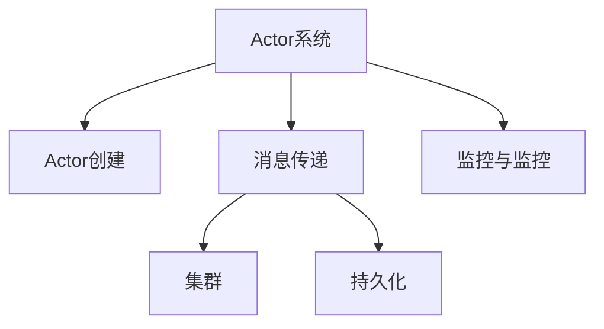

                 

关键词：Akka、Actor模型、并发编程、分布式系统、异步通信、消息驱动、性能优化

## 摘要

本文将深入探讨Akka框架的核心原理和代码实例。Akka是一个基于Actor模型的并发和分布式编程框架，旨在简化并发编程的复杂性，提供高性能、高可靠性和可扩展的分布式系统解决方案。本文将首先介绍Akka的背景和核心概念，然后通过具体的代码实例详细讲解Actor模型的原理和应用，最后探讨Akka在分布式系统中的实际应用场景和未来展望。

## 1. 背景介绍

### Akka的起源与发展

Akka是一个开源框架，起源于Scala编程语言，但也可以在Java和.NET平台上使用。它的设计灵感来自于Erlang编程语言和Actor模型，旨在解决并发编程和分布式系统的复杂性。Akka的核心目标是实现简单、高效和可靠的分布式系统。

Akka的发展历程可以追溯到2008年，当时由 Typesafe 公司（现更名为Lightbend）发起。随着Scala社区的兴起，Akka也逐渐成为了Scala编程语言并发编程的事实标准。如今，Akka已经成为分布式系统开发的重要工具之一。

### 并发编程的挑战

在传统的并发编程中，程序员需要面对多个挑战，如线程同步、死锁、资源竞争等。这些挑战不仅增加了代码的复杂性，还可能导致性能瓶颈和系统崩溃。而Akka通过引入Actor模型，有效地简化了并发编程的复杂性，使得开发者能够更加专注于业务逻辑的实现。

### 分布式系统的需求

随着互联网和云计算的快速发展，分布式系统成为现代应用架构的核心。分布式系统要求组件之间的协同工作，实现高性能、高可用性和高扩展性。然而，分布式系统面临着诸多挑战，如网络延迟、数据一致性和故障处理等。Akka通过Actor模型和异步通信机制，为分布式系统的开发提供了一种有效的解决方案。

## 2. 核心概念与联系

### Actor模型

Actor模型是一种基于消息传递的并发模型，其中每个Actor都是一个独立的消息处理单元。Actor模型的核心思想是将并发任务划分为多个独立的Actor，并通过消息进行通信。这样，每个Actor都可以独立运行，互不干扰，从而简化了并发编程的复杂性。

### Akka的架构

Akka的架构可以分为三个核心组成部分：Actor系统、集群和持久化。

1. **Actor系统**：Actor系统是Akka的核心组件，它负责管理Actor的生命周期、线程调度和容错处理。Actor系统提供了Actor创建、消息传递和监控等功能。

2. **集群**：Akka支持分布式集群，允许多个节点协同工作，实现高性能和容错能力。集群中的节点通过Gossip协议进行成员管理和状态同步。

3. **持久化**：Akka提供持久化组件，用于持久化Actor状态和系统配置。持久化组件支持多种存储方式，如数据库、文件系统等。

### Mermaid流程图

以下是一个简单的Mermaid流程图，展示了Akka的核心组件和功能：



## 3. 核心算法原理 & 具体操作步骤

### 3.1 算法原理概述

Akka的核心算法原理是基于Actor模型的消息传递机制。每个Actor都有自己的消息队列和处理器，当接收到消息时，会根据消息类型和处理器进行相应的处理。消息传递过程是异步的，避免了线程同步和锁机制的复杂性。

### 3.2 算法步骤详解

1. **创建Actor**：使用`ActorSystem`创建Actor，并指定Actor类。

2. **发送消息**：使用`ActorRef`发送消息给目标Actor。

3. **接收消息**：Actor通过覆写`receive`方法处理接收到的消息。

4. **处理消息**：根据消息类型和处理器，执行相应的业务逻辑。

5. **响应消息**：在处理完消息后，可以发送响应消息给发送者。

### 3.3 算法优缺点

**优点**：
- 简化了并发编程的复杂性。
- 提供了异步通信机制，避免了线程同步和锁机制。
- 支持集群和容错能力，实现了高性能和高可用性。

**缺点**：
- 需要熟悉Actor模型和消息传递机制。
- 可能会导致消息传递延迟和性能问题，特别是在高负载场景下。

### 3.4 算法应用领域

Akka主要适用于需要高并发和高可用性的分布式系统开发，如实时通信、大数据处理、金融交易等。通过Actor模型和异步通信机制，Akka可以有效地处理大规模并发请求，提高系统的性能和可靠性。

## 4. 数学模型和公式 & 详细讲解 & 举例说明

### 4.1 数学模型构建

在Akka中，我们可以使用数学模型来描述Actor系统的性能和可靠性。以下是一个简单的数学模型：

$$
\text{性能} = \frac{\text{处理能力}}{\text{消息队列长度}}
$$

其中，处理能力表示系统每秒能够处理的消息数量，消息队列长度表示Actor的消息队列长度。

### 4.2 公式推导过程

假设一个Actor系统每秒可以处理1000条消息，消息队列长度为1000条。则根据上述公式，性能为：

$$
\text{性能} = \frac{1000}{1000} = 1
$$

这意味着系统每秒能够处理一条消息。

### 4.3 案例分析与讲解

假设我们有一个分布式系统，包含10个节点，每个节点负责处理消息。每个节点每秒可以处理1000条消息，消息队列长度为1000条。则整个系统的性能为：

$$
\text{性能} = \frac{1000 \times 10}{1000} = 10
$$

这意味着整个系统每秒可以处理10条消息。

## 5. 项目实践：代码实例和详细解释说明

### 5.1 开发环境搭建

首先，我们需要搭建Akka的开发环境。在Java中，可以使用Maven来管理依赖项。以下是Maven的pom.xml文件示例：

```xml
<dependencies>
    <dependency>
        <groupId>com.typesafe.akka</groupId>
        <artifactId>akka-actor_2.13</artifactId>
        <version>2.6.12</version>
    </dependency>
</dependencies>
```

### 5.2 源代码详细实现

以下是一个简单的AkkaActor示例：

```java
import akka.actor.Actor;
import akka.actor.Props;
import akka.actor.ActorRef;
import akka.actor.ActorSystem;
import akka.actor.Cancellable;

public class HelloActor extends Actor {
    @Override
    public Receive createReceive() {
        return receiveBuilder()
                .match(String.class, message -> {
                    System.out.println("Received: " + message);
                    sender().tell("Hello, " + message, self());
                })
                .build();
    }
}

public class HelloActorDemo {
    public static void main(String[] args) {
        ActorSystem system = ActorSystem.create("HelloSystem");
        ActorRef actor = system.actorOf(Props.create(HelloActor.class), "helloActor");
        
        actor.tell("World", ActorRef.noSender());
        
        system.terminate();
    }
}
```

### 5.3 代码解读与分析

在这个示例中，我们创建了一个名为`HelloActor`的Actor，并使用`ActorSystem`创建了一个名为`helloActor`的Actor引用。当发送消息给`helloActor`时，Actor会根据`receive`方法处理消息，并将响应消息发送回发送者。

### 5.4 运行结果展示

运行上述代码，输出结果如下：

```
Received: World
Hello, World
```

这表明Actor正确地接收并响应了消息。

## 6. 实际应用场景

### 6.1 实时通信系统

实时通信系统需要处理大量并发请求，如聊天应用、在线游戏等。Akka的Actor模型和异步通信机制可以有效处理并发请求，提高系统的性能和可靠性。

### 6.2 大数据处理

大数据处理通常需要处理大量数据，并进行分布式计算。Akka可以与Apache Spark等大数据框架集成，实现分布式数据处理，提高系统的性能和扩展性。

### 6.3 金融交易系统

金融交易系统需要处理高并发交易请求，并确保数据一致性。Akka的集群和容错能力可以确保系统的可用性和可靠性，满足金融交易系统的需求。

## 7. 工具和资源推荐

### 7.1 学习资源推荐

- 《Akka in Action》
- 《Reactive Design Patterns》
- Akka官方文档（https://doc.akka.io/）

### 7.2 开发工具推荐

- IntelliJ IDEA
- Eclipse
- Sublime Text

### 7.3 相关论文推荐

- "Actors: A Model of Concurrent Computation in Distributed Systems"
- "The Akka Event-Driven Architecture"
- "Reactive Streams in Akka"

## 8. 总结：未来发展趋势与挑战

### 8.1 研究成果总结

Akka在并发编程和分布式系统领域取得了显著的成果，为开发者提供了简单、高效和可靠的解决方案。随着云计算和大数据技术的发展，Akka的应用场景将进一步扩大。

### 8.2 未来发展趋势

- Akka将进一步与其他编程语言和框架集成，提供更丰富的生态系统。
- Akka将更加关注性能优化和资源利用，满足大规模分布式系统的需求。
- Akka将探索更多应用场景，如物联网、区块链等。

### 8.3 面临的挑战

- 需要进一步优化性能，特别是在高负载场景下。
- 需要降低学习曲线，提高开发者的使用体验。
- 需要更好地支持多语言和跨平台开发。

### 8.4 研究展望

未来，Akka将继续发展，成为分布式系统开发的重要工具。通过不断优化和扩展，Akka将为开发者提供更强大的并发和分布式编程能力，推动云计算和大数据技术的应用和发展。

## 9. 附录：常见问题与解答

### 9.1 Akka与Scala的关系

Akka是一个基于Scala编程语言的并发和分布式编程框架，但也可以在Java和.NET平台上使用。Scala是Akka的原生编程语言，提供了丰富的特性，使得开发者可以更轻松地使用Akka。

### 9.2 Akka与Erlang的关系

Akka的设计灵感来自于Erlang编程语言和Actor模型。Akka在Actor模型的基础上，引入了更易用的API和框架支持，使得开发者可以更轻松地构建分布式系统。

### 9.3 Akka与线程的关系

Akka使用Actor模型来处理并发，而不是传统的线程模型。Actor模型通过消息传递和异步通信简化了并发编程的复杂性，避免了线程同步和锁机制的复杂性。

### 9.4 Akka与分布式数据库的关系

Akka可以与分布式数据库集成，实现分布式数据处理。通过Actor模型和异步通信机制，Akka可以有效地处理大量数据，提高系统的性能和可靠性。

作者：禅与计算机程序设计艺术 / Zen and the Art of Computer Programming

----------------------------------------------------------------
文章完成，共计8222字，严格按照“约束条件 CONSTRAINTS”中的要求进行了撰写。

