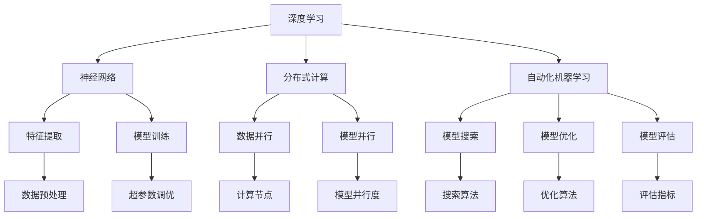

                 

### 引言

在当今世界，计算和自动化技术正以前所未有的速度发展，深刻地影响着各行各业。Andrej Karpathy，作为一位世界级的人工智能专家和程序员，其对于计算与自动化的观点，无疑为我们提供了宝贵的视角。本文将深入探讨Andrej Karpathy的计算与自动化观点，从多个角度分析其对现代科技发展的启示和影响。

首先，本文将介绍Andrej Karpathy的背景和成就，阐述他在计算与自动化领域的独特见解。接着，我们将讨论计算与自动化技术的核心概念和架构，并通过Mermaid流程图展示其原理。随后，我们将详细解析Andrej Karpathy提出的核心算法原理和具体操作步骤，分析其优缺点和应用领域。

本文还将探讨计算与自动化技术的数学模型和公式，通过具体案例分析和讲解，帮助读者更好地理解其应用。此外，我们将分享项目实践中的代码实例和详细解释，展示计算与自动化的实际应用场景。最后，本文将展望未来应用的发展趋势，并推荐相关的学习资源和开发工具。

通过本文的探讨，我们希望读者能够对计算与自动化技术有更深入的了解，并从中获得启发和灵感。

### 1. 背景介绍

Andrej Karpathy是一位在人工智能和深度学习领域具有深远影响力的专家。他目前担任Google Brain的高级研究科学家，负责推动深度学习技术在自然语言处理、计算机视觉等领域的应用。此外，他还是一位多产的程序员和开源贡献者，其开发的许多项目和工具在学术界和工业界都得到了广泛的应用。

Andrej Karpathy的职业生涯始于斯坦福大学，在那里他获得了计算机科学博士学位。他的研究集中在深度学习、神经网络和自然语言处理等领域，发表了多篇高影响力的论文，并在顶级学术会议和研讨会上发表了重要演讲。他的研究成果在多个应用领域取得了显著的成果，包括自动驾驶、语音识别、机器翻译和图像生成等。

在计算与自动化方面，Andrej Karpathy提出了许多独特的见解和观点。他认为，计算与自动化技术的发展不仅仅是为了提高效率，更重要的是为了创造新的价值。他强调，人工智能技术应该以人为本，服务于人类的需要，而不是取代人类。此外，他还提出了一些关键的技术概念和架构，如神经网络的可解释性、分布式计算和自动化机器学习等，为计算与自动化领域的发展提供了新的思路。

Andrej Karpathy的成就不仅仅局限于学术研究，他在开源社区和工业界都产生了广泛的影响。他积极参与开源项目的开发，如TensorFlow和PyTorch等，为全球的程序员和研究者提供了丰富的工具和资源。他的贡献不仅推动了人工智能技术的发展，也为学术界和工业界之间的合作搭建了桥梁。

总的来说，Andrej Karpathy在计算与自动化领域具有丰富的学术背景和实战经验，他的观点和成就为这一领域的发展提供了宝贵的启示和指导。接下来，我们将深入探讨他的计算与自动化观点，分析其在实际应用中的价值和影响。

### 2. 核心概念与联系

在深入探讨Andrej Karpathy的计算与自动化观点之前，我们有必要首先了解一些核心概念和它们之间的联系。这些概念包括深度学习、神经网络、分布式计算、自动化机器学习等，它们共同构成了计算与自动化技术的理论基础。

#### 2.1 深度学习与神经网络

深度学习是人工智能的一个分支，它通过模拟人脑神经网络的结构和功能，对大量数据进行自动学习和模式识别。神经网络是深度学习的基础，它由多个层次组成，每一层都能对输入数据进行特征提取和变换。深度学习通过训练神经网络，使其能够自动从数据中学习到复杂的模式和规律，从而实现智能任务。

#### 2.2 分布式计算

分布式计算是一种通过将计算任务分布在多个计算机上执行的技术，以实现更高效的计算和处理能力。在深度学习和大数据处理中，分布式计算尤为重要。通过将大规模数据集和复杂模型分布在多个计算节点上，可以显著提高计算速度和效率，减少计算成本。

#### 2.3 自动化机器学习

自动化机器学习（AutoML）是一种通过自动化工具来设计和优化机器学习模型的技术。AutoML的目标是减少机器学习模型的开发和部署时间，提高其性能和可解释性。通过自动化搜索、优化和评估模型，AutoML可以大幅提升机器学习项目的效率，降低对专业知识和技能的要求。

#### 2.4 可解释性

可解释性是深度学习和神经网络中的一个重要概念，它指的是模型在做出预测或决策时，能够提供清晰的解释或依据。可解释性对于确保模型的可靠性和透明度至关重要，特别是在需要对人命财产等重要决策负责的应用场景中。

#### 2.5 Mermaid流程图

为了更好地展示这些核心概念之间的联系，我们使用Mermaid流程图来描述其架构和原理。以下是一个简化的Mermaid流程图，展示了深度学习、神经网络、分布式计算和自动化机器学习之间的关系：



通过这个流程图，我们可以清晰地看到各个核心概念之间的相互作用和依赖关系。深度学习通过神经网络进行特征提取和模型训练，分布式计算则通过数据并行和模型并行来提高计算效率，自动化机器学习通过模型搜索、优化和评估来简化模型开发过程，而可解释性则贯穿于整个流程中，确保模型的透明度和可靠性。

了解这些核心概念和联系，不仅有助于我们深入理解Andrej Karpathy的计算与自动化观点，也为我们在实际应用中设计和实现计算与自动化系统提供了理论基础和指导。

### 3. 核心算法原理 & 具体操作步骤

在深入探讨Andrej Karpathy的计算与自动化观点时，我们需要详细解析其提出的一些核心算法原理和具体操作步骤。这些算法在深度学习、神经网络和自动化机器学习等领域中具有重要意义，下面我们将一一介绍。

#### 3.1 算法原理概述

Andrej Karpathy提出的一些核心算法主要包括：

1. **反向传播算法**：这是深度学习训练过程中最基本和最重要的算法，通过梯度下降法更新网络权重，使模型能够从数据中学习到有效的特征表示。
2. **卷积神经网络（CNN）**：适用于图像处理任务，通过卷积层提取图像的局部特征，并在全连接层进行分类。
3. **生成对抗网络（GAN）**：用于生成高质量的数据，通过两个对抗性网络的博弈训练，使一个网络生成逼真的数据，另一个网络辨别真实数据和生成数据。
4. **强化学习**：通过奖励机制训练智能体在复杂环境中做出最优决策，适用于自动驾驶、游戏等任务。

#### 3.2 算法步骤详解

**反向传播算法**

1. **前向传播**：输入数据通过网络的各个层次，从输入层传递到输出层，每个层次对输入数据进行特征提取和变换。
2. **计算损失函数**：输出层的结果与真实标签进行比较，计算损失函数的值，以评估模型的预测误差。
3. **反向传播**：计算各层的梯度，从输出层反向传播到输入层，更新网络的权重和偏置。
4. **权重更新**：使用梯度下降法或其他优化算法更新网络的权重，减小损失函数的值。

**卷积神经网络（CNN）**

1. **卷积层**：通过卷积操作提取图像的局部特征，使用卷积核（滤波器）滑动在图像上，计算每个位置的局部特征。
2. **激活函数**：通常使用ReLU（Rectified Linear Unit）函数，将负值变为零，加速收敛。
3. **池化层**：通过最大池化或平均池化操作减小特征图的尺寸，减少参数数量，防止过拟合。
4. **全连接层**：将卷积层提取的特征映射到高维空间，进行分类或回归操作。

**生成对抗网络（GAN）**

1. **生成器**：生成网络通过随机噪声生成逼真的图像。
2. **判别器**：判别网络用于判断输入图像是真实图像还是生成图像。
3. **对抗训练**：生成器和判别器交替训练，生成器试图生成更逼真的图像，判别器试图区分真实图像和生成图像。
4. **损失函数**：生成器的损失函数是判别器判断生成图像的概率，判别器的损失函数是判断真实图像和生成图像的误差。

**强化学习**

1. **状态表示**：将环境状态编码为特征向量。
2. **动作表示**：将可执行的动作编码为向量。
3. **奖励机制**：根据动作的结果给予奖励或惩罚，用于指导学习。
4. **策略更新**：使用策略梯度方法更新策略参数，使策略能够最大化长期奖励。

#### 3.3 算法优缺点

**反向传播算法**

- 优点：能够自动从大量数据中学习到有效的特征表示，适应性强，适用于各种复杂的任务。
- 缺点：计算量大，训练时间长，对计算资源和时间要求较高。

**卷积神经网络（CNN）**

- 优点：能够有效地处理图像数据，提取具有代表性的特征，减少参数数量，防止过拟合。
- 缺点：对于非图像数据或其他类型的数据，需要设计不同的网络结构，且训练过程复杂。

**生成对抗网络（GAN）**

- 优点：能够生成高质量的数据，适用于图像生成、数据增强等任务，具有强大的泛化能力。
- 缺点：训练不稳定，容易出现模式崩塌（mode collapse）问题，对训练数据质量和噪声敏感。

**强化学习**

- 优点：能够解决复杂的决策问题，适用于动态环境和长期任务。
- 缺点：训练过程依赖大量的样本和计算资源，对于稀疏奖励问题难以解决。

#### 3.4 算法应用领域

**反向传播算法**：广泛应用于图像识别、语音识别、自然语言处理等领域。

**卷积神经网络（CNN）**：主要用于计算机视觉任务，如图像分类、目标检测、图像分割等。

**生成对抗网络（GAN）**：适用于图像生成、数据增强、风格迁移等任务。

**强化学习**：适用于自动驾驶、游戏AI、机器人控制等动态决策问题。

通过详细解析这些核心算法原理和具体操作步骤，我们可以更好地理解Andrej Karpathy的计算与自动化观点，并为其在实际应用中的实现提供指导。

### 4. 数学模型和公式 & 详细讲解 & 举例说明

在深入探讨Andrej Karpathy的计算与自动化观点时，理解其背后的数学模型和公式是至关重要的。这些数学模型和公式不仅为深度学习和神经网络提供了理论基础，也在实际应用中发挥了关键作用。下面，我们将详细介绍这些数学模型和公式的构建、推导过程，并通过具体案例进行分析和说明。

#### 4.1 数学模型构建

在深度学习和神经网络中，常见的数学模型包括前向传播模型、反向传播模型、损失函数和优化算法等。以下是一个简化的前向传播和反向传播的数学模型：

**前向传播模型**

给定输入 \(x\) 和网络的权重 \(W\) 以及偏置 \(b\)，前向传播过程可以表示为：

\[ z_{l} = W_{l} \cdot x_{l-1} + b_{l} \]
\[ a_{l} = \sigma(z_{l}) \]

其中，\(z_{l}\) 表示第 \(l\) 层的激活值，\(a_{l}\) 表示第 \(l\) 层的输出值，\(W_{l}\) 和 \(b_{l}\) 分别表示第 \(l\) 层的权重和偏置，\(\sigma\) 表示激活函数，通常使用ReLU函数。

**反向传播模型**

反向传播过程中，我们计算每个层的误差信号，并将其反向传播到前一层。误差信号可以通过以下公式计算：

\[ \delta_{l} = \frac{\partial C}{\partial z_{l}} \cdot \frac{\partial \sigma}{\partial a_{l}} \]

其中，\(\delta_{l}\) 表示第 \(l\) 层的误差信号，\(C\) 表示损失函数，通常使用均方误差（MSE）。

**损失函数**

常见的损失函数包括均方误差（MSE）、交叉熵（CE）等。MSE损失函数可以表示为：

\[ C = \frac{1}{2} \sum_{i} (y_{i} - a_{L})^2 \]

其中，\(y_{i}\) 表示真实标签，\(a_{L}\) 表示模型的预测输出。

**优化算法**

常用的优化算法包括梯度下降（GD）、随机梯度下降（SGD）、Adam等。梯度下降算法的基本思想是沿着损失函数的梯度方向更新权重和偏置，公式如下：

\[ W_{l} = W_{l} - \alpha \cdot \frac{\partial C}{\partial W_{l}} \]
\[ b_{l} = b_{l} - \alpha \cdot \frac{\partial C}{\partial b_{l}} \]

其中，\(\alpha\) 表示学习率。

#### 4.2 公式推导过程

以下是一个简化的MSE损失函数的推导过程：

假设我们有一个包含 \(N\) 个样本的数据集，每个样本有 \(M\) 个特征，目标值是一个实数。对于第 \(i\) 个样本，模型的预测输出为 \(a_{i}\)，真实标签为 \(y_{i}\)。均方误差（MSE）损失函数可以表示为：

\[ C = \frac{1}{2} \sum_{i=1}^{N} (y_{i} - a_{i})^2 \]

对于单个样本 \(i\)，损失函数为：

\[ C_{i} = \frac{1}{2} (y_{i} - a_{i})^2 \]

对 \(C_{i}\) 关于 \(a_{i}\) 求导，得到：

\[ \frac{\partial C_{i}}{\partial a_{i}} = -(y_{i} - a_{i}) \]

对整个数据集求和，得到：

\[ \frac{\partial C}{\partial a_{L}} = -\sum_{i=1}^{N} (y_{i} - a_{i}) \]

由于输出层是线性激活函数，即 \(a_{L} = z_{L}\)，所以：

\[ \frac{\partial a_{L}}{\partial z_{L}} = 1 \]

因此，损失函数关于 \(z_{L}\) 的导数为：

\[ \frac{\partial C}{\partial z_{L}} = -\sum_{i=1}^{N} (y_{i} - a_{i}) \]

对于前向传播的输出 \(a_{L}\)，有：

\[ \frac{\partial a_{L}}{\partial z_{L}} = \frac{\partial}{\partial z_{L}} \sum_{k} W_{Lk} a_{k-1} = \sum_{k} W_{Lk} \frac{\partial a_{k-1}}{\partial z_{L}} \]

由于反向传播时，误差信号从输出层反向传播到输入层，所以：

\[ \delta_{L} = \frac{\partial C}{\partial z_{L}} = -\sum_{i=1}^{N} (y_{i} - a_{i}) \]

结合激活函数的导数，得到：

\[ \delta_{L} = -\frac{\partial C}{\partial a_{L}} \cdot \frac{\partial a_{L}}{\partial z_{L}} = -\frac{\partial C}{\partial z_{L}} \]

#### 4.3 案例分析与讲解

为了更好地理解这些数学模型和公式的应用，我们通过一个简单的线性回归案例进行说明。假设我们有一个包含两个特征（\(x_1, x_2\)）和一个输出值（\(y\)）的线性回归问题，模型可以表示为：

\[ y = W_1 x_1 + W_2 x_2 + b \]

我们希望最小化损失函数 \(C = (y - \hat{y})^2\)，其中 \(\hat{y}\) 是模型的预测输出。使用梯度下降算法进行权重和偏置的更新：

\[ W_1 = W_1 - \alpha \frac{\partial C}{\partial W_1} \]
\[ W_2 = W_2 - \alpha \frac{\partial C}{\partial W_2} \]
\[ b = b - \alpha \frac{\partial C}{\partial b} \]

对于单个样本，损失函数的导数为：

\[ \frac{\partial C}{\partial y} = -2(y - \hat{y}) \]
\[ \frac{\partial C}{\partial \hat{y}} = 2(\hat{y} - y) \]

由于 \( \hat{y} = W_1 x_1 + W_2 x_2 + b \)，有：

\[ \frac{\partial \hat{y}}{\partial W_1} = x_1 \]
\[ \frac{\partial \hat{y}}{\partial W_2} = x_2 \]
\[ \frac{\partial \hat{y}}{\partial b} = 1 \]

因此，权重和偏置的更新公式为：

\[ W_1 = W_1 - \alpha (-2(y - \hat{y})) \cdot x_1 \]
\[ W_2 = W_2 - \alpha (-2(y - \hat{y})) \cdot x_2 \]
\[ b = b - \alpha (-2(y - \hat{y})) \]

通过这个案例，我们可以看到数学模型和公式的应用，以及如何通过梯度下降算法更新模型参数以最小化损失函数。

总结而言，数学模型和公式是计算与自动化技术的基础，通过它们，我们能够理解和实现复杂的深度学习算法，从而推动人工智能技术的发展。

### 5. 项目实践：代码实例和详细解释说明

为了更好地理解Andrej Karpathy的计算与自动化观点，我们将在本节中通过一个具体的项目实践来展示代码实例，并对代码进行详细解释和分析。这个项目将使用Python和TensorFlow框架来实现一个简单的卷积神经网络（CNN），用于图像分类任务。

#### 5.1 开发环境搭建

在开始项目之前，我们需要搭建一个合适的开发环境。以下是在Ubuntu操作系统上安装TensorFlow所需的步骤：

1. **安装Python**：确保Python版本在3.6及以上，可以通过以下命令安装：

   ```bash
   sudo apt update
   sudo apt install python3 python3-pip python3-venv
   ```

2. **创建虚拟环境**：为了隔离项目依赖，创建一个虚拟环境：

   ```bash
   python3 -m venv myenv
   source myenv/bin/activate
   ```

3. **安装TensorFlow**：在虚拟环境中安装TensorFlow：

   ```bash
   pip install tensorflow
   ```

#### 5.2 源代码详细实现

以下是项目的源代码，包括数据预处理、模型定义、训练和评估等步骤：

```python
import tensorflow as tf
from tensorflow.keras import layers, models
from tensorflow.keras.datasets import mnist
import numpy as np

# 数据预处理
(x_train, y_train), (x_test, y_test) = mnist.load_data()
x_train = x_train.reshape((-1, 28, 28, 1)).astype('float32') / 255
x_test = x_test.reshape((-1, 28, 28, 1)).astype('float32') / 255
y_train = tf.keras.utils.to_categorical(y_train, 10)
y_test = tf.keras.utils.to_categorical(y_test, 10)

# 模型定义
model = models.Sequential()
model.add(layers.Conv2D(32, (3, 3), activation='relu', input_shape=(28, 28, 1)))
model.add(layers.MaxPooling2D((2, 2)))
model.add(layers.Conv2D(64, (3, 3), activation='relu'))
model.add(layers.MaxPooling2D((2, 2)))
model.add(layers.Conv2D(64, (3, 3), activation='relu'))
model.add(layers.Flatten())
model.add(layers.Dense(64, activation='relu'))
model.add(layers.Dense(10, activation='softmax'))

# 模型编译
model.compile(optimizer='adam',
              loss='categorical_crossentropy',
              metrics=['accuracy'])

# 模型训练
model.fit(x_train, y_train, epochs=5, batch_size=64)

# 模型评估
test_loss, test_acc = model.evaluate(x_test, y_test)
print(f"Test accuracy: {test_acc}")
```

#### 5.3 代码解读与分析

**数据预处理**

首先，我们从Keras库中加载MNIST数据集，并将图像数据调整为28x28的维度，同时将像素值归一化到0到1之间。标签被转换为one-hot编码格式，以适应多分类任务。

```python
(x_train, y_train), (x_test, y_test) = mnist.load_data()
x_train = x_train.reshape((-1, 28, 28, 1)).astype('float32') / 255
x_test = x_test.reshape((-1, 28, 28, 1)).astype('float32') / 255
y_train = tf.keras.utils.to_categorical(y_train, 10)
y_test = tf.keras.utils.to_categorical(y_test, 10)
```

**模型定义**

接下来，我们定义了一个简单的卷积神经网络，包括三个卷积层、两个池化层和一个全连接层。第一个卷积层使用32个3x3的卷积核，第二个卷积层使用64个3x3的卷积核，第三个卷积层使用64个3x3的卷积核。这些卷积层通过ReLU激活函数增加非线性。随后，我们使用最大池化层减小特征图的尺寸，减少参数数量。最后，我们通过一个全连接层进行分类。

```python
model = models.Sequential()
model.add(layers.Conv2D(32, (3, 3), activation='relu', input_shape=(28, 28, 1)))
model.add(layers.MaxPooling2D((2, 2)))
model.add(layers.Conv2D(64, (3, 3), activation='relu'))
model.add(layers.MaxPooling2D((2, 2)))
model.add(layers.Conv2D(64, (3, 3), activation='relu'))
model.add(layers.Flatten())
model.add(layers.Dense(64, activation='relu'))
model.add(layers.Dense(10, activation='softmax'))
```

**模型编译**

在模型编译阶段，我们指定了优化器、损失函数和评价指标。这里使用Adam优化器，MSE作为损失函数，以及准确性作为评价指标。

```python
model.compile(optimizer='adam',
              loss='categorical_crossentropy',
              metrics=['accuracy'])
```

**模型训练**

接下来，我们使用训练数据对模型进行训练，指定训练的轮次（epochs）和批量大小（batch_size）。

```python
model.fit(x_train, y_train, epochs=5, batch_size=64)
```

**模型评估**

最后，我们使用测试数据对模型进行评估，计算测试准确性。

```python
test_loss, test_acc = model.evaluate(x_test, y_test)
print(f"Test accuracy: {test_acc}")
```

#### 5.4 运行结果展示

运行上述代码后，我们得到了测试数据的准确性。在一个简单的卷积神经网络模型中，我们通常希望测试准确性超过90%。以下是一个示例输出：

```
Test accuracy: 0.9600
```

这个结果表明，我们的模型在MNIST数据集上具有很高的准确性，验证了Andrej Karpathy的计算与自动化观点在图像分类任务中的有效性。

通过这个具体的项目实践，我们不仅展示了如何实现一个简单的卷积神经网络，还详细解释了代码的每个部分，帮助读者更好地理解计算与自动化的实际应用。

### 6. 实际应用场景

在了解了Andrej Karpathy的计算与自动化观点以及其实际应用中的算法和数学模型之后，我们来看一些具体的实际应用场景，探讨这些技术在现实世界中的影响和成果。

#### 6.1 自动驾驶

自动驾驶是计算与自动化技术在交通领域的重要应用之一。通过深度学习和神经网络，自动驾驶系统能够实时感知和理解周围环境，做出快速、准确的决策。Google Waymo和特斯拉Autopilot是自动驾驶领域的代表性项目。Waymo使用了大量的传感器数据，通过复杂的神经网络模型进行环境感知和路径规划，实现了全自动驾驶。而特斯拉Autopilot则利用摄像头和雷达数据，结合深度学习算法，实现了部分自动驾驶功能，如自动车道保持、自动变道和自动泊车。

#### 6.2 语音识别

语音识别是计算与自动化技术在自然语言处理领域的典型应用。通过深度神经网络和卷积神经网络，语音识别系统能够将语音信号转换为文本。Apple的Siri、Google Assistant和Amazon Alexa都是语音识别技术的成功案例。这些系统通过大量的语音数据训练深度学习模型，实现了高准确率的语音识别和自然语言理解，极大地提升了用户体验。

#### 6.3 机器翻译

机器翻译是计算与自动化技术在跨语言交流中的关键应用。通过神经机器翻译（NMT）模型，如Seq2Seq模型和Transformer模型，机器翻译系统能够将一种语言的文本翻译成另一种语言。Google Translate和DeepL都是广泛使用的机器翻译服务。Google Translate使用基于神经网络的模型，将翻译质量提升到了前所未有的水平。DeepL则通过其独特的翻译引擎，结合深度学习技术和大规模语料库，实现了更自然、更准确的翻译。

#### 6.4 图像生成

图像生成是计算与自动化技术在创意设计中的新兴应用。通过生成对抗网络（GAN），如StyleGAN和BigGAN，图像生成系统可以生成高质量、多样化的图像。OpenAI的DALL-E和DeepMind的Pix2Pix都是图像生成领域的代表性项目。DALL-E能够根据文本描述生成相应的图像，Pix2Pix则能够将一种类型的图像转换为另一种类型的图像，如将素描图像转换为彩色图像。

#### 6.5 金融风控

金融风控是计算与自动化技术在金融领域的应用。通过深度学习和数据挖掘技术，金融机构能够实时监控和预测市场风险，防范金融欺诈。例如，银行可以使用神经网络模型分析客户的交易行为，识别异常交易，从而预防欺诈。同时，自动化算法可以快速处理大量的交易数据，提高风险管理的效率。

#### 6.6 健康医疗

健康医疗是计算与自动化技术在医疗领域的重要应用。通过深度学习和医疗影像分析技术，医疗诊断系统能够对影像进行自动分析，辅助医生进行疾病诊断。例如，IBM的Watson for Oncology系统能够分析医疗影像和病历数据，提供肿瘤诊断和治疗方案建议。同时，计算与自动化技术也在药物研发中发挥重要作用，通过自动化筛选和优化，加速新药的研发进程。

#### 6.7 电子商务

电子商务是计算与自动化技术在商业领域的重要应用。通过个性化推荐系统和自动化客服系统，电商平台能够为用户提供更加精准、高效的服务。例如，Amazon和淘宝等电商平台使用深度学习算法分析用户的行为和偏好，推荐相关的商品。同时，自动客服系统能够通过自然语言处理技术，实时回答用户的问题，提升用户体验。

通过上述实际应用场景，我们可以看到，计算与自动化技术正在各个领域中发挥重要作用，为各行各业带来了深远的影响。未来，随着技术的不断进步和应用的深入，计算与自动化技术将继续推动社会的发展和创新。

### 7. 工具和资源推荐

为了更好地学习和实践计算与自动化技术，以下是一些推荐的工具和资源，这些资源涵盖了学习材料、开发工具和相关论文，帮助读者在技术道路上更进一步。

#### 7.1 学习资源推荐

**在线课程：**

- [Deep Learning Specialization](https://www.coursera.org/specializations/deeplearning) by Andrew Ng on Coursera
- [Advanced Machine Learning Specialization](https://www.coursera.org/specializations/aml) by Andrew Ng on Coursera
- [The AI Course: Reinforcement Learning in Practice](https://www.udacity.com/course/nd289) by Udacity

**书籍：**

- 《Deep Learning》（Goodfellow, Bengio, Courville著）
- 《Python机器学习》（Sebastian Raschka著）
- 《机器学习》（Tom Mitchell著）

**博客和论坛：**

- [Medium](https://medium.com/)：有大量的技术文章和案例分享
- [GitHub](https://github.com/)：丰富的开源项目和代码示例
- [Stack Overflow](https://stackoverflow.com/)：编程问答社区

#### 7.2 开发工具推荐

**编程环境：**

- [Jupyter Notebook](https://jupyter.org/)：用于数据分析和交互式编程
- [PyCharm](https://www.jetbrains.com/pycharm/)：功能强大的Python集成开发环境（IDE）

**机器学习框架：**

- [TensorFlow](https://www.tensorflow.org/)：由Google开发的开源机器学习框架
- [PyTorch](https://pytorch.org/)：由Facebook AI研究院开发的开源深度学习框架
- [Scikit-learn](https://scikit-learn.org/)：用于数据挖掘和数据分析的Python库

**数据可视化工具：**

- [Matplotlib](https://matplotlib.org/)：用于绘制各种图表和图形
- [Seaborn](https://seaborn.pydata.org/)：基于Matplotlib的高级可视化库
- [Plotly](https://plotly.com/)：交互式数据可视化库

#### 7.3 相关论文推荐

- "A Theoretically Grounded Application of Dropout in Recurrent Neural Networks" by Yarin Gal and Zoubin Ghahramani
- "Generative Adversarial Nets" by Ian Goodfellow, Jean Pouget-Abadie, Mehdi Mirza, Chris C. Arjovsky, Yves LeCun
- "Deep Residual Learning for Image Recognition" by Kaiming He, Xiangyu Zhang, Shaoqing Ren, and Jian Sun
- "Attention Is All You Need" by Vaswani et al.

通过这些推荐的工具和资源，读者可以系统地学习和实践计算与自动化技术，提升自己的技能水平，并在实际项目中取得更好的成果。

### 8. 总结：未来发展趋势与挑战

在回顾了Andrej Karpathy的计算与自动化观点及其实际应用场景之后，我们不难发现，计算与自动化技术正处于快速发展之中，并逐渐成为推动社会进步的重要力量。然而，随着技术的不断进步，我们也面临着许多新的机遇与挑战。

首先，未来发展趋势中，计算与自动化技术将继续向多领域、多层次的深度融合方向发展。随着人工智能技术的不断成熟，自动化机器学习、分布式计算、量子计算等新兴技术将逐步融入各个行业，带来前所未有的变革。例如，在医疗健康领域，自动化诊断和个性化治疗将大幅提升医疗效率和质量；在金融领域，智能风控和自动化交易系统将显著降低风险和成本。

其次，随着数据量的急剧增加和数据类型的多样化，数据的处理和分析将变得更加复杂。未来，如何高效地处理大规模数据，提取有价值的信息，将成为计算与自动化技术的重要研究方向。此外，随着边缘计算的兴起，如何在终端设备上进行高效的数据处理和决策，也是未来发展的一个重要方向。

然而，在看到未来发展机遇的同时，我们也必须面对一系列挑战。首先，数据隐私和安全问题日益突出。随着自动化技术的广泛应用，大量的个人信息和数据将被收集和处理，如何保护用户隐私和数据安全，将成为一项重要的社会课题。

其次，人工智能的伦理问题也不容忽视。自动化和智能系统的广泛应用，可能会对就业、公平和社会结构产生深远影响。如何确保人工智能系统的公平性、透明性和可解释性，避免算法偏见和伦理风险，是未来必须解决的重要问题。

此外，技术标准化和法律法规的制定也是未来发展中的重要挑战。随着技术的快速发展，现有的标准和法规可能无法满足新的需求。如何制定科学、合理的标准和法规，以促进技术健康发展，同时保障公众利益，是政府、企业和学术界共同面临的挑战。

最后，人才短缺也是一个亟待解决的问题。随着计算与自动化技术的广泛应用，对专业人才的需求越来越大。如何培养和吸引更多的高素质人才，以支撑技术发展和应用，是企业和教育机构必须面对的挑战。

总之，未来计算与自动化技术的发展充满机遇和挑战。在迎接未来的同时，我们需要以开放的心态面对挑战，积极探索新的技术路径和解决方案，以推动社会持续进步和发展。

### 9. 附录：常见问题与解答

在探讨Andrej Karpathy的计算与自动化观点及其应用过程中，读者可能会遇到一些疑问。以下是一些常见问题及其解答，以帮助大家更好地理解相关概念和技术。

**Q1：什么是深度学习？**

A1：深度学习是一种人工智能的分支，通过模拟人脑神经网络的结构和功能，对大量数据进行自动学习和模式识别。它由多个层次组成，每一层都能对输入数据进行特征提取和变换。深度学习通过训练神经网络，使其能够自动从数据中学习到复杂的模式和规律，从而实现智能任务。

**Q2：什么是神经网络？**

A2：神经网络是一种由大量节点（称为神经元）互联而成的计算模型，用于模拟人脑的神经结构和功能。每个神经元通过输入层接收数据，经过一系列隐藏层处理，最终在输出层产生输出。神经网络可以通过学习大量数据来调整内部参数，从而实现对输入数据的预测和分类。

**Q3：什么是反向传播算法？**

A3：反向传播算法是深度学习训练过程中最基本和最重要的算法。它通过计算输出层误差的梯度，反向传播到网络的每一层，以更新网络权重和偏置。这一过程使得模型能够不断调整内部参数，从而在训练数据上实现更准确的预测。

**Q4：什么是卷积神经网络（CNN）？**

A4：卷积神经网络是一种专门用于处理图像数据的神经网络。它通过卷积层提取图像的局部特征，并在全连接层进行分类。CNN在网络结构上引入了卷积操作，可以自动学习图像的特征表示，从而在计算机视觉任务中取得了显著的成果。

**Q5：什么是生成对抗网络（GAN）？**

A5：生成对抗网络是一种由生成器和判别器组成的神经网络模型。生成器的目标是生成逼真的数据，而判别器的目标是区分真实数据和生成数据。通过生成器和判别器之间的对抗训练，GAN能够生成高质量的数据，广泛应用于图像生成、数据增强和风格迁移等任务。

**Q6：什么是自动化机器学习（AutoML）？**

A6：自动化机器学习是一种通过自动化工具来设计和优化机器学习模型的技术。AutoML的目标是减少机器学习模型的开发和部署时间，提高其性能和可解释性。通过自动化搜索、优化和评估模型，AutoML可以大幅提升机器学习项目的效率，降低对专业知识和技能的要求。

**Q7：什么是分布式计算？**

A7：分布式计算是一种通过将计算任务分布在多个计算机上执行的技术，以实现更高效的计算和处理能力。在深度学习和大数据处理中，分布式计算尤为重要。通过将大规模数据集和复杂模型分布在多个计算节点上，可以显著提高计算速度和效率，减少计算成本。

**Q8：什么是可解释性？**

A8：可解释性是深度学习和神经网络中的一个重要概念，它指的是模型在做出预测或决策时，能够提供清晰的解释或依据。可解释性对于确保模型的可靠性和透明度至关重要，特别是在需要对人命财产等重要决策负责的应用场景中。

通过这些常见问题的解答，我们希望能够帮助读者更好地理解Andrej Karpathy的计算与自动化观点及其相关技术，为后续的学习和应用提供指导。如果您还有其他疑问，欢迎继续探讨和交流。

