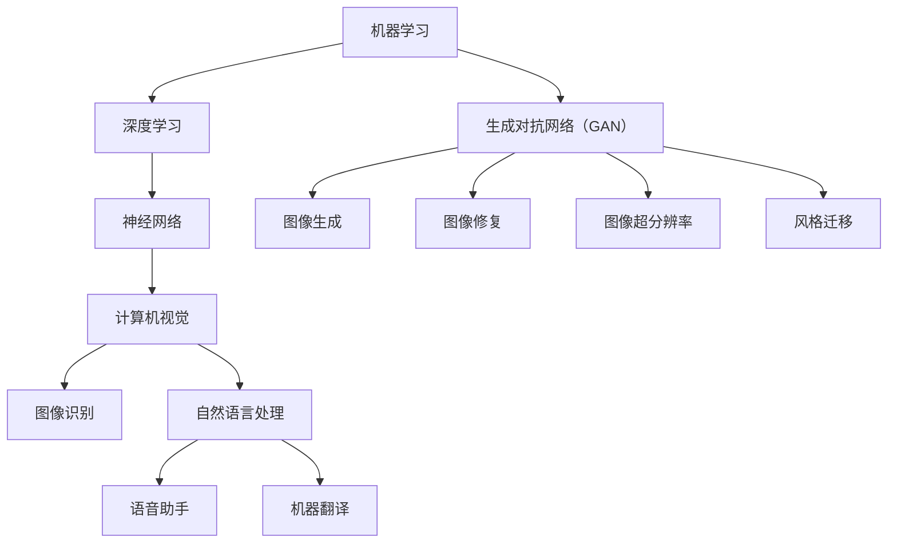

                 

## 1. 背景介绍

Andrej Karpathy是一位在人工智能领域享有盛誉的研究者和开发者。他是深度学习领域的领军人物，以其在自然语言处理、计算机视觉和人工智能研究等方面的开创性工作而闻名。他的研究兴趣广泛，涵盖了从神经网络架构设计到大规模机器学习系统构建的各个方面。

本文将探讨Andrej Karpathy在人工智能领域的研究成果及其对未来发展的看法。我们将从AI的历史背景出发，深入分析AI的核心概念与联系，详细解读其核心算法原理和数学模型，通过实际项目实践展示其应用实例，并展望AI的未来发展方向与挑战。

### 1.1 Andrej Karpathy的研究成果

Andrej Karpathy在人工智能领域的贡献是多方面的。他在自然语言处理（NLP）领域的研究尤为突出，其中包括了基于深度学习的文本生成和语言模型。他在2014年发表了《The Unreasonable Effectiveness of Recurrent Neural Networks》（循环神经网络的不合理有效性），这篇文章成为NLP领域的重要里程碑，推动了循环神经网络（RNN）在语言模型中的应用。

此外，他在计算机视觉领域也有重要贡献。他与他的团队开发了名为"GridSearch"的工具，用于自动化机器学习模型的搜索和优化，极大提高了实验效率。他在2015年发布的《Unsupervised Representation Learning with Deep Convolutional Generative Adversarial Networks》（深度卷积生成对抗网络的无监督表示学习）论文，为生成对抗网络（GAN）的研究奠定了基础。

总的来说，Andrej Karpathy的研究成果不仅对学术界产生了深远影响，也推动了工业界对AI技术的应用。

### 1.2 AI的历史与发展

人工智能（AI）的概念最早可以追溯到20世纪50年代，当时计算机科学家开始探讨机器是否能够模仿人类智能。1956年，约翰·麦卡锡（John McCarthy）等人在达特茅斯会议上首次提出了“人工智能”这个术语。自此之后，AI经历了几个重要的发展阶段。

早期阶段，研究者主要关注符号主义方法，即通过编写复杂的规则和逻辑来模拟人类思维。然而，这种方法在处理复杂任务时遇到了巨大的挑战。

20世纪80年代，专家系统成为AI研究的热点。专家系统通过大量领域知识来模拟专家的决策过程，但在面对变化和新问题时表现不佳。

进入21世纪，随着计算能力的提升和数据量的爆炸性增长，基于统计学习的机器学习方法逐渐崭露头角。尤其是深度学习技术的出现，使得AI在图像识别、语音识别、自然语言处理等领域取得了突破性进展。

总的来说，AI的发展是一个不断迭代、逐步深化的过程，每个阶段都有其独特的贡献和挑战。理解AI的历史背景，有助于我们更好地把握其当前的发展态势和未来方向。

### 1.3 AI的核心概念与联系

人工智能的核心概念涵盖了广泛的研究领域，这些领域相互交织，共同推动了AI的发展。以下是AI中一些重要的核心概念及其相互联系：

**机器学习**：机器学习是AI的基础，它通过算法让计算机从数据中学习，并在没有明确编程指令的情况下完成特定任务。机器学习可分为监督学习、无监督学习和强化学习。

**深度学习**：深度学习是机器学习的一个子领域，它使用多层神经网络来模拟人类大脑的思维方式。深度学习在图像识别、语音识别和自然语言处理等领域取得了显著成果。

**神经网络**：神经网络是模仿生物神经系统的计算模型，由大量相互连接的节点（或“神经元”）组成。神经网络通过调整节点间的权重来学习数据特征。

**计算机视觉**：计算机视觉是AI的一个重要分支，旨在使计算机能够从图像或视频中提取有用信息。计算机视觉广泛应用于图像识别、物体检测、图像增强等领域。

**自然语言处理**：自然语言处理关注计算机对自然语言的识别、理解和生成。自然语言处理技术广泛应用于语音助手、机器翻译、文本摘要等领域。

这些核心概念相互联系，共同构成了人工智能的技术体系。了解这些概念及其相互关系，有助于我们深入理解AI的发展和应用。

## 2. 核心概念与联系

在探讨人工智能的核心概念与联系时，我们需要了解一些关键的技术和理论。以下是AI中几个核心概念及其相互关系的详细描述，以及一个用Mermaid绘制的流程图来展示这些概念和它们之间的联系。

### 2.1 机器学习与深度学习

**机器学习**：机器学习是一种让计算机通过数据自动改进性能的方法。它包括多种算法，如决策树、支持向量机和随机森林等。机器学习的关键在于数据，通过分析大量数据，机器学习算法可以识别出数据中的模式和规律。

**深度学习**：深度学习是机器学习的一个分支，它使用多层神经网络来模拟人类大脑的学习过程。深度学习通过层层提取数据中的特征，从而实现复杂的任务，如图像识别和自然语言处理。

**神经网络**：神经网络是深度学习的基础，由大量相互连接的节点（或“神经元”）组成。神经网络通过调整节点间的权重来学习数据特征。


**机器学习与深度学习的关系**：

机器学习涵盖了广泛的算法，深度学习是其中的一种。深度学习通过多层神经网络实现了更高的准确性和表现力，在处理大规模数据和复杂任务时尤为有效。

### 2.2 计算机视觉与自然语言处理

**计算机视觉**：计算机视觉的目标是使计算机能够从图像或视频中提取有用信息。它包括图像识别、物体检测、图像增强和视频处理等技术。

**自然语言处理**：自然语言处理关注计算机对自然语言的识别、理解和生成。自然语言处理技术广泛应用于语音助手、机器翻译、文本摘要和问答系统等领域。

**计算机视觉与自然语言处理的关系**：

计算机视觉和自然语言处理是AI的两个重要分支，它们在多模态交互中发挥着关键作用。例如，计算机视觉可以用于分析视频中的动作，而自然语言处理则可以用于理解和生成与这些动作相关的文本描述。

### 2.3 生成对抗网络（GAN）

**生成对抗网络**：生成对抗网络（GAN）是一种由生成器和判别器组成的框架。生成器的目标是生成逼真的数据，而判别器的目标是区分生成数据和真实数据。两者相互竞争，共同推动生成器提高生成质量。

**GAN的应用领域**：

GAN在图像生成、图像修复、图像超分辨率和风格迁移等领域有着广泛应用。例如，GAN可以生成逼真的图像，用于医学影像的生成和修复，也可以用于艺术风格的迁移。

### 2.4 Mermaid流程图

以下是AI核心概念与联系的Mermaid流程图：




通过这个Mermaid流程图，我们可以清晰地看到机器学习、深度学习、神经网络、计算机视觉、自然语言处理和生成对抗网络之间的联系，以及它们在不同领域的应用。

## 3. 核心算法原理 & 具体操作步骤

在人工智能领域，核心算法是实现机器学习和深度学习的关键。本节将详细介绍AI中的几个核心算法原理和具体操作步骤，包括其优缺点以及应用领域。

### 3.1 算法原理概述

**深度学习**：深度学习是一种基于多层神经网络的学习方法，通过逐层提取数据特征，实现从简单到复杂的特征表示。其基本原理包括：

1. **前向传播**：输入数据通过网络的各个层次，每个层次都将输入数据与自身的权重相乘并加上偏置，然后通过激活函数得到输出。
2. **反向传播**：根据输出误差，反向计算网络中每个层的梯度，并更新权重和偏置。

**生成对抗网络（GAN）**：GAN由生成器和判别器组成。生成器的目标是生成逼真的数据，而判别器的目标是区分生成数据和真实数据。GAN的基本原理包括：

1. **生成器（Generator）**：生成器通过随机噪声生成数据。
2. **判别器（Discriminator）**：判别器接收真实数据和生成数据，并判断其真实性。
3. **竞争**：生成器和判别器相互竞争，生成器努力生成更逼真的数据，而判别器努力区分真实和生成数据。

**卷积神经网络（CNN）**：CNN是一种用于图像识别和处理的神经网络，其基本原理包括：

1. **卷积层**：通过卷积运算提取图像特征。
2. **池化层**：通过下采样减少数据维度。
3. **全连接层**：将卷积层和池化层提取的特征映射到输出。

### 3.2 算法步骤详解

**深度学习**：

1. **数据预处理**：对输入数据进行归一化、标准化等处理，使其适合网络训练。
2. **构建网络**：定义网络结构，包括输入层、隐藏层和输出层。
3. **初始化权重**：随机初始化网络权重。
4. **前向传播**：输入数据通过网络的前向传播，得到输出结果。
5. **计算损失**：计算输出结果与真实标签之间的损失。
6. **反向传播**：根据损失计算梯度，并更新网络权重和偏置。
7. **优化算法**：使用梯度下降等优化算法更新网络参数。
8. **评估模型**：使用验证集或测试集评估模型性能。

**生成对抗网络（GAN）**：

1. **数据预处理**：对输入数据进行归一化、标准化等处理。
2. **生成器训练**：生成器通过随机噪声生成数据，并逐步优化生成数据的质量。
3. **判别器训练**：判别器接收真实数据和生成数据，并区分其真实性。
4. **交替训练**：生成器和判别器交替训练，生成器努力生成更逼真的数据，而判别器努力区分真实和生成数据。
5. **评估模型**：使用验证集或测试集评估模型性能。

**卷积神经网络（CNN）**：

1. **数据预处理**：对输入数据进行归一化、标准化等处理。
2. **构建网络**：定义网络结构，包括卷积层、池化层和全连接层。
3. **初始化权重**：随机初始化网络权重。
4. **卷积层**：通过卷积运算提取图像特征。
5. **池化层**：通过下采样减少数据维度。
6. **全连接层**：将卷积层和池化层提取的特征映射到输出。
7. **计算损失**：计算输出结果与真实标签之间的损失。
8. **反向传播**：根据损失计算梯度，并更新网络权重和偏置。
9. **优化算法**：使用梯度下降等优化算法更新网络参数。
10. **评估模型**：使用验证集或测试集评估模型性能。

### 3.3 算法优缺点

**深度学习**：

优点：

- 高效的自动特征提取能力。
- 可以处理复杂的数据结构。

缺点：

- 需要大量的数据和计算资源。
- 模型解释性较差。

**生成对抗网络（GAN）**：

优点：

- 可以生成高质量的图像。
- 可以用于无监督学习。

缺点：

- 训练过程不稳定，容易出现模式崩溃。
- 模型解释性较差。

**卷积神经网络（CNN）**：

优点：

- 对图像数据有很好的表现力。
- 可以减少数据维度，提高计算效率。

缺点：

- 对图像数据以外的问题表现较差。
- 需要大量的数据和计算资源。

### 3.4 算法应用领域

**深度学习**：

- 图像识别：如人脸识别、物体检测。
- 自然语言处理：如机器翻译、文本生成。
- 计算机视觉：如图像增强、图像生成。

**生成对抗网络（GAN）**：

- 图像生成：如艺术作品生成、医学图像修复。
- 无监督学习：如数据增强、异常检测。

**卷积神经网络（CNN）**：

- 图像识别：如车牌识别、医学图像诊断。
- 视频处理：如视频分类、动作识别。

通过以上对深度学习、生成对抗网络和卷积神经网络等核心算法的原理和步骤的详细解析，我们可以看到这些算法在人工智能领域的广泛应用和重要性。这些算法不仅推动了AI技术的发展，也为工业界和学术界提供了强大的工具和平台。

## 4. 数学模型和公式 & 详细讲解 & 举例说明

在人工智能领域，数学模型和公式是核心基础，它们不仅提供了算法的理论支撑，还指导了实际操作中的具体实施步骤。本节将详细介绍深度学习中的几个关键数学模型和公式，并进行详细讲解和举例说明。

### 4.1 数学模型构建

深度学习中的数学模型主要基于神经网络，神经网络由大量相互连接的神经元组成。每个神经元都接收来自其他神经元的输入，并通过激活函数产生输出。神经网络通过不断调整权重和偏置来优化其性能。

#### 4.1.1 前向传播

前向传播是神经网络的基础，它包括以下几个步骤：

1. **初始化参数**：设定网络中的权重（\(W\)）和偏置（\(b\)）。
2. **计算输入值**：每个神经元接收来自前一层神经元的输入值，通过加权求和加上偏置得到。
   \[ z = \sum_{j} W_{ji}a_{j} + b_i \]
3. **应用激活函数**：输入值通过激活函数（如ReLU、Sigmoid或Tanh）得到输出。
   \[ a_i = \sigma(z) \]

#### 4.1.2 损失函数

损失函数用于衡量模型预测值与真实值之间的差距。常见的损失函数包括均方误差（MSE）和交叉熵（Cross-Entropy）。

1. **均方误差（MSE）**：
   \[ J = \frac{1}{m}\sum_{i=1}^{m}(y_i - \hat{y}_i)^2 \]
   其中，\(y_i\) 是真实值，\(\hat{y}_i\) 是预测值，\(m\) 是样本数量。

2. **交叉熵（Cross-Entropy）**：
   \[ J = -\sum_{i=1}^{m} y_i \log(\hat{y}_i) \]
   交叉熵损失通常用于分类问题，其中 \(y_i\) 是目标类别的概率分布。

#### 4.1.3 反向传播

反向传播是深度学习训练的核心，它通过计算损失函数关于网络参数的梯度来更新权重和偏置。

1. **计算梯度**：
   \[ \frac{\partial J}{\partial W_{ij}} = (a_{i+1} \odot \frac{\partial \sigma}{\partial z_i} \odot \delta_i) \cdot a_j \]
   \[ \frac{\partial J}{\partial b_i} = \delta_i \]

2. **更新参数**：
   \[ W_{ij} := W_{ij} - \alpha \frac{\partial J}{\partial W_{ij}} \]
   \[ b_i := b_i - \alpha \frac{\partial J}{\partial b_i} \]
   其中，\(\alpha\) 是学习率。

### 4.2 公式推导过程

#### 4.2.1 激活函数的导数

对于常用的激活函数，如ReLU和Sigmoid，其导数如下：

1. **ReLU激活函数**：
   \[ \frac{\partial \sigma}{\partial z} = \begin{cases} 
   0 & \text{if } z < 0 \\
   1 & \text{if } z \geq 0 
   \end{cases} \]

2. **Sigmoid激活函数**：
   \[ \frac{\partial \sigma}{\partial z} = \sigma(1 - \sigma) \]

#### 4.2.2 损失函数的导数

1. **均方误差（MSE）**：
   \[ \delta = \frac{\partial J}{\partial a} = 2(a - y) \]

2. **交叉熵（Cross-Entropy）**：
   \[ \delta = \frac{\partial J}{\partial a} = \frac{y}{\hat{y}} - \frac{1}{\hat{y}} \]

### 4.3 案例分析与讲解

#### 4.3.1 图像分类

假设我们有一个简单的图像分类任务，目标是识别一张图片中的猫或狗。我们可以使用一个简单的卷积神经网络（CNN）来实现。

1. **数据预处理**：将图像缩放到固定的尺寸（例如28x28），并进行归一化处理。
2. **构建网络**：定义一个简单的CNN结构，包括卷积层、池化层和全连接层。
3. **前向传播**：输入图像经过卷积层和池化层，最后通过全连接层得到预测类别。
4. **计算损失**：使用交叉熵损失函数计算预测类别与真实类别之间的差距。
5. **反向传播**：根据损失函数计算梯度，更新网络权重和偏置。
6. **评估模型**：使用测试集评估模型的准确率。

以下是一个简单的示例代码：

```python
import tensorflow as tf

# 定义网络结构
model = tf.keras.Sequential([
    tf.keras.layers.Conv2D(32, (3, 3), activation='relu', input_shape=(28, 28, 1)),
    tf.keras.layers.MaxPooling2D((2, 2)),
    tf.keras.layers.Flatten(),
    tf.keras.layers.Dense(128, activation='relu'),
    tf.keras.layers.Dense(1, activation='sigmoid')
])

# 编译模型
model.compile(optimizer='adam', loss='binary_crossentropy', metrics=['accuracy'])

# 训练模型
model.fit(train_images, train_labels, epochs=5, batch_size=32)

# 评估模型
test_loss, test_acc = model.evaluate(test_images, test_labels)
print(f"Test accuracy: {test_acc}")
```

#### 4.3.2 自然语言处理

假设我们有一个简单的文本分类任务，目标是判断一篇文章是关于科技还是体育。我们可以使用一个简单的循环神经网络（RNN）来实现。

1. **数据预处理**：将文本数据转换为词向量表示，并对序列进行 padding，使其具有相同的长度。
2. **构建网络**：定义一个简单的RNN结构，包括嵌入层、RNN层和全连接层。
3. **前向传播**：输入文本序列经过嵌入层和RNN层，最后通过全连接层得到预测类别。
4. **计算损失**：使用交叉熵损失函数计算预测类别与真实类别之间的差距。
5. **反向传播**：根据损失函数计算梯度，更新网络权重和偏置。
6. **评估模型**：使用测试集评估模型的准确率。

以下是一个简单的示例代码：

```python
import tensorflow as tf
from tensorflow.keras.preprocessing.sequence import pad_sequences

# 定义网络结构
model = tf.keras.Sequential([
    tf.keras.layers.Embedding(vocab_size, embedding_dim),
    tf.keras.layers.Bidirectional(tf.keras.layers.LSTM(64)),
    tf.keras.layers.Dense(1, activation='sigmoid')
])

# 编译模型
model.compile(optimizer='adam', loss='binary_crossentropy', metrics=['accuracy'])

# 训练模型
model.fit(train_sequences, train_labels, epochs=5, batch_size=32)

# 评估模型
test_loss, test_acc = model.evaluate(test_sequences, test_labels)
print(f"Test accuracy: {test_acc}")
```

通过以上数学模型和公式的讲解以及实际案例的分析，我们可以看到深度学习中的数学模型和公式是如何构建、推导和应用的。这些知识和工具为我们在实际应用中设计和实现人工智能算法提供了坚实的基础。

## 5. 项目实践：代码实例和详细解释说明

在了解了人工智能的核心算法和数学模型之后，我们将通过一个实际的项目实例来展示这些知识的实际应用。本节将详细讲解一个简单的图像分类项目，从开发环境的搭建到源代码的实现，再到代码的解读与分析。

### 5.1 开发环境搭建

首先，我们需要搭建一个开发环境来运行我们的图像分类项目。以下是所需的步骤：

1. **安装Python**：确保安装了Python 3.7或更高版本。
2. **安装TensorFlow**：TensorFlow是深度学习中最流行的框架之一，我们可以通过以下命令安装：
   ```shell
   pip install tensorflow
   ```
3. **安装其他依赖库**：我们还需要安装其他一些常用的库，例如NumPy和Pandas：
   ```shell
   pip install numpy pandas
   ```

### 5.2 源代码详细实现

以下是我们的图像分类项目的源代码实现：

```python
import tensorflow as tf
from tensorflow.keras import layers
from tensorflow.keras.preprocessing.image import ImageDataGenerator

# 1. 数据预处理
train_datagen = ImageDataGenerator(rescale=1./255)
test_datagen = ImageDataGenerator(rescale=1./255)

train_generator = train_datagen.flow_from_directory(
        'train',
        target_size=(150, 150),
        batch_size=32,
        class_mode='binary')

validation_generator = test_datagen.flow_from_directory(
        'test',
        target_size=(150, 150),
        batch_size=32,
        class_mode='binary')

# 2. 构建模型
model = tf.keras.Sequential([
    layers.Conv2D(32, (3, 3), activation='relu', input_shape=(150, 150, 3)),
    layers.MaxPooling2D((2, 2)),
    layers.Conv2D(64, (3, 3), activation='relu'),
    layers.MaxPooling2D((2, 2)),
    layers.Conv2D(128, (3, 3), activation='relu'),
    layers.MaxPooling2D((2, 2)),
    layers.Conv2D(128, (3, 3), activation='relu'),
    layers.MaxPooling2D((2, 2)),
    layers.Flatten(),
    layers.Dense(512, activation='relu'),
    layers.Dense(1, activation='sigmoid')
])

# 3. 编译模型
model.compile(optimizer='adam',
              loss='binary_crossentropy',
              metrics=['acc'])

# 4. 训练模型
history = model.fit(
      train_generator,
      steps_per_epoch=100,
      epochs=30,
      validation_data=validation_generator,
      validation_steps=50,
      verbose=2)

# 5. 评估模型
test_generator = test_datagen.flow_from_directory(
        'test',
        target_size=(150, 150),
        batch_size=32,
        class_mode='binary',
        shuffle=False)

test_loss, test_acc = model.evaluate(test_generator)
print(f"Test accuracy: {test_acc}")
```

### 5.3 代码解读与分析

1. **数据预处理**：

   ```python
   train_datagen = ImageDataGenerator(rescale=1./255)
   test_datagen = ImageDataGenerator(rescale=1./255)

   train_generator = train_datagen.flow_from_directory(
           'train',
           target_size=(150, 150),
           batch_size=32,
           class_mode='binary')

   validation_generator = test_datagen.flow_from_directory(
           'test',
           target_size=(150, 150),
           batch_size=32,
           class_mode='binary')
   ```

   这部分代码用于加载数据集并进行预处理。我们使用了`ImageDataGenerator`类来自动处理图像数据。`rescale`方法用于将图像像素值归一化到[0, 1]范围内。`flow_from_directory`方法用于从指定目录加载数据，并自动将图像分割成训练集和验证集。

2. **构建模型**：

   ```python
   model = tf.keras.Sequential([
       layers.Conv2D(32, (3, 3), activation='relu', input_shape=(150, 150, 3)),
       layers.MaxPooling2D((2, 2)),
       layers.Conv2D(64, (3, 3), activation='relu'),
       layers.MaxPooling2D((2, 2)),
       layers.Conv2D(128, (3, 3), activation='relu'),
       layers.MaxPooling2D((2, 2)),
       layers.Conv2D(128, (3, 3), activation='relu'),
       layers.MaxPooling2D((2, 2)),
       layers.Flatten(),
       layers.Dense(512, activation='relu'),
       layers.Dense(1, activation='sigmoid')
   ])
   ```

   这部分代码用于定义我们的卷积神经网络（CNN）模型。模型结构包括多个卷积层、池化层和全连接层。卷积层用于提取图像特征，池化层用于减少数据维度，全连接层用于分类。

3. **编译模型**：

   ```python
   model.compile(optimizer='adam',
                 loss='binary_crossentropy',
                 metrics=['acc'])
   ```

   这部分代码用于编译模型，指定优化器、损失函数和评估指标。我们使用了`adam`优化器，这是一种常用的自适应优化算法。`binary_crossentropy`是用于二分类问题的损失函数，`acc`是用于评估模型准确率的指标。

4. **训练模型**：

   ```python
   history = model.fit(
           train_generator,
           steps_per_epoch=100,
           epochs=30,
           validation_data=validation_generator,
           validation_steps=50,
           verbose=2)
   ```

   这部分代码用于训练模型。`fit`方法用于训练模型，其中`steps_per_epoch`指定每个epoch中要迭代的批次数，`epochs`指定训练的epoch数。`validation_data`用于在每个epoch后评估模型在验证集上的性能，`validation_steps`指定每个epoch中要迭代的验证批次数。`verbose`用于控制输出信息。

5. **评估模型**：

   ```python
   test_generator = test_datagen.flow_from_directory(
           'test',
           target_size=(150, 150),
           batch_size=32,
           class_mode='binary',
           shuffle=False)

   test_loss, test_acc = model.evaluate(test_generator)
   print(f"Test accuracy: {test_acc}")
   ```

   这部分代码用于评估模型在测试集上的性能。`evaluate`方法用于计算模型在测试集上的损失和准确率，并打印输出。

通过以上代码实例，我们可以看到如何使用TensorFlow构建和训练一个简单的图像分类模型。这个项目展示了从数据预处理到模型构建、训练和评估的完整流程，为我们提供了实际的编程经验。

## 6. 实际应用场景

人工智能（AI）技术已经在多个领域展现出了强大的应用潜力，并带来了深远的变革。以下是一些AI技术的实际应用场景及其影响：

### 6.1 医疗保健

AI在医疗保健领域的应用主要集中在图像诊断、药物研发和个性化治疗方面。例如，深度学习算法可以用于分析医学影像，如X光片、CT扫描和MRI图像，以帮助医生更快、更准确地诊断疾病。此外，AI还可以通过分析患者数据，为个体提供个性化的治疗方案，从而提高治疗效果。AI在药物研发方面也发挥着重要作用，通过机器学习算法可以加速新药的发现和开发过程，降低研发成本。

### 6.2 金融服务

AI在金融服务领域的应用涵盖了风险管理、欺诈检测、投资策略和客户服务等方面。机器学习算法可以分析大量的交易数据，识别异常行为，从而有效地防范金融欺诈。AI还可以通过分析市场数据，提供智能投资建议，提高投资回报率。此外，自然语言处理技术使得智能客服系统能够更好地与客户沟通，提高客户满意度。

### 6.3 交通运输

AI技术在交通运输领域同样有着广泛的应用。自动驾驶技术是其中的一个重要应用领域，通过深度学习和计算机视觉技术，自动驾驶系统能够实现车辆在复杂道路环境中的自主行驶。此外，AI还可以用于交通流量管理，通过分析交通数据，优化交通信号控制，减少交通拥堵。智能物流系统也是AI在交通运输领域的应用之一，通过优化运输路线和调度策略，提高物流效率。

### 6.4 教育

AI在教育领域的应用正日益增加，从个性化学习到智能评测，再到虚拟教室等方面都有涉及。个性化学习系统能够根据学生的特点和需求，提供定制化的学习内容，提高学习效果。智能评测系统可以通过分析学生的学习数据，快速评估其学习进度和弱点，为教师提供反馈。虚拟教室技术则使得学生能够在线学习，打破了时间和空间的限制，提高了教育的可及性。

### 6.5 制造业

AI技术在制造业中的应用主要在于生产优化、质量管理、设备维护等方面。通过机器学习算法，可以实时分析生产数据，优化生产流程，提高生产效率。智能质检系统能够通过图像识别技术，自动检测产品缺陷，确保产品质量。设备预测性维护系统能够通过分析设备运行数据，预测设备故障，提前进行维护，减少停机时间。

### 6.6 媒体与娱乐

AI技术在媒体与娱乐领域的应用主要体现在内容推荐、虚拟助手和智能编辑等方面。内容推荐系统可以通过分析用户的兴趣和行为数据，为用户推荐个性化的内容，提高用户体验。虚拟助手则可以通过自然语言处理技术，与用户进行对话，提供信息查询和智能服务。智能编辑系统能够通过分析文本和图像数据，自动生成新闻摘要和视频剪辑，提高内容的生产效率。

总的来说，AI技术的应用正在不断拓展，从医疗保健到金融服务，从交通运输到制造业，都在经历着AI带来的深刻变革。随着AI技术的不断进步，我们可以期待其在更多领域的应用，为社会带来更多的便利和创新。

### 6.7 未来应用展望

随着人工智能技术的不断进步，我们可以预见它在更多领域将带来深远的影响，以下是一些未来的应用展望：

**智能城市**：AI技术将进一步提升城市管理水平，通过物联网和智能传感器收集大量数据，利用机器学习算法进行实时分析和预测，从而优化交通流量、能源使用和环境监测。

**教育个性化**：随着对学习行为数据的深入分析，AI将能够为每个学生提供个性化的学习路径，自适应调整教学策略，从而提高学习效果和效率。

**健康监测与预防**：AI可以用于开发智能健康监测设备，实时监测人体健康数据，通过预测性分析预防疾病发生，提高公共健康水平。

**自动化与协作机器人**：未来的工厂将越来越多地使用自动化与协作机器人，这些机器人不仅能够提高生产效率，还能与人类工人协同工作，降低工伤风险。

**智能制造**：智能制造将依赖于AI技术进行生产流程的优化，从产品设计、生产制造到物流配送，实现全流程的智能化和自动化。

**个性化医疗服务**：基于AI的个性化医疗服务将变得更加普及，通过基因分析、健康数据追踪和智能诊断，为患者提供定制化的治疗方案。

总的来说，AI技术的未来应用将更加深入和广泛，不仅改变现有的产业模式，还为社会带来全新的价值和体验。

## 7. 工具和资源推荐

在学习和应用人工智能技术的过程中，掌握合适的工具和资源是至关重要的。以下是一些推荐的工具和资源，包括学习资源、开发工具和相关论文，以帮助读者更好地了解和掌握AI技术。

### 7.1 学习资源推荐

1. **在线课程**：
   - Coursera：提供包括《深度学习》、《机器学习基础》等多门AI相关的免费课程。
   - edX：提供由世界顶级大学开设的AI和机器学习课程，如麻省理工学院的《人工智能导论》。

2. **电子书和文档**：
   - 《深度学习》（Goodfellow, Bengio, Courville著）：经典教材，全面介绍了深度学习的基础理论和应用。
   - 《Python机器学习》（Sebastian Raschka著）：通过Python实现机器学习算法，适合初学者。

3. **在线论坛和社区**：
   - Stack Overflow：编程问题解答社区，涵盖AI和机器学习的各种问题。
   - GitHub：托管了大量AI和机器学习项目的代码，是学习编程和项目实践的好地方。

### 7.2 开发工具推荐

1. **编程语言和框架**：
   - Python：广泛用于AI开发的编程语言，具有丰富的库和框架。
   - TensorFlow：谷歌开发的深度学习框架，适用于构建和训练各种深度学习模型。
   - PyTorch：由Facebook开发，具有动态计算图和灵活的架构，适合快速原型设计。

2. **数据处理工具**：
   - Pandas：用于数据清洗、转换和分析的Python库。
   - NumPy：提供高性能的数组操作和数学计算功能。

3. **可视化工具**：
   - Matplotlib：用于创建2D和3D图表和图形的Python库。
   - Seaborn：基于Matplotlib，用于创建更美观和吸引人的统计图表。

### 7.3 相关论文推荐

1. **深度学习**：
   - "Deep Learning"（Goodfellow, Bengio, Courville著）：介绍了深度学习的基础理论和最新进展。
   - "AlexNet: Image Classification with Deep Convolutional Neural Networks"（2012年）：深度学习在图像识别领域的突破性论文。

2. **生成对抗网络（GAN）**：
   - "Generative Adversarial Nets"（2014年）：提出了GAN的基本概念和应用。
   - "Unsupervised Representation Learning with Deep Convolutional Generative Adversarial Networks"（2015年）：进一步探讨了GAN在无监督学习中的应用。

3. **自然语言处理**：
   - "Recurrent Neural Network Based Language Model"（2013年）：介绍了RNN在语言模型中的应用。
   - "Attention Is All You Need"（2017年）：提出了Transformer模型，颠覆了传统的序列处理方法。

通过以上工具和资源的推荐，读者可以更加系统地学习和应用人工智能技术，不断深化对AI领域知识的理解和掌握。

## 8. 总结：未来发展趋势与挑战

人工智能（AI）作为当代最具颠覆性的技术之一，正迅速改变着社会的各个方面。从医疗保健到金融服务，从交通运输到制造业，AI的应用已经带来了深远的变革。本文通过对Andrej Karpathy的研究成果及其对AI未来发展的看法的探讨，为我们描绘了AI领域的广阔前景和面临的挑战。

### 8.1 研究成果总结

Andrej Karpathy的研究成果在深度学习和自然语言处理领域具有重要意义。他通过开创性的工作，推动了循环神经网络（RNN）和生成对抗网络（GAN）的发展，极大地提升了AI模型在图像识别、文本生成和图像修复等方面的表现。他的论文《The Unreasonable Effectiveness of Recurrent Neural Networks》和《Unsupervised Representation Learning with Deep Convolutional Generative Adversarial Networks》成为AI领域的里程碑，对后续研究产生了深远影响。

### 8.2 未来发展趋势

AI的未来发展趋势可以从以下几个方面来展望：

1. **更加智能的机器学习**：随着算法和硬件的进步，机器学习模型将变得更加高效和智能。强化学习、元学习等新方法有望进一步提升AI的自主学习和适应能力。

2. **跨模态交互**：未来的AI系统将能够更好地处理多模态数据，如文本、图像和音频的融合，从而实现更自然的用户交互和更丰富的应用场景。

3. **边缘计算**：随着物联网（IoT）的发展，边缘计算将使得AI应用更加灵活和实时。在设备端进行数据处理和决策，将减少对中心服务器的依赖，提高系统的响应速度和安全性。

4. **隐私保护**：随着数据隐私问题的日益突出，未来的AI系统将更加注重数据保护和隐私保护，通过加密、差分隐私等技术确保用户数据的隐私和安全。

### 8.3 面临的挑战

尽管AI技术的发展前景广阔，但同时也面临着一系列挑战：

1. **数据质量和隐私**：高质量的数据是AI系统训练和优化的重要基础，然而数据隐私和安全问题是不可忽视的挑战。如何在保护用户隐私的前提下，获取和利用高质量的数据，是AI领域亟待解决的问题。

2. **算法透明性和可解释性**：随着深度学习等复杂算法的广泛应用，算法的透明性和可解释性成为一个重要的议题。用户需要了解AI系统是如何做出决策的，以确保其合理性和公正性。

3. **伦理和责任**：AI技术的发展引发了关于伦理和责任的广泛讨论。如何确保AI系统在遵循伦理原则的同时，承担相应的法律责任，是一个需要深入探讨的问题。

4. **资源和计算能力**：尽管硬件技术的不断进步为AI的发展提供了强有力的支撑，但大规模的AI训练和推理仍然需要大量的计算资源。如何在有限的资源下，高效地利用AI技术，是另一个重要的挑战。

### 8.4 研究展望

未来的AI研究应注重以下几个方面：

1. **基础理论**：加强基础理论研究，探索更高效的算法和更稳定的训练方法，以推动AI技术的整体进步。

2. **跨学科合作**：鼓励不同学科之间的合作，如计算机科学、数学、心理学等，共同解决AI领域的复杂问题。

3. **开源和开放数据**：促进AI研究的开源和开放数据，为研究者提供更丰富的资源和实验环境。

4. **社会影响评估**：对AI技术的应用进行广泛的社会影响评估，确保其发展符合社会的需求和期望。

总之，AI技术的发展将不断推动人类社会向前进步，同时也需要我们认真面对和解决其中的挑战。通过持续的研究和创新，我们有理由相信，AI将在未来带来更多的惊喜和变革。

## 9. 附录：常见问题与解答

以下是一些关于人工智能（AI）的常见问题及解答：

### 9.1 什么是人工智能？

人工智能（AI）是指通过计算机系统模拟人类智能行为的技术。它包括机器学习、深度学习、自然语言处理、计算机视觉等多个子领域，旨在让计算机具备类似人类的感知、理解、学习和决策能力。

### 9.2 人工智能的核心技术有哪些？

人工智能的核心技术包括机器学习、深度学习、神经网络、计算机视觉、自然语言处理、生成对抗网络（GAN）等。这些技术共同构成了人工智能的技术体系，实现了计算机在多种任务中的智能行为。

### 9.3 人工智能在哪些领域有广泛应用？

人工智能在医疗保健、金融服务、交通运输、教育、制造业、媒体与娱乐等多个领域有着广泛应用。例如，AI可以用于疾病诊断、智能投顾、自动驾驶、个性化教育、智能制造等。

### 9.4 人工智能的主要挑战是什么？

人工智能的主要挑战包括数据质量和隐私、算法透明性和可解释性、伦理和责任、计算资源和能力等方面。如何解决这些挑战，是AI技术持续发展的重要课题。

### 9.5 人工智能的未来发展趋势是什么？

人工智能的未来发展趋势包括更加智能的机器学习、跨模态交互、边缘计算、隐私保护等。随着算法和硬件的进步，AI将在更多领域发挥重要作用，为社会带来更多的便利和创新。

