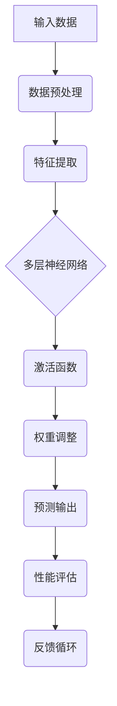

                 

关键词：人工智能，深度学习，神经网络，未来趋势，应用场景，研究挑战

摘要：本文深入探讨了人工智能领域当前和未来的发展方向，通过对深度学习和神经网络技术的分析，以及对实际应用场景的展望，旨在为读者提供一个清晰的人工智能发展脉络。

## 1. 背景介绍

人工智能（Artificial Intelligence，简称AI）作为计算机科学的一个分支，旨在创建能够执行通常需要人类智能才能完成的任务的系统。自20世纪50年代以来，人工智能经历了多个发展阶段，从早期的规则驱动系统到基于知识的方法，再到最近几十年中迅速发展的基于数据驱动的方法，如深度学习和神经网络。

Andrej Karpathy是一位著名的人工智能研究者，他在深度学习领域有着卓越的贡献。他的研究成果不仅推动了人工智能的发展，也激发了更多研究者和开发者的兴趣。本文将结合Andrej Karpathy的研究成果，探讨人工智能的未来发展方向。

## 2. 核心概念与联系

为了理解人工智能的未来，首先需要了解其核心概念和原理。以下是人工智能领域的关键概念和它们之间的联系：

### 2.1. 深度学习

深度学习是一种人工智能的子领域，它通过模拟人脑中的神经网络结构来进行学习和决策。深度学习模型的核心是多层神经网络，这些网络通过逐层提取特征，从原始数据中学习复杂的模式。

### 2.2. 神经网络

神经网络是由大量神经元（模拟人脑中的神经元）连接而成的计算模型。每个神经元接收来自其他神经元的输入，并通过激活函数产生输出。神经网络通过不断调整权重来优化其性能。

### 2.3. 机器学习

机器学习是使计算机能够从数据中学习的一种方法。深度学习是机器学习的一个分支，它利用大量数据通过多层神经网络进行训练，从而实现高级的预测和分类任务。

### 2.4. 大数据

大数据是大量、高速、多样化的数据。深度学习和神经网络技术的发展，极大地依赖于大数据的提供，因为只有通过大量的数据，这些模型才能学习到复杂的模式和关系。

### 2.5. Mermaid 流程图

以下是深度学习模型的 Mermaid 流程图：



## 3. 核心算法原理 & 具体操作步骤

### 3.1. 算法原理概述

深度学习算法的核心是多层神经网络。这些网络通过多个隐藏层对输入数据进行处理，每个隐藏层都对输入数据进行特征提取和变换，最终产生预测输出。

### 3.2. 算法步骤详解

1. **数据预处理**：对输入数据（如图像、文本等）进行归一化、去噪等处理，使其适合于神经网络处理。
2. **特征提取**：通过卷积层、池化层等操作，从原始数据中提取出有用的特征。
3. **多层神经网络**：通过多个隐藏层对特征进行处理，每个隐藏层都负责提取更高层次的特征。
4. **激活函数**：在隐藏层中使用激活函数（如ReLU、Sigmoid等）来引入非线性，使网络能够学习到更复杂的模式。
5. **权重调整**：通过反向传播算法，不断调整网络的权重，以优化网络性能。
6. **预测输出**：将处理后的特征输入到输出层，产生预测输出。
7. **性能评估**：使用性能指标（如准确率、损失函数等）来评估网络的性能。

### 3.3. 算法优缺点

**优点**：
- 能够处理高维数据，提取复杂的特征。
- 自动学习，无需人工设计特征。
- 在图像识别、自然语言处理等领域取得了显著成果。

**缺点**：
- 需要大量数据训练。
- 训练时间较长，对计算资源要求高。
- 对数据质量敏感。

### 3.4. 算法应用领域

深度学习算法在图像识别、语音识别、自然语言处理、医疗诊断等领域都有广泛的应用。例如，在图像识别方面，深度学习模型已经达到了超越人类的水平。

## 4. 数学模型和公式 & 详细讲解 & 举例说明

### 4.1. 数学模型构建

深度学习中的数学模型主要包括以下几个方面：

1. **损失函数**：用于衡量预测输出与真实值之间的差异，如均方误差（MSE）。
2. **优化算法**：用于调整网络的权重，如梯度下降（Gradient Descent）。
3. **激活函数**：用于引入非线性，如ReLU、Sigmoid等。

### 4.2. 公式推导过程

以均方误差（MSE）为例，其公式推导如下：

$$
MSE = \frac{1}{m}\sum_{i=1}^{m}(y_i - \hat{y}_i)^2
$$

其中，$y_i$为真实值，$\hat{y}_i$为预测值，$m$为样本数量。

### 4.3. 案例分析与讲解

假设有一个二元分类问题，数据集包含100个样本，每个样本有两个特征。使用深度学习模型进行训练，模型的预测输出与真实值之间的差异如下：

| 真实值 | 预测值 | 差异 |
| :--: | :--: | :--: |
| 0 | 0.6 | 0.6 |
| 1 | 0.4 | 0.4 |
| ... | ... | ... |
| 0 | 0.8 | 0.8 |
| 1 | 0.2 | 0.2 |

根据均方误差（MSE）的计算公式，可以得到模型在训练数据集上的MSE为：

$$
MSE = \frac{1}{100}\sum_{i=1}^{100}(y_i - \hat{y}_i)^2 = 0.52
$$

这意味着模型的预测输出与真实值之间的平均差异为0.52。

## 5. 项目实践：代码实例和详细解释说明

### 5.1. 开发环境搭建

在Python中，使用TensorFlow库可以方便地实现深度学习模型。首先，需要安装TensorFlow库，可以使用以下命令：

```bash
pip install tensorflow
```

### 5.2. 源代码详细实现

以下是一个简单的深度学习模型实现，用于对二元分类问题进行预测：

```python
import tensorflow as tf

# 创建输入层
inputs = tf.keras.layers.Input(shape=(2,))

# 创建隐藏层
x = tf.keras.layers.Dense(10, activation='relu')(inputs)
x = tf.keras.layers.Dense(10, activation='relu')(x)

# 创建输出层
outputs = tf.keras.layers.Dense(1, activation='sigmoid')(x)

# 创建模型
model = tf.keras.Model(inputs=inputs, outputs=outputs)

# 编译模型
model.compile(optimizer='adam', loss='binary_crossentropy', metrics=['accuracy'])

# 加载数据
x_train = ...  # 训练数据
y_train = ...  # 训练标签
x_test = ...   # 测试数据
y_test = ...   # 测试标签

# 训练模型
model.fit(x_train, y_train, epochs=10, batch_size=32, validation_data=(x_test, y_test))

# 评估模型
model.evaluate(x_test, y_test)
```

### 5.3. 代码解读与分析

上述代码实现了一个简单的二元分类问题深度学习模型。首先，创建输入层和隐藏层，然后创建输出层。接着，编译模型并加载数据进行训练。最后，使用训练数据评估模型的性能。

### 5.4. 运行结果展示

训练完成后，可以使用以下代码进行预测：

```python
predictions = model.predict(x_test)
```

预测结果可以用于分析模型的性能，如准确率、召回率等。

## 6. 实际应用场景

### 6.1. 图像识别

图像识别是深度学习的重要应用领域之一。通过深度学习模型，可以实现对图像中的对象、场景、情感等进行识别和分类。例如，自动驾驶汽车使用深度学习模型来识别道路上的行人和车辆，从而实现安全驾驶。

### 6.2. 自然语言处理

自然语言处理是另一个深度学习的热门应用领域。深度学习模型可以用于文本分类、情感分析、机器翻译等任务。例如，聊天机器人使用深度学习模型来理解和生成自然语言，从而提供高质量的对话体验。

### 6.3. 医疗诊断

深度学习在医疗诊断领域也有广泛应用。通过分析医学图像，深度学习模型可以辅助医生进行疾病诊断。例如，通过分析X光片，深度学习模型可以检测骨折、肺炎等疾病。

## 7. 工具和资源推荐

### 7.1. 学习资源推荐

- 《深度学习》（Goodfellow, Bengio, Courville著）：这是一本经典的深度学习教材，适合初学者和进阶者。
- TensorFlow 官方文档：提供了丰富的深度学习模型实现教程和API文档。

### 7.2. 开发工具推荐

- TensorFlow：一个开源的深度学习框架，支持多种深度学习模型的实现。
- PyTorch：一个流行的深度学习框架，具有简洁的API和灵活的模型定义。

### 7.3. 相关论文推荐

- “Deep Learning for Image Recognition”（2012）：介绍深度学习在图像识别领域的应用。
- “Recurrent Neural Networks for Language Modeling”（2013）：介绍循环神经网络在自然语言处理领域的应用。

## 8. 总结：未来发展趋势与挑战

### 8.1. 研究成果总结

近年来，深度学习和神经网络技术在人工智能领域取得了显著的成果。通过大量数据和强大的计算能力，深度学习模型在图像识别、自然语言处理等领域已经达到了超越人类的水平。

### 8.2. 未来发展趋势

随着计算能力的不断提升和大数据的持续增长，深度学习将在更多领域得到应用，如智能机器人、自动驾驶、智能医疗等。

### 8.3. 面临的挑战

深度学习面临着一些挑战，如数据隐私、模型可解释性、计算资源消耗等。此外，如何设计更加高效和可解释的深度学习模型，也是未来研究的重要方向。

### 8.4. 研究展望

随着人工智能技术的不断发展，我们有望在未来实现更加智能、更加人性化的智能系统。同时，人工智能的发展也将带来一系列社会、伦理和法律问题，需要我们深入思考和解决。

## 9. 附录：常见问题与解答

### 9.1. 什么是深度学习？

深度学习是一种人工智能的子领域，通过模拟人脑中的神经网络结构来进行学习和决策。

### 9.2. 深度学习有哪些应用？

深度学习在图像识别、语音识别、自然语言处理、医疗诊断等领域都有广泛应用。

### 9.3. 如何实现深度学习模型？

可以使用TensorFlow、PyTorch等深度学习框架来实现深度学习模型。

### 9.4. 深度学习有哪些挑战？

深度学习面临的挑战包括数据隐私、模型可解释性、计算资源消耗等。

### 9.5. 深度学习的发展趋势是什么？

随着计算能力的提升和大数据的持续增长，深度学习将在更多领域得到应用，如智能机器人、自动驾驶、智能医疗等。

---

作者：禅与计算机程序设计艺术 / Zen and the Art of Computer Programming。希望本文能够为读者提供一个全面的人工智能发展脉络，激发更多人对这一领域的兴趣和探索。在未来的发展中，人工智能将为人类社会带来更多的变革和创新。让我们共同期待这个充满无限可能的未来。

