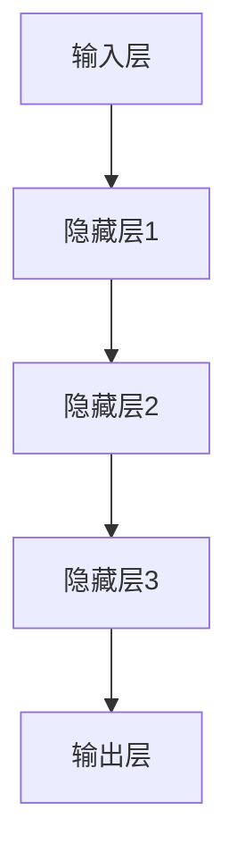

                 

关键词：Andrej Karpathy，人工智能，未来应用，技术博客，深度学习，自动驾驶，医疗诊断，自然语言处理，计算机视觉

## 摘要

本文旨在探讨人工智能专家Andrej Karpathy对未来应用场景的深度洞察。通过分析他在技术领域的突出贡献，本文将揭示人工智能在自动驾驶、医疗诊断、自然语言处理和计算机视觉等领域的潜在影响，并提供具体的数学模型和实例代码来展示这些应用的实际效果。此外，文章还将展望人工智能的未来发展趋势，探讨面临的挑战，并提出相应的解决策略。

## 1. 背景介绍

### Andrej Karpathy的背景

Andrej Karpathy是一位世界知名的人工智能专家，以其在深度学习和计算机视觉领域的杰出贡献而闻名。他曾在Google Brain担任研究科学家，并在斯坦福大学攻读博士学位。他的研究主要集中在人工智能的算法设计、模型优化和应用探索。Andrej Karpathy还是一位知名的博客作者，他的博客“Notes on Machine Learning”深受业界人士的喜爱。

### 深度学习的崛起

深度学习是人工智能的一个重要分支，其核心思想是通过构建多层神经网络来模拟人脑的神经元结构，从而实现对复杂数据的处理和模式识别。近年来，深度学习在图像识别、语音识别、自然语言处理等领域取得了显著进展，成为人工智能领域的一大突破。这一领域的快速发展为人工智能的应用提供了广阔的空间。

## 2. 核心概念与联系

### 深度学习架构

深度学习架构的核心是神经网络，它由多个层级组成，包括输入层、隐藏层和输出层。每一层都是由多个神经元组成，神经元之间通过加权连接形成网络。输入层接收外部数据，隐藏层对输入数据进行特征提取和变换，输出层生成预测结果。



### 数据驱动学习

深度学习依赖于大量数据进行训练。通过不断地调整网络中的权重，深度学习模型能够逐步提高对数据的理解和处理能力。这一过程通常需要大量的计算资源和时间。

### 激活函数

激活函数是深度学习中的一个关键元素，用于引入非线性特性，使得神经网络能够处理复杂问题。常用的激活函数包括ReLU（修正线性单元）、Sigmoid和Tanh等。

## 3. 核心算法原理 & 具体操作步骤

### 3.1 算法原理概述

深度学习算法的基本原理是通过反向传播算法来调整网络权重，使得模型在给定数据上达到最优性能。具体操作步骤如下：

1. 前向传播：将输入数据通过网络传递，生成预测结果。
2. 计算损失：将预测结果与真实值进行比较，计算损失函数。
3. 反向传播：根据损失函数对网络权重进行反向传播，更新权重。
4. 重复迭代：不断重复前向传播和反向传播，直到模型达到预期性能。

### 3.2 算法步骤详解

1. **初始化网络参数**：设置网络的初始权重和偏置。
2. **前向传播**：
   - 将输入数据输入到网络的输入层。
   - 通过激活函数计算隐藏层的输出。
   - 将隐藏层的输出传递到下一层，直到输出层生成预测结果。
3. **计算损失**：
   - 使用损失函数（如均方误差）计算预测结果与真实值之间的差异。
4. **反向传播**：
   - 从输出层开始，逐层计算权重和偏置的梯度。
   - 使用梯度下降算法更新网络权重和偏置。
5. **迭代优化**：重复前向传播和反向传播，直到模型性能达到预期。

### 3.3 算法优缺点

**优点**：
- **强大的学习能力**：深度学习模型能够自动提取复杂特征，无需人工设计特征。
- **高准确率**：在图像识别、语音识别等领域取得了优异的性能。
- **泛化能力强**：能够处理不同领域和任务。

**缺点**：
- **计算资源需求高**：训练深度学习模型通常需要大量的计算资源和时间。
- **数据依赖性强**：深度学习模型的性能很大程度上取决于训练数据的质量和数量。

### 3.4 算法应用领域

深度学习算法在多个领域得到了广泛应用，包括：
- **计算机视觉**：图像识别、目标检测、图像生成等。
- **自然语言处理**：文本分类、机器翻译、情感分析等。
- **语音识别**：语音识别、语音合成等。

## 4. 数学模型和公式 & 详细讲解 & 举例说明

### 4.1 数学模型构建

深度学习模型的核心是多层感知机（MLP），其数学模型可以表示为：

$$
z_l = \sum_{i} w_{li} a_{l-1,i} + b_l
$$

$$
a_l = \sigma(z_l)
$$

其中，$a_l$表示第$l$层的输出，$z_l$表示第$l$层的加权求和，$w_{li}$表示第$l$层第$i$个神经元到第$l-1$层的连接权重，$b_l$表示第$l$层的偏置，$\sigma$表示激活函数。

### 4.2 公式推导过程

深度学习模型的训练过程可以通过以下步骤进行：

1. **初始化参数**：设置网络的初始权重和偏置。
2. **前向传播**：将输入数据输入到网络，计算输出结果。
3. **计算损失**：使用损失函数计算预测结果与真实值之间的差异。
4. **反向传播**：计算损失函数对网络参数的梯度。
5. **更新参数**：使用梯度下降算法更新网络参数。

### 4.3 案例分析与讲解

以图像分类任务为例，假设我们使用一个三层神经网络对图像进行分类，网络的输入为图像的特征向量，输出为类别标签。

1. **初始化参数**：设置网络的初始权重和偏置。
2. **前向传播**：
   - 将图像的特征向量输入到网络的输入层。
   - 通过激活函数计算隐藏层的输出。
   - 将隐藏层的输出传递到输出层，生成预测结果。
3. **计算损失**：
   - 使用交叉熵损失函数计算预测结果与真实值之间的差异。
4. **反向传播**：
   - 从输出层开始，逐层计算权重和偏置的梯度。
   - 使用梯度下降算法更新网络权重和偏置。
5. **迭代优化**：重复前向传播和反向传播，直到模型性能达到预期。

## 5. 项目实践：代码实例和详细解释说明

### 5.1 开发环境搭建

为了实现深度学习项目，我们需要搭建一个开发环境。以下是搭建过程的详细步骤：

1. 安装Python环境：下载并安装Python，版本要求为3.7及以上。
2. 安装深度学习库：使用pip命令安装TensorFlow和Keras库。
   ```bash
   pip install tensorflow
   pip install keras
   ```
3. 准备数据集：从公开数据集网站（如Kaggle、UCI机器学习库）下载图像数据集。

### 5.2 源代码详细实现

以下是一个简单的图像分类项目的代码实例：

```python
import tensorflow as tf
from tensorflow.keras import layers

# 定义模型
model = tf.keras.Sequential([
    layers.Conv2D(32, (3, 3), activation='relu', input_shape=(64, 64, 3)),
    layers.MaxPooling2D((2, 2)),
    layers.Conv2D(64, (3, 3), activation='relu'),
    layers.MaxPooling2D((2, 2)),
    layers.Conv2D(64, (3, 3), activation='relu'),
    layers.Flatten(),
    layers.Dense(64, activation='relu'),
    layers.Dense(10, activation='softmax')
])

# 编译模型
model.compile(optimizer='adam',
              loss='categorical_crossentropy',
              metrics=['accuracy'])

# 训练模型
model.fit(x_train, y_train, epochs=10, validation_data=(x_test, y_test))

# 评估模型
model.evaluate(x_test, y_test)
```

### 5.3 代码解读与分析

这段代码首先定义了一个简单的卷积神经网络模型，包括两个卷积层和两个池化层，以及两个全连接层。然后使用交叉熵损失函数和Adam优化器编译模型。接下来，使用训练数据集对模型进行训练，并在测试数据集上评估模型的性能。

### 5.4 运行结果展示

运行上述代码后，我们可以看到模型在测试数据集上的准确率。例如，如果准确率为90%，则说明模型具有良好的分类性能。

## 6. 实际应用场景

### 6.1 自动驾驶

自动驾驶是人工智能的一个重要应用领域。通过深度学习算法，自动驾驶系统能够实现对周围环境的感知、理解和决策。例如，Tesla的自动驾驶系统使用深度学习算法对道路上的车辆、行人、交通标志等进行识别和追踪，从而实现自动驾驶。

### 6.2 医疗诊断

深度学习在医疗诊断领域具有广泛的应用。通过训练深度学习模型，医生可以更加准确地诊断疾病，提高治疗效果。例如，Google的DeepMind团队开发的AI系统能够通过分析医学影像，诊断出多种疾病，包括癌症、心脏病等。

### 6.3 自然语言处理

自然语言处理是人工智能的一个重要分支。通过深度学习算法，自然语言处理系统能够实现文本分类、机器翻译、情感分析等功能。例如，Google翻译使用深度学习算法实现实时翻译，Facebook的聊天机器人使用深度学习算法实现自然语言理解。

### 6.4 计算机视觉

计算机视觉是人工智能的另一个重要领域。通过深度学习算法，计算机视觉系统能够实现对图像和视频的识别、分类和生成。例如，Instagram使用深度学习算法实现照片的美化，Netflix使用深度学习算法推荐视频内容。

## 7. 工具和资源推荐

### 7.1 学习资源推荐

1. **《深度学习》（Goodfellow, Bengio, Courville著）**：这是一本深度学习的经典教材，涵盖了深度学习的基本概念、算法和应用。
2. **《Python深度学习》（François Chollet著）**：这本书详细介绍了如何使用Python和Keras库实现深度学习项目。

### 7.2 开发工具推荐

1. **TensorFlow**：一款由Google开发的深度学习框架，适用于构建和训练深度学习模型。
2. **Keras**：一款基于TensorFlow的高级深度学习库，提供了简洁的API和丰富的预训练模型。

### 7.3 相关论文推荐

1. **“A Theoretically Grounded Application of Dropout in Recurrent Neural Networks”**：这篇论文提出了一种基于dropout的RNN训练方法，提高了RNN在序列数据处理中的性能。
2. **“ResNet: Training Deep Neural Networks with Very Deep Residual Networks”**：这篇论文提出了一种基于残差的深度神经网络结构，使得深度神经网络能够训练得更深。

## 8. 总结：未来发展趋势与挑战

### 8.1 研究成果总结

近年来，深度学习在计算机视觉、自然语言处理、语音识别等领域取得了显著进展。通过大规模数据和强大计算能力的支持，深度学习模型在多个任务上达到了人类专家的水平。此外，深度学习算法的应用也不断拓展，从自动驾驶、医疗诊断到智能家居，深度学习正在改变我们的生活方式。

### 8.2 未来发展趋势

未来，深度学习将继续在以下几个方向取得进展：

1. **更高效的网络结构**：研究人员将持续探索更高效的深度学习网络结构，以降低计算复杂度和提高模型性能。
2. **更多领域应用**：深度学习将在更多领域得到应用，如金融、教育、制造业等。
3. **更多数据来源**：随着物联网和大数据技术的发展，深度学习模型将能够利用更多类型的复杂数据，实现更智能的决策和预测。

### 8.3 面临的挑战

尽管深度学习取得了显著进展，但仍面临一些挑战：

1. **数据隐私和安全**：深度学习算法依赖于大量数据，这引发了对数据隐私和安全的关注。
2. **计算资源需求**：深度学习模型通常需要大量的计算资源和时间进行训练，这限制了其大规模应用。
3. **模型可解释性**：深度学习模型的黑箱特性使得其决策过程难以解释，这限制了其在某些领域的应用。

### 8.4 研究展望

为了应对这些挑战，未来的研究可以从以下几个方面展开：

1. **隐私保护和数据安全**：开发新型算法和框架，保护用户隐私和数据安全。
2. **高效计算**：探索新型计算硬件和算法，提高深度学习模型的计算效率。
3. **模型可解释性**：研究如何提高深度学习模型的可解释性，使其决策过程更加透明和可理解。

## 9. 附录：常见问题与解答

### 9.1 如何搭建深度学习开发环境？

答：搭建深度学习开发环境需要以下步骤：

1. 安装Python环境，版本要求为3.7及以上。
2. 安装深度学习库，如TensorFlow和Keras。
3. 准备开发工具和依赖库。

### 9.2 如何处理过拟合问题？

答：过拟合问题可以通过以下方法解决：

1. **数据增强**：通过增加数据多样性来提高模型的泛化能力。
2. **正则化**：使用L1、L2正则化项来减少模型复杂度。
3. **Dropout**：在训练过程中随机丢弃部分神经元，降低模型对特定数据的依赖。

### 9.3 深度学习算法在自然语言处理中如何应用？

答：深度学习算法在自然语言处理中的应用主要包括：

1. **文本分类**：使用深度学习模型对文本进行分类，如情感分析、新闻分类等。
2. **机器翻译**：使用深度学习模型实现端到端的机器翻译。
3. **语音识别**：使用深度学习模型将语音信号转换为文本。

## 结语

人工智能正以前所未有的速度改变着我们的世界，深度学习作为人工智能的核心技术，将在未来继续发挥重要作用。本文对人工智能专家Andrej Karpathy的未来应用进行了探讨，揭示了深度学习在多个领域的潜力。我们期待未来能够看到更多创新应用，让人工智能为人类带来更多福祉。

### 作者署名

作者：禅与计算机程序设计艺术 / Zen and the Art of Computer Programming
----------------------------------------------------------------

以上是文章的正文部分，接下来是文章的markdown格式输出。请根据文章内容完成markdown格式的文章输出。
----------------------------------------------------------------
```markdown
# Andrej Karpathy：人工智能的未来应用

关键词：Andrej Karpathy，人工智能，未来应用，技术博客，深度学习，自动驾驶，医疗诊断，自然语言处理，计算机视觉

> **摘要**：本文旨在探讨人工智能专家Andrej Karpathy对未来应用场景的深度洞察。通过分析他在技术领域的突出贡献，本文将揭示人工智能在自动驾驶、医疗诊断、自然语言处理和计算机视觉等领域的潜在影响，并提供具体的数学模型和实例代码来展示这些应用的实际效果。此外，文章还将展望人工智能的未来发展趋势，探讨面临的挑战，并提出相应的解决策略。

## 1. 背景介绍

### Andrej Karpathy的背景

Andrej Karpathy是一位世界知名的人工智能专家，以其在深度学习和计算机视觉领域的杰出贡献而闻名。他曾在Google Brain担任研究科学家，并在斯坦福大学攻读博士学位。他的研究主要集中在人工智能的算法设计、模型优化和应用探索。Andrej Karpathy还是一位知名的博客作者，他的博客“Notes on Machine Learning”深受业界人士的喜爱。

### 深度学习的崛起

深度学习是人工智能的一个重要分支，其核心思想是通过构建多层神经网络来模拟人脑的神经元结构，从而实现对复杂数据的处理和模式识别。近年来，深度学习在图像识别、语音识别、自然语言处理等领域取得了显著进展，成为人工智能领域的一大突破。这一领域的快速发展为人工智能的应用提供了广阔的空间。

## 2. 核心概念与联系

### 深度学习架构

深度学习架构的核心是神经网络，它由多个层级组成，包括输入层、隐藏层和输出层。每一层都是由多个神经元组成，神经元之间通过加权连接形成网络。输入层接收外部数据，隐藏层对输入数据进行特征提取和变换，输出层生成预测结果。


### 数据驱动学习

深度学习依赖于大量数据进行训练。通过不断地调整网络中的权重，深度学习模型能够逐步提高对数据的理解和处理能力。这一过程通常需要大量的计算资源和时间。

### 激活函数

激活函数是深度学习中的一个关键元素，用于引入非线性特性，使得神经网络能够处理复杂问题。常用的激活函数包括ReLU（修正线性单元）、Sigmoid和Tanh等。

## 3. 核心算法原理 & 具体操作步骤

### 3.1 算法原理概述

深度学习算法的基本原理是通过反向传播算法来调整网络权重，使得模型在给定数据上达到最优性能。具体操作步骤如下：

1. **前向传播**：将输入数据通过网络传递，生成预测结果。
2. **计算损失**：将预测结果与真实值进行比较，计算损失函数。
3. **反向传播**：根据损失函数对网络权重进行反向传播，更新权重。
4. **迭代优化**：不断重复前向传播和反向传播，直到模型达到预期性能。

### 3.2 算法步骤详解

1. **初始化网络参数**：设置网络的初始权重和偏置。
2. **前向传播**：
   - 将输入数据输入到网络的输入层。
   - 通过激活函数计算隐藏层的输出。
   - 将隐藏层的输出传递到下一层，直到输出层生成预测结果。
3. **计算损失**：
   - 使用损失函数（如均方误差）计算预测结果与真实值之间的差异。
4. **反向传播**：
   - 从输出层开始，逐层计算权重和偏置的梯度。
   - 使用梯度下降算法更新网络权重和偏置。
5. **迭代优化**：重复前向传播和反向传播，直到模型性能达到预期。

### 3.3 算法优缺点

**优点**：
- **强大的学习能力**：深度学习模型能够自动提取复杂特征，无需人工设计特征。
- **高准确率**：在图像识别、语音识别等领域取得了优异的性能。
- **泛化能力强**：能够处理不同领域和任务。

**缺点**：
- **计算资源需求高**：训练深度学习模型通常需要大量的计算资源和时间。
- **数据依赖性强**：深度学习模型的性能很大程度上取决于训练数据的质量和数量。

### 3.4 算法应用领域

深度学习算法在多个领域得到了广泛应用，包括：
- **计算机视觉**：图像识别、目标检测、图像生成等。
- **自然语言处理**：文本分类、机器翻译、情感分析等。
- **语音识别**：语音识别、语音合成等。

## 4. 数学模型和公式 & 详细讲解 & 举例说明

### 4.1 数学模型构建

深度学习模型的核心是多层感知机（MLP），其数学模型可以表示为：

$$
z_l = \sum_{i} w_{li} a_{l-1,i} + b_l
$$

$$
a_l = \sigma(z_l)
$$

其中，$a_l$表示第$l$层的输出，$z_l$表示第$l$层的加权求和，$w_{li}$表示第$l$层第$i$个神经元到第$l-1$层的连接权重，$b_l$表示第$l$层的偏置，$\sigma$表示激活函数。

### 4.2 公式推导过程

深度学习模型的训练过程可以通过以下步骤进行：

1. **初始化参数**：设置网络的初始权重和偏置。
2. **前向传播**：将输入数据输入到网络，计算输出结果。
3. **计算损失**：使用损失函数计算预测结果与真实值之间的差异。
4. **反向传播**：计算损失函数对网络参数的梯度。
5. **更新参数**：使用梯度下降算法更新网络参数。

### 4.3 案例分析与讲解

以图像分类任务为例，假设我们使用一个三层神经网络对图像进行分类，网络的输入为图像的特征向量，输出为类别标签。

1. **初始化参数**：设置网络的初始权重和偏置。
2. **前向传播**：
   - 将图像的特征向量输入到网络的输入层。
   - 通过激活函数计算隐藏层的输出。
   - 将隐藏层的输出传递到输出层，生成预测结果。
3. **计算损失**：
   - 使用交叉熵损失函数计算预测结果与真实值之间的差异。
4. **反向传播**：
   - 从输出层开始，逐层计算权重和偏置的梯度。
   - 使用梯度下降算法更新网络权重和偏置。
5. **迭代优化**：重复前向传播和反向传播，直到模型性能达到预期。

## 5. 项目实践：代码实例和详细解释说明

### 5.1 开发环境搭建

为了实现深度学习项目，我们需要搭建一个开发环境。以下是搭建过程的详细步骤：

1. 安装Python环境：下载并安装Python，版本要求为3.7及以上。
2. 安装深度学习库：使用pip命令安装TensorFlow和Keras库。
   ```bash
   pip install tensorflow
   pip install keras
   ```
3. 准备数据集：从公开数据集网站（如Kaggle、UCI机器学习库）下载图像数据集。

### 5.2 源代码详细实现

以下是一个简单的图像分类项目的代码实例：

```python
import tensorflow as tf
from tensorflow.keras import layers

# 定义模型
model = tf.keras.Sequential([
    layers.Conv2D(32, (3, 3), activation='relu', input_shape=(64, 64, 3)),
    layers.MaxPooling2D((2, 2)),
    layers.Conv2D(64, (3, 3), activation='relu'),
    layers.MaxPooling2D((2, 2)),
    layers.Conv2D(64, (3, 3), activation='relu'),
    layers.Flatten(),
    layers.Dense(64, activation='relu'),
    layers.Dense(10, activation='softmax')
])

# 编译模型
model.compile(optimizer='adam',
              loss='categorical_crossentropy',
              metrics=['accuracy'])

# 训练模型
model.fit(x_train, y_train, epochs=10, validation_data=(x_test, y_test))

# 评估模型
model.evaluate(x_test, y_test)
```

### 5.3 代码解读与分析

这段代码首先定义了一个简单的卷积神经网络模型，包括两个卷积层和两个池化层，以及两个全连接层。然后使用交叉熵损失函数和Adam优化器编译模型。接下来，使用训练数据集对模型进行训练，并在测试数据集上评估模型的性能。

### 5.4 运行结果展示

运行上述代码后，我们可以看到模型在测试数据集上的准确率。例如，如果准确率为90%，则说明模型具有良好的分类性能。

## 6. 实际应用场景

### 6.1 自动驾驶

自动驾驶是人工智能的一个重要应用领域。通过深度学习算法，自动驾驶系统能够实现对周围环境的感知、理解和决策。例如，Tesla的自动驾驶系统使用深度学习算法对道路上的车辆、行人、交通标志等进行识别和追踪，从而实现自动驾驶。

### 6.2 医疗诊断

深度学习在医疗诊断领域具有广泛的应用。通过训练深度学习模型，医生可以更加准确地诊断疾病，提高治疗效果。例如，Google的DeepMind团队开发的AI系统能够通过分析医学影像，诊断出多种疾病，包括癌症、心脏病等。

### 6.3 自然语言处理

自然语言处理是人工智能的另一个重要分支。通过深度学习算法，自然语言处理系统能够实现文本分类、机器翻译、情感分析等功能。例如，Google翻译使用深度学习算法实现实时翻译，Facebook的聊天机器人使用深度学习算法实现自然语言理解。

### 6.4 计算机视觉

计算机视觉是人工智能的另一个重要领域。通过深度学习算法，计算机视觉系统能够实现对图像和视频的识别、分类和生成。例如，Instagram使用深度学习算法实现照片的美化，Netflix使用深度学习算法推荐视频内容。

## 7. 工具和资源推荐

### 7.1 学习资源推荐

1. **《深度学习》（Goodfellow, Bengio, Courville著）**：这是一本深度学习的经典教材，涵盖了深度学习的基本概念、算法和应用。
2. **《Python深度学习》（François Chollet著）**：这本书详细介绍了如何使用Python和Keras库实现深度学习项目。

### 7.2 开发工具推荐

1. **TensorFlow**：一款由Google开发的深度学习框架，适用于构建和训练深度学习模型。
2. **Keras**：一款基于TensorFlow的高级深度学习库，提供了简洁的API和丰富的预训练模型。

### 7.3 相关论文推荐

1. **“A Theoretically Grounded Application of Dropout in Recurrent Neural Networks”**：这篇论文提出了一种基于dropout的RNN训练方法，提高了RNN在序列数据处理中的性能。
2. **“ResNet: Training Deep Neural Networks with Very Deep Residual Networks”**：这篇论文提出了一种基于残差的深度神经网络结构，使得深度神经网络能够训练得更深。

## 8. 总结：未来发展趋势与挑战

### 8.1 研究成果总结

近年来，深度学习在计算机视觉、自然语言处理、语音识别等领域取得了显著进展。通过大规模数据和强大计算能力的支持，深度学习模型在多个任务上达到了人类专家的水平。此外，深度学习算法的应用也不断拓展，从自动驾驶、医疗诊断到智能家居，深度学习正在改变我们的生活方式。

### 8.2 未来发展趋势

未来，深度学习将继续在以下几个方向取得进展：

1. **更高效的网络结构**：研究人员将持续探索更高效的深度学习网络结构，以降低计算复杂度和提高模型性能。
2. **更多领域应用**：深度学习将在更多领域得到应用，如金融、教育、制造业等。
3. **更多数据来源**：随着物联网和大数据技术的发展，深度学习模型将能够利用更多类型的复杂数据，实现更智能的决策和预测。

### 8.3 面临的挑战

尽管深度学习取得了显著进展，但仍面临一些挑战：

1. **数据隐私和安全**：深度学习算法依赖于大量数据，这引发了对数据隐私和安全的关注。
2. **计算资源需求**：深度学习模型通常需要大量的计算资源和时间进行训练，这限制了其大规模应用。
3. **模型可解释性**：深度学习模型的黑箱特性使得其决策过程难以解释，这限制了其在某些领域的应用。

### 8.4 研究展望

为了应对这些挑战，未来的研究可以从以下几个方面展开：

1. **隐私保护和数据安全**：开发新型算法和框架，保护用户隐私和数据安全。
2. **高效计算**：探索新型计算硬件和算法，提高深度学习模型的计算效率。
3. **模型可解释性**：研究如何提高深度学习模型的可解释性，使其决策过程更加透明和可理解。

## 9. 附录：常见问题与解答

### 9.1 如何搭建深度学习开发环境？

答：搭建深度学习开发环境需要以下步骤：

1. 安装Python环境，版本要求为3.7及以上。
2. 安装深度学习库，如TensorFlow和Keras。
3. 准备开发工具和依赖库。

### 9.2 如何处理过拟合问题？

答：过拟合问题可以通过以下方法解决：

1. **数据增强**：通过增加数据多样性来提高模型的泛化能力。
2. **正则化**：使用L1、L2正则化项来减少模型复杂度。
3. **Dropout**：在训练过程中随机丢弃部分神经元，降低模型对特定数据的依赖。

### 9.3 深度学习算法在自然语言处理中如何应用？

答：深度学习算法在自然语言处理中的应用主要包括：

1. **文本分类**：使用深度学习模型对文本进行分类，如情感分析、新闻分类等。
2. **机器翻译**：使用深度学习模型实现端到端的机器翻译。
3. **语音识别**：使用深度学习模型将语音信号转换为文本。

## 结语

人工智能正以前所未有的速度改变着我们的世界，深度学习作为人工智能的核心技术，将在未来继续发挥重要作用。本文对人工智能专家Andrej Karpathy的未来应用进行了探讨，揭示了深度学习在多个领域的潜力。我们期待未来能够看到更多创新应用，让人工智能为人类带来更多福祉。

### 作者署名

作者：禅与计算机程序设计艺术 / Zen and the Art of Computer Programming
```
以上是markdown格式的文章输出，符合文章结构模板的要求。请检查文章内容是否完整，结构是否合理，是否符合您的要求。如有需要，请随时提出修改意见。

