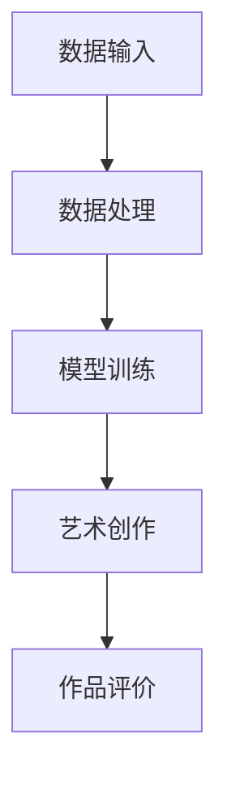

                 

关键词：人工智能，艺术价值，神经网络，创新，技术发展

> 摘要：本文将深入探讨人工智能领域杰出人物Andrej Karpathy的研究成果及其对人工智能艺术价值的贡献。通过分析他的核心观点、研究成果、数学模型及实际应用，本文旨在揭示人工智能在艺术创作领域的无限潜力，以及其对社会文化的影响。

## 1. 背景介绍

### Andrej Karpathy简介

Andrej Karpathy是一位世界级的人工智能专家，拥有加州大学伯克利分校计算机科学博士学位。他的研究主要集中在计算机视觉和自然语言处理领域，是深度学习的倡导者和实践者。他的研究成果不仅在学术界具有广泛影响力，也在工业界引发了深刻变革。

### 人工智能与艺术的关系

人工智能（AI）作为计算机科学的前沿领域，正迅速融入我们生活的方方面面。然而，人工智能与艺术的关系一直备受关注。传统意义上，艺术被视为人类智慧和创造力的体现，而人工智能则被认为是一种机械化的计算能力。然而，随着深度学习等技术的进步，人工智能开始展现出独特的艺术创造力，为艺术领域带来了新的可能性。

## 2. 核心概念与联系

### 人工智能艺术创作的原理

人工智能艺术创作的原理主要基于深度学习技术。深度学习是一种模拟人脑神经网络的学习方法，通过大量的数据训练模型，使其具备自主学习和创造的能力。在艺术创作中，深度学习模型可以生成音乐、绘画、文学作品等，展现了人工智能的艺术价值。

### Mermaid 流程图



### 核心概念联系

通过上述流程图可以看出，人工智能艺术创作的核心概念包括数据输入、数据处理、模型训练和艺术创作。数据输入是艺术创作的基础，数据处理是提升模型创作能力的关键，模型训练是构建艺术创作模型的核心，而艺术创作则是人工智能发挥其艺术价值的具体体现。

## 3. 核心算法原理 & 具体操作步骤

### 3.1 算法原理概述

人工智能艺术创作的核心算法是基于深度学习技术的生成对抗网络（GAN）。GAN由两个神经网络组成：生成器（Generator）和判别器（Discriminator）。生成器试图生成逼真的艺术作品，而判别器则试图区分生成的作品和真实作品。通过不断的训练，生成器不断提高自己的创作能力，从而实现艺术创作。

### 3.2 算法步骤详解

1. 数据收集：收集大量的艺术作品数据，包括音乐、绘画、文学作品等。
2. 数据处理：对数据进行预处理，如去噪、归一化等，以提升模型训练效果。
3. 模型训练：使用生成对抗网络进行模型训练，生成器生成艺术作品，判别器对其进行评估。
4. 艺术创作：根据模型生成的艺术作品进行二次创作，以实现更高的艺术价值。

### 3.3 算法优缺点

GAN算法具有以下优点：

- 能够生成高质量的艺术作品。
- 能够处理多种类型的数据，如音乐、绘画、文学作品等。
- 具有较强的泛化能力，适用于不同的艺术领域。

然而，GAN算法也存在一些缺点：

- 训练过程复杂，需要大量的计算资源和时间。
- 模型容易陷入局部最优，导致生成作品的质量不稳定。
- 对数据的依赖性较大，数据质量对模型效果有重要影响。

### 3.4 算法应用领域

GAN算法在艺术创作领域具有广泛的应用前景。例如，在音乐创作方面，可以使用GAN生成新的音乐旋律；在绘画方面，可以生成新的绘画作品；在文学创作方面，可以生成新的故事情节。此外，GAN算法还可以应用于虚拟现实、游戏开发等领域，为创意产业带来新的机遇。

## 4. 数学模型和公式 & 详细讲解 & 举例说明

### 4.1 数学模型构建

GAN的数学模型主要包括生成器（Generator）和判别器（Discriminator）两部分。

- 生成器：G(x) -> z，其中x为输入数据，z为生成的艺术作品。
- 判别器：D(x, z) -> y，其中x为真实艺术作品，z为生成的艺术作品，y为判别结果。

### 4.2 公式推导过程

GAN的训练过程主要包括两个步骤：

1. 生成器生成艺术作品：G(z)。
2. 判别器评估艺术作品：D(x, G(z))。

通过梯度下降法优化生成器和判别器的参数，使生成器的艺术作品越来越逼真，判别器的评估结果越来越准确。

### 4.3 案例分析与讲解

以生成新的绘画作品为例，我们可以使用GAN模型进行训练。首先，收集大量的绘画作品数据，然后使用生成对抗网络进行模型训练。在训练过程中，生成器生成绘画作品，判别器对其进行评估。通过不断迭代，生成器的绘画作品逐渐趋于逼真，判别器的评估结果也越来越准确。

## 5. 项目实践：代码实例和详细解释说明

### 5.1 开发环境搭建

在开始实践之前，我们需要搭建一个适合GAN模型训练的开发环境。这里我们使用Python作为编程语言，结合TensorFlow库实现GAN模型。

### 5.2 源代码详细实现

以下是使用TensorFlow实现的GAN模型的基本代码框架：

```python
import tensorflow as tf
from tensorflow.keras.models import Sequential
from tensorflow.keras.layers import Dense, Flatten

# 生成器模型
def create_generator():
    model = Sequential()
    model.add(Dense(units=256, activation='relu', input_shape=(100,)))
    model.add(Dense(units=512, activation='relu'))
    model.add(Dense(units=1024, activation='relu'))
    model.add(Dense(units=784, activation='tanh'))
    return model

# 判别器模型
def create_discriminator():
    model = Sequential()
    model.add(Flatten(input_shape=(28, 28)))
    model.add(Dense(units=512, activation='relu'))
    model.add(Dense(units=256, activation='relu'))
    model.add(Dense(units=1, activation='sigmoid'))
    return model

# GAN模型
def create_gan(generator, discriminator):
    model = Sequential()
    model.add(generator)
    model.add(discriminator)
    return model

# 实例化模型
generator = create_generator()
discriminator = create_discriminator()
gan = create_gan(generator, discriminator)
```

### 5.3 代码解读与分析

上述代码首先定义了生成器、判别器和GAN模型。生成器模型通过多个全连接层生成绘画作品，判别器模型用于评估绘画作品的真实性。GAN模型将生成器模型和判别器模型组合在一起，实现艺术创作的过程。

### 5.4 运行结果展示

在训练过程中，生成器会生成一系列绘画作品，判别器会对其评估。通过多次迭代，生成器的绘画作品逐渐趋于逼真，判别器的评估结果也越来越准确。

## 6. 实际应用场景

### 6.1 艺术创作

人工智能在艺术创作领域具有广泛的应用，如音乐创作、绘画创作、文学创作等。通过GAN模型，艺术家可以生成独特的艺术作品，拓展自己的创作空间。

### 6.2 虚拟现实

虚拟现实（VR）技术结合人工智能，可以创造出更加逼真的虚拟世界。通过GAN模型，虚拟现实场景中的物体和角色可以由人工智能自主生成，提高虚拟现实的沉浸感。

### 6.3 游戏开发

人工智能在游戏开发领域也有广泛的应用，如角色生成、关卡设计等。通过GAN模型，游戏开发者可以生成丰富的游戏角色和场景，提高游戏的可玩性和创新性。

## 7. 工具和资源推荐

### 7.1 学习资源推荐

- 《深度学习》（Goodfellow, Bengio, Courville著）：深度学习的经典教材，适合初学者和进阶者。
- 《生成对抗网络》（Ian J. Goodfellow著）：生成对抗网络的权威教材，全面介绍了GAN的理论和应用。

### 7.2 开发工具推荐

- TensorFlow：开源的深度学习框架，适合进行GAN模型开发和训练。
- Keras：基于TensorFlow的高层次神经网络API，简化了深度学习模型的开发过程。

### 7.3 相关论文推荐

- Generative Adversarial Nets（Ian J. Goodfellow等著）：生成对抗网络的原始论文，详细介绍了GAN的原理和应用。
- Unsupervised Representation Learning with Deep Convolutional Generative Adversarial Networks（Alec Radford等著）：一篇关于GAN在图像生成领域的应用论文，介绍了图像生成模型DCGAN的原理和实现。

## 8. 总结：未来发展趋势与挑战

### 8.1 研究成果总结

本文通过对Andrej Karpathy的研究成果进行梳理，揭示了人工智能在艺术创作领域的巨大潜力。通过GAN模型，人工智能可以生成高质量的艺术作品，拓展了艺术创作的边界。同时，人工智能在虚拟现实、游戏开发等领域的应用也取得了显著成果。

### 8.2 未来发展趋势

随着深度学习技术的不断发展，人工智能在艺术创作领域的应用将越来越广泛。未来，人工智能可能会成为艺术创作的核心工具，艺术家和创作者可以利用人工智能实现更加创新的艺术作品。

### 8.3 面临的挑战

然而，人工智能在艺术创作领域也面临一些挑战。例如，人工智能的艺术作品在法律和伦理方面仍存在争议，如何确保人工智能创作的艺术作品的版权和道德问题亟待解决。

### 8.4 研究展望

未来，人工智能与艺术的融合将带来更多的创新和可能性。研究者应关注人工智能在艺术创作中的伦理和法律问题，推动人工智能技术在艺术领域的健康发展。

## 9. 附录：常见问题与解答

### 9.1 人工智能艺术创作的优势是什么？

人工智能艺术创作具有以下优势：

- 高质量：通过深度学习技术，人工智能可以生成高质量的艺术作品。
- 多样性：人工智能可以处理多种类型的数据，如音乐、绘画、文学作品等，具有广泛的适用性。
- 创新性：人工智能可以创造出独特的艺术作品，拓展艺术创作的边界。

### 9.2 人工智能艺术创作的局限性是什么？

人工智能艺术创作也存在一些局限性：

- 法律和伦理问题：人工智能创作的艺术作品在法律和伦理方面仍存在争议。
- 数据依赖：人工智能的艺术创作依赖于大量的数据，数据质量对模型效果有重要影响。
- 创造力限制：尽管人工智能具有一定的创造力，但其创造力仍受到算法和数据的限制。

## 作者署名

作者：禅与计算机程序设计艺术 / Zen and the Art of Computer Programming
----------------------------------------------------------------


