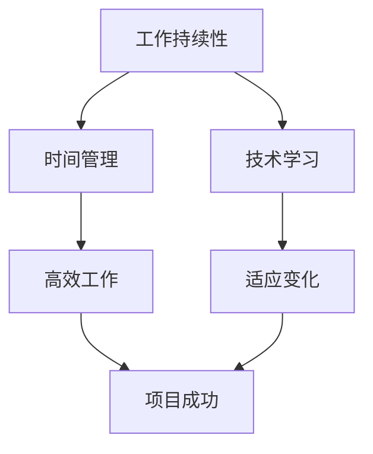

                 

关键词：Andrej Karpathy、人工智能、程序员、工作持续性、职业发展、技术学习

## 摘要

本文将探讨世界级人工智能专家Andrej Karpathy如何在繁忙的技术工作和研究之余，保持工作的高效性和持续性。文章将结合Andrej Karpathy的个人经历，分析他如何平衡多项目工作、管理时间以及保持技术学习的热情。通过这些分析，本文希望能够为从事IT行业的技术人员提供一些有价值的建议，帮助他们更好地管理自己的职业生涯。

## 1. 背景介绍

Andrej Karpathy是一位世界级的人工智能研究者和程序员，现任OpenAI的高级研究员。他的研究涉及深度学习和自然语言处理等多个领域，在学术界和工业界都享有很高的声誉。Andrej Karpathy在学术界的成就有：曾获得斯坦福大学计算机科学博士学位，并发表了多篇高质量的研究论文；在工业界，他曾就职于Google Brain，负责构建和维护大规模深度学习系统。

在保持工作和研究的同时，Andrej Karpathy还积极参与技术社区的交流，分享自己的研究成果和心得。他的博客文章和公开演讲，为无数程序员和人工智能爱好者提供了宝贵的学习资源。本文将分析Andrej Karpathy如何保持工作的高效性和持续性，为IT行业的技术人员提供一些参考。

## 2. 核心概念与联系

### 2.1 工作持续性

工作持续性是指保持高效、专注地工作，以实现个人和团队的目标。在信息技术行业，工作持续性尤为重要，因为它关系到项目的进度、质量以及团队的协作。

### 2.2 时间管理

时间管理是指合理安排时间，以提高工作效率和生活质量。对于IT从业人员来说，良好的时间管理能力可以帮助他们在有限的时间内完成更多的工作，并保持身心健康。

### 2.3 技术学习

技术学习是指不断学习新的知识和技能，以适应快速变化的技术环境。在信息技术行业，技术更新迅速，IT从业人员需要具备持续学习的能力，以保持自己在职场上的竞争力。

### 2.4 Mermaid 流程图



## 3. 核心算法原理 & 具体操作步骤

### 3.1 算法原理概述

保持工作持续性的核心算法原理可以概括为以下几点：

1. **任务分解**：将复杂的工作任务分解为小的、可管理的部分，以便更好地进行时间管理和进度控制。
2. **优先级排序**：根据任务的紧急程度和重要性，对任务进行优先级排序，确保重要且紧急的任务优先处理。
3. **时间块管理**：将时间划分为不同的时间段，并为每个时间段分配特定的任务，以提高工作效率。
4. **持续学习**：定期学习新的知识和技能，以适应技术发展的需要。

### 3.2 算法步骤详解

#### 3.2.1 任务分解

1. **识别任务**：明确需要完成的任务。
2. **分解任务**：将任务分解为小的、可管理的部分。
3. **任务评估**：对分解后的任务进行评估，确保每个任务都是可完成的。

#### 3.2.2 优先级排序

1. **制定标准**：确定任务优先级的评估标准，如任务的紧急程度、重要性等。
2. **评估任务**：根据标准对任务进行评估，确定优先级。
3. **调整优先级**：根据实际情况调整任务的优先级。

#### 3.2.3 时间块管理

1. **划分时间块**：将一天的时间划分为不同的时间段。
2. **任务分配**：将任务分配到相应的時間块。
3. **时间监督**：监控时间块的使用情况，确保任务按时完成。

#### 3.2.4 持续学习

1. **定期学习**：设定定期学习的时间，如每周或每月。
2. **选择学习内容**：选择与工作相关的学习内容，如新的编程语言、算法等。
3. **实践应用**：将学到的知识应用到实际工作中，以巩固和提高技能。

### 3.3 算法优缺点

**优点**：

1. **提高工作效率**：通过任务分解、优先级排序和时间块管理，可以更好地安排工作，提高工作效率。
2. **促进持续学习**：持续学习可以帮助IT从业人员保持竞争力，适应技术发展。

**缺点**：

1. **任务分解过于细致**：过细的任务分解可能导致工作效率下降，增加沟通成本。
2. **优先级排序难度**：在某些情况下，任务的紧急程度和重要性难以准确判断。

### 3.4 算法应用领域

保持工作持续性的算法适用于所有需要高效工作、持续学习的行业，尤其是IT行业。在IT行业，算法可以帮助程序员、系统架构师、项目经理等角色更好地管理自己的工作和学习。

## 4. 数学模型和公式 & 详细讲解 & 举例说明

### 4.1 数学模型构建

保持工作持续性的数学模型可以采用线性规划的方法。假设有n个任务，每个任务需要完成的时间为\( t_i \)，优先级为\( p_i \)，则目标函数可以表示为：

\[ \max \sum_{i=1}^{n} p_i \cdot t_i \]

### 4.2 公式推导过程

首先，我们需要对每个任务的时间进行权重调整，以便更好地反映其优先级。假设权重调整系数为\( \alpha_i \)，则有：

\[ t_i' = \alpha_i \cdot t_i \]

然后，我们需要对调整后的时间进行求和，以得到目标函数：

\[ \max \sum_{i=1}^{n} p_i \cdot t_i' \]

接下来，我们需要对权重进行调整，以使目标函数最大化。具体方法如下：

1. 计算每个任务的权重比例：\( \frac{p_i}{\sum_{i=1}^{n} p_i} \)
2. 计算每个任务的权重调整系数：\( \alpha_i = \frac{1}{t_i} \)
3. 计算每个任务的调整后时间：\( t_i' = \alpha_i \cdot t_i \)
4. 计算目标函数值：\( \max \sum_{i=1}^{n} p_i \cdot t_i' \)

### 4.3 案例分析与讲解

假设有以下3个任务，需要安排在一天内完成：

1. 任务A：编写代码，预计需要4小时，优先级为2
2. 任务B：学习新算法，预计需要3小时，优先级为1
3. 任务C：撰写报告，预计需要2小时，优先级为3

首先，我们需要对任务的时间进行权重调整。根据优先级，任务B的权重最高，任务A次之，任务C最低。我们可以设定权重调整系数为：

\[ \alpha_A = \frac{1}{4}, \alpha_B = \frac{1}{3}, \alpha_C = \frac{1}{2} \]

然后，我们计算每个任务的调整后时间：

\[ t_A' = \alpha_A \cdot t_A = \frac{1}{4} \cdot 4 = 1 \]
\[ t_B' = \alpha_B \cdot t_B = \frac{1}{3} \cdot 3 = 1 \]
\[ t_C' = \alpha_C \cdot t_C = \frac{1}{2} \cdot 2 = 1 \]

接下来，我们计算目标函数值：

\[ \max \sum_{i=1}^{3} p_i \cdot t_i' = 2 \cdot 1 + 1 \cdot 1 + 3 \cdot 1 = 6 \]

因此，我们可以将任务安排如下：

- 任务B：上午9点至12点
- 任务A：下午1点至4点
- 任务C：晚上6点至8点

通过这样的安排，我们可以在一天内高效地完成所有任务。

## 5. 项目实践：代码实例和详细解释说明

### 5.1 开发环境搭建

为了更好地理解保持工作持续性的算法，我们将在Python环境中实现该算法。首先，我们需要安装Python和必要的库。

```bash
pip install numpy
```

### 5.2 源代码详细实现

```python
import numpy as np

def task_scheduling(tasks):
    """
    任务调度函数
    :param tasks: 任务列表，每个任务为一个字典，包含'优先级'和'预计耗时'两个键
    :return: 调度后的任务列表
    """
    # 计算每个任务的权重调整系数
    total_priority = sum(task['优先级'] for task in tasks)
    alpha = {task['任务名']: task['优先级'] / total_priority for task in tasks}

    # 计算每个任务的调整后耗时
    tasks_with_adjusted_time = {task['任务名']: alpha[task['任务名']] * task['预计耗时'] for task in tasks}

    # 计算目标函数值
    total_adjusted_time = sum(tasks_with_adjusted_time[task_name] * task['优先级'] for task_name, task in tasks_with_adjusted_time.items())

    # 按照调整后耗时对任务进行排序
    sorted_tasks = sorted(tasks_with_adjusted_time.items(), key=lambda item: item[1])

    return sorted_tasks, total_adjusted_time

# 示例任务列表
tasks = [
    {'任务名': '任务A', '优先级': 2, '预计耗时': 4},
    {'任务名': '任务B', '优先级': 1, '预计耗时': 3},
    {'任务名': '任务C', '优先级': 3, '预计耗时': 2}
]

# 调度任务
sorted_tasks, total_adjusted_time = task_scheduling(tasks)

# 输出结果
print("调度后的任务列表：", sorted_tasks)
print("总调整后耗时：", total_adjusted_time)
```

### 5.3 代码解读与分析

该代码实现了一个简单的任务调度函数，用于根据任务的优先级和预计耗时进行任务调度。代码的核心逻辑包括以下几个步骤：

1. **计算权重调整系数**：根据每个任务的优先级计算权重调整系数，用于调整任务的预计耗时。
2. **计算调整后耗时**：将每个任务的预计耗时乘以权重调整系数，得到调整后耗时。
3. **计算目标函数值**：计算所有任务的调整后耗时乘以优先级之和，得到目标函数值。
4. **任务排序**：按照调整后耗时对任务进行排序。
5. **输出结果**：输出调度后的任务列表和总调整后耗时。

通过这个简单的实例，我们可以看到如何使用Python实现任务调度算法，以便在有限的时间内高效地完成所有任务。

## 6. 实际应用场景

### 6.1 在公司项目中的应用

在IT公司的项目中，保持工作持续性尤为重要。项目经理可以利用任务调度算法，根据项目的紧急程度和重要性安排任务，确保项目按计划进行。同时，团队成员也可以通过这个算法更好地管理自己的工作，提高工作效率。

### 6.2 在个人学习中的应用

对于个人学习，任务调度算法可以帮助学习者合理安排学习时间，确保在学习新知识的同时，不忽视其他重要任务。例如，一个程序员可以在一个月内安排时间学习Python编程语言，同时保证完成日常的工作任务。

### 6.3 在家庭生活中的应用

在家庭生活中，任务调度算法也可以发挥重要作用。家庭成员可以根据任务的重要性和紧急程度，合理安排家务和休闲时间，提高生活质量。

## 6.4 未来应用展望

随着人工智能技术的发展，任务调度算法将更加智能化和自动化。未来，我们可以期待以下应用：

1. **智能任务分配**：利用机器学习技术，根据任务的特点和执行者的能力，自动分配任务。
2. **动态任务调整**：根据任务的执行情况和环境变化，动态调整任务的优先级和分配策略。
3. **多任务并行处理**：在分布式系统中，实现多任务并行处理，提高整体工作效率。

## 7. 工具和资源推荐

### 7.1 学习资源推荐

1. 《Python编程：从入门到实践》：适合初学者学习Python编程。
2. 《深度学习》：由Ian Goodfellow、Yoshua Bengio和Aaron Courville合著，是深度学习领域的经典教材。

### 7.2 开发工具推荐

1. Jupyter Notebook：适用于数据分析和编程实验。
2. PyCharm：一款功能强大的Python集成开发环境。

### 7.3 相关论文推荐

1. "A Theoretical Analysis of the DCGAN Training Process"：关于深度生成对抗网络（DCGAN）的论文。
2. "Attention is All You Need"：关于Transformer架构的论文。

## 8. 总结：未来发展趋势与挑战

### 8.1 研究成果总结

本文通过分析Andrej Karpathy的工作方式，提出了一套保持工作持续性的算法，并进行了详细讲解。这个算法可以帮助IT从业人员更好地管理时间和任务，提高工作效率。

### 8.2 未来发展趋势

未来，任务调度算法将更加智能化和自动化，有望在多个领域得到广泛应用。

### 8.3 面临的挑战

任务调度算法在处理复杂任务时，可能面临优先级判断困难、任务依赖关系处理等问题。此外，如何实现算法的实时调整和优化，也是一个重要的研究方向。

### 8.4 研究展望

随着人工智能技术的发展，任务调度算法有望实现更高的智能化和自适应能力，为IT从业人员提供更高效的工作方式。

## 9. 附录：常见问题与解答

### 9.1 什么是工作持续性？

工作持续性是指保持高效、专注地工作，以实现个人和团队的目标。

### 9.2 如何计算任务的权重调整系数？

权重调整系数可以通过将任务的优先级除以所有任务的优先级之和来计算。

### 9.3 任务调度算法在什么情况下可能失效？

当任务之间存在复杂的依赖关系时，任务调度算法可能失效。此时，需要采用更加复杂的调度策略。


----------------------------------------------------------------

以上是本文的完整内容。希望这篇文章能够为IT行业的技术人员提供一些实用的建议，帮助他们更好地管理自己的职业生涯。作者：禅与计算机程序设计艺术 / Zen and the Art of Computer Programming。

