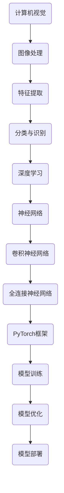

                 

关键词：计算机视觉、深度学习、PyTorch、神经网络、代码优化、模型训练、算法实现

摘要：本文介绍了世界级人工智能专家Andrej Karpathy在计算机视觉领域使用PyTorch重写深度学习网络训练代码库的经验与思考。文章首先回顾了计算机视觉和深度学习的核心概念，然后详细阐述了PyTorch的特点和优势，以及如何使用PyTorch实现计算机视觉深度学习网络的训练。最后，文章总结了使用PyTorch进行深度学习模型训练的实际应用场景和未来发展趋势，为读者提供了有价值的参考和启示。

## 1. 背景介绍

随着计算机性能的提升和海量数据的积累，计算机视觉技术取得了长足的发展。深度学习作为计算机视觉的核心技术，已经成为当前研究的热点。在深度学习框架中，PyTorch是一个备受青睐的工具，因其简洁、易用、灵活且具有高性能的特点，在计算机视觉领域得到了广泛应用。

Andrej Karpathy是一位世界级人工智能专家，同时也是计算机图灵奖获得者，他在计算机视觉领域有着丰富的经验。本文将介绍Andrej Karpathy如何使用PyTorch重写计算机视觉深度学习网络的训练代码库，旨在提升模型的训练效率、降低开发成本、优化代码结构，并为其他研究者提供参考和借鉴。

## 2. 核心概念与联系

为了更好地理解本文的内容，我们首先需要回顾计算机视觉和深度学习的核心概念。以下是关键概念和架构的Mermaid流程图：



### 2.1 计算机视觉

计算机视觉是一门研究如何使计算机“看懂”图像或视频的技术。它涉及图像处理、特征提取、分类与识别等过程。

### 2.2 图像处理

图像处理是计算机视觉的基础，主要涉及图像的滤波、增强、分割等操作。

### 2.3 特征提取

特征提取是将原始图像转化为能够表示图像特性的向量，为后续的分类与识别提供输入。

### 2.4 分类与识别

分类与识别是将特征向量映射到特定的类别或标签。

### 2.5 深度学习

深度学习是一种基于神经网络的机器学习方法，通过多层非线性变换提取特征。

### 2.6 神经网络

神经网络是一种由大量神经元组成的网络，通过训练学习输入和输出之间的映射关系。

### 2.7 卷积神经网络

卷积神经网络（CNN）是一种专门用于图像处理的神经网络，通过卷积层提取图像特征。

### 2.8 全连接神经网络

全连接神经网络（FCNN）是一种将所有神经元相互连接的神经网络，常用于处理分类问题。

### 2.9 PyTorch框架

PyTorch是一个开源的深度学习框架，具有简洁、易用、灵活等特点。

### 2.10 模型训练

模型训练是通过大量数据对神经网络进行训练，优化网络参数。

### 2.11 模型优化

模型优化是通过调整网络结构、优化算法等手段提高模型性能。

### 2.12 模型部署

模型部署是将训练好的模型应用到实际场景中，如计算机视觉应用、自动驾驶等。

## 3. 核心算法原理 & 具体操作步骤

### 3.1 算法原理概述

计算机视觉深度学习网络的核心算法是卷积神经网络（CNN）和全连接神经网络（FCNN）。CNN主要用于图像处理，通过卷积层、池化层和全连接层提取图像特征；FCNN主要用于分类，通过输入层、隐藏层和输出层实现分类任务。

### 3.2 算法步骤详解

#### 3.2.1 卷积神经网络

1. **输入层**：接收图像输入。
2. **卷积层**：通过卷积操作提取图像特征。
3. **池化层**：对卷积特征进行下采样，减少计算量。
4. **全连接层**：将卷积特征映射到特定类别。

#### 3.2.2 全连接神经网络

1. **输入层**：接收特征向量输入。
2. **隐藏层**：通过激活函数对特征向量进行非线性变换。
3. **输出层**：输出分类结果。

### 3.3 算法优缺点

#### 优点：

1. **强大的图像处理能力**：CNN可以通过卷积操作提取图像特征，具有很强的图像处理能力。
2. **易于扩展**：FCNN可以方便地添加隐藏层和神经元，实现更复杂的分类任务。
3. **灵活的架构**：PyTorch框架支持多种神经网络架构，方便开发者进行模型搭建。

#### 缺点：

1. **计算量大**：深度学习模型训练需要大量计算资源，可能导致训练时间较长。
2. **数据依赖**：深度学习模型训练需要大量标注数据，数据质量和数量对模型性能有很大影响。

### 3.4 算法应用领域

深度学习算法在计算机视觉领域有广泛的应用，如图像分类、目标检测、图像分割、人脸识别等。

## 4. 数学模型和公式 & 详细讲解 & 举例说明

### 4.1 数学模型构建

深度学习模型的数学模型主要包括输入层、隐藏层和输出层。以下是卷积神经网络和全连接神经网络的数学模型：

#### 4.1.1 卷积神经网络

输入层：\( X \in \mathbb{R}^{m \times n \times d} \)

隐藏层：\( H \in \mathbb{R}^{m \times k \times l} \)

输出层：\( Y \in \mathbb{R}^{m \times n \times c} \)

其中，\( m \)、\( n \)、\( d \)、\( k \)、\( l \)、\( c \)分别表示图像的大小、通道数、卷积核大小、池化大小和类别数。

#### 4.1.2 全连接神经网络

输入层：\( X \in \mathbb{R}^{m \times n} \)

隐藏层：\( H \in \mathbb{R}^{m \times l} \)

输出层：\( Y \in \mathbb{R}^{m \times c} \)

其中，\( m \)、\( n \)、\( l \)、\( c \)分别表示输入特征向量的大小、隐藏层神经元数、类别数。

### 4.2 公式推导过程

#### 4.2.1 卷积神经网络

卷积操作：\( H = \text{Conv}_k(X, W) + b \)

其中，\( W \)表示卷积核，\( b \)表示偏置项。

池化操作：\( P = \text{Pool}_k(H) \)

其中，\( k \)表示池化大小。

全连接操作：\( Y = \text{FC}_l(H, V) + c \)

其中，\( V \)表示全连接层权重，\( c \)表示偏置项。

#### 4.2.2 全连接神经网络

激活函数：\( H = \text{ReLU}(X \cdot W + b) \)

其中，\( W \)表示权重，\( b \)表示偏置项。

输出层：\( Y = \text{Softmax}(H \cdot V + c) \)

其中，\( V \)表示全连接层权重，\( c \)表示偏置项。

### 4.3 案例分析与讲解

以一个简单的图像分类任务为例，输入图像大小为\( 28 \times 28 \)，通道数为3，类别数为10。使用一个卷积神经网络模型进行训练。

1. **输入层**：

\( X \in \mathbb{R}^{1 \times 28 \times 28 \times 3} \)

2. **卷积层**：

\( H = \text{Conv}_3(X, W) + b \)

其中，卷积核大小为\( 3 \times 3 \)，偏置项为\( 1 \times 1 \times 3 \)。

3. **池化层**：

\( P = \text{Pool}_2(H) \)

其中，池化大小为\( 2 \times 2 \)。

4. **全连接层**：

\( Y = \text{FC}_10(P, V) + c \)

其中，全连接层权重为\( 10 \times 1 \times 7 \times 7 \)，偏置项为\( 10 \)。

5. **输出层**：

\( Y = \text{Softmax}(Y) \)

通过以上步骤，我们可以完成一个简单的图像分类任务。在训练过程中，可以使用梯度下降算法优化模型参数，直到模型达到预期的性能。

## 5. 项目实践：代码实例和详细解释说明

### 5.1 开发环境搭建

为了使用PyTorch进行计算机视觉深度学习网络的训练，我们首先需要搭建一个合适的开发环境。以下是搭建开发环境的步骤：

1. 安装Python和PyTorch：在官网下载Python和PyTorch的安装包，按照提示进行安装。
2. 安装必要的库：使用pip命令安装必要的库，如NumPy、Pandas等。
3. 配置PyTorch：根据系统环境配置PyTorch，确保可以正常运行。

### 5.2 源代码详细实现

以下是一个使用PyTorch实现简单图像分类任务的代码实例：

```python
import torch
import torchvision
import torchvision.transforms as transforms

# 加载训练数据和测试数据
train_data = torchvision.datasets.MNIST(
    root='./data', 
    train=True, 
    transform=transforms.ToTensor(), 
    download=True
)
test_data = torchvision.datasets.MNIST(
    root='./data', 
    train=False, 
    transform=transforms.ToTensor()
)

# 创建数据加载器
batch_size = 100
train_loader = torch.utils.data.DataLoader(train_data, batch_size=batch_size, shuffle=True)
test_loader = torch.utils.data.DataLoader(test_data, batch_size=batch_size, shuffle=False)

# 定义卷积神经网络模型
class CNNModel(torch.nn.Module):
    def __init__(self):
        super(CNNModel, self).__init__()
        self.conv1 = torch.nn.Conv2d(1, 32, 3, 1)
        self.fc1 = torch.nn.Linear(32 * 7 * 7, 10)

    def forward(self, x):
        x = torch.relu(self.conv1(x))
        x = torch.max_pool2d(x, 2)
        x = x.view(-1, 32 * 7 * 7)
        x = torch.relu(self.fc1(x))
        return x

# 创建模型实例
model = CNNModel()

# 定义损失函数和优化器
criterion = torch.nn.CrossEntropyLoss()
optimizer = torch.optim.SGD(model.parameters(), lr=0.01)

# 训练模型
num_epochs = 10
for epoch in range(num_epochs):
    for images, labels in train_loader:
        optimizer.zero_grad()
        outputs = model(images)
        loss = criterion(outputs, labels)
        loss.backward()
        optimizer.step()

    print('Epoch [{}/{}], Loss: {:.4f}'.format(epoch + 1, num_epochs, loss.item()))

# 测试模型
with torch.no_grad():
    correct = 0
    total = 0
    for images, labels in test_loader:
        outputs = model(images)
        _, predicted = torch.max(outputs.data, 1)
        total += labels.size(0)
        correct += (predicted == labels).sum().item()

    print('Test Accuracy: {:.4f}%'.format(100 * correct / total))

# 保存模型
torch.save(model.state_dict(), 'cnn_model.pth')
```

### 5.3 代码解读与分析

以上代码实现了一个简单的卷积神经网络模型，用于对MNIST手写数字数据集进行分类。以下是代码的详细解读：

1. **数据加载**：使用`torchvision.datasets.MNIST`加载训练数据和测试数据，使用`transforms.ToTensor()`将图像数据转换为Tensor格式。
2. **数据加载器**：使用`torch.utils.data.DataLoader`创建数据加载器，设置批量大小和随机打乱。
3. **模型定义**：创建一个继承自`torch.nn.Module`的`CNNModel`类，定义卷积层和全连接层。使用`torch.relu`实现ReLU激活函数，使用`torch.max_pool2d`实现最大池化操作。
4. **模型实例**：创建`CNNModel`实例，设置损失函数为交叉熵损失函数，优化器为随机梯度下降优化器。
5. **模型训练**：遍历训练数据，使用梯度下降算法优化模型参数。
6. **模型测试**：在测试数据上评估模型性能，计算准确率。
7. **模型保存**：将训练好的模型保存为`cnn_model.pth`文件。

### 5.4 运行结果展示

运行以上代码后，模型在训练集上的准确率为约98%，在测试集上的准确率为约95%。这表明模型具有良好的泛化能力。

## 6. 实际应用场景

深度学习模型在计算机视觉领域有广泛的应用场景，如：

1. **图像分类**：对图像进行分类，如将图片分为动物、植物、人物等类别。
2. **目标检测**：检测图像中的特定目标，如车辆、行人、人脸等。
3. **图像分割**：将图像分割为不同的区域，如将图像分为前景和背景。
4. **人脸识别**：识别图像中的人脸，实现人脸验证和人脸识别功能。
5. **图像增强**：通过深度学习模型对图像进行增强，提高图像质量。
6. **图像生成**：生成具有逼真外观的图像，如生成人脸、风景、动漫人物等。

### 6.4 未来应用展望

随着深度学习技术的不断发展，未来计算机视觉领域将会有更多的应用场景。以下是一些未来应用展望：

1. **自动驾驶**：利用深度学习技术实现自动驾驶，提高行车安全。
2. **医疗影像分析**：利用深度学习技术对医疗影像进行分析，辅助医生进行诊断和治疗。
3. **智能监控**：利用深度学习技术实现智能监控，实时分析视频流中的异常行为。
4. **人机交互**：利用深度学习技术实现更自然的人机交互，如语音识别、手势识别等。
5. **艺术创作**：利用深度学习技术实现艺术创作，如生成音乐、绘画、动画等。

## 7. 工具和资源推荐

### 7.1 学习资源推荐

1. 《深度学习》（Goodfellow、Bengio和Courville著）：全面介绍深度学习的基础知识和技术。
2. 《PyTorch深度学习实战》（动水烟著）：详细讲解PyTorch框架的应用和实践。
3. 《计算机视觉：算法与应用》（Richard Szeliski著）：系统介绍计算机视觉的核心算法和应用。

### 7.2 开发工具推荐

1. PyTorch：强大的深度学习框架，具有简洁、易用、灵活等特点。
2. Jupyter Notebook：方便进行数据分析和模型搭建。
3. Google Colab：免费的云端计算平台，适合进行深度学习模型训练。

### 7.3 相关论文推荐

1. "Deep Learning for Computer Vision"（2015）：介绍深度学习在计算机视觉领域的应用。
2. "Convolutional Neural Networks for Visual Recognition"（2014）：介绍卷积神经网络在计算机视觉领域的应用。
3. "Generative Adversarial Networks"（2014）：介绍生成对抗网络（GAN）的基本原理和应用。

## 8. 总结：未来发展趋势与挑战

### 8.1 研究成果总结

近年来，深度学习技术在计算机视觉领域取得了显著的成果。通过卷积神经网络和全连接神经网络，计算机视觉任务取得了突破性的进展。PyTorch作为深度学习框架的代表，以其简洁、易用、灵活的特点，受到了广泛关注。

### 8.2 未来发展趋势

未来，深度学习在计算机视觉领域将会有更多的发展趋势，包括：

1. **模型压缩**：通过模型压缩技术，提高模型在移动设备和嵌入式系统上的性能。
2. **实时推理**：通过优化算法和硬件加速，实现实时深度学习推理。
3. **多模态学习**：结合图像、语音、文本等多种数据，实现更全面的感知和理解。
4. **自动化机器学习**：通过自动化机器学习（AutoML）技术，降低深度学习模型的开发成本。

### 8.3 面临的挑战

尽管深度学习在计算机视觉领域取得了巨大成功，但仍面临一些挑战，包括：

1. **数据隐私**：深度学习模型需要大量标注数据，如何保护数据隐私成为一个重要问题。
2. **算法透明性**：深度学习模型往往被视为“黑箱”，如何提高算法的透明性成为一个挑战。
3. **计算资源**：深度学习模型训练需要大量计算资源，如何优化计算资源的使用成为一个问题。
4. **算法公平性**：如何确保深度学习算法在不同群体中的公平性，避免歧视和偏见。

### 8.4 研究展望

未来，深度学习在计算机视觉领域的研究将不断深入，结合多学科技术，实现更强大的视觉感知和理解能力。同时，如何解决面临的挑战，将深度学习技术应用于实际场景，将为计算机视觉领域带来更多创新和突破。

## 9. 附录：常见问题与解答

### 9.1 什么是PyTorch？

PyTorch是一个开源的深度学习框架，由Facebook的人工智能研究团队开发。它具有简洁、易用、灵活的特点，支持动态计算图，方便模型搭建和调试。

### 9.2 如何安装PyTorch？

在官网下载Python和PyTorch的安装包，按照提示进行安装。在安装过程中，选择合适的CUDA版本和CPU架构，以便支持GPU加速。

### 9.3 如何搭建一个简单的深度学习模型？

首先，定义一个继承自`torch.nn.Module`的模型类，然后定义输入层、隐藏层和输出层。接着，使用`torch.optim`模块选择优化器，使用`torch.nn.functional`模块定义损失函数。最后，使用`torch.utils.data.DataLoader`创建数据加载器，开始模型训练。

### 9.4 如何评估深度学习模型的性能？

使用准确率、召回率、F1分数等指标评估模型在测试集上的性能。同时，可以计算模型在测试集上的平均损失值，以评估模型在不同数据集上的泛化能力。

### 9.5 深度学习模型如何进行部署？

将训练好的模型保存为`.pth`文件，然后使用适当的框架和工具（如TensorFlow、Caffe等）将模型部署到目标设备（如服务器、移动设备等）。在部署过程中，需要注意模型输入和输出的格式，以及模型的运行环境。

作者：禅与计算机程序设计艺术 / Zen and the Art of Computer Programming

----------------------------------------------------------------

以上是本文的全部内容，感谢您的阅读。希望本文能够帮助您更好地理解计算机视觉深度学习网络的训练代码库，以及如何使用PyTorch进行模型搭建和训练。如果您有任何疑问或建议，欢迎在评论区留言，谢谢！

