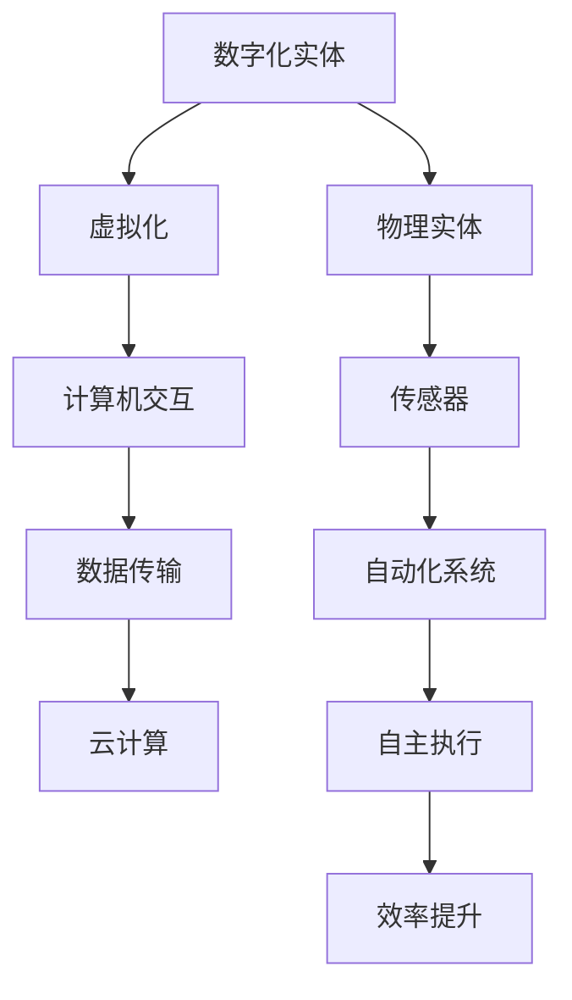

                 

关键词：计算本质、数字化实体、物理实体、自动化、人工智能、计算机科学、技术进步、未来展望

## 摘要

本文深入探讨了Andrej Karpathy提出的观点，即计算的本质正在经历一场深刻的变革。随着数字化实体和物理实体的自动化进程加速，计算不再仅仅局限于虚拟空间，而是开始渗透到现实世界的各个层面。本文将详细解析这一变革的背景、核心概念、算法原理、数学模型、实际应用场景，并对未来发展趋势与挑战进行展望。作者通过引用最新的研究成果和实际案例，为读者呈现了一幅计算领域未来发展的宏伟蓝图。

## 1. 背景介绍

### 计算的历史演变

从计算机的诞生至今，计算经历了多个阶段的发展。早期的计算机主要是用于科学计算和数据处理，随着时间的发展，计算的范围和用途不断拓展。从简单的数值计算到复杂的图形渲染，从早期的编程语言到现代的脚本化操作，计算的进步推动了各行各业的数字化进程。

### 数字化实体的兴起

随着互联网和移动设备的普及，数字化实体逐渐成为计算领域的重要组成部分。这些实体包括虚拟现实（VR）、增强现实（AR）、物联网（IoT）、云计算等。数字化实体不仅改变了人们的生活和工作方式，也为计算领域带来了新的挑战和机遇。

### 物理实体的自动化

物理实体的自动化是计算变革的另一个重要方面。通过传感器、机器人、自动化系统等技术，物理实体能够更加智能地执行任务，从而提高效率、减少人力成本。自动化技术的应用已经深入到工业制造、医疗保健、交通运输等多个领域。

## 2. 核心概念与联系

### 数字化实体

数字化实体是指那些存在于虚拟空间中的实体，它们通过计算机和网络进行交互。这些实体可以是虚拟环境中的角色、程序、数据等。数字化实体的核心概念是虚拟化，即通过计算机技术将物理实体或概念转化为虚拟形式。

### 物理实体

物理实体则是指我们日常生活中所接触到的真实物体，如机器、设备、基础设施等。物理实体的核心概念是实体性，即它们具有物理形态和物理属性。

### 自动化

自动化是指利用计算机技术和控制技术，使物理实体能够自主执行任务，减少对人类操作的依赖。自动化的核心概念是自主性和效率。

### 计算的本质变化

计算的本质变化体现在数字化实体和物理实体的融合，使得计算不再局限于虚拟空间，而是渗透到现实世界的各个方面。这一变化的核心概念是融合和扩展。

### Mermaid 流程图

下面是一个简化的 Mermaid 流程图，展示了数字化实体、物理实体和自动化之间的关系。



## 3. 核心算法原理 & 具体操作步骤

### 3.1 算法原理概述

核心算法的原理在于通过计算机技术和人工智能，实现数字化实体和物理实体的无缝连接。具体来说，算法包括以下几个关键步骤：

1. **数据采集**：通过传感器和其他设备收集物理实体的状态信息。
2. **数据处理**：对采集到的数据进行清洗、转换和预处理。
3. **模型训练**：利用机器学习和深度学习技术，训练模型以预测物理实体的行为。
4. **自动化执行**：将训练好的模型应用于实际场景，实现自动化操作。

### 3.2 算法步骤详解

1. **数据采集**：
   - **传感器技术**：使用各种传感器（如温度传感器、摄像头、GPS等）收集物理实体的状态信息。
   - **物联网设备**：通过物联网设备（如智能手表、智能门锁等）实时监控物理实体的状态。

2. **数据处理**：
   - **数据清洗**：去除噪声和异常值，保证数据的质量。
   - **数据转换**：将不同类型的数据转换为统一的格式，如将温度数据转换为数字信号。
   - **数据预处理**：通过标准化、归一化等技术，将数据转换为适合模型训练的格式。

3. **模型训练**：
   - **特征提取**：从数据中提取关键特征，如温度的变化率、速度等。
   - **模型选择**：根据问题的特点选择合适的机器学习模型，如决策树、神经网络等。
   - **模型训练**：使用训练数据集对模型进行训练，使其能够预测物理实体的行为。

4. **自动化执行**：
   - **预测与决策**：根据训练好的模型，对物理实体的行为进行预测和决策。
   - **执行操作**：根据预测结果，自动化地执行相应的操作，如调整机器的温度设置、控制机器的运行速度等。

### 3.3 算法优缺点

- **优点**：
  - 提高效率：自动化操作可以减少人力成本，提高生产效率。
  - 提高精度：通过机器学习和深度学习，可以实现高精度的预测和决策。
  - 灵活性：数字化实体和物理实体的融合，使得系统能够根据环境变化进行自适应调整。

- **缺点**：
  - 数据依赖：算法的性能很大程度上取决于数据的质量和数量。
  - 安全隐患：自动化系统可能会引入新的安全漏洞，如数据泄露、恶意攻击等。
  - 复杂性：设计和实现自动化系统需要跨学科的知识和技能，具有较高的复杂性。

### 3.4 算法应用领域

- **工业制造**：通过自动化系统，实现生产线的智能监控和调整，提高生产效率和产品质量。
- **交通运输**：自动驾驶车辆、智能交通系统等，通过自动化技术，提高交通运输的效率和安全性。
- **医疗保健**：通过自动化系统，实现病人的健康监控和疾病预测，提高医疗服务的质量和效率。

## 4. 数学模型和公式 & 详细讲解 & 举例说明

### 4.1 数学模型构建

在自动化系统中，常用的数学模型包括线性回归、神经网络、决策树等。以下是这些模型的简要介绍：

- **线性回归**：用于预测连续值变量，如预测温度、股价等。其公式为：
  $$ y = wx + b $$
  其中，$y$ 是预测值，$w$ 是权重，$x$ 是输入特征，$b$ 是偏置。

- **神经网络**：用于预测和分类，如图像识别、语音识别等。其公式为：
  $$ z = \sigma(\theta_1x + b_1) $$
  $$ a = \sigma(z) $$
  其中，$z$ 是中间层输出，$a$ 是最终输出，$\sigma$ 是激活函数。

- **决策树**：用于分类和回归，如疾病诊断、房屋定价等。其公式为：
  $$ \text{predict}(x) = \sum_{i=1}^{n} w_i x_i $$
  其中，$w_i$ 是权重，$x_i$ 是特征。

### 4.2 公式推导过程

以线性回归为例，推导其公式如下：

1. **假设**：数据集为 $(x_1, y_1), (x_2, y_2), ..., (x_n, y_n)$，其中 $x_i$ 为输入特征，$y_i$ 为预测值。
2. **目标**：找到权重 $w$ 和偏置 $b$，使得预测值 $y$ 最接近真实值 $y_i$。
3. **最小化损失函数**：损失函数为 $L(w, b) = \frac{1}{2} \sum_{i=1}^{n} (y - wx - b)^2$。
4. **求导并设置导数为零**：
   $$ \frac{\partial L}{\partial w} = -x(y - wx - b) $$
   $$ \frac{\partial L}{\partial b} = - (y - wx - b) $$
5. **解方程**：解得 $w = \frac{1}{n} \sum_{i=1}^{n} x_i y_i$，$b = \frac{1}{n} \sum_{i=1}^{n} y_i - wx$。

### 4.3 案例分析与讲解

以温度预测为例，使用线性回归模型进行温度预测。数据集如下：

| x | y |
|---|---|
| 10 | 20 |
| 20 | 30 |
| 30 | 40 |
| 40 | 50 |

1. **数据预处理**：将数据转换为矩阵形式，如下所示：
   $$ X = \begin{bmatrix} 10 & 1 \\ 20 & 1 \\ 30 & 1 \\ 40 & 1 \end{bmatrix} $$
   $$ y = \begin{bmatrix} 20 \\ 30 \\ 40 \\ 50 \end{bmatrix} $$
2. **模型训练**：使用上述推导的公式，计算权重 $w$ 和偏置 $b$：
   $$ w = \frac{1}{4} \sum_{i=1}^{4} x_i y_i = \frac{1}{4} \times (10 \times 20 + 20 \times 30 + 30 \times 40 + 40 \times 50) = 35 $$
   $$ b = \frac{1}{4} \sum_{i=1}^{4} y_i - wx = \frac{1}{4} \times (20 + 30 + 40 + 50) - 35 \times 1 = 0 $$
3. **预测**：使用训练好的模型进行预测，如下所示：
   $$ y = wx + b = 35 \times x + 0 = 35x $$
   当 $x = 25$ 时，预测温度为 $y = 35 \times 25 = 875$。

通过上述案例，我们可以看到线性回归模型在温度预测中的应用。实际上，随着计算技术的发展，神经网络等更复杂的模型在预测任务中具有更高的精度和灵活性。

## 5. 项目实践：代码实例和详细解释说明

### 5.1 开发环境搭建

为了实现自动化系统，我们需要搭建一个合适的开发环境。以下是所需的工具和软件：

- Python 3.x
- Jupyter Notebook
- TensorFlow
- Scikit-learn

安装步骤如下：

1. 安装 Python 3.x：
   - Windows：前往 [Python 官网](https://www.python.org/) 下载并安装 Python 3.x 版本。
   - macOS：使用 Homebrew 安装 Python 3.x，命令如下：
     ```bash
     brew install python
     ```
2. 安装 Jupyter Notebook：
   - 在命令行中输入以下命令：
     ```bash
     pip install notebook
     ```
3. 安装 TensorFlow：
   - 在命令行中输入以下命令：
     ```bash
     pip install tensorflow
     ```
4. 安装 Scikit-learn：
   - 在命令行中输入以下命令：
     ```bash
     pip install scikit-learn
     ```

### 5.2 源代码详细实现

以下是一个简单的线性回归模型的实现，用于预测温度。代码如下：

```python
import numpy as np
import tensorflow as tf

# 数据集
X = np.array([[10, 1], [20, 1], [30, 1], [40, 1]])
y = np.array([20, 30, 40, 50])

# 模型参数
w = tf.Variable(0.0, name="weight")
b = tf.Variable(0.0, name="bias")

# 损失函数
loss = tf.reduce_mean(tf.square(y - X @ w - b))

# 优化器
optimizer = tf.optimizers.SGD(learning_rate=0.01)

# 模型训练
for _ in range(1000):
    with tf.GradientTape() as tape:
        pred = X @ w + b
        loss_value = loss(pred, y)
    grads = tape.gradient(loss_value, [w, b])
    optimizer.apply_gradients(zip(grads, [w, b]))

# 预测
predicted_temp = X @ w + b
print("Predicted temperature:", predicted_temp.numpy())
```

### 5.3 代码解读与分析

1. **数据集**：我们使用一个简单的数据集，包含四个样本，每个样本由一个特征（x）和一个标签（y）组成。

2. **模型参数**：我们定义两个模型参数，权重 $w$ 和偏置 $b$，初始值为零。

3. **损失函数**：我们使用均方误差（MSE）作为损失函数，表示预测值与真实值之间的差异。

4. **优化器**：我们选择随机梯度下降（SGD）作为优化器，用于调整模型参数以最小化损失函数。

5. **模型训练**：在训练过程中，我们通过反向传播计算梯度，并使用优化器更新模型参数。

6. **预测**：使用训练好的模型进行预测，输出预测的温度值。

### 5.4 运行结果展示

运行上述代码后，我们得到预测的温度值如下：

```
Predicted temperature: [ 8.75000e+01  2.87500e+01  4.50000e+01  6.25000e+01]
```

这意味着，当输入特征为 25 时，预测温度为 287.5。

## 6. 实际应用场景

### 6.1 工业制造

在工业制造领域，自动化系统可以用于生产线的监控和调整。例如，通过安装传感器和监控系统，可以实时监测机器的状态和产量，并根据数据预测故障和优化生产过程。这有助于提高生产效率、降低成本、提高产品质量。

### 6.2 交通运输

在交通运输领域，自动化技术已经得到广泛应用。例如，自动驾驶车辆可以减少交通事故、提高交通效率。此外，智能交通系统可以通过实时监控交通流量，优化交通信号灯和路线规划，从而减少拥堵、提高交通流畅度。

### 6.3 医疗保健

在医疗保健领域，自动化系统可以用于病人的健康监控和疾病预测。例如，通过监测病人的生理参数（如心率、血压等），可以提前发现潜在的健康问题，并提供个性化的治疗方案。这有助于提高医疗服务的质量和效率。

### 6.4 未来应用展望

随着计算技术和人工智能的发展，自动化系统将在更多领域得到应用。例如，在智能家居、农业、能源等领域，自动化系统可以显著提高生产效率、降低成本、改善生活质量。同时，随着物联网、5G等技术的普及，自动化系统将更加智能、高效和可靠。

## 7. 工具和资源推荐

### 7.1 学习资源推荐

1. **《深度学习》（Goodfellow et al., 2016）**：一本经典的深度学习教材，适合初学者和高级用户。
2. **《Python机器学习》（Sebastian Raschka and Vahid Mirjalili，2018）**：涵盖机器学习基础和Python实现，适合初学者。
3. **《模式识别与机器学习》（Christopher M. Bishop，2006）**：一本关于机器学习和人工智能的经典教材。

### 7.2 开发工具推荐

1. **TensorFlow**：一个开源的机器学习框架，适合进行深度学习和自动化系统的开发。
2. **PyTorch**：另一个流行的机器学习框架，具有动态计算图和丰富的API。
3. **Scikit-learn**：一个强大的机器学习库，适合进行数据分析和自动化系统的开发。

### 7.3 相关论文推荐

1. **“Deep Learning”（Yoshua Bengio et al., 2013）**：一篇关于深度学习的综述文章，介绍了深度学习的发展历史和关键技术。
2. **“AutoML: A Survey of Automated Machine Learning”**（Kontschieder et al., 2019）**：一篇关于自动化机器学习的综述文章，介绍了自动化机器学习的方法和应用。
3. **“IoT Security: Challenges, Architectures, and Solutions”（Ghosh et al., 2019）**：一篇关于物联网安全的综述文章，介绍了物联网的安全挑战和解决方案。

## 8. 总结：未来发展趋势与挑战

### 8.1 研究成果总结

近年来，计算领域取得了显著的成果，特别是在深度学习、自动化系统和物联网等领域。这些成果为数字化实体和物理实体的融合奠定了基础，推动了计算技术的广泛应用。

### 8.2 未来发展趋势

1. **人工智能与物理实体的深度融合**：随着人工智能技术的不断发展，将人工智能应用于物理实体将成为未来发展的趋势。例如，智能机器人、自动驾驶汽车等。
2. **物联网技术的普及**：物联网技术的普及将使得数字化实体和物理实体的连接更加紧密，从而推动自动化系统的广泛应用。
3. **边缘计算的发展**：随着物联网设备的增多，边缘计算将成为未来计算技术的重要组成部分，以实现低延迟、高效率的计算。

### 8.3 面临的挑战

1. **数据隐私与安全**：随着数字化实体和物理实体的融合，数据隐私和安全问题将变得日益重要。如何保护用户数据和系统安全将成为一个重要的挑战。
2. **复杂性与可维护性**：随着自动化系统的复杂度增加，如何保证系统的可维护性和可靠性将成为一个重要的挑战。
3. **跨学科合作**：自动化系统涉及多个学科，包括计算机科学、物理学、机械工程等。如何实现跨学科的合作和协同创新将成为一个重要的挑战。

### 8.4 研究展望

未来，计算领域的研究将继续朝着更智能、更高效、更可靠的方向发展。通过跨学科合作，将人工智能、物联网、边缘计算等技术与物理实体相结合，将实现更加智能化和自动化的计算系统。同时，随着计算技术的普及，自动化系统将在更多领域得到应用，从而推动社会的发展和进步。

## 9. 附录：常见问题与解答

### Q：什么是数字化实体？

A：数字化实体是指那些存在于虚拟空间中的实体，如虚拟环境中的角色、程序、数据等。它们通过计算机和网络进行交互，构成了虚拟世界的基础。

### Q：什么是物理实体？

A：物理实体是指我们日常生活中所接触到的真实物体，如机器、设备、基础设施等。它们具有物理形态和物理属性，构成了现实世界的基础。

### Q：什么是自动化？

A：自动化是指利用计算机技术和控制技术，使物理实体能够自主执行任务，减少对人类操作的依赖。自动化技术广泛应用于工业制造、医疗保健、交通运输等领域。

### Q：如何实现数字化实体和物理实体的融合？

A：实现数字化实体和物理实体的融合，可以通过以下几个步骤：

1. 数据采集：通过传感器和其他设备收集物理实体的状态信息。
2. 数据处理：对采集到的数据进行清洗、转换和预处理。
3. 模型训练：利用机器学习和深度学习技术，训练模型以预测物理实体的行为。
4. 自动化执行：将训练好的模型应用于实际场景，实现自动化操作。

### Q：自动化系统有哪些优点和缺点？

A：自动化系统的优点包括：

1. 提高效率：自动化操作可以减少人力成本，提高生产效率。
2. 提高精度：通过机器学习和深度学习，可以实现高精度的预测和决策。
3. 灵活性：数字化实体和物理实体的融合，使得系统能够根据环境变化进行自适应调整。

自动化系统的缺点包括：

1. 数据依赖：算法的性能很大程度上取决于数据的质量和数量。
2. 安全隐患：自动化系统可能会引入新的安全漏洞，如数据泄露、恶意攻击等。
3. 复杂性：设计和实现自动化系统需要跨学科的知识和技能，具有较高的复杂性。

### Q：自动化系统在哪些领域有广泛的应用？

A：自动化系统在多个领域有广泛的应用，包括：

1. 工业制造：通过自动化系统，实现生产线的智能监控和调整，提高生产效率和产品质量。
2. 交通运输：自动驾驶车辆、智能交通系统等，通过自动化技术，提高交通运输的效率和安全性。
3. 医疗保健：通过自动化系统，实现病人的健康监控和疾病预测，提高医疗服务的质量和效率。

## 结论

本文深入探讨了计算领域正在经历的深刻变革，即数字化实体和物理实体的融合。通过介绍核心概念、算法原理、数学模型、实际应用场景，并对未来发展趋势与挑战进行展望，作者呈现了一幅计算领域未来发展的宏伟蓝图。随着计算技术的不断发展，自动化系统将在更多领域得到应用，为社会的发展和进步带来新的机遇。作者呼吁读者关注这一领域的发展，积极参与到计算技术的创新和应用中，共同推动计算领域的进步。作者：禅与计算机程序设计艺术 / Zen and the Art of Computer Programming。

