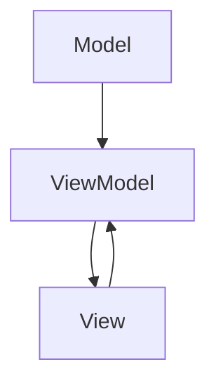

                 

关键词：Angular，框架，MVW，Google，前端开发，单页面应用，组件化，数据绑定，模块化

> 摘要：本文将带领读者深入了解Google推出的Angular框架，从背景介绍、核心概念、算法原理、数学模型、项目实践以及应用场景等方面，全面解析Angular框架的优势和实际应用。

## 1. 背景介绍

Angular框架是由Google开发的一款开源的前端JavaScript框架，它旨在帮助开发者构建动态的单页面应用（Single Page Application，SPA）。随着互联网的发展，用户对网页的交互体验要求越来越高，传统的网页开发方式已经无法满足这种需求。因此，单页面应用应运而生，它们通过动态更新网页内容，提供更加流畅的交互体验。

Angular框架正是在这样的背景下诞生的。它继承了Google在前端开发领域的丰富经验，结合了MVW（Model-View-ViewModel）的设计模式，提供了一种强大的解决方案，帮助开发者构建高效、可维护的前端应用。

## 2. 核心概念与联系

### 2.1. MVW设计模式

MVW（Model-View-ViewModel）是一种常用的设计模式，它将应用分为三个部分：Model（模型）、View（视图）和ViewModel（视图模型）。这种设计模式有助于实现代码的模块化和可维护性。

- **Model（模型）**：表示应用程序的数据状态，负责数据的管理和操作。
- **View（视图）**：表示应用程序的用户界面，负责展示数据。
- **ViewModel（视图模型）**：作为模型和视图之间的桥梁，负责处理用户交互和数据绑定。

### 2.2. Mermaid 流程图

下面是一个简单的Mermaid流程图，展示了MVW设计模式的基本流程。



## 3. 核心算法原理 & 具体操作步骤

### 3.1. 算法原理概述

Angular框架的核心算法是基于数据绑定的。数据绑定是一种自动同步数据源和视图的方法，它确保了模型和视图之间的实时同步。具体来说，Angular使用双向数据绑定，即模型和视图之间的变化可以互相通知，从而实现实时更新。

### 3.2. 算法步骤详解

#### 3.2.1. 数据绑定

数据绑定是Angular框架的核心功能之一。它的工作原理可以分为以下几个步骤：

1. **属性绑定**：将模型中的属性绑定到视图中的元素属性上，例如`{{name}}`将模型中的`name`属性绑定到元素的内联文本。
2. **事件绑定**：将模型中的方法绑定到视图中的事件上，例如`ng-click="submitForm()"`将`submitForm`方法绑定到按钮的点击事件。
3. **单向数据绑定**：Angular使用单向数据绑定，即模型到视图的数据传递是单向的，从模型到视图的更新是自动的，而从视图到模型的更新需要手动处理。

#### 3.2.2. 组件化

Angular框架采用了组件化的设计思想，将应用程序拆分为多个独立的、可复用的组件。组件化有助于提高代码的可维护性和可测试性。组件化的基本步骤包括：

1. **创建组件**：使用Angular CLI工具创建新的组件。
2. **定义组件结构**：使用HTML和CSS定义组件的界面。
3. **实现组件逻辑**：使用TypeScript编写组件的控制器代码。

### 3.3. 算法优缺点

#### 3.3.1. 优点

- **高效的数据绑定**：Angular的双向数据绑定大大提高了开发效率，减少了手动同步数据的工作量。
- **组件化**：组件化设计提高了代码的可维护性和可复用性。
- **强大的路由系统**：Angular提供了强大的路由系统，支持单页面应用的路由管理和页面切换。

#### 3.3.2. 缺点

- **学习曲线**：Angular的复杂性和大量的API使得学习曲线相对较陡峭。
- **性能问题**：Angular的模板编译和双向数据绑定在特定情况下可能会对性能产生负面影响。

### 3.4. 算法应用领域

Angular框架广泛应用于各种单页面应用的开发，特别是在需要高交互性和复杂前端逻辑的应用中，如电子商务网站、社交媒体平台、在线办公系统等。

## 4. 数学模型和公式 & 详细讲解 & 举例说明

### 4.1. 数学模型构建

在Angular框架中，数据绑定可以通过以下数学模型来描述：

\[ \text{模型} \rightarrow \text{视图} \]

\[ \text{视图} \rightarrow \text{模型} \]

### 4.2. 公式推导过程

数据绑定的推导过程可以分为以下几步：

1. **属性绑定**：使用表达式语法`{{expression}}`将模型中的属性绑定到视图中的元素属性上。
2. **事件绑定**：使用事件监听器将模型中的方法绑定到视图中的事件上。
3. **单向数据绑定**：使用单向数据绑定将模型中的属性更新传递到视图。

### 4.3. 案例分析与讲解

假设有一个简单的用户注册表单，模型中有姓名和邮箱两个字段，视图中有输入框和按钮。以下是数据绑定过程：

1. **属性绑定**：
   - 模型中的`name`属性绑定到视图中的输入框的`value`属性：
     ```html
     <input type="text" [value]="name">
     ```
   - 模型中的`email`属性绑定到视图中的输入框的`value`属性：
     ```html
     <input type="email" [value]="email">
     ```

2. **事件绑定**：
   - 视图中的按钮点击事件绑定到模型中的`submitForm`方法：
     ```html
     <button (click)="submitForm()">注册</button>
     ```

3. **单向数据绑定**：
   - 视图中的输入框的值更新时，会自动更新模型中的属性：
     ```typescript
     name = this.nameInput.nativeElement.value;
     email = this.emailInput.nativeElement.value;
     ```

## 5. 项目实践：代码实例和详细解释说明

### 5.1. 开发环境搭建

要开始使用Angular框架，首先需要搭建开发环境。以下是搭建Angular开发环境的步骤：

1. 安装Node.js：从[Node.js官网](https://nodejs.org/)下载并安装Node.js。
2. 安装Angular CLI：通过以下命令安装Angular CLI：
   ```bash
   npm install -g @angular/cli
   ```
3. 创建新项目：使用Angular CLI创建一个新的Angular项目：
   ```bash
   ng new my-angular-app
   ```
4. 进入项目目录：
   ```bash
   cd my-angular-app
   ```

### 5.2. 源代码详细实现

以下是一个简单的用户注册表单的源代码示例：

```html
<!-- app.component.html -->
<div>
  <label for="name">姓名：</label>
  <input type="text" [ngModel]="name" placeholder="请输入姓名">
</div>
<div>
  <label for="email">邮箱：</label>
  <input type="email" [ngModel]="email" placeholder="请输入邮箱">
</div>
<div>
  <button (click)="submitForm()">注册</button>
</div>
```

```typescript
// app.component.ts
import { Component } from '@angular/core';

@Component({
  selector: 'app-root',
  templateUrl: './app.component.html',
  styleUrls: ['./app.component.css']
})
export class AppComponent {
  name = '';
  email = '';

  submitForm() {
    console.log('注册成功：姓名：', this.name, '邮箱：', this.email);
  }
}
```

### 5.3. 代码解读与分析

- **HTML模板**：定义了用户注册表单的界面，使用了属性绑定和事件绑定语法。
- **TypeScript代码**：定义了组件的控制器，包含了数据模型和方法。

### 5.4. 运行结果展示

在开发工具中启动项目，浏览器将显示用户注册表单。用户输入姓名和邮箱后，点击注册按钮，会在控制台中输出注册成功的信息。

```bash
$ ng serve
```

## 6. 实际应用场景

### 6.1. 电子商务平台

电子商务平台需要处理大量的用户数据和商品信息，Angular框架的双向数据绑定和组件化设计使其非常适合构建这样的应用。

### 6.2. 社交媒体平台

社交媒体平台需要提供丰富的用户交互和实时数据更新功能，Angular框架的强大路由系统和数据绑定机制可以很好地支持这些需求。

### 6.3. 在线办公系统

在线办公系统需要实现复杂的协同工作和数据共享功能，Angular框架的模块化和组件化设计有助于提高系统的可维护性和可扩展性。

## 7. 工具和资源推荐

### 7.1. 学习资源推荐

- **Angular官方文档**：[Angular官方文档](https://angular.io/)是学习Angular的最佳资源。
- **《Angular 开发实战》**：这是一本非常适合初学者和实践者的Angular入门书籍。
- **Angular学习指南**：[Angular学习指南](https://www.angular-tutorial.com/)提供了大量的Angular教程和实践示例。

### 7.2. 开发工具推荐

- **Visual Studio Code**：一款功能强大的代码编辑器，支持Angular开发。
- **Angular CLI**：用于创建、构建和测试Angular项目的命令行工具。
- **Chrome DevTools**：用于调试Angular应用的浏览器开发工具。

### 7.3. 相关论文推荐

- **《Angular 2+ 框架设计模式》**：介绍了Angular框架的设计模式和最佳实践。
- **《前端框架对比：Angular、React、Vue》**：对主流前端框架进行了详细对比。

## 8. 总结：未来发展趋势与挑战

### 8.1. 研究成果总结

Angular框架作为Google推出的前端框架，凭借其强大的功能和优秀的性能，已经成为前端开发领域的热门选择。其在数据绑定、组件化和路由管理等方面具有明显的优势。

### 8.2. 未来发展趋势

- **性能优化**：随着应用的复杂度和用户需求的不断增加，Angular的性能优化将成为未来发展的重点。
- **社区支持**：Angular的社区支持已经非常成熟，未来将继续加强，提供更多的资源和工具。
- **跨平台开发**：Angular已经在移动端和桌面端有所布局，未来将会有更多的跨平台开发机会。

### 8.3. 面临的挑战

- **学习成本**：Angular的学习成本相对较高，对于初学者来说可能需要一定的时间来适应。
- **性能瓶颈**：在某些复杂的应用场景中，Angular的性能可能会受到挑战。

### 8.4. 研究展望

- **性能优化**：通过改进编译过程、减少内存占用和提高渲染性能，Angular有望在未来进一步提高性能。
- **开发者体验**：简化开发流程、提供更多开箱即用的功能和更好的工具支持，将有助于提高开发者的工作效率。

## 9. 附录：常见问题与解答

### 9.1. Angular与React/Vue的区别

**Q：Angular与React/Vue有什么区别？**

**A：**Angular、React和Vue都是现代前端开发框架，但它们在实现方式、使用场景和社区支持方面有所不同。Angular是TypeScript驱动的框架，具有强大的功能和完善的生态体系，适合大型和复杂的项目。React是JavaScript驱动的库，具有灵活性和高效性，适合各种规模的项目。Vue是JavaScript驱动的框架，具有简洁易用的特点，适合中小型项目。

### 9.2. 如何优化Angular性能

**Q：如何优化Angular性能？**

**A：**优化Angular性能可以从多个方面入手：

- **减少模板复杂性**：简化模板结构，避免过多的嵌套和重复的代码。
- **减少组件数量**：减少组件的数量和复杂性，提高组件的可复用性。
- **使用异步数据绑定**：异步数据绑定可以减少视图的渲染次数，提高性能。
- **使用服务**：使用服务来管理数据和逻辑，避免在组件中直接处理。
- **使用CDN**：将Angular库和依赖包通过CDN引入，提高加载速度。

## 作者署名

作者：禅与计算机程序设计艺术 / Zen and the Art of Computer Programming

----------------------------------------------------------------

以上就是本文的完整内容，希望对您深入了解Angular框架有所帮助。如果您有任何问题或建议，欢迎在评论区留言。感谢阅读！<|user|>

