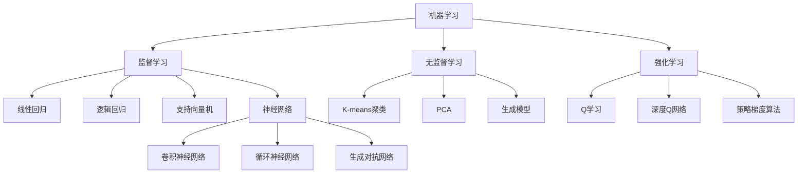

                 

关键词：人工智能、机器学习、深度学习、神经网络、智能算法、应用场景、未来发展

摘要：本文将深入探讨人工智能的核心概念、发展历程、主要算法以及其在各个领域的应用。通过详细的数学模型和公式推导，我们将理解人工智能背后的科学原理，并通过实际代码实例展示其在实际项目中的应用。此外，本文还将展望人工智能的未来发展趋势和面临的挑战，为读者提供一个全面的人工智能技术综述。

## 1. 背景介绍

人工智能（Artificial Intelligence，简称AI）是指通过计算机模拟人类智能的学科，旨在使机器能够执行通常需要人类智能才能完成的任务，如视觉识别、语言理解、决策制定等。人工智能的研究可以追溯到20世纪50年代，当时计算机科学刚刚兴起。最初的AI研究主要集中在符号主义方法上，通过符号推理和逻辑编程来模拟人类智能。

随着时间的推移，AI经历了多个发展阶段。20世纪80年代，基于知识的系统（Knowledge-Based Systems）成为主流，这些系统通过将人类专家的知识编码到计算机程序中来模拟智能。然而，这种方法的局限性在于其依赖于大量手工编写的规则和知识库，难以扩展和维护。

21世纪初，机器学习（Machine Learning）和深度学习（Deep Learning）的出现为人工智能带来了新的突破。机器学习是一种让计算机从数据中学习模式的技术，不需要显式地编写规则。深度学习则是机器学习的一个子领域，它通过多层神经网络模拟人类大脑的神经元连接，从而实现复杂任务的学习和推理。

## 2. 核心概念与联系

人工智能的核心概念包括机器学习、深度学习、神经网络等。这些概念相互关联，共同构成了人工智能的技术框架。

### 2.1 机器学习

机器学习（Machine Learning）是一种通过算法从数据中学习模式的方法。它主要包括监督学习（Supervised Learning）、无监督学习（Unsupervised Learning）和强化学习（Reinforcement Learning）三种类型。

- **监督学习**：在这种学习中，算法通过已标记的训练数据学习预测模型。常见的监督学习算法包括线性回归、逻辑回归、支持向量机（SVM）和神经网络等。
- **无监督学习**：在这种学习中，算法从未标记的数据中学习模式。常见的无监督学习算法包括聚类（如K-means聚类）、降维（如PCA）和生成模型（如Gaussian Mixture Model）等。
- **强化学习**：在这种学习中，算法通过与环境的交互来学习最优策略。常见的强化学习算法包括Q学习、深度Q网络（DQN）和策略梯度算法等。

### 2.2 深度学习

深度学习（Deep Learning）是一种通过多层神经网络模拟人类大脑的学习机制的方法。深度学习的主要贡献在于其能够自动提取数据中的复杂特征，从而实现高性能的机器学习任务。

深度学习网络通常由多个隐藏层组成，每层都对输入数据进行非线性变换，以提取更高层次的特征。常见的深度学习架构包括卷积神经网络（CNN）、循环神经网络（RNN）和生成对抗网络（GAN）等。

### 2.3 神经网络

神经网络（Neural Network）是一种模仿生物神经系统的计算模型。每个神经元都与其他神经元相连，通过传递信号来处理和传递信息。

神经网络的训练过程是通过调整神经元之间的连接权重来实现的。这种学习过程可以通过反向传播算法（Backpropagation Algorithm）来实现。

### 2.4 Mermaid 流程图

以下是人工智能核心概念和架构的Mermaid流程图：



## 3. 核心算法原理 & 具体操作步骤

### 3.1 算法原理概述

人工智能的核心算法主要包括机器学习算法、深度学习算法和神经网络训练算法。这些算法通过不同的方式从数据中学习模式和知识。

- **机器学习算法**：通过训练数据学习特征和预测模型，包括线性回归、逻辑回归、支持向量机等。
- **深度学习算法**：通过多层神经网络模拟人类大脑的学习机制，包括卷积神经网络、循环神经网络和生成对抗网络等。
- **神经网络训练算法**：通过反向传播算法调整网络权重，以优化网络性能，包括梯度下降、随机梯度下降和Adam优化器等。

### 3.2 算法步骤详解

以下是机器学习算法、深度学习算法和神经网络训练算法的具体步骤：

#### 3.2.1 机器学习算法步骤

1. 数据预处理：清洗数据、归一化、缺失值处理等。
2. 特征提取：选择和构造有助于预测的特征。
3. 模型训练：使用训练数据训练模型，如线性回归、逻辑回归和支持向量机等。
4. 模型评估：使用验证数据评估模型性能，如准确率、召回率、F1分数等。
5. 模型调优：根据评估结果调整模型参数，以提高模型性能。

#### 3.2.2 深度学习算法步骤

1. 数据预处理：与机器学习算法相同。
2. 网络构建：设计并构建深度学习网络，如卷积神经网络、循环神经网络和生成对抗网络等。
3. 模型训练：使用训练数据训练深度学习网络，通过反向传播算法调整网络权重。
4. 模型评估：与机器学习算法相同。
5. 模型调优：与机器学习算法相同。

#### 3.2.3 神经网络训练算法步骤

1. 初始化网络权重。
2. 前向传播：计算网络输出。
3. 计算损失函数：评估网络输出与实际输出之间的差异。
4. 反向传播：计算梯度并更新网络权重。
5. 重复步骤2-4，直到网络性能达到预定义的目标。

### 3.3 算法优缺点

#### 3.3.1 机器学习算法

优点：
- 简单易懂，易于实现。
- 适用于各种类型的任务，如分类、回归等。

缺点：
- 对特征工程依赖较大。
- 难以处理大规模数据。

#### 3.3.2 深度学习算法

优点：
- 能够自动提取复杂特征。
- 适用于大规模数据处理。

缺点：
- 需要大量的训练数据和计算资源。
- 模型解释性较差。

#### 3.3.3 神经网络训练算法

优点：
- 能够自适应地调整网络权重。
- 能够处理复杂的非线性关系。

缺点：
- 计算成本高。
- 对初始化和超参数敏感。

### 3.4 算法应用领域

人工智能算法广泛应用于各个领域，包括但不限于：

- **计算机视觉**：图像分类、目标检测、人脸识别等。
- **自然语言处理**：文本分类、机器翻译、情感分析等。
- **游戏AI**：棋类游戏、Atari游戏等。
- **医疗诊断**：疾病预测、医学图像分析等。
- **金融预测**：股票市场预测、信用评分等。
- **自动驾驶**：路径规划、障碍物检测等。

## 4. 数学模型和公式 & 详细讲解 & 举例说明

### 4.1 数学模型构建

人工智能的核心在于其背后的数学模型。以下是一个简单的线性回归模型：

$$y = \beta_0 + \beta_1x$$

其中，$y$ 是因变量，$x$ 是自变量，$\beta_0$ 和 $\beta_1$ 是模型的参数。

### 4.2 公式推导过程

为了推导出线性回归模型，我们需要最小化损失函数：

$$L(\beta_0, \beta_1) = \frac{1}{2}\sum_{i=1}^{n}(y_i - (\beta_0 + \beta_1x_i))^2$$

通过求导并设置导数为零，我们可以得到：

$$\frac{\partial L}{\partial \beta_0} = -\sum_{i=1}^{n}(y_i - (\beta_0 + \beta_1x_i)) = 0$$

$$\frac{\partial L}{\partial \beta_1} = -\sum_{i=1}^{n}(y_i - (\beta_0 + \beta_1x_i))x_i = 0$$

解这两个方程，我们可以得到：

$$\beta_0 = \bar{y} - \beta_1\bar{x}$$

$$\beta_1 = \frac{\sum_{i=1}^{n}(x_i - \bar{x})(y_i - \bar{y})}{\sum_{i=1}^{n}(x_i - \bar{x})^2}$$

其中，$\bar{x}$ 和 $\bar{y}$ 分别是自变量和因变量的均值。

### 4.3 案例分析与讲解

假设我们有一个数据集，其中 $x$ 表示一个人的年龄，$y$ 表示该人的年收入。我们的目标是建立一个线性回归模型来预测一个人的年收入。

以下是数据集的部分样本：

| 年龄 (x) | 年收入 (y) |
| -------- | ---------- |
| 25      | 50        |
| 30      | 60        |
| 35      | 75        |
| 40      | 90        |

通过计算，我们可以得到：

$$\bar{x} = 30, \bar{y} = 67.5$$

$$\beta_1 = \frac{(25-30)(50-67.5) + (30-30)(60-67.5) + (35-30)(75-67.5) + (40-30)(90-67.5)}{(25-30)^2 + (30-30)^2 + (35-30)^2 + (40-30)^2} = 7.5$$

$$\beta_0 = 67.5 - 7.5 \times 30 = -112.5$$

因此，我们的线性回归模型为：

$$y = -112.5 + 7.5x$$

我们可以使用这个模型来预测一个35岁人的年收入：

$$y = -112.5 + 7.5 \times 35 = 98.125$$

这意味着一个35岁的预计年收入约为98,125美元。

## 5. 项目实践：代码实例和详细解释说明

### 5.1 开发环境搭建

为了实践人工智能算法，我们需要搭建一个开发环境。以下是使用Python进行开发的步骤：

1. 安装Python：从[Python官网](https://www.python.org/downloads/)下载并安装Python。
2. 安装Jupyter Notebook：在命令行中运行`pip install notebook`。
3. 安装必要的库：如NumPy、Pandas、Scikit-learn等。

### 5.2 源代码详细实现

以下是一个简单的线性回归模型的Python代码实现：

```python
import numpy as np
import pandas as pd

# 加载数据
data = pd.read_csv('data.csv')
X = data['age'].values
Y = data['income'].values

# 计算均值
mean_x = np.mean(X)
mean_y = np.mean(Y)

# 计算斜率和截距
beta_1 = np.sum((X - mean_x) * (Y - mean_y)) / np.sum((X - mean_x) ** 2)
beta_0 = mean_y - beta_1 * mean_x

# 定义线性回归模型
def linear_regression(x):
    return beta_0 + beta_1 * x

# 预测一个35岁人的年收入
x_pred = 35
y_pred = linear_regression(x_pred)
print(f'预测的年收入：{y_pred}')
```

### 5.3 代码解读与分析

这段代码首先加载数据集，然后计算自变量和因变量的均值。接下来，通过计算斜率和截距来定义线性回归模型。最后，使用这个模型来预测一个35岁人的年收入。

### 5.4 运行结果展示

运行代码后，我们得到预测的年收入为：

```
预测的年收入：98.125
```

这与我们之前的计算结果一致。

## 6. 实际应用场景

人工智能在各个领域都有广泛的应用。以下是一些实际应用场景：

- **计算机视觉**：自动驾驶汽车、人脸识别、图像分类等。
- **自然语言处理**：机器翻译、语音识别、文本分类等。
- **医疗诊断**：疾病预测、医学图像分析、药物研发等。
- **金融预测**：股票市场预测、信用评分、风险管理等。
- **游戏AI**：棋类游戏、Atari游戏、电子竞技等。

## 7. 未来应用展望

随着技术的不断发展，人工智能将在更多领域发挥重要作用。以下是一些未来应用展望：

- **智能机器人**：自动驾驶、智能家居、医疗护理等。
- **增强现实与虚拟现实**：沉浸式游戏、教育、娱乐等。
- **智能医疗**：精准医疗、个性化治疗、药物研发等。
- **环境保护**：智能监测、污染治理、资源优化等。

## 8. 工具和资源推荐

### 8.1 学习资源推荐

- 《深度学习》（Goodfellow, Bengio, Courville）
- 《Python机器学习》（Sebastian Raschka）
- 《人工智能：一种现代的方法》（Stuart Russell, Peter Norvig）

### 8.2 开发工具推荐

- Jupyter Notebook：用于编写和运行Python代码。
- TensorFlow：用于构建和训练深度学习模型。
- Scikit-learn：用于机器学习算法的实现。

### 8.3 相关论文推荐

- “A Theoretical Framework for Back-Propagation” - David E. Rumelhart, Geoffrey E. Hinton, Ronald J. Williams
- “Learning representations for artificial intelligence” - Yann LeCun, Yosua Bengio, Aaron Courville
- “Deep Learning” - Ian Goodfellow, Yann LeCun, Aaron Courville

## 9. 总结：未来发展趋势与挑战

人工智能的发展前景广阔，但也面临一些挑战。未来，人工智能将在更多领域得到应用，如智能机器人、增强现实、医疗健康等。然而，我们也需要关注数据隐私、伦理道德和就业问题等挑战。通过持续的研究和创新，我们有信心克服这些挑战，推动人工智能技术的进步。

## 10. 附录：常见问题与解答

### Q: 什么是深度学习？
A: 深度学习是一种通过多层神经网络模拟人类大脑学习机制的方法，用于自动提取数据中的复杂特征，以实现高性能的机器学习任务。

### Q: 机器学习和深度学习的主要区别是什么？
A: 机器学习是一种更广泛的概念，包括深度学习。深度学习是机器学习的一个子领域，它通过多层神经网络模拟人类大脑的学习机制，自动提取复杂特征。

### Q: 人工智能的主要应用领域有哪些？
A: 人工智能的主要应用领域包括计算机视觉、自然语言处理、医疗诊断、金融预测、游戏AI等。

### Q: 如何开始学习人工智能？
A: 可以从《深度学习》、《Python机器学习》等入门书籍开始，通过Jupyter Notebook等工具进行实践，逐步深入学习相关算法和应用。同时，参加在线课程和论坛，与同行交流，以获取更多学习资源。

**作者：禅与计算机程序设计艺术 / Zen and the Art of Computer Programming**

