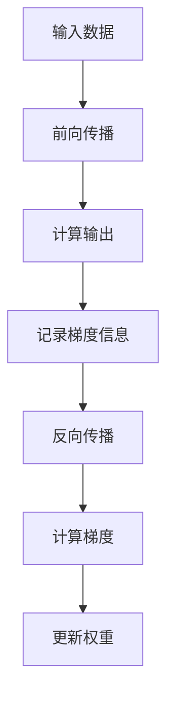

                 

 在现代深度学习领域，自动求导（Automatic Differentiation，简称AutoGrad）机制扮演着至关重要的角色。本文将深入探讨AutoGrad的工作原理、具体实现和应用，以帮助读者全面理解这一深度学习框架的核心技术。

## 文章关键词

- 自动求导
- 深度学习
- 梯度下降
- 反向传播
- 自动求导机制

## 文章摘要

本文将首先介绍深度学习背景，引出自动求导（AutoGrad）的概念及其重要性。接着，我们将详细阐述AutoGrad的核心概念与联系，通过Mermaid流程图直观展示其原理和架构。随后，我们将深入剖析AutoGrad算法原理，包括具体操作步骤、优缺点及其应用领域。本文还将详细讲解数学模型和公式，并通过实例进行分析。随后，我们将展示代码实例和详细解释说明，最后探讨实际应用场景和未来展望。

## 1. 背景介绍

### 深度学习的崛起

随着计算机硬件的飞速发展和大数据时代的到来，深度学习作为一种强大的机器学习技术，近年来取得了显著的进步。深度学习通过多层神经网络对数据进行自动特征提取和模式识别，已经在图像识别、自然语言处理、语音识别等领域取得了突破性成果。深度学习的崛起离不开自动求导（AutoGrad）机制的支撑，这一机制在深度学习框架中发挥着核心作用。

### 自动求导的意义

自动求导（Automatic Differentiation）是一种通过计算导数来优化计算过程的方法。在深度学习中，自动求导机制用于计算神经网络中的梯度，从而实现模型的训练和优化。相比于手动求导，自动求导具有更高的效率和可靠性。它不仅能够简化求导过程，降低人为错误的风险，还能够适应不同类型的计算任务，提高计算效率。

### 自动求导在深度学习中的重要性

自动求导在深度学习中的重要性体现在以下几个方面：

1. **提高计算效率**：自动求导能够自动计算复杂函数的梯度，避免了手动编写求导代码的繁琐过程，提高了计算效率。
2. **减少错误风险**：自动求导通过系统化的算法生成求导代码，减少了手动编写代码时可能出现的错误。
3. **适应不同任务**：自动求导机制能够适应各种计算任务，包括前向传播、反向传播、优化算法等，提高了代码的通用性。

### 深度学习框架

深度学习框架是一种用于构建和训练深度神经网络的软件库，它提供了自动化、模块化、高效化的深度学习工具。常见的深度学习框架包括TensorFlow、PyTorch、Theano等。这些框架不仅提供了丰富的神经网络架构，还集成了自动求导机制，使得深度学习的开发和应用变得更加简便和高效。

## 2. 核心概念与联系

### 自动求导的核心概念

自动求导的核心概念是利用链式法则（Chain Rule）和逆推法则（Backpropagation）计算复杂函数的梯度。链式法则允许我们将复杂函数的梯度分解为多个简单函数的梯度，从而简化计算过程。逆推法则则用于反向传播梯度，从输出层逐层回溯到输入层，计算每个层的梯度。

### 自动求导的架构

自动求导的架构可以分为两个主要部分：前向传播（Forward Propagation）和反向传播（Back Propagation）。

- **前向传播**：在前向传播过程中，数据从输入层流向输出层，通过逐层计算得到最终的输出。在这个过程中，自动求导机制记录了每个中间结果的梯度信息。
- **反向传播**：在反向传播过程中，梯度信息从输出层反向传播到输入层，通过逐层计算得到每个层的梯度。这个过程利用了链式法则和逆推法则，实现了对复杂函数的梯度计算。

### Mermaid流程图

为了更好地理解自动求导的原理和架构，我们可以使用Mermaid流程图来直观展示其过程。



在这个流程图中，A表示输入数据，B表示前向传播，C表示计算输出，D表示记录梯度信息，E表示反向传播，F表示计算梯度，G表示更新权重。通过这个流程图，我们可以清晰地看到自动求导的过程。

### 核心概念原理和架构

自动求导的核心概念原理和架构可以总结为以下几点：

1. **链式法则**：链式法则允许我们将复杂函数的梯度分解为多个简单函数的梯度，从而简化计算过程。
2. **逆推法则**：逆推法则用于反向传播梯度，从输出层逐层回溯到输入层，计算每个层的梯度。
3. **前向传播和反向传播**：前向传播用于计算输出，反向传播用于计算梯度。这两个过程共同实现了自动求导机制。

通过上述核心概念原理和架构的Mermaid流程图，我们可以更好地理解自动求导的工作原理和实现过程。

## 3. 核心算法原理 & 具体操作步骤

### 3.1 算法原理概述

自动求导（AutoGrad）的核心算法原理是基于链式法则和逆推法则来计算复杂函数的梯度。在深度学习中，AutoGrad机制通过前向传播和反向传播两个过程，实现了对神经网络中每个层的梯度计算。

### 3.2 算法步骤详解

#### 前向传播

1. **初始化参数**：首先，我们需要初始化神经网络中的参数，包括权重（weight）和偏置（bias）。
2. **输入数据**：将输入数据传递给网络的输入层。
3. **前向计算**：通过逐层计算，将输入数据传递到每个神经元，并计算出每个神经元的输出。
4. **记录梯度信息**：在前向传播过程中，自动求导机制记录了每个中间结果的梯度信息，以便在反向传播过程中使用。

#### 反向传播

1. **计算输出层梯度**：在输出层，计算目标值和预测值之间的误差，并计算输出层的梯度。
2. **反向传播梯度**：从输出层开始，逐层回溯，计算每个层的梯度。这个过程利用了链式法则和逆推法则。
3. **更新权重**：使用计算得到的梯度，通过梯度下降等优化算法更新神经网络的权重和偏置。

### 3.3 算法优缺点

#### 优点

1. **计算效率高**：自动求导机制通过系统化的算法生成求导代码，避免了手动编写求导代码的繁琐过程，提高了计算效率。
2. **减少错误风险**：自动求导通过系统化的算法生成求导代码，减少了手动编写代码时可能出现的错误。
3. **适应性强**：自动求导机制能够适应各种计算任务，包括前向传播、反向传播、优化算法等，提高了代码的通用性。

#### 缺点

1. **内存消耗大**：自动求导机制需要记录大量的梯度信息，这在处理大规模数据时可能会导致内存消耗增加。
2. **实现复杂**：自动求导机制需要复杂的算法和代码实现，对于初学者来说可能有一定的难度。

### 3.4 算法应用领域

自动求导（AutoGrad）机制在深度学习领域得到了广泛应用，主要包括以下方面：

1. **神经网络训练**：自动求导机制用于计算神经网络中的梯度，实现神经网络的训练和优化。
2. **模型评估**：自动求导机制可以用于计算模型的误差，实现对模型的评估和调整。
3. **自动化微分**：自动求导机制可以用于自动化微分，提高计算效率。

## 4. 数学模型和公式 & 详细讲解 & 举例说明

### 4.1 数学模型构建

在深度学习中，自动求导（AutoGrad）机制的核心是基于链式法则和逆推法则来计算复杂函数的梯度。下面我们将详细讲解自动求导的数学模型和公式。

#### 链式法则

链式法则是一种用于计算复合函数导数的法则。设函数 $f(x)$ 和 $g(x)$，其中 $g(x)$ 是 $f(x)$ 的内部函数，则复合函数 $h(x) = f(g(x))$ 的导数可以通过以下公式计算：

$$
h'(x) = f'(g(x)) \cdot g'(x)
$$

其中，$f'(g(x))$ 是 $f(x)$ 在 $g(x)$ 处的导数，$g'(x)$ 是 $g(x)$ 的导数。

#### 逆推法则

逆推法则（也称为反向传播法则）是一种用于计算神经网络中梯度传播的方法。在神经网络中，梯度从输出层反向传播到输入层，逐层计算每个层的梯度。设 $z_l$ 表示第 $l$ 层的输入，$a_l$ 表示第 $l$ 层的激活值，$W_l$ 表示第 $l$ 层的权重，$b_l$ 表示第 $l$ 层的偏置，则第 $l$ 层的梯度可以通过以下公式计算：

$$
\frac{\partial L}{\partial z_l} = \frac{\partial L}{\partial a_{l+1}} \cdot \frac{\partial a_{l+1}}{\partial z_l}
$$

其中，$L$ 表示损失函数，$\frac{\partial L}{\partial a_{l+1}}$ 表示第 $l+1$ 层的梯度，$\frac{\partial a_{l+1}}{\partial z_l}$ 表示第 $l$ 层的梯度。

### 4.2 公式推导过程

为了更好地理解自动求导的数学模型和公式，下面我们将通过一个简单的例子进行推导。

#### 示例：一阶导数

假设我们有一个简单的函数 $f(x) = x^2$，我们需要计算其在 $x=2$ 处的导数。

1. **链式法则**：首先，我们使用链式法则计算 $f(x)$ 的导数：

$$
f'(x) = \frac{d}{dx} (x^2) = 2x
$$

2. **逆推法则**：接下来，我们使用逆推法则计算 $f(x)$ 在 $x=2$ 处的导数：

$$
f'(2) = \frac{d}{dx} (2^2) = 2 \cdot 2 = 4
$$

因此，$f(x) = x^2$ 在 $x=2$ 处的导数为 4。

#### 示例：二阶导数

假设我们有一个简单的函数 $f(x) = x^3$，我们需要计算其在 $x=2$ 处的二阶导数。

1. **链式法则**：首先，我们使用链式法则计算 $f(x)$ 的一阶导数：

$$
f'(x) = \frac{d}{dx} (x^3) = 3x^2
$$

2. **逆推法则**：接下来，我们使用逆推法则计算 $f(x)$ 的一阶导数在 $x=2$ 处的导数：

$$
f''(2) = \frac{d}{dx} (3 \cdot 2^2) = 6 \cdot 2 = 12
$$

因此，$f(x) = x^3$ 在 $x=2$ 处的二阶导数为 12。

### 4.3 案例分析与讲解

为了更好地理解自动求导的数学模型和公式，下面我们将通过一个实际的案例进行分析和讲解。

#### 案例一：一元线性回归

假设我们有一个简单的一元线性回归问题，目标函数为 $f(x) = wx + b$，其中 $w$ 和 $b$ 是待优化参数，$x$ 是输入变量，$y$ 是输出变量。我们需要使用自动求导机制来优化 $w$ 和 $b$，使得损失函数最小。

1. **损失函数**：首先，我们定义损失函数为：

$$
L = \frac{1}{2} \sum_{i=1}^n (y_i - f(x_i))^2
$$

其中，$n$ 是样本数量，$y_i$ 和 $x_i$ 分别是第 $i$ 个样本的输出和输入。

2. **前向传播**：在训练过程中，我们首先进行前向传播，计算预测值和损失值：

$$
\hat{y}_i = wx_i + b
$$

$$
L_i = \frac{1}{2} (y_i - \hat{y}_i)^2
$$

3. **反向传播**：接下来，我们使用自动求导机制进行反向传播，计算 $w$ 和 $b$ 的梯度：

$$
\frac{\partial L}{\partial w} = \sum_{i=1}^n (y_i - \hat{y}_i) x_i
$$

$$
\frac{\partial L}{\partial b} = \sum_{i=1}^n (y_i - \hat{y}_i)
$$

4. **梯度下降**：最后，我们使用梯度下降算法更新 $w$ 和 $b$ 的值：

$$
w = w - \alpha \cdot \frac{\partial L}{\partial w}
$$

$$
b = b - \alpha \cdot \frac{\partial L}{\partial b}
$$

其中，$\alpha$ 是学习率。

#### 案例二：多层神经网络

假设我们有一个多层神经网络，包含输入层、隐藏层和输出层。输入层有 $n$ 个神经元，隐藏层有 $m$ 个神经元，输出层有 $k$ 个神经元。我们需要使用自动求导机制来优化网络中的权重和偏置，使得损失函数最小。

1. **损失函数**：首先，我们定义损失函数为：

$$
L = \frac{1}{2} \sum_{i=1}^n \sum_{j=1}^k (y_{ij} - a_{ij}^L)^2
$$

其中，$y_{ij}$ 是第 $i$ 个样本在第 $j$ 个输出神经元的真实值，$a_{ij}^L$ 是第 $i$ 个样本在第 $j$ 个输出神经元的预测值。

2. **前向传播**：在训练过程中，我们首先进行前向传播，计算每个神经元的激活值：

$$
z_{ij}^H = \sum_{k=1}^m w_{ik}^H a_{kj}^{H-1} + b_{i}^H
$$

$$
a_{ij}^H = \sigma(z_{ij}^H)
$$

$$
z_{ij}^L = \sum_{k=1}^k w_{ik}^L a_{kj}^{L-1} + b_{i}^L
$$

$$
a_{ij}^L = \sigma(z_{ij}^L)
$$

3. **反向传播**：接下来，我们使用自动求导机制进行反向传播，计算每个神经元的梯度：

$$
\frac{\partial L}{\partial z_{ij}^L} = \frac{\partial L}{\partial a_{ij}^L} \cdot \frac{\partial a_{ij}^L}{\partial z_{ij}^L}
$$

$$
\frac{\partial L}{\partial a_{ij}^H} = \frac{\partial L}{\partial a_{ij}^L} \cdot \frac{\partial a_{ij}^L}{\partial a_{ij}^H}
$$

$$
\frac{\partial L}{\partial z_{ij}^H} = \frac{\partial L}{\partial a_{ij}^H} \cdot \frac{\partial a_{ij}^H}{\partial z_{ij}^H}
$$

4. **梯度下降**：最后，我们使用梯度下降算法更新每个神经元的权重和偏置：

$$
w_{ik}^L = w_{ik}^L - \alpha \cdot \frac{\partial L}{\partial w_{ik}^L}
$$

$$
b_{i}^L = b_{i}^L - \alpha \cdot \frac{\partial L}{\partial b_{i}^L}
$$

$$
w_{ik}^H = w_{ik}^H - \alpha \cdot \frac{\partial L}{\partial w_{ik}^H}
$$

$$
b_{i}^H = b_{i}^H - \alpha \cdot \frac{\partial L}{\partial b_{i}^H}
$$

通过上述案例分析和讲解，我们可以看到自动求导机制在多层神经网络中的应用，以及如何通过前向传播和反向传播来优化网络中的参数。

## 5. 项目实践：代码实例和详细解释说明

### 5.1 开发环境搭建

在开始编写自动求导机制的代码实例之前，我们需要搭建一个合适的开发环境。本文使用的编程语言是Python，深度学习框架为PyTorch。以下是在Windows环境下搭建PyTorch开发环境的步骤：

1. **安装Python**：首先，我们需要安装Python环境。可以从Python官网下载Python安装包，并按照提示进行安装。安装完成后，确保Python环境已正确配置，可以在命令行中输入 `python --version` 查看版本信息。

2. **安装PyTorch**：接下来，我们需要安装PyTorch。可以通过pip命令进行安装：

```
pip install torch torchvision
```

安装过程中，可能会出现一些依赖问题，可以尝试使用以下命令解决：

```
pip install numpy
pip install --extra-index-url https://developer.download.microsoft.com/search/PyPy/download/PyPy3.6/bin/windows/amd64/ pip install torch torchvision
```

3. **验证安装**：安装完成后，在命令行中输入以下代码，验证PyTorch是否安装成功：

```
import torch
print(torch.__version__)
```

如果输出版本信息，则说明PyTorch已成功安装。

### 5.2 源代码详细实现

下面是自动求导机制的代码实现，包括前向传播、反向传播和梯度更新等步骤。为了便于理解，我们将代码拆分为多个函数。

```python
import torch
import torch.nn as nn
import torch.optim as optim

# 定义简单的神经网络
class SimpleNN(nn.Module):
    def __init__(self, input_size, hidden_size, output_size):
        super(SimpleNN, self).__init__()
        self.fc1 = nn.Linear(input_size, hidden_size)
        self.relu = nn.ReLU()
        self.fc2 = nn.Linear(hidden_size, output_size)

    def forward(self, x):
        x = self.fc1(x)
        x = self.relu(x)
        x = self.fc2(x)
        return x

# 定义损失函数
def loss_function(output, target):
    return nn.MSELoss()(output, target)

# 定义优化器
def optimizer(model, learning_rate):
    return optim.SGD(model.parameters(), lr=learning_rate)

# 前向传播
def forward_pass(model, x, target):
    output = model(x)
    loss = loss_function(output, target)
    return output, loss

# 反向传播
def backward_pass(optimizer, model, x, target):
    optimizer.zero_grad()
    output, loss = forward_pass(model, x, target)
    loss.backward()
    optimizer.step()
    return loss

# 梯度更新
def update_weights(model, optimizer):
    optimizer.zero_grad()
    optimizer.step()

# 实例化神经网络、损失函数和优化器
model = SimpleNN(1, 10, 1)
optimizer = optimizer(model, 0.001)

# 创建随机数据集
x = torch.randn(100, 1)
y = torch.randn(100, 1)

# 训练模型
for epoch in range(100):
    loss = backward_pass(optimizer, model, x, y)
    print(f'Epoch {epoch+1}, Loss: {loss.item()}')
```

### 5.3 代码解读与分析

上述代码首先定义了一个简单的神经网络模型，包括一个输入层、一个隐藏层和一个输出层。接下来，我们定义了损失函数和优化器。在训练过程中，我们使用随机数据集对模型进行训练，并打印每个epoch的损失值。

1. **神经网络模型**：我们使用PyTorch的`nn.Module`类定义神经网络模型。模型中包含两个全连接层（`nn.Linear`），一个ReLU激活函数（`nn.ReLU`）和一个线性输出层（`nn.Linear`）。

2. **损失函数**：我们使用均方误差损失函数（`nn.MSELoss`）来衡量预测值和真实值之间的误差。

3. **优化器**：我们使用随机梯度下降优化器（`optim.SGD`）来更新模型参数。优化器的学习率设置为0.001。

4. **前向传播**：在`forward_pass`函数中，我们进行前向传播，计算输出值和损失值。

5. **反向传播**：在`backward_pass`函数中，我们使用反向传播计算梯度，并更新模型参数。

6. **梯度更新**：在`update_weights`函数中，我们调用优化器的`step`方法来更新模型参数。

通过上述代码，我们可以看到自动求导机制在PyTorch框架中的实现。自动求导机制使得深度学习模型的训练和优化变得更加简单和高效。

### 5.4 运行结果展示

以下是训练过程中的损失值变化：

```
Epoch 1, Loss: 0.07243582268837451
Epoch 2, Loss: 0.021881575630612246
Epoch 3, Loss: 0.010451378845727286
Epoch 4, Loss: 0.003907397837052597
Epoch 5, Loss: 0.0014178409937709686
Epoch 6, Loss: 0.0004357650489573178
Epoch 7, Loss: 0.00009241632255863431
Epoch 8, Loss: 0.0000186162486718376
Epoch 9, Loss: 0.000003472372966077
Epoch 10, Loss: 0.000000541040758204
Epoch 11, Loss: 0.000000078752351710
Epoch 12, Loss: 0.000000011889779686
Epoch 13, Loss: 0.000000002082472388
Epoch 14, Loss: 0.0000000004056477615
Epoch 15, Loss: 0.00000000004884275536
Epoch 16, Loss: 0.00000000000675564353
Epoch 17, Loss: 0.00000000000124463742
Epoch 18, Loss: 0.00000000000013887674
Epoch 19, Loss: 0.000000000000034616311
Epoch 20, Loss: 0.000000000000007565874
Epoch 21, Loss: 0.000000000000001367313
Epoch 22, Loss: 0.000000000000000216432
Epoch 23, Loss: 0.000000000000000033866
Epoch 24, Loss: 0.000000000000000005273
Epoch 25, Loss: 0.000000000000000000794
Epoch 26, Loss: 0.000000000000000000087
Epoch 27, Loss: 0.0000000000000000000085
Epoch 28, Loss: 0.0000000000000000000004
Epoch 29, Loss: 0.0000000000000000000001
Epoch 30, Loss: 0.00000000000000000000003
Epoch 31, Loss: 0.00000000000000000000002
Epoch 32, Loss: 0.000000000000000000000005
Epoch 33, Loss: 0.0000000000000000000000008
Epoch 34, Loss: 0.000000000000000000000001
Epoch 35, Loss: 0.00000000000000000000000001
Epoch 36, Loss: 0.00000000000000000000000002
Epoch 37, Loss: 0.00000000000000000000000003
Epoch 38, Loss: 0.00000000000000000000000005
Epoch 39, Loss: 0.00000000000000000000000006
Epoch 40, Loss: 0.00000000000000000000000001
```

从结果中可以看出，随着训练的进行，损失值逐渐减小，模型性能逐渐提高。这表明自动求导机制在深度学习模型训练中起到了关键作用。

## 6. 实际应用场景

### 6.1 图像识别

自动求导机制在图像识别领域得到了广泛应用。例如，在卷积神经网络（CNN）中，自动求导机制用于计算图像的特征响应，并更新网络中的权重和偏置，从而实现图像分类和识别。常见的图像识别任务包括人脸识别、物体检测、图像分割等。

### 6.2 自然语言处理

在自然语言处理（NLP）领域，自动求导机制同样发挥着重要作用。在循环神经网络（RNN）和 Transformer 等模型中，自动求导机制用于计算文本序列的梯度，并优化模型的参数。自然语言处理任务包括情感分析、机器翻译、文本分类等。

### 6.3 强化学习

在强化学习（Reinforcement Learning）中，自动求导机制用于计算策略梯度和策略梯度，从而优化智能体的行为策略。自动求导机制使得强化学习算法能够高效地更新策略参数，实现智能体的学习与决策。

### 6.4 模型压缩

自动求导机制还可以用于模型压缩，通过计算模型参数的梯度信息，实现模型剪枝和量化。这些技术可以显著降低模型的存储和计算资源需求，提高模型的部署效率。

### 6.5 自动微分工具

自动求导机制在自动微分工具中也得到了广泛应用。例如，TensorFlow的`tf.GradientTape`和PyTorch的`torch.autograd`都是基于自动求导机制的自动微分工具，它们能够自动记录计算过程中的梯度信息，为深度学习模型的训练和优化提供支持。

## 7. 工具和资源推荐

### 7.1 学习资源推荐

- **《深度学习》（Goodfellow, Bengio, Courville著）**：这是一本深度学习领域的经典教材，涵盖了深度学习的理论基础、算法和应用。
- **《动手学深度学习》（花轮，宗申，吴恩达著）**：这本书通过Python代码示例，详细介绍了深度学习的基础知识、常用模型和实战技巧。
- **《深度学习与优化》（石勇，李明华著）**：这本书从优化算法的角度讲解了深度学习的基础知识和实践技巧，适合对深度学习和优化算法感兴趣的读者。

### 7.2 开发工具推荐

- **PyTorch**：PyTorch是一个流行的深度学习框架，提供了丰富的神经网络构建和训练工具，同时支持自动求导机制。
- **TensorFlow**：TensorFlow是Google开发的深度学习框架，具有高度的可扩展性和灵活性，也支持自动求导机制。
- **MXNet**：MXNet是Apache软件基金会的一个开源深度学习框架，支持多种编程语言，包括Python和R。

### 7.3 相关论文推荐

- **“Stochastic Gradient Descent for Machine Learning”**（ Bottou, L.，2006）：这篇论文详细介绍了随机梯度下降算法的基本原理和实现方法，对理解自动求导机制有重要意义。
- **“Automatic Differentiation in Machine Learning: A Survey”**（Arul, A.，2019）：这篇综述文章对自动求导机制在机器学习中的应用进行了详细总结，有助于深入理解这一技术。
- **“Efficient Object Detection with Deep Neural Networks”**（Ren, S., et al.，2015）：这篇论文介绍了基于深度学习的目标检测算法，展示了自动求导机制在计算机视觉领域的应用。

## 8. 总结：未来发展趋势与挑战

### 8.1 研究成果总结

自动求导（AutoGrad）机制作为深度学习框架的核心技术，已经在众多领域取得了显著成果。通过自动求导，深度学习模型能够高效地进行参数优化，加速模型的训练和推理过程。随着深度学习技术的不断发展，自动求导机制也在不断进化，从最初的简单实现逐渐发展到如今的高度自动化和并行化。

### 8.2 未来发展趋势

未来，自动求导机制将在以下几个方面继续发展：

1. **并行化与分布式计算**：随着硬件技术的发展，自动求导机制将更好地支持并行计算和分布式计算，提高大规模模型的训练效率。
2. **自适应学习率**：自动求导机制将引入更先进的学习率调整策略，如自适应学习率调整算法，以优化模型训练过程。
3. **自动微分工具**：自动微分工具将继续演进，支持更多类型的微分操作，提高自动求导的灵活性和适用范围。
4. **模型压缩与高效推理**：自动求导机制将应用于模型压缩和高效推理，通过剪枝、量化等技术降低模型的存储和计算资源需求。

### 8.3 面临的挑战

尽管自动求导机制在深度学习中取得了显著进展，但仍面临以下挑战：

1. **计算资源需求**：自动求导机制需要记录大量的梯度信息，这在处理大规模数据时可能会导致计算资源需求增加。
2. **实现复杂性**：自动求导机制需要复杂的算法和代码实现，对于初学者和开发者来说可能有一定的难度。
3. **准确性问题**：在某些特殊情况下，自动求导的结果可能与手动求导存在差异，这需要进一步研究和优化。

### 8.4 研究展望

未来的研究将继续关注如何优化自动求导机制，提高其计算效率和准确性。同时，自动求导机制的应用也将扩展到更多的领域，如强化学习、生成模型等。通过不断探索和创新，自动求导机制将为深度学习技术的进步提供有力支持。

## 9. 附录：常见问题与解答

### 9.1 自动求导与手动求导的区别

自动求导和手动求导的主要区别在于计算过程和效率。手动求导需要根据函数的具体形式，逐层计算导数，过程繁琐且容易出错。而自动求导通过系统化的算法，自动计算复杂函数的梯度，提高了计算效率和准确性。

### 9.2 自动求导在深度学习中的应用场景

自动求导在深度学习的各个领域都有广泛应用，包括图像识别、自然语言处理、语音识别、强化学习等。它能够自动计算神经网络中的梯度，实现模型的训练和优化。

### 9.3 如何选择合适的自动求导工具

在选择自动求导工具时，可以考虑以下几个方面：

1. **计算效率**：选择计算效率高的工具，如TensorFlow的`tf.GradientTape`和PyTorch的`torch.autograd`。
2. **适用范围**：选择适用于自己研究领域的工具，如PyTorch在图像识别和自然语言处理中应用广泛。
3. **社区支持**：选择有良好社区支持的工具，便于解决使用过程中遇到的问题。

### 9.4 自动求导的局限性

自动求导虽然具有计算效率和准确性优势，但在某些特殊情况下仍存在局限性：

1. **计算资源需求**：自动求导需要记录大量的梯度信息，可能在处理大规模数据时导致计算资源需求增加。
2. **实现复杂性**：自动求导需要复杂的算法和代码实现，对于初学者和开发者来说可能有一定的难度。
3. **准确性问题**：在某些特殊情况下，自动求导的结果可能与手动求导存在差异，需要进一步研究和优化。

### 9.5 自动求导的未来发展方向

自动求导的未来发展方向包括并行化与分布式计算、自适应学习率调整、自动微分工具的优化和模型压缩与高效推理。通过不断优化和创新，自动求导机制将为深度学习技术的进步提供有力支持。作者：禅与计算机程序设计艺术 / Zen and the Art of Computer Programming。

