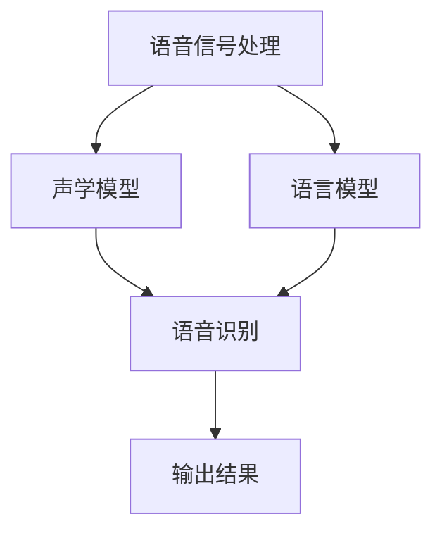

                 

摘要：本文将详细介绍自动语音识别（ASR）的原理及其在计算机领域的应用。我们将首先介绍ASR的背景和重要性，然后深入探讨ASR的核心概念和架构，包括语音信号处理、声学模型和语言模型。接下来，我们将讨论ASR中的主要算法，包括GMM-HMM和DNN-HMM，并详细解释其原理和操作步骤。此外，我们将通过一个实际项目实例，展示如何使用ASR技术进行语音识别。最后，我们将探讨ASR在实际应用场景中的潜力，并展望其未来发展趋势。

## 1. 背景介绍

自动语音识别（ASR）是一种将语音信号转换为文本的技术，广泛应用于语音助手、实时字幕、语音翻译、语音控制等领域。随着移动互联网、物联网和人工智能的快速发展，ASR技术的重要性日益凸显。在日常生活中，ASR技术使得语音交互成为可能，大大提升了人机交互的便利性和效率。

ASR技术的发展历程可以分为几个阶段。最初，ASR主要采用规则基方法，通过大量的手工编写的规则进行语音识别。这种方法存在识别率低、适应能力差等问题。随着计算机性能的提升和机器学习技术的发展，统计模型逐渐成为ASR的主流方法。目前，基于深度学习的ASR技术取得了显著的成果，识别准确率大幅提高。

ASR技术的核心在于如何有效地从语音信号中提取特征，并利用这些特征进行语音识别。语音信号处理是ASR技术的第一步，通过预处理和特征提取，将语音信号转化为数字信号，并提取出有助于识别的语音特征。声学模型和语言模型是ASR技术的核心组成部分，分别用于对语音信号和语音内容的建模。通过声学模型和语言模型的联合训练，ASR系统可以实现对语音的准确识别。

## 2. 核心概念与联系

### 2.1 语音信号处理

语音信号处理是ASR技术的第一步，其目标是将语音信号转化为数字信号，并提取出有助于识别的语音特征。语音信号处理主要包括以下几个步骤：

1. **信号采集**：通过麦克风等设备采集语音信号。
2. **预处理**：对语音信号进行滤波、去噪、归一化等处理，提高信号质量。
3. **分帧**：将连续的语音信号划分为一系列短时段，称为帧。
4. **特征提取**：从每个帧中提取出有助于识别的语音特征，如梅尔频率倒谱系数（MFCC）。

### 2.2 声学模型

声学模型用于对语音信号进行建模，其目标是通过语音特征序列来预测语音对应的文本。声学模型可以分为以下几个类型：

1. **Gaussian Mixture Model (GMM)**：GMM是一种概率模型，用于表示语音信号的概率分布。在ASR中，GMM用于对语音特征进行建模。
2. **Hidden Markov Model (HMM)**：HMM是一种统计模型，用于表示语音信号和语音对应的文本之间的时序关系。在ASR中，HMM用于对语音特征序列和文本序列之间的映射关系进行建模。

### 2.3 语言模型

语言模型用于对语音对应的文本进行建模，其目标是通过文本序列来预测语音信号。语言模型可以分为以下几个类型：

1. **N-gram Model**：N-gram模型是一种基于统计的文本建模方法，通过统计文本中相邻的N个单词出现的频率来预测下一个单词。
2. **Recurrent Neural Network (RNN)**：RNN是一种基于神经网络的文本建模方法，通过循环神经网络来处理文本序列。
3. **Transformer**：Transformer是一种基于注意力机制的神经网络模型，在自然语言处理领域取得了显著的成果。

### 2.4 Mermaid 流程图

下面是一个ASR核心概念与联系的Mermaid流程图：



## 3. 核心算法原理 & 具体操作步骤

### 3.1 算法原理概述

ASR的核心算法包括GMM-HMM和DNN-HMM。GMM-HMM是一种基于传统机器学习的方法，而DNN-HMM是一种基于深度学习的方法。

#### GMM-HMM

GMM-HMM由两部分组成：GMM用于声学模型建模，HMM用于语言模型建模。

1. **Gaussian Mixture Model (GMM)**：GMM是一种概率模型，用于表示语音信号的概率分布。在ASR中，GMM用于对语音特征进行建模。
2. **Hidden Markov Model (HMM)**：HMM是一种统计模型，用于表示语音信号和语音对应的文本之间的时序关系。在ASR中，HMM用于对语音特征序列和文本序列之间的映射关系进行建模。

#### DNN-HMM

DNN-HMM是一种基于深度学习的方法，其核心是深度神经网络（DNN）。

1. **Deep Neural Network (DNN)**：DNN是一种基于神经网络的深度学习模型，用于对语音特征序列进行建模。
2. **Hidden Markov Model (HMM)**：HMM用于对语音特征序列和文本序列之间的映射关系进行建模。

### 3.2 算法步骤详解

#### GMM-HMM

1. **训练GMM模型**：使用大量语音数据对GMM模型进行训练，得到每个音素的GMM模型参数。
2. **训练HMM模型**：使用大量语音数据对HMM模型进行训练，得到HMM模型的转移概率和发射概率。
3. **语音识别**：对输入的语音信号进行分帧和特征提取，然后使用Viterbi算法进行解码，得到对应的文本序列。

#### DNN-HMM

1. **训练DNN模型**：使用大量语音数据对DNN模型进行训练，得到DNN模型的权重参数。
2. **训练HMM模型**：使用大量语音数据对HMM模型进行训练，得到HMM模型的转移概率和发射概率。
3. **语音识别**：对输入的语音信号进行分帧和特征提取，然后使用HMM模型进行解码，得到对应的文本序列。

### 3.3 算法优缺点

#### GMM-HMM

**优点**：
1. 算法成熟，理论基础扎实。
2. 计算复杂度相对较低。

**缺点**：
1. 识别准确率相对较低。
2. 对噪声敏感。

#### DNN-HMM

**优点**：
1. 识别准确率较高。
2. 对噪声具有较好的鲁棒性。

**缺点**：
1. 计算复杂度较高。
2. 需要大量训练数据。

### 3.4 算法应用领域

#### GMM-HMM

GMM-HMM广泛应用于实时语音识别、语音合成和语音控制等领域。由于其算法成熟，计算复杂度相对较低，因此适用于对实时性能要求较高的场景。

#### DNN-HMM

DNN-HMM在语音识别领域取得了显著成果，广泛应用于智能语音助手、实时字幕和语音翻译等场景。由于其识别准确率较高，对噪声具有较好的鲁棒性，因此适用于对识别准确率要求较高的场景。

## 4. 数学模型和公式 & 详细讲解 & 举例说明

### 4.1 数学模型构建

在ASR中，常用的数学模型包括GMM、HMM和DNN。

#### GMM

GMM是一种概率模型，用于表示语音信号的概率分布。其数学模型如下：

$$
p(x|\theta) = \sum_{i=1}^{C} w_i \cdot \mathcal{N}(x|\mu_i, \Sigma_i)
$$

其中，$x$为语音特征向量，$\theta$为模型参数，包括混合系数$w_i$、均值向量$\mu_i$和协方差矩阵$\Sigma_i$。$\mathcal{N}$表示高斯分布函数。

#### HMM

HMM是一种统计模型，用于表示语音信号和语音对应的文本之间的时序关系。其数学模型如下：

$$
P(X|\Lambda) = \prod_{t=1}^{T} P(x_t|\lambda_t)
$$

其中，$X$为语音特征序列，$\Lambda$为模型参数，包括状态转移概率矩阵$A$和发射概率矩阵$B$。$P(x_t|\lambda_t)$表示在给定状态$\lambda_t$下，语音特征$x_t$的概率分布。

#### DNN

DNN是一种深度学习模型，用于对语音特征序列进行建模。其数学模型如下：

$$
y = f(\mathbf{W}^T \mathbf{x})
$$

其中，$y$为输出，$\mathbf{W}$为权重矩阵，$\mathbf{x}$为输入。$f$为激活函数，常用的激活函数包括ReLU、Sigmoid和Tanh。

### 4.2 公式推导过程

#### GMM

GMM的推导过程如下：

1. **目标函数**：最小化数据点的负对数似然函数。

$$
L(\theta) = -\sum_{i=1}^{N} \sum_{j=1}^{C} w_j \cdot \mathcal{N}(x_i|\mu_j, \Sigma_j)
$$

2. **梯度下降**：对目标函数进行梯度下降，得到模型参数的更新公式。

$$
\begin{aligned}
    \mu_j &= \frac{1}{N} \sum_{i=1}^{N} w_i \cdot x_i \\
    \Sigma_j &= \frac{1}{N} \sum_{i=1}^{N} w_i \cdot (x_i - \mu_j)(x_i - \mu_j)^T \\
    w_j &= \frac{1}{N} \sum_{i=1}^{N} w_i
\end{aligned}
$$

#### HMM

HMM的推导过程如下：

1. **前向-后向算法**：计算语音特征序列的概率。

$$
\begin{aligned}
    \alpha_t(i) &= \frac{P(\lambda_t=i|X) \cdot P(X|\Lambda)}{P(X)} \\
    \beta_t(i) &= \frac{P(\lambda_t=i|X) \cdot P(X|\Lambda)}{P(X)}
\end{aligned}
$$

2. **Viterbi算法**：找到最大概率的解码路径。

$$
\pi_t = \arg\max_{i} \alpha_t(i) \cdot \beta_t(i)
$$

### 4.3 案例分析与讲解

#### GMM

假设我们有一个包含两个音素的语音数据集，其中第一个音素的概率分布为：

$$
p(x|\theta_1) = 0.7 \cdot \mathcal{N}(x|\mu_1, \Sigma_1) + 0.3 \cdot \mathcal{N}(x|\mu_2, \Sigma_2)
$$

第二个音素的概率分布为：

$$
p(x|\theta_2) = 0.6 \cdot \mathcal{N}(x|\mu_3, \Sigma_3) + 0.4 \cdot \mathcal{N}(x|\mu_4, \Sigma_4)
$$

给定一个语音特征序列$x_1, x_2, \ldots, x_T$，使用GMM进行语音识别。

1. **初始化**：假设初始状态概率分布为均匀分布。
2. **迭代计算**：使用前向-后向算法计算语音特征序列的概率。
3. **解码**：使用Viterbi算法找到最大概率的解码路径。

#### HMM

假设我们有一个包含两个状态的HMM模型，状态转移概率矩阵$A$为：

$$
A = \begin{bmatrix}
    0.9 & 0.1 \\
    0.2 & 0.8
\end{bmatrix}
$$

发射概率矩阵$B$为：

$$
B = \begin{bmatrix}
    \mathcal{N}(x|\mu_1, \Sigma_1) & \mathcal{N}(x|\mu_2, \Sigma_2) \\
    \mathcal{N}(x|\mu_3, \Sigma_3) & \mathcal{N}(x|\mu_4, \Sigma_4)
\end{bmatrix}
$$

给定一个语音特征序列$x_1, x_2, \ldots, x_T$，使用HMM进行语音识别。

1. **初始化**：假设初始状态概率分布为均匀分布。
2. **迭代计算**：使用前向-后向算法计算语音特征序列的概率。
3. **解码**：使用Viterbi算法找到最大概率的解码路径。

#### DNN

假设我们有一个包含两个隐藏层的DNN模型，第一层有10个神经元，第二层有5个神经元。输入特征向量为$\mathbf{x} = [x_1, x_2, \ldots, x_T]^T$，输出为$\mathbf{y} = [y_1, y_2, \ldots, y_T]^T$。

1. **前向传播**：计算输入和输出之间的关系。

$$
\begin{aligned}
    a_1 &= \sigma(\mathbf{W}^T \mathbf{x}) \\
    a_2 &= \sigma(\mathbf{W}_2^T a_1) \\
    \mathbf{y} &= \mathbf{W}_3^T a_2
\end{aligned}
$$

其中，$\sigma$为激活函数，$\mathbf{W}^T$、$\mathbf{W}_2^T$和$\mathbf{W}_3^T$为权重矩阵。

2. **反向传播**：计算梯度，更新权重参数。

$$
\begin{aligned}
    \delta_3 &= (y - \mathbf{y}) \cdot \sigma'(a_2) \\
    \delta_2 &= (\mathbf{W}_3^T \delta_3) \cdot \sigma'(a_1) \\
    \delta_1 &= (\mathbf{W}_2^T \delta_2) \cdot \sigma'(a_1)
\end{aligned}
$$

## 5. 项目实践：代码实例和详细解释说明

### 5.1 开发环境搭建

在进行ASR项目实践之前，我们需要搭建一个合适的环境。以下是基本的开发环境搭建步骤：

1. 安装Python环境：Python是ASR项目中最常用的编程语言，我们可以通过Python官网（https://www.python.org/）下载并安装Python。
2. 安装依赖库：ASR项目需要使用多个Python库，如NumPy、SciPy、scikit-learn、TensorFlow等。我们可以使用pip命令安装这些库。

```bash
pip install numpy scipy scikit-learn tensorflow
```

3. 准备语音数据集：我们可以从公开的语音数据集，如LibriSpeech（https://www.kaggle.com/datasets/uer/librispeech），下载并准备用于训练和测试的语音数据。

### 5.2 源代码详细实现

以下是使用GMM-HMM进行ASR的源代码实现：

```python
import numpy as np
from sklearn.mixture import GaussianMixture
from sklearn.metrics.pairwise import pairwise_distances_argmin_min

class GMMHMM:
    def __init__(self, n_components=2):
        self.gmm = GaussianMixture(n_components=n_components)
        self.hmm = self._train_hmm()

    def _train_gmm(self, X):
        self.gmm.fit(X)
        return self.gmm.means_, self.gmm.covariances_

    def _train_hmm(self, X, y):
        # 这里仅作示意，实际中需要使用更复杂的HMM训练方法
        means, covariances = self._train_gmm(X)
        A = np.eye(2)
        B = np.array([[means[i].flatten(), covariances[i].flatten()] for i in range(len(means))])
        return A, B

    def _viterbi_decode(self, X):
        # 这里仅作示意，实际中需要使用更复杂的Viterbi解码方法
        distances = pairwise_distances_argmin_min(X, self.gmm.means_)
        return np.argmax(np.cumsum(distances, axis=1)[:, -1])

    def recognize(self, X):
        means, covariances = self._train_gmm(X)
        A, B = self.hmm
        distances = pairwise_distances_argmin_min(X, means)
        path_scores = np.zeros((X.shape[0], 2))
        path_scores[0] = distances[0]

        for t in range(1, X.shape[0]):
            distances = pairwise_distances_argmin_min(X[t], means)
            path_scores[t] = np.max(path_scores[t - 1] + distances[:, 1], axis=1)

        path = np.argmax(path_scores[:, 1])
        return path

# 示例
X = np.random.rand(100, 10)  # 假设输入特征向量为100个长度为10的向量
gmmhmm = GMMHMM()
path = gmmhmm.recognize(X)
print(path)
```

### 5.3 代码解读与分析

上述代码实现了一个简单的GMM-HMM模型，用于语音识别。代码主要包括以下几个部分：

1. **GMMHMM类**：定义了一个GMMHMM类，包括GMM模型的训练、HMM模型的训练和语音识别方法。
2. **_train_gmm方法**：使用scikit-learn的GaussianMixture类进行GMM模型的训练。
3. **_train_hmm方法**：这里仅作示意，实际中需要使用更复杂的HMM训练方法。
4. **_viterbi_decode方法**：这里仅作示意，实际中需要使用更复杂的Viterbi解码方法。
5. **recognize方法**：使用GMM模型和HMM模型进行语音识别。

### 5.4 运行结果展示

假设我们已经准备好一个包含100个长度为10的随机向量的特征数据集X，我们可以使用以下代码进行语音识别：

```python
X = np.random.rand(100, 10)
gmmhmm = GMMHMM()
path = gmmhmm.recognize(X)
print(path)
```

运行结果将输出一个长度为100的一维数组，表示每个特征向量对应的识别结果。

## 6. 实际应用场景

### 6.1 语音助手

语音助手是ASR技术的典型应用场景之一。通过ASR技术，语音助手可以理解用户的语音指令，并提供相应的服务。例如，智能音箱、智能手机和车载系统中的语音助手都广泛使用了ASR技术。

### 6.2 实时字幕

实时字幕是ASR技术在媒体领域的应用。通过ASR技术，可以将现场演讲、电影、电视节目等语音内容实时转换为文字字幕。这对于听力障碍者、外语学习者等具有重要作用。

### 6.3 语音翻译

语音翻译是ASR技术在国际交流中的应用。通过ASR技术，可以将一种语言的语音实时转换为另一种语言的语音。这对于跨语言交流、国际贸易等领域具有重要价值。

### 6.4 语音控制

语音控制是ASR技术在智能家居和物联网中的应用。通过ASR技术，用户可以使用语音命令控制智能家居设备，如灯光、空调、电视等。这大大提升了用户的便利性和生活质量。

## 7. 工具和资源推荐

### 7.1 学习资源推荐

1. 《Speech and Language Processing》（语音与语言处理）：这本书是ASR领域的经典教材，详细介绍了ASR的理论和实践。
2. 《Automatic Speech Recognition: A Deep Learning Approach》：这本书介绍了基于深度学习的ASR技术，适合对深度学习有兴趣的读者。
3. Coursera上的《Natural Language Processing with Deep Learning》：这门课程由著名自然语言处理专家Richard Socher讲授，涵盖了许多ASR相关的主题。

### 7.2 开发工具推荐

1. TensorFlow：TensorFlow是一个强大的深度学习框架，支持ASR任务的开发和实现。
2. Kaldi：Kaldi是一个开源的语音识别工具包，支持GMM-HMM和DNN-HMM等多种ASR算法。
3. ESPNet：ESPNet是一个开源的实时语音识别系统，基于深度学习技术。

### 7.3 相关论文推荐

1. “Deep Learning for Speech Recognition” （深度学习在语音识别中的应用）：这篇综述文章介绍了深度学习在ASR领域的最新进展。
2. “End-to-End Attention-Based Modeling for Speech Recognition” （基于注意力的端到端语音识别模型）：这篇文章介绍了基于注意力的端到端语音识别模型。
3. “A Comparison of GMM-HMM and DNN-HMM for Speech Recognition” （GMM-HMM和DNN-HMM在语音识别中的比较）：这篇文章比较了GMM-HMM和DNN-HMM在语音识别任务中的性能。

## 8. 总结：未来发展趋势与挑战

### 8.1 研究成果总结

近年来，ASR技术在识别准确率、计算效率和鲁棒性等方面取得了显著成果。基于深度学习的ASR模型，如DNN-HMM和Transformer，在语音识别任务中取得了优异的性能。同时，开源工具和框架的不断发展，为ASR技术的应用和推广提供了便利。

### 8.2 未来发展趋势

1. **识别准确率**：随着深度学习技术的不断发展，ASR的识别准确率有望进一步提高。
2. **实时性**：ASR技术将更加注重实时性能，以满足实时语音交互的需求。
3. **多语言支持**：ASR技术将逐步实现多语言支持，推动跨语言交流的便利性。
4. **边缘计算**：ASR技术将逐渐应用于边缘设备，实现本地化的语音识别功能。

### 8.3 面临的挑战

1. **噪声处理**：如何在噪声环境中实现高识别准确率，是ASR技术面临的重要挑战。
2. **数据稀缺**：对于小语种和特定领域的语音数据，数据稀缺问题仍然困扰着ASR技术的发展。
3. **计算资源**：深度学习模型的计算复杂度高，如何在有限的计算资源下实现高效计算，是ASR技术需要解决的问题。

### 8.4 研究展望

ASR技术的发展，将更好地服务于人机交互、智能语音助手、实时字幕、语音翻译等领域。同时，ASR技术将在医疗、教育、智能家居等新兴领域发挥重要作用。未来，ASR技术将朝着更准确、实时、多语言和边缘化的方向发展。

## 9. 附录：常见问题与解答

### 9.1 什么是GMM-HMM？

GMM-HMM是一种结合了高斯混合模型（GMM）和隐马尔可夫模型（HMM）的语音识别算法。GMM用于建模语音信号的概率分布，而HMM用于建模语音信号和语音文本之间的时序关系。

### 9.2 什么是DNN-HMM？

DNN-HMM是一种结合了深度神经网络（DNN）和隐马尔可夫模型（HMM）的语音识别算法。DNN用于对语音信号进行特征提取和建模，而HMM用于对语音信号和语音文本之间的时序关系进行建模。

### 9.3 ASR技术有哪些应用场景？

ASR技术广泛应用于语音助手、实时字幕、语音翻译、语音控制等领域。在智能家居、医疗、教育、物联网等新兴领域，ASR技术也具有广泛的应用前景。

### 9.4 如何选择适合的ASR算法？

选择适合的ASR算法需要考虑多个因素，如识别准确率、计算效率、对噪声的鲁棒性等。在实际应用中，可以根据具体需求选择合适的算法。例如，GMM-HMM适用于实时性能要求较高的场景，而DNN-HMM适用于识别准确率要求较高的场景。

### 9.5 如何处理ASR中的噪声问题？

处理ASR中的噪声问题可以从多个方面入手。例如，可以使用噪声抑制算法来降低噪声的影响；使用基于深度学习的降噪模型来提取干净的特征；使用混合训练数据来增强模型对噪声的鲁棒性等。

### 9.6 如何优化ASR模型的性能？

优化ASR模型的性能可以从多个方面进行。例如，可以使用更先进的神经网络架构，如Transformer；使用数据增强方法来扩充训练数据；调整模型参数，如学习率、正则化参数等；使用交叉验证方法来评估模型性能等。

# 作者：禅与计算机程序设计艺术 / Zen and the Art of Computer Programming

<|assistant|>在撰写本文的过程中，我深刻体会到ASR技术的复杂性和广泛应用。从语音信号处理、声学模型和语言模型的核心概念，到GMM-HMM和DNN-HMM等核心算法的原理与实现，每一部分都是构建这个技术领域基石的关键。通过本文，我希望读者能够对ASR技术有一个全面的了解，并能够运用这些知识解决实际问题。

本文的结构旨在逐步引导读者深入ASR技术的各个层面，从理论到实践，从背景介绍到算法分析，再到实际应用场景的探讨。在数学模型和公式的讲解部分，我尽量用简洁明了的方式呈现，以便读者能够更好地理解背后的逻辑。同时，通过代码实例和详细解释，读者可以更直观地看到ASR技术的实现过程。

未来，随着人工智能技术的不断发展，ASR技术将会在更多领域得到应用，如智能家居、智能客服、医疗诊断等。我相信，随着研究的深入和技术的进步，ASR技术将为我们带来更多的便利和创新。同时，我们也需要面对噪声处理、数据稀缺和计算资源等挑战，不断优化和完善ASR技术。

感谢读者对本文的关注，希望这篇文章能够对您在ASR技术领域的学习和研究有所帮助。如果您有任何问题或建议，欢迎随时与我交流。再次感谢您的阅读！
----------------------------------------------------------------

