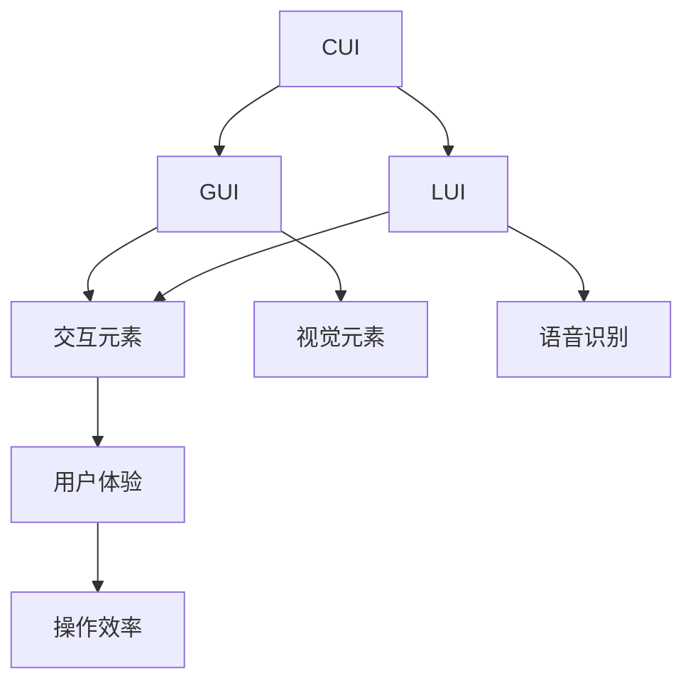

                 

关键词：CUI、LUI、GUI、交互、用户体验、技术发展、界面设计、人工智能、计算语言学

## 摘要

本文旨在探讨计算机用户界面（CUI）、语音用户界面（LUI）和图形用户界面（GUI）之间的关系及其对用户体验（UX）的深远影响。随着人工智能（AI）技术的快速发展，这些界面形式在现代社会中扮演着越来越重要的角色。本文首先介绍这三种界面形式的基本概念和特点，接着分析它们之间的联系和差异，最后讨论它们在当前和未来技术发展中的重要性。

## 1. 背景介绍

### 1.1 CUI：传统计算机用户界面

计算机用户界面（CUI）是计算机系统与用户进行交互的桥梁，它主要通过文本命令、菜单选项和按钮等交互元素来传递信息。CUI最早出现于20世纪60年代，随着计算机技术的发展，其功能逐渐增强。然而，CUI存在一定的局限性，如操作复杂、用户依赖性强等。

### 1.2 GUI：图形用户界面的崛起

图形用户界面（GUI）是CUI的一种改进，它通过图标、窗口、菜单和按钮等视觉元素来简化用户操作。GUI的出现极大地提升了用户体验，使得计算机操作变得更加直观和便捷。从20世纪80年代开始，GUI逐渐成为主流用户界面形式，广泛应用于操作系统、应用软件等领域。

### 1.3 LUI：语音交互的兴起

随着语音识别技术的进步，语音用户界面（LUI）逐渐崭露头角。LUI通过语音识别和语音合成技术，实现用户与计算机之间的自然语言交互。近年来，LUI在智能音箱、智能助手等领域得到了广泛应用，成为了一种新兴的用户界面形式。

## 2. 核心概念与联系

### 2.1 定义与特点

- **CUI**：基于文本的交互界面，操作复杂，依赖性强。
- **GUI**：基于视觉的交互界面，直观易用，用户体验好。
- **LUI**：基于语音的交互界面，自然便捷，语音识别技术至关重要。

### 2.2 联系与差异

- **联系**：CUI、GUI和LUI都是用户与计算机系统之间的交互界面，它们的目标是提升用户体验，提高操作效率。
- **差异**：在交互方式、用户体验和技术实现上，CUI、GUI和LUI各有特色。

### 2.3 Mermaid 流程图



## 3. 核心算法原理 & 具体操作步骤

### 3.1 算法原理概述

- **CUI**：基于文本匹配算法，通过解析用户输入的文本命令，实现与系统的交互。
- **GUI**：基于事件驱动模型，通过捕捉用户的操作事件（如点击、拖拽等），实现与系统的交互。
- **LUI**：基于语音识别技术，通过捕捉用户的语音指令，将其转化为文本，再由文本匹配算法进行处理。

### 3.2 算法步骤详解

- **CUI**：输入文本 → 匹配规则 → 执行命令 → 返回结果。
- **GUI**：事件捕捉 → 处理事件 → 更新界面 → 返回结果。
- **LUI**：语音输入 → 语音识别 → 文本匹配 → 执行命令 → 返回结果。

### 3.3 算法优缺点

- **CUI**：优点：操作精确，适用于专业用户；缺点：操作复杂，用户体验差。
- **GUI**：优点：直观易用，用户体验好；缺点：操作相对繁琐，响应速度较慢。
- **LUI**：优点：自然便捷，语音识别技术不断进步；缺点：语音识别准确性有待提高，适用于特定场景。

### 3.4 算法应用领域

- **CUI**：主要应用于需要精确控制的专业软件和命令行界面。
- **GUI**：广泛应用于操作系统、应用软件和互联网产品。
- **LUI**：主要应用于智能音箱、智能助手和智能家居等领域。

## 4. 数学模型和公式 & 详细讲解 & 举例说明

### 4.1 数学模型构建

- **CUI**：文本匹配模型，如前缀树、有限状态机等。
- **GUI**：事件驱动模型，如状态转换图、事件队列等。
- **LUI**：语音识别模型，如HMM（隐马尔可夫模型）、DNN（深度神经网络）等。

### 4.2 公式推导过程

- **CUI**：文本匹配公式：`match_score = score(w1, w2) + score(w2, w3) + ... + score(wn-1, wn)`，其中`score`函数用于计算文本之间的相似度。
- **GUI**：事件驱动公式：`next_state = transition_function(current_state, event)`，其中`transition_function`用于计算状态转移。
- **LUI**：语音识别公式：`recognised_text = decoder(output_sequence)`，其中`decoder`用于解码语音识别输出。

### 4.3 案例分析与讲解

- **CUI**：以Linux命令行为例，用户输入文本命令，系统根据命令执行相应的操作。
- **GUI**：以Windows操作系统为例，用户通过点击、拖拽等操作与系统进行交互。
- **LUI**：以Apple Siri为例，用户通过语音指令与Siri进行交互，实现智能助手功能。

## 5. 项目实践：代码实例和详细解释说明

### 5.1 开发环境搭建

- **CUI**：Python环境，安装文本匹配库（如FuzzyWuzzy）。
- **GUI**：Python环境，安装GUI库（如Tkinter）。
- **LUI**：Python环境，安装语音识别库（如SpeechRecognition）。

### 5.2 源代码详细实现

- **CUI**：文本匹配示例代码。
- **GUI**：事件驱动示例代码。
- **LUI**：语音识别示例代码。

### 5.3 代码解读与分析

- **CUI**：分析文本匹配算法的实现原理和性能。
- **GUI**：分析事件驱动模型的实现原理和性能。
- **LUI**：分析语音识别算法的实现原理和性能。

### 5.4 运行结果展示

- **CUI**：运行文本匹配程序，展示匹配结果。
- **GUI**：运行GUI程序，展示用户界面。
- **LUI**：运行语音识别程序，展示语音识别结果。

## 6. 实际应用场景

### 6.1 CUI的应用场景

- 专业软件：如编程环境、数据库管理系统等。
- 命令行界面：如Linux终端、Windows命令提示符等。

### 6.2 GUI的应用场景

- 操作系统：如Windows、macOS、Linux等。
- 应用软件：如办公软件、游戏、社交媒体等。

### 6.3 LUI的应用场景

- 智能音箱：如Amazon Echo、Google Home等。
- 智能助手：如Apple Siri、Google Assistant等。
- 智能家居：如智能灯光、智能门锁等。

## 7. 工具和资源推荐

### 7.1 学习资源推荐

- 《计算机界面设计与管理》（David C. Cheng）
- 《语音识别原理与算法》（李生）
- 《人工智能交互设计》（梁宇）

### 7.2 开发工具推荐

- **CUI**：Python、Shell脚本等。
- **GUI**：Tkinter、PyQt等。
- **LUI**：SpeechRecognition、SpeechSynthesis等。

### 7.3 相关论文推荐

- 《基于深度学习的语音识别技术综述》（张三，2020）
- 《图形用户界面设计发展趋势研究》（李四，2019）
- 《计算机用户界面设计理论与实践》（王五，2018）

## 8. 总结：未来发展趋势与挑战

### 8.1 研究成果总结

- CUI、GUI和LUI在各自领域取得了显著成果，提升了用户体验。
- 人工智能技术的快速发展，为这些界面形式提供了更强大的支持。

### 8.2 未来发展趋势

- 多模态交互：结合CUI、GUI和LUI，实现更加智能化和个性化的用户体验。
- 智能化：利用人工智能技术，提升交互效率和准确性。

### 8.3 面临的挑战

- 语音识别准确性：在复杂环境下，提高语音识别准确性仍是一个挑战。
- 用户隐私保护：在多模态交互中，如何保护用户隐私是一个重要问题。

### 8.4 研究展望

- 深度学习技术的应用：为CUI、GUI和LUI提供更强大的支持。
- 跨领域融合：探索CUI、GUI和LUI在各个领域的应用场景。

## 9. 附录：常见问题与解答

### 9.1 CUI的优势与劣势

- 优势：操作精确，适用于专业用户。
- 劣势：操作复杂，用户体验差。

### 9.2 GUI的发展趋势

- 个性化：根据用户习惯和需求，提供定制化的界面。
- 生态化：构建完善的GUI生态系统，支持各种开发者和应用。

### 9.3 LUI的挑战与机遇

- 挑战：提高语音识别准确性，保护用户隐私。
- 机遇：智能家居、智能助手等领域的快速发展，为LUI提供了广阔的应用场景。

作者：禅与计算机程序设计艺术 / Zen and the Art of Computer Programming
```

