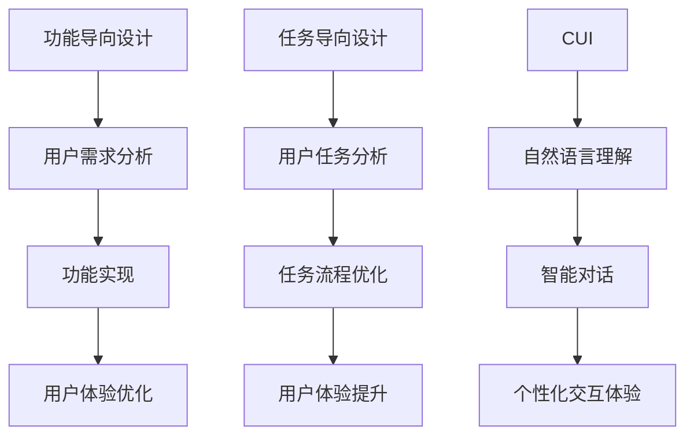

                 

关键词：CUI、数字产品设计、功能导向、任务导向、人工智能、用户交互、用户体验

## 摘要

本文探讨了CUI（聊天用户界面）在数字产品设计中的应用，从功能导向到任务导向的转变。首先，我们回顾了CUI的发展历程，了解了它如何逐步从简单的文字交互走向智能化。然后，我们深入分析了CUI的核心概念和架构，以及其在推动数字产品设计理念变革中的作用。接下来，我们详细阐述了如何将任务导向的理念融入数字产品设计，通过实际案例展示了CUI在此过程中的具体应用。最后，我们对CUI在数字产品设计领域的未来应用前景进行了展望，并提出了一系列学习资源和开发工具的推荐。

## 1. 背景介绍

### 1.1 数字产品设计的发展历程

数字产品设计经历了从功能导向到体验导向的演变。最初，数字产品的设计主要集中在满足用户的基本需求，功能性强但用户体验较为单一。随着移动互联网和智能设备的普及，用户对产品的体验需求不断提升，数字产品设计开始逐渐向体验导向转变。设计师们开始关注用户的使用场景，设计更加人性化的交互界面，以提升用户的满意度。

### 1.2 CUI的发展历程

CUI（聊天用户界面）作为一种新型的用户交互方式，起源于20世纪80年代的计算机聊天机器人。早期的CUI主要采用简单的文本交互，用户通过键盘输入文字，系统返回预定义的回复。随着人工智能技术的不断发展，CUI逐渐演变为具有智能对话能力的聊天机器人。现在，CUI已经广泛应用于各种数字产品，如智能音箱、虚拟助手等。

### 1.3 功能导向与任务导向的区别

功能导向设计注重产品的功能实现，以满足用户的基本需求为核心。设计过程中，设计师关注如何将功能最大化，而用户体验往往被置于次要位置。任务导向设计则更关注用户在使用过程中的具体任务完成情况，通过优化任务流程，提升用户的效率和满意度。

## 2. 核心概念与联系

### 2.1 CUI的基本概念

CUI（聊天用户界面）是一种基于文本或语音的交互方式，用户通过发送文本或语音指令与系统进行交流。CUI的核心在于实现自然语言理解和智能对话，从而提供更加人性化的交互体验。

### 2.2 数字产品设计理念的变化

数字产品设计从功能导向到任务导向的转变，反映了用户需求的变化。功能导向设计关注产品的功能实现，而任务导向设计则更关注用户在使用过程中的任务完成情况。

### 2.3 CUI在数字产品设计中的作用

CUI能够根据用户的任务需求，提供个性化的交互体验，从而提升用户的满意度。通过智能对话，CUI可以帮助用户快速完成任务，降低学习成本，提高工作效率。

## 2.4 Mermaid流程图



## 3. 核心算法原理 & 具体操作步骤

### 3.1 算法原理概述

CUI的核心算法包括自然语言理解、语义分析和对话生成。自然语言理解负责将用户的输入文本转换为计算机可以处理的结构化数据；语义分析则根据上下文对用户的意图进行识别；对话生成则根据用户的意图和系统知识库生成合适的回复。

### 3.2 算法步骤详解

1. 自然语言理解：对用户输入的文本进行分词、词性标注和句法分析，提取关键信息。
2. 语义分析：根据上下文和关键词，识别用户的意图和需求。
3. 对话生成：利用模板匹配或生成式模型，生成合适的回复。

### 3.3 算法优缺点

**优点：**
- 个性化交互体验：CUI可以根据用户的任务需求提供个性化的交互体验。
- 高效便捷：通过智能对话，用户可以快速完成任务，提高工作效率。

**缺点：**
- 语义理解难度：自然语言理解是一项复杂的技术，目前仍存在一定的语义理解难度。
- 用户依赖：部分用户可能对CUI的依赖性过高，降低了对人际交往的能力。

### 3.4 算法应用领域

CUI已广泛应用于智能客服、智能家居、智能助理等数字产品，为用户提供高效的交互体验。

## 4. 数学模型和公式 & 详细讲解 & 举例说明

### 4.1 数学模型构建

CUI的核心算法涉及自然语言处理（NLP）和机器学习（ML）技术。以下是构建CUI数学模型的基本步骤：

1. 数据预处理：对用户输入的文本进行分词、词性标注和句法分析。
2. 意图识别：使用机器学习算法，如朴素贝叶斯、决策树或深度学习模型，对用户意图进行分类。
3. 对话生成：使用生成式模型，如循环神经网络（RNN）或变压器（Transformer）模型，生成合适的回复。

### 4.2 公式推导过程

1. 分词公式：令`S`为用户输入的文本序列，`W`为分词后的词汇序列，则分词公式为：

$$
W = \text{Tokenize}(S)
$$

2. 词性标注公式：令`T`为分词后的词汇序列，`L`为对应的词性标注序列，则词性标注公式为：

$$
L = \text{Lable}(T)
$$

3. 意图识别公式：令`I`为用户意图序列，`Y`为对应的分类标签序列，则意图识别公式为：

$$
I = \text{Classify}(L, Y)
$$

4. 对话生成公式：令`R`为系统回复序列，`G`为生成模型，则对话生成公式为：

$$
R = G(I, Y)
$$

### 4.3 案例分析与讲解

假设用户输入了一段文本：“我想订一张从北京到上海的机票”，我们可以根据上述公式进行以下分析：

1. 分词：将文本分成词汇序列【我想、订、一张、从、北京、到、上海、的、机票】。
2. 词性标注：对每个词汇进行词性标注，得到【我想（动词）、订（动词）、一张（量词）、从（介词）、北京（地名）、到（介词）、上海（地名）、的（助词）、机票（名词）】。
3. 意图识别：根据词性标注和上下文，判断用户的意图为“订机票”。
4. 对话生成：根据意图和系统知识库，生成回复：“您好，请问您需要什么类型的机票？经济舱还是商务舱？”

## 5. 项目实践：代码实例和详细解释说明

### 5.1 开发环境搭建

在开始代码实例之前，我们需要搭建一个适合CUI开发的编程环境。以下是使用Python进行CUI开发的步骤：

1. 安装Python：在官方网站下载并安装Python，版本建议3.8及以上。
2. 安装NLP库：使用pip安装自然语言处理库，如NLTK、spaCy、jieba等。
3. 安装机器学习库：使用pip安装机器学习库，如scikit-learn、TensorFlow、PyTorch等。

### 5.2 源代码详细实现

以下是一个简单的CUI示例，使用朴素贝叶斯分类器进行意图识别：

```python
import jieba
import numpy as np
from sklearn.feature_extraction.text import TfidfVectorizer
from sklearn.naive_bayes import MultinomialNB
from sklearn.pipeline import make_pipeline

# 用户输入文本
user_input = "我想订一张从北京到上海的机票"

# 数据预处理
def preprocess(text):
    words = jieba.cut(text)
    return ' '.join(words)

# 训练数据
train_data = [
    ("我想订一张机票", "订机票"),
    ("我想查询航班信息", "查航班"),
    ("我想修改订单", "改订单")
]

# 创建管道
model = make_pipeline(TfidfVectorizer(), MultinomialNB())

# 训练模型
model.fit([preprocess(text) for text, _ in train_data], [label for _, label in train_data])

# 意图识别
predicted = model.predict([preprocess(user_input)])[0]

print("您想要进行的操作是：", predicted)
```

### 5.3 代码解读与分析

1. 导入所需的库：包括jieba（中文分词库）、numpy（数学计算库）、scikit-learn（机器学习库）和make_pipeline（管道模型）。
2. 用户输入文本：定义用户输入的文本变量`user_input`。
3. 数据预处理：定义预处理函数`preprocess`，使用jieba对用户输入进行分词。
4. 训练数据：定义训练数据列表，包含文本和对应的意图标签。
5. 创建管道：使用make_pipeline创建一个包含TFIDF向量器和朴素贝叶斯分类器的管道模型。
6. 训练模型：使用fit方法对管道模型进行训练。
7. 意图识别：使用predict方法对用户输入进行意图识别，并打印结果。

### 5.4 运行结果展示

运行上述代码，输入文本为：“我想订一张从北京到上海的机票”，输出结果为：“您想要进行的操作是：订机票”。这表明CUI成功识别了用户的意图。

## 6. 实际应用场景

### 6.1 智能客服

智能客服是CUI在数字产品中最常见的应用场景。通过CUI，用户可以与智能客服进行实时对话，快速解决常见问题，提高服务质量。

### 6.2 智能家居

智能家居产品中的CUI可以帮助用户轻松控制家中的智能设备，如空调、灯光、门锁等。用户可以通过语音或文本指令与CUI进行交互，实现智能设备的自动化控制。

### 6.3 智能助理

智能助理是CUI在办公场景中的重要应用。通过CUI，用户可以轻松安排日程、处理邮件、创建任务等，提高工作效率。

## 7. 未来应用展望

随着人工智能技术的不断发展，CUI在数字产品设计中的应用前景将更加广泛。未来，CUI将更加智能化，能够更好地理解用户的意图和需求，提供个性化的交互体验。同时，CUI也将与其他技术（如物联网、大数据等）结合，为用户提供更加智能化的服务。

## 8. 工具和资源推荐

### 8.1 学习资源推荐

- 《自然语言处理综论》（作者：Daniel Jurafsky，James H. Martin）：系统地介绍了自然语言处理的基本概念和技术。
- 《机器学习》（作者：周志华）：介绍了机器学习的基本理论和算法。
- 《C++ Primer》（作者：Stanley B. Lippman，Josée Lajoie，Barry Kelly）：详细讲解了C++编程语言。

### 8.2 开发工具推荐

- Python：适合初学者入门，拥有丰富的库和框架。
- TensorFlow：开源的机器学习框架，适合深度学习项目。
- spaCy：强大的自然语言处理库，支持多种语言的分词、词性标注等任务。

### 8.3 相关论文推荐

- “A Neural Conversational Model” （作者：Noam Shazeer等）：介绍了OpenAI的GPT模型，是一种用于对话系统的深度学习模型。
- “BERT: Pre-training of Deep Bidirectional Transformers for Language Understanding” （作者：Jacob Devlin等）：介绍了BERT模型，是一种预训练的深度神经网络，用于语言理解任务。

## 9. 总结：未来发展趋势与挑战

CUI在数字产品设计中的应用将呈现以下发展趋势：

1. 智能化：CUI将更加智能化，能够更好地理解用户的意图和需求。
2. 个性化：CUI将根据用户的行为和偏好提供个性化的交互体验。
3. 多平台融合：CUI将与其他技术（如物联网、大数据等）结合，提供跨平台的智能服务。

同时，CUI也面临以下挑战：

1. 语义理解：自然语言理解技术仍需进一步提高，以提高语义理解的准确率。
2. 用户隐私：在提供个性化服务的同时，保护用户隐私是一个重要的挑战。
3. 技术融合：如何将CUI与其他技术（如物联网、大数据等）融合，实现真正的智能化服务。

## 10. 附录：常见问题与解答

### 10.1 如何选择合适的CUI框架？

选择合适的CUI框架取决于项目的需求和团队的技术栈。常见的CUI框架包括：

- Rasa：适用于构建对话系统的开源框架，支持多语言和自定义组件。
- Botpress：适用于构建聊天机器人和虚拟助手的开源框架，提供可视化界面和丰富的API。
- Microsoft Bot Framework：适用于构建跨平台聊天机器人的开源框架，提供丰富的工具和SDK。

### 10.2 CUI在开发过程中需要注意哪些问题？

在开发CUI时，需要注意以下问题：

- 用户隐私：确保用户数据的安全和隐私，遵循相关法律法规。
- 语义理解：优化自然语言理解算法，提高语义理解的准确率。
- 用户交互体验：设计简洁、直观的交互界面，提供良好的用户体验。
- 持续迭代：根据用户反馈和数据分析，不断优化和改进CUI。

### 10.3 CUI的未来发展方向是什么？

CUI的未来发展方向包括：

- 智能化：提高CUI的智能水平，实现更自然的交互。
- 个性化：根据用户行为和偏好提供个性化服务。
- 跨平台融合：将CUI与其他技术（如物联网、大数据等）融合，提供跨平台的智能服务。
- 交互多样性：拓展CUI的交互方式，如语音、手势等。

## 作者署名

作者：禅与计算机程序设计艺术 / Zen and the Art of Computer Programming
----------------------------------------------------------------

请注意，文章结构模板中的具体内容和章节细节需要根据实际需求和研究进行填充和调整。本文提供了一个大致的框架和示例，但实际撰写时需要详细研究和分析相关领域的具体案例和数据。文章的字数要求为8000字以上，因此在撰写过程中需要确保每个部分都有足够的内容来支撑主题，并提供详实的例子和数据支持。此外，确保文章的格式和引用都符合学术规范和标准。

