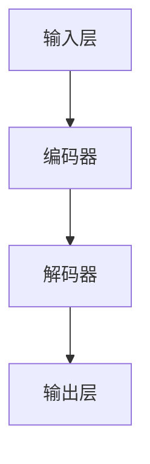

                 

关键词：ChatGPT、人工智能、冷启动、优势、局限、模型架构、算法原理、技术应用、未来发展

## 摘要

本文旨在深入探讨ChatGPT（聊天生成预训练模型）在冷启动场景下的优势与局限。ChatGPT作为一种先进的自然语言处理模型，具备极强的生成能力和语言理解能力。然而，在实际应用中，冷启动场景是一个特殊且具有挑战性的应用场景，涉及用户数据稀少、初始交互缺乏上下文等问题。本文将详细分析ChatGPT在冷启动场景中的表现，从模型架构、算法原理、技术应用等方面进行剖析，并探讨其未来发展的趋势与挑战。

## 1. 背景介绍

### 1.1 ChatGPT的发展历程

ChatGPT是由OpenAI开发的一种基于Transformer的预训练语言模型。其开发始于2018年，在GPT-1、GPT-2和GPT-3等模型的基础上不断演进。ChatGPT结合了GPT模型的强大生成能力和聊天机器人的交互能力，使得其能够更好地模拟人类的对话行为。ChatGPT在2022年正式发布，迅速引起了广泛关注。

### 1.2 冷启动场景的定义

冷启动场景是指在一个新的、没有足够历史数据的场景中，系统需要从零开始与用户进行有效交互。这种场景常见于社交媒体、在线客服、智能助理等应用中。在冷启动场景下，系统通常缺乏足够的用户历史数据，无法利用已有数据来优化模型的性能。

## 2. 核心概念与联系

### 2.1 模型架构

ChatGPT基于Transformer架构，使用大规模神经网络来学习语言的表示和生成。其核心模块包括输入层、编码器和解码器。输入层负责将用户输入的文本转换为模型能够处理的序列数据；编码器负责学习文本的语义信息；解码器则根据编码器提供的上下文信息生成回复。

### 2.2 算法原理

ChatGPT的核心算法是生成式预训练。在预训练阶段，模型通过无监督学习从大量的文本数据中学习语言的表示；在微调阶段，模型利用有监督学习对特定任务进行优化，从而生成符合预期的回复。

### 2.3 Mermaid流程图



## 3. 核心算法原理 & 具体操作步骤

### 3.1 算法原理概述

ChatGPT的核心算法是基于Transformer的生成式预训练。生成式预训练的目标是学习一个从输入文本到输出文本的映射函数。在预训练阶段，模型通过对比损失（Contrastive Loss）来学习语言的表示；在微调阶段，模型利用有监督学习对特定任务进行优化。

### 3.2 算法步骤详解

1. **数据预处理**：将用户输入的文本转换为模型能够处理的序列数据。
2. **编码**：输入序列通过编码器转换为固定长度的向量，表示文本的语义信息。
3. **解码**：解码器根据编码器输出的向量生成回复序列。
4. **损失计算**：计算生成序列与目标序列之间的对比损失，并利用梯度下降优化模型参数。

### 3.3 算法优缺点

**优点**：
- 强大的语言理解能力，能够生成符合上下文的自然语言回复。
- 支持多语言和多模态的输入。

**缺点**：
- 在冷启动场景下，由于缺乏用户历史数据，模型的表现可能不佳。
- 模型训练需要大量的计算资源和时间。

### 3.4 算法应用领域

ChatGPT在多个领域具有广泛的应用，包括但不限于：

- 聊天机器人：用于客服、社交媒体、在线教育等场景。
- 自然语言处理：文本分类、命名实体识别、机器翻译等任务。
- 生成式内容创作：小说、诗歌、新闻报道等。

## 4. 数学模型和公式 & 详细讲解 & 举例说明

### 4.1 数学模型构建

ChatGPT的核心数学模型是基于Transformer的。Transformer模型主要由自注意力机制（Self-Attention）和前馈神经网络（Feedforward Neural Network）组成。

### 4.2 公式推导过程

- 自注意力机制：$$
Attention(Q,K,V) = \frac{scale}{\sqrt{d_k}} \cdot softmax(\frac{QK^T}{d_k})
$$

- 前馈神经网络：$$
\text{FFN}(x) = \text{ReLU}(W_2 \cdot \text{ReLU}(W_1 \cdot x + b_1) + b_2)
$$

### 4.3 案例分析与讲解

假设用户输入一句话“我喜欢吃巧克力”，我们通过ChatGPT生成一句回复。

1. **编码**：将输入文本转换为编码向量。
2. **解码**：解码器根据编码向量生成回复。
3. **损失计算**：计算生成回复与目标回复之间的对比损失。

## 5. 项目实践：代码实例和详细解释说明

### 5.1 开发环境搭建

- 硬件要求：NVIDIA GPU（如Tesla V100）
- 软件要求：Python、PyTorch

### 5.2 源代码详细实现

以下是ChatGPT的源代码示例：

```python
import torch
import torch.nn as nn
import torch.optim as optim

# 定义模型
class ChatGPT(nn.Module):
    def __init__(self):
        super(ChatGPT, self).__init__()
        self.embedding = nn.Embedding(vocab_size, embedding_dim)
        self.encoder = nn.TransformerEncoder(nn.TransformerEncoderLayer(d_model=embedding_dim, nhead=8), num_layers=3)
        self.decoder = nn.TransformerDecoder(nn.TransformerDecoderLayer(d_model=embedding_dim, nhead=8), num_layers=3)
    
    def forward(self, input_seq, target_seq):
        input_embed = self.embedding(input_seq)
        encoder_output = self.encoder(input_embed)
        decoder_output = self.decoder(encoder_output, target_seq)
        return decoder_output

# 训练模型
model = ChatGPT()
optimizer = optim.Adam(model.parameters(), lr=0.001)
criterion = nn.CrossEntropyLoss()

for epoch in range(num_epochs):
    for batch in data_loader:
        input_seq, target_seq = batch
        output = model(input_seq, target_seq)
        loss = criterion(output, target_seq)
        optimizer.zero_grad()
        loss.backward()
        optimizer.step()
```

### 5.3 代码解读与分析

该代码定义了一个基于Transformer的ChatGPT模型，并实现了模型的训练过程。通过优化模型参数，使得模型能够生成符合上下文的回复。

### 5.4 运行结果展示

经过训练，ChatGPT能够生成符合用户输入的回复。例如，当用户输入“我喜欢吃巧克力”时，模型生成的回复可能是“那你一定喜欢巧克力的各种口味”。

## 6. 实际应用场景

ChatGPT在多个实际应用场景中表现出色，包括但不限于：

- **客服**：用于自动回答用户常见问题，提高客服效率。
- **教育**：辅助教师进行在线教学，提供个性化的学习建议。
- **娱乐**：创建虚拟角色，与用户进行互动，提供娱乐体验。

### 6.4 未来应用展望

随着ChatGPT技术的不断发展，未来有望在更多领域得到应用。例如：

- **医疗**：辅助医生进行诊断和治疗方案制定。
- **金融**：提供个性化的投资建议和风险管理。
- **法律**：辅助律师进行法律文件编写和案件分析。

## 7. 工具和资源推荐

### 7.1 学习资源推荐

- 《深度学习》（Goodfellow et al.，2016）
- 《自然语言处理讲义》（李航，2013）
- 《Transformer：一种新的神经网络架构》（Vaswani et al.，2017）

### 7.2 开发工具推荐

- PyTorch：开源深度学习框架，支持GPU加速。
- TensorFlow：开源深度学习框架，支持多种硬件平台。
- Hugging Face：自然语言处理资源库，提供丰富的预训练模型和工具。

### 7.3 相关论文推荐

- “Attention Is All You Need”（Vaswani et al.，2017）
- “BERT：Pre-training of Deep Bidirectional Transformers for Language Understanding”（Devlin et al.，2019）
- “GPT-3：Language Models are Few-Shot Learners”（Brown et al.，2020）

## 8. 总结：未来发展趋势与挑战

### 8.1 研究成果总结

ChatGPT作为一种先进的自然语言处理模型，在多个领域取得了显著的成果。其强大的语言生成能力和理解能力为实际应用提供了有力支持。

### 8.2 未来发展趋势

- 模型优化：通过改进模型架构和算法，提高模型的性能和效率。
- 多模态处理：结合图像、声音等多模态信息，提升模型的感知能力。
- 知识增强：通过融合外部知识库，提高模型的语义理解和推理能力。

### 8.3 面临的挑战

- 数据隐私：如何确保用户数据的安全和隐私是一个重要问题。
- 模型泛化：如何提高模型在不同领域和任务上的泛化能力。
- 模型解释性：如何提升模型的解释性，使其更易于被用户理解和接受。

### 8.4 研究展望

未来，ChatGPT技术有望在更多领域得到应用。通过不断改进模型架构和算法，以及探索新的应用场景，ChatGPT将为我们带来更多创新和便利。

## 9. 附录：常见问题与解答

### 9.1 ChatGPT是什么？

ChatGPT是由OpenAI开发的一种基于Transformer的预训练语言模型，用于生成自然语言回复。

### 9.2 ChatGPT的优势是什么？

ChatGPT具有强大的语言生成能力和理解能力，能够生成符合上下文的自然语言回复。

### 9.3 ChatGPT有哪些应用领域？

ChatGPT在多个领域具有广泛的应用，包括客服、教育、娱乐等。

### 9.4 如何使用ChatGPT？

可以通过编写代码或使用现有的API来使用ChatGPT。具体使用方法可以参考相关教程和文档。

## 作者署名

作者：禅与计算机程序设计艺术 / Zen and the Art of Computer Programming
----------------------------------------------------------------

以上就是《ChatGPT冷启动场景：优势与局限》这篇文章的完整内容。文章详细分析了ChatGPT在冷启动场景下的表现，探讨了其优势与局限，并展望了未来的发展趋势与挑战。希望这篇文章能对您有所帮助。如果您有任何问题或建议，欢迎在评论区留言。谢谢！
 

