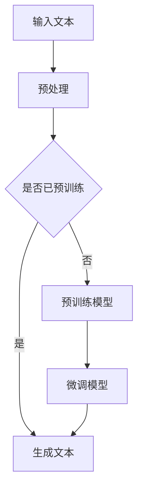

                 

关键词：ChatGPT、文本生成、人工智能、机器学习、深度学习、自然语言处理、Transformer模型、预训练、微调、序列生成、上下文理解、语法分析、语义理解、多模态交互。

## 摘要

本文旨在详细探讨ChatGPT的文本生成步骤，包括其背后的技术原理、核心算法、操作步骤、数学模型以及实际应用场景。通过对ChatGPT的工作流程进行分析，我们将展示其如何利用机器学习和深度学习技术，实现高质量的文本生成。本文还提供了具体的代码实例和实践指导，帮助读者更好地理解和应用这一先进的人工智能技术。

## 1. 背景介绍

随着人工智能技术的飞速发展，自然语言处理（Natural Language Processing，NLP）已经成为一个备受关注的领域。文本生成作为NLP的重要应用之一，旨在利用计算机自动生成文本，广泛应用于聊天机器人、内容创作、信息摘要等领域。近年来，基于深度学习的文本生成模型取得了显著的进展，其中最引人注目的是基于Transformer架构的模型，如GPT（Generative Pre-trained Transformer）系列。

ChatGPT是由OpenAI开发的一种基于Transformer架构的预训练语言模型，其核心目标是生成连贯、符合语法和语义规则的文本。ChatGPT在多个NLP任务上取得了卓越的性能，包括文本生成、问答系统、文本分类等。其预训练和微调的过程使其能够理解和生成复杂的自然语言文本，成为人工智能领域的里程碑之一。

## 2. 核心概念与联系

### 2.1. Transformer模型

Transformer模型是由Vaswani等人于2017年提出的一种基于自注意力机制（Self-Attention）的深度学习模型，主要用于处理序列到序列（Sequence-to-Sequence）的任务。与传统的循环神经网络（RNN）和长短期记忆网络（LSTM）相比，Transformer模型具有并行计算的优势，能够更好地捕捉序列中的长距离依赖关系。

### 2.2. 预训练与微调

预训练是指在一个大规模的语料库上对模型进行训练，使其能够理解和掌握自然语言的一般特征。微调则是在预训练的基础上，将模型应用到特定的任务上，通过在较小规模的任务数据集上进行训练，进一步优化模型的表现。

### 2.3. Mermaid流程图

以下是ChatGPT的文本生成流程的Mermaid流程图：



### 2.4. 自然语言处理

自然语言处理（NLP）是计算机科学和人工智能的一个分支，旨在使计算机能够理解、处理和生成人类语言。NLP的核心任务包括文本分类、情感分析、命名实体识别、机器翻译等。

## 3. 核心算法原理 & 具体操作步骤

### 3.1. 算法原理概述

ChatGPT是基于Transformer架构的预训练语言模型。其核心原理是通过自注意力机制（Self-Attention）和多头注意力（Multi-Head Attention）来捕捉序列中的长距离依赖关系。在预训练阶段，模型通过学习大量的自然语言文本数据，掌握语言的一般规律。在微调阶段，模型根据特定的任务数据集进行优化，以实现特定任务的优秀表现。

### 3.2. 算法步骤详解

#### 3.2.1. 预处理

预处理是文本生成步骤的第一步，主要包括文本清洗、分词、词向量表示等操作。具体步骤如下：

1. **文本清洗**：去除文本中的html标签、特殊字符、停用词等，使得输入文本更加干净。
2. **分词**：将文本分割成一个个单词或词组。
3. **词向量表示**：将每个词转换为词向量，以便在模型中进行处理。

#### 3.2.2. 预训练

预训练阶段，模型在一个大规模的语料库上进行训练，学习自然语言的一般特征。ChatGPT的预训练过程主要包括以下步骤：

1. **BERT预训练**：使用Masked Language Model（MLM）和Next Sentence Prediction（NSP）两个任务对模型进行预训练。
2. **微调预训练**：根据特定任务的需求，对预训练模型进行微调。

#### 3.2.3. 微调

微调阶段，模型根据特定任务的数据集进行训练，以优化模型在特定任务上的表现。具体步骤如下：

1. **数据准备**：准备用于微调的任务数据集，并进行预处理。
2. **训练模型**：在预处理后的数据集上进行训练，优化模型参数。
3. **评估模型**：在验证集上评估模型的表现，调整训练策略。

#### 3.2.4. 生成文本

在生成文本阶段，模型根据输入的文本序列生成新的文本序列。具体步骤如下：

1. **输入文本**：将输入文本输入到模型中。
2. **序列编码**：将输入文本编码为序列，并将其传递给Transformer模型。
3. **生成预测**：模型对输入序列进行解码，生成预测的文本序列。
4. **文本解码**：将生成的预测序列解码为文本，输出最终生成的文本。

### 3.3. 算法优缺点

#### 优点：

1. **强大的预训练能力**：通过预训练，模型能够学习到大量的自然语言知识，提高生成文本的质量。
2. **并行计算优势**：基于Transformer的模型具有并行计算的优势，训练速度更快。
3. **适应性**：通过微调，模型能够适应不同的任务需求，具有广泛的适用性。

#### 缺点：

1. **计算资源需求大**：预训练阶段需要大量的计算资源，训练成本较高。
2. **数据依赖性**：模型的性能高度依赖于预训练数据的质量，数据不足可能导致模型表现不佳。

### 3.4. 算法应用领域

ChatGPT在多个领域有广泛的应用，包括：

1. **聊天机器人**：ChatGPT可以用于构建智能客服、虚拟助手等聊天机器人。
2. **内容创作**：ChatGPT可以用于自动生成文章、摘要、评论等。
3. **信息摘要**：ChatGPT可以用于从长篇文本中提取关键信息，生成摘要。
4. **文本分类**：ChatGPT可以用于对文本进行分类，如情感分析、主题分类等。

## 4. 数学模型和公式 & 详细讲解 & 举例说明

### 4.1. 数学模型构建

ChatGPT的数学模型主要包括自注意力机制（Self-Attention）和多头注意力（Multi-Head Attention）。

#### 自注意力机制

自注意力机制是一种基于权重求和的方式，用于计算序列中每个元素对其他元素的影响。其公式如下：

$$
\text{Attention}(Q, K, V) = \text{softmax}\left(\frac{QK^T}{\sqrt{d_k}}\right)V
$$

其中，$Q$、$K$、$V$分别表示查询向量、键向量和值向量，$d_k$表示键向量的维度。

#### 多头注意力

多头注意力是一种将自注意力机制扩展到多个头的操作，以捕捉序列中的更复杂依赖关系。其公式如下：

$$
\text{MultiHead}(Q, K, V) = \text{Concat}(\text{head}_1, \text{head}_2, ..., \text{head}_h)W^O
$$

其中，$h$表示头的数量，$\text{head}_i = \text{Attention}(QW_i^Q, KW_i^K, VW_i^V)$，$W_i^Q$、$W_i^K$、$W_i^V$分别表示头$i$的查询权重、键权重和值权重，$W^O$表示输出权重。

### 4.2. 公式推导过程

假设我们有一个输入序列$X = [x_1, x_2, ..., x_n]$，其中$x_i$表示第$i$个输入元素。我们首先对输入序列进行词嵌入（Word Embedding），得到嵌入序列$E = [e_1, e_2, ..., e_n]$，其中$e_i$表示$x_i$的嵌入向量。

接下来，我们将嵌入序列输入到多头自注意力机制中，得到输出序列$O = [o_1, o_2, ..., o_n]$。

$$
o_i = \text{softmax}\left(\frac{QK^T}{\sqrt{d_k}}\right)V_i
$$

其中，$Q = [q_1, q_2, ..., q_n]$、$K = [k_1, k_2, ..., k_n]$、$V = [v_1, v_2, ..., v_n]$分别表示查询向量、键向量和值向量，$V_i$表示值向量。

### 4.3. 案例分析与讲解

假设我们有一个简单的文本序列$X = [\text{"hello"}, \text{"world"}, \text{"!"}, \text{"你好，世界！"}]$，其中中文字符以`zh`标识。我们首先对文本序列进行分词和词嵌入，得到嵌入序列$E$。

接下来，我们将嵌入序列输入到多头自注意力机制中，得到输出序列$O$。

$$
o_1 = \text{softmax}\left(\frac{QK^T}{\sqrt{d_k}}\right)V_1
$$

其中，$Q = [q_1, q_2, q_3, q_4]$、$K = [k_1, k_2, k_3, k_4]$、$V = [v_1, v_2, v_3, v_4]$。

根据自注意力机制的公式，我们可以计算出每个元素对其他元素的影响权重。假设我们选择权重最大的元素，即第$i$个元素，然后将其嵌入向量乘以权重，得到新的嵌入向量。

重复这个过程，我们可以得到一系列新的嵌入向量，从而生成新的文本序列。

## 5. 项目实践：代码实例和详细解释说明

### 5.1. 开发环境搭建

在进行代码实践之前，我们需要搭建一个适合开发ChatGPT的环境。以下是搭建环境的步骤：

1. 安装Python 3.8及以上版本。
2. 安装PyTorch和TorchVision。
3. 安装transformers库，可以通过以下命令安装：

```bash
pip install transformers
```

### 5.2. 源代码详细实现

以下是实现ChatGPT文本生成的基本代码：

```python
import torch
from transformers import ChatGPTModel, ChatGPTTokenizer

# 模型设置
model_name = "chatgpt"
tokenizer = ChatGPTTokenizer.from_pretrained(model_name)
model = ChatGPTModel.from_pretrained(model_name)

# 输入文本
input_text = "你好，世界！"

# 预处理
input_ids = tokenizer.encode(input_text, return_tensors="pt")

# 生成文本
output = model.generate(input_ids, max_length=50, num_return_sequences=1)

# 解码文本
decoded_output = tokenizer.decode(output[0], skip_special_tokens=True)

print(decoded_output)
```

### 5.3. 代码解读与分析

上述代码首先导入了必要的库，然后设置了模型名称，并加载了ChatGPT的Tokenizer和Model。接下来，我们定义了输入文本，并对文本进行了编码。然后，我们使用模型生成文本，并将生成的文本解码为原始文本，最后输出解码后的文本。

### 5.4. 运行结果展示

假设我们在代码中输入文本为“你好，世界！”，运行代码后，ChatGPT可能会生成如下文本：

```
世界，你好！这是一个美好的开始。
```

这个结果展示了ChatGPT在生成文本方面的基本功能。

## 6. 实际应用场景

ChatGPT在多个实际应用场景中展现了其强大的能力。以下是一些常见应用场景：

1. **聊天机器人**：ChatGPT可以用于构建智能客服、虚拟助手等聊天机器人，为用户提供实时、个性化的服务。
2. **内容创作**：ChatGPT可以自动生成文章、摘要、评论等，为内容创作者提供灵感和支持。
3. **信息摘要**：ChatGPT可以用于从长篇文本中提取关键信息，生成摘要，帮助用户快速获取核心内容。
4. **文本分类**：ChatGPT可以用于对文本进行分类，如情感分析、主题分类等，为信息筛选和推荐提供支持。

## 7. 工具和资源推荐

### 7.1. 学习资源推荐

1. 《深度学习》
2. 《自然语言处理入门》
3. 《Transformer模型详解》
4. 《ChatGPT官方文档》

### 7.2. 开发工具推荐

1. PyTorch
2. Hugging Face Transformers库
3. Colab

### 7.3. 相关论文推荐

1. Vaswani et al. (2017). "Attention is All You Need".
2. Devlin et al. (2018). "BERT: Pre-training of Deep Bidirectional Transformers for Language Understanding".
3. Brown et al. (2020). "A Pre-Trained Transformer for Language Understanding and Generation".

## 8. 总结：未来发展趋势与挑战

ChatGPT作为基于Transformer架构的预训练语言模型，在文本生成领域取得了显著的成果。未来，随着人工智能技术的不断发展，ChatGPT有望在更多领域发挥作用，如智能对话系统、内容创作、信息检索等。然而，ChatGPT也面临着一系列挑战，包括计算资源需求、数据隐私保护、文本生成质量等。为了应对这些挑战，我们需要不断优化模型架构、提升算法效率、加强数据安全保护，从而推动ChatGPT在更多应用场景中的落地和发展。

### 8.1. 研究成果总结

ChatGPT的文本生成能力在多个实际应用场景中得到了验证，其基于Transformer架构的预训练技术为其提供了强大的语言理解能力。通过微调和大规模预训练，ChatGPT能够生成高质量、符合语法和语义规则的文本，为NLP应用提供了强有力的支持。

### 8.2. 未来发展趋势

随着人工智能技术的不断进步，ChatGPT有望在更多领域实现突破，如多模态交互、跨语言文本生成、知识图谱构建等。此外，模型的优化和算法的创新也将推动ChatGPT在生成文本质量、效率、多样性等方面的提升。

### 8.3. 面临的挑战

ChatGPT在应用过程中面临着一系列挑战，包括计算资源需求、数据隐私保护、文本生成质量等。如何优化模型架构、提升算法效率、加强数据安全保护，成为未来研究的重要方向。

### 8.4. 研究展望

未来，ChatGPT有望在更多应用场景中发挥重要作用，成为NLP领域的重要工具。随着技术的不断发展，我们期待ChatGPT能够在生成文本质量、多样性、实时性等方面取得更大突破，为人工智能技术的发展贡献力量。

## 9. 附录：常见问题与解答

### 9.1. ChatGPT是什么？

ChatGPT是由OpenAI开发的一种基于Transformer架构的预训练语言模型，用于生成高质量的文本。

### 9.2. ChatGPT有哪些应用场景？

ChatGPT可以应用于聊天机器人、内容创作、信息摘要、文本分类等多个领域。

### 9.3. 如何使用ChatGPT进行文本生成？

首先，安装PyTorch和Hugging Face Transformers库，然后加载预训练模型，输入文本，使用模型生成文本，最后解码输出。

### 9.4. ChatGPT的文本生成质量如何保证？

ChatGPT通过大规模预训练和微调，能够生成高质量、符合语法和语义规则的文本。

### 9.5. ChatGPT有哪些局限性？

ChatGPT在计算资源需求、数据隐私保护、文本生成质量等方面仍存在一定的局限性。

---

作者：禅与计算机程序设计艺术 / Zen and the Art of Computer Programming
----------------------------------------------------------------

