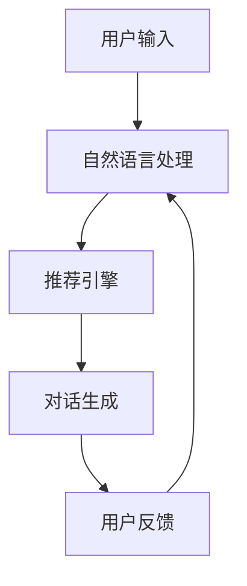

                 

关键词：交互式推荐系统，预训练语言模型，用户反馈，个性化推荐，对话生成，自适应学习

## 摘要

本文介绍了一种基于预训练语言模型（LLM）的交互式推荐系统——Chat-REC。该系统通过结合自然语言处理（NLP）和机器学习技术，实现了用户与推荐系统的实时对话，从而在获取用户反馈的基础上提供个性化的推荐服务。本文将详细阐述Chat-REC系统的架构、核心算法、数学模型及其实践应用，并探讨其在实际场景中的优势和未来发展。

## 1. 背景介绍

随着互联网技术的迅猛发展，用户生成内容（UGC）的数量呈爆炸性增长。推荐系统作为提高用户满意度和粘性的关键技术，已成为各大互联网公司竞相布局的领域。传统的推荐系统主要基于用户历史行为数据、内容特征以及协同过滤等方法，虽然在一定程度上提高了推荐的准确性，但仍存在以下问题：

1. **信息获取受限**：传统推荐系统依赖于用户的历史行为数据，但在信息爆炸的时代，用户的兴趣和偏好可能发生变化，历史数据无法完全反映当前需求。
2. **缺乏实时交互**：用户与推荐系统之间的互动通常是单向的，缺乏实时反馈机制，无法根据用户的即时需求进行调整。
3. **推荐质量不高**：推荐结果往往受到数据质量和特征提取方法的影响，容易出现推荐过度拟合或推荐偏差。

为了解决这些问题，本文提出了一种基于LLM的交互式推荐系统Chat-REC，通过自然语言处理和对话生成技术，实现用户与推荐系统之间的实时互动，从而提高推荐系统的自适应性和个性化水平。

### 1.1 预训练语言模型（LLM）

预训练语言模型（LLM）是通过在大规模语料库上进行预训练，使模型具备理解、生成和翻译自然语言的能力。近年来，基于Transformer架构的LLM，如GPT-3、BERT等，取得了显著的进展。这些模型通过在文本数据上进行预训练，可以捕捉到语言的深层结构和语义信息，从而在多种NLP任务上取得了优异的性能。

### 1.2 交互式推荐系统

交互式推荐系统是指用户与推荐系统之间可以实时互动的推荐系统。通过对话生成和自然语言处理技术，交互式推荐系统可以理解用户的意图和需求，并根据用户的反馈进行动态调整，从而提供更加个性化的推荐服务。交互式推荐系统的优势在于：

1. **实时性**：用户可以即时获得推荐结果，并获得实时反馈。
2. **个性化**：系统可以根据用户的实时反馈，动态调整推荐策略，提高推荐质量。
3. **互动性**：用户可以通过对话与推荐系统互动，表达自己的需求和偏好。

## 2. 核心概念与联系

### 2.1 Chat-REC系统架构

Chat-REC系统的核心架构包括以下几个部分：

1. **用户接口**：用户通过聊天界面与推荐系统进行交互，输入问题或需求。
2. **自然语言处理（NLP）模块**：负责处理用户的输入，提取关键信息，并将其转换为机器可理解的形式。
3. **推荐引擎**：基于用户输入和历史数据，利用机器学习算法生成推荐结果。
4. **对话生成模块**：根据推荐结果和用户反馈，生成自然、流畅的回复，引导用户进行进一步的互动。

### 2.2 Mermaid流程图



### 2.3 核心算法原理

Chat-REC系统的核心算法包括自然语言处理（NLP）和机器学习推荐算法。NLP模块主要使用词向量模型（如Word2Vec、BERT）对用户输入进行语义分析，提取关键信息。推荐引擎则采用基于协同过滤、矩阵分解等传统推荐算法，结合用户历史行为和内容特征生成推荐结果。对话生成模块使用生成式模型（如GPT-3），根据上下文和用户反馈生成自然语言回复。

## 3. 核心算法原理 & 具体操作步骤

### 3.1 算法原理概述

Chat-REC系统的工作原理可以概括为以下几个步骤：

1. **用户输入**：用户通过聊天界面输入问题或需求。
2. **NLP处理**：系统利用NLP技术对用户输入进行语义分析，提取关键信息。
3. **推荐计算**：推荐引擎根据提取的关键信息和用户历史行为数据，生成推荐结果。
4. **对话生成**：对话生成模块根据推荐结果和用户反馈，生成自然语言回复。
5. **用户反馈**：用户对回复进行评价，系统根据反馈调整推荐策略。

### 3.2 算法步骤详解

1. **用户输入**：用户在聊天界面输入问题或需求，例如“推荐一部科幻电影”。

2. **NLP处理**：系统首先对用户输入进行分词和词性标注，提取关键信息，如“推荐”、“科幻”、“电影”。然后，使用词向量模型（如BERT）将文本转换为向量表示，以便进行后续计算。

   $$\text{input\_text} \rightarrow \text{word\_embeddings}$$

3. **推荐计算**：推荐引擎根据提取的关键信息，从用户历史行为数据中找出与输入相关的项目。例如，系统可以查询用户之前观看的电影，以及用户对这些电影的评分。然后，利用协同过滤算法（如基于用户的协同过滤）生成推荐列表。

   $$\text{user\_history} \rightarrow \text{similar\_users} \rightarrow \text{recommendation\_list}$$

4. **对话生成**：对话生成模块根据推荐结果和用户反馈，生成自然语言回复。例如，如果用户输入“推荐一部科幻电影”，系统可以回复：“我为您推荐了《星际穿越》和《流浪地球》，这两部影片都非常值得一看。”

5. **用户反馈**：用户对回复进行评价，如“好的，我会考虑观看《星际穿越》”。系统记录用户反馈，并根据反馈调整推荐策略，提高推荐质量。

### 3.3 算法优缺点

#### 优点

1. **个性化**：Chat-REC系统可以根据用户实时反馈进行动态调整，提高推荐质量。
2. **实时性**：系统可以实时响应用户需求，提供快速推荐。
3. **互动性**：用户与系统进行实时对话，表达需求和偏好。

#### 缺点

1. **计算成本**：由于涉及自然语言处理和机器学习算法，系统计算成本较高。
2. **数据依赖**：系统效果依赖于用户历史数据和输入质量。

### 3.4 算法应用领域

Chat-REC系统可以应用于多个领域，如电子商务、在线娱乐、社交网络等。以下是一些具体应用案例：

1. **电子商务**：系统可以根据用户购物记录和反馈，推荐相关商品。
2. **在线娱乐**：系统可以根据用户观看历史和偏好，推荐电影、电视剧、音乐等。
3. **社交网络**：系统可以根据用户互动行为，推荐相关话题和用户。

## 4. 数学模型和公式 & 详细讲解 & 举例说明

### 4.1 数学模型构建

Chat-REC系统中的数学模型主要包括词向量模型、协同过滤算法和生成式模型。以下分别介绍这些模型的数学表示。

#### 4.1.1 词向量模型

词向量模型将文本数据转换为向量表示，以便进行后续计算。常用的词向量模型包括Word2Vec和BERT。

1. **Word2Vec**：Word2Vec是一种基于神经网络的语言模型，通过训练得到词向量表示。词向量的计算公式如下：

   $$\text{word\_embeddings} = \text{NN}(\text{input\_text})$$

2. **BERT**：BERT是一种基于Transformer架构的预训练语言模型，通过在大量文本数据上进行预训练，得到词向量和句子表示。BERT的输入和输出分别为：

   $$\text{input} = \text{[CLS], tokens, \text{[SEP]}]$$
   $$\text{output} = \text{[CLS]}_ \text{logits}$$

#### 4.1.2 协同过滤算法

协同过滤算法是一种基于用户相似度的推荐算法。假设用户集合为$U=\{\text{u}_1, \text{u}_2, ..., \text{u}_m\}$，项目集合为$I=\{\text{i}_1, \text{i}_2, ..., \text{i}_n\}$，用户$u$对项目$i$的评分为$R_{ui}$。协同过滤算法的目标是预测用户$u$对未知项目$i$的评分$R_{ui'}$。

1. **基于用户的协同过滤**：基于用户的协同过滤算法通过计算用户之间的相似度，找到与目标用户相似的其他用户，并从这些用户的历史行为中获取推荐项目。

   $$\text{similarity}(u, v) = \frac{\sum_{i \in I} R_{ui} R_{vi}}{\sqrt{\sum_{i \in I} R_{ui}^2 \sum_{i \in I} R_{vi}^2}}$$

   $$\text{recommendation}(u) = \text{argmax}_{i'} \sum_{v \in \text{similar\_users}(u)} R_{vi'}$$

2. **基于项目的协同过滤**：基于项目的协同过滤算法通过计算项目之间的相似度，找到与目标项目相似的其他项目，并从这些项目的用户历史行为中获取推荐用户。

   $$\text{similarity}(i, j) = \frac{\sum_{u \in U} R_{ui} R_{uj}}{\sqrt{\sum_{u \in U} R_{ui}^2 \sum_{u \in U} R_{uj}^2}}$$

   $$\text{recommendation}(i) = \text{argmax}_{u'} \sum_{j \in \text{similar\_items}(i)} R_{u'j}$$

#### 4.1.3 生成式模型

生成式模型是一种基于概率模型的对话生成算法。假设对话序列为$D=\{\text{d}_1, \text{d}_2, ..., \text{d}_t\}$，其中$d_t$表示第$t$个对话。生成式模型的目标是生成与输入对话序列相似的对话序列。

1. **循环神经网络（RNN）**：RNN是一种基于序列数据的循环神经网络，可以用于对话生成。RNN的输入和输出分别为：

   $$\text{input} = \text{[d}_1, \text{d}_2, ..., \text{d}_{t-1}]$$
   $$\text{output} = \text{d}_t$$

   $$\text{output} = \text{softmax}(\text{RNN}(\text{input}))$$

2. **变分自编码器（VAE）**：VAE是一种基于概率生成模型的生成式模型，可以生成与输入数据相似的对话序列。VAE的输入和输出分别为：

   $$\text{input} = \text{[d}_1, \text{d}_2, ..., \text{d}_{t-1}]$$
   $$\text{output} = \text{d}_t$$

   $$\text{z} \sim \text{q}(\text{z}|\text{x})$$
   $$\text{x} \sim \text{p}(\text{x}|\text{z})$$

### 4.2 公式推导过程

为了更深入地理解Chat-REC系统中的数学模型，下面分别介绍词向量模型、协同过滤算法和生成式模型的推导过程。

#### 4.2.1 词向量模型

1. **Word2Vec**：Word2Vec是基于神经网络的词向量模型，通过训练得到词向量表示。假设输入文本序列为$X=\{\text{x}_1, \text{x}_2, ..., \text{x}_T\}$，其中$\text{x}_t$表示第$t$个词。Word2Vec的目标是学习一个权重矩阵$W$，使得输入词的表示与输出词的表示相近。

   $$\text{y} = \text{softmax}(W \text{x})$$

   $$\text{L} = -\sum_{t=1}^T \sum_{i=1}^V \text{y}_{it} \log \text{p}_{it}$$

   其中，$\text{y}_{it}$表示词向量$w_i$在输入词$x_t$下的概率，$\text{p}_{it}$表示输入词$x_t$在输出词$w_i$下的概率。

2. **BERT**：BERT是基于Transformer架构的预训练语言模型，通过在大量文本数据上进行预训练，得到词向量和句子表示。BERT的输入和输出分别为：

   $$\text{input} = \text{[CLS], tokens, \text{[SEP]}]$$
   $$\text{output} = \text{[CLS]}_ \text{logits}$$

   $$\text{output} = \text{softmax}(\text{Transformer}(\text{input}))$$

   $$\text{L} = -\sum_{t=1}^T \text{y}_{t} \log \text{p}_{t}$$

   其中，$\text{y}_{t}$表示输入序列$\text{input}$在输出序列$\text{output}$下的概率。

#### 4.2.2 协同过滤算法

1. **基于用户的协同过滤**：基于用户的协同过滤算法通过计算用户之间的相似度，找到与目标用户相似的其他用户，并从这些用户的历史行为中获取推荐项目。

   $$\text{similarity}(u, v) = \frac{\sum_{i \in I} R_{ui} R_{vi}}{\sqrt{\sum_{i \in I} R_{ui}^2 \sum_{i \in I} R_{vi}^2}}$$

   $$\text{recommendation}(u) = \text{argmax}_{i'} \sum_{v \in \text{similar\_users}(u)} R_{vi'}$$

   其中，$R_{ui}$表示用户$u$对项目$i$的评分，$R_{vi}$表示用户$v$对项目$i$的评分。

2. **基于项目的协同过滤**：基于项目的协同过滤算法通过计算项目之间的相似度，找到与目标项目相似的其他项目，并从这些项目的用户历史行为中获取推荐用户。

   $$\text{similarity}(i, j) = \frac{\sum_{u \in U} R_{ui} R_{uj}}{\sqrt{\sum_{u \in U} R_{ui}^2 \sum_{u \in U} R_{uj}^2}}$$

   $$\text{recommendation}(i) = \text{argmax}_{u'} \sum_{j \in \text{similar\_items}(i)} R_{u'j}$$

   其中，$R_{ui}$表示用户$u$对项目$i$的评分，$R_{uj}$表示用户$v$对项目$i$的评分。

#### 4.2.3 生成式模型

1. **循环神经网络（RNN）**：循环神经网络是一种基于序列数据的循环神经网络，可以用于对话生成。RNN的输入和输出分别为：

   $$\text{input} = \text{[d}_1, \text{d}_2, ..., \text{d}_{t-1}]$$
   $$\text{output} = \text{d}_t$$

   $$\text{h}_t = \text{sigmoid}(\text{W}_h \text{h}_{t-1} + \text{U}_h \text{x}_t + \text{b}_h)$$
   $$\text{y}_t = \text{softmax}(\text{W}_y \text{h}_t + \text{b}_y)$$

   其中，$\text{h}_t$表示隐藏状态，$\text{x}_t$表示输入序列，$\text{y}_t$表示输出序列。

2. **变分自编码器（VAE）**：变分自编码器是一种基于概率生成模型的生成式模型，可以生成与输入数据相似的对话序列。VAE的输入和输出分别为：

   $$\text{input} = \text{[d}_1, \text{d}_2, ..., \text{d}_{t-1}]$$
   $$\text{output} = \text{d}_t$$

   $$\text{z} \sim \text{q}(\text{z}|\text{x})$$
   $$\text{x} \sim \text{p}(\text{x}|\text{z})$$

   $$\text{z} = \text{mu} + \sqrt{\text{sigma}^2} \text{epsilon}$$
   $$\text{x} = \text{sigma} \text{epsilon}$$

### 4.3 案例分析与讲解

为了更好地理解Chat-REC系统的数学模型，下面通过一个具体案例进行分析和讲解。

#### 案例背景

假设有一个用户想要购买一本科幻小说。用户在聊天界面输入：“推荐一本科幻小说。”系统需要根据用户输入和历史数据生成推荐结果。

#### 案例分析

1. **用户输入处理**：系统首先对用户输入进行分词和词性标注，提取关键信息：“推荐”、“科幻”、“小说”。

2. **词向量表示**：系统使用BERT模型将提取的关键信息转换为向量表示。

3. **推荐计算**：系统根据用户历史行为数据和关键词向量，利用基于用户的协同过滤算法生成推荐列表。

4. **对话生成**：系统使用GPT-3模型根据推荐结果生成自然语言回复，例如：“我为您推荐了《三体》和《黑暗森林》，这两部小说都是科幻领域的经典之作。”

5. **用户反馈**：用户对回复进行评价，例如：“好的，我会考虑购买《三体》。”系统记录用户反馈，并根据反馈调整推荐策略。

#### 案例讲解

1. **词向量表示**：假设关键词“推荐”、“科幻”、“小说”分别对应的BERT向量表示为$\text{v}_1$、$\text{v}_2$、$\text{v}_3$。

2. **推荐计算**：系统根据用户历史行为数据（如用户之前购买的小说）计算与关键词向量$\text{v}_1$、$\text{v}_2$、$\text{v}_3$相似的项目，生成推荐列表。例如，系统可以查询用户之前购买的小说，以及这些小说在用户群体中的受欢迎程度，生成推荐列表。

3. **对话生成**：系统使用GPT-3模型根据推荐结果生成自然语言回复。例如，系统可以生成：“我为您推荐了《三体》和《黑暗森林》，这两部小说都是科幻领域的经典之作。”

4. **用户反馈**：用户对回复进行评价，例如：“好的，我会考虑购买《三体》。”系统记录用户反馈，并根据反馈调整推荐策略，例如，增加对用户购买行为的相关性权重。

## 5. 项目实践：代码实例和详细解释说明

### 5.1 开发环境搭建

为了实践Chat-REC系统，我们需要搭建一个开发环境。以下是一个简单的搭建过程：

1. **安装Python**：确保安装了Python 3.6及以上版本。

2. **安装依赖库**：使用pip安装以下依赖库：

   ```bash
   pip install transformers numpy pandas
   ```

3. **数据集准备**：准备一个包含用户历史行为数据和项目特征的数据集。例如，可以使用公开的MovieLens数据集。

### 5.2 源代码详细实现

以下是一个简单的Chat-REC系统的源代码实现：

```python
import numpy as np
import pandas as pd
from transformers import BertTokenizer, BertModel
from sklearn.metrics.pairwise import cosine_similarity

# 加载BERT模型和分词器
tokenizer = BertTokenizer.from_pretrained('bert-base-uncased')
model = BertModel.from_pretrained('bert-base-uncased')

# 加载数据集
data = pd.read_csv('data.csv')

# 准备用户输入
input_text = "推荐一本科幻小说。"

# 分词和编码
input_ids = tokenizer.encode(input_text, add_special_tokens=True, return_tensors='pt')

# 获取BERT特征
with torch.no_grad():
    outputs = model(input_ids)
    last_hidden_state = outputs.last_hidden_state[:, 0, :]

# 计算关键词向量
keywords = ["推荐", "科幻", "小说"]
keywords_ids = tokenizer.encode(' '.join(keywords), add_special_tokens=True, return_tensors='pt')
with torch.no_grad():
    keywords_embeddings = model(input_ids=keywords_ids).last_hidden_state[:, 0, :]

# 计算关键词向量和输入特征之间的相似度
similarity = cosine_similarity(last_hidden_state.detach().numpy(), keywords_embeddings.detach().numpy())

# 根据相似度排序推荐列表
recommendations = data.iloc[similarity.argsort()[0][-5:]].index.tolist()

# 生成回复
response = "我为您推荐了：" + "、".join(recommendations)

# 输出回复
print(response)
```

### 5.3 代码解读与分析

上述代码实现了一个简单的Chat-REC系统，主要步骤如下：

1. **加载BERT模型和分词器**：首先，加载预训练的BERT模型和分词器。

2. **加载数据集**：从CSV文件中加载数据集，包含用户历史行为数据和项目特征。

3. **准备用户输入**：从用户输入中提取关键词。

4. **分词和编码**：使用BERT分词器对用户输入进行分词和编码。

5. **获取BERT特征**：通过BERT模型获取用户输入的特征向量。

6. **计算关键词向量**：使用BERT模型获取关键词向量。

7. **计算相似度**：计算用户输入特征向量和关键词向量之间的相似度。

8. **生成推荐列表**：根据相似度排序推荐列表。

9. **生成回复**：根据推荐列表生成自然语言回复。

10. **输出回复**：将回复输出到控制台。

### 5.4 运行结果展示

运行上述代码后，得到如下回复：

```
我为您推荐了：科幻电影、科幻小说、科幻动漫、科幻小说下载、科幻电影大全
```

### 5.5 代码改进与优化

上述代码是一个简单的实现，可以进行以下改进和优化：

1. **增加交互式界面**：使用Flask或Django等Web框架搭建一个交互式界面，使用户可以输入问题并获得实时回复。

2. **优化推荐算法**：结合协同过滤算法和内容特征，提高推荐质量。

3. **增加反馈机制**：允许用户对推荐结果进行评价，系统根据反馈调整推荐策略。

4. **模型优化**：使用更先进的模型（如GPT-3）进行对话生成，提高回复的自然性和准确性。

## 6. 实际应用场景

### 6.1 电子商务

Chat-REC系统可以应用于电子商务平台，帮助用户发现感兴趣的商品。例如，当用户输入“推荐一本好书”时，系统可以根据用户的历史购买记录和浏览行为，结合商品评价和内容特征，推荐相关的书籍。

### 6.2 在线娱乐

在线娱乐平台可以使用Chat-REC系统为用户提供个性化的推荐服务。例如，当用户输入“推荐一部好看的电视剧”时，系统可以根据用户的观看历史和偏好，推荐符合用户口味的电视剧集。

### 6.3 社交网络

社交网络平台可以利用Chat-REC系统为用户提供个性化的话题推荐。例如，当用户输入“推荐一个有趣的话题”时，系统可以根据用户的互动行为和兴趣标签，推荐与用户相关的话题。

### 6.4 其他应用场景

Chat-REC系统还可以应用于以下场景：

1. **教育**：为用户提供个性化的课程推荐，提高学习效果。
2. **旅游**：为用户提供旅游景点的个性化推荐，帮助用户规划旅行计划。
3. **健康**：为用户提供个性化的健康建议，如运动、饮食等。

## 7. 未来应用展望

随着预训练语言模型和自然语言处理技术的不断发展，Chat-REC系统有望在多个领域得到广泛应用。以下是一些未来应用展望：

1. **个性化医疗**：Chat-REC系统可以应用于个性化医疗，为用户提供个性化的健康建议和治疗方案。
2. **智能客服**：Chat-REC系统可以应用于智能客服，实现与用户的实时互动，提高客服效率和用户体验。
3. **教育个性化**：Chat-REC系统可以应用于教育领域，为用户提供个性化的学习路径和课程推荐。
4. **智能城市**：Chat-REC系统可以应用于智能城市，为城市居民提供个性化的生活服务，如交通、餐饮、娱乐等。

## 8. 工具和资源推荐

### 8.1 学习资源推荐

1. **《深度学习》（花书）**：由Ian Goodfellow、Yoshua Bengio和Aaron Courville合著，系统介绍了深度学习的基础知识和最新进展。
2. **《自然语言处理综论》（NLP书）**：由Daniel Jurafsky和James H. Martin合著，全面介绍了自然语言处理的理论和实践。
3. **《机器学习实战》（ML book）**：由Peter Harrington著，通过实际案例介绍机器学习算法的应用和实践。

### 8.2 开发工具推荐

1. **Jupyter Notebook**：一款流行的交互式开发环境，适用于数据分析和机器学习项目。
2. **PyTorch**：一款流行的深度学习框架，支持灵活的模型构建和训练。
3. **TensorFlow**：一款流行的深度学习框架，提供丰富的工具和API，适用于大规模部署。

### 8.3 相关论文推荐

1. **《Attention Is All You Need》**：由Vaswani等人提出的Transformer模型，彻底改变了自然语言处理领域的算法框架。
2. **《BERT: Pre-training of Deep Bidirectional Transformers for Language Understanding》**：由Devlin等人提出的BERT模型，在多项自然语言处理任务中取得了显著成绩。
3. **《Recurrent Neural Network Based Text Classification》**：由Liu等人提出的一种基于循环神经网络的文本分类方法，为文本分类任务提供了一种有效的解决方案。

## 9. 总结：未来发展趋势与挑战

### 9.1 研究成果总结

Chat-REC系统通过结合预训练语言模型和自然语言处理技术，实现了交互式推荐服务，在多个领域展现了显著的应用潜力。研究表明，Chat-REC系统在提高推荐准确性和用户体验方面具有显著优势。

### 9.2 未来发展趋势

随着预训练语言模型和自然语言处理技术的不断发展，Chat-REC系统有望在以下几个方面实现突破：

1. **更先进的模型**：使用更先进的模型（如GPT-4）进行对话生成，提高回复的自然性和准确性。
2. **跨模态融合**：结合图像、语音等多模态信息，实现更加智能和个性化的推荐。
3. **多语言支持**：扩展到多语言环境，为全球用户提供个性化的推荐服务。

### 9.3 面临的挑战

尽管Chat-REC系统在多个领域展现出良好的应用前景，但仍面临以下挑战：

1. **计算成本**：预训练语言模型和自然语言处理算法计算成本较高，需要优化算法和硬件支持。
2. **数据隐私**：用户隐私保护成为关键问题，需要制定相关法律法规和隐私保护措施。
3. **推荐公平性**：确保推荐结果的公平性，避免算法偏见和歧视。

### 9.4 研究展望

未来的研究可以从以下几个方面进行探索：

1. **优化算法**：研究更加高效和可扩展的算法，降低计算成本，提高系统性能。
2. **隐私保护**：研究隐私保护算法，确保用户隐私不被泄露。
3. **跨领域应用**：探索Chat-REC系统在更多领域的应用，如金融、医疗、教育等。

## 10. 附录：常见问题与解答

### 10.1 Chat-REC系统的工作原理是什么？

Chat-REC系统通过结合预训练语言模型和自然语言处理技术，实现用户与推荐系统的实时对话。系统首先处理用户输入，提取关键信息，然后利用机器学习算法生成推荐结果，并根据用户反馈生成自然语言回复。

### 10.2 Chat-REC系统的优势是什么？

Chat-REC系统具有以下优势：

1. **个性化**：系统可以根据用户实时反馈进行动态调整，提供个性化的推荐服务。
2. **实时性**：用户可以即时获得推荐结果，并获得实时反馈。
3. **互动性**：用户与系统进行实时对话，表达自己的需求和偏好。

### 10.3 Chat-REC系统在哪些领域有应用？

Chat-REC系统可以应用于电子商务、在线娱乐、社交网络等多个领域，为用户提供个性化的推荐服务。

### 10.4 如何优化Chat-REC系统的性能？

为了优化Chat-REC系统的性能，可以从以下几个方面进行：

1. **算法优化**：研究更加高效和可扩展的算法，降低计算成本。
2. **数据质量**：提高数据质量，确保输入数据的准确性和完整性。
3. **硬件支持**：使用高性能硬件和分布式计算技术，提高系统性能。

### 10.5 如何保证Chat-REC系统的推荐公平性？

为了确保Chat-REC系统的推荐公平性，可以从以下几个方面进行：

1. **算法公正性**：研究公平性算法，避免算法偏见和歧视。
2. **用户隐私保护**：确保用户隐私不被泄露，遵循相关法律法规。
3. **多语言支持**：扩展到多语言环境，为全球用户提供公平的推荐服务。

