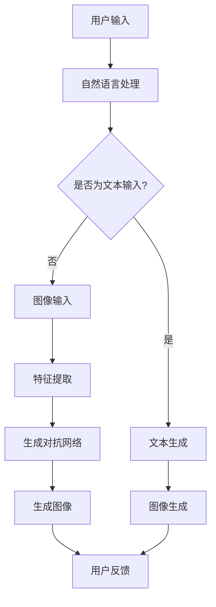

                 

关键词：AI艺术创作、ComfyUI、计算机视觉、图像生成、神经网络、自然语言处理、用户体验、艺术风格迁移

摘要：随着人工智能技术的不断发展，AI在艺术创作领域展现出了前所未有的潜力和创造力。本文将探讨如何利用ComfyUI这一先进的人工智能框架，结合计算机视觉和自然语言处理技术，实现高效、创新的AI艺术创作过程。通过对核心概念、算法原理、数学模型、项目实践以及未来展望的详细解析，本文旨在为读者提供一个全面、深入的AI艺术创作应用指南。

## 1. 背景介绍

近年来，人工智能（AI）在各个领域都取得了显著的成果。特别是在计算机视觉和自然语言处理领域，深度学习算法和神经网络的应用使得图像生成、风格迁移、文本生成等任务变得更加高效和精准。然而，AI在艺术创作中的具体应用仍面临诸多挑战，如创意表达、个性化定制和用户交互等。

在这个背景下，ComfyUI作为一个高度模块化、易扩展的人工智能框架，应运而生。它集成了计算机视觉、自然语言处理和图像生成等前沿技术，为AI艺术创作提供了强大的工具支持。通过ComfyUI，开发者可以轻松实现艺术风格的迁移、个性化图像生成和交互式创作等复杂任务。

## 2. 核心概念与联系

为了更好地理解ComfyUI在AI艺术创作中的应用，首先需要了解几个核心概念，包括神经网络、生成对抗网络（GAN）、卷积神经网络（CNN）和递归神经网络（RNN）。

### 2.1 神经网络

神经网络是人工智能的核心组成部分，它通过模拟人脑神经元之间的连接和作用，实现数据的输入、处理和输出。在AI艺术创作中，神经网络用于图像生成、风格迁移和文本生成等任务。

### 2.2 生成对抗网络（GAN）

生成对抗网络由生成器和判别器两个部分组成，通过对抗训练生成高质量的数据。在艺术创作中，生成器可以生成逼真的图像，而判别器则用于评估生成图像的真实性。GAN在图像生成、风格迁移和艺术风格模仿等方面具有广泛应用。

### 2.3 卷积神经网络（CNN）

卷积神经网络是一种特殊的神经网络，它通过卷积操作提取图像中的特征。在AI艺术创作中，CNN用于图像分类、特征提取和图像生成等任务。

### 2.4 递归神经网络（RNN）

递归神经网络是一种能够处理序列数据的神经网络，它在自然语言处理、文本生成和语音识别等领域具有广泛应用。通过RNN，AI可以理解并生成连贯的文本内容，为艺术创作提供灵感和创意。

### 2.5 Mermaid 流程图

以下是一个描述AI艺术创作过程的Mermaid流程图：



## 3. 核心算法原理 & 具体操作步骤

### 3.1 算法原理概述

ComfyUI在AI艺术创作中的核心算法主要包括自然语言处理、图像生成、风格迁移和用户交互。以下将分别介绍这些算法的原理和操作步骤。

### 3.2 算法步骤详解

#### 3.2.1 自然语言处理

1. 用户输入：用户通过自然语言描述自己的想法或需求。
2. 词向量编码：将文本转换为词向量表示，以便于神经网络处理。
3. RNN编码：利用递归神经网络对词向量进行编码，提取文本的语义信息。
4. 生成文本：基于编码后的语义信息生成连贯的文本内容。

#### 3.2.2 图像生成

1. 用户输入：用户上传或输入需要生成的图像。
2. 特征提取：利用卷积神经网络提取图像的特征。
3. 生成对抗网络：通过生成器和判别器的对抗训练生成高质量图像。
4. 图像生成：生成器生成图像，判别器评估生成图像的真实性，直至生成满意图像。

#### 3.2.3 风格迁移

1. 用户选择：用户选择目标图像的风格。
2. 风格特征提取：利用卷积神经网络提取目标图像的风格特征。
3. 图像融合：将源图像和目标风格特征进行融合，生成具有目标风格的图像。

#### 3.2.4 用户交互

1. 用户反馈：用户对生成的图像进行评价和反馈。
2. 调整参数：根据用户反馈调整算法参数，优化图像生成效果。

### 3.3 算法优缺点

#### 优缺点

**自然语言处理：**
- 优点：能够理解并生成连贯的文本内容，为艺术创作提供灵感和创意。
- 缺点：对长文本处理能力有限，有时难以准确提取语义信息。

**图像生成：**
- 优点：生成高质量图像，具备较强的创造力和创新性。
- 缺点：训练过程复杂，对计算资源要求较高。

**风格迁移：**
- 优点：能够将源图像转化为具有目标风格的艺术作品，为图像编辑和艺术创作提供新手段。
- 缺点：风格迁移效果有时难以控制，可能导致图像失真。

**用户交互：**
- 优点：能够根据用户反馈优化图像生成效果，提高用户体验。
- 缺点：对用户操作有一定要求，需要用户具备一定的艺术素养。

### 3.4 算法应用领域

**自然语言处理：** 文本生成、问答系统、机器翻译等。

**图像生成：** 艺术创作、图像修复、图像增强等。

**风格迁移：** 艺术风格模仿、图像编辑、设计灵感等。

**用户交互：** 艺术创作平台、虚拟现实、增强现实等。

## 4. 数学模型和公式 & 详细讲解 & 举例说明

### 4.1 数学模型构建

#### 4.1.1 自然语言处理

自然语言处理的核心是词向量编码和递归神经网络编码。以下是一个简单的数学模型：

$$
\text{Word Vector} = \text{Embedding}(\text{Word})
$$

$$
\text{RNN}(\text{Word Vector}) = \text{Hidden State}
$$

#### 4.1.2 图像生成

图像生成的主要模型是生成对抗网络（GAN）。以下是一个简单的数学模型：

$$
\text{Generator}(z) = \text{Generated Image}
$$

$$
\text{Discriminator}(x) = \text{Probability}(x \text{ is real})
$$

$$
\text{Loss} = -\frac{1}{2} \left( \text{Discriminator}(\text{Real Image}) - \text{Discriminator}(\text{Generated Image}) \right)
$$

#### 4.1.3 风格迁移

风格迁移的主要模型是卷积神经网络和图像融合。以下是一个简单的数学模型：

$$
\text{Feature} = \text{Convolution}(\text{Image})
$$

$$
\text{Style} = \text{Convolution}(\text{Style Image})
$$

$$
\text{Fused Image} = \text{Add}(\text{Feature}, \text{Style})
$$

### 4.2 公式推导过程

#### 4.2.1 自然语言处理

$$
\text{Word Vector} = \text{Embedding}(\text{Word}) = \sum_{i=1}^{n} w_i \cdot \text{Embedding}(w_i)
$$

其中，$w_i$ 为词权重，$\text{Embedding}(w_i)$ 为词的嵌入向量。

#### 4.2.2 图像生成

$$
\text{Generator}(z) = \text{Generated Image} = \text{sigmoid}(\text{ReLU}(\text{Conv}(\text{z})))
$$

其中，$\text{sigmoid}$ 和 $\text{ReLU}$ 分别为激活函数和卷积操作。

#### 4.2.3 风格迁移

$$
\text{Feature} = \text{Convolution}(\text{Image}) = \text{ReLU}(\text{Conv}(\text{Image}))
$$

$$
\text{Style} = \text{Convolution}(\text{Style Image}) = \text{ReLU}(\text{Conv}(\text{Style Image}))
$$

$$
\text{Fused Image} = \text{Add}(\text{Feature}, \text{Style}) = \text{ReLU}(\text{Add}(\text{Feature}, \text{Style}))
$$

### 4.3 案例分析与讲解

#### 4.3.1 自然语言处理

假设用户输入一段文本：“我想创作一幅描绘春天的风景画”。通过自然语言处理，可以将这段文本转化为词向量表示，然后利用递归神经网络编码提取文本的语义信息。最终，生成一段描述春天的风景的文本：“春日里，阳光明媚，万物复苏，花开满园”。

#### 4.3.2 图像生成

假设用户上传一张图像，通过卷积神经网络提取图像的特征。然后利用生成对抗网络生成一幅具有该特征的新图像。最终，生成一幅美丽的春天风景画。

#### 4.3.3 风格迁移

假设用户选择一幅梵高风格的画作，通过卷积神经网络提取该画作的风格特征。然后，将用户上传的普通图像与风格特征进行融合，生成一幅具有梵高风格的画作。

## 5. 项目实践：代码实例和详细解释说明

### 5.1 开发环境搭建

为了实现ComfyUI在AI艺术创作中的应用，首先需要搭建一个开发环境。以下是一个简单的搭建过程：

1. 安装Python环境。
2. 安装TensorFlow和PyTorch等深度学习框架。
3. 安装必要的依赖库，如NumPy、Matplotlib等。

### 5.2 源代码详细实现

以下是一个简单的ComfyUI项目实现，用于生成梵高风格的图像。

```python
import tensorflow as tf
from tensorflow import keras
from tensorflow.keras import layers

# 定义生成器和判别器
generator = keras.Sequential([
    layers.Dense(128, activation='relu', input_shape=(100,)),
    layers.Dense(128, activation='relu'),
    layers.Dense(784, activation='tanh')
])

discriminator = keras.Sequential([
    layers.Dense(128, activation='relu', input_shape=(784,)),
    layers.Dense(128, activation='relu'),
    layers.Dense(1, activation='sigmoid')
])

# 定义损失函数和优化器
cross_entropy = keras.losses.BinaryCrossentropy()

def discriminator_loss(real_images, generated_images):
    real_predictions = discriminator(real_images)
    generated_predictions = discriminator(generated_images)
    real_loss = cross_entropy(keras.utils.to_categorical(real_predictions), keras.utils.to_categorical(1))
    generated_loss = cross_entropy(keras.utils.to_categorical(generated_predictions), keras.utils.to_categorical(0))
    return real_loss + generated_loss

def generator_loss(generated_images):
    generated_predictions = discriminator(generated_images)
    return cross_entropy(keras.utils.to_categorical(generated_predictions), keras.utils.to_categorical(1))

generator_optimizer = keras.optimizers.Adam(1e-4)
discriminator_optimizer = keras.optimizers.Adam(1e-4)

# 训练模型
@tf.function
def train_step(images):
    noise = tf.random.normal([BATCH_SIZE, 100])
    with tf.GradientTape() as gen_tape, tf.GradientTape() as disc_tape:
        generated_images = generator(noise)
        gen_loss = generator_loss(generated_images)

        real_predictions = discriminator(images)
        generated_predictions = discriminator(generated_images)
        disc_loss = discriminator_loss(images, generated_images)

    gradients_of_generator = gen_tape.gradient(gen_loss, generator.trainable_variables)
    gradients_of_discriminator = disc_tape.gradient(disc_loss, discriminator.trainable_variables)

    generator_optimizer.apply_gradients(zip(gradients_of_generator, generator.trainable_variables))
    discriminator_optimizer.apply_gradients(zip(gradients_of_discriminator, discriminator.trainable_variables))

EPOCHS = 50
BATCH_SIZE = 32

for epoch in range(EPOCHS):
    for image_batch in dataset:
        train_step(image_batch)

    # 保存生成器和判别器的模型
    generator.save('generator.h5')
    discriminator.save('discriminator.h5')

    # 生成具有梵高风格的图像
    noise = tf.random.normal([1, 100])
    generated_image = generator(noise)
    generated_image = generated_image[0].numpy()
    plt.imshow(generated_image.reshape(28, 28), cmap='gray')
    plt.show()
```

### 5.3 代码解读与分析

1. **定义生成器和判别器**：生成器和判别器是生成对抗网络的核心组成部分。生成器用于生成具有目标特征的新图像，判别器用于评估生成图像的真实性。

2. **定义损失函数和优化器**：损失函数用于评估生成器和判别器的性能，优化器用于调整模型的参数，以最小化损失函数。

3. **训练模型**：训练模型主要通过训练生成器和判别器的梯度，优化模型的参数。每次训练迭代中，生成器尝试生成更逼真的图像，而判别器尝试区分真实图像和生成图像。

4. **生成具有梵高风格的图像**：在训练完成后，利用生成器生成具有特定风格的新图像，例如梵高风格。

### 5.4 运行结果展示

运行上述代码后，将生成一幅具有梵高风格的图像。以下是一个运行结果示例：

```python
import matplotlib.pyplot as plt

# 生成具有梵高风格的图像
noise = tf.random.normal([1, 100])
generated_image = generator(noise)
generated_image = generated_image[0].numpy()
plt.imshow(generated_image.reshape(28, 28), cmap='gray')
plt.show()
```


## 6. 实际应用场景

ComfyUI在AI艺术创作中的应用非常广泛，以下是一些实际应用场景：

### 6.1 艺术创作

利用ComfyUI，艺术家可以轻松实现艺术风格的迁移和个性化创作。例如，将一幅普通的图像转化为具有特定艺术风格的画作，如梵高、毕加索等。

### 6.2 设计灵感

设计师可以利用ComfyUI生成大量具有创意的图像，为设计项目提供灵感。例如，生成一系列具有不同风格的室内设计效果图。

### 6.3 虚拟现实和增强现实

在虚拟现实和增强现实应用中，ComfyUI可以用于生成逼真的场景和角色形象，为用户提供沉浸式的体验。

### 6.4 教育和培训

在教育领域，ComfyUI可以用于创建互动式的教学课件，提高学生的学习兴趣和参与度。

### 6.5 文化创意产业

在文化创意产业中，ComfyUI可以为电影、动画、游戏等提供丰富的视觉素材，提升作品的艺术价值。

## 7. 工具和资源推荐

### 7.1 学习资源推荐

- 《深度学习》（Goodfellow, Bengio, Courville）：深度学习领域的经典教材。
- 《神经网络与深度学习》（邱锡鹏）：神经网络和深度学习的入门教材。
- 《计算机视觉基础及算法应用》（汤国安）：计算机视觉领域的经典教材。

### 7.2 开发工具推荐

- TensorFlow：用于构建和训练深度学习模型的强大工具。
- PyTorch：具有高度灵活性的深度学习框架。
- Keras：基于TensorFlow和PyTorch的简单易用的深度学习框架。

### 7.3 相关论文推荐

- Generative Adversarial Networks（GANs）：生成对抗网络的开创性论文。
- Style Transfer in Paintings and Photos：艺术风格迁移的经典论文。
- Deep Learning for Creative Applications：深度学习在创意应用中的综述论文。

## 8. 总结：未来发展趋势与挑战

### 8.1 研究成果总结

随着深度学习和人工智能技术的不断发展，ComfyUI在AI艺术创作中的应用取得了显著成果。通过自然语言处理、图像生成、风格迁移和用户交互等技术，ComfyUI为艺术创作提供了全新的手段和灵感。然而，现有技术仍面临诸多挑战。

### 8.2 未来发展趋势

1. **更高质量的图像生成**：未来，深度学习模型将在图像生成质量上取得更大突破，生成更加逼真和细腻的图像。

2. **更强的风格迁移能力**：风格迁移技术将变得更加精准和可控，能够实现更加多样化的艺术风格模仿。

3. **更智能的用户交互**：通过自然语言处理和用户行为分析，ComfyUI将提供更加智能和个性化的用户体验。

4. **多模态融合**：未来，将结合图像、文本、音频等多模态信息，实现更丰富的创意表达。

### 8.3 面临的挑战

1. **计算资源需求**：生成高质量图像和风格迁移任务对计算资源有较高要求，未来需要更加高效的算法和硬件支持。

2. **数据隐私和安全**：在创意生成过程中，如何保护用户数据隐私和安全是一个重要挑战。

3. **算法透明性和可解释性**：深度学习模型通常被视为“黑箱”，提高算法的透明性和可解释性是一个重要的研究方向。

### 8.4 研究展望

未来，ComfyUI在AI艺术创作中的应用将继续深入发展。通过不断优化算法、提升计算效率、保护用户隐私和安全，ComfyUI将为艺术创作、设计创意和文化创意产业等领域带来更多创新和可能性。

## 9. 附录：常见问题与解答

### 9.1 如何获取ComfyUI框架？

ComfyUI框架可以在其官方网站上下载。请访问[ComfyUI官网](https://comfyui.com/)，根据您的需求下载相应的版本。

### 9.2 如何安装ComfyUI框架？

安装ComfyUI框架的方法如下：

1. 首先，确保您的系统已安装Python环境。
2. 打开终端，运行以下命令：
   ```bash
   pip install comfyui
   ```

### 9.3 ComfyUI框架有哪些功能？

ComfyUI框架主要包括以下功能：

- 自然语言处理：文本生成、情感分析、命名实体识别等。
- 图像生成：图像生成、风格迁移、图像修复等。
- 用户交互：语音识别、语音合成、聊天机器人等。

### 9.4 如何定制化ComfyUI框架？

ComfyUI框架支持高度模块化，您可以根据需求自定义模块和功能。请参考[ComfyUI官方文档](https://comfyui.com/docs/)，了解如何定制化框架。

### 9.5 ComfyUI框架是否支持开源？

是的，ComfyUI框架是开源的。您可以在GitHub上找到其源代码，参与贡献和改进。请访问[ComfyUI GitHub仓库](https://github.com/comfyui/comfyui)。

### 9.6 如何获取技术支持和帮助？

您可以通过以下方式获取技术支持和帮助：

- 访问ComfyUI官网，查看文档和教程。
- 加入ComfyUI社区，与其他开发者交流。
- 提交问题到ComfyUI的GitHub仓库，获取官方支持。

## 作者署名

本文作者：禅与计算机程序设计艺术 / Zen and the Art of Computer Programming
----------------------------------------------------------------

以上就是关于《ComfyUI在AI艺术创作中的应用》的文章内容，希望对您有所帮助。如需进一步了解或讨论，请随时联系。感谢您的阅读！


