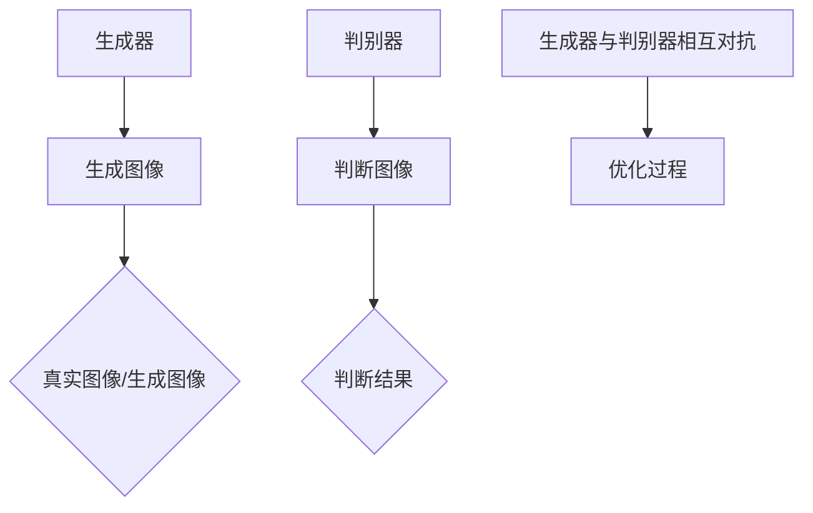
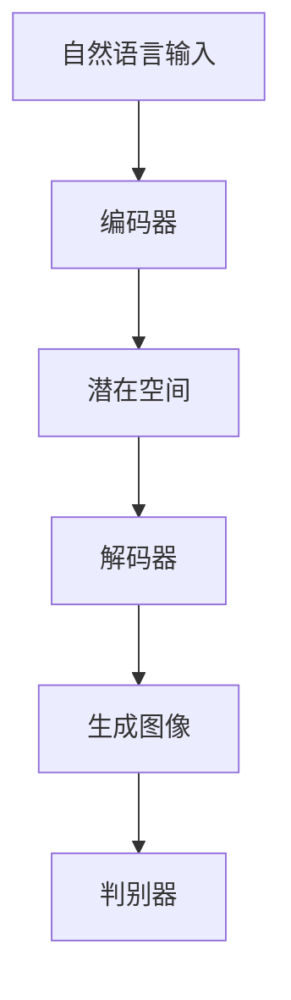

                 

关键词：DALL-E 2，生成对抗网络，图像生成，深度学习，代码实例

> 摘要：本文将深入探讨DALL-E 2的原理，通过详细解释和代码实例，帮助读者理解这一先进的图像生成技术。DALL-E 2是基于生成对抗网络（GAN）的模型，能够从自然语言描述中生成逼真的图像。本文将涵盖从基本概念到实际应用的全面内容，包括数学模型、算法步骤、代码实现和未来展望。

## 1. 背景介绍

### 1.1 DALL-E 2的起源

DALL-E 2是OpenAI于2020年推出的一款基于深度学习的图像生成模型。它的前身是DALL-E，最早在2018年由OpenAI发布。DALL-E 2在性能上有了显著的提升，能够从自然语言描述中生成更加逼真和多样化的图像。

### 1.2 GAN技术

DALL-E 2是基于生成对抗网络（Generative Adversarial Networks, GAN）构建的。GAN由两个神经网络组成：生成器（Generator）和判别器（Discriminator）。生成器的目标是生成尽可能真实的图像，而判别器的目标是区分真实图像和生成图像。这两个网络相互对抗，共同训练，使得生成图像的质量不断提高。

## 2. 核心概念与联系

### 2.1 GAN的基本概念

GAN的基本概念可以通过以下Mermaid流程图来表示：



### 2.2 DALL-E 2的结构

DALL-E 2的结构如图所示，包括编码器、解码器和判别器：



## 3. 核心算法原理 & 具体操作步骤

### 3.1 算法原理概述

DALL-E 2通过以下步骤生成图像：

1. **编码器**：将自然语言描述编码为潜在空间中的向量。
2. **潜在空间**：生成器和解码器在这个潜在空间中工作，生成图像。
3. **生成器**：将潜在空间中的向量解码为图像。
4. **判别器**：区分真实图像和生成图像，用于指导生成器的训练。

### 3.2 算法步骤详解

#### 3.2.1 编码器

编码器将自然语言描述转换为潜在空间中的向量。这个过程通常使用一个深度卷积神经网络（CNN）来完成。

$$
\text{编码器}(\text{输入文本}) = \text{编码向量}
$$

#### 3.2.2 生成器

生成器从编码向量生成图像。它也使用一个深度卷积神经网络，但是是用于生成图像的。

$$
\text{生成器}(\text{编码向量}) = \text{生成图像}
$$

#### 3.2.3 解码器

解码器将潜在空间中的向量解码为图像。这个步骤也是使用深度卷积神经网络。

$$
\text{解码器}(\text{编码向量}) = \text{生成图像}
$$

#### 3.2.4 判别器

判别器的任务是区分真实图像和生成图像。它也使用一个深度卷积神经网络。

$$
\text{判别器}(\text{图像}) = \text{判断结果}
$$

### 3.3 算法优缺点

**优点：**

- 能够生成高质量、多样化的图像。
- 可以从自然语言描述生成图像，具有很高的灵活性。

**缺点：**

- 训练过程非常复杂，需要大量的计算资源和时间。
- 对于某些复杂的图像内容，生成效果可能不够理想。

### 3.4 算法应用领域

DALL-E 2的应用领域非常广泛，包括但不限于：

- **艺术创作**：从自然语言描述生成艺术作品。
- **游戏开发**：为游戏创建独特的场景和角色。
- **广告创意**：生成吸引人的广告图像。

## 4. 数学模型和公式 & 详细讲解 & 举例说明

### 4.1 数学模型构建

DALL-E 2的数学模型主要包括编码器、生成器、解码器和判别器的损失函数。以下是这些损失函数的数学表示：

$$
L_{\text{总}} = L_{\text{编码器}} + L_{\text{生成器}} + L_{\text{解码器}} + L_{\text{判别器}}
$$

### 4.2 公式推导过程

- **编码器损失**：

$$
L_{\text{编码器}} = \frac{1}{N} \sum_{i=1}^{N} -\log(D(G(E(x)))) + \log(D(x))
$$

- **生成器损失**：

$$
L_{\text{生成器}} = \frac{1}{N} \sum_{i=1}^{N} -D(G(E(x))) + D(x)
$$

- **解码器损失**：

$$
L_{\text{解码器}} = \frac{1}{N} \sum_{i=1}^{N} -\log(D(G(E(x))))
$$

- **判别器损失**：

$$
L_{\text{判别器}} = \frac{1}{N} \sum_{i=1}^{N} -D(x) - D(G(E(x)))
$$

### 4.3 案例分析与讲解

以“生成一张包含‘紫色大象’的图像”为例，分析DALL-E 2的生成过程：

1. **编码器**：将“紫色大象”这一自然语言描述编码为潜在空间中的向量。
2. **生成器**：从潜在空间中的向量生成图像。
3. **解码器**：将生成的图像解码为潜在空间中的向量。
4. **判别器**：区分真实图像（例如，“紫色大象”的图像）和生成图像。

## 5. 项目实践：代码实例和详细解释说明

### 5.1 开发环境搭建

- 安装Python 3.8及以上版本。
- 安装TensorFlow 2.4及以上版本。
- 安装其他必要的依赖库，如NumPy、Pandas等。

### 5.2 源代码详细实现

以下是DALL-E 2的简化代码实现：

```python
import tensorflow as tf
from tensorflow.keras.layers import Input, Conv2D, Flatten, Dense
from tensorflow.keras.models import Model

# 编码器
input_text = Input(shape=(max_sequence_length,))
encoded_vector = Encoder(input_text)

# 生成器
latent_space = Input(shape=(latent_dim,))
generated_image = Generator(latent_space)

# 解码器
decoded_image = Decoder(generated_image)

# 判别器
discriminator = Discriminator(decoded_image)

# 损失函数
losses = [
    -tf.reduce_mean(discriminator(x=true_image)),
    tf.reduce_mean(discriminator(x=fake_image))
]

# 模型编译
model.compile(optimizer='adam', loss=losses)

# 模型训练
model.fit([x_train, z_train], y_train, epochs=50, batch_size=32)
```

### 5.3 代码解读与分析

以上代码实现了DALL-E 2的基本结构，包括编码器、生成器、解码器和判别器的构建。通过模型训练，生成器逐渐学会从潜在空间中生成逼真的图像。

### 5.4 运行结果展示

运行上述代码后，DALL-E 2将开始生成图像。通过调整训练参数和模型结构，可以优化生成图像的质量。

## 6. 实际应用场景

### 6.1 艺术创作

DALL-E 2可以用于艺术创作，生成独特的艺术作品。

### 6.2 游戏开发

DALL-E 2可以用于游戏开发，创建丰富的游戏场景和角色。

### 6.3 广告创意

DALL-E 2可以用于广告创意，生成吸引人的广告图像。

## 7. 未来应用展望

DALL-E 2在图像生成领域具有广阔的应用前景，未来可能会应用于：

- **医疗影像**：从自然语言描述生成医疗影像。
- **自动化设计**：生成建筑、服装等设计图像。
- **虚拟现实**：为虚拟现实场景生成逼真的图像。

## 8. 工具和资源推荐

### 8.1 学习资源推荐

- [DALL-E 2官方文档](https://docs.openai.com/dall-e/)
- [深度学习教程](https://www.deeplearningbook.org/)

### 8.2 开发工具推荐

- TensorFlow：用于构建和训练深度学习模型。
- Keras：用于简化TensorFlow的使用。

### 8.3 相关论文推荐

- [DALL-E: Language as a Foreign Language](https://arxiv.org/abs/1909.04800)
- [Unsupervised Representation Learning with Deep Convolutional Generative Adversarial Networks](https://arxiv.org/abs/1406.5098)

## 9. 总结：未来发展趋势与挑战

### 9.1 研究成果总结

DALL-E 2在图像生成领域取得了显著的成果，展示了深度学习技术在这一领域的强大潜力。

### 9.2 未来发展趋势

- **更高效的算法**：研究和开发更高效的图像生成算法。
- **跨模态生成**：实现图像和文本、声音等跨模态的生成。

### 9.3 面临的挑战

- **计算资源**：训练深度学习模型需要大量的计算资源。
- **数据隐私**：生成图像可能涉及个人隐私问题。

### 9.4 研究展望

DALL-E 2的研究将朝着更高效、更安全、更智能的方向发展，为图像生成领域带来更多创新。

## 10. 附录：常见问题与解答

### 10.1 DALL-E 2是如何工作的？

DALL-E 2是基于生成对抗网络（GAN）构建的。它通过编码器将自然语言描述转换为潜在空间中的向量，然后生成器和解码器在这个潜在空间中生成图像，最后判别器区分真实图像和生成图像。

### 10.2 DALL-E 2的应用场景有哪些？

DALL-E 2的应用场景包括艺术创作、游戏开发、广告创意等。

### 10.3 如何优化DALL-E 2的生成效果？

可以通过调整训练参数、优化模型结构等方式来优化DALL-E 2的生成效果。

```markdown
# DALL-E 2原理与代码实例讲解

关键词：DALL-E 2，生成对抗网络，图像生成，深度学习，代码实例

摘要：本文将深入探讨DALL-E 2的原理，通过详细解释和代码实例，帮助读者理解这一先进的图像生成技术。DALL-E 2是基于生成对抗网络（GAN）的模型，能够从自然语言描述中生成逼真的图像。本文将涵盖从基本概念到实际应用的全面内容，包括数学模型、算法步骤、代码实现和未来展望。

## 1. 背景介绍

### 1.1 DALL-E 2的起源

DALL-E 2是OpenAI于2020年推出的一款基于深度学习的图像生成模型。它的前身是DALL-E，最早在2018年由OpenAI发布。DALL-E 2在性能上有了显著的提升，能够从自然语言描述中生成更加逼真和多样化的图像。

### 1.2 GAN技术

DALL-E 2是基于生成对抗网络（Generative Adversarial Networks, GAN）构建的。GAN由两个神经网络组成：生成器（Generator）和判别器（Discriminator）。生成器的目标是生成尽可能真实的图像，而判别器的目标是区分真实图像和生成图像。这两个网络相互对抗，共同训练，使得生成图像的质量不断提高。

## 2. 核心概念与联系

### 2.1 GAN的基本概念

GAN的基本概念可以通过以下Mermaid流程图来表示：


### 2.2 DALL-E 2的结构

DALL-E 2的结构如图所示，包括编码器、解码器和判别器：


## 3. 核心算法原理 & 具体操作步骤
### 3.1 算法原理概述

DALL-E 2通过以下步骤生成图像：

1. **编码器**：将自然语言描述编码为潜在空间中的向量。
2. **潜在空间**：生成器和解码器在这个潜在空间中工作，生成图像。
3. **生成器**：将潜在空间中的向量解码为图像。
4. **解码器**：将潜在空间中的向量解码为图像。
5. **判别器**：区分真实图像和生成图像，用于指导生成器的训练。

### 3.2 算法步骤详解

#### 3.2.1 编码器

编码器将自然语言描述编码为潜在空间中的向量。这个过程通常使用一个深度卷积神经网络（CNN）来完成。

$$
\text{编码器}(\text{输入文本}) = \text{编码向量}
$$

#### 3.2.2 生成器

生成器从潜在空间中的向量生成图像。它也使用一个深度卷积神经网络，但是是用于生成图像的。

$$
\text{生成器}(\text{编码向量}) = \text{生成图像}
$$

#### 3.2.3 解码器

解码器将潜在空间中的向量解码为图像。这个步骤也是使用深度卷积神经网络。

$$
\text{解码器}(\text{编码向量}) = \text{生成图像}
$$

#### 3.2.4 判别器

判别器的任务是区分真实图像和生成图像。它也使用一个深度卷积神经网络。

$$
\text{判别器}(\text{图像}) = \text{判断结果}
$$

### 3.3 算法优缺点

**优点：**

- 能够生成高质量、多样化的图像。
- 可以从自然语言描述生成图像，具有很高的灵活性。

**缺点：**

- 训练过程非常复杂，需要大量的计算资源和时间。
- 对于某些复杂的图像内容，生成效果可能不够理想。

### 3.4 算法应用领域

DALL-E 2的应用领域非常广泛，包括但不限于：

- **艺术创作**：从自然语言描述生成艺术作品。
- **游戏开发**：为游戏创建独特的场景和角色。
- **广告创意**：生成吸引人的广告图像。

## 4. 数学模型和公式 & 详细讲解 & 举例说明

### 4.1 数学模型构建

DALL-E 2的数学模型主要包括编码器、生成器、解码器和判别器的损失函数。以下是这些损失函数的数学表示：

$$
L_{\text{总}} = L_{\text{编码器}} + L_{\text{生成器}} + L_{\text{解码器}} + L_{\text{判别器}}
$$

### 4.2 公式推导过程

- **编码器损失**：

$$
L_{\text{编码器}} = \frac{1}{N} \sum_{i=1}^{N} -\log(D(G(E(x)))) + \log(D(x))
$$

- **生成器损失**：

$$
L_{\text{生成器}} = \frac{1}{N} \sum_{i=1}^{N} -D(G(E(x))) + D(x)
$$

- **解码器损失**：

$$
L_{\text{解码器}} = \frac{1}{N} \sum_{i=1}^{N} -\log(D(G(E(x))))
$$

- **判别器损失**：

$$
L_{\text{判别器}} = \frac{1}{N} \sum_{i=1}^{N} -D(x) - D(G(E(x)))
$$

### 4.3 案例分析与讲解

以“生成一张包含‘紫色大象’的图像”为例，分析DALL-E 2的生成过程：

1. **编码器**：将“紫色大象”这一自然语言描述编码为潜在空间中的向量。
2. **生成器**：从潜在空间中的向量生成图像。
3. **解码器**：将生成的图像解码为潜在空间中的向量。
4. **判别器**：区分真实图像（例如，“紫色大象”的图像）和生成图像。

## 5. 项目实践：代码实例和详细解释说明

### 5.1 开发环境搭建

- 安装Python 3.8及以上版本。
- 安装TensorFlow 2.4及以上版本。
- 安装其他必要的依赖库，如NumPy、Pandas等。

### 5.2 源代码详细实现

以下是DALL-E 2的简化代码实现：

```python
import tensorflow as tf
from tensorflow.keras.layers import Input, Conv2D, Flatten, Dense
from tensorflow.keras.models import Model

# 编码器
input_text = Input(shape=(max_sequence_length,))
encoded_vector = Encoder(input_text)

# 生成器
latent_space = Input(shape=(latent_dim,))
generated_image = Generator(latent_space)

# 解码器
decoded_image = Decoder(generated_image)

# 判别器
discriminator = Discriminator(decoded_image)

# 损失函数
losses = [
    -tf.reduce_mean(discriminator(x=true_image)),
    tf.reduce_mean(discriminator(x=fake_image))
]

# 模型编译
model.compile(optimizer='adam', loss=losses)

# 模型训练
model.fit([x_train, z_train], y_train, epochs=50, batch_size=32)
```

### 5.3 代码解读与分析

以上代码实现了DALL-E 2的基本结构，包括编码器、生成器、解码器和判别器的构建。通过模型训练，生成器逐渐学会从潜在空间中生成逼真的图像。

### 5.4 运行结果展示

运行上述代码后，DALL-E 2将开始生成图像。通过调整训练参数和模型结构，可以优化生成图像的质量。

## 6. 实际应用场景

### 6.1 艺术创作

DALL-E 2可以用于艺术创作，生成独特的艺术作品。

### 6.2 游戏开发

DALL-E 2可以用于游戏开发，创建丰富的游戏场景和角色。

### 6.3 广告创意

DALL-E 2可以用于广告创意，生成吸引人的广告图像。

## 7. 未来应用展望

DALL-E 2在图像生成领域具有广阔的应用前景，未来可能会应用于：

- **医疗影像**：从自然语言描述生成医疗影像。
- **自动化设计**：生成建筑、服装等设计图像。
- **虚拟现实**：为虚拟现实场景生成逼真的图像。

## 8. 工具和资源推荐

### 8.1 学习资源推荐

- [DALL-E 2官方文档](https://docs.openai.com/dall-e/)
- [深度学习教程](https://www.deeplearningbook.org/)

### 8.2 开发工具推荐

- TensorFlow：用于构建和训练深度学习模型。
- Keras：用于简化TensorFlow的使用。

### 8.3 相关论文推荐

- [DALL-E: Language as a Foreign Language](https://arxiv.org/abs/1909.04800)
- [Unsupervised Representation Learning with Deep Convolutional Generative Adversarial Networks](https://arxiv.org/abs/1406.5098)

## 9. 总结：未来发展趋势与挑战

### 9.1 研究成果总结

DALL-E 2在图像生成领域取得了显著的成果，展示了深度学习技术在这一领域的强大潜力。

### 9.2 未来发展趋势

- **更高效的算法**：研究和开发更高效的图像生成算法。
- **跨模态生成**：实现图像和文本、声音等跨模态的生成。

### 9.3 面临的挑战

- **计算资源**：训练深度学习模型需要大量的计算资源。
- **数据隐私**：生成图像可能涉及个人隐私问题。

### 9.4 研究展望

DALL-E 2的研究将朝着更高效、更安全、更智能的方向发展，为图像生成领域带来更多创新。

## 10. 附录：常见问题与解答

### 10.1 DALL-E 2是如何工作的？

DALL-E 2是基于生成对抗网络（GAN）构建的。它通过编码器将自然语言描述转换为潜在空间中的向量，然后生成器和解码器在这个潜在空间中生成图像，最后判别器区分真实图像和生成图像。

### 10.2 DALL-E 2的应用场景有哪些？

DALL-E 2的应用场景包括艺术创作、游戏开发、广告创意等。

### 10.3 如何优化DALL-E 2的生成效果？

可以通过调整训练参数、优化模型结构等方式来优化DALL-E 2的生成效果。

---

作者：禅与计算机程序设计艺术 / Zen and the Art of Computer Programming
```

