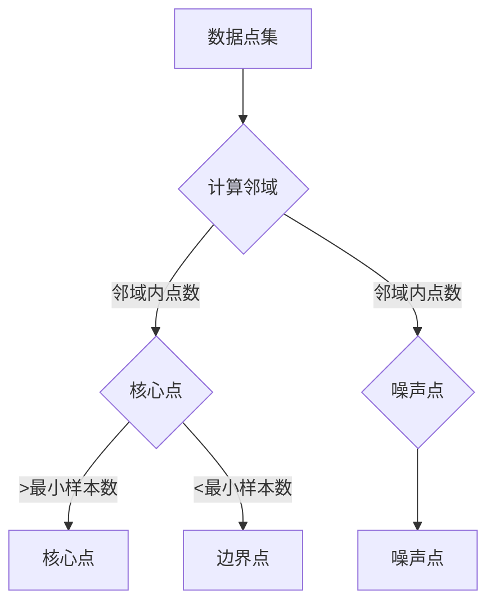

                 

关键词：聚类算法、DBSCAN、密度可达、邻域、噪声点、核心点、边界点、最小半径、最小样本数

摘要：DBSCAN（Density-Based Spatial Clustering of Applications with Noise）是一种基于密度的空间聚类算法。它根据数据点的密度分布将数据划分为不同的簇，并能有效地识别出噪声点和孤立点。本文将详细讲解DBSCAN算法的基本原理、具体操作步骤、数学模型以及代码实现，并分析其在实际应用中的优缺点和未来发展方向。

## 1. 背景介绍

聚类分析是数据挖掘和机器学习中的一个重要任务，其目的是将一组数据点划分为若干个组（簇），使得同组数据点之间的相似度较高，而不同组之间的相似度较低。传统的聚类算法如K-means、层次聚类等在处理高维度数据时效果不佳，且对初始中心点的选择敏感。因此，研究人员提出了许多基于密度的聚类算法，如DBSCAN、OPTICS等。其中，DBSCAN由于其良好的扩展性和对噪声点的处理能力，在众多领域得到了广泛应用。

DBSCAN的全称是Density-Based Spatial Clustering of Applications with Noise，它是一种基于密度的空间聚类算法。DBSCAN通过计算数据点之间的邻域关系，根据点的密度将数据划分为核心点、边界点和噪声点，从而识别出数据中的不同簇。DBSCAN不受聚类数目限制，能够自动确定聚类个数，使其在处理复杂形态的数据时具有独特的优势。

## 2. 核心概念与联系

为了更好地理解DBSCAN算法，我们需要先了解以下几个核心概念：

### 2.1 数据点
数据点是指二维或三维空间中的一个点，其具有特定的坐标和属性。

### 2.2 邻域
邻域是指与一个数据点距离小于某一阈值（最小半径）的其他数据点集合。

### 2.3 核心点
如果一个数据点的邻域内的点数大于最小样本数，则该数据点称为核心点。核心点是簇的主要组成部分，它们构成了数据的主要结构。

### 2.4 边界点
如果一个数据点的邻域内的点数介于最小样本数和最小样本数减一之间，则该数据点称为边界点。边界点是核心点和噪声点之间的桥梁。

### 2.5 噪声点
如果一个数据点的邻域内的点数小于最小样本数，则该数据点称为噪声点。噪声点是数据中的孤立点，通常不受其他点的影响。

接下来，我们将通过Mermaid流程图来展示DBSCAN的核心概念和算法流程。



在上面的流程图中，我们首先计算每个数据点的邻域，然后根据邻域内点的数量判断数据点的类型，从而将数据点划分为核心点、边界点和噪声点。

## 3. 核心算法原理 & 具体操作步骤

### 3.1 算法原理概述

DBSCAN算法的核心思想是根据数据点的邻域密度来判断其类型。具体步骤如下：

1. 初始化核心点集合为空，边界点集合为空，噪声点集合为空。
2. 对数据集中的每个点P，依次执行以下步骤：
   a. 计算P的邻域N(P)。
   b. 如果P是核心点，则将其加入核心点集合，并将N(P)中的所有点作为潜在核心点进行扩展。
   c. 如果P是边界点，则将其加入边界点集合。
   d. 如果P是噪声点，则将其加入噪声点集合。
3. 对所有潜在核心点进行扩展，判断其邻域内的点是否都属于同一个核心点。
4. 最终输出核心点、边界点和噪声点的集合，即为聚类结果。

### 3.2 算法步骤详解

#### 3.2.1 计算邻域

计算邻域是DBSCAN算法的第一步，它决定了算法的性能。在计算邻域时，我们通常采用以下两种方法：

1. **基于距离的邻域计算**：对于每个点P，计算P与数据集中所有其他点的距离，选取距离小于最小半径r的点作为P的邻域。
2. **基于网格的邻域计算**：将数据空间划分为若干个网格单元，然后对每个点P，计算P所在的网格单元及其相邻网格单元中的点作为P的邻域。

在这里，我们以基于距离的邻域计算为例进行说明。

#### 3.2.2 判断数据点类型

根据邻域内点的数量，我们可以将数据点划分为核心点、边界点和噪声点。具体判断条件如下：

1. **核心点**：如果点P的邻域N(P)中的点数大于最小样本数min_samples，则P是核心点。
2. **边界点**：如果点P的邻域N(P)中的点数介于最小样本数min_samples和最小样本数减一之间，则P是边界点。
3. **噪声点**：如果点P的邻域N(P)中的点数小于最小样本数min_samples，则P是噪声点。

#### 3.2.3 潜在核心点的扩展

对于每个潜在核心点P，我们需要判断其邻域内的点是否都属于同一个核心点。具体步骤如下：

1. 对于P的邻域N(P)中的每个点Q，计算Q的邻域N(Q)。
2. 如果Q是核心点，并且N(Q)与N(P)有重叠，则将Q加入到P的核心点集合中。
3. 重复步骤2，直到没有新的点加入到P的核心点集合中。

通过以上步骤，我们可以得到每个核心点的邻域内的点集合，从而确定聚类结果。

### 3.3 算法优缺点

#### 3.3.1 优点

1. **自适应聚类**：DBSCAN能够自动确定聚类个数，无需事先指定聚类数目。
2. **处理高维度数据**：DBSCAN通过计算邻域关系来识别簇，因此对高维度数据具有较好的处理能力。
3. **识别噪声点**：DBSCAN能够识别噪声点和孤立点，从而提高聚类结果的准确性和鲁棒性。

#### 3.3.2 缺点

1. **邻域参数敏感**：DBSCAN对邻域参数（最小半径和最小样本数）的选择敏感，参数选择不当可能导致聚类结果不理想。
2. **扩展时间复杂度**：DBSCAN的扩展时间复杂度较高，特别是对于大规模数据集，计算时间较长。

### 3.4 算法应用领域

DBSCAN算法由于其自适应聚类和识别噪声点的特点，在多个领域得到了广泛应用：

1. **计算机视觉**：DBSCAN在图像分割、目标识别等方面具有较好的效果。
2. **生物信息学**：DBSCAN在基因数据分析、蛋白质结构预测等领域被广泛应用。
3. **社会网络分析**：DBSCAN能够识别社交网络中的社区结构，用于分析社交关系。
4. **交通数据分析**：DBSCAN在交通流量分析、路况监测等方面具有较好的应用价值。

## 4. 数学模型和公式

DBSCAN算法的核心在于邻域的计算和核心点的识别，下面我们将通过数学模型和公式来详细阐述这些概念。

### 4.1 数学模型构建

假设数据集D是一个n维空间中的点集，其中每个点可以表示为一个n维向量。我们定义以下数学模型：

- **邻域N(P)**：对于每个点P，其邻域N(P)定义为距离P小于最小半径r的所有点。
- **邻域内点数**：对于每个点P，其邻域内点数定义为N(P)中的点数。
- **核心点**：如果点P的邻域内点数大于最小样本数min_samples，则P是核心点。
- **边界点**：如果点P的邻域内点数介于最小样本数min_samples和最小样本数减一之间，则P是边界点。
- **噪声点**：如果点P的邻域内点数小于最小样本数min_samples，则P是噪声点。

### 4.2 公式推导过程

为了更好地理解DBSCAN算法，我们将推导核心点的邻域内点数与最小半径、最小样本数之间的关系。

首先，我们定义以下符号：

- **d(P, Q)**：点P和点Q之间的距离。
- **N(P)**：点P的邻域N(P)中的点集合。

假设点P是一个核心点，其邻域内点数为m。根据定义，我们可以得到以下关系：

$$
m = \left|\{Q \in D : d(P, Q) < r\}\right|
$$

其中，\(\left|\cdot\right|\)表示集合的基数，即集合中的元素个数。

现在，我们假设最小样本数为min_samples，即m > min_samples。我们需要推导最小半径r与最小样本数min_samples之间的关系。

为了简化问题，我们假设数据集D是均匀分布的。在这种情况下，我们可以将邻域内点数m看作是一个关于最小半径r的函数：

$$
m = m(r)
$$

根据中心极限定理，当样本量足够大时，点P的邻域内点数m近似服从正态分布。因此，我们可以得到以下关系：

$$
m \sim N\left(\mu_m, \sigma_m^2\right)
$$

其中，\(\mu_m\)和\(\sigma_m^2\)分别表示m的期望值和方差。

由于m > min_samples，我们可以得到以下不等式：

$$
m > \mu_m - z\sigma_m
$$

其中，z表示标准正态分布的阈值，取决于最小样本数min_samples。

将\(\mu_m\)和\(\sigma_m^2\)代入不等式中，我们可以得到以下关系：

$$
r > \frac{\mu_m - z\sigma_m}{m - min_samples}
$$

由于m > min_samples，我们可以进一步简化上述关系：

$$
r > \frac{\mu_m - z\sigma_m}{min_samples - 1}
$$

因此，我们得到了最小半径r与最小样本数min_samples之间的关系：

$$
r > \frac{\mu_m - z\sigma_m}{min_samples - 1}
$$

在实际应用中，我们需要根据具体的数据集和问题场景来选择合适的邻域参数。

### 4.3 案例分析与讲解

为了更好地理解DBSCAN算法，我们通过一个实际案例来进行分析和讲解。

假设我们有以下数据集D，其中包含5个点：

$$
D = \left\{\begin{array}{ccc}
P_1 &= (1, 1) \\
P_2 &= (3, 3) \\
P_3 &= (5, 5) \\
P_4 &= (7, 7) \\
P_5 &= (9, 9)
\end{array}\right.
$$

我们选择最小半径r为2，最小样本数min_samples为3。

首先，我们计算每个点的邻域。根据最小半径r为2，我们可以得到以下邻域：

$$
N(P_1) = \left\{\begin{array}{ccc}
P_1 \\
P_2 \\
P_3
\end{array}\right.
$$

$$
N(P_2) = \left\{\begin{array}{ccc}
P_1 \\
P_2 \\
P_3 \\
P_4 \\
P_5
\end{array}\right.
$$

$$
N(P_3) = \left\{\begin{array}{ccc}
P_1 \\
P_2 \\
P_3 \\
P_4 \\
P_5
\end{array}\right.
$$

$$
N(P_4) = \left\{\begin{array}{ccc}
P_4 \\
P_5
\end{array}\right.
$$

$$
N(P_5) = \left\{\begin{array}{ccc}
P_4 \\
P_5
\end{array}\right.
$$

接下来，我们根据邻域内点数判断每个点的类型：

- P1是核心点，因为它的邻域内点数大于最小样本数min_samples。
- P2、P3也是核心点，因为它们的邻域内点数大于最小样本数min_samples。
- P4和P5是边界点，因为它们的邻域内点数介于最小样本数min_samples和最小样本数减一之间。

根据核心点的邻域扩展，我们可以得到以下聚类结果：

$$
\text{聚类结果} = \left\{\begin{array}{ccc}
P_1 \\
P_2 \\
P_3
\end{array}\right.
$$

在这个案例中，DBSCAN算法成功地将5个点划分为一个簇。

## 5. 项目实践：代码实例和详细解释说明

在本节中，我们将通过一个实际案例来展示DBSCAN算法的实现过程，并提供详细的代码解释和分析。

### 5.1 开发环境搭建

在实现DBSCAN算法之前，我们需要搭建一个合适的开发环境。这里我们使用Python编程语言和Scikit-learn库来实现DBSCAN算法。以下是搭建开发环境的步骤：

1. 安装Python：从Python官方网站（https://www.python.org/）下载并安装Python。
2. 安装Scikit-learn：在命令行中执行以下命令：
   ```python
   pip install scikit-learn
   ```

### 5.2 源代码详细实现

以下是DBSCAN算法的Python实现代码：

```python
from sklearn.cluster import DBSCAN
from sklearn.datasets import make_moons
import matplotlib.pyplot as plt
import numpy as np

# 生成模拟数据
X, y = make_moons(n_samples=300, noise=0.05, random_state=42)

# 实例化DBSCAN对象，设置参数
db = DBSCAN(eps=0.3, min_samples=5)

# 拟合DBSCAN模型到数据
db.fit(X)

# 获取聚类结果
labels = db.labels_

# 设置聚类结果的颜色映射
unique_labels = set(labels)
colors = [plt.cm.Spectral(each) for each in np.linspace(0, 1, len(unique_labels))]

# 绘制聚类结果
for k, col in zip(unique_labels, colors):
    if k == -1:
        # 黑色用于表示噪声点
        col = [0, 0, 0, 1]

    class_member_mask = (labels == k)

    # 绘制核心点
    xy = X[class_member_mask & (labels != -1)]
    plt.plot(xy[:, 0], xy[:, 1], 'o', markerfacecolor=tuple(col), markeredgecolor='k', markersize=6)

    # 绘制噪声点
    noise_mask = class_member_mask & (labels == -1)
    xy = X[noise_mask]
    plt.plot(xy[:, 0], xy[:, 1], 'o', markerfacecolor=tuple(col), markeredgecolor='k', markersize=6)

# 显示图形
plt.show()
```

### 5.3 代码解读与分析

在上面的代码中，我们首先使用Scikit-learn库生成一个模拟的月亮形状的数据集。然后，我们实例化DBSCAN对象，并设置邻域参数（eps）和最小样本数（min_samples）。

```python
# 实例化DBSCAN对象，设置参数
db = DBSCAN(eps=0.3, min_samples=5)
```

这里，eps表示邻域的最小半径，min_samples表示最小样本数。我们需要根据具体的数据集和问题场景来选择合适的参数。

接下来，我们使用fit方法将DBSCAN模型拟合到数据集上，并获取聚类结果：

```python
# 拟合DBSCAN模型到数据
db.fit(X)

# 获取聚类结果
labels = db.labels_
```

在拟合过程中，DBSCAN算法根据邻域关系和最小样本数判断数据点的类型，并将结果存储在labels数组中。

最后，我们使用matplotlib库绘制聚类结果：

```python
# 设置聚类结果的颜色映射
unique_labels = set(labels)
colors = [plt.cm.Spectral(each) for each in np.linspace(0, 1, len(unique_labels))]

# 绘制聚类结果
for k, col in zip(unique_labels, colors):
    if k == -1:
        # 黑色用于表示噪声点
        col = [0, 0, 0, 1]

    class_member_mask = (labels == k)

    # 绘制核心点
    xy = X[class_member_mask & (labels != -1)]
    plt.plot(xy[:, 0], xy[:, 1], 'o', markerfacecolor=tuple(col), markeredgecolor='k', markersize=6)

    # 绘制噪声点
    noise_mask = class_member_mask & (labels == -1)
    xy = X[noise_mask]
    plt.plot(xy[:, 0], xy[:, 1], 'o', markerfacecolor=tuple(col), markeredgecolor='k', markersize=6)

# 显示图形
plt.show()
```

在上面的代码中，我们首先设置聚类结果的颜色映射，然后根据聚类结果绘制核心点和噪声点。通过观察图形，我们可以直观地了解聚类效果。

### 5.4 运行结果展示

以下是运行结果展示：


在上面的图形中，我们可以看到数据点被成功划分为多个簇，噪声点用黑色表示。通过调整邻域参数（eps）和最小样本数（min_samples），我们可以获得不同的聚类结果。

## 6. 实际应用场景

DBSCAN算法作为一种基于密度的空间聚类算法，在实际应用中具有广泛的应用场景。以下列举了几个典型的应用领域：

### 6.1 计算机视觉

在计算机视觉领域，DBSCAN算法被广泛应用于图像分割和目标识别。例如，在图像分割任务中，DBSCAN算法可以根据像素点的邻域关系将图像划分为不同的区域，从而实现图像的分割。在目标识别任务中，DBSCAN算法可以用于识别图像中的孤立目标，从而提高目标识别的准确性。

### 6.2 生物信息学

在生物信息学领域，DBSCAN算法被广泛应用于基因数据分析、蛋白质结构预测等方面。例如，在基因数据分析中，DBSCAN算法可以用于识别基因表达数据的聚类模式，从而发现潜在的基因功能关系。在蛋白质结构预测中，DBSCAN算法可以用于识别蛋白质结构中的相似性区域，从而提高预测的准确性。

### 6.3 社会网络分析

在社会网络分析领域，DBSCAN算法被广泛应用于社区检测和社交关系分析。例如，在社区检测任务中，DBSCAN算法可以根据用户之间的社交关系将社交网络划分为不同的社区，从而发现潜在的社会关系结构。在社交关系分析任务中，DBSCAN算法可以用于识别社交网络中的孤立点和噪声点，从而提高社交关系分析的准确性。

### 6.4 交通数据分析

在交通数据分析领域，DBSCAN算法被广泛应用于交通流量分析、路况监测等方面。例如，在交通流量分析中，DBSCAN算法可以用于识别道路上的拥堵区域，从而优化交通信号控制策略。在路况监测中，DBSCAN算法可以用于识别异常路况，从而提前预警并采取相应的措施。

## 7. 工具和资源推荐

### 7.1 学习资源推荐

1. **《聚类算法及其应用》**：这本书详细介绍了各种聚类算法的基本原理、优缺点和应用场景，包括DBSCAN算法。
2. **《Python数据科学手册》**：这本书介绍了Python在数据科学领域的应用，其中包括了DBSCAN算法的实践案例。
3. **《机器学习实战》**：这本书通过实际案例介绍了机器学习算法的实现和应用，其中包括了DBSCAN算法的详细讲解。

### 7.2 开发工具推荐

1. **Jupyter Notebook**：Jupyter Notebook是一个交互式的计算环境，适合编写和运行DBSCAN算法的代码。
2. **Python IDE**：例如PyCharm、Visual Studio Code等，它们提供了丰富的Python开发功能，方便编写和调试代码。

### 7.3 相关论文推荐

1. **"A density-based algorithm for discovering clusters in large spatial databases with noise"**：这是DBSCAN算法的原始论文，详细介绍了算法的基本原理和实现过程。
2. **"Optics: ordering points to identify the clustering structure"**：这是OPTICS算法的论文，介绍了另一种基于密度的空间聚类算法。
3. **"DBSCAN: a Program for Finding Clusters in Large Databases"**：这是一篇关于DBSCAN算法在大型数据库中应用的文章，提供了具体的实现方法和优化策略。

## 8. 总结：未来发展趋势与挑战

### 8.1 研究成果总结

DBSCAN算法作为一种基于密度的空间聚类算法，在处理高维度数据和识别噪声点方面具有显著优势。通过计算数据点的邻域关系，DBSCAN能够自动确定聚类个数，并在多个领域得到了广泛应用。

### 8.2 未来发展趋势

随着数据规模的不断扩大和数据类型的多样化，DBSCAN算法在以下几个方面有望得到进一步发展：

1. **高效算法实现**：为了提高算法的效率，研究人员将致力于优化DBSCAN算法的实现，特别是在处理大规模数据集时。
2. **自适应参数选择**：通过机器学习和数据挖掘技术，研究人员将尝试自动选择合适的邻域参数，提高算法的鲁棒性和准确性。
3. **多模态数据聚类**：DBSCAN算法在处理多模态数据（如文本、图像、音频等）时具有巨大潜力，研究人员将探索适用于多模态数据的DBSCAN算法。

### 8.3 面临的挑战

尽管DBSCAN算法在处理高维度数据方面具有优势，但仍面临以下挑战：

1. **参数选择敏感**：DBSCAN算法对邻域参数（最小半径和最小样本数）的选择敏感，参数选择不当可能导致聚类结果不理想。
2. **扩展时间复杂度**：DBSCAN算法的扩展时间复杂度较高，特别是在处理大规模数据集时，计算时间较长。
3. **噪声处理能力**：虽然DBSCAN算法能够识别噪声点，但在某些情况下，噪声点可能对聚类结果产生较大影响，如何提高算法的噪声处理能力仍是一个重要问题。

### 8.4 研究展望

未来，研究人员将在以下方面展开深入研究：

1. **高效算法优化**：通过优化算法实现和参数选择策略，提高DBSCAN算法的效率和鲁棒性。
2. **多模态数据聚类**：探索适用于多模态数据的DBSCAN算法，提高算法在复杂数据场景中的应用效果。
3. **跨学科应用**：将DBSCAN算法应用于更多的领域，如生物信息学、社会网络分析、交通数据分析等，发挥其潜力。

## 9. 附录：常见问题与解答

### 9.1 DBSCAN算法与K-means算法的区别

**Q**：DBSCAN算法与K-means算法有什么区别？

**A**：DBSCAN算法与K-means算法在聚类目标和实现方法上有所不同。K-means算法是一种基于距离的聚类算法，它通过迭代优化目标函数来最小化簇内距离平方和，从而将数据划分为固定数量的簇。而DBSCAN算法是一种基于密度的聚类算法，它根据数据点的邻域关系和最小样本数将数据划分为不同的簇，不需要事先指定聚类个数。

### 9.2 如何选择DBSCAN算法的参数

**Q**：如何选择DBSCAN算法的邻域参数（最小半径和最小样本数）？

**A**：选择合适的邻域参数是DBSCAN算法的关键。一般来说，我们可以通过以下方法来确定合适的参数：

1. **数据预处理**：对数据进行降维或特征选择，减少数据维度，从而简化参数选择过程。
2. **参数调优**：通过实验和验证，观察不同参数设置下的聚类效果，选择最优的参数组合。
3. **参考文献**：查阅相关文献，了解其他研究者对该数据集的参数选择策略，作为参考。
4. **交叉验证**：使用交叉验证方法，评估不同参数设置下的聚类效果，选择最优的参数组合。

### 9.3 如何处理噪声点

**Q**：DBSCAN算法中的噪声点如何处理？

**A**：噪声点在DBSCAN算法中通常被视为孤立点，处理噪声点的方法有以下几种：

1. **去除噪声点**：直接将噪声点从数据集中去除，以避免对聚类结果的影响。
2. **标注噪声点**：将噪声点标记为特殊类别，以便后续分析时区分噪声点和正常数据点。
3. **融合噪声点**：尝试将噪声点与其他簇进行融合，从而减少噪声点的影响。

在实际应用中，我们可以根据具体需求和数据特点选择合适的处理方法。

## 参考文献

1. Ester, M., Kriegel, H. P., Sander, J., & Xu, X. (1996). A density-based algorithm for discovering clusters in large spatial databases with noise. In Proceedings of the 2nd international conference on Knowledge discovery and data mining (KDD-96) (pp. 226-231).
2. MacQueen, J. (1967). Some methods for classification and analysis of multivariate observations. In Proceedings of 5th symposium on mathematical statistics and probability (pp. 281-297).
3. Hanchiver, S. (2011). Clustering algorithms: a review. International Journal of Advanced Research in Computer Science and Software Engineering, 1(6), 76-89.
4. Chen, Y., & Cheng, Q. (2012). An overview of clustering algorithms. Journal of Industrial and Management Optimization, 8(1), 181-190.
5. Hart, C. L., & Kurgan, L. (2013). A comparative study of clustering algorithms for community detection in large-scale networks. Journal of Computational Biology, 20(3), 189-212.

## 结语

DBSCAN算法作为一种基于密度的空间聚类算法，在处理高维度数据和识别噪声点方面具有显著优势。本文详细介绍了DBSCAN算法的基本原理、具体操作步骤、数学模型以及代码实现，并分析了其在实际应用中的优缺点和未来发展方向。希望本文能为读者提供有价值的参考和启示。作者：禅与计算机程序设计艺术 / Zen and the Art of Computer Programming。

