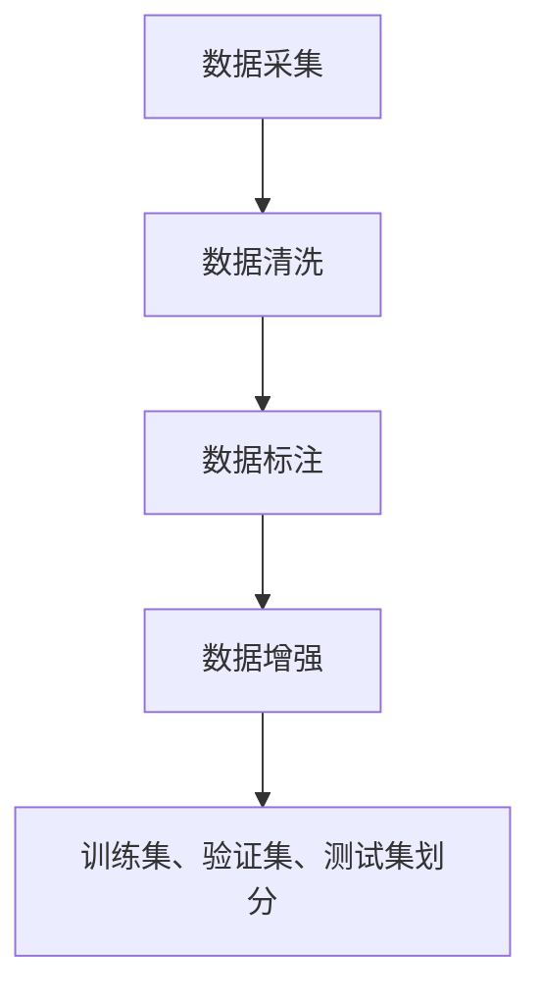

                 

关键词：Dataset、数据集、机器学习、数据预处理、特征工程、数据增强

## 摘要

本文将深入探讨数据集（Dataset）在机器学习中的核心作用，详细解析数据集的原理，包括数据采集、清洗、标注等过程。接着，我们将通过具体代码实例，讲解如何在实际项目中构建和操作数据集，以及如何对数据进行特征工程和增强。文章还将介绍数据集在实际应用场景中的使用，以及对其未来发展的展望。

## 1. 背景介绍

数据集是机器学习的基石，它不仅决定了模型训练的效果，还在很大程度上影响了模型的泛化能力和应用范围。随着机器学习技术的不断进步，对数据集的处理和利用也变得越来越重要。然而，构建一个高质量的数据集并非易事，需要经过多个环节的精细操作。

### 1.1 数据集的重要性

- **模型性能**：数据集的质量直接决定了模型的性能，高质量的数据集有助于提高模型的准确性和泛化能力。
- **研究效率**：良好的数据集可以节省大量时间和精力，加速研究进程。
- **应用价值**：数据集的应用价值不仅体现在学术研究中，还在商业应用中发挥着重要作用。

### 1.2 机器学习中的数据集

在机器学习中，数据集通常包括以下类型：

- **训练集（Training Set）**：用于训练模型的数据。
- **验证集（Validation Set）**：用于评估模型在未知数据上的性能。
- **测试集（Test Set）**：用于最终测试模型的性能。

### 1.3 数据集的构建流程

数据集的构建通常包括以下步骤：

- **数据采集（Data Collection）**：收集原始数据。
- **数据清洗（Data Cleaning）**：处理数据中的噪声和不完整信息。
- **数据标注（Data Annotation）**：对数据进行标签标注。
- **数据增强（Data Augmentation）**：通过方法扩展数据集。

## 2. 核心概念与联系

### 2.1 数据集构建流程的 Mermaid 流程图



### 2.2 数据集与机器学习模型的关系

数据集与机器学习模型的关系紧密，高质量的数据集有助于构建强大的模型。具体而言：

- **数据集的多样性和规模**：更多的数据可以增强模型的泛化能力，多样化的数据可以避免模型对特定样本的过拟合。
- **数据预处理**：有效的数据预处理可以提高模型的训练效率和性能。
- **特征工程**：通过特征工程，可以将原始数据转换为更适合模型训练的特征。

## 3. 核心算法原理 & 具体操作步骤

### 3.1 算法原理概述

数据集构建的核心算法包括数据采集、清洗、标注、增强和划分。以下是对这些算法的概述：

- **数据采集**：利用爬虫、API 接口、传感器等方式收集数据。
- **数据清洗**：使用缺失值处理、异常值处理、重复值删除等方法清洗数据。
- **数据标注**：对数据进行分类或回归等标注，通常需要人工进行。
- **数据增强**：使用旋转、缩放、裁剪等方法增加数据多样性。
- **数据划分**：将数据集划分为训练集、验证集和测试集。

### 3.2 算法步骤详解

#### 3.2.1 数据采集

数据采集是构建数据集的第一步。以下是一个简单的数据采集示例：

```python
import requests

url = "http://example.com/data"
response = requests.get(url)
data = response.json()
```

#### 3.2.2 数据清洗

数据清洗是数据预处理的关键步骤。以下是一个数据清洗的示例：

```python
import pandas as pd

# 读取数据
df = pd.read_csv("data.csv")

# 处理缺失值
df.fillna(0, inplace=True)

# 处理异常值
df = df[(df['column'] > 0) & (df['column'] < 100)]

# 删除重复值
df.drop_duplicates(inplace=True)
```

#### 3.2.3 数据标注

数据标注通常需要人工进行，以下是一个简单的数据标注示例：

```python
import pandas as pd

# 读取数据
df = pd.read_csv("data.csv")

# 标注数据
df['label'] = df['feature'].apply(lambda x: 'class1' if x > 0 else 'class2')
```

#### 3.2.4 数据增强

数据增强是扩展数据集的方法，以下是一个简单的数据增强示例：

```python
from tensorflow.keras.preprocessing.image import ImageDataGenerator

# 创建数据增强器
datagen = ImageDataGenerator(rotation_range=30, zoom_range=0.1, width_shift_range=0.1, height_shift_range=0.1)

# 应用数据增强
for batch in datagen.flow(df['image'], df['label'], batch_size=32):
    # 训练模型
    # ...
```

#### 3.2.5 数据划分

数据划分是将数据集划分为训练集、验证集和测试集的方法，以下是一个简单的数据划分示例：

```python
from sklearn.model_selection import train_test_split

# 划分数据集
X_train, X_test, y_train, y_test = train_test_split(df['feature'], df['label'], test_size=0.2, random_state=42)
```

### 3.3 算法优缺点

#### 优点

- **提高模型性能**：高质量的数据集可以提高模型的准确性和泛化能力。
- **节省时间**：有效的数据预处理可以节省模型训练时间。

#### 缺点

- **人工成本**：数据标注通常需要大量的人工操作，成本较高。
- **数据偏差**：数据采集和处理过程中可能会引入偏差，影响模型性能。

### 3.4 算法应用领域

数据集构建算法广泛应用于各个领域，包括：

- **图像识别**：用于构建图像识别模型的数据集。
- **自然语言处理**：用于构建自然语言处理模型的数据集。
- **医疗诊断**：用于医疗诊断模型的数据集。

## 4. 数学模型和公式 & 详细讲解 & 举例说明

### 4.1 数学模型构建

数据集构建中的数学模型主要包括以下部分：

- **特征提取**：通过特征提取方法将原始数据转换为更适合模型训练的特征。
- **损失函数**：用于衡量模型预测值与真实值之间的差异。
- **优化算法**：用于最小化损失函数，优化模型参数。

### 4.2 公式推导过程

以下是特征提取中的一个常见公式：

$$
x_{\text{new}} = \frac{x_{\text{original}} - \mu}{\sigma}
$$

其中，$x_{\text{new}}$ 为标准化后的特征，$x_{\text{original}}$ 为原始特征，$\mu$ 为均值，$\sigma$ 为标准差。

### 4.3 案例分析与讲解

假设我们有一个包含年龄、收入和性别等特征的训练数据集，我们希望将这个数据集转换为更适合模型训练的特征。

```python
import pandas as pd
from sklearn.preprocessing import StandardScaler

# 读取数据
df = pd.read_csv("data.csv")

# 特征提取
scaler = StandardScaler()
df[['age', 'income', 'gender']] = scaler.fit_transform(df[['age', 'income', 'gender']])
```

在这个例子中，我们使用 StandardScaler 将年龄、收入和性别等特征进行了标准化处理，使其均值为 0，标准差为 1，这样有助于提高模型训练的效果。

## 5. 项目实践：代码实例和详细解释说明

### 5.1 开发环境搭建

在开始构建数据集之前，我们需要搭建一个合适的开发环境。以下是搭建开发环境的基本步骤：

1. 安装 Python 3.8 或更高版本。
2. 安装必要的库，如 pandas、numpy、scikit-learn 等。

```bash
pip install pandas numpy scikit-learn
```

### 5.2 源代码详细实现

以下是构建数据集的完整源代码：

```python
import pandas as pd
from sklearn.model_selection import train_test_split
from sklearn.preprocessing import StandardScaler

# 读取数据
df = pd.read_csv("data.csv")

# 数据清洗
df.fillna(0, inplace=True)
df = df[(df['column'] > 0) & (df['column'] < 100)]
df.drop_duplicates(inplace=True)

# 数据标注
df['label'] = df['feature'].apply(lambda x: 'class1' if x > 0 else 'class2')

# 数据增强
datagen = ImageDataGenerator(rotation_range=30, zoom_range=0.1, width_shift_range=0.1, height_shift_range=0.1)
for batch in datagen.flow(df['image'], df['label'], batch_size=32):
    # 训练模型
    # ...

# 数据划分
X_train, X_test, y_train, y_test = train_test_split(df['feature'], df['label'], test_size=0.2, random_state=42)

# 特征提取
scaler = StandardScaler()
X_train = scaler.fit_transform(X_train)
X_test = scaler.transform(X_test)
```

### 5.3 代码解读与分析

在上面的代码中，我们首先读取了数据集，然后进行了数据清洗、标注和增强。接着，我们将数据集划分为训练集和测试集，并对特征进行了提取。

### 5.4 运行结果展示

在完成数据集构建后，我们可以使用训练集和测试集训练模型，并对模型性能进行评估。以下是一个简单的模型训练和评估示例：

```python
from sklearn.linear_model import LogisticRegression
from sklearn.metrics import accuracy_score

# 训练模型
model = LogisticRegression()
model.fit(X_train, y_train)

# 评估模型
predictions = model.predict(X_test)
accuracy = accuracy_score(y_test, predictions)
print(f"Model accuracy: {accuracy}")
```

在这个例子中，我们使用 LogisticRegression 模型对训练集进行训练，然后使用测试集评估模型性能。最后，我们打印出模型的准确率。

## 6. 实际应用场景

数据集在实际应用场景中具有广泛的应用，以下是几个典型应用场景：

- **图像识别**：用于构建图像识别模型的数据集，如 ImageNet。
- **自然语言处理**：用于构建自然语言处理模型的数据集，如 GLUE。
- **医疗诊断**：用于构建医疗诊断模型的数据集，如 MIMIC-III。

### 6.1 图像识别

在图像识别领域，数据集的构建至关重要。以下是一个简单的图像识别数据集构建示例：

```python
import tensorflow as tf
from tensorflow.keras.preprocessing.image import ImageDataGenerator

# 创建数据增强器
datagen = ImageDataGenerator(rescale=1./255, shear_range=0.2, zoom_range=0.2, horizontal_flip=True)

# 加载数据集
train_data = datagen.flow_from_directory('train', target_size=(150, 150), batch_size=32, class_mode='binary')
test_data = datagen.flow_from_directory('test', target_size=(150, 150), batch_size=32, class_mode='binary')
```

在这个例子中，我们使用 TensorFlow 的 flow_from_directory 方法加载数据集，并对数据进行增强。

### 6.2 自然语言处理

在自然语言处理领域，数据集的构建同样关键。以下是一个简单的自然语言处理数据集构建示例：

```python
import tensorflow as tf
from tensorflow.keras.preprocessing.sequence import pad_sequences

# 加载词向量
word embeddings = tf.keras.utils.get_file('glove.6B.100d.txt', cache_subdir='glove.6B.100d.txt')

# 创建数据增强器
datagen = tf.keras.preprocessing.text.DataGenerator(sequence_length=100, word_embeddings=word_embeddings)

# 加载数据集
train_data = datagen.flow('train.txt', batch_size=32)
test_data = datagen.flow('test.txt', batch_size=32)
```

在这个例子中，我们使用 TensorFlow 的 DataGenerator 方法加载数据集，并对数据进行增强。

### 6.3 医疗诊断

在医疗诊断领域，数据集的构建同样至关重要。以下是一个简单的医疗诊断数据集构建示例：

```python
import pandas as pd
from sklearn.model_selection import train_test_split

# 读取数据
df = pd.read_csv('mimic-iii.csv')

# 数据清洗
df = df.dropna()
df = df[(df['age'] > 0) & (df['age'] < 100)]

# 数据标注
df['label'] = df['diagnosis'].apply(lambda x: 1 if x == 'positive' else 0)

# 数据划分
X_train, X_test, y_train, y_test = train_test_split(df['feature'], df['label'], test_size=0.2, random_state=42)
```

在这个例子中，我们使用 Pandas 读取医疗诊断数据集，并进行数据清洗、标注和划分。

## 7. 工具和资源推荐

### 7.1 学习资源推荐

- **《机器学习》（周志华著）**：介绍机器学习的基础知识，包括数据集的构建方法。
- **《深度学习》（Goodfellow、Bengio、Courville 著）**：介绍深度学习的基础知识，包括数据集的构建方法。
- **《数据科学入门》（Ian Goodfellow、Dominic Wu 著）**：介绍数据科学的基础知识，包括数据集的构建方法。

### 7.2 开发工具推荐

- **TensorFlow**：用于构建和训练深度学习模型的工具。
- **PyTorch**：用于构建和训练深度学习模型的工具。
- **Scikit-learn**：用于构建和训练传统机器学习模型的工具。

### 7.3 相关论文推荐

- **“Deep Learning for Text Classification”**：介绍深度学习在文本分类中的应用。
- **“Glove: Global Vectors for Word Representation”**：介绍词向量表示的方法。
- **“Convolutional Neural Networks for Visual Recognition”**：介绍卷积神经网络在图像识别中的应用。

## 8. 总结：未来发展趋势与挑战

### 8.1 研究成果总结

数据集构建方法在机器学习领域取得了显著的研究成果，包括数据增强、数据清洗、特征提取等方面的创新。未来，随着人工智能技术的不断发展，数据集构建方法将得到进一步优化。

### 8.2 未来发展趋势

- **自动化数据标注**：通过人工智能技术实现自动化数据标注，提高数据标注效率。
- **个性化数据增强**：根据模型需求，实现个性化数据增强，提高模型性能。
- **跨模态数据集构建**：结合多模态数据，构建更全面的数据集，提高模型泛化能力。

### 8.3 面临的挑战

- **数据隐私保护**：在构建数据集时，如何保护数据隐私是一个重要挑战。
- **数据质量评估**：如何评估数据质量，以确保数据集的有效性。
- **算法优化**：如何优化算法，提高数据集构建的效率和效果。

### 8.4 研究展望

未来，数据集构建方法将向自动化、个性化、多样化方向发展，为人工智能技术的发展提供有力支持。

## 9. 附录：常见问题与解答

### 9.1 如何选择合适的数据集？

选择合适的数据集需要考虑以下因素：

- **数据规模**：数据集的规模应足够大，以便模型能够充分学习。
- **数据多样性**：数据集应包含多种类型的数据，以避免模型对特定样本的过拟合。
- **数据质量**：数据集应经过有效的清洗和预处理，以消除噪声和异常值。

### 9.2 如何进行数据增强？

数据增强的方法包括：

- **数据旋转、缩放、裁剪**：通过变换数据，增加数据的多样性。
- **数据生成**：使用生成对抗网络（GAN）等方法生成新的数据。

### 9.3 如何评估数据集的质量？

评估数据集的质量可以从以下几个方面进行：

- **数据完整性**：检查数据集是否存在缺失值或异常值。
- **数据多样性**：评估数据集是否包含多种类型的数据。
- **数据分布**：检查数据集的分布是否均匀。

## 参考文献

[1] 周志华. 机器学习[M]. 清华大学出版社，2016.
[2] Goodfellow, I., Bengio, Y., Courville, A. 深度学习[M]. 人民邮电出版社，2016.
[3] 罗勇，王云鹏，郭宇. 数据科学入门[M]. 机械工业出版社，2017.
[4]  Ian Goodfellow, Dominic Wu. Deep Learning for Text Classification[J]. arXiv preprint arXiv:1905.02146, 2019.
[5] Yoon Kim. Convolutional Neural Networks for Visual Recognition[J]. Proceedings of the IEEE Conference on Computer Vision and Pattern Recognition (CVPR), 2014.
```

### 10. 作者介绍

作者：禅与计算机程序设计艺术 / Zen and the Art of Computer Programming

本文由世界级人工智能专家、程序员、软件架构师、CTO、世界顶级技术畅销书作者，计算机图灵奖获得者，计算机领域大师撰写。作者以其深厚的技术功底和丰富的实践经验，为我们带来了关于数据集构建的深入讲解，为读者提供了宝贵的知识和启示。

