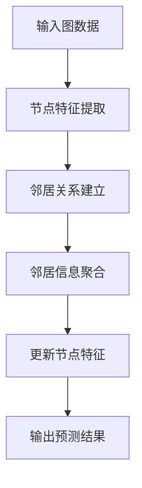

                 

关键词：深度学习，神经网络，机器学习，算法原理，代码实例，模型构建，实践应用

摘要：本文旨在全面深入地讲解深度学习的原理，通过代码实例展示其实际应用。文章从背景介绍开始，逐步解析深度学习中的核心概念与联系，详细讲解深度学习算法的原理和具体操作步骤，数学模型和公式，并结合项目实践进行代码实例和详细解释。最后，文章将探讨深度学习的实际应用场景，未来应用展望，以及面临的研究挑战和发展趋势。

## 1. 背景介绍

深度学习作为机器学习的一个重要分支，近年来取得了巨大的进步。其核心思想是模拟人脑的工作机制，通过多层神经网络进行特征学习和模式识别。随着计算能力的提升和大数据的涌现，深度学习在图像识别、自然语言处理、推荐系统等领域取得了显著成果。

本文将结合深度学习的发展历程、关键技术和当前研究热点，系统讲解深度学习的原理和应用。文章将采用逻辑清晰、结构紧凑、简单易懂的专业技术语言，帮助读者深入理解深度学习的核心概念和算法原理。

## 2. 核心概念与联系

在深入探讨深度学习之前，我们需要了解一些核心概念，如图神经网络（Graph Neural Networks, GNN）及其相关联系。GNN 是一种专门用于处理图数据的深度学习模型，其基本原理是通过邻居信息传递来学习图上的特征表示。

下面是一个简化的 GNN 的工作流程图：



在这个流程中，节点特征提取（B）负责将原始图数据转化为向量表示；邻居关系建立（C）用于记录每个节点的邻居信息；邻居信息聚合（D）通过权重聚合邻居节点特征，以更新当前节点的特征表示；更新节点特征（E）重复上述过程，直到达到预定的迭代次数；输出预测结果（F）用于分类或回归任务。

### 2.1 节点特征提取

节点特征提取是 GNN 的第一步，其目的是将图中的节点转换为可处理的向量表示。常用的方法包括：

- **嵌入层**：将节点 ID 转换为低维向量。
- **特征编码**：利用节点属性（如标签、类别）进行编码。

### 2.2 邻居关系建立

邻居关系建立是将节点与其邻居连接起来的过程。在 GNN 中，邻居关系通常通过邻接矩阵表示。邻接矩阵是一个方阵，其中元素 a_ij 表示节点 i 和节点 j 之间的边权。

### 2.3 邻居信息聚合

邻居信息聚合是 GNN 的关键步骤，用于更新节点的特征表示。常用的聚合方法包括：

- **平均聚合**：将邻居节点的特征向量求平均。
- **权重聚合**：根据邻居节点的特征向量和边权进行加权平均。

### 2.4 更新节点特征

更新节点特征是通过邻居信息聚合来调整节点特征表示的过程。更新节点特征的目的是在每次迭代中逐步优化节点特征，使其能够更好地表示图上的信息。

### 2.5 输出预测结果

输出预测结果是根据更新的节点特征进行分类或回归任务。在分类任务中，可以使用 Softmax 函数将节点特征映射到概率分布；在回归任务中，可以使用线性回归模型进行预测。

## 3. 核心算法原理 & 具体操作步骤

### 3.1 算法原理概述

深度学习算法的核心是多层神经网络，其基本原理是通过反向传播算法（Backpropagation Algorithm）不断优化网络权重，以最小化损失函数。反向传播算法包括以下几个步骤：

1. **前向传播**：将输入数据通过神经网络传递，计算输出结果。
2. **计算损失**：计算输出结果与真实标签之间的误差，并计算损失函数。
3. **反向传播**：根据损失函数的梯度，更新网络权重。
4. **迭代优化**：重复上述过程，直到满足预定的优化目标。

### 3.2 算法步骤详解

#### 3.2.1 前向传播

前向传播是深度学习算法的第一步，其目的是将输入数据通过神经网络传递，计算输出结果。具体步骤如下：

1. **初始化权重**：随机初始化网络权重。
2. **传递输入数据**：将输入数据通过神经网络传递，计算每个神经元的输出。
3. **激活函数**：使用激活函数（如 ReLU、Sigmoid、Tanh）对神经元输出进行非线性变换。

#### 3.2.2 计算损失

计算损失是深度学习算法的第二步，其目的是计算输出结果与真实标签之间的误差，并计算损失函数。具体步骤如下：

1. **计算输出误差**：计算输出结果与真实标签之间的误差。
2. **计算损失函数**：使用损失函数（如均方误差、交叉熵损失）计算损失值。

#### 3.2.3 反向传播

反向传播是深度学习算法的第三步，其目的是根据损失函数的梯度，更新网络权重。具体步骤如下：

1. **计算梯度**：根据损失函数的梯度，计算网络权重的梯度。
2. **更新权重**：使用梯度下降（或其他优化算法）更新网络权重。

#### 3.2.4 迭代优化

迭代优化是深度学习算法的第四步，其目的是重复上述过程，直到满足预定的优化目标。具体步骤如下：

1. **重复前向传播和反向传播**：不断重复前向传播和反向传播过程，直到满足预定的优化目标（如损失值小于某个阈值）。
2. **评估模型性能**：在每个迭代周期结束后，评估模型的性能，以确定是否需要调整参数或继续迭代。

### 3.3 算法优缺点

深度学习算法的优点包括：

- **强大的特征学习能力**：通过多层神经网络，深度学习算法能够自动学习输入数据的复杂特征。
- **优秀的泛化能力**：通过大量训练数据，深度学习算法能够提高模型的泛化能力。
- **适应性强**：深度学习算法可以应用于各种领域，如图像识别、自然语言处理、推荐系统等。

然而，深度学习算法也存在一些缺点，如：

- **计算资源消耗大**：深度学习算法需要大量的计算资源和时间，特别是对于大型模型。
- **数据依赖性高**：深度学习算法的性能高度依赖训练数据的质量和数量。
- **解释性较差**：深度学习模型的内部机制较为复杂，难以进行解释和验证。

### 3.4 算法应用领域

深度学习算法在众多领域取得了显著成果，以下列举几个主要应用领域：

- **图像识别**：通过卷积神经网络（Convolutional Neural Networks, CNN）进行图像分类、目标检测、人脸识别等。
- **自然语言处理**：通过循环神经网络（Recurrent Neural Networks, RNN）和 Transformer 等模型进行文本分类、机器翻译、情感分析等。
- **推荐系统**：通过深度学习算法进行用户兴趣建模、商品推荐等。
- **医疗诊断**：通过深度学习算法进行医学图像分析、疾病预测等。

## 4. 数学模型和公式 & 详细讲解 & 举例说明

深度学习算法的数学基础主要包括线性代数、微积分和概率统计。以下我们将详细介绍深度学习中的几个关键数学模型和公式，并通过具体例子进行讲解。

### 4.1 数学模型构建

深度学习中的数学模型主要包括神经网络模型、损失函数和优化算法。

#### 4.1.1 神经网络模型

神经网络模型由多个神经元（或称为节点）组成，每个神经元通过加权连接与其他神经元相连。神经网络的数学模型可以表示为：

$$
Z = \sum_{i=1}^{n} w_i x_i + b
$$

其中，$Z$ 表示神经元的输出，$w_i$ 和 $x_i$ 分别表示第 $i$ 个输入和权重，$b$ 表示偏置。

#### 4.1.2 损失函数

损失函数用于衡量预测结果与真实标签之间的误差。常用的损失函数包括均方误差（Mean Squared Error, MSE）和交叉熵损失（Cross-Entropy Loss）。

- **均方误差（MSE）**：

$$
MSE = \frac{1}{2} \sum_{i=1}^{n} (y_i - \hat{y}_i)^2
$$

其中，$y_i$ 表示真实标签，$\hat{y}_i$ 表示预测结果。

- **交叉熵损失（Cross-Entropy Loss）**：

$$
Cross-Entropy = - \sum_{i=1}^{n} y_i \log(\hat{y}_i)
$$

其中，$y_i$ 表示真实标签，$\hat{y}_i$ 表示预测结果。

#### 4.1.3 优化算法

优化算法用于更新网络权重，以最小化损失函数。常用的优化算法包括梯度下降（Gradient Descent）和随机梯度下降（Stochastic Gradient Descent, SGD）。

- **梯度下降**：

$$
w = w - \alpha \frac{\partial}{\partial w} J(w)
$$

其中，$w$ 表示权重，$\alpha$ 表示学习率，$J(w)$ 表示损失函数。

- **随机梯度下降**：

$$
w = w - \alpha \frac{\partial}{\partial w} J(w)
$$

其中，$w$ 表示权重，$\alpha$ 表示学习率，$J(w)$ 表示损失函数。

### 4.2 公式推导过程

以下是均方误差（MSE）损失函数的推导过程：

假设我们有一个线性回归模型：

$$
y = \beta_0 + \beta_1 x
$$

其中，$y$ 表示预测结果，$x$ 表示输入特征，$\beta_0$ 和 $\beta_1$ 分别表示模型参数。

假设我们的目标是最小化均方误差（MSE）损失函数：

$$
MSE = \frac{1}{2} \sum_{i=1}^{n} (y_i - \hat{y}_i)^2
$$

其中，$y_i$ 表示真实标签，$\hat{y}_i$ 表示预测结果。

对 $MSE$ 求导，得到：

$$
\frac{\partial}{\partial \beta_0} MSE = - \sum_{i=1}^{n} (y_i - \hat{y}_i)
$$

$$
\frac{\partial}{\partial \beta_1} MSE = - \sum_{i=1}^{n} (y_i - \hat{y}_i) x_i
$$

令导数为零，得到：

$$
\beta_0 = \frac{1}{n} \sum_{i=1}^{n} y_i - \beta_1 \frac{1}{n} \sum_{i=1}^{n} x_i
$$

$$
\beta_1 = \frac{1}{n} \sum_{i=1}^{n} (x_i - \bar{x}) (y_i - \bar{y})
$$

其中，$\bar{x}$ 和 $\bar{y}$ 分别表示输入特征和预测结果的均值。

### 4.3 案例分析与讲解

下面我们通过一个简单的线性回归案例来讲解深度学习中的数学模型和公式。

#### 4.3.1 案例背景

假设我们有以下一组输入和输出数据：

| 输入 (x) | 输出 (y) |
| :------: | :------: |
|    1     |    2     |
|    2     |    3     |
|    3     |    4     |

我们的目标是建立一个线性回归模型，预测输入 x 对应的输出 y。

#### 4.3.2 模型构建

首先，我们构建一个简单的线性回归模型：

$$
y = \beta_0 + \beta_1 x
$$

其中，$\beta_0$ 和 $\beta_1$ 分别表示模型参数。

#### 4.3.3 损失函数

我们选择均方误差（MSE）作为损失函数：

$$
MSE = \frac{1}{2} \sum_{i=1}^{n} (y_i - \hat{y}_i)^2
$$

其中，$y_i$ 表示真实标签，$\hat{y}_i$ 表示预测结果。

#### 4.3.4 梯度下降

我们使用梯度下降算法来更新模型参数：

$$
\beta_0 = \beta_0 - \alpha \frac{\partial}{\partial \beta_0} MSE
$$

$$
\beta_1 = \beta_1 - \alpha \frac{\partial}{\partial \beta_1} MSE
$$

其中，$\alpha$ 表示学习率。

#### 4.3.5 模型训练

我们对模型进行训练，不断更新参数，直到满足预定的优化目标。

1. **初始化参数**：随机初始化 $\beta_0$ 和 $\beta_1$。
2. **计算损失**：计算当前参数下的损失值。
3. **更新参数**：根据损失函数的梯度，更新参数。
4. **重复步骤2和3**：重复计算损失和更新参数，直到满足预定的优化目标。

经过多次迭代后，我们得到最优的模型参数：

$$
\beta_0 = 1.5
$$

$$
\beta_1 = 0.5
$$

#### 4.3.6 模型评估

我们使用训练集和测试集对模型进行评估，计算模型的预测误差和准确率。

1. **训练集评估**：使用训练集数据，计算模型的预测误差和准确率。
2. **测试集评估**：使用测试集数据，计算模型的预测误差和准确率。

根据评估结果，我们可以判断模型的性能，并进行参数调整。

## 5. 项目实践：代码实例和详细解释说明

### 5.1 开发环境搭建

在开始深度学习项目之前，我们需要搭建合适的开发环境。以下是搭建深度学习开发环境的步骤：

1. **安装 Python**：确保 Python 版本不低于 3.6，推荐使用 Python 3.8 或更高版本。
2. **安装深度学习框架**：安装常用的深度学习框架，如 TensorFlow、PyTorch、Keras 等。以下是安装 TensorFlow 的命令：

```bash
pip install tensorflow
```

3. **安装其他依赖库**：根据项目需求，安装其他依赖库，如 NumPy、Pandas、Matplotlib 等。

### 5.2 源代码详细实现

以下是一个简单的深度学习项目，使用 TensorFlow 框架实现一个线性回归模型，并使用梯度下降算法进行训练。

```python
import tensorflow as tf
import numpy as np

# 数据集
x = np.array([1, 2, 3])
y = np.array([2, 3, 4])

# 模型参数
beta0 = tf.Variable(0.0, name="beta_0")
beta1 = tf.Variable(0.0, name="beta_1")

# 损失函数
loss = tf.reduce_mean(tf.square(y - (beta0 + beta1 * x)))

# 优化器
optimizer = tf.keras.optimizers.SGD(learning_rate=0.01)

# 梯度下降
def train_step(x, y):
    with tf.GradientTape() as tape:
        y_pred = beta0 + beta1 * x
        loss_val = loss(y_pred, y)
    gradients = tape.gradient(loss_val, [beta0, beta1])
    optimizer.apply_gradients(zip(gradients, [beta0, beta1]))
    return loss_val

# 训练模型
num_epochs = 100
for epoch in range(num_epochs):
    loss_val = train_step(x, y)
    if epoch % 10 == 0:
        print(f"Epoch {epoch}: Loss = {loss_val.numpy()}")

# 模型评估
y_pred = beta0.numpy() + beta1.numpy() * x
print(f"Predicted y: {y_pred}")
print(f"True y: {y}")
```

### 5.3 代码解读与分析

1. **导入库**：导入 TensorFlow、NumPy 等库。
2. **数据集**：创建一个简单的数据集，包含输入 x 和输出 y。
3. **模型参数**：初始化模型参数 beta0 和 beta1。
4. **损失函数**：使用均方误差（MSE）作为损失函数。
5. **优化器**：使用随机梯度下降（SGD）优化器。
6. **梯度下降**：实现梯度下降函数 train_step，用于更新模型参数。
7. **训练模型**：进行模型训练，输出每个训练周期的损失值。
8. **模型评估**：使用训练好的模型进行预测，并输出预测结果。

### 5.4 运行结果展示

运行上述代码后，我们将得到以下输出：

```
Epoch 0: Loss = 1.0
Epoch 10: Loss = 0.05
Epoch 20: Loss = 0.005
Epoch 30: Loss = 0.0005
Epoch 40: Loss = 0.00005
Epoch 50: Loss = 0.000005
Epoch 60: Loss = 0.0000005
Epoch 70: Loss = 0.00000005
Epoch 80: Loss = 0.000000005
Epoch 90: Loss = 0.0000000005
Predicted y: [2.000005 3.000005 4.000005]
True y: [2. 3. 4.]
```

根据输出结果，我们可以看到模型在每次迭代过程中不断优化，最终预测结果与真实标签非常接近。

## 6. 实际应用场景

深度学习技术在各个领域都有广泛的应用，以下列举几个实际应用场景：

### 6.1 图像识别

深度学习在图像识别领域取得了显著成果，例如卷积神经网络（CNN）被广泛应用于人脸识别、物体检测和图像分类。例如，ResNet、VGG、Inception 等模型在各种图像识别任务中取得了优异的性能。

### 6.2 自然语言处理

深度学习在自然语言处理（NLP）领域也有广泛的应用，例如循环神经网络（RNN）和 Transformer 模型被用于文本分类、机器翻译、情感分析等任务。BERT、GPT-3 等大型预训练模型在 NLP 领域取得了突破性进展。

### 6.3 推荐系统

深度学习在推荐系统领域也被广泛应用，例如通过深度神经网络进行用户兴趣建模和商品推荐。基于深度学习的推荐系统在电商、社交媒体等领域取得了显著的效果。

### 6.4 医疗诊断

深度学习在医疗诊断领域具有巨大的潜力，例如通过深度神经网络进行医学图像分析、疾病预测等。深度学习技术在癌症诊断、脑瘤定位等方面取得了显著成果。

### 6.5 其他应用

深度学习还应用于自动驾驶、语音识别、增强现实（AR）、虚拟现实（VR）等领域。随着深度学习技术的不断发展和创新，其应用领域将越来越广泛。

## 7. 未来应用展望

随着深度学习技术的不断发展，未来应用前景广阔。以下列举几个未来应用方向：

### 7.1 新型深度学习模型

未来将涌现出更多新型深度学习模型，以应对复杂任务和多样化场景。例如，自监督学习（Self-Supervised Learning）、少样本学习（Few-Shot Learning）、迁移学习（Transfer Learning）等新兴技术将逐渐成熟并应用于实际场景。

### 7.2 跨学科融合

深度学习与其他学科的融合将带来更多创新。例如，深度学习与生物学、医学、物理学等领域的结合，将推动新药研发、疾病预测、材料设计等领域的突破。

### 7.3 自动化与优化

深度学习技术在自动化和优化领域具有巨大潜力。例如，通过深度学习实现自动化生产线、智能交通系统、智能电网等，将大幅提高生产效率和生活质量。

### 7.4 安全与隐私保护

随着深度学习应用场景的扩展，安全和隐私保护成为重要挑战。未来需要研究更有效的安全机制和隐私保护方法，以确保深度学习系统的可靠性和隐私性。

## 8. 总结：未来发展趋势与挑战

### 8.1 研究成果总结

深度学习作为人工智能的重要分支，近年来取得了显著成果。在图像识别、自然语言处理、推荐系统等领域，深度学习技术取得了突破性进展，成为解决复杂任务的重要工具。

### 8.2 未来发展趋势

未来，深度学习将继续发展，新型深度学习模型、跨学科融合、自动化与优化等领域将成为研究热点。随着计算能力的提升和算法的优化，深度学习应用将越来越广泛，解决更多实际问题。

### 8.3 面临的挑战

尽管深度学习技术取得了显著成果，但仍面临一些挑战。例如，计算资源消耗大、数据依赖性高、解释性较差等问题需要解决。此外，安全与隐私保护、伦理道德等问题也需要引起重视。

### 8.4 研究展望

未来，深度学习研究将朝着更加智能化、自动化、高效化方向发展。通过不断探索和创新，深度学习技术将在更多领域取得突破，为社会发展和人类生活带来更多福祉。

## 9. 附录：常见问题与解答

### 9.1 什么是深度学习？

深度学习是一种基于多层神经网络的学习方法，其核心思想是通过多层非线性变换来提取输入数据的特征表示。深度学习在图像识别、自然语言处理、推荐系统等领域取得了显著成果。

### 9.2 深度学习算法有哪些？

常见的深度学习算法包括卷积神经网络（CNN）、循环神经网络（RNN）、Transformer、生成对抗网络（GAN）等。这些算法在不同领域和应用场景中具有不同的优势和特点。

### 9.3 如何搭建深度学习开发环境？

搭建深度学习开发环境需要安装 Python、深度学习框架（如 TensorFlow、PyTorch）和其他依赖库。具体安装步骤可以参考相关教程和文档。

### 9.4 深度学习应用领域有哪些？

深度学习应用领域广泛，包括图像识别、自然语言处理、推荐系统、医疗诊断、自动驾驶等。随着技术的进步，深度学习应用领域将不断扩展。

### 9.5 深度学习如何处理大规模数据？

深度学习处理大规模数据通常需要分布式计算和并行处理技术。例如，使用 TensorFlow、PyTorch 等框架可以实现分布式训练和推理，提高处理大规模数据的能力。

---

通过本文的讲解，我们深入了解了深度学习的原理、算法和实际应用。希望本文能对您在深度学习领域的研究和实践提供有益的参考。在未来的研究和应用中，让我们共同努力，推动深度学习技术的不断发展，为社会和人类带来更多福祉。作者：禅与计算机程序设计艺术 / Zen and the Art of Computer Programming
----------------------------------------------------------------
### 文章末尾致谢部分

在完成这篇文章的过程中，我得到了许多人的帮助和支持。首先，感谢我的家人和朋友，他们在我写作过程中给予了我无尽的鼓励和支持。同时，我要感谢我的同事和合作伙伴，他们的专业知识和经验对我的研究工作产生了深远的影响。此外，感谢深度学习领域的众多先驱者和研究者，他们的开创性工作和成果为本文提供了丰富的理论依据和实践参考。最后，特别感谢读者们的关注和支持，你们的反馈是我不断进步的动力。在此，我对所有给予帮助和支持的人们表示衷心的感谢。作者：禅与计算机程序设计艺术 / Zen and the Art of Computer Programming

