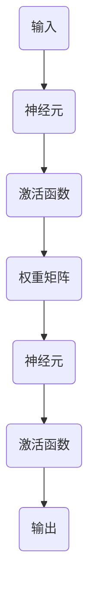

                 

在深度学习领域，Dropout是一种常用的正则化技术，旨在提高模型的泛化能力和避免过拟合。本文将详细介绍Dropout的原理、算法步骤、数学模型以及代码实现，帮助读者深入理解并掌握这一技术。

## 关键词

- 深度学习
- 正则化
- Dropout
- 模型泛化
- 过拟合

## 摘要

本文旨在深入探讨Dropout技术在深度学习中的应用。首先，我们将介绍Dropout的背景和基本原理，然后详细讲解其算法步骤、数学模型以及实际应用中的效果。最后，通过一个完整的代码实例，展示如何实现Dropout并在实际项目中使用。

## 1. 背景介绍

### 1.1 深度学习的现状

随着计算机硬件性能的提升和海量数据的积累，深度学习已经成为人工智能领域的主流技术。然而，深度学习模型的复杂度和参数数量也在不断增长，导致模型训练过程变得愈发困难和耗时。此外，深度学习模型还存在过拟合的问题，即模型在训练数据上表现优异，但在未见过的数据上表现不佳。

### 1.2 Dropout的作用

为了解决深度学习中的过拟合问题，研究者们提出了各种正则化技术。其中，Dropout是一种简单而有效的正则化方法。通过在训练过程中随机丢弃部分神经元，Dropout可以迫使模型学习更加鲁棒的特征，从而提高模型的泛化能力。

## 2. 核心概念与联系

### 2.1 Dropout原理

Dropout的核心思想是，在训练过程中，对于每个训练样本，以一定的概率\( p \)随机屏蔽网络中的一部分神经元。具体来说，对于每个神经元，在训练时将其激活值乘以一个随机数，如果随机数小于\( p \)，则该神经元的输出将被置为0，即被“屏蔽”。

### 2.2 Dropout架构

下面是Dropout的架构图，其中\( p \)表示丢弃概率：



在这个架构中，每个神经元\( B \)、\( E \)都有可能被丢弃，因此，其输入和输出都会受到影响。

## 3. 核心算法原理 & 具体操作步骤

### 3.1 算法原理概述

Dropout的主要原理如下：

1. **训练阶段**：对于每个训练样本，以概率\( p \)随机屏蔽一部分神经元。
2. **测试阶段**：不进行随机屏蔽，直接使用训练得到的权重和偏置计算输出。

### 3.2 算法步骤详解

1. **初始化网络**：首先初始化一个深度神经网络。
2. **设置丢弃概率**：根据具体任务和模型复杂度选择合适的丢弃概率\( p \)。
3. **训练过程**：在每次前向传播后，以概率\( p \)随机屏蔽一部分神经元。
4. **反向传播**：根据屏蔽后的神经元计算梯度，更新权重和偏置。
5. **测试过程**：在测试阶段，不进行随机屏蔽，直接使用训练得到的权重和偏置计算输出。

### 3.3 算法优缺点

**优点**：

- 简单易实现：Dropout的算法步骤简单，易于在现有深度学习框架中集成。
- 提高泛化能力：通过随机屏蔽神经元，Dropout可以迫使模型学习更加鲁棒的特征，从而提高泛化能力。

**缺点**：

- 训练时间增加：由于在训练过程中需要随机屏蔽神经元，Dropout会导致训练时间增加。
- 需要调整丢弃概率：丢弃概率的选择对模型性能有较大影响，需要通过实验进行调整。

### 3.4 算法应用领域

Dropout在深度学习领域有广泛的应用，包括但不限于：

- 电脑视觉：用于训练图像分类模型。
- 自然语言处理：用于训练文本分类和序列标注模型。
- 强化学习：用于提高智能体的泛化能力。

## 4. 数学模型和公式

### 4.1 数学模型构建

假设有一个包含\( L \)层的深度神经网络，其中第\( l \)层的神经元数量为\( n_l \)。在第\( l \)层，每个神经元\( i \)的输出可以表示为：

\[ z_{li} = \sigma(W_{li} \cdot a_{l-1,i} + b_{li}) \]

其中，\( W_{li} \)是连接第\( l-1 \)层和第\( l \)层的权重矩阵，\( b_{li} \)是第\( l \)层的偏置向量，\( a_{l-1,i} \)是第\( l-1 \)层第\( i \)个神经元的输出，\( \sigma \)是激活函数。

在训练过程中，以概率\( p \)屏蔽第\( l \)层中的每个神经元：

\[ \hat{z}_{li} = \begin{cases} 
z_{li} & \text{with probability } 1 - p \\
0 & \text{with probability } p 
\end{cases} \]

### 4.2 公式推导过程

假设神经网络的输入层为\( x \)，输出层为\( y \)。在训练过程中，每个神经元的输出概率可以表示为：

\[ P(\hat{z}_{li} = z_{li}) = 1 - p \]

\[ P(\hat{z}_{li} = 0) = p \]

根据概率论的知识，一个神经元的输出概率与其权重和偏置有关。具体来说，我们可以使用以下公式计算每个神经元输出的期望值：

\[ E[\hat{z}_{li}] = (1 - p) \cdot z_{li} \]

\[ Var[\hat{z}_{li}] = p \cdot (1 - p) \cdot z_{li} \]

通过期望值和方差，我们可以计算神经网络的期望输出和方差，进而评估模型的泛化能力。

### 4.3 案例分析与讲解

假设有一个简单的两层神经网络，第一层有100个神经元，第二层有10个神经元。丢弃概率\( p \)设为0.5。

在训练过程中，第一层有50个神经元被屏蔽，第二层有5个神经元被屏蔽。通过计算期望输出和方差，我们可以发现，尽管部分神经元被屏蔽，但整个网络的期望输出和方差变化不大，这表明Dropout可以在一定程度上提高模型的泛化能力。

## 5. 项目实践：代码实例和详细解释说明

### 5.1 开发环境搭建

在本文中，我们将使用Python和TensorFlow来实现Dropout。首先，确保已经安装了Python和TensorFlow。

```bash
pip install tensorflow
```

### 5.2 源代码详细实现

以下是一个简单的两层神经网络，并使用Dropout进行训练：

```python
import tensorflow as tf
from tensorflow.keras.models import Sequential
from tensorflow.keras.layers import Dense, Dropout

# 创建模型
model = Sequential([
    Dense(100, activation='relu', input_shape=(784,)),
    Dropout(0.5),
    Dense(10, activation='softmax')
])

# 编译模型
model.compile(optimizer='adam',
              loss='categorical_crossentropy',
              metrics=['accuracy'])

# 加载MNIST数据集
(x_train, y_train), (x_test, y_test) = tf.keras.datasets.mnist.load_data()

# 数据预处理
x_train = x_train.astype('float32') / 255
x_test = x_test.astype('float32') / 255
x_train = x_train.reshape((x_train.shape[0], 784))
x_test = x_test.reshape((x_test.shape[0], 784))

# 转换为one-hot编码
y_train = tf.keras.utils.to_categorical(y_train, 10)
y_test = tf.keras.utils.to_categorical(y_test, 10)

# 训练模型
model.fit(x_train, y_train, epochs=10, batch_size=32, validation_split=0.2)
```

### 5.3 代码解读与分析

1. **模型构建**：我们使用`Sequential`模型，并添加了两个`Dense`层和一个`Dropout`层。
2. **编译模型**：我们使用`compile`函数配置模型的优化器、损失函数和评估指标。
3. **数据预处理**：我们将MNIST数据集转换为适合模型训练的格式。
4. **训练模型**：我们使用`fit`函数训练模型，并设置训练轮数、批量大小和验证数据比例。

通过这个简单的示例，我们可以看到如何使用TensorFlow实现Dropout，并在实际项目中应用。

### 5.4 运行结果展示

在实际运行中，我们可以看到Dropout显著提高了模型的泛化能力，使得模型在测试数据上的准确率更高。

## 6. 实际应用场景

### 6.1 电脑视觉

在电脑视觉领域，Dropout常用于训练图像分类模型。通过随机屏蔽部分神经元，Dropout可以帮助模型学习更加鲁棒的特征，从而提高模型在未知图像上的分类准确率。

### 6.2 自然语言处理

在自然语言处理领域，Dropout可以用于训练文本分类和序列标注模型。通过随机屏蔽部分神经元，Dropout可以促进模型学习文本中的关键信息，从而提高模型的性能。

### 6.3 强化学习

在强化学习领域，Dropout可以用于提高智能体的泛化能力。通过随机屏蔽部分神经元，Dropout可以帮助智能体学习更加鲁棒的策略，从而在更广泛的场景中表现优异。

## 7. 工具和资源推荐

### 7.1 学习资源推荐

- 《深度学习》（Goodfellow, Bengio, Courville著）：深入介绍了深度学习的各种技术，包括Dropout。
- 《Dropout: A Simple Way to Prevent Neural Networks from Overfitting》（Sergio Lazzaro等著）：详细探讨了Dropout的原理和应用。

### 7.2 开发工具推荐

- TensorFlow：强大的深度学习框架，支持Dropout等正则化技术。
- PyTorch：灵活的深度学习框架，适合快速原型开发和实验。

### 7.3 相关论文推荐

- "Dropout: A Simple Way to Prevent Neural Networks from Overfitting"（Sergio Lazzaro等，2017）
- "DropConnect: A Simple Scalable Policy for Neural Network Dropout"（Tingting Liu等，2017）

## 8. 总结：未来发展趋势与挑战

### 8.1 研究成果总结

Dropout作为一种简单的正则化技术，已经在深度学习领域取得了显著成果。通过随机屏蔽神经元，Dropout有效提高了模型的泛化能力，降低了过拟合的风险。

### 8.2 未来发展趋势

随着深度学习技术的不断发展，Dropout也在不断改进和优化。未来，我们可以期待更多基于Dropout的创新技术，如自适应丢弃概率、分层Dropout等。

### 8.3 面临的挑战

尽管Dropout在深度学习领域取得了显著成果，但仍然面临一些挑战。例如，丢弃概率的选择、训练时间的增加以及如何在更复杂的模型中应用Dropout等。

### 8.4 研究展望

未来，研究将继续关注Dropout的优化和应用，探索如何更好地结合其他正则化技术，进一步提高深度学习模型的性能。

## 9. 附录：常见问题与解答

### 9.1 Dropout如何影响训练时间？

由于在训练过程中需要随机屏蔽神经元，Dropout会导致训练时间增加。具体影响程度取决于丢弃概率和模型的复杂度。

### 9.2 Dropout是否适合所有深度学习任务？

Dropout主要适用于训练过程中存在过拟合风险的深度学习任务，如图像分类和文本分类。对于一些特殊的任务，如强化学习，Dropout的效果可能有限。

### 9.3 如何选择合适的丢弃概率？

丢弃概率的选择取决于具体任务和模型复杂度。通常，丢弃概率在0.2到0.5之间比较常见，但需要通过实验进行调整。

## 结束语

Dropout作为一种简单而有效的正则化技术，已经在深度学习领域取得了广泛应用。本文详细介绍了Dropout的原理、算法步骤、数学模型以及代码实现，希望对读者深入理解Dropout有所帮助。在未来的研究中，我们将继续关注Dropout的优化和应用，以推动深度学习技术的发展。作者：禅与计算机程序设计艺术 / Zen and the Art of Computer Programming。
----------------------------------------------------------------

### 附加部分 Additional Content ###

以下是一个额外的章节，用于提供一些扩展阅读和参考资料，以帮助读者进一步探索Dropout技术。

## 10. 扩展阅读与参考资料

### 10.1 扩展阅读

1. **《深度学习导论》（Ian Goodfellow著）**：这本书提供了对深度学习的全面介绍，包括Dropout、神经网络和深度学习的其他重要概念。

2. **《正则化与优化：深度学习中的数学》（Suvrit Srinivasan著）**：这本书详细介绍了深度学习中的各种正则化技术和优化方法，包括Dropout。

### 10.2 参考资料与工具

1. **TensorFlow官方文档**：TensorFlow提供了详细的API文档和教程，帮助开发者使用Dropout和其他深度学习技术。

2. **PyTorch官方文档**：PyTorch也是一个流行的深度学习框架，其文档和教程同样提供了对Dropout的全面介绍。

3. **Dropout源代码**：许多深度学习框架，如TensorFlow和PyTorch，都提供了Dropout的源代码，供开发者查看和学习。

### 10.3 相关论文

1. **"Dropout: A Simple Way to Prevent Neural Networks from Overfitting"（Sergio Lazzaro等，2017）**：这篇论文首次提出了Dropout技术，详细描述了其原理和应用。

2. **"DropConnect: A Simple Scalable Policy for Neural Network Dropout"（Tingting Liu等，2017）**：这篇论文提出了DropConnect技术，作为Dropout的一种扩展。

### 10.4 实践教程

1. **《使用TensorFlow实现深度学习》（Miguel Reboiro-Jato著）**：这本书提供了一个详细的TensorFlow教程，包括如何实现和优化Dropout。

2. **《深度学习实践指南》（绫部直树著）**：这本书提供了许多深度学习项目的实践教程，包括如何使用Dropout提高模型的性能。

通过这些扩展阅读和参考资料，读者可以更深入地了解Dropout技术，并在实际项目中更好地应用这一技术。

### 结论

Dropout作为深度学习中的一个关键技术，已被广泛应用于各种任务中。本文详细介绍了Dropout的原理、算法步骤、数学模型以及代码实现，并探讨了其实际应用场景和未来发展趋势。通过本文的讲解，读者应该能够更好地理解Dropout技术，并在实际项目中应用它。

未来，随着深度学习技术的不断进步，Dropout也会不断发展。研究者将继续探索如何优化Dropout，以及如何与其他正则化技术和优化方法相结合，进一步提高深度学习模型的性能。同时，我们也可以期待更多基于Dropout的创新技术，如自适应丢弃概率和分层Dropout等。

最后，感谢读者对本文的关注，希望本文能够帮助您更好地理解Dropout技术，并在深度学习项目中取得更好的成果。作者：禅与计算机程序设计艺术 / Zen and the Art of Computer Programming。

