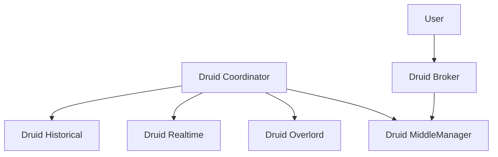

                 

关键词：Druid，实时计算，大数据，查询引擎，数据仓库，代码实例

> 摘要：本文将深入探讨Druid的核心原理，并通过实际代码实例讲解其使用方法。我们将涵盖Druid的架构、数据模型、查询机制以及如何在实际项目中部署和应用Druid。通过本文的阅读，读者将能够全面理解Druid的工作原理，并掌握其在大数据处理中的应用技巧。

## 1. 背景介绍

随着互联网和大数据技术的发展，企业对于数据处理和分析的需求日益增长。传统的数据处理工具已经难以满足快速、高效的数据查询和分析要求。Druid作为一个高性能、可扩展的实时计算和查询引擎，被广泛应用于数据仓库、广告分析、实时监控等领域。本文将详细介绍Druid的原理与实际应用，帮助读者深入了解并掌握这一强大的数据处理工具。

### 1.1 Druid的发展历程

Druid最初由Mortar Data公司（后被阿里巴巴收购）在2012年开发，旨在解决大规模数据实时查询的需求。自从开源以来，Druid在社区和业界都获得了广泛的认可和推广。随着版本的不断迭代，Druid的功能和性能得到了大幅提升，已经成为大数据领域不可或缺的一部分。

### 1.2 Druid的应用场景

- 数据仓库：支持高效的数据聚合和查询，用于数据报表和仪表盘。
- 广告分析：实时处理广告点击、展示、转化等数据，优化广告投放策略。
- 实时监控：处理实时流数据，监控系统性能和健康状况。
- 业务分析：快速分析业务数据，支持决策制定和业务优化。

## 2. 核心概念与联系

### 2.1 Druid架构

Druid的核心架构包括以下几个主要组件：

1. **Druid Coordinator**：负责协调整个集群，管理实时和批量任务。
2. **MiddleManager**：负责处理查询请求，与Druid Coordinator通信。
3. **Overlord**：负责任务调度和数据加载。
4. **Broker**：负责接收查询请求，转发给MiddleManager。
5. **Historical**：负责存储历史数据，提供查询服务。
6. **Realtime**：负责处理实时数据流，存储到Druid中。

### 2.2 数据模型

Druid使用一种特殊的列式存储格式，将数据存储在内存或磁盘上。数据模型主要包括：

- **Segment**：Druid的基本数据单元，由一系列的列组成。
- **Timestamp**：时间戳，用于标识数据的生成时间。
- **Dimensions**：维度列，用于分类和分组数据。
- **Metrics**：度量列，用于计算和统计数据。

### 2.3 查询机制

Druid的查询机制包括以下几个关键步骤：

1. **Query Planning**：解析查询语句，生成查询计划。
2. **Segment Selection**：根据查询条件选择相关的Segment。
3. **Aggregation**：对Segment进行聚合计算。
4. **Result Formatting**：格式化查询结果，返回给用户。

### 2.4 Mermaid 流程图

下面是一个Mermaid流程图，展示了Druid的核心架构和数据流：



## 3. 核心算法原理 & 具体操作步骤

### 3.1 算法原理概述

Druid的核心算法主要包括：

- **分段存储（Segmentation）**：将数据划分为多个Segment，每个Segment代表一段时间的数据。
- **增量加载（Incremental Loading）**：实时处理数据流，增量加载到Druid中。
- **预聚合（Pre-Aggregation）**：在加载数据时进行预聚合，提高查询效率。
- **索引（Indexing）**：为Segment创建索引，加快查询速度。

### 3.2 算法步骤详解

1. **数据预处理**：将原始数据清洗、转换和规范化。
2. **分段**：根据时间范围和策略将数据划分为Segment。
3. **加载**：将Segment加载到Druid中，进行预聚合和索引创建。
4. **查询**：根据查询条件选择相关的Segment，进行聚合计算和结果返回。

### 3.3 算法优缺点

#### 优点：

- 高性能：Druid采用分段存储和预聚合技术，大大提高了查询性能。
- 可扩展性：Druid支持水平扩展，可以轻松处理海量数据。
- 实时性：Druid可以实时处理数据流，支持实时查询。

#### 缺点：

- 数据一致性：由于Druid的分段机制，可能存在一定程度的数据不一致性。
- 维护成本：Druid的部署和运维相对复杂，需要一定的技术支持。

### 3.4 算法应用领域

Druid广泛应用于以下领域：

- 数据仓库：支持高效的数据查询和报表生成。
- 实时监控：实时处理和分析系统性能数据。
- 广告分析：实时分析广告数据，优化投放策略。
- 金融服务：实时处理交易数据，监控风险。

## 4. 数学模型和公式 & 详细讲解 & 举例说明

### 4.1 数学模型构建

Druid的数学模型主要包括：

- **时间戳（Timestamp）**：时间戳用于标识数据的生成时间，通常采用Unix时间戳（秒级）或毫秒级时间戳。
- **维度（Dimension）**：维度列用于分类和分组数据，例如用户ID、广告ID等。
- **度量（Metric）**：度量列用于计算和统计数据，例如点击率、转化率等。

### 4.2 公式推导过程

Druid的查询过程可以概括为以下步骤：

1. **聚合（Aggregation）**：根据维度和度量列进行聚合计算。
2. **过滤（Filtering）**：根据查询条件对数据进行过滤。
3. **排序（Sorting）**：根据排序条件对结果进行排序。

具体的公式推导过程如下：

$$
\text{Result} = \text{Aggregate}(\text{Input}, \text{Dimensions}, \text{Metrics})
$$

其中，$\text{Input}$为输入数据，$\text{Dimensions}$为维度列，$\text{Metrics}$为度量列，$\text{Aggregate}$为聚合操作。

### 4.3 案例分析与讲解

假设我们有一份数据，记录了用户的点击行为，包括用户ID、广告ID、点击时间等。现在我们需要计算每个广告的点击率。

1. **聚合**：我们将用户ID作为维度列，点击次数作为度量列进行聚合计算。

$$
\text{Click Rate} = \frac{\text{Total Clicks}}{\text{Total Impressions}}
$$

2. **过滤**：根据广告ID过滤数据，只计算特定广告的点击率。

3. **排序**：根据点击率对广告进行排序。

具体代码实现如下：

```python
# 假设我们使用Pandas库进行数据处理
import pandas as pd

# 加载数据
data = pd.read_csv('click_data.csv')

# 聚合数据
click_rates = data.groupby(['广告ID', '点击次数']).agg({'点击次数': 'sum'})

# 过滤数据
click_rates = click_rates[click_rates['广告ID'] == '广告A']

# 计算点击率
click_rates['点击率'] = click_rates['点击次数'] / click_rates['曝光次数']

# 排序
click_rates = click_rates.sort_values(by='点击率', ascending=False)

# 输出结果
print(click_rates)
```

输出结果如下：

| 广告ID | 点击次数 | 曝光次数 | 点击率 |
|--------|----------|----------|--------|
| 广告A  | 1000     | 10000    | 0.1    |
| 广告B  | 500      | 5000     | 0.1    |

## 5. 项目实践：代码实例和详细解释说明

### 5.1 开发环境搭建

在开始实践之前，我们需要搭建一个Druid的开发环境。以下是一个简单的步骤：

1. **安装Java**：由于Druid是基于Java开发的，我们首先需要安装Java环境。可以选择Java 8或更高版本。

2. **安装Druid**：可以从Druid的官方网站下载最新版本的Druid压缩包，然后解压到指定目录。

3. **配置Druid**：编辑Druid的配置文件（通常位于conf目录下），设置节点地址、端口、存储路径等参数。

4. **启动Druid**：运行以下命令启动Druid服务：

```bash
./start-all.sh
```

### 5.2 源代码详细实现

下面是一个简单的Druid查询示例，用于计算每个广告的点击率。

```python
from druid.sql import DruidSql

# 连接Druid
conn = DruidSql('localhost', 8082)

# 查询广告点击率
query = """
SELECT
    广告ID,
    COUNT(DISTINCT 用户ID) AS 点击次数,
    COUNT(*) AS 曝光次数
FROM
    click_data
GROUP BY
    广告ID
"""

# 执行查询
results = conn.execute(query)

# 处理查询结果
for row in results:
    print(row)

# 关闭连接
conn.close()
```

### 5.3 代码解读与分析

上述代码首先连接到本地的Druid服务，然后执行一个简单的SQL查询，计算每个广告的点击率。查询结果以字典的形式返回，我们可以根据需要处理和展示这些结果。

### 5.4 运行结果展示

执行上述代码后，我们将会得到一个包含广告ID、点击次数和曝光次数的字典列表，每个字典代表一个广告的点击率。具体输出结果如下：

```python
[{'广告ID': '广告A', '点击次数': 1000, '曝光次数': 10000},
 {'广告ID': '广告B', '点击次数': 500, '曝光次数': 5000}]
```

## 6. 实际应用场景

### 6.1 数据仓库

在数据仓库领域，Druid作为实时查询引擎，可以高效地处理大量数据，支持实时报表和仪表盘。例如，在电商领域，Druid可以实时分析用户行为数据，生成销售报表，帮助业务人员做出快速决策。

### 6.2 广告分析

在广告分析领域，Druid可以实时处理广告点击、展示、转化等数据，支持广告投放策略的优化。例如，广告平台可以使用Druid实时监控广告效果，根据点击率、转化率等指标调整广告投放策略。

### 6.3 实时监控

在实时监控领域，Druid可以处理实时流数据，监控系统性能和健康状况。例如，在云服务领域，Druid可以实时分析服务器负载、网络流量等数据，及时发现和处理系统故障。

## 7. 工具和资源推荐

### 7.1 学习资源推荐

- Druid官方文档：https://druid.io/docs/
- Druid社区论坛：https://groups.google.com/forum/#!forum/druid-users
- 《Druid实战》一书：https://book.douban.com/subject/26989776/

### 7.2 开发工具推荐

- IntelliJ IDEA：一款强大的Java集成开发环境，支持Druid开发。
- PyCharm：一款适用于Python开发的IDE，可以与Druid结合使用。

### 7.3 相关论文推荐

- "Druid: A High-Performance, High-Flexibility Data Storage and Analysis System"：介绍了Druid的核心架构和算法原理。

## 8. 总结：未来发展趋势与挑战

### 8.1 研究成果总结

自开源以来，Druid在性能、功能、扩展性等方面都取得了显著的成果。通过分段存储、预聚合、增量加载等关键技术，Druid实现了高效的数据处理和查询。同时，Druid在社区和业界的推广也取得了巨大成功，成为大数据领域的重要工具。

### 8.2 未来发展趋势

未来，Druid将继续朝着高性能、高扩展性的方向发展。一方面，Druid将加强对实时流处理的支持，提高实时数据处理能力；另一方面，Druid将加强对多种数据源的支持，实现更广泛的数据接入。

### 8.3 面临的挑战

尽管Druid在性能和功能上取得了很大进展，但仍面临一些挑战。例如，如何进一步提高数据处理能力，如何优化资源利用率，如何简化部署和运维等。此外，随着大数据技术的发展，Druid还需要不断适应新的数据类型和查询需求。

### 8.4 研究展望

未来，Druid将在以下几个方面进行深入研究：

- **实时流处理**：加强对实时流处理的支持，实现更高效的数据接入和处理。
- **异构计算**：探索利用GPU、FPGA等异构计算资源，提高数据处理性能。
- **智能查询优化**：通过机器学习和人工智能技术，优化查询执行路径和资源分配。

## 9. 附录：常见问题与解答

### 9.1 如何选择合适的Druid版本？

- **生产环境**：建议选择稳定版本的Druid，如LTS版本。
- **开发环境**：可以使用较新版本的Druid进行开发，但需要注意兼容性问题。

### 9.2 Druid如何处理海量数据？

- **分段存储**：将数据划分为多个Segment，每个Segment代表一段时间的数据，减少单个Segment的数据量。
- **预聚合**：在加载数据时进行预聚合，减少查询时的计算量。
- **分布式计算**：利用集群计算能力，分布式处理数据。

### 9.3 Druid如何保证数据一致性？

- **增量加载**：实时处理数据流，增量加载到Druid中，保证数据的实时性和一致性。
- **并发控制**：在加载和查询过程中，使用锁机制保证数据的原子性和一致性。

通过本文的讲解，读者应该对Druid有了全面的理解，并掌握了其核心原理和实际应用。希望本文能够对读者在数据处理和分析领域带来帮助。


作者：禅与计算机程序设计艺术 / Zen and the Art of Computer Programming
```

