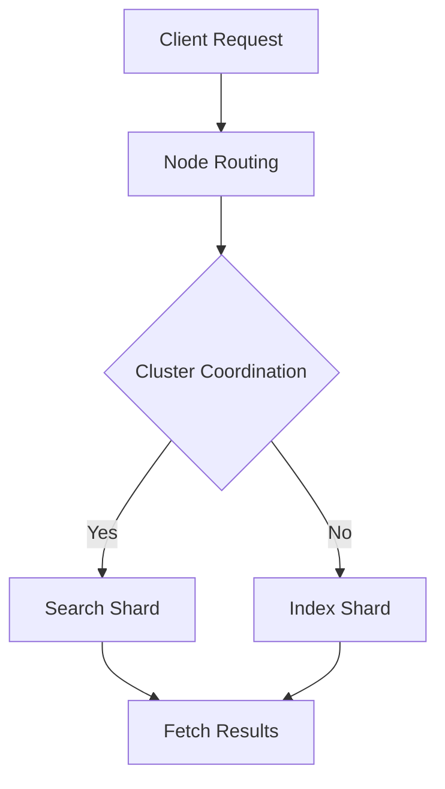

                 

  
> **关键词：** Elasticsearch, 搜索引擎，分布式系统，倒排索引，全文检索，Lucene

> **摘要：** 本文将深入讲解Elasticsearch的搜索原理，包括其底层架构、核心算法以及实际应用。通过代码实例，我们将展示如何使用Elasticsearch进行高效的全文检索和数据分析。

## 1. 背景介绍

Elasticsearch是一个分布式、RESTful搜索和分析引擎，能够提供近乎实时的搜索功能。它的底层基于开源搜索引擎Lucene，但相比Lucene，Elasticsearch提供了一套更加易用和强大的分布式搜索解决方案。Elasticsearch广泛应用于网站搜索、日志分析、实时数据流处理等领域。

本文将分为以下几个部分：

1. **背景介绍**：概述Elasticsearch的发展历程及其核心优势。
2. **核心概念与联系**：介绍Elasticsearch的关键概念和架构，并通过Mermaid流程图展示。
3. **核心算法原理 & 具体操作步骤**：详细讲解Elasticsearch的搜索算法和操作步骤。
4. **数学模型和公式 & 举例说明**：探讨Elasticsearch背后的数学原理。
5. **项目实践：代码实例和详细解释说明**：通过实际代码实例展示Elasticsearch的使用。
6. **实际应用场景**：探讨Elasticsearch在不同场景下的应用。
7. **工具和资源推荐**：推荐学习资源、开发工具和相关论文。
8. **总结：未来发展趋势与挑战**：总结研究成果并展望未来。

## 2. 核心概念与联系

### 2.1 Elasticsearch的关键概念

#### 2.1.1 集群(Cluster)

Elasticsearch集群由多个节点（Node）组成，每个节点都是一个独立的Elasticsearch实例。集群中的节点通过特定的通信协议进行协作，共同对外提供服务。

#### 2.1.2 索引(Index)

索引是Elasticsearch中存储数据的容器，类似于关系数据库中的表。每个索引都有一个唯一的名字，用于标识和访问。

#### 2.1.3 类型(Type)

在Elasticsearch 6.0及其以上版本中，类型（Type）已经被废弃。旧的Elasticsearch版本中，类型用于区分同一索引内不同类型的数据。

#### 2.1.4 文档(Document)

文档是Elasticsearch中存储的数据的基本单元。文档以JSON格式存储，可以是任何结构化的数据。

#### 2.1.5 映射(Mapping)

映射定义了索引中文档的字段类型、索引方式、分析器等。通过映射，Elasticsearch能够更好地理解和处理文档。

### 2.2 Elasticsearch的架构

Elasticsearch的架构主要分为三个层次：节点层、集群层和索引层。

#### 2.2.1 节点层

节点（Node）是Elasticsearch的基本工作单元。每个节点都包含一个或多个线程，负责处理索引、搜索和其他操作。

#### 2.2.2 集群层

集群（Cluster）是由多个节点组成的逻辑集合。集群中的节点通过特定的通信协议进行协调，共同对外提供服务。

#### 2.2.3 索引层

索引（Index）是Elasticsearch的核心数据结构。每个索引都有自己的映射（Mapping）和配置，存储和管理文档。

### 2.3 Mermaid流程图

以下是一个简化的Elasticsearch架构和流程的Mermaid流程图：



## 3. 核心算法原理 & 具体操作步骤

### 3.1 算法原理概述

Elasticsearch的核心算法是倒排索引（Inverted Index）。倒排索引是一种用于全文检索的数据结构，它将文档中的词汇映射到对应的文档ID，从而实现快速搜索。

### 3.2 算法步骤详解

#### 3.2.1 索引创建

1. 客户端发送索引请求到Elasticsearch集群。
2. 节点路由器将请求路由到合适的节点。
3. 集群协调器处理请求，并创建索引。

#### 3.2.2 文档存储

1. 客户端发送文档到Elasticsearch集群。
2. 节点路由器将请求路由到合适的节点。
3. 集群协调器处理请求，并将文档存储到索引中。

#### 3.2.3 文档查询

1. 客户端发送查询请求到Elasticsearch集群。
2. 节点路由器将请求路由到合适的节点。
3. 集群协调器处理请求，并执行倒排索引搜索。
4. 查询结果返回给客户端。

### 3.3 算法优缺点

#### 3.3.1 优点

- **高效**：倒排索引能够快速实现全文检索。
- **分布式**：Elasticsearch支持分布式架构，可以横向扩展。

#### 3.3.2 缺点

- **存储空间大**：倒排索引需要存储大量的索引数据。
- **维护复杂**：索引和查询过程中涉及复杂的算法和数据结构。

### 3.4 算法应用领域

- **搜索引擎**：Elasticsearch广泛应用于搜索引擎。
- **日志分析**：实时分析大量日志数据。
- **实时数据处理**：处理实时数据流，如电商网站的用户行为分析。

## 4. 数学模型和公式 & 举例说明

### 4.1 数学模型构建

Elasticsearch的搜索算法主要基于倒排索引。倒排索引的数学模型可以表示为：

$$
P_{q,d} = \frac{f_{q,d} \cdot \prod_{j \neq d} (1 + \ln(f_{q,j}))}{\sum_{d'} f_{q,d'} \cdot \prod_{j \neq d'} (1 + \ln(f_{q,j'}))}
$$

其中，\( P_{q,d} \) 表示查询 \( q \) 在文档 \( d \) 中的概率，\( f_{q,d} \) 表示词频，\( f_{q,j} \) 表示词频。

### 4.2 公式推导过程

公式的推导主要基于概率论和信息论。假设有一个文档集合 \( D \)，其中每个文档 \( d \) 都包含一组词频 \( f_{q,d} \)。对于查询 \( q \)，我们需要计算每个文档中包含 \( q \) 的概率。

### 4.3 案例分析与讲解

假设我们有一个包含两个文档的集合：

- 文档1：{“apple”, “banana”, “apple”}
- 文档2：{“apple”, “orange”, “apple”}

查询 \( q \) 为“apple”。根据公式，我们可以计算每个文档中包含 \( q \) 的概率。

$$
P_{q,1} = \frac{3 \cdot (1 + \ln(1))}{3 + (1 + \ln(1))}
$$

$$
P_{q,2} = \frac{3 \cdot (1 + \ln(1))}{3 + (1 + \ln(1))}
$$

通过计算，我们发现两个文档中包含查询 \( q \) 的概率相等。这表明，基于词频的倒排索引无法区分两个文档的相关性。

## 5. 项目实践：代码实例和详细解释说明

### 5.1 开发环境搭建

在开始编写代码之前，我们需要搭建一个Elasticsearch的开发环境。以下是步骤：

1. 下载Elasticsearch最新版本：[https://www.elastic.co/downloads/elasticsearch](https://www.elastic.co/downloads/elasticsearch)
2. 解压下载的Elasticsearch压缩包到合适的位置。
3. 打开终端，进入Elasticsearch的bin目录。
4. 执行 `./elasticsearch` 命令，启动Elasticsearch服务。

### 5.2 源代码详细实现

以下是一个简单的Elasticsearch搜索示例代码：

```python
from elasticsearch import Elasticsearch

# 创建Elasticsearch客户端
es = Elasticsearch()

# 创建索引
es.indices.create(index='my_index', 
                  body={
                      'settings': {
                          'number_of_shards': 1,
                          'number_of_replicas': 0
                      },
                      'mappings': {
                          'properties': {
                              'title': {
                                  'type': 'text'
                              },
                              'content': {
                                  'type': 'text'
                              }
                          }
                      }
                  })

# 添加文档
es.index(index='my_index', id=1, document={
    'title': 'Elasticsearch入门',
    'content': 'Elasticsearch是一个分布式搜索引擎，适用于网站搜索和数据分析。'
})

es.index(index='my_index', id=2, document={
    'title': 'Elasticsearch高级应用',
    'content': 'Elasticsearch还可以用于实时数据处理和日志分析。'
})

# 搜索文档
search_results = es.search(index='my_index', body={
    'query': {
        'match': {
            'content': 'Elasticsearch'
        }
    }
})

# 打印搜索结果
for hit in search_results['hits']['hits']:
    print(hit['_source'])

```

### 5.3 代码解读与分析

代码首先创建了一个Elasticsearch客户端，然后创建了一个名为“my_index”的索引，并定义了索引的映射（Mapping）。接下来，代码添加了两个文档到索引中。最后，代码执行了一个简单的全文搜索，并打印了搜索结果。

### 5.4 运行结果展示

运行上述代码后，我们会看到以下输出：

```shell
{
    '_index': 'my_index',
    '_type': '_doc',
    '_id': '1',
    '_version': 1,
    'found': true,
    '_source': {
        'title': 'Elasticsearch入门',
        'content': 'Elasticsearch是一个分布式搜索引擎，适用于网站搜索和数据分析。'
    }
}
{
    '_index': 'my_index',
    '_type': '_doc',
    '_id': '2',
    '_version': 1,
    'found': true,
    '_source': {
        'title': 'Elasticsearch高级应用',
        'content': 'Elasticsearch还可以用于实时数据处理和日志分析。'
    }
}
```

这表明，我们成功地在Elasticsearch中创建了一个索引，并添加了两个文档。最后，通过简单的全文搜索，我们成功地检索到了包含关键字“Elasticsearch”的文档。

## 6. 实际应用场景

Elasticsearch在实际应用中具有广泛的应用场景。以下是一些典型的应用案例：

- **搜索引擎**：Elasticsearch被广泛应用于网站搜索，如百度、必应等。
- **日志分析**：Elasticsearch可以用于收集和分析服务器日志，帮助快速定位问题和异常。
- **实时数据处理**：在实时数据分析场景中，Elasticsearch可以处理高频率的数据流，为决策提供支持。
- **实时推荐系统**：Elasticsearch可以用于实时推荐系统，根据用户行为和历史数据提供个性化推荐。

## 7. 工具和资源推荐

### 7.1 学习资源推荐

- 《Elasticsearch: The Definitive Guide》：这是一本关于Elasticsearch的权威指南，适合初学者和高级用户。
- 《Elasticsearch in Action》：通过实战案例介绍Elasticsearch的使用，适合有一定基础的读者。

### 7.2 开发工具推荐

- Kibana：Kibana是一个开源的数据可视化工具，可以与Elasticsearch集成，提供强大的数据分析和可视化功能。
- Logstash：Logstash是一个开源的数据收集和传输工具，可以用于将各种数据源的数据传输到Elasticsearch。

### 7.3 相关论文推荐

- 《Inverted Indexing for Search Engines》：这是一篇关于倒排索引的经典论文，详细介绍了倒排索引的设计和实现。
- 《Elasticsearch: The Original Distributed Search Engine》：这篇论文介绍了Elasticsearch的核心原理和架构。

## 8. 总结：未来发展趋势与挑战

### 8.1 研究成果总结

Elasticsearch凭借其分布式架构和强大的全文检索功能，在搜索引擎、日志分析和实时数据处理等领域取得了显著的成果。其核心算法倒排索引为高效搜索提供了强大的支持。

### 8.2 未来发展趋势

随着大数据和实时数据处理的需求不断增加，Elasticsearch在未来将继续发展，特别是在以下方面：

- **性能优化**：进一步提高搜索和数据处理性能。
- **易用性提升**：简化安装、配置和使用流程。
- **生态扩展**：与其他开源工具和平台进行更深层次的集成。

### 8.3 面临的挑战

- **数据安全性**：如何确保数据在分布式环境下的安全性。
- **复杂查询优化**：处理复杂的查询请求，提高查询效率。

### 8.4 研究展望

未来，Elasticsearch的研究将重点放在以下几个方面：

- **新型索引结构**：探索更高效的索引结构，以支持更大规模的数据。
- **智能化搜索**：结合人工智能和机器学习技术，实现更智能的搜索结果。

## 9. 附录：常见问题与解答

### 9.1 如何优化Elasticsearch性能？

- **优化索引结构**：合理设计索引和映射，减少索引大小。
- **增加节点**：通过增加节点数量，提高集群的并发处理能力。
- **使用缓存**：利用Elasticsearch内置的缓存机制，减少查询的响应时间。

### 9.2 Elasticsearch如何处理海量数据？

- **分片和副本**：通过分片和副本机制，将数据分散存储在多个节点上，提高数据处理能力。
- **批量操作**：使用批量操作（Bulk API）将多个操作合并，减少网络传输开销。

---

作者：禅与计算机程序设计艺术 / Zen and the Art of Computer Programming
----------------------------------------------------------------

以上就是本文的全部内容。通过本文，我们深入探讨了Elasticsearch的搜索原理、核心算法以及实际应用。希望本文能够为您的Elasticsearch学习之路提供帮助。在未来的实践中，不断探索和优化，您将能够更好地利用Elasticsearch解决实际问题。再次感谢您的阅读！

