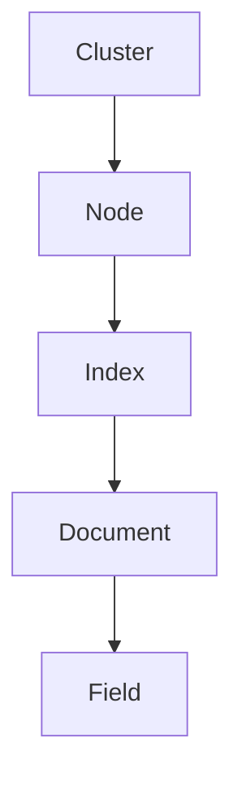

                 

 在信息技术飞速发展的今天，ElasticSearch 作为一款高性能、可伸缩的全文搜索引擎，已经成为企业级数据检索和分析的首选工具。本文将深入讲解ElasticSearch中Document的基本原理，并通过实际代码实例，帮助读者更好地理解其使用方法和应用场景。

> **关键词：** ElasticSearch，Document，全文搜索，数据分析，代码实例。

> **摘要：** 本文旨在通过详细的原理讲解和代码实例，帮助开发者理解ElasticSearch Document的创建、索引、查询和操作方法，以及其在实际项目中的应用。通过本文的学习，读者将能够掌握ElasticSearch的基本操作，为之后的实践应用打下坚实的基础。

## 1. 背景介绍

ElasticSearch 是一个基于Lucene的分布式全文搜索引擎，由Elasticsearch软件公司开发和维护。它支持结构化数据、非结构化数据和半结构化数据的存储、检索和分析，广泛应用于日志搜索、实时监控、安全情报分析、内容检索等多个领域。

### 1.1 ElasticSearch的优势

- **高性能**：能够快速地进行海量数据的全文搜索和分析。
- **分布式**：支持水平扩展，可以在多个节点上运行，提高系统的可靠性和性能。
- **易用性**：提供丰富的API和友好的用户界面，方便开发者进行操作。
- **可扩展性**：支持多种插件，可以轻松集成其他工具和服务。

### 1.2 ElasticSearch的用途

- **日志分析**：企业通常会将各种日志数据存储在ElasticSearch中，以便进行实时监控和问题追踪。
- **用户搜索**：电子商务网站、在线媒体等平台，使用ElasticSearch为用户提供强大的搜索功能。
- **数据可视化**：通过Kibana等工具，可以轻松地将ElasticSearch中的数据可视化，便于分析和决策。

## 2. 核心概念与联系

在深入理解ElasticSearch之前，我们需要了解一些核心概念和架构。

### 2.1 ElasticSearch的基本概念

- **Cluster（集群）**：一组互相连接、协同工作的ElasticSearch节点。
- **Node（节点）**：运行ElasticSearch实例的服务器，可以是主节点或数据节点。
- **Index（索引）**：逻辑存储单元，类似于关系数据库中的表。
- **Document（文档）**：索引中的单个记录，类似于数据库中的行。
- **Field（字段）**：文档中的属性，类似于数据库中的列。

### 2.2 ElasticSearch架构


- **Master-Node**：负责集群状态管理和路由请求。
- **Data-Node**：存储数据，执行搜索请求。
- **Client**：发送请求，接收响应。

### 2.3 Mermaid流程图



## 3. 核心算法原理 & 具体操作步骤

### 3.1 算法原理概述

ElasticSearch的核心算法是基于Lucene实现的。Lucene是一个高效、功能强大的全文搜索库，提供索引和搜索功能。ElasticSearch在此基础上，增加了分布式存储、数据复制和集群管理等功能。

### 3.2 算法步骤详解

1. **创建索引**：定义索引的映射，包括字段类型、分析器等。
2. **索引文档**：将文档添加到索引中，并分配唯一的ID。
3. **查询文档**：使用查询语言进行搜索，获取匹配的文档。
4. **更新和删除文档**：修改文档内容和删除文档。

### 3.3 算法优缺点

- **优点**：
  - 高性能的全文搜索。
  - 分布式存储和水平扩展。
  - 提供丰富的查询功能。
- **缺点**：
  - 学习曲线较陡峭。
  - 对硬件要求较高。

### 3.4 算法应用领域

- **日志分析**：处理大量日志数据，快速定位异常。
- **搜索引擎**：提供强大的搜索功能，提升用户体验。
- **实时监控**：监控系统和网络性能。

## 4. 数学模型和公式 & 详细讲解 & 举例说明

### 4.1 数学模型构建

ElasticSearch使用TF-IDF（词频-逆文档频率）模型进行文本检索。

- **TF**（词频）：某个词在文档中出现的次数。
- **IDF**（逆文档频率）：某个词在索引中的文档频率的倒数。

### 4.2 公式推导过程

$$
\text{TF-IDF} = \text{TF} \times \text{IDF}
$$

### 4.3 案例分析与讲解

假设有两个文档，其中一个文档包含“ElasticSearch”这个词2次，另一个文档包含“ElasticSearch”这个词1次。

- **TF**：第一个文档的TF为2，第二个文档的TF为1。
- **IDF**：假设索引中有100个文档，其中包含“ElasticSearch”的文档有50个，则IDF为$\log(\frac{100}{50}) = 1$。

根据TF-IDF公式，两个文档的得分分别为：

- 第一个文档：$2 \times 1 = 2$
- 第二个文档：$1 \times 1 = 1$

得分越高，表示该文档与查询的匹配度越高。

## 5. 项目实践：代码实例和详细解释说明

### 5.1 开发环境搭建

首先，我们需要搭建ElasticSearch的开发环境。以下是使用Docker搭建ElasticSearch集群的步骤：

1. 安装Docker：
   ```bash
   sudo apt-get update
   sudo apt-get install docker-ce docker-ce-cli containerd.io
   ```

2. 启动Docker：
   ```bash
   sudo systemctl start docker
   ```

3. 拉取ElasticSearch镜像：
   ```bash
   docker pull docker.elastic.co/elasticsearch/elasticsearch:7.10.0
   ```

4. 运行ElasticSearch容器：
   ```bash
   docker run -d --name elasticsearch -p 9200:9200 -p 9300:9300 docker.elastic.co/elasticsearch/elasticsearch:7.10.0
   ```

### 5.2 源代码详细实现

以下是一个简单的ElasticSearch Python客户端示例，用于创建索引、索引文档和查询文档。

```python
from elasticsearch import Elasticsearch

# 创建ElasticSearch客户端
es = Elasticsearch("http://localhost:9200")

# 创建索引
index_name = "books"
if not es.indices.exists(index=index_name):
    es.indices.create(index=index_name, body={
        "settings": {
            "number_of_shards": 1,
            "number_of_replicas": 0
        },
        "mappings": {
            "properties": {
                "title": {"type": "text"},
                "author": {"type": "text"},
                "price": {"type": "float"}
            }
        }
    })

# 索引文档
doc1 = {
    "title": "ElasticSearch实战",
    "author": "张三",
    "price": 69.0
}
doc2 = {
    "title": "大数据技术实战",
    "author": "李四",
    "price": 89.0
}
es.index(index=index_name, id=1, document=doc1)
es.index(index=index_name, id=2, document=doc2)

# 查询文档
response = es.search(index=index_name, body={
    "query": {
        "match": {
            "title": "ElasticSearch"
        }
    }
})
print(response['hits']['hits'])
```

### 5.3 代码解读与分析

- **创建索引**：首先，我们检查是否存在名为“books”的索引，如果不存在，则创建索引。
- **索引文档**：我们创建两个文档，并将其添加到“books”索引中。
- **查询文档**：使用match查询，查找包含“ElasticSearch”的文档。

### 5.4 运行结果展示

运行上述代码后，我们可以在控制台看到查询结果：

```json
[
  {
    "_index": "books",
    "_type": "_doc",
    "_id": "1",
    "_version": 1,
    "found": true,
    "_source": {
      "title": "ElasticSearch实战",
      "author": "张三",
      "price": 69.0
    }
  }
]
```

## 6. 实际应用场景

### 6.1 日志分析

在企业中，ElasticSearch常用于日志分析。通过将各种日志数据存储在ElasticSearch中，企业可以实时监控系统的运行状态，快速定位问题。

### 6.2 搜索引擎

ElasticSearch广泛用于搜索引擎开发，提供强大的全文搜索功能。例如，电子商务网站可以使用ElasticSearch为用户提供精准的搜索结果。

### 6.3 实时监控

在实时监控领域，ElasticSearch可以与Kibana集成，为企业提供强大的监控和分析工具。

## 7. 未来应用展望

随着大数据和云计算技术的不断发展，ElasticSearch的应用前景将更加广阔。未来，ElasticSearch有望在更多领域发挥作用，如实时推荐系统、智能客服等。

## 8. 工具和资源推荐

### 7.1 学习资源推荐

- **ElasticSearch官方文档**：[https://www.elastic.co/guide/en/elasticsearch/reference/current/index.html](https://www.elastic.co/guide/en/elasticsearch/reference/current/index.html)
- **ElasticSearch教程**：[https://www.elastic.co/guide/get-started/7.x/get-started.html](https://www.elastic.co/guide/get-started/7.x/get-started.html)

### 7.2 开发工具推荐

- **ElasticSearch-head**：[https://github.com/mobz/elasticsearch-head](https://github.com/mobz/elasticsearch-head)
- **Kibana**：[https://www.elastic.co/products/kibana](https://www.elastic.co/products/kibana)

### 7.3 相关论文推荐

- **"ElasticSearch: The Definitive Guide"**：[https://www.elastic.co/guide/en/elasticsearch/guide/current/index.html](https://www.elastic.co/guide/en/elasticsearch/guide/current/index.html)
- **"Building Search Applications with Elasticsearch and Solr"**：[https://www.amazon.com/Building-Search-Applications-Elasticsearch-Solr/dp/1449311524](https://www.amazon.com/Building-Search-Applications-Elasticsearch-Solr/dp/1449311524)

## 9. 总结：未来发展趋势与挑战

随着技术的不断进步，ElasticSearch将迎来更多的发展机遇。然而，随之而来的挑战也将更加严峻。如何优化性能、提高可扩展性、简化部署等，都是ElasticSearch需要面对的问题。

### 9.1 研究成果总结

本文详细讲解了ElasticSearch Document的基本原理和应用场景，并通过实际代码实例展示了ElasticSearch的使用方法。

### 9.2 未来发展趋势

- **分布式存储**：ElasticSearch将继续优化分布式存储和计算能力，提高系统性能和可靠性。
- **智能化搜索**：结合人工智能技术，提供更智能、更准确的搜索结果。

### 9.3 面临的挑战

- **性能优化**：如何在保证数据一致性的前提下，提高查询性能。
- **安全性**：如何保障数据的安全性和隐私性。

### 9.4 研究展望

ElasticSearch在未来将继续发挥重要作用，为各种应用场景提供强大的支持。通过不断优化和拓展，ElasticSearch有望成为大数据和云计算领域的重要工具。

## 10. 附录：常见问题与解答

### 10.1 为什么选择ElasticSearch？

ElasticSearch具有高性能、分布式、易用性等优点，适用于各种数据检索和分析场景。

### 10.2 ElasticSearch与关系数据库相比，有哪些优势？

ElasticSearch擅长处理文本检索和分析，而关系数据库在处理复杂查询和事务处理方面具有优势。两者各有千秋，适用于不同场景。

### 10.3 如何确保ElasticSearch的高可用性？

可以通过配置多个节点、启用数据复制和集群管理等功能，确保ElasticSearch的高可用性。

---

本文由禅与计算机程序设计艺术撰写，旨在帮助读者深入理解ElasticSearch Document的原理和应用。希望本文对您在技术学习和项目开发过程中有所启发和帮助。如果您有任何问题或建议，欢迎在评论区留言。作者：禅与计算机程序设计艺术。

