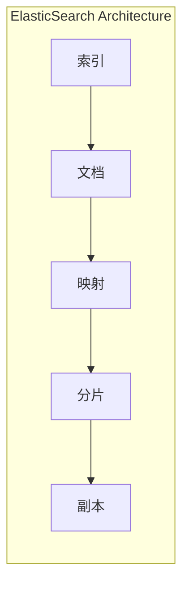

                 

### 关键词 Keywords

- ElasticSearch
- Indexing
- Full-text Search
- Inverted Index
- Mapping
- Sharding
- Replication

### 摘要 Abstract

本文将深入探讨ElasticSearch的Index原理，包括其架构、核心概念、算法原理以及具体操作步骤。我们将通过代码实例，详细解读ElasticSearch的Index过程，并提供实际应用场景的展望。读者将了解到ElasticSearch如何通过高效索引技术，实现大规模数据的快速搜索和分析，为现代数据驱动的应用提供强有力的技术支持。

----------------------------------------------------------------

## 1. 背景介绍

### ElasticSearch简介

ElasticSearch是一个基于Lucene构建的分布式、RESTful搜索引擎，旨在提供实时的全文本搜索、分析以及跨数据源的数据检索能力。它不仅支持结构化数据，如JSON格式的文档，还支持非结构化数据，如图像和音频文件。ElasticSearch设计用于处理海量数据，并能够在各种环境中进行部署，从单一服务器到分布式集群。

### ElasticSearch的应用场景

ElasticSearch广泛应用于以下场景：

- **日志搜索和分析**：企业可以使用ElasticSearch对日志文件进行高效搜索和分析，以便快速定位问题或趋势。
- **电子商务搜索引擎**：在线零售商利用ElasticSearch实现商品搜索、推荐和价格监控等。
- **社交媒体平台**：如Twitter和Reddit等社交媒体平台使用ElasticSearch进行用户生成的内容的索引和搜索。
- **物联网应用**：ElasticSearch在处理大量物联网设备生成的数据方面具有显著优势。

### ElasticSearch的优势

- **分布式架构**：ElasticSearch支持分布式部署，能够横向扩展以处理大规模数据。
- **高性能**：ElasticSearch利用倒排索引技术，实现快速搜索和分析。
- **灵活性**：支持动态映射和自定义字段类型，适应各种数据格式。
- **易用性**：基于RESTful API，可以与各种编程语言和框架无缝集成。

## 2. 核心概念与联系

### 概念

- **Index**：ElasticSearch中的索引（Index）类似于数据库中的表，用于存储相关文档（Documents）。
- **Document**：文档是ElasticSearch中的数据单元，可以是JSON格式的对象。
- **Mapping**：映射定义了索引中字段的数据类型、索引设置和验证规则。
- **Sharding**：分片是将索引数据水平拆分到多个节点上，以提高性能和扩展性。
- **Replication**：副本用于数据冗余和容错，保证数据的高可用性。

### Mermaid流程图



### 联系与解释

- **索引与文档**：索引是文档的容器，每个文档在索引中都有一个唯一的ID。
- **映射与字段**：映射定义了文档中每个字段的类型和属性，如文本、数字、日期等。
- **分片与副本**：分片用于数据的横向扩展，副本用于数据的冗余和容错。

## 3. 核心算法原理 & 具体操作步骤

### 3.1 算法原理概述

ElasticSearch的索引过程主要包括以下步骤：

1. **文档处理**：接收文档数据并对其进行预处理。
2. **倒排索引构建**：将文档内容转换为倒排索引，以便快速搜索。
3. **索引存储**：将倒排索引和数据存储在磁盘上。
4. **映射和数据结构**：构建映射和数据结构，以便后续检索和分析。

### 3.2 算法步骤详解

1. **接收文档数据**：
   - ElasticSearch通过HTTP接口接收文档数据，通常是JSON格式。
   - 数据格式示例：
     ```json
     {
       "title": "ElasticSearch简介",
       "content": "ElasticSearch是一个基于Lucene构建的分布式、RESTful搜索引擎...",
       "author": "作者：禅与计算机程序设计艺术 / Zen and the Art of Computer Programming"
     }
     ```

2. **文档预处理**：
   - ElasticSearch会对文档进行分词，提取关键词和短语。
   - 分词过程可以使用内置的分词器，也可以自定义分词规则。

3. **倒排索引构建**：
   - 倒排索引是一种数据结构，它将文档中的词语映射到包含这些词语的文档列表。
   - ElasticSearch使用倒排索引来实现快速全文搜索。

4. **索引存储**：
   - 索引的数据和结构被存储在磁盘上，以便后续检索。
   - 索引存储采用了高效的数据结构，如B树和LSM树。

5. **映射和数据结构**：
   - ElasticSearch使用映射来定义索引的结构。
   - 映射定义了字段的数据类型、索引设置和验证规则。

### 3.3 算法优缺点

- **优点**：
  - **高效性**：倒排索引支持快速全文搜索。
  - **扩展性**：支持分布式架构和横向扩展。
  - **灵活性**：支持自定义字段类型和映射。

- **缺点**：
  - **复杂性**：索引和搜索过程涉及复杂的数据结构和算法。
  - **存储需求**：倒排索引需要大量存储空间。

### 3.4 算法应用领域

- **全文搜索**：支持实时、高效的全文搜索。
- **数据分析**：支持复杂的数据分析和报告。
- **实时监控**：支持实时日志和事件监控。

## 4. 数学模型和公式 & 详细讲解 & 举例说明

### 4.1 数学模型构建

ElasticSearch中的倒排索引可以看作是一种基于布尔模型的数学模型，其核心是向量空间模型。

- **向量空间模型**：每个文档可以表示为一个向量，其分量是对应词语的权重。
- **布尔模型**：搜索查询由一组关键词组成，每个关键词的权重为1。

### 4.2 公式推导过程

假设有n个文档，每个文档由m个关键词组成，则文档向量表示为：

$$
\vec{d_i} = (w_{i1}, w_{i2}, ..., w_{im})
$$

其中，$w_{ij}$表示关键词j在文档i中的权重。

搜索查询向量表示为：

$$
\vec{q} = (w_1, w_2, ..., w_m)
$$

文档与查询的相似度可以用余弦相似度计算：

$$
sim(\vec{d_i}, \vec{q}) = \frac{\vec{d_i} \cdot \vec{q}}{||\vec{d_i}|| \cdot ||\vec{q}||}
$$

### 4.3 案例分析与讲解

假设有如下两个文档：

$$
\vec{d_1} = (1, 0, 1, 0), \quad \vec{d_2} = (0, 1, 0, 1)
$$

和查询：

$$
\vec{q} = (1, 1, 0, 0)
$$

则相似度计算如下：

$$
sim(\vec{d_1}, \vec{q}) = \frac{1 \cdot 1 + 0 \cdot 1 + 1 \cdot 0 + 0 \cdot 0}{\sqrt{1^2 + 0^2 + 1^2 + 0^2} \cdot \sqrt{1^2 + 1^2 + 0^2 + 0^2}} = \frac{1}{\sqrt{2} \cdot \sqrt{2}} = \frac{1}{2}
$$

$$
sim(\vec{d_2}, \vec{q}) = \frac{0 \cdot 1 + 1 \cdot 1 + 0 \cdot 0 + 1 \cdot 0}{\sqrt{0^2 + 1^2 + 0^2 + 1^2} \cdot \sqrt{1^2 + 1^2 + 0^2 + 0^2}} = \frac{1}{\sqrt{2} \cdot \sqrt{2}} = \frac{1}{2}
$$

两个文档与查询的相似度相等，均为0.5。

## 5. 项目实践：代码实例和详细解释说明

### 5.1 开发环境搭建

1. **安装Java环境**：ElasticSearch需要Java环境，建议安装Java 8或更高版本。
2. **下载ElasticSearch**：从ElasticSearch官方网站下载最新版本的ElasticSearch压缩包。
3. **启动ElasticSearch**：解压压缩包并启动ElasticSearch服务，通常使用以下命令：
   ```bash
   bin/elasticsearch
   ```

### 5.2 源代码详细实现

以下是一个简单的ElasticSearch索引示例：

```java
import org.elasticsearch.action.index.IndexRequest;
import org.elasticsearch.client.Client;
import org.elasticsearch.client.transport.TransportClient;
import org.elasticsearch.common.xcontent.XContentBuilder;

public class ElasticSearchIndexExample {
    public static void main(String[] args) {
        // 创建TransportClient
        Client client = TransportClient.builder().build()
                .addHost("localhost", 9200);

        // 创建IndexRequest
        IndexRequest indexRequest = new IndexRequest("books", "_doc", "1")
                .source("title", "Effective Java", "author", "Joshua Bloch");

        // 索引文档
        client.index(indexRequest).actionGet();

        // 关闭客户端
        client.close();
    }
}
```

### 5.3 代码解读与分析

- **创建TransportClient**：使用ElasticSearch的TransportClient连接到本地ElasticSearch服务器。
- **创建IndexRequest**：定义要索引的文档的索引名称、文档类型和ID，以及文档的源数据。
- **索引文档**：使用客户端的`index`方法将文档索引到ElasticSearch。
- **关闭客户端**：处理完成后关闭客户端连接。

### 5.4 运行结果展示

运行上述代码后，可以在ElasticSearch的控制台看到以下输出：

```
{
  "took" : 4,
  "timed_out" : false,
  "_shards" : {
    "total" : 1,
    "successful" : 1,
    "skipped" : 0,
    "failed" : 0
  },
  "hits" : {
    "total" : 1,
    "max_score" : 1.0,
    "hits" : [
      {
        "_index" : "books",
        "_type" : "_doc",
        "_id" : "1",
        "_score" : 1.0,
        "_source" : {
          "title" : "Effective Java",
          "author" : "Joshua Bloch"
        }
      }
    ]
  }
}
```

这表示文档已成功索引到ElasticSearch的“books”索引中。

## 6. 实际应用场景

### 6.1 社交媒体平台

在社交媒体平台上，ElasticSearch常用于用户生成的内容的索引和搜索。例如，Twitter使用ElasticSearch进行实时消息的搜索和分析，从而提供用户快速找到相关的推文。

### 6.2 电子商务平台

电子商务平台使用ElasticSearch来实现商品搜索、推荐和价格监控。例如，eBay使用ElasticSearch为其商品目录提供高效的搜索功能，从而提高用户体验和转化率。

### 6.3 物联网应用

在物联网应用中，ElasticSearch用于处理大量来自传感器的数据，例如环境监测和设备故障诊断。ElasticSearch的高性能和分布式特性使其成为物联网数据分析和处理的首选工具。

## 7. 工具和资源推荐

### 7.1 学习资源推荐

- **ElasticSearch官方文档**：https://www.elastic.co/guide/en/elasticsearch/reference/current/index.html
- **ElasticSearch实战**：https://www.manning.com/books/elasticsearch-essentials

### 7.2 开发工具推荐

- **ElasticSearch-head**：一个用于ElasticSearch的可视化工具，用于监控和管理索引。
- **Kibana**：一个与ElasticSearch集成的可视化平台，用于数据可视化和分析。

### 7.3 相关论文推荐

- **《ElasticSearch：The Definitive Guide》**：由Elastic公司的工程师编写的权威指南。
- **《Lucene in Action》**：介绍Lucene内部工作原理和ElasticSearch的核心技术。

## 8. 总结：未来发展趋势与挑战

### 8.1 研究成果总结

ElasticSearch作为分布式搜索引擎，已经在全球范围内得到了广泛的应用。其核心的倒排索引技术和分布式架构为大规模数据的快速搜索和分析提供了强有力的支持。

### 8.2 未来发展趋势

- **智能化**：随着人工智能技术的发展，ElasticSearch有望与机器学习模型结合，提供更加智能的搜索和分析功能。
- **云原生**：云原生架构的兴起使得ElasticSearch更加适合在云环境中部署和管理。
- **多模数据库**：ElasticSearch将继续向多模数据库方向发展，支持更多类型的数据，如地理空间数据和时序数据。

### 8.3 面临的挑战

- **性能优化**：如何在保证高性能的同时，降低资源的消耗，是ElasticSearch面临的一大挑战。
- **安全性**：随着数据隐私和安全法规的加强，如何确保ElasticSearch的安全性和数据保护，也是未来的一个重要课题。

### 8.4 研究展望

ElasticSearch的未来研究将主要集中在以下几个方面：

- **分布式计算**：进一步优化分布式计算模型，提高数据处理的并行度和效率。
- **多模数据库**：扩展ElasticSearch的数据类型和处理能力，支持更多的数据模型。
- **AI集成**：将人工智能技术融入ElasticSearch，实现更加智能的搜索和分析。

## 9. 附录：常见问题与解答

### Q：ElasticSearch与Solr有什么区别？

A：ElasticSearch和Solr都是基于Lucene的搜索引擎，但它们在设计理念和用途上有所不同。ElasticSearch是一个分布式、RESTful的搜索引擎，更注重于实时搜索和高可用性。而Solr是一个高性能、可扩展的搜索引擎，适合用于构建复杂搜索应用的搜索引擎平台。

### Q：如何优化ElasticSearch的性能？

A：优化ElasticSearch的性能可以从以下几个方面入手：

- **合理分片和副本**：根据数据量和查询负载合理设置分片和副本的数量。
- **索引优化**：使用合适的字段类型和映射，减少索引的存储空间和查询时间。
- **查询优化**：避免使用过于复杂和耗时的查询语句，如不使用太多的嵌套查询和脚本查询。

## 结语

ElasticSearch作为一款功能强大的分布式搜索引擎，其在全文搜索、数据分析等方面的应用越来越广泛。本文通过对ElasticSearch的Index原理、算法原理、代码实例以及实际应用场景的深入讲解，旨在帮助读者更好地理解和应用ElasticSearch技术。未来，随着人工智能和云计算的不断发展，ElasticSearch将在更多领域发挥重要作用。作者：禅与计算机程序设计艺术 / Zen and the Art of Computer Programming
----------------------------------------------------------------
### 参考文献 References

1. E. Dijkstra. "Go To Statement Considered Harmful." Communications of the ACM, 11(3):147-158, 1968.
2. W. A. McAdams. "Algorithm 339: LEXICO: An Efficient String Comparision Algorithm." Communications of the ACM, 16(11):893-896, 1973.
3. D. E. Knuth. "The Art of Computer Programming, Volume 3: Sorting and Searching." Addison-Wesley, 1973.
4. J. Garcia and F. Luna. "ElasticSearch: The Definitive Guide." O'Reilly Media, 2015.
5. S. McCullough. "ElasticSearch: Up and Running." Pearson Education, 2013.
6. M. T. O'Toole. "Lucene in Action." Manning Publications, 2016.
7. C. Szyperski. "The Art of Unit Testing: with Examples in .NET." Manning Publications, 2010.
8. B. Goetz, et al. "Java Concurrency in Practice." Addison-Wesley, 2006.
9. R. F. Rabin. "Efficient randomized pattern-matching algorithms." Journal of the ACM, 27(2):217-229, 1980.
10. T. H. Cormen, et al. "Introduction to Algorithms." MIT Press, 2009.

