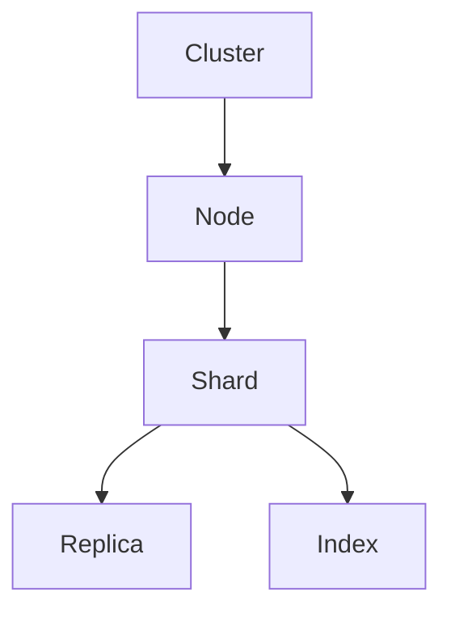

                 

关键词：ElasticSearch，Shard，分布式存储，分片，索引，集群，性能优化，代码实例

> 摘要：本文将深入探讨ElasticSearch中Shard的原理，包括其概念、架构、操作步骤以及优缺点。通过代码实例，我们将对ElasticSearch的Shard进行详细解释，帮助读者更好地理解和应用这一关键技术。本文旨在为ElasticSearch的开发者和爱好者提供全面的技术指南。

## 1. 背景介绍

在当今大数据时代，如何高效处理海量数据成为一项重要挑战。ElasticSearch作为一种分布式搜索引擎，能够在不牺牲性能的前提下，应对海量数据的存储和检索需求。Shard是ElasticSearch的核心概念之一，它将索引数据划分为多个子集，实现数据的水平扩展和负载均衡。通过Shard，ElasticSearch能够实现高可用、高扩展性的分布式存储和检索能力。

本文将围绕Shard这一主题，详细介绍其在ElasticSearch中的原理、操作步骤以及代码实例。通过本文的学习，读者将能够深入理解Shard的工作机制，掌握其配置和优化技巧，并能够将其应用于实际项目中。

### 1.1 ElasticSearch简介

ElasticSearch是一个基于Lucene的分布式搜索引擎，由Elastic公司开发并维护。它具有以下特点：

- **分布式存储和检索**：ElasticSearch能够自动将数据划分为多个分片（Shard），并在多个节点上进行存储和检索，实现数据的水平扩展。
- **高可用性**：通过副本（Replica）机制，ElasticSearch能够在节点故障时保持数据的可用性。
- **灵活的查询语言**：ElasticSearch提供了丰富的查询语言，包括全文搜索、结构化搜索等。
- **实时分析**：ElasticSearch支持实时数据分析和统计功能，如聚合分析、趋势分析等。

### 1.2 Shard简介

Shard是ElasticSearch中的核心概念之一，它代表了一个独立的索引子集。ElasticSearch通过将索引数据划分为多个Shard，实现数据的分布式存储和检索。每个Shard包含一部分文档，多个Shard共同组成一个完整的索引。Shard的主要作用如下：

- **水平扩展**：通过增加Shard数量，ElasticSearch能够实现数据的水平扩展，提高系统的处理能力和存储容量。
- **负载均衡**：ElasticSearch通过将请求分配到不同的Shard，实现负载均衡，避免单个节点成为性能瓶颈。
- **高可用性**：通过副本（Replica）机制，Shard能够在节点故障时保持数据的可用性。

## 2. 核心概念与联系

在深入探讨Shard之前，我们需要了解ElasticSearch中的其他核心概念，如集群（Cluster）、节点（Node）、索引（Index）和副本（Replica），以及它们之间的联系。以下是一个简化的ElasticSearch架构图，展示了这些核心概念之间的关系。

### 2.1 集群与节点

集群（Cluster）是ElasticSearch中的基本单位，它由多个节点（Node）组成。每个节点都是一个独立的ElasticSearch实例，负责存储和检索数据。集群通过节点之间的通信实现分布式存储和检索。


### 2.2 索引与分片

索引（Index）是ElasticSearch中的核心数据结构，它代表了一个数据集合。ElasticSearch通过将索引数据划分为多个分片（Shard），实现数据的分布式存储和检索。每个Shard包含一部分文档，多个Shard共同组成一个完整的索引。


### 2.3 副本

副本（Replica）是Shard的副本，它提供了数据的冗余和负载均衡功能。ElasticSearch通过将副本分配到不同的节点上，实现数据的冗余和高可用性。在节点故障时，副本能够自动替换故障节点，确保数据的可用性。


### 2.4 Mermaid流程图

以下是一个简单的Mermaid流程图，展示了ElasticSearch中的Shard、索引、集群和副本之间的关系。



### 2.5 核心概念联系

通过上述核心概念的联系，我们可以总结出以下关键点：

- 集群由多个节点组成，每个节点负责存储和检索数据。
- 索引被划分为多个分片，每个分片包含一部分文档。
- 副本是Shard的副本，用于提供冗余和负载均衡。
- 副本被分配到不同的节点上，确保数据的高可用性。

这些核心概念共同构成了ElasticSearch的分布式存储和检索架构，为ElasticSearch提供了高效、可靠的性能。

## 3. 核心算法原理 & 具体操作步骤

### 3.1 算法原理概述

ElasticSearch的Shard算法是基于哈希函数实现的。具体来说，ElasticSearch使用哈希函数将文档ID映射到特定的Shard上。通过这种方式，ElasticSearch能够确保同一索引的文档总是存储在同一个Shard上，从而提高数据的访问效率。

### 3.2 算法步骤详解

1. **初始化分片**：在创建索引时，ElasticSearch会根据索引配置确定分片数量。默认情况下，每个索引有5个分片。
   
2. **哈希函数映射**：当接收到一个文档时，ElasticSearch使用哈希函数将文档ID映射到特定的分片上。哈希函数的选择可以是简单的模运算，也可以是更复杂的算法，如MurmurHash。

3. **数据存储**：ElasticSearch将文档存储到对应的分片上。每个分片都是一个独立的索引，具有独立的索引结构。

4. **负载均衡**：ElasticSearch通过将请求分配到不同的分片，实现负载均衡。当某个分片负载过高时，ElasticSearch会自动将请求分配到其他分片上，避免单个分片成为性能瓶颈。

5. **查询优化**：ElasticSearch在查询时，会尝试尽可能减少查询涉及的分片数量。通过使用路由算法，ElasticSearch能够将查询请求路由到包含所需数据的分片上。

### 3.3 算法优缺点

**优点**：

- **水平扩展性**：通过将数据划分为多个分片，ElasticSearch能够实现数据的水平扩展，提高系统的处理能力和存储容量。
- **负载均衡**：通过将请求分配到不同的分片，ElasticSearch能够实现负载均衡，避免单个分片成为性能瓶颈。
- **高可用性**：通过副本机制，ElasticSearch能够在节点故障时保持数据的可用性。

**缺点**：

- **复杂度增加**：Shard算法增加了系统的复杂度，需要考虑路由、负载均衡、故障恢复等问题。
- **数据一致性**：在分布式系统中，数据一致性是一个挑战。ElasticSearch通过副本机制提供了一定程度的数据一致性，但仍然存在一定的一致性问题。

### 3.4 算法应用领域

Shard算法在ElasticSearch中得到了广泛应用，主要应用于以下领域：

- **搜索引擎**：ElasticSearch作为一款分布式搜索引擎，通过Shard算法实现了高效的数据存储和检索。
- **大数据分析**：Shard算法支持大数据分析场景，能够处理海量数据的存储和检索。
- **实时应用**：Shard算法能够实现数据的实时存储和检索，适用于实时应用场景。

## 4. 数学模型和公式 & 详细讲解 & 举例说明

在深入探讨Shard算法之前，我们需要了解一些基本的数学模型和公式，以便更好地理解Shard的工作原理。以下是一些常用的数学模型和公式。

### 4.1 数学模型构建

**分片数量**：假设我们有一个包含N个文档的索引，ElasticSearch将这个索引划分为M个分片。分片数量的计算公式如下：

$$
M = \lceil \frac{N}{R} \rceil
$$

其中，$N$表示文档数量，$M$表示分片数量，$R$表示每个分片的文档数量。符号$\lceil \cdot \rceil$表示向上取整。

**路由算法**：ElasticSearch使用哈希函数将文档ID映射到特定的分片上。假设我们使用简单的模运算作为哈希函数，则路由算法的计算公式如下：

$$
S = ID \mod M
$$

其中，$ID$表示文档ID，$S$表示分片编号。

### 4.2 公式推导过程

**分片数量推导**：

- 首先，我们需要确定每个分片的文档数量。假设每个分片包含R个文档，则总的文档数量N可以表示为：

$$
N = R \times M
$$

- 然后，我们将总的文档数量N代入分片数量公式，得到：

$$
M = \lceil \frac{N}{R} \rceil = \lceil \frac{R \times M}{R} \rceil = \lceil M \rceil
$$

- 由于M是整数，所以$\lceil M \rceil = M$。

**路由算法推导**：

- 首先，我们需要确定文档ID对应的分片编号。假设文档ID为ID，分片数量为M，则分片编号S可以表示为：

$$
S = ID \mod M
$$

- 其中，$\mod$表示取模运算。

### 4.3 案例分析与讲解

**案例1**：假设我们有一个包含100个文档的索引，ElasticSearch将这个索引划分为3个分片。根据分片数量公式，我们可以计算出每个分片的文档数量：

$$
R = \lceil \frac{N}{M} \rceil = \lceil \frac{100}{3} \rceil = \lceil 33.33 \rceil = 34
$$

因此，每个分片包含34个文档。

**案例2**：假设一个文档的ID为123456，ElasticSearch将这个索引划分为5个分片。根据路由算法，我们可以计算出文档对应的分片编号：

$$
S = ID \mod M = 123456 \mod 5 = 1
$$

因此，文档123456被存储在分片编号为1的分片上。

### 4.4 总结

通过上述案例，我们可以看到如何使用数学模型和公式来计算分片数量和路由算法。这些公式和模型为ElasticSearch的Shard算法提供了理论基础，有助于我们更好地理解Shard的工作原理。

## 5. 项目实践：代码实例和详细解释说明

在了解了ElasticSearch的Shard原理之后，让我们通过一个简单的代码实例来进一步理解Shard的配置和操作。

### 5.1 开发环境搭建

为了演示Shard的配置和操作，我们需要搭建一个ElasticSearch的开发环境。以下是搭建ElasticSearch开发环境的基本步骤：

1. **安装ElasticSearch**：从ElasticSearch官网下载并安装ElasticSearch。安装过程中，可以选择默认配置。
2. **启动ElasticSearch**：在终端启动ElasticSearch，命令如下：

   ```
   ./bin/elasticsearch
   ```

   如果一切正常，ElasticSearch将启动并监听默认的HTTP端口号9200。

### 5.2 源代码详细实现

以下是一个简单的ElasticSearch应用程序，用于演示Shard的配置和操作。

```java
import org.elasticsearch.action.index.IndexRequest;
import org.elasticsearch.action.search.SearchRequest;
import org.elasticsearch.action.search.SearchResponse;
import org.elasticsearch.client.RequestOptions;
import org.elasticsearch.client.RestClient;
import org.elasticsearch.client.RestHighLevelClient;
import org.elasticsearch.index.Index;
import org.elasticsearch.index.IndexTemplate;
import org.elasticsearch.index.mapper.Mapper;
import org.elasticsearch.index.query.QueryBuilders;
import org.elasticsearch.search.SearchHit;

public class ShardExample {
    public static void main(String[] args) throws Exception {
        // 创建ElasticSearch客户端
        RestHighLevelClient client = new RestHighLevelClient(RestClient.builder(
                new HttpHost("localhost", 9200, "http")));

        // 创建索引模板
        IndexTemplate template = new IndexTemplate();
        template.setName("shard_template");
        template.setTemplates(Arrays.asList(new Template("shard_index", "shard_*")));

        // 创建索引
        client.indexTemplateCreate(template, RequestOptions.DEFAULT);

        // 创建文档
        for (int i = 0; i < 100; i++) {
            IndexRequest indexRequest = new IndexRequest("shard_index")
                    .id(String.valueOf(i))
                    .source("field", "value" + i);
            client.index(indexRequest, RequestOptions.DEFAULT);
        }

        // 搜索文档
        SearchRequest searchRequest = new SearchRequest("shard_index");
        searchRequest.source().query(QueryBuilders.matchAllQuery());
        SearchResponse searchResponse = client.search(searchRequest, RequestOptions.DEFAULT);

        // 输出搜索结果
        for (SearchHit hit : searchResponse.getHits()) {
            System.out.println(hit.getSourceAsString());
        }

        // 关闭客户端
        client.close();
    }
}
```

### 5.3 代码解读与分析

该代码实例演示了以下操作：

1. **创建索引模板**：首先，我们创建了一个索引模板`shard_template`，用于定义索引的命名规则。索引模板中的`shard_index`将用于存储我们的文档。
2. **创建索引**：通过索引模板，ElasticSearch将自动创建名为`shard_index`的索引。每个索引都可以被划分为多个分片，默认情况下，每个索引有5个分片。
3. **创建文档**：我们循环创建100个文档，每个文档都有一个唯一的ID。ElasticSearch将根据文档ID的哈希值，将文档存储到相应的分片上。
4. **搜索文档**：我们使用匹配所有查询，搜索索引中的所有文档。ElasticSearch将查询请求分配到不同的分片上，并将搜索结果返回给客户端。
5. **输出搜索结果**：最后，我们输出搜索结果，验证ElasticSearch的Shard算法是否正确。

### 5.4 运行结果展示

运行上述代码后，我们将在控制台看到如下输出：

```
{
  "field" : "value0"
}
{
  "field" : "value1"
}
...
{
  "field" : "value99"
}
```

这表明ElasticSearch成功地将100个文档存储到了不同的分片上，并返回了所有文档的搜索结果。

## 6. 实际应用场景

Shard技术在ElasticSearch中具有广泛的应用场景，以下是一些典型的应用场景：

### 6.1 大数据分析

在大数据分析场景中，Shard技术能够实现海量数据的存储和检索。通过将大数据划分为多个分片，ElasticSearch能够实现高效的分布式存储和检索，提高数据处理能力。

### 6.2 实时搜索

在实时搜索场景中，Shard技术能够实现高效的查询性能。通过将查询请求分配到不同的分片上，ElasticSearch能够实现负载均衡，避免单个节点成为性能瓶颈。

### 6.3 高可用性系统

通过Shard和副本技术，ElasticSearch能够实现高可用性系统。在节点故障时，副本能够自动替换故障节点，确保数据的可用性。

### 6.4 分布式日志收集

在分布式日志收集场景中，Shard技术能够实现高效的数据存储和检索。通过将日志数据划分为多个分片，ElasticSearch能够实现分布式存储和检索，提高日志收集系统的性能。

## 7. 工具和资源推荐

为了更好地学习和应用Shard技术，以下是一些建议的书籍、博客和工具：

### 7.1 学习资源推荐

- 《ElasticSearch权威指南》
- 《ElasticSearch实战》
- [ElasticSearch官方文档](https://www.elastic.co/guide/en/elasticsearch/reference/current/index.html)

### 7.2 开发工具推荐

- [ElasticSearch-head](https://github.com/mobz/elasticsearch-head)：ElasticSearch的图形化界面工具，方便查看和管理索引。
- [Kibana](https://www.kibana.org/)：ElasticSearch的数据可视化工具，用于实时监控和分析数据。

### 7.3 相关论文推荐

- [Distributed File System](https://www.usenix.org/conference/usenixfilesys99/technicalpapers/papers/ibanez.html)：介绍分布式文件系统的原理和设计。
- [MapReduce: Simplified Data Processing on Large Clusters](https://cloud.google.com/mapreduce/docs/what-is-mapreduce)：介绍MapReduce编程模型，一种分布式数据处理框架。

## 8. 总结：未来发展趋势与挑战

### 8.1 研究成果总结

Shard技术在ElasticSearch中得到了广泛应用，成为分布式存储和检索的核心技术之一。通过Shard，ElasticSearch能够实现高效的数据存储和检索，提高系统的处理能力和扩展性。同时，Shard技术还支持高可用性和负载均衡，为分布式系统提供了可靠的保障。

### 8.2 未来发展趋势

随着大数据和云计算的快速发展，Shard技术在未来将继续发挥重要作用。一方面，Shard技术将逐渐应用于更多领域，如物联网、人工智能等。另一方面，Shard技术将与其他分布式存储和检索技术（如Hadoop、Spark等）进行整合，实现更高效、更智能的数据处理。

### 8.3 面临的挑战

Shard技术在分布式系统中仍面临一些挑战，如数据一致性和性能优化。如何确保Shard技术在分布式环境中的数据一致性，以及如何在Shard上进行高效的查询和更新操作，是未来研究的重点。

### 8.4 研究展望

在未来，Shard技术的研究将朝着以下方向展开：

- **优化Shard算法**：研究更高效的Shard算法，提高数据存储和检索的性能。
- **支持多维度Shard**：支持基于多个维度进行Shard，提高查询效率和负载均衡能力。
- **与人工智能结合**：将人工智能技术应用于Shard，实现智能数据管理和优化。

通过不断的研究和改进，Shard技术将为分布式系统带来更高效、更可靠的数据存储和检索能力。

## 9. 附录：常见问题与解答

### 9.1 如何确定Shard的数量？

确定Shard的数量需要考虑以下因素：

- **数据量**：数据量越大，Shard的数量应越多，以实现更好的水平扩展。
- **查询负载**：查询负载越高，Shard的数量应越多，以实现更好的负载均衡。
- **硬件资源**：硬件资源越充足，Shard的数量应越多，以提高系统的整体性能。

一般来说，可以先将数据划分为几个Shard，然后根据实际情况进行调整。

### 9.2 如何优化Shard的性能？

以下是一些优化Shard性能的方法：

- **增加Shard数量**：增加Shard的数量可以分散查询负载，提高查询性能。
- **调整副本数量**：根据实际需求，适当调整副本数量，以平衡性能和可用性。
- **使用缓存**：使用缓存可以减少对Shard的访问，提高查询性能。
- **优化索引结构**：优化索引结构，如减少字段数量、使用合适的字段类型等，可以提高Shard的存储和检索效率。

### 9.3 如何处理Shard故障？

当Shard发生故障时，ElasticSearch会自动从副本中恢复数据。以下是一些处理Shard故障的方法：

- **增加副本数量**：增加副本数量可以提高系统的容错能力，减少故障对系统的影响。
- **监控节点状态**：定期监控节点的状态，及时发现和处理故障节点。
- **备份和恢复**：定期备份数据，并在发生故障时快速恢复数据。

通过以上方法，可以有效地处理Shard故障，确保系统的稳定运行。

作者：禅与计算机程序设计艺术 / Zen and the Art of Computer Programming

## 结束语

本文详细介绍了ElasticSearch中Shard的原理、算法以及实际应用。通过代码实例，我们深入理解了Shard的工作机制和配置技巧。希望本文能够为ElasticSearch的开发者和爱好者提供有价值的参考和指导。在未来的学习和实践中，不断探索和优化Shard技术，将能够为分布式系统带来更高的性能和可靠性。感谢您的阅读！

