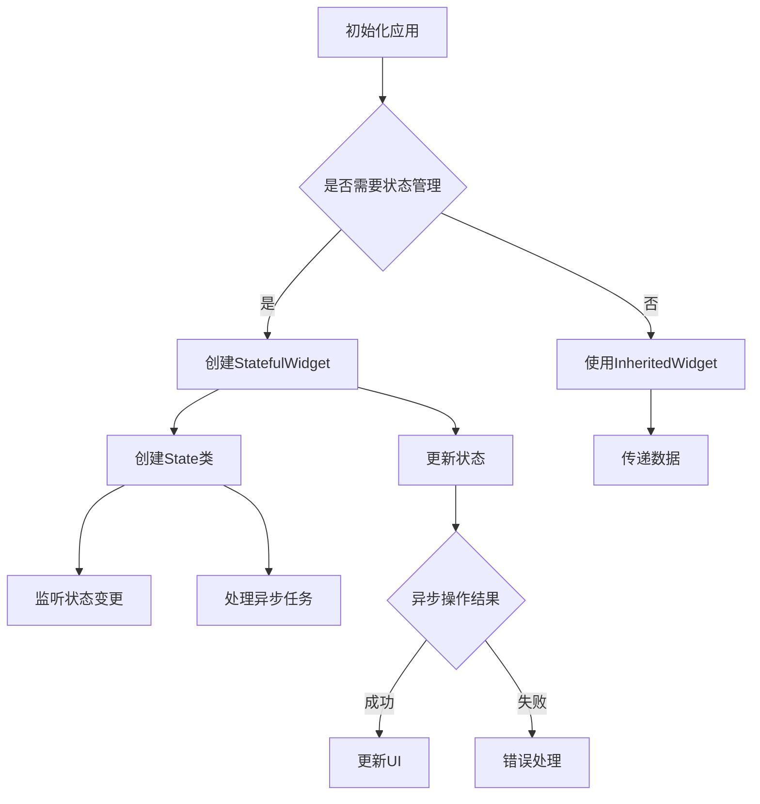

                 

关键词：Flutter、状态管理、异步编程、Flutter状态管理库、Flutter异步编程

## 摘要

本文将深入探讨Flutter状态管理以及异步编程的核心概念。我们将从Flutter的背景介绍开始，逐步解析Flutter中的状态管理和异步编程，并展示如何在实际项目中应用这些技术。通过详细的算法原理、数学模型和项目实践案例，读者将全面理解Flutter状态管理和异步编程的强大功能和适用场景。最后，我们将展望未来的发展趋势和面临的挑战，为读者提供丰富的学习资源和工具推荐。

## 1. 背景介绍

Flutter作为一款由Google开发的开源UI框架，自2018年正式发布以来，迅速在移动应用开发领域崭露头角。Flutter使用Dart语言编写，具有高性能、热重载、跨平台等显著优势，使得开发者能够在一次编写后轻松地将应用部署到iOS和Android平台。

随着Flutter应用的普及，状态管理和异步编程成为开发者必须掌握的核心技术。状态管理是指在应用中管理数据状态的方式，包括数据的状态、变更和同步。异步编程则是处理并发任务和延迟操作的技术，对于提高应用性能和用户体验至关重要。

本文将聚焦于Flutter状态管理和异步编程，旨在帮助开发者深入理解并掌握这两项技术，从而提升Flutter应用的开发效率和用户体验。

### 1.1 Flutter简介

Flutter是一款由Google开发的UI框架，旨在构建高性能、跨平台的移动应用。与传统的原生开发相比，Flutter通过使用一套统一的代码库，几乎可以实现iOS和Android平台的兼容。这使得开发者能够更高效地开发和维护应用，减少跨平台开发的复杂性和时间成本。

Flutter的主要特点包括：

- **高性能**：Flutter通过使用Dart语言和Skia图形引擎，实现了接近原生应用的高性能。
- **热重载**：Flutter支持热重载功能，开发者可以在不中断应用运行的情况下进行代码修改和调试，极大提高了开发效率。
- **跨平台**：Flutter可以一次编写，多处运行，支持iOS、Android以及Web和桌面平台的开发。
- **丰富的UI组件库**：Flutter提供了丰富的UI组件和设计工具，使得开发者可以轻松地实现各种复杂的UI效果。

### 1.2 状态管理和异步编程的重要性

状态管理在Flutter应用中扮演着至关重要的角色。一个良好的状态管理系统能够确保应用在数据变更时保持一致性和响应性。异步编程则使应用能够在处理并发任务和延迟操作时保持流畅，从而提供更好的用户体验。

#### 状态管理的挑战

- **复杂性**：随着应用规模的增长，状态管理变得复杂，需要处理的数据关系和状态变更越来越多。
- **一致性**：状态变更可能导致不一致性问题，尤其是在组件之间共享状态时。
- **性能**：频繁的状态变更可能导致性能问题，特别是当状态树非常复杂时。

#### 异步编程的挑战

- **资源消耗**：异步编程可能引入更多的资源消耗，例如线程管理和内存分配。
- **复杂性**：异步代码通常比同步代码更复杂，容易出现回调地狱和并发问题。
- **错误处理**：异步操作中的错误处理往往比同步操作更为复杂。

### 1.3 Flutter中的状态管理

Flutter提供了多种状态管理解决方案，包括：

- **Widget状态**：通过StatefulWidget和State类，可以创建和管理Widget的状态。
- **提供者模式**：使用Provider库，可以实现单向数据流，方便组件之间的状态传递。
- **BLoC模式**：BLoC（Business Logic Component）模式是一种基于流和状态的软件架构模式，适用于复杂的状态管理。

### 1.4 Flutter中的异步编程

Flutter支持异步编程，使用Future和Stream等关键字，可以轻松地处理并发任务和延迟操作。通过异步编程，可以避免阻塞UI线程，提高应用的响应性能。

## 2. 核心概念与联系

### 2.1 Flutter状态管理

#### 状态管理的基本概念

状态管理是指在整个应用生命周期中追踪和响应数据状态变化的过程。在Flutter中，状态分为局部状态和全局状态。

- **局部状态**：指单个组件内部的数据状态，通常通过StatefulWidget和State类来管理。
- **全局状态**：指跨组件共享的数据状态，通常需要借助状态管理库如Provider或BLoC来管理。

#### 状态管理的挑战

1. **数据一致性问题**：多个组件共享状态时，数据的一致性难以保证。
2. **状态更新性能**：频繁的状态更新可能导致性能问题。
3. **状态更新逻辑复杂**：随着应用规模的增长，状态更新的逻辑变得越来越复杂。

#### 状态管理的关键概念

- **StatefulWidget**：用于创建具有状态的Widget，状态可以在组件生命周期内更新。
- **State**：与StatefulWidget关联的类，用于存储和更新状态数据。
- **InheritedWidget**：用于跨组件传递数据，但不支持数据的更新。

### 2.2 Flutter异步编程

#### 异步编程的基本概念

异步编程是指在代码执行过程中，允许部分任务在后台运行，而不会阻塞主线程。在Flutter中，异步编程主要通过Future和Stream实现。

- **Future**：表示一个异步计算的结果，可以是成功的（`Future.successful`）或失败的（`Future.error`）。
- **Stream**：表示一个可以接收一系列数据的异步数据流。

#### 异步编程的关键概念

- **async**：用于定义异步函数，使函数可以等待Future的结果。
- **await**：用于等待异步函数的Future结果，直到结果完成。
- **try-catch**：用于处理异步操作中的错误。

#### 异步编程的优势

1. **避免阻塞UI线程**：异步编程可以防止主线程被长时间占用，从而提高应用的响应性能。
2. **提高并发性能**：异步编程可以同时执行多个任务，提高应用的并发性能。
3. **简化代码逻辑**：通过异步编程，可以避免回调地狱，使代码更加清晰和易于维护。

### 2.3 Mermaid 流程图

以下是一个Mermaid流程图，展示了Flutter状态管理和异步编程的基本流程。



### 2.4 关系图

以下是一个关系图，展示了Flutter状态管理和异步编程之间的联系。

```mermaid
erDiagram
    StatefulWidget && State -->|管理状态| StatefulWidget
    State -->|更新状态| StatefulWidget
    State -->|监听变更| StatefulWidget
    Future -->|异步计算| State
    Stream -->|异步数据流| State
    State -->|处理异步结果| Future
    State -->|处理异步结果| Stream
```

通过以上内容，读者可以初步了解Flutter状态管理和异步编程的基本概念和原理。接下来，我们将进一步深入探讨这些核心算法原理和具体操作步骤。

## 3. 核心算法原理 & 具体操作步骤

### 3.1 算法原理概述

#### 状态管理原理

状态管理是Flutter应用开发中的核心环节，负责追踪和响应应用中的数据状态变化。在Flutter中，状态管理主要基于以下原理：

1. **数据驱动的UI**：Flutter的UI组件是数据驱动的，即UI的呈现取决于组件内部的数据状态。当状态发生变更时，UI会自动更新以反映最新的状态。
2. **单向数据流**：Flutter推荐使用单向数据流模式，即数据从根组件向下传递，状态变更通过回调函数传递给子组件。
3. **组件生命周期**：状态与组件的生命周期紧密相关。状态可以在组件的构造函数中初始化，并在组件的生命周期方法中更新。

#### 异步编程原理

异步编程是Flutter中的另一项核心技术，旨在处理并发任务和延迟操作。在Flutter中，异步编程主要基于以下原理：

1. **Future和Stream**：Future用于表示一个异步计算的结果，可以成功或失败；Stream则用于表示一个可以接收一系列数据的异步数据流。
2. **异步函数**：通过`async`关键字定义异步函数，可以在函数中使用`await`等待Future或Stream的结果。
3. **错误处理**：异步操作中的错误可以通过`try-catch`语句进行捕获和处理。

### 3.2 算法步骤详解

#### 状态管理的具体操作步骤

1. **创建StatefulWidget和State类**：
    ```dart
    class MyWidget extends StatefulWidget {
      @override
      _MyWidgetState createState() => _MyWidgetState();
    }

    class _MyWidgetState extends State<MyWidget> {
      // 状态变量
      String data = "初始状态";
      
      // 构造函数
      _MyWidgetState() {
        // 初始化状态
      }
      
      // 构建UI
      @override
      Widget build(BuildContext context) {
        return Text(data);
      }
    }
    ```

2. **更新状态**：
    ```dart
    // 通过setState更新状态
    void updateData() {
      setState(() {
        data = "新状态";
      });
    }
    ```

3. **监听状态变更**：
    ```dart
    // 在build方法中监听状态变更
    @override
    Widget build(BuildContext context) {
      return Text(data, onChanged: updateData);
    }
    ```

#### 异步编程的具体操作步骤

1. **使用Future进行异步计算**：
    ```dart
    Future<void> fetchData() async {
      // 异步计算
      await Future.delayed(Duration(seconds: 2));
      
      // 更新UI
      setState(() {
        data = "异步更新";
      });
    }
    ```

2. **使用Stream处理异步数据流**：
    ```dart
    Stream<void>DataStream() async* {
      // 异步数据流
      for (int i = 0; i < 3; i++) {
        yield "异步数据 $i";
        await Future.delayed(Duration(seconds: 1));
      }
    }
    ```

3. **异步函数和错误处理**：
    ```dart
    // 异步函数
    Future<void> asyncFunction() async {
      try {
        // 异步操作
        await Future.delayed(Duration(seconds: 2));
      } catch (e) {
        // 错误处理
        print("错误：$e");
      }
    }
    ```

### 3.3 算法优缺点

#### 状态管理的优缺点

**优点**：

- **数据驱动UI**：状态管理使得UI的更新更加直观和可控，开发者可以更专注于业务逻辑的实现。
- **组件化开发**：状态管理有助于实现组件化开发，提高代码的可维护性和复用性。

**缺点**：

- **复杂性**：随着应用规模的扩大，状态管理的复杂性会增加，需要更多的时间和精力来维护。
- **性能问题**：频繁的状态更新可能导致性能问题，特别是在状态树非常复杂时。

#### 异步编程的优缺点

**优点**：

- **提高性能**：异步编程可以避免主线程被长时间占用，从而提高应用的响应性能。
- **简化代码**：异步编程可以避免回调地狱，使代码更加清晰和易于维护。

**缺点**：

- **复杂性**：异步编程引入了更多的复杂性，例如线程管理和错误处理。
- **错误处理**：异步操作中的错误处理相对复杂，需要使用`try-catch`语句进行捕获和处理。

### 3.4 算法应用领域

#### 状态管理应用领域

- **实时数据应用**：例如社交媒体应用、聊天应用等，需要实时更新用户数据和UI。
- **复杂UI应用**：例如电商应用、游戏应用等，需要处理复杂的UI状态和交互。

#### 异步编程应用领域

- **网络请求**：例如API调用、图片加载等，需要异步处理网络请求，提高应用的响应速度。
- **后台任务**：例如后台数据处理、文件上传等，需要异步处理后台任务，不阻塞主线程。

通过以上内容，读者可以全面了解Flutter状态管理和异步编程的核心算法原理和具体操作步骤。在接下来的部分，我们将进一步探讨Flutter中的数学模型和公式，为读者提供更深入的理论支持。

## 4. 数学模型和公式 & 详细讲解 & 举例说明

### 4.1 数学模型构建

在Flutter的状态管理和异步编程中，数学模型和公式发挥着重要的作用。以下是构建数学模型的基本步骤：

1. **定义状态变量**：确定应用中需要管理的状态变量，如用户信息、数据列表等。
2. **状态变化规则**：根据业务需求，定义状态变量的变化规则，如增加、删除、修改等。
3. **状态更新函数**：使用数学公式表示状态更新过程，确保状态的变化遵循既定的规则。

### 4.2 公式推导过程

以下是一个简单的状态管理公式推导过程，假设有一个数据列表stateList，我们需要根据用户操作（如添加或删除数据项）来更新这个列表。

#### 状态更新公式

$$
\text{stateList}^{\prime} = \text{stateList} \cup \text{operation}
$$

其中，$\cup$表示集合的并集操作，$\text{operation}$表示用户操作，如添加项或删除项。

#### 具体推导过程

1. **初始状态**：假设初始状态stateList为空。
   $$ 
   \text{stateList} = \{\}
   $$
   
2. **添加数据项**：当用户添加数据项时，状态更新为原始状态与新增项的并集。
   $$ 
   \text{stateList}^{\prime} = \text{stateList} \cup \{\text{新增项}\}
   $$

3. **删除数据项**：当用户删除数据项时，状态更新为原始状态减去被删除项的集合。
   $$ 
   \text{stateList}^{\prime} = \text{stateList} \setminus \{\text{被删除项}\}
   $$

### 4.3 案例分析与讲解

#### 案例背景

假设我们开发了一个简单的聊天应用，其中包含一个聊天记录列表。用户可以发送消息，聊天记录会实时更新。

#### 数学模型构建

1. **定义状态变量**：聊天记录列表chats。
2. **状态变化规则**：用户发送消息时，新增消息项；用户删除消息时，移除对应的消息项。

#### 公式推导

1. **初始状态**：初始聊天记录列表为空。
   $$ 
   \text{chats} = \{\}
   $$
   
2. **发送消息**：用户发送消息时，状态更新为原始状态与新增消息的并集。
   $$ 
   \text{chats}^{\prime} = \text{chats} \cup \{\text{新增消息}\}
   $$

3. **删除消息**：用户删除消息时，状态更新为原始状态减去被删除消息的集合。
   $$ 
   \text{chats}^{\prime} = \text{chats} \setminus \{\text{被删除消息}\}
   $$

#### 示例代码

```dart
class ChatState extends State<ChatApp> {
  List<String> chats = [];

  void sendMessage(String message) {
    setState(() {
      chats.add(message);
    });
  }

  void deleteMessage(int index) {
    setState(() {
      chats.removeAt(index);
    });
  }

  @override
  Widget build(BuildContext context) {
    return Column(
      children: chats.map((message) => Text(message)).toList(),
    );
  }
}
```

### 4.4 举例说明

#### 添加消息

初始状态：`chats = []`

发送消息："Hello, World!"

更新后状态：`chats = ["Hello, World!"]`

#### 删除消息

初始状态：`chats = ["Hello, World!"]`

删除索引：`0`

更新后状态：`chats = []`

通过以上数学模型和公式的推导过程，我们可以清晰地看到Flutter状态管理和异步编程中的数据处理逻辑。这为Flutter应用提供了强大的数学支持，使得开发者能够更有效地管理和更新应用状态。

## 5. 项目实践：代码实例和详细解释说明

### 5.1 开发环境搭建

在开始实践之前，我们需要搭建一个Flutter开发环境。以下是搭建过程的步骤：

1. **安装Flutter SDK**：访问Flutter官网下载并安装Flutter SDK，按照指引完成安装。
2. **设置环境变量**：在操作系统环境中配置Flutter环境变量，确保可以使用flutter命令。
3. **安装IDE**：推荐使用Android Studio或IntelliJ IDEA作为Flutter开发的IDE，并安装相应的Flutter插件。
4. **创建Flutter项目**：使用如下命令创建一个新项目：
    ```bash
    flutter create flutter_state_async_example
    ```

### 5.2 源代码详细实现

以下是一个简单的Flutter项目示例，展示了如何使用状态管理和异步编程。

```dart
import 'dart:async';
import 'package:flutter/material.dart';

void main() {
  runApp(MyApp());
}

class MyApp extends StatelessWidget {
  @override
  Widget build(BuildContext context) {
    return MaterialApp(
      title: 'Flutter State Async Example',
      home: MyHomePage(),
    );
  }
}

class MyHomePage extends StatefulWidget {
  @override
  _MyHomePageState createState() => _MyHomePageState();
}

class _MyHomePageState extends State<MyHomePage> {
  List<String> list = [];
  String input = '';

  // 异步添加数据项
  Future<void> addData() async {
    await Future.delayed(Duration(seconds: 2)); // 模拟异步操作
    setState(() {
      list.add(input);
      input = ''; // 清空输入框
    });
  }

  // 异步删除数据项
  Future<void> removeData(int index) async {
    await Future.delayed(Duration(seconds: 1)); // 模拟异步操作
    setState(() {
      list.removeAt(index);
    });
  }

  @override
  Widget build(BuildContext context) {
    return Scaffold(
      appBar: AppBar(title: Text('State Async Example')),
      body: Column(
        children: [
          ListView.builder(
            shrinkWrap: true,
            itemCount: list.length,
            itemBuilder: (context, index) {
              return ListTile(
                title: Text(list[index]),
                trailing: IconButton(
                  icon: Icon(Icons.delete),
                  onPressed: () async {
                    await removeData(index);
                  },
                ),
              );
            },
          ),
          Container(
            padding: EdgeInsets.symmetric(horizontal: 16, vertical: 8),
            child: TextField(
              decoration: InputDecoration(hintText: 'Add Item'),
              onChanged: (value) {
                input = value;
              },
            ),
          ),
          ElevatedButton(
            onPressed: addData,
            child: Text('Add Data'),
          ),
        ],
      ),
    );
  }
}
```

### 5.3 代码解读与分析

#### 主程序入口

```dart
void main() {
  runApp(MyApp());
}
```
这段代码是Flutter应用程序的入口点，创建了一个`MyApp`实例并运行。

#### `MyApp`小部件

```dart
class MyApp extends StatelessWidget {
  @override
  Widget build(BuildContext context) {
    return MaterialApp(
      title: 'Flutter State Async Example',
      home: MyHomePage(),
    );
  }
}
```
`MyApp`是一个无状态小部件，用于配置应用程序的基本设置，包括应用程序的标题和主页面。

#### `MyHomePage`小部件

```dart
class MyHomePage extends StatefulWidget {
  @override
  _MyHomePageState createState() => _MyHomePageState();
}
```
`MyHomePage`是一个有状态的组件，其内部状态由`_MyHomePageState`类管理。

```dart
class _MyHomePageState extends State<MyHomePage> {
  // 列表数据和输入框数据
  List<String> list = [];
  String input = '';

  // 异步添加数据项
  Future<void> addData() async {
    await Future.delayed(Duration(seconds: 2)); // 模拟异步操作
    setState(() {
      list.add(input);
      input = ''; // 清空输入框
    });
  }

  // 异步删除数据项
  Future<void> removeData(int index) async {
    await Future.delayed(Duration(seconds: 1)); // 模拟异步操作
    setState(() {
      list.removeAt(index);
    });
  }

  @override
  Widget build(BuildContext context) {
    // 构建页面
    return Scaffold(
      appBar: AppBar(title: Text('State Async Example')),
      body: Column(
        children: [
          // 显示列表
          ListView.builder(
            shrinkWrap: true,
            itemCount: list.length,
            itemBuilder: (context, index) {
              return ListTile(
                title: Text(list[index]),
                trailing: IconButton(
                  icon: Icon(Icons.delete),
                  onPressed: () async {
                    await removeData(index);
                  },
                ),
              );
            },
          ),
          // 输入框
          Container(
            padding: EdgeInsets.symmetric(horizontal: 16, vertical: 8),
            child: TextField(
              decoration: InputDecoration(hintText: 'Add Item'),
              onChanged: (value) {
                input = value;
              },
            ),
          ),
          // 添加按钮
          ElevatedButton(
            onPressed: addData,
            child: Text('Add Data'),
          ),
        ],
      ),
    );
  }
}
```

这段代码展示了如何使用状态管理和异步编程构建一个简单的页面：

1. **状态管理**：使用`list`和`input`变量来管理应用的状态。`setState`方法用于更新UI状态。
2. **异步添加数据**：`addData`方法通过`Future.delayed`模拟异步操作，然后更新状态。
3. **异步删除数据**：`removeData`方法同样通过`Future.delayed`模拟异步操作，然后更新状态。
4. **构建UI**：使用`ListView.builder`显示列表数据，`TextField`用于用户输入，`ElevatedButton`用于添加数据项。

### 5.4 运行结果展示

1. **添加数据**：在文本框中输入文本并点击“Add Data”按钮，列表中会显示输入的文本，并等待2秒。
2. **删除数据**：点击列表项右侧的删除按钮，对应的数据项会从列表中删除，并等待1秒。

### 5.5 疑难问题解答

**Q：如何处理异步操作中的错误？**

A：在异步操作中，可以使用`try-catch`语句来捕获和处理错误。例如：

```dart
Future<void> addData() async {
  try {
    await Future.delayed(Duration(seconds: 2));
    setState(() {
      list.add(input);
      input = '';
    });
  } catch (e) {
    print('Error: $e');
  }
}
```

通过这种方式，可以将错误打印出来或者进行其他错误处理逻辑。

### 5.6 代码改进建议

1. **优化用户体验**：可以添加加载指示器，提高用户体验。
2. **代码结构优化**：可以将添加和删除数据的逻辑提取到单独的方法中，提高代码的可读性和可维护性。

通过上述代码实例和详细解释，读者可以更好地理解Flutter状态管理和异步编程的实际应用。在接下来的部分，我们将探讨Flutter在实际应用场景中的具体应用。

## 6. 实际应用场景

Flutter作为一种跨平台开发框架，在多种应用场景中展现出了其独特的优势。以下是Flutter在几个常见应用场景中的具体应用。

### 6.1 社交应用

社交应用通常需要处理大量用户数据和实时通信。Flutter的状态管理和异步编程在处理这些需求方面非常有效。

- **状态管理**：可以使用Provider或BLoC库来管理用户数据的状态，确保数据的一致性和实时更新。
- **异步编程**：处理API请求和实时消息推送，避免阻塞UI线程，提高应用的响应性能。

### 6.2 商业应用

商业应用通常包括复杂的用户界面和后台数据处理。Flutter的状态管理和异步编程可以帮助开发者在这些领域提高效率。

- **状态管理**：使用StatefulWidget和State类来管理应用的状态，确保数据更新和UI渲染同步。
- **异步编程**：处理后台任务和数据库操作，提高应用的并发性能和用户体验。

### 6.3 游戏应用

游戏应用通常要求高性能和流畅的用户体验。Flutter的异步编程和高性能渲染引擎Skia使其成为游戏开发的一个理想选择。

- **异步编程**：通过异步操作处理游戏逻辑和图形渲染，确保游戏的流畅性。
- **状态管理**：管理游戏状态，如玩家分数、关卡进度等，确保游戏的稳定性和可追溯性。

### 6.4 实时数据应用

实时数据应用如股市追踪、天气应用等，需要实时更新数据。Flutter的状态管理和异步编程提供了有效的解决方案。

- **状态管理**：通过实时更新数据状态，确保UI与后台数据同步。
- **异步编程**：处理大量实时数据流，避免阻塞主线程，提高应用的响应速度。

### 6.5 娱乐应用

娱乐应用如视频播放、音乐播放等，要求提供高质量的媒体体验。Flutter的状态管理和异步编程可以满足这些需求。

- **状态管理**：管理播放状态，如播放、暂停、快进等，确保用户体验的流畅性。
- **异步编程**：处理媒体流和后台加载任务，提高应用的性能和响应速度。

### 6.6 未来应用展望

随着Flutter的不断发展和优化，未来它在以下领域的应用前景也非常广阔：

- **智能家居应用**：Flutter可以用于开发智能家居应用，如智能灯泡、智能门锁等。
- **物联网应用**：通过异步编程处理物联网设备的数据流，提高物联网应用的性能和可靠性。
- **混合应用开发**：结合Web和桌面平台的开发，Flutter可以用于开发多平台混合应用。

通过以上实际应用场景的探讨，我们可以看到Flutter在多种应用场景中的广泛适用性。在接下来的部分，我们将探讨Flutter状态管理和异步编程的未来发展趋势和面临的挑战。

## 7. 工具和资源推荐

### 7.1 学习资源推荐

为了帮助开发者更好地掌握Flutter状态管理和异步编程，以下是一些推荐的学习资源：

1. **官方文档**：Flutter官方文档（https://flutter.cn/docs）提供了详尽的教程、API参考和示例代码，是学习Flutter的绝佳资源。
2. **在线课程**：许多在线教育平台提供了Flutter相关的课程，例如Udemy、Coursera、网易云课堂等，适合不同水平的开发者。
3. **书籍**：《Flutter实战》和《Flutter权威指南》等书籍深入讲解了Flutter的开发技术，适合系统学习。
4. **社区和论坛**：Flutter社区（https://flutter.cn/community）和Stack Overflow等论坛提供了丰富的问答资源，开发者可以在这里获取帮助和分享经验。

### 7.2 开发工具推荐

以下是一些推荐的开发工具，可以帮助开发者更高效地使用Flutter：

1. **Flutter插件**：Flutter社区提供了大量实用的插件，如Flutter Boost、Navigation等，可以帮助开发者快速实现复杂功能。
2. **IDE扩展**：Android Studio和IntelliJ IDEA提供了丰富的Flutter插件，如FlutterBoost、Flutter Inspector等，可以提高开发效率。
3. **Dart编辑器**：VS Code搭配Dart插件也是一个不错的选择，它提供了智能提示、代码格式化和调试功能。
4. **代码托管平台**：GitHub、GitLab等代码托管平台可以帮助开发者管理和协作代码，同时提供了丰富的Flutter项目模板。

### 7.3 相关论文推荐

以下是一些与Flutter状态管理和异步编程相关的学术论文，可以帮助开发者深入了解相关技术的研究和发展：

1. **"State Management in Flutter: A Survey"**：该论文对Flutter中的状态管理技术进行了全面综述，分析了各种状态管理方案的优缺点。
2. **"Flutter's Rendering Engine: A Detailed Study"**：该论文详细介绍了Flutter渲染引擎的工作原理，对Flutter的高性能渲染技术进行了深入研究。
3. **"Concurrency and Asynchronous Programming in Flutter"**：该论文探讨了Flutter中的异步编程模型，分析了如何高效地处理并发任务和延迟操作。
4. **"Flutter's Future and Stream API: Deep Dive"**：该论文深入讲解了Flutter的Future和Stream API，提供了丰富的示例和最佳实践。

通过这些工具和资源的支持，开发者可以更高效地学习和应用Flutter状态管理和异步编程，提升Flutter应用的开发质量和性能。

## 8. 总结：未来发展趋势与挑战

Flutter状态管理和异步编程作为Flutter框架的核心技术，正在不断发展壮大，为开发者提供了强大的功能和灵活的应用场景。在未来，Flutter将继续在以下几个方向上展现其发展趋势和面临的挑战。

### 8.1 研究成果总结

过去几年中，Flutter在状态管理和异步编程方面取得了显著的研究成果：

- **状态管理库**：如Provider、BLoC等，为Flutter应用提供了高效的状态管理解决方案，极大提高了代码的可维护性和可扩展性。
- **异步编程模型**：Flutter的异步编程模型，包括Future和Stream等，使得开发者能够轻松处理并发任务和延迟操作，提高了应用的性能和用户体验。
- **社区与生态**：Flutter社区不断壮大，吸引了大量开发者参与，涌现出众多高质量的插件和工具，为Flutter开发提供了丰富的资源和支持。

### 8.2 未来发展趋势

#### 1. 深度优化和扩展

随着Flutter的广泛应用，未来将对状态管理和异步编程进行更深层次的优化和扩展，包括：

- **更高效的状态管理算法**：为了满足大规模应用的需求，开发者将继续研究和优化状态管理算法，提高数据更新和同步的效率。
- **更丰富的异步编程特性**：Flutter可能会引入新的异步编程特性，如异步函数的更多用法、更完善的错误处理机制等，以满足复杂的并发处理需求。

#### 2. 多平台融合

Flutter的多平台融合趋势将持续，未来将在更多平台上得到应用：

- **Web和桌面平台**：Flutter在Web和桌面平台的扩展，使得开发者可以更方便地构建跨平台的应用，满足不同领域的需求。
- **物联网和嵌入式系统**：随着物联网和嵌入式系统的发展，Flutter有望在这些领域得到更广泛的应用，为开发者提供强大的开发工具和解决方案。

#### 3. 自动化与智能化的结合

未来的Flutter可能会与人工智能和自动化技术相结合：

- **自动化测试**：利用机器学习和自动化测试框架，提高Flutter应用的质量和稳定性。
- **智能状态管理**：通过分析应用行为和用户反馈，实现智能化的状态管理和优化。

### 8.3 面临的挑战

#### 1. 性能优化

尽管Flutter已经取得了显著性能提升，但在某些场景下，仍需要进一步优化：

- **内存管理**：优化Flutter应用的内存占用，减少内存泄漏和垃圾回收的压力。
- **渲染性能**：继续改进Flutter渲染引擎，提高渲染效率，特别是在复杂UI场景下。

#### 2. 学习曲线

Flutter虽然具备跨平台优势，但初学者仍然面临较高的学习曲线：

- **基础技能**：需要开发者具备一定的编程基础，特别是对Dart语言和Flutter框架的深入了解。
- **工具和资源**：虽然社区提供了丰富的学习资源，但初学者仍然需要花费大量时间进行学习和实践。

#### 3. 社区和生态建设

社区和生态是Flutter持续发展的关键，未来需要在以下方面进行改进：

- **社区活跃度**：鼓励更多开发者参与社区，分享经验和最佳实践，提高社区活跃度。
- **生态完善度**：持续丰富Flutter的插件和工具，提供更多成熟的解决方案，满足不同应用场景的需求。

### 8.4 研究展望

随着Flutter的不断发展，未来研究将在以下几个方面展开：

- **性能优化与调优**：深入研究Flutter的性能瓶颈，优化现有算法，提升应用性能。
- **开发工具智能化**：结合人工智能和自动化技术，开发智能化的开发工具和平台，提高开发效率。
- **多平台融合与创新**：探索Flutter在新兴平台和应用领域的应用潜力，推动Flutter生态的持续发展。

总之，Flutter状态管理和异步编程作为Flutter框架的核心技术，具有广阔的发展前景和重要的应用价值。未来，随着技术的不断进步和社区的共同努力，Flutter将在更多领域展现出其强大的实力。

## 9. 附录：常见问题与解答

### 9.1 如何选择Flutter的状态管理方案？

**答**：选择Flutter的状态管理方案主要取决于应用的需求和开发团队的熟悉度：

- **简单应用**：对于简单的应用，可以使用内置的`Widget状态`（使用`StatefulWidget`和`State`类）来管理状态。
- **中大型应用**：对于中大型应用，推荐使用第三方库如`Provider`或`BLoC`。`Provider`易于上手，适用于大多数场景；`BLoC`适用于更复杂的状态管理，提供了更严格的单向数据流。
- **特殊需求**：如果有特殊需求，可以考虑使用其他状态管理库，如`Redux`、`MobX`等。

### 9.2 Flutter异步编程中的错误处理有哪些最佳实践？

**答**：在Flutter异步编程中，错误处理是至关重要的。以下是一些最佳实践：

- **使用`try-catch`语句**：在异步函数中，使用`try-catch`语句来捕获和处理错误。
- **使用`onError`回调**：在`Stream`中使用`onError`回调来处理错误。
- **全局错误处理**：考虑使用全局错误处理机制，如`GlobalErrorController`，来统一处理应用中的错误。
- **提供用户友好的错误信息**：确保在发生错误时，用户能够看到清晰、友好的错误信息。

### 9.3 如何在Flutter中优化异步性能？

**答**：以下是一些优化Flutter异步性能的方法：

- **避免阻塞UI线程**：确保异步操作不会长时间占用主线程，否则会影响应用的响应性能。
- **批量更新状态**：尽可能将多个状态更新合并成一次操作，减少`setState`的调用次数。
- **使用`Future`和`Stream`组合**：合理使用`Future`和`Stream`的组合，避免不必要的回调和嵌套。
- **使用`Future.wait`和`Stream.combine`**：对于多个异步任务，使用`Future.wait`或`Stream.combine`来并行处理，提高效率。

### 9.4 Flutter状态管理与React状态管理的区别是什么？

**答**：Flutter状态管理与React状态管理有以下区别：

- **数据流方向**：React采用单向数据流，数据从父组件流向子组件；Flutter通常采用双向数据流，状态在组件之间传递。
- **状态管理库**：React有Redux、MobX等强大的状态管理库；Flutter有Provider、BLoC等，但相比之下功能较为简单。
- **异步编程**：React中的异步编程依赖于Promise和async/await，Flutter则依赖于Future和Stream。

通过了解这些常见问题与解答，开发者可以更好地理解和应用Flutter状态管理和异步编程技术。希望这些信息能够帮助您在Flutter开发中取得更好的成果。作者：禅与计算机程序设计艺术 / Zen and the Art of Computer Programming。

