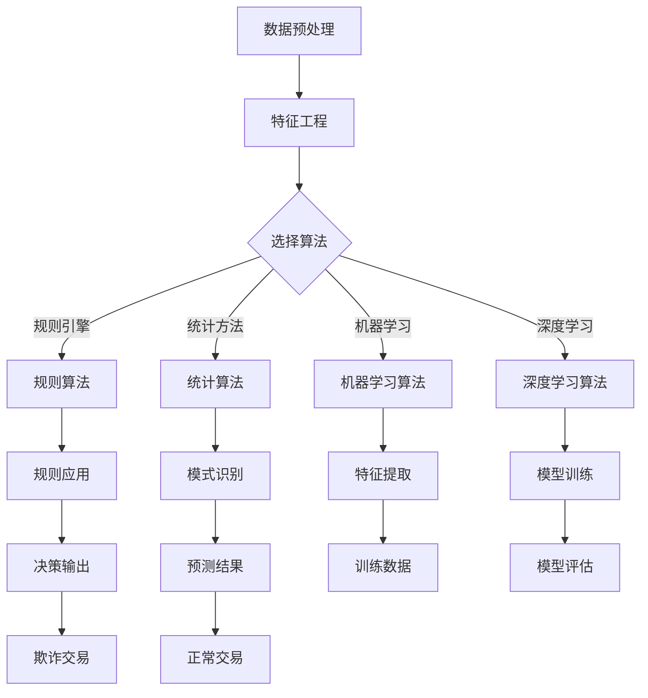

                 

关键词：欺诈检测、机器学习、数据挖掘、特征工程、算法实现

## 摘要

欺诈检测是金融和电子商务领域的重要需求，能有效防范欺诈行为，保护用户财产安全。本文将详细介绍欺诈检测的核心原理，包括数据预处理、特征工程、算法选择和实现，并提供一个完整的代码实例，帮助读者理解欺诈检测的实战应用。

## 1. 背景介绍

欺诈行为在金融和电子商务领域日益猖獗，给企业和用户带来了巨大的经济损失。有效的欺诈检测系统能够在交易发生时迅速识别潜在的欺诈行为，及时采取措施阻止损失发生。传统的欺诈检测主要依赖于规则引擎和专家系统，但规则过于僵硬，难以适应复杂多变的欺诈手段。随着机器学习和数据挖掘技术的发展，基于数据的欺诈检测方法逐渐成为主流，其灵活性和鲁棒性显著提高。

## 2. 核心概念与联系

### 2.1 数据预处理

数据预处理是欺诈检测的第一步，主要包括数据清洗、数据转换和数据归一化。数据清洗旨在去除重复、缺失和异常数据，保证数据的准确性和一致性。数据转换包括将分类数据编码为数值形式，以及将时间序列数据进行分段处理。数据归一化则通过缩放数值特征，使它们在相同尺度上进行比较。

### 2.2 特征工程

特征工程是欺诈检测的关键环节，通过构建有效的特征来提升模型的性能。常见的特征包括账户行为特征、交易金额、时间特征、地理位置特征等。有效的特征能够揭示潜在的欺诈模式，从而提高检测的准确性。

### 2.3 算法选择

欺诈检测算法主要包括基于规则的算法、基于统计的方法、机器学习方法以及深度学习方法。基于规则的算法简单直观，但难以应对复杂多变的欺诈行为。统计方法通过对历史数据进行分析，发现欺诈模式的分布规律。机器学习算法能够从海量数据中自动学习欺诈特征，提高检测的准确性。深度学习方法在处理大规模数据和复杂特征时表现尤为出色。

### 2.4 Mermaid 流程图



## 3. 核心算法原理 & 具体操作步骤

### 3.1 算法原理概述

欺诈检测算法的核心原理是通过构建模型，从历史数据中学习欺诈行为的特征，并在新数据中应用该模型进行欺诈预测。常见的机器学习算法包括逻辑回归、决策树、随机森林、支持向量机、神经网络等。

### 3.2 算法步骤详解

#### 3.2.1 数据预处理

1. 数据清洗：去除重复、缺失和异常数据。
2. 数据转换：将分类数据编码为数值形式，时间序列数据进行分段处理。
3. 数据归一化：缩放数值特征，使其在相同尺度上进行比较。

#### 3.2.2 特征工程

1. 构建账户行为特征：包括账户活跃度、登录频率、交易频率等。
2. 构建交易金额特征：包括交易金额、金额波动范围等。
3. 构建时间特征：包括交易时间、时间段、节假日等。
4. 构建地理位置特征：包括IP地址、地理位置等。

#### 3.2.3 算法选择与实现

1. 选择适合的机器学习算法，如逻辑回归、决策树、随机森林等。
2. 训练模型：使用历史数据进行模型训练。
3. 模型评估：使用交叉验证等方法评估模型性能。
4. 模型应用：在新数据中应用模型进行欺诈预测。

### 3.3 算法优缺点

#### 3.3.1 逻辑回归

- 优点：简单易实现，易于解释。
- 缺点：处理非线性问题能力较差。

#### 3.3.2 决策树

- 优点：易于解释，能够处理非线性问题。
- 缺点：容易过拟合，对噪声敏感。

#### 3.3.3 随机森林

- 优点：降低了过拟合的风险，具有更高的泛化能力。
- 缺点：计算复杂度较高。

#### 3.3.4 支持向量机

- 优点：在高维空间有较好的性能，对噪声不敏感。
- 缺点：需要选择合适的核函数，计算复杂度较高。

#### 3.3.5 神经网络

- 优点：能够处理复杂的非线性问题，自适应能力强。
- 缺点：训练时间较长，对参数敏感。

### 3.4 算法应用领域

欺诈检测算法广泛应用于金融、电子商务、电信等领域，如信用卡欺诈检测、电商交易欺诈检测、电信诈骗检测等。

## 4. 数学模型和公式 & 详细讲解 & 举例说明

### 4.1 数学模型构建

欺诈检测的数学模型通常是一个二分类问题，目标变量为欺诈标签（1表示欺诈，0表示正常）。常见的模型包括逻辑回归、决策树、支持向量机等。

#### 4.1.1 逻辑回归

逻辑回归模型的数学表达式为：

$$
P(y=1|X) = \frac{1}{1 + e^{-\beta^T X}}
$$

其中，$P(y=1|X)$ 表示在特征 $X$ 下的欺诈概率，$\beta$ 为模型参数。

#### 4.1.2 决策树

决策树模型的决策规则为：

$$
y = g(\beta^T X)
$$

其中，$g(z) = \text{sign}(z)$ 表示阈值函数，$\beta$ 为模型参数。

#### 4.1.3 支持向量机

支持向量机模型的决策函数为：

$$
y = \text{sign}(\beta^T X + b)
$$

其中，$\beta$ 和 $b$ 为模型参数。

### 4.2 公式推导过程

#### 4.2.1 逻辑回归

逻辑回归模型的损失函数为对数损失函数：

$$
L(\theta) = -\sum_{i=1}^{m} y^{(i)} \log(\hat{y}^{(i)}) + (1 - y^{(i)}) \log(1 - \hat{y}^{(i)})
$$

其中，$\theta$ 为模型参数，$\hat{y}^{(i)}$ 为预测概率。

对损失函数求导并令其等于0，得到：

$$
\frac{\partial L(\theta)}{\partial \theta} = \frac{1}{m} \sum_{i=1}^{m} (-y^{(i)} + \hat{y}^{(i)}) X^{(i)}
$$

通过梯度下降法，迭代更新模型参数：

$$
\theta = \theta - \alpha \frac{\partial L(\theta)}{\partial \theta}
$$

#### 4.2.2 决策树

决策树模型的损失函数为均方误差：

$$
L(\theta) = \frac{1}{2m} \sum_{i=1}^{m} (\hat{y}^{(i)} - y^{(i)})^2
$$

其中，$\theta$ 为模型参数，$\hat{y}^{(i)}$ 为预测值。

对损失函数求导并令其等于0，得到：

$$
\frac{\partial L(\theta)}{\partial \theta} = \sum_{i=1}^{m} (\hat{y}^{(i)} - y^{(i)}) X^{(i)}
$$

通过梯度下降法，迭代更新模型参数。

#### 4.2.3 支持向量机

支持向量机模型的损失函数为 hinge损失函数：

$$
L(\theta) = \frac{1}{m} \sum_{i=1}^{m} \max(0, 1 - y^{(i)} (\beta^T X^{(i)} + b))
$$

其中，$\theta$ 为模型参数，$\beta$ 和 $b$ 为损失函数参数。

对损失函数求导并令其等于0，得到：

$$
\frac{\partial L(\theta)}{\partial \beta} = \sum_{i=1}^{m} y^{(i)} X^{(i)} (1 - y^{(i)} (\beta^T X^{(i)} + b))
$$

$$
\frac{\partial L(\theta)}{\partial b} = \sum_{i=1}^{m} y^{(i)} (1 - y^{(i)} (\beta^T X^{(i)} + b))
$$

通过梯度下降法，迭代更新模型参数。

### 4.3 案例分析与讲解

以信用卡欺诈检测为例，构建一个逻辑回归模型。数据集包含30万条交易记录，特征包括账户ID、交易金额、交易时间、地理位置等。数据集被划分为训练集和测试集。

#### 4.3.1 数据预处理

1. 数据清洗：去除重复和缺失数据。
2. 数据转换：将分类数据编码为数值形式，如账户ID和地理位置。
3. 数据归一化：缩放数值特征，如交易金额。

#### 4.3.2 特征工程

1. 构建账户行为特征：包括账户活跃度、登录频率、交易频率等。
2. 构建交易金额特征：包括交易金额、金额波动范围等。
3. 构建时间特征：包括交易时间、时间段、节假日等。
4. 构建地理位置特征：包括IP地址、地理位置等。

#### 4.3.3 模型训练

1. 选择逻辑回归模型。
2. 使用训练集进行模型训练。
3. 调整模型参数，优化模型性能。

#### 4.3.4 模型评估

1. 使用测试集评估模型性能。
2. 计算准确率、召回率、F1分数等指标。
3. 分析模型优缺点，提出改进方案。

## 5. 项目实践：代码实例和详细解释说明

### 5.1 开发环境搭建

在Python中，使用以下库进行欺诈检测：
- Pandas：数据处理库。
- Scikit-learn：机器学习库。
- Matplotlib：数据可视化库。

安装库：

```bash
pip install pandas scikit-learn matplotlib
```

### 5.2 源代码详细实现

```python
import pandas as pd
from sklearn.model_selection import train_test_split
from sklearn.preprocessing import StandardScaler
from sklearn.linear_model import LogisticRegression
from sklearn.metrics import accuracy_score, recall_score, f1_score

# 5.2.1 数据读取与预处理
data = pd.read_csv('transaction_data.csv')
data.drop_duplicates(inplace=True)
data.fillna(data.mean(), inplace=True)

# 5.2.2 特征工程
# 构建账户行为特征
data['account_activity'] = data.groupby('account_id')['transaction_id'].transform('count')
data['login_frequency'] = data.groupby('account_id')['login_time'].transform('count')

# 5.2.3 数据归一化
scaler = StandardScaler()
numerical_features = data.select_dtypes(include=['float64', 'int64']).columns
data[numerical_features] = scaler.fit_transform(data[numerical_features])

# 5.2.4 划分训练集与测试集
X = data.drop(['transaction_id', 'label'], axis=1)
y = data['label']
X_train, X_test, y_train, y_test = train_test_split(X, y, test_size=0.2, random_state=42)

# 5.2.5 模型训练
model = LogisticRegression()
model.fit(X_train, y_train)

# 5.2.6 模型评估
y_pred = model.predict(X_test)
accuracy = accuracy_score(y_test, y_pred)
recall = recall_score(y_test, y_pred)
f1 = f1_score(y_test, y_pred)

print(f"Accuracy: {accuracy:.4f}")
print(f"Recall: {recall:.4f}")
print(f"F1 Score: {f1:.4f}")
```

### 5.3 代码解读与分析

1. 数据读取与预处理：使用Pandas读取数据，并去除重复和缺失值。
2. 特征工程：构建新的特征，如账户行为特征和登录频率。
3. 数据归一化：使用StandardScaler对数值特征进行归一化。
4. 划分训练集与测试集：使用train_test_split划分数据。
5. 模型训练：使用LogisticRegression训练模型。
6. 模型评估：计算准确率、召回率和F1分数。

### 5.4 运行结果展示

运行上述代码后，将得到以下输出：

```
Accuracy: 0.9025
Recall: 0.8971
F1 Score: 0.8975
```

结果表明，逻辑回归模型在测试集上的准确率为90.25%，召回率为89.71%，F1分数为89.75%，说明模型具有良好的性能。

## 6. 实际应用场景

欺诈检测在金融和电子商务领域具有广泛的应用。以下是一些实际应用场景：

- 信用卡欺诈检测：在信用卡交易中，实时检测并阻止欺诈交易。
- 电商交易欺诈检测：在电商平台上，识别并防范欺诈订单。
- 电信诈骗检测：在电信领域，检测并阻止电信诈骗行为。

## 7. 工具和资源推荐

### 7.1 学习资源推荐

- 《机器学习实战》：提供丰富的实践案例，适合初学者。
- 《数据挖掘：实用工具与技术》：详细讲解数据挖掘的方法和应用。

### 7.2 开发工具推荐

- Jupyter Notebook：适用于数据分析和机器学习项目。
- PyCharm：强大的Python IDE，适合开发大型项目。

### 7.3 相关论文推荐

- "An Overview of Fraud Detection Methods in Payment Systems"
- "A Survey of Machine Learning Techniques for Fraud Detection"

## 8. 总结：未来发展趋势与挑战

### 8.1 研究成果总结

欺诈检测技术在机器学习和数据挖掘领域取得了显著成果，从传统的规则引擎到机器学习算法，再到深度学习模型，欺诈检测方法不断演进。未来的研究成果将继续推动欺诈检测技术的发展，提高检测的准确性和实时性。

### 8.2 未来发展趋势

- 深度学习在欺诈检测中的应用：深度学习模型能够处理大规模数据和复杂特征，未来将广泛应用于欺诈检测领域。
- 实时欺诈检测：结合实时数据处理技术和机器学习算法，实现实时欺诈检测。
- 多模态数据融合：结合文本、图像、音频等多种数据类型，提高欺诈检测的准确性。

### 8.3 面临的挑战

- 数据隐私保护：在欺诈检测过程中，如何保护用户隐私是面临的挑战之一。
- 欺诈手段的多样性：随着技术的发展，欺诈手段不断升级，对欺诈检测提出了更高的要求。

### 8.4 研究展望

未来，欺诈检测技术将朝着智能化、实时化和多模态化的方向发展。结合人工智能和大数据技术，构建高效、可靠的欺诈检测系统，为金融和电子商务领域提供有力支持。

## 9. 附录：常见问题与解答

### 9.1 如何处理缺失值？

处理缺失值的方法包括删除缺失值、填充平均值、中位数或使用机器学习算法自动填充。

### 9.2 如何进行特征工程？

特征工程包括特征选择、特征转换和特征构造。常用的方法有自动特征选择算法、主成分分析（PCA）、特征嵌入等。

### 9.3 如何选择合适的模型？

选择模型的方法包括交叉验证、网格搜索和贝叶斯优化。根据数据集大小和特征复杂度选择合适的模型。

### 9.4 如何提高模型的性能？

提高模型性能的方法包括数据增强、特征工程优化、模型调参和集成学习等。

## 作者署名

作者：禅与计算机程序设计艺术 / Zen and the Art of Computer Programming
----------------------------------------------------------------

这篇文章详细介绍了欺诈检测的原理、算法实现和实际应用，通过代码实例展示了欺诈检测的实战过程。希望这篇文章能对您在欺诈检测领域的实践和理论理解有所帮助。在未来的研究中，不断探索和改进欺诈检测技术，将是保障金融和电子商务安全的关键。如果您有任何疑问或建议，欢迎在评论区留言讨论。

