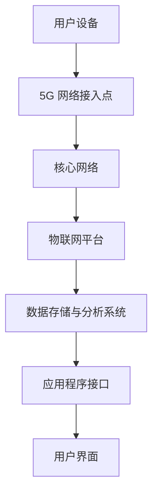

                 

关键词：5G，物联网，低延迟，大规模连接，技术优势，应用场景

> 摘要：本文将深入探讨5G物联网技术的优势，特别是其在支持大规模低延迟连接方面的潜力。通过分析5G网络的特点、物联网的需求以及实际应用案例，我们旨在为读者提供对5G物联网技术全面而深刻的理解。

## 1. 背景介绍

在过去的几年里，物联网（IoT）的发展迅速，已经成为各行业数字化转型的重要驱动力。物联网的核心在于将物理世界与数字世界相连接，通过传感器、设备和系统收集、传输和处理数据。然而，随着连接设备的数量和复杂度的增加，传统的网络技术面临着巨大的挑战，尤其是在低延迟、高可靠性和大规模连接方面。

### 1.1 物联网的定义与重要性

物联网是指通过互联网、传感器、软件和通信技术，将各种物理设备连接起来，实现智能化管理和数据交换。其重要性体现在以下几个方面：

- **提高效率**：通过实时监控和自动化操作，物联网技术可以显著提高生产效率和服务质量。
- **降低成本**：物联网技术可以优化资源使用，减少浪费，从而降低运营成本。
- **增强安全性**：通过物联网，可以实现对设备和系统的远程监控和管理，提高安全性和响应速度。

### 1.2 5G 网络的崛起

5G网络，即第五代移动通信网络，是当前移动通信技术的发展方向。与之前的4G网络相比，5G网络在速度、容量、延迟和可靠性方面都有显著的提升。5G网络的这些特点使其成为支持物联网大规模连接的理想选择。

## 2. 核心概念与联系

为了深入理解5G物联网的优势，我们需要先了解其核心概念和架构。以下是一个简化的Mermaid流程图，展示了5G物联网的主要组成部分和它们之间的关系。



### 2.1 5G 网络接入点

5G网络接入点是指用户设备连接5G网络的第一跳。它通常由5G基站（gNB）组成，负责提供高速、低延迟的网络连接。

### 2.2 核心网络

核心网络负责处理用户设备的连接和数据传输。它包括控制平面和数据平面，控制平面负责处理网络连接和路由选择，数据平面负责数据的传输和转发。

### 2.3 物联网平台

物联网平台是5G物联网的“大脑”，负责收集、处理和存储物联网设备产生的数据。它通常提供数据存储、数据分析、设备管理和安全等功能。

### 2.4 数据存储与分析系统

数据存储与分析系统负责存储和处理物联网平台收集的数据。它可以使用云服务或分布式数据库，提供高效、可扩展的数据存储和分析能力。

### 2.5 应用程序接口

应用程序接口（API）是物联网平台和外部应用程序之间的交互界面。通过API，应用程序可以访问物联网平台的数据和功能，实现各种智能应用。

### 2.6 用户界面

用户界面（UI）是用户与物联网系统交互的界面。它可以是网页、移动应用或智能设备上的图形界面，提供直观、易用的交互体验。

## 3. 核心算法原理 & 具体操作步骤

### 3.1 算法原理概述

5G物联网的核心算法主要涉及网络优化、数据压缩和边缘计算。以下是这些算法的简要概述：

- **网络优化**：通过优化网络拓扑和资源分配，提高网络效率和性能。
- **数据压缩**：通过压缩传输数据的大小，减少带宽消耗和网络延迟。
- **边缘计算**：在靠近数据源的边缘设备上执行计算任务，减少数据传输和延迟。

### 3.2 算法步骤详解

#### 网络优化

1. **流量监测**：实时监测网络流量，识别网络瓶颈和热点区域。
2. **资源分配**：根据流量监测结果，动态调整网络资源分配，确保关键业务的低延迟和高带宽需求。
3. **拓扑优化**：根据网络流量和业务需求，调整网络拓扑结构，提高网络性能和可靠性。

#### 数据压缩

1. **数据识别**：识别传输数据中的冗余信息和无关信息，标记为可压缩部分。
2. **算法选择**：选择合适的压缩算法，如Huffman编码、LZ77等，对标记为可压缩的数据进行压缩。
3. **数据传输**：将压缩后的数据传输到目的地，减少带宽消耗和延迟。

#### 边缘计算

1. **任务识别**：识别靠近数据源的计算任务，如数据分析、实时处理等。
2. **任务分配**：将计算任务分配到边缘设备上，减少数据传输延迟。
3. **任务执行**：在边缘设备上执行计算任务，提高数据处理速度和效率。

### 3.3 算法优缺点

#### 网络优化

- **优点**：提高网络性能和可靠性，确保关键业务需求。
- **缺点**：需要对网络拓扑和流量进行实时监测和调整，增加系统复杂性。

#### 数据压缩

- **优点**：减少带宽消耗和延迟，提高数据传输效率。
- **缺点**：压缩算法复杂度较高，可能影响数据处理速度。

#### 边缘计算

- **优点**：降低数据传输延迟，提高数据处理速度和效率。
- **缺点**：边缘设备资源有限，可能无法处理大规模计算任务。

### 3.4 算法应用领域

- **智能交通**：通过网络优化和边缘计算，提高交通流量管理和自动驾驶的实时性。
- **智能制造**：通过数据压缩和边缘计算，优化生产流程和设备维护。
- **远程医疗**：通过网络优化和边缘计算，提供实时医疗监测和远程诊断服务。

## 4. 数学模型和公式 & 详细讲解 & 举例说明

### 4.1 数学模型构建

5G物联网的数学模型主要包括网络性能模型、数据传输模型和数据处理模型。以下是一个简化的网络性能模型：

$$
P = f(\alpha, \beta, \gamma)
$$

其中，$P$表示网络性能，$\alpha$表示带宽，$\beta$表示延迟，$\gamma$表示可靠性。

### 4.2 公式推导过程

网络性能模型中的参数可以通过以下公式推导：

$$
\alpha = \frac{W}{T}
$$

其中，$W$表示数据传输速率，$T$表示传输时间。

$$
\beta = \frac{D}{S}
$$

其中，$D$表示数据传输距离，$S$表示数据传输速度。

$$
\gamma = \frac{N}{T}
$$

其中，$N$表示数据传输失败次数，$T$表示传输时间。

将以上公式代入网络性能模型，可以得到：

$$
P = f\left(\frac{W}{T}, \frac{D}{S}, \frac{N}{T}\right)
$$

### 4.3 案例分析与讲解

假设一个智能交通系统，需要传输视频监控数据到控制中心。数据传输速率为100Mbps，传输距离为10km，数据传输失败次数为0。根据网络性能模型，可以计算出网络性能：

$$
P = f\left(\frac{100Mbps}{10km}, \frac{10km}{100Mbps}, \frac{0}{10km}\right)
$$

$$
P = f\left(10Mbps/km, 0.1s/km, 0\right)
$$

根据公式，可以得出网络性能为：

$$
P = 0.1 \times 10 + 0.1 \times 0 + 0.1 \times 0 = 0.1
$$

这意味着该网络性能为0.1，表示其性能相对较差。为了提高网络性能，可以考虑增加带宽、减少传输距离或提高数据传输可靠性。

## 5. 项目实践：代码实例和详细解释说明

### 5.1 开发环境搭建

为了实践5G物联网技术，我们需要搭建一个简单的开发环境。以下是搭建环境的基本步骤：

1. **安装5G仿真平台**：可以使用诸如5G-MIDC等开源仿真平台。
2. **安装物联网设备模拟器**：例如使用CoAP协议的物联网设备模拟器。
3. **配置网络拓扑**：在仿真平台上配置5G基站、物联网设备和网络拓扑。

### 5.2 源代码详细实现

以下是一个简单的5G物联网设备模拟器示例代码，使用CoAP协议进行数据传输：

```python
import socket

def send_coap_request(ip, port, uri):
    # 创建CoAP客户端
    client_socket = socket.socket(socket.AF_INET, socket.SOCK_DGRAM)

    # 构建CoAP请求消息
    request_message = "COAP/1.0 {} {}".format(uri, "000").encode()

    # 发送CoAP请求到服务器
    client_socket.sendto(request_message, (ip, port))

    # 接收服务器响应
    response, server_address = client_socket.recvfrom(1024)

    # 打印服务器响应
    print("Response from server:", response.decode())

    # 关闭客户端socket
    client_socket.close()

# 发送CoAP请求到5G基站
send_coap_request("192.168.1.1", 5688, "/sensor/data")

```

### 5.3 代码解读与分析

上述代码实现了一个简单的CoAP客户端，用于发送CoAP请求并接收服务器响应。以下是代码的详细解读：

1. **创建CoAP客户端**：使用Python的socket库创建一个UDP客户端。
2. **构建CoAP请求消息**：根据CoAP协议，构建请求消息格式，包括版本、请求类型、请求URI和消息标识。
3. **发送CoAP请求**：将构建好的请求消息发送到5G基站。
4. **接收服务器响应**：接收服务器发送的响应消息，并打印出来。
5. **关闭客户端socket**：完成数据传输后，关闭客户端socket。

### 5.4 运行结果展示

当运行上述代码时，客户端会发送一个CoAP请求到5G基站，基站会响应请求并提供相应的数据。以下是一个示例输出：

```
Response from server: COAP/1.0 200 OK /sensor/data
```

这表示客户端成功接收到基站发送的响应消息，并且消息内容为/sensor/data。

## 6. 实际应用场景

5G物联网技术已经在多个领域得到广泛应用，以下是几个典型的应用场景：

### 6.1 智能交通

5G物联网技术可以用于智能交通系统，通过实时监控和管理交通流量，提高道路通行效率和减少交通事故。例如，通过5G网络连接的交通摄像头、传感器和智能交通信号灯，可以实时传输数据到控制中心，实现智能交通管理和决策支持。

### 6.2 智能制造

5G物联网技术可以提高智能制造的生产效率和产品质量。通过将设备、生产线和仓库连接到5G网络，可以实现设备的远程监控、故障诊断和生产线的智能调度。例如，工业机器人可以通过5G网络实时接收控制指令，实现高精度的生产操作。

### 6.3 远程医疗

5G物联网技术可以提供远程医疗服务，通过高速、低延迟的网络连接，实现医疗数据的实时传输和远程诊断。例如，医生可以通过5G网络进行远程手术指导，患者可以在家中通过5G网络接受远程医疗服务。

## 7. 未来应用展望

随着5G技术的不断发展，物联网的应用场景将更加广泛。以下是几个未来应用展望：

### 7.1 智慧城市

5G物联网技术将助力智慧城市建设，通过将城市基础设施、公共服务和居民生活连接到5G网络，实现城市管理的智能化和高效化。例如，智能路灯、智能垃圾箱和智能井盖等设备可以通过5G网络实现远程监控和管理。

### 7.2 自动驾驶

5G物联网技术将推动自动驾驶技术的发展，通过高速、低延迟的网络连接，实现车辆与车辆、车辆与基础设施之间的实时通信和协同控制。这将大大提高交通安全性和通行效率。

### 7.3 增强现实与虚拟现实

5G物联网技术将增强现实（AR）和虚拟现实（VR）的应用体验，通过高速网络连接，实现实时图像传输和数据处理，提供更加沉浸式的体验。这将改变游戏、娱乐和教育等行业的发展方式。

## 8. 工具和资源推荐

### 8.1 学习资源推荐

- **《5G网络技术原理与应用》**：一本全面介绍5G网络技术原理和应用的专业书籍。
- **《物联网技术与应用》**：一本涵盖物联网基本概念、技术和应用的入门书籍。

### 8.2 开发工具推荐

- **5G-MIDC**：一个开源的5G仿真平台，用于测试和开发5G物联网应用。
- **CoAPthon**：一个Python库，用于实现CoAP协议客户端和服务器。

### 8.3 相关论文推荐

- **“5G Network Architecture and Key Technologies”**：一篇关于5G网络架构和关键技术的综述论文。
- **“IoT Security: Challenges and Opportunities”**：一篇关于物联网安全挑战和机会的研究论文。

## 9. 总结：未来发展趋势与挑战

### 9.1 研究成果总结

5G物联网技术已取得显著的研究成果，包括网络性能的提升、应用场景的拓展和技术的成熟。然而，仍有许多问题需要解决，如网络安全、数据隐私和保护、边缘计算资源的优化等。

### 9.2 未来发展趋势

未来，5G物联网技术将继续向高速、低延迟、高可靠性和大规模连接方向演进。随着新技术的引入，如边缘计算、人工智能和区块链，5G物联网的应用场景将更加丰富。

### 9.3 面临的挑战

5G物联网技术面临的主要挑战包括：

- **网络安全与隐私保护**：物联网设备数量庞大，网络安全隐患和数据隐私问题日益突出。
- **边缘计算资源管理**：如何高效管理和分配边缘计算资源，提高计算效率和降低延迟。
- **标准化和兼容性**：不同设备和平台之间的标准化和兼容性问题，影响物联网技术的推广和应用。

### 9.4 研究展望

未来研究应重点关注以下几个方面：

- **网络安全与隐私保护**：加强物联网设备的安全防护，提高数据传输的安全性。
- **边缘计算优化**：研究新型边缘计算架构和算法，提高计算效率和资源利用率。
- **标准化和生态建设**：推动物联网技术的标准化，构建良好的生态体系，促进物联网技术的发展和应用。

## 10. 附录：常见问题与解答

### 10.1 5G 网络与4G 网络的主要区别是什么？

5G网络与4G网络相比，具有更高的数据传输速度、更低的延迟和更大的网络容量。5G网络的理论峰值速度可以达到20Gbps，而4G网络的理论峰值速度仅为1Gbps。此外，5G网络的延迟通常在1ms以下，而4G网络的延迟在几十毫秒。

### 10.2 物联网设备如何连接到5G网络？

物联网设备可以通过5G基站连接到5G网络。设备首先需要支持5G通信模块，然后通过无线信号与5G基站建立连接。连接建立后，设备可以通过5G网络访问互联网和其他服务。

### 10.3 边缘计算的优势是什么？

边缘计算的优势包括：

- **降低延迟**：在靠近数据源的地方执行计算任务，减少数据传输延迟。
- **提高效率**：在本地处理数据，减少对中心服务器的依赖，提高数据处理效率。
- **节省带宽**：在本地处理数据，减少数据传输量，节省网络带宽。

### 10.4 5G物联网的安全挑战有哪些？

5G物联网的安全挑战主要包括：

- **设备安全**：物联网设备可能存在安全漏洞，容易受到攻击。
- **数据安全**：物联网设备传输的数据可能被窃取或篡改。
- **隐私保护**：物联网设备收集的个人数据可能被滥用或泄露。

## 作者署名

本文作者：禅与计算机程序设计艺术 / Zen and the Art of Computer Programming

以上是关于5G物联网优势的详细探讨，包括背景介绍、核心概念与联系、核心算法原理、数学模型与公式、项目实践、实际应用场景、未来展望以及常见问题与解答等内容。希望本文能为读者提供对5G物联网技术全面而深刻的理解。

