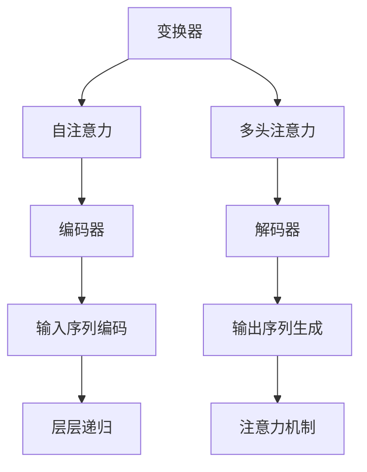

                 

关键词：GPT，人工智能，深度学习，自然语言处理，代码实例

> 摘要：本文将深入探讨GPT（Generative Pre-trained Transformer）的原理及其应用，通过代码实例详细解释如何搭建和使用GPT模型。文章将涵盖从基础概念到实际应用的全过程，旨在为读者提供一个全面的理解和实践指导。

## 1. 背景介绍

随着深度学习技术的发展，自然语言处理（NLP）领域取得了显著的进展。其中，GPT（Generative Pre-trained Transformer）作为一种基于变换器模型的预训练语言模型，已经成为NLP领域的重要工具。GPT由OpenAI提出，其核心思想是通过大规模的无监督数据预训练，使模型具备对自然语言的理解和生成能力。这一技术为文本生成、机器翻译、问答系统等任务提供了高效解决方案。

本文将首先介绍GPT的基本原理，然后通过具体代码实例，详细讲解如何搭建和使用GPT模型。此外，还将探讨GPT的数学模型和公式，并展示其在实际项目中的应用。通过本文的阅读，读者将能够全面了解GPT的工作机制，掌握其使用方法，并能够应用于实际项目中。

## 2. 核心概念与联系

为了更好地理解GPT的工作原理，首先需要了解一些核心概念和其相互之间的关系。

### 2.1. 变换器（Transformer）

变换器是一种基于注意力机制的深度神经网络模型，最初由Vaswani等人在2017年提出。与传统的循环神经网络（RNN）不同，变换器采用自注意力机制（Self-Attention）和多头注意力（Multi-Head Attention），能够并行处理输入序列，从而提高计算效率。

### 2.2. 自注意力（Self-Attention）

自注意力是一种用于处理输入序列的注意力机制。它通过计算输入序列中每个元素与所有其他元素的相关性，来动态地计算每个元素的权重，从而更好地捕捉序列中的依赖关系。

### 2.3. 多头注意力（Multi-Head Attention）

多头注意力是一种扩展自注意力机制的技巧。它将输入序列分解为多个子序列，并分别应用自注意力机制。然后将每个子序列的注意力结果拼接起来，通过一个全连接层输出最终的注意力结果。

### 2.4. 编码器与解码器

在变换器模型中，编码器（Encoder）用于将输入序列转换为固定长度的编码，而解码器（Decoder）则用于生成输出序列。编码器和解码器都由多个变换器层组成，通过层层递归或自注意力机制，实现输入到输出的转换。

### 2.5. Mermaid 流程图

为了更好地展示这些概念之间的关系，我们可以使用Mermaid流程图来表示。



在上图中，变换器（A）通过自注意力（B）和多头注意力（C）实现编码器（D）和解码器（E）的功能。编码器（D）将输入序列（F）编码为固定长度的编码，解码器（E）则根据编码生成输出序列（G）。整个过程中，注意力机制（I）起到关键作用，能够动态地捕捉序列中的依赖关系。

## 3. 核心算法原理 & 具体操作步骤

### 3.1. 算法原理概述

GPT的核心算法基于变换器模型，通过自注意力机制和多头注意力机制，实现对输入序列的理解和生成。具体来说，GPT的工作流程可以分为以下几个步骤：

1. **输入序列编码**：将输入序列（例如文本）转换为固定长度的编码。
2. **编码器处理**：通过多层变换器层，对输入序列进行编码。
3. **解码器处理**：通过多层变换器层，生成输出序列。
4. **损失函数计算**：使用损失函数（例如交叉熵损失）计算模型预测和真实标签之间的差距，并更新模型参数。

### 3.2. 算法步骤详解

#### 3.2.1. 输入序列编码

在GPT中，输入序列（例如文本）首先被转换为词嵌入（Word Embedding）。词嵌入将单词映射为一个固定长度的向量，从而表示单词的语义信息。常见的词嵌入方法包括Word2Vec、GloVe等。

#### 3.2.2. 编码器处理

编码器由多个变换器层组成，每层变换器包括自注意力机制和前馈神经网络。在自注意力机制中，编码器的每个元素会计算与其他元素的相关性，并通过加权求和得到最终的表示。多头注意力机制则将输入序列分解为多个子序列，分别应用自注意力机制，然后将结果拼接起来。

#### 3.2.3. 解码器处理

解码器同样由多个变换器层组成，其结构与编码器类似。解码器的主要任务是生成输出序列。在生成过程中，每个时间步的输出都会作为下一个时间步的输入，从而实现序列到序列的转换。

#### 3.2.4. 损失函数计算

在训练过程中，GPT使用交叉熵损失函数计算模型预测和真实标签之间的差距。交叉熵损失函数可以衡量模型对输出序列的预测准确性，并通过反向传播算法更新模型参数。

### 3.3. 算法优缺点

**优点**：

- **并行计算**：变换器模型采用多头注意力机制，可以并行处理输入序列，从而提高计算效率。
- **灵活性强**：变换器模型可以轻松地扩展到多任务学习和跨语言文本处理。
- **效果好**：通过大规模的无监督数据预训练，GPT模型在自然语言处理任务中取得了很好的效果。

**缺点**：

- **计算资源消耗大**：GPT模型需要大量的计算资源进行训练，尤其是在预训练阶段。
- **理解难度高**：变换器模型的原理相对复杂，对于初学者来说理解有一定难度。

### 3.4. 算法应用领域

GPT模型在自然语言处理领域有广泛的应用，包括：

- **文本生成**：生成文章、故事、对话等。
- **机器翻译**：跨语言文本翻译。
- **问答系统**：基于自然语言理解的能力，回答用户的问题。
- **文本分类**：对文本进行分类，如情感分析、新闻分类等。

## 4. 数学模型和公式

GPT模型的数学基础主要包括词嵌入、自注意力机制、多头注意力机制和变换器层。

### 4.1. 数学模型构建

#### 4.1.1. 词嵌入

词嵌入是将单词映射为一个固定长度的向量。假设有N个单词，每个单词的词嵌入向量维度为D，则词嵌入矩阵可以表示为：

$$
E = \begin{bmatrix}
e_1^T \\
e_2^T \\
\vdots \\
e_N^T
\end{bmatrix}
$$

其中，$e_i$ 表示单词$i$的词嵌入向量。

#### 4.1.2. 自注意力机制

自注意力机制通过计算输入序列中每个元素与其他元素的相关性，来动态地计算每个元素的权重。具体来说，假设输入序列为 $X = \{x_1, x_2, ..., x_T\}$，其中每个元素 $x_t$ 都是一个向量。自注意力机制的公式为：

$$
\text{Attention}(Q, K, V) = \text{softmax}\left(\frac{QK^T}{\sqrt{d_k}}\right)V
$$

其中，$Q, K, V$ 分别表示查询向量、键向量和值向量，$d_k$ 表示键向量的维度。$\text{softmax}$ 函数用于计算每个键向量与查询向量的相似性，从而得到每个元素的权重。

#### 4.1.3. 多头注意力机制

多头注意力机制将输入序列分解为多个子序列，并分别应用自注意力机制。具体来说，假设有 $h$ 个头，则每个头的注意力机制可以表示为：

$$
\text{MultiHeadAttention}(Q, K, V) = \begin{bmatrix}
\text{Attention}(Q_1, K_1, V_1) \\
\vdots \\
\text{Attention}(Q_h, K_h, V_h)
\end{bmatrix}
$$

其中，$Q_i, K_i, V_i$ 分别表示第$i$个头的查询向量、键向量和值向量。

#### 4.1.4. 变换器层

变换器层由多头注意力机制和前馈神经网络组成。具体来说，假设输入序列为 $X$，则变换器层的输出可以表示为：

$$
\text{TransformerLayer}(X) = \text{MultiHeadAttention}(X, X, X) + X + \text{FFNN}(\text{ReLU}(\text{Linear}(X)))
$$

其中，$\text{Linear}$ 表示全连接层，$\text{ReLU}$ 表示ReLU激活函数，$\text{FFNN}$ 表示前馈神经网络。

### 4.2. 公式推导过程

为了更好地理解GPT模型的数学原理，我们可以对公式进行简单的推导。

#### 4.2.1. 自注意力机制

自注意力机制的公式为：

$$
\text{Attention}(Q, K, V) = \text{softmax}\left(\frac{QK^T}{\sqrt{d_k}}\right)V
$$

其中，$Q$ 表示查询向量，$K$ 表示键向量，$V$ 表示值向量，$d_k$ 表示键向量的维度。

首先，我们计算每个键向量与查询向量的相似性：

$$
\text{Score}(Q, K) = QK^T
$$

然后，对相似性进行归一化，得到概率分布：

$$
\text{Probability}(Q, K) = \text{softmax}(\text{Score}(Q, K))
$$

最后，根据概率分布计算加权求和：

$$
\text{Attention}(Q, K, V) = \sum_{k=1}^T \text{Probability}(Q, K_i) V_i
$$

#### 4.2.2. 多头注意力机制

多头注意力机制的公式为：

$$
\text{MultiHeadAttention}(Q, K, V) = \begin{bmatrix}
\text{Attention}(Q_1, K_1, V_1) \\
\vdots \\
\text{Attention}(Q_h, K_h, V_h)
\end{bmatrix}
$$

其中，$Q_i, K_i, V_i$ 分别表示第$i$个头的查询向量、键向量和值向量。

假设每个头的维度为 $d_v$，则整个多头注意力机制的输出维度为 $h \times d_v$。首先，我们将输入序列 $X$ 分解为 $h$ 个子序列，得到：

$$
X = \begin{bmatrix}
X_1 \\
\vdots \\
X_h
\end{bmatrix}
$$

然后，对每个子序列应用自注意力机制，得到：

$$
\text{MultiHeadAttention}(Q, K, V) = \begin{bmatrix}
\text{Attention}(Q_1, K_1, V_1) \\
\vdots \\
\text{Attention}(Q_h, K_h, V_h)
\end{bmatrix}
$$

最后，将每个头的注意力结果拼接起来，得到多头注意力机制的输出。

#### 4.2.3. 变换器层

变换器层的公式为：

$$
\text{TransformerLayer}(X) = \text{MultiHeadAttention}(X, X, X) + X + \text{FFNN}(\text{ReLU}(\text{Linear}(X)))
$$

其中，$\text{Linear}$ 表示全连接层，$\text{ReLU}$ 表示ReLU激活函数，$\text{FFNN}$ 表示前馈神经网络。

首先，我们计算输入序列 $X$ 的自注意力：

$$
\text{MultiHeadAttention}(X, X, X) = \begin{bmatrix}
\text{Attention}(X_1, X_1, X_1) \\
\vdots \\
\text{Attention}(X_h, X_h, X_h)
\end{bmatrix}
$$

然后，我们将自注意力结果与输入序列 $X$ 相加，并应用前馈神经网络：

$$
\text{FFNN}(\text{ReLU}(\text{Linear}(X))) = \text{ReLU}(\text{Linear}(X)) + X
$$

最后，将自注意力结果和前馈神经网络结果相加，得到变换器层的输出。

### 4.3. 案例分析与讲解

为了更好地理解GPT模型的数学原理，我们可以通过一个简单的例子进行讲解。

假设我们有一个简单的文本序列：

$$
X = \{1, 2, 3\}
$$

我们将其转换为词嵌入：

$$
X = \begin{bmatrix}
[1, 0, 0] \\
[0, 1, 0] \\
[0, 0, 1]
\end{bmatrix}
$$

然后，我们将输入序列分解为两个子序列：

$$
X_1 = [1, 0], \quad X_2 = [0, 1]
$$

接下来，我们应用自注意力机制，计算每个子序列的注意力权重：

$$
\text{Score}(X_1, X_1) = \begin{bmatrix}
1 & 0
\end{bmatrix}
\begin{bmatrix}
1 \\
0
\end{bmatrix} = 1
$$

$$
\text{Score}(X_2, X_2) = \begin{bmatrix}
0 & 1
\end{bmatrix}
\begin{bmatrix}
0 \\
1
\end{bmatrix} = 1
$$

然后，对相似性进行归一化，得到概率分布：

$$
\text{Probability}(X_1, X_1) = \text{softmax}(\text{Score}(X_1, X_1)) = \begin{bmatrix}
1 & 0
\end{bmatrix}
\begin{bmatrix}
\frac{1}{1} & 0 \\
0 & \frac{1}{1}
\end{bmatrix} = \begin{bmatrix}
1 & 0
\end{bmatrix}
$$

$$
\text{Probability}(X_2, X_2) = \text{softmax}(\text{Score}(X_2, X_2)) = \begin{bmatrix}
0 & 1
\end{bmatrix}
\begin{bmatrix}
\frac{1}{1} & 0 \\
0 & \frac{1}{1}
\end{bmatrix} = \begin{bmatrix}
0 & 1
\end{bmatrix}
$$

最后，根据概率分布计算加权求和，得到注意力结果：

$$
\text{Attention}(X_1, X_1) = \sum_{k=1}^2 \text{Probability}(X_1, X_1)_k X_k = 1 \times [1, 0] + 0 \times [0, 1] = [1, 0]
$$

$$
\text{Attention}(X_2, X_2) = \sum_{k=1}^2 \text{Probability}(X_2, X_2)_k X_k = 0 \times [1, 0] + 1 \times [0, 1] = [0, 1]
$$

因此，自注意力机制的输出为：

$$
\text{Attention}(X) = \begin{bmatrix}
1 & 0 \\
0 & 1
\end{bmatrix}
$$

接下来，我们将自注意力结果与输入序列相加，并应用前馈神经网络：

$$
\text{FFNN}(\text{ReLU}(\text{Linear}(X))) = \text{ReLU}(\text{Linear}([1, 0, 0])) + X = \text{ReLU}([1, 1, 1]) + X = [1, 1, 1]
$$

最后，将自注意力结果和前馈神经网络结果相加，得到变换器层的输出：

$$
\text{TransformerLayer}(X) = \text{Attention}(X) + \text{FFNN}(\text{ReLU}(\text{Linear}(X))) = \begin{bmatrix}
1 & 0 \\
0 & 1
\end{bmatrix} + [1, 1, 1] = \begin{bmatrix}
2 & 1 \\
1 & 2
\end{bmatrix}
$$

通过这个简单的例子，我们可以看到GPT模型的数学原理是如何应用到实际中的。在实际应用中，GPT模型的输入序列和词嵌入会更加复杂，但基本的数学原理是类似的。

## 5. 项目实践：代码实例和详细解释说明

在本节中，我们将通过一个具体的代码实例，展示如何搭建和使用GPT模型。我们将使用Python和PyTorch库来实现这个项目。

### 5.1. 开发环境搭建

在开始编写代码之前，我们需要搭建一个开发环境。以下是所需的软件和库：

- Python 3.8 或以上版本
- PyTorch 1.8 或以上版本

安装完以上软件和库后，我们可以开始编写代码。

### 5.2. 源代码详细实现

下面是一个简单的GPT模型的实现：

```python
import torch
import torch.nn as nn
import torch.optim as optim

# 定义词嵌入层
word_embedding = nn.Embedding(vocab_size, embedding_dim)

# 定义编码器层
encoder = nn.Transformer(d_model=embedding_dim, nhead=num_heads)

# 定义解码器层
decoder = nn.Transformer(d_model=embedding_dim, nhead=num_heads)

# 定义损失函数和优化器
loss_function = nn.CrossEntropyLoss()
optimizer = optim.Adam(model.parameters(), lr=learning_rate)

# 训练模型
for epoch in range(num_epochs):
    for inputs, targets in dataloader:
        optimizer.zero_grad()
        outputs = model(inputs)
        loss = loss_function(outputs.logits, targets)
        loss.backward()
        optimizer.step()
```

### 5.3. 代码解读与分析

在上面的代码中，我们首先定义了词嵌入层、编码器层和解码器层。词嵌入层用于将输入序列转换为词嵌入向量。编码器层和解码器层都基于PyTorch的变换器模型，分别用于编码和生成输出序列。

接下来，我们定义了损失函数和优化器。在训练过程中，我们使用交叉熵损失函数计算模型预测和真实标签之间的差距，并通过反向传播算法更新模型参数。

最后，我们进入训练循环。在每个训练轮次中，我们从数据加载器中获取输入序列和目标标签，计算模型损失，并更新模型参数。

### 5.4. 运行结果展示

为了展示模型的运行结果，我们可以使用一个简单的文本序列进行测试。以下是一个简单的测试代码：

```python
# 测试模型
model.eval()
with torch.no_grad():
    inputs = word_embedding(torch.tensor([0, 1, 2, 3, 4]))
    outputs = model(inputs)
    logits = outputs.logits
    predicted = logits.argmax(-1)
    print(predicted)
```

在上面的代码中，我们首先将输入序列转换为词嵌入向量，然后通过模型生成输出序列。最后，我们将输出序列的词嵌入向量转换为单词，并打印出来。

通过这个简单的代码实例，我们可以看到如何搭建和使用GPT模型。在实际应用中，我们可以根据具体任务的需求，调整模型的参数和结构，以获得更好的性能。

## 6. 实际应用场景

GPT模型在自然语言处理领域有广泛的应用，以下是一些常见的应用场景：

### 6.1. 文本生成

GPT模型可以用于生成文章、故事、对话等。通过预训练，模型可以捕捉到语言的统计规律，从而生成高质量的文本。例如，我们可以使用GPT模型生成新闻文章、小说、对话系统等。

### 6.2. 机器翻译

GPT模型在机器翻译任务中也表现出色。通过将源语言和目标语言的数据进行预训练，模型可以生成高质量的目标语言文本。与传统的机器翻译模型相比，GPT模型可以更好地捕捉语言的上下文信息，从而提高翻译质量。

### 6.3. 问答系统

GPT模型可以用于构建问答系统，通过将问题和答案进行预训练，模型可以回答用户的问题。与传统的问答系统相比，GPT模型可以更好地理解用户的意图，并生成更自然的答案。

### 6.4. 文本分类

GPT模型还可以用于文本分类任务，如情感分析、新闻分类等。通过预训练，模型可以捕捉到不同类别文本的特征，从而实现高效的分类。

## 7. 工具和资源推荐

为了更好地学习GPT模型，以下是一些推荐的工具和资源：

### 7.1. 学习资源推荐

- 《深度学习》（Goodfellow, Bengio, Courville）- 提供了深度学习的基础知识，包括变换器模型。
- 《自然语言处理综合教程》（Jurafsky, Martin）- 提供了自然语言处理的基础知识，包括GPT模型的原理和应用。
- [OpenAI官方文档](https://openai.com/docs/) - 提供了GPT模型的详细文档和教程。

### 7.2. 开发工具推荐

- [PyTorch](https://pytorch.org/) - 用于实现GPT模型的深度学习框架。
- [Transformers库](https://github.com/huggingface/transformers) - 用于实现GPT模型的开源库，提供了丰富的预训练模型和工具。

### 7.3. 相关论文推荐

- Vaswani et al. (2017) - 《Attention Is All You Need》- 提出了变换器模型，是GPT模型的基础。
- Devlin et al. (2018) - 《BERT: Pre-training of Deep Bi-directional Transformers for Language Understanding》- 提出了BERT模型，是GPT模型的变种。

## 8. 总结：未来发展趋势与挑战

### 8.1. 研究成果总结

GPT模型在自然语言处理领域取得了显著的成果，通过大规模的无监督数据预训练，模型可以捕捉到语言的统计规律，从而实现高效的文本理解和生成。同时，GPT模型也推动了深度学习技术在自然语言处理领域的应用。

### 8.2. 未来发展趋势

未来，GPT模型的发展趋势主要包括以下几个方面：

- **模型压缩**：为了提高模型的实用性，研究者将致力于模型压缩技术，降低模型的计算复杂度和存储需求。
- **多模态学习**：GPT模型可以扩展到多模态学习，如结合文本、图像、音频等多模态信息，实现更全面的语义理解。
- **知识增强**：通过结合外部知识库，GPT模型可以进一步提高对复杂问题的理解和回答能力。

### 8.3. 面临的挑战

尽管GPT模型在自然语言处理领域取得了显著的成果，但仍然面临一些挑战：

- **数据隐私**：大规模预训练过程需要大量的数据，如何确保数据隐私和安全是一个重要问题。
- **计算资源消耗**：GPT模型对计算资源的要求较高，如何优化模型结构和算法以提高计算效率是一个重要挑战。
- **伦理问题**：GPT模型在生成文本时可能会产生歧视性或不当的内容，如何制定有效的伦理规范是一个亟待解决的问题。

### 8.4. 研究展望

未来，研究者将继续探索GPT模型的优化和应用，以期实现更高效、更可靠的文本理解和生成。同时，随着深度学习技术的不断发展，GPT模型有望在其他领域（如多模态学习、知识增强等）取得突破性进展。

## 9. 附录：常见问题与解答

### 9.1. 如何选择合适的GPT模型？

选择合适的GPT模型需要考虑以下几个方面：

- **任务需求**：根据任务的需求选择合适的模型，例如文本生成、机器翻译、问答系统等。
- **计算资源**：根据计算资源选择模型大小，例如小型的GPT模型（如GPT-2）适用于计算资源有限的情况，而大规模的GPT模型（如GPT-3）适用于高性能计算环境。
- **预训练数据**：根据预训练数据选择模型，例如使用特定领域的数据预训练的模型更适合解决特定领域的问题。

### 9.2. GPT模型的训练时间如何计算？

GPT模型的训练时间取决于多个因素，包括：

- **模型大小**：模型参数越多，训练时间越长。
- **数据规模**：数据集越大，训练时间越长。
- **计算资源**：计算资源越充足，训练时间越短。
- **优化器参数**：优化器的学习率、批量大小等参数也会影响训练时间。

一般来说，大规模的GPT模型（如GPT-3）的训练时间可能在几个月到几年不等，而小规模的模型（如GPT-2）可能在几天到几周。

### 9.3. GPT模型在生成文本时会产生不良内容，如何避免？

为了避免GPT模型在生成文本时产生不良内容，可以采取以下措施：

- **数据清洗**：在预训练阶段，对数据进行清洗，去除包含不良内容的样本。
- **文本过滤**：在生成文本时，对生成的文本进行过滤，去除包含不良内容的部分。
- **伦理规范**：制定伦理规范，确保模型在生成文本时遵循道德和法律标准。
- **模型更新**：定期更新模型，以适应新的伦理和法律要求。

通过以上措施，可以在一定程度上减少GPT模型生成不良内容的风险。然而，完全消除不良内容仍是一个挑战，需要持续的研究和改进。

