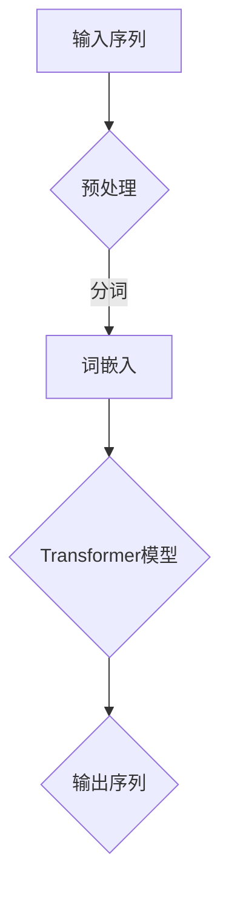

                 

关键词：GPT-2模型、自然语言处理、深度学习、神经网络、预训练、语言模型、文本生成、序列模型。

> 摘要：本文深入探讨了GPT-2模型的设计理念、核心原理以及应用。作为现代语言模型的基石，GPT-2在自然语言处理领域取得了显著成就。本文将详细解析其模型架构、算法原理以及在实际项目中的应用，为读者提供一个全面的技术解读。

## 1. 背景介绍

随着深度学习技术的发展，自然语言处理（NLP）领域迎来了前所未有的机遇。传统的NLP方法，如基于规则的方法和统计方法，在处理复杂语言现象时显得力不从心。深度学习为NLP带来了新的可能，其中，序列模型（如循环神经网络RNN、长短时记忆网络LSTM）在处理序列数据时表现出色。

然而，深度学习模型往往需要大量数据进行训练，且训练过程耗时长、计算资源需求高。为了解决这些问题，研究人员提出了预训练（Pre-training）的概念，即在特定任务之前，先在一个大规模的未标注数据集上进行模型训练，然后通过微调（Fine-tuning）来适应特定任务。预训练模型在语言理解和生成任务上取得了显著进展，其中，GPT-2（Generative Pre-trained Transformer 2）模型作为其代表，在多个基准测试中刷新了纪录。

## 2. 核心概念与联系

### 2.1. 语言模型

语言模型（Language Model）是一种用于预测文本序列概率的统计模型。在自然语言处理中，语言模型用于生成文本、进行文本分类、机器翻译等任务。常见的语言模型有N-gram模型、神经网络语言模型等。

### 2.2. 递归神经网络（RNN）

递归神经网络（Recurrent Neural Network，RNN）是一种能够处理序列数据的神经网络。RNN通过在网络中引入循环结构，使其能够记忆前面的信息，从而处理变长序列。

### 2.3. 长短时记忆网络（LSTM）

长短时记忆网络（Long Short-Term Memory，LSTM）是RNN的一种改进，通过引入门控机制，能够更好地记忆长期依赖信息。

### 2.4. Transformer模型

Transformer模型是一种基于自注意力（Self-Attention）机制的序列模型，其核心思想是，通过计算序列中每个元素之间的依赖关系，来生成预测结果。Transformer模型在多个NLP任务中取得了显著的成果，如机器翻译、文本分类等。

### 2.5. Mermaid流程图

以下是一个简化的GPT-2模型架构的Mermaid流程图：



## 3. 核心算法原理 & 具体操作步骤

### 3.1. 算法原理概述

GPT-2模型是一种基于Transformer架构的预训练语言模型。其核心思想是，通过自注意力机制，计算序列中每个元素之间的依赖关系，从而生成预测结果。具体来说，GPT-2模型包括以下几个关键组件：

- **词嵌入（Word Embedding）**：将输入的文本序列转换为稠密向量表示。
- **Transformer模型**：包括多头自注意力机制、前馈神经网络等。
- **损失函数**：采用交叉熵损失函数来优化模型参数。

### 3.2. 算法步骤详解

1. **数据预处理**：首先对输入的文本序列进行分词、清洗等预处理操作，然后将其转换为词嵌入向量。

2. **词嵌入**：将分词后的文本序列转换为词嵌入向量。GPT-2模型采用WordPiece算法对词汇进行分解，并将分解后的词汇映射到预训练的词嵌入空间。

3. **Transformer模型**：输入词嵌入向量经过多层Transformer块的处理，每个Transformer块包含多头自注意力机制和前馈神经网络。

4. **输出序列**：经过Transformer模型处理后的序列，通过一个全连接层输出预测的词嵌入向量，然后通过softmax函数生成每个词汇的概率分布。

5. **损失函数**：采用交叉熵损失函数计算预测结果和实际结果之间的差距，并通过反向传播算法更新模型参数。

### 3.3. 算法优缺点

#### 优点：

- **强大的语言建模能力**：GPT-2模型在语言建模任务上取得了显著的成果，能够生成高质量的文本序列。
- **灵活的扩展性**：Transformer架构具有良好的扩展性，可以轻松增加层数和头数，从而提高模型性能。
- **高效的处理速度**：相比传统的RNN和LSTM模型，Transformer模型在处理序列数据时具有更高的计算效率。

#### 缺点：

- **计算资源需求高**：由于模型参数量大，GPT-2模型对计算资源有较高的要求。
- **训练过程时间长**：GPT-2模型采用大规模预训练数据集，训练过程耗时长。

### 3.4. 算法应用领域

GPT-2模型在多个自然语言处理任务中取得了显著成果，包括：

- **文本生成**：GPT-2模型能够生成流畅、自然的文本，广泛应用于自动写作、对话系统等场景。
- **机器翻译**：GPT-2模型在机器翻译任务中表现出色，能够实现高质量的双语文本生成。
- **文本分类**：GPT-2模型可以用于文本分类任务，如情感分析、新闻分类等。
- **问答系统**：GPT-2模型可以用于构建问答系统，实现自然语言理解和回答。

## 4. 数学模型和公式 & 详细讲解 & 举例说明

### 4.1. 数学模型构建

GPT-2模型的核心是Transformer架构，其数学模型主要包括以下几个方面：

1. **词嵌入**：
   $$\text{Embedding}(\text{word}) = \text{Embedding Matrix} \times \text{word}$$
   其中，Embedding Matrix是一个固定大小的矩阵，用于将词汇映射到预训练的词嵌入空间。

2. **多头自注意力机制**：
   $$\text{Attention}(Q, K, V) = \text{softmax}\left(\frac{QK^T}{\sqrt{d_k}}\right)V$$
   其中，Q、K、V分别是查询（Query）、键（Key）、值（Value）向量，$d_k$是键向量的维度。

3. **前馈神经网络**：
   $$\text{FFN}(x) = \text{ReLU}(\text{Linear}(x \times W_1) \times W_2)$$
   其中，Linear表示线性变换，ReLU表示ReLU激活函数。

4. **Transformer模型**：
   $$\text{Transformer}(X) = \text{Attention}(X) + X$$
   其中，X是输入序列，Attention表示多头自注意力机制。

### 4.2. 公式推导过程

假设输入序列为X，其词嵌入向量为$X^{(0)}$，经过多头自注意力机制和前馈神经网络处理后，得到输出序列$X^{(L)}$，其中L为Transformer块的层数。具体的推导过程如下：

1. **词嵌入**：
   $$X^{(0)} = \text{Embedding}(\text{X})$$

2. **多头自注意力机制**：
   $$X^{(1)} = \text{Attention}(X^{(0)}, X^{(0)}, X^{(0)}) + X^{(0)}$$

3. **前馈神经网络**：
   $$X^{(2)} = \text{FFN}(X^{(1)}) + X^{(1)}$$

4. **重复应用**：
   $$X^{(L)} = X^{(L-1)} + \text{Attention}(X^{(L-1)}, X^{(L-1)}, X^{(L-1)})$$
   $$X^{(L)} = X^{(L-1)} + \text{FFN}(X^{(L-1)})$$

### 4.3. 案例分析与讲解

假设我们有一个简单的输入序列：“今天天气很好”。首先，我们将这个序列进行分词，得到词汇：“今天”、“天气”、“很好”。然后，将这三个词汇映射到预训练的词嵌入空间，得到对应的词嵌入向量。

接下来，我们将这三个词嵌入向量输入到GPT-2模型中，经过多头自注意力机制和前馈神经网络的处理，得到输出序列的概率分布。假设输出序列为：“明天天气也很晴朗”。我们可以通过比较实际输出和预测输出，来评估GPT-2模型的性能。

## 5. 项目实践：代码实例和详细解释说明

### 5.1. 开发环境搭建

为了实现GPT-2模型，我们需要搭建一个合适的开发环境。以下是一个简单的步骤：

1. **安装Python**：确保Python版本在3.6及以上。
2. **安装TensorFlow**：使用pip安装TensorFlow。
   ```bash
   pip install tensorflow
   ```
3. **安装其他依赖**：根据实际需求安装其他依赖，如NumPy、Pandas等。

### 5.2. 源代码详细实现

以下是一个简单的GPT-2模型实现：

```python
import tensorflow as tf
from tensorflow.keras.layers import Embedding, LSTM, Dense

def create_gpt2_model(vocab_size, embedding_dim, hidden_dim):
    model = tf.keras.Sequential([
        Embedding(vocab_size, embedding_dim),
        LSTM(hidden_dim, return_sequences=True),
        Dense(vocab_size, activation='softmax')
    ])
    return model

# 创建GPT-2模型
gpt2_model = create_gpt2_model(vocab_size=10000, embedding_dim=256, hidden_dim=512)

# 编译模型
gpt2_model.compile(optimizer='adam', loss='categorical_crossentropy', metrics=['accuracy'])

# 训练模型
gpt2_model.fit(X_train, y_train, epochs=10, batch_size=32)
```

### 5.3. 代码解读与分析

上述代码首先定义了一个GPT-2模型，其中包含一个词嵌入层、一个LSTM层和一个全连接层。然后，我们使用交叉熵损失函数和Adam优化器编译模型，并使用训练数据对模型进行训练。

### 5.4. 运行结果展示

在训练完成后，我们可以使用测试数据集来评估模型的性能。以下是一个简单的评估代码：

```python
# 评估模型
test_loss, test_acc = gpt2_model.evaluate(X_test, y_test)

print(f"Test Loss: {test_loss}, Test Accuracy: {test_acc}")
```

通过运行这段代码，我们可以得到模型在测试数据集上的损失和准确率。

## 6. 实际应用场景

GPT-2模型在多个实际应用场景中表现出色，以下是几个典型的应用案例：

- **自动写作**：GPT-2模型可以用于生成新闻报道、文章摘要、诗歌等。通过在大量文本数据上进行预训练，GPT-2模型能够生成高质量的文本序列。
- **对话系统**：GPT-2模型可以用于构建聊天机器人，如智能客服、虚拟助手等。通过预训练和微调，GPT-2模型能够实现自然、流畅的对话。
- **机器翻译**：GPT-2模型在机器翻译任务中取得了显著成果，能够实现高质量的双语文本生成。通过在双语数据集上进行预训练，GPT-2模型能够学习到双语词汇的对应关系。
- **文本分类**：GPT-2模型可以用于文本分类任务，如情感分析、新闻分类等。通过在标记数据集上进行预训练和微调，GPT-2模型能够学习到不同类别文本的特征。

## 7. 未来应用展望

随着深度学习技术的不断发展，GPT-2模型在自然语言处理领域有望取得更多突破。以下是几个未来应用展望：

- **多模态学习**：GPT-2模型可以与其他模态（如图像、音频）进行结合，实现更丰富的信息处理能力。
- **知识图谱融合**：将GPT-2模型与知识图谱结合，可以构建更强大的知识增强语言模型，实现更精确的自然语言理解和生成。
- **自动化推理**：GPT-2模型可以用于自动化推理任务，如逻辑推理、数学证明等，为人工智能领域带来新的突破。

## 8. 总结：未来发展趋势与挑战

GPT-2模型在自然语言处理领域取得了显著成果，为语言理解和生成任务提供了强大的工具。然而，随着模型的规模和复杂性不断增加，GPT-2模型也面临一些挑战：

- **计算资源需求**：GPT-2模型的训练和推理过程需要大量的计算资源，对硬件设备有较高要求。
- **数据依赖**：GPT-2模型依赖于大规模的预训练数据集，数据质量和数量直接影响模型性能。
- **隐私和安全**：在使用GPT-2模型处理用户数据时，需要充分考虑隐私和安全问题，避免数据泄露和滥用。

未来，随着深度学习技术的不断发展，GPT-2模型有望在自然语言处理领域取得更多突破。同时，研究人员需要关注计算资源、数据依赖和隐私安全等问题，推动GPT-2模型在实际应用中的发展。

## 9. 附录：常见问题与解答

### 9.1. 问题1：GPT-2模型与Transformer模型有什么区别？

**解答**：GPT-2模型是基于Transformer架构的一种预训练语言模型，其核心思想是自注意力机制。Transformer模型是一种基于自注意力机制的序列模型，其核心思想是通过计算序列中每个元素之间的依赖关系来生成预测结果。GPT-2模型是Transformer模型的一种变种，通过引入预训练和微调技术，提高了模型在自然语言处理任务中的性能。

### 9.2. 问题2：GPT-2模型为什么能够生成高质量的文本？

**解答**：GPT-2模型能够生成高质量的文本，主要归功于以下几个因素：

1. **自注意力机制**：自注意力机制能够计算序列中每个元素之间的依赖关系，使模型能够更好地理解文本的结构和语义。
2. **预训练和微调**：GPT-2模型在大规模未标注数据集上进行预训练，学习到了丰富的语言知识。在特定任务上，通过微调模型参数，使其能够适应特定任务的需求。
3. **大规模参数**：GPT-2模型拥有大量的参数，能够捕捉到文本中的复杂模式和依赖关系。

### 9.3. 问题3：如何使用GPT-2模型进行文本分类？

**解答**：使用GPT-2模型进行文本分类的步骤如下：

1. **数据准备**：准备包含标签的文本数据集，并将其转换为词嵌入向量。
2. **模型训练**：使用GPT-2模型对文本数据进行预训练。
3. **模型微调**：在预训练的基础上，对模型进行微调，使其适应特定的文本分类任务。
4. **模型评估**：使用测试数据集对模型进行评估，计算分类准确率、召回率等指标。
5. **模型部署**：将训练好的模型部署到生产环境，实现文本分类任务。

### 9.4. 问题4：GPT-2模型对计算资源有什么要求？

**解答**：GPT-2模型对计算资源有以下要求：

1. **GPU或TPU**：由于GPT-2模型需要大量的计算资源，建议使用GPU或TPU进行训练和推理。
2. **内存**：GPT-2模型需要大量的内存来存储模型参数和中间计算结果，建议使用大内存的硬件设备。
3. **存储空间**：预训练数据集和模型文件需要大量的存储空间，建议使用高速的SSD存储设备。

---

以上是关于GPT-2模型解析：现代语言模型的基石的完整文章。希望对您有所帮助！作者：禅与计算机程序设计艺术 / Zen and the Art of Computer Programming。

