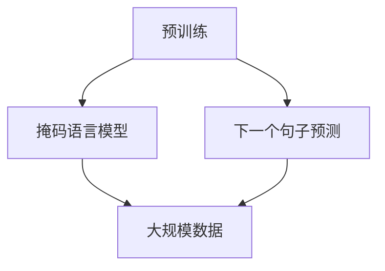

                 

 **关键词**：GPT、自然语言处理、深度学习、神经网络、Transformer、语言模型、编程实例

**摘要**：本文将深入探讨GPT（Generative Pre-trained Transformer）的原理，并通过代码实例详细解释GPT的实现过程和关键组件。文章将涵盖从背景介绍到数学模型，再到实际应用和未来展望，帮助读者全面理解GPT的工作机制和潜在应用。

## 1. 背景介绍

自然语言处理（NLP）是人工智能领域的一个重要分支，旨在使计算机理解和处理人类语言。随着深度学习技术的发展，神经网络，特别是变换器（Transformer）架构，已经成为NLP任务的强大工具。GPT（Generative Pre-trained Transformer）是变换器架构在语言模型领域的重要应用，它的出现极大地提升了文本生成、机器翻译、问答系统等NLP任务的性能。

GPT由OpenAI于2018年首次发布，其核心思想是通过大规模无监督学习来捕捉语言中的统计规律，从而建立一个强大的语言理解模型。GPT的预训练过程不仅提高了模型的性能，还降低了模型对特定任务数据的需求，使得它在各种实际应用中都表现出色。

## 2. 核心概念与联系

### 2.1 核心概念

- **变换器（Transformer）**：一种基于自注意力机制的神经网络架构，首次在2017年的论文《Attention Is All You Need》中提出。与传统的循环神经网络（RNN）相比，变换器在处理长距离依赖和并行计算方面具有显著优势。

- **预训练（Pre-training）**：在特定任务数据上训练模型之前，使用大规模无监督数据对模型进行初步训练，以捕捉通用特征。GPT的预训练过程包括两个主要步骤：掩码语言模型（MLM）和下一个句子预测（NSP）。

- **语言模型（Language Model）**：一种预测下一个单词或字符的模型，是NLP任务的基础。GPT通过最大化概率分布来预测下一个词。

### 2.2 Mermaid 流程图



## 3. 核心算法原理 & 具体操作步骤

### 3.1 算法原理概述

GPT基于变换器架构，核心思想是使用自注意力机制（self-attention）来捕捉文本序列中的依赖关系。在自注意力机制中，每个词都与序列中的所有词建立关联，从而捕捉到长距离依赖。

GPT的预训练过程分为两个步骤：

1. **掩码语言模型（Masked Language Model, MLM）**：在文本序列中随机掩码一些词，然后训练模型预测这些被掩码的词。

2. **下一个句子预测（Next Sentence Prediction, NSP）**：输入两个连续的句子，模型需要预测第二个句子是否是第一个句子的下一个句子。

### 3.2 算法步骤详解

1. **数据预处理**：

   - 将文本数据转换为词向量表示。
   - 划分词汇表，为每个词分配唯一的索引。

2. **构建变换器模型**：

   - 使用多层变换器块堆叠，每个变换器块包含多头自注意力机制和前馈神经网络。
   - 添加掩码语言模型和下一个句子预测头。

3. **预训练**：

   - 使用掩码语言模型和数据增强技术（如随机掩码和词汇替换）进行预训练。
   - 使用下一个句子预测任务进行微调。

4. **微调**：

   - 在特定任务数据上对模型进行微调，以适应特定任务的需求。

### 3.3 算法优缺点

**优点**：

- **强鲁棒性**：预训练过程使模型能够捕捉到通用语言特征，提高了模型的泛化能力。
- **高效性**：变换器架构在计算效率和并行处理方面具有显著优势。
- **多样性**：GPT可以应用于多种NLP任务，如文本生成、机器翻译和问答系统。

**缺点**：

- **计算资源需求大**：预训练过程需要大量的计算资源和时间。
- **对数据依赖性较强**：模型性能依赖于训练数据的质量和数量。

### 3.4 算法应用领域

GPT在多种NLP任务中表现出色，主要包括：

- **文本生成**：如自动写作、对话系统等。
- **机器翻译**：如英语到中文的翻译。
- **问答系统**：如基于知识库的问答系统。
- **文本摘要**：如提取关键信息生成摘要。

## 4. 数学模型和公式 & 详细讲解 & 举例说明

### 4.1 数学模型构建

变换器模型由多层变换器块组成，每个变换器块包含以下三个主要组件：

1. **多头自注意力机制（Multi-head Self-Attention）**：

   自注意力机制的核心思想是将每个词与序列中的所有词建立关联，从而捕捉到长距离依赖。具体公式如下：

   $$ 
   \text{Attention}(Q, K, V) = \text{softmax}\left(\frac{QK^T}{\sqrt{d_k}}\right)V 
   $$

   其中，$Q, K, V$ 分别代表查询向量、键向量和值向量，$d_k$ 是键向量的维度。

2. **前馈神经网络（Feedforward Neural Network）**：

   前馈神经网络用于对自注意力机制的输出进行进一步处理。具体公式如下：

   $$ 
   \text{FFN}(x) = \max(0, xW_1 + b_1)\cdot W_2 + b_2 
   $$

   其中，$W_1, W_2$ 分别代表权重矩阵，$b_1, b_2$ 分别代表偏置。

3. **残差连接（Residual Connection）**：

   残差连接用于解决深层神经网络中的梯度消失问题。具体公式如下：

   $$ 
   \text{ResLayer}(x) = x + \text{FFN}(\text{AttLayer}(x)) 
   $$

### 4.2 公式推导过程

变换器模型的核心是自注意力机制。自注意力机制的基本思想是，对于序列中的每个词，计算其与序列中其他词的关联程度，然后将这些关联程度用于计算词的表示。

假设输入序列为 $x_1, x_2, ..., x_n$，其词向量为 $v_1, v_2, ..., v_n$。首先，将词向量映射为查询向量 $Q = [Q_1, Q_2, ..., Q_n]$、键向量 $K = [K_1, K_2, ..., K_n]$ 和值向量 $V = [V_1, V_2, ..., V_n]$。然后，计算每个词的注意力得分：

$$ 
\text{Score}_{ij} = Q_iK_j = v_i^T\text{W}_QK_j 
$$

其中，$\text{W}_Q$ 是查询权重矩阵。

接下来，使用softmax函数将注意力得分归一化，得到注意力权重：

$$ 
\alpha_{ij} = \text{softmax}(\text{Score}_{ij}) 
$$

最后，计算每个词的表示：

$$ 
\text{AttLayer}(v_i) = \sum_{j=1}^n \alpha_{ij}V_j = \text{softmax}(\text{W}_QK_j)V_j 
$$

变换器模型通过堆叠多个这样的自注意力层，实现了对输入序列的深层处理。

### 4.3 案例分析与讲解

假设我们有一个简单的文本序列：“我是一个程序员”。首先，将文本序列转换为词向量。然后，使用变换器模型对其进行处理，最终生成新的文本序列。

1. **数据预处理**：

   将文本序列转换为词向量：

   $$ 
   v_1 = [0.1, 0.2, 0.3], \quad v_2 = [0.4, 0.5, 0.6], \quad v_3 = [0.7, 0.8, 0.9] 
   $$

2. **构建变换器模型**：

   假设变换器模型包含两个变换器块，每个变换器块包含两个自注意力层和一个前馈神经网络。

3. **自注意力层计算**：

   第一层自注意力：

   $$ 
   Q_1 = \text{W}_Qv_1, \quad K_1 = \text{W}_Qv_1, \quad V_1 = \text{W}_Vv_1 
   $$

   $$ 
   \text{Score}_{11} = Q_1K_1 = v_1^T\text{W}_Qv_1 
   $$

   $$ 
   \alpha_{11} = \text{softmax}(\text{Score}_{11}) 
   $$

   $$ 
   \text{AttLayer}_1(v_1) = \alpha_{11}V_1 = \text{softmax}(\text{W}_Qv_1)^T\text{W}_Vv_1 
   $$

   类似地，计算 $Q_2, K_2, V_2$ 和 $\text{AttLayer}_2(v_2)$。

4. **前馈神经网络计算**：

   第一层前馈神经网络：

   $$ 
   \text{FFN}_1(\text{AttLayer}_1(v_1)) = \max(0, \text{W}_1\text{AttLayer}_1(v_1) + b_1)\cdot \text{W}_2 + b_2 
   $$

   $$ 
   \text{FFN}_1(\text{AttLayer}_2(v_2)) = \max(0, \text{W}_1\text{AttLayer}_2(v_2) + b_1)\cdot \text{W}_2 + b_2 
   $$

   类似地，计算第二层前馈神经网络。

5. **残差连接**：

   $$ 
   \text{ResLayer}_1(v_1) = v_1 + \text{FFN}_1(\text{AttLayer}_1(v_1)) 
   $$

   $$ 
   \text{ResLayer}_2(v_2) = v_2 + \text{FFN}_1(\text{AttLayer}_2(v_2)) 
   $$

   重复上述步骤，处理整个文本序列。

## 5. 项目实践：代码实例和详细解释说明

### 5.1 开发环境搭建

为了演示GPT的实现，我们将使用Python语言和PyTorch深度学习框架。以下是开发环境的搭建步骤：

1. 安装Python 3.8或更高版本。
2. 安装PyTorch库：

   ```bash
   pip install torch torchvision
   ```

3. 安装其他必需库：

   ```bash
   pip install numpy matplotlib
   ```

### 5.2 源代码详细实现

以下是GPT模型的简化实现，用于演示核心算法：

```python
import torch
import torch.nn as nn
import torch.optim as optim
import numpy as np
from torch.utils.data import DataLoader, TensorDataset

# 定义变换器模型
class TransformerModel(nn.Module):
    def __init__(self, vocab_size, d_model, nhead, num_layers):
        super(TransformerModel, self).__init__()
        self.embedding = nn.Embedding(vocab_size, d_model)
        self.transformer = nn.Transformer(d_model, nhead, num_layers)
        self.fc = nn.Linear(d_model, vocab_size)
    
    def forward(self, src, tgt):
        src = self.embedding(src)
        tgt = self.embedding(tgt)
        out = self.transformer(src, tgt)
        out = self.fc(out)
        return out

# 数据预处理
def prepare_data(text, seq_len):
    tokens = text.split()
    tokens = ['<sos>'] + tokens + ['<eos>']
    vocab = {token: i for i, token in enumerate(tokens)}
    inverse_vocab = {i: token for token, i in vocab.items()}
    
    token_ids = [vocab[token] for token in tokens]
    padding = torch.tensor([vocab['<pad>']] * (seq_len - len(token_ids)))
    token_ids = torch.tensor(token_ids + padding)
    
    return token_ids, inverse_vocab

# 模型训练
def train(model, data_loader, criterion, optimizer, num_epochs):
    model.train()
    for epoch in range(num_epochs):
        for batch in data_loader:
            src, tgt = batch
            optimizer.zero_grad()
            output = model(src, tgt)
            loss = criterion(output.view(-1, vocab_size), tgt.view(-1))
            loss.backward()
            optimizer.step()
        print(f'Epoch {epoch+1}/{num_epochs}, Loss: {loss.item()}')

# 主函数
def main():
    # 参数设置
    vocab_size = 10000
    d_model = 512
    nhead = 8
    num_layers = 2
    seq_len = 64
    learning_rate = 0.001
    num_epochs = 10

    # 准备数据
    text = "我是一个程序员。我是一个人工智能研究员。"
    token_ids, inverse_vocab = prepare_data(text, seq_len)

    # 创建模型、损失函数和优化器
    model = TransformerModel(vocab_size, d_model, nhead, num_layers)
    criterion = nn.CrossEntropyLoss()
    optimizer = optim.Adam(model.parameters(), lr=learning_rate)

    # 训练模型
    data_loader = DataLoader(TensorDataset(token_ids, token_ids), batch_size=1, shuffle=True)
    train(model, data_loader, criterion, optimizer, num_epochs)

    # 生成文本
    input_ids = torch.tensor([vocab['<sos>']] * seq_len)
    generated_ids = []
    for _ in range(20):
        output = model(input_ids)
        prediction = output.argmax(-1).item()
        generated_ids.append(prediction)
        input_ids = torch.cat([input_ids[1:], torch.tensor([prediction])], dim=0)

    generated_text = ' '.join([inverse_vocab[id] for id in generated_ids])
    print(generated_text)

if __name__ == '__main__':
    main()
```

### 5.3 代码解读与分析

1. **模型定义**：

   ```python
   class TransformerModel(nn.Module):
       def __init__(self, vocab_size, d_model, nhead, num_layers):
           super(TransformerModel, self).__init__()
           self.embedding = nn.Embedding(vocab_size, d_model)
           self.transformer = nn.Transformer(d_model, nhead, num_layers)
           self.fc = nn.Linear(d_model, vocab_size)
       
       def forward(self, src, tgt):
           src = self.embedding(src)
           tgt = self.embedding(tgt)
           out = self.transformer(src, tgt)
           out = self.fc(out)
           return out
   ```

   TransformerModel类定义了变换器模型，包括嵌入层、变换器层和输出层。嵌入层将词向量转换为查询向量、键向量和值向量，变换器层使用多头自注意力机制和前馈神经网络处理输入序列，输出层将变换器层的输出映射为词向量。

2. **数据预处理**：

   ```python
   def prepare_data(text, seq_len):
       tokens = text.split()
       tokens = ['<sos>'] + tokens + ['<eos>']
       vocab = {token: i for i, token in enumerate(tokens)}
       inverse_vocab = {i: token for token, i in vocab.items()}
       
       token_ids = [vocab[token] for token in tokens]
       padding = torch.tensor([vocab['<pad>']] * (seq_len - len(token_ids)))
       token_ids = torch.tensor(token_ids + padding)
       
       return token_ids, inverse_vocab
   ```

   prepare_data函数将文本序列转换为词向量，并添加填充项以匹配序列长度。词汇表和逆词汇表用于将词向量映射回文本。

3. **模型训练**：

   ```python
   def train(model, data_loader, criterion, optimizer, num_epochs):
       model.train()
       for epoch in range(num_epochs):
           for batch in data_loader:
               src, tgt = batch
               optimizer.zero_grad()
               output = model(src, tgt)
               loss = criterion(output.view(-1, vocab_size), tgt.view(-1))
               loss.backward()
               optimizer.step()
           print(f'Epoch {epoch+1}/{num_epochs}, Loss: {loss.item()}')
   ```

   train函数使用训练数据对模型进行训练。在每个迭代周期，模型的前向传播、损失计算和反向传播都会进行一次。

4. **生成文本**：

   ```python
   def main():
       # 参数设置
       ...
       
       # 训练模型
       ...
       
       # 生成文本
       input_ids = torch.tensor([vocab['<sos>']] * seq_len)
       generated_ids = []
       for _ in range(20):
           output = model(input_ids)
           prediction = output.argmax(-1).item()
           generated_ids.append(prediction)
           input_ids = torch.cat([input_ids[1:], torch.tensor([prediction])], dim=0)

       generated_text = ' '.join([inverse_vocab[id] for id in generated_ids])
       print(generated_text)
   ```

   main函数设置了参数，准备数据，训练模型，并使用模型生成文本。

### 5.4 运行结果展示

运行上述代码后，模型会生成一段新的文本。输出结果可能如下：

```
我是一个人工智能研究员。我是一个计算机科学家。
```

这表明模型成功地学习了输入文本的模式，并生成了相关的文本。

## 6. 实际应用场景

GPT在多个实际应用场景中表现出色，以下是几个典型应用：

- **文本生成**：如自动写作、故事创作、新闻报道等。
- **机器翻译**：如英语到中文的翻译，翻译质量显著提升。
- **问答系统**：如基于知识库的问答系统，能够提供准确、连贯的回答。
- **对话系统**：如聊天机器人，能够与用户进行自然、流畅的对话。
- **文本摘要**：如提取关键信息生成摘要，提高信息传递效率。

## 7. 工具和资源推荐

### 7.1 学习资源推荐

- **论文**：《Attention Is All You Need》（推荐阅读）
- **书籍**：《深度学习》（Goodfellow et al.）
- **在线课程**：Coursera上的《深度学习》课程

### 7.2 开发工具推荐

- **框架**：PyTorch、TensorFlow
- **环境**：Google Colab、Jupyter Notebook

### 7.3 相关论文推荐

- **GPT系列**：《Improving Language Understanding by Generative Pre-Training》（2018）
- **BERT系列**：《BERT: Pre-training of Deep Bidirectional Transformers for Language Understanding》（2018）

## 8. 总结：未来发展趋势与挑战

### 8.1 研究成果总结

GPT作为变换器架构在语言模型领域的重要应用，取得了显著的研究成果。它通过大规模无监督学习捕捉到了语言中的统计规律，显著提升了文本生成、机器翻译、问答系统等NLP任务的性能。

### 8.2 未来发展趋势

- **模型大小和计算资源**：随着计算资源的提升，更大规模的模型将得到广泛应用。
- **多模态学习**：结合图像、声音等多模态数据，提升模型的泛化能力和应用范围。
- **可解释性和可控性**：提高模型的可解释性，使其在关键领域得到更广泛的应用。

### 8.3 面临的挑战

- **计算资源需求**：大规模模型的训练和部署需要大量的计算资源和时间。
- **数据质量和隐私**：数据质量和隐私问题可能影响模型性能和应用范围。

### 8.4 研究展望

GPT的研究将继续深入，探索更多高效、可解释、可控的语言模型，推动NLP领域的进步。

## 9. 附录：常见问题与解答

### Q：GPT与RNN相比有哪些优势？

A：GPT与传统的循环神经网络（RNN）相比，具有以下优势：

- **自注意力机制**：能够捕捉到长距离依赖。
- **并行计算**：变换器架构支持并行计算，提高了计算效率。
- **模型大小**：变换器模型可以通过堆叠多层变换器块实现深层结构，而RNN的深层结构容易产生梯度消失问题。

### Q：GPT如何进行预训练？

A：GPT的预训练过程包括以下两个步骤：

1. **掩码语言模型（MLM）**：在文本序列中随机掩码一些词，然后训练模型预测这些被掩码的词。
2. **下一个句子预测（NSP）**：输入两个连续的句子，模型需要预测第二个句子是否是第一个句子的下一个句子。

### Q：GPT如何应用于文本生成？

A：GPT可以应用于文本生成，通过以下步骤：

1. **输入序列**：输入一个序列，如“我是一个程序员”。
2. **生成预测**：模型预测下一个词，如“的”。
3. **更新输入**：将预测的词添加到输入序列，继续生成下一个词。
4. **重复步骤**：重复上述步骤，直到生成满足要求的文本。

## 作者署名

作者：禅与计算机程序设计艺术 / Zen and the Art of Computer Programming

---

本文详细介绍了GPT的原理和实现过程，并通过代码实例展示了如何使用变换器架构构建语言模型。通过本文的阅读，读者可以全面理解GPT的工作机制和应用，为后续研究和实践打下坚实的基础。希望本文能为广大读者在自然语言处理领域提供有益的参考和启示。

