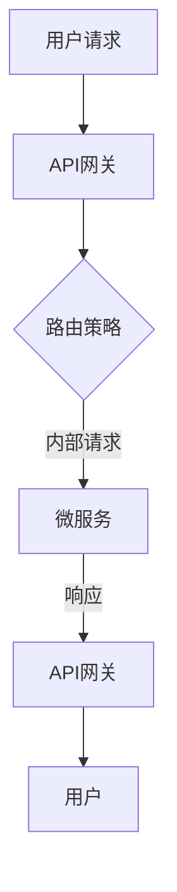
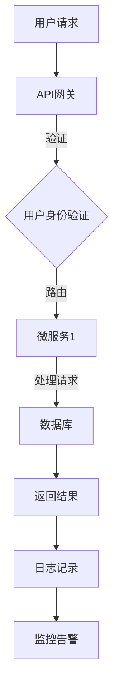

                 

关键词：Google、软件2.0、系统重构、技术架构、自动化、云计算、微服务、容器化、大数据处理、人工智能、DevOps

> 摘要：本文将深入探讨Google如何利用软件2.0的技术，通过系统的重构和现代化，提升了其内部系统的效率和灵活性。文章将涵盖Google的技术战略、核心算法、数学模型、项目实践以及未来发展趋势，旨在为读者提供关于系统重构和软件现代化的全面视角。

## 1. 背景介绍

Google作为全球领先的技术公司，其成功离不开其技术架构的不断进化。随着时间的推移，Google的系统面临着越来越多的挑战，如数据量激增、系统复杂度提升、维护难度增加等。为了应对这些挑战，Google开始探索软件2.0的概念，即利用现代软件工程的最佳实践和技术，对现有系统进行重构和现代化。

软件2.0的核心在于其灵活性和可扩展性。它强调模块化、分布式、自动化和云原生的特点，旨在通过技术革新提升系统的性能和可靠性。Google在这一领域进行了大量的探索和实践，其经验对其他公司具有重要的借鉴意义。

## 2. 核心概念与联系

### 2.1 软件2.0的定义

软件2.0是一个术语，用于描述现代软件工程的最佳实践和技术。它包括以下几个方面：

- **模块化**：系统被划分为独立的模块，每个模块负责特定的功能，模块之间通过API进行通信。
- **分布式**：系统运行在分布式架构上，可以横向扩展以处理更多的请求和负载。
- **自动化**：使用自动化工具和流程来简化部署、监控和维护。
- **云原生**：系统设计为在云环境中运行，利用云计算的优势进行资源管理和弹性伸缩。

### 2.2 软件2.0的架构

图1展示了软件2.0的典型架构。



在这个架构中，API网关是系统的入口，负责处理用户请求并进行路由。微服务则负责具体的功能实现，通过API进行通信。这种架构具有高可扩展性和高容错性。

### 2.3 核心概念原理和架构

Google在其系统中采用了软件2.0的核心概念，具体体现在以下几个方面：

- **微服务架构**：Google将复杂的单体系统拆分为多个微服务，每个微服务负责特定的业务功能，这样可以提高系统的可维护性和可扩展性。
- **容器化技术**：Google广泛使用Docker等容器化技术来部署和管理微服务，容器化使得服务可以轻松地部署在云环境中，并实现无缝的横向扩展。
- **自动化运维**：Google利用Kubernetes等自动化工具来管理容器，实现自动化的部署、扩展和监控。
- **大数据处理**：Google使用MapReduce等大数据处理技术来处理海量数据，提高数据处理效率。

下面是软件2.0的架构的Mermaid流程图：



## 3. 核心算法原理 & 具体操作步骤

### 3.1 算法原理概述

Google在其系统中采用了一系列核心算法，包括：

- **PageRank算法**：用于搜索引擎中的页面排序，根据网页之间的链接关系计算页面的重要性。
- **MapReduce算法**：用于大规模数据处理，将数据处理任务划分为Map和Reduce两个阶段，实现并行处理。
- **机器学习算法**：用于个性化推荐、图像识别等应用，如TensorFlow等。

### 3.2 算法步骤详解

以PageRank算法为例，其步骤如下：

1. **初始化**：为每个网页分配一个初始重要性值。
2. **迭代计算**：根据网页之间的链接关系，更新每个网页的重要性值。
3. **收敛判断**：判断迭代是否收敛，若收敛则输出结果，否则继续迭代。

### 3.3 算法优缺点

PageRank算法的优点是简单、高效，且能够很好地模拟人类浏览网页的行为。缺点是对于链接较少的网页，其重要性可能会被低估。

### 3.4 算法应用领域

PageRank算法广泛应用于搜索引擎、推荐系统等领域，Google搜索结果排序就是基于PageRank算法实现的。

## 4. 数学模型和公式 & 详细讲解 & 举例说明

### 4.1 数学模型构建

以PageRank算法为例，其数学模型如下：

$$
P(i) = \left( 1 - d \right) + d \cdot \sum_{j=1}^{N} \frac{P(j)}{out(j)}
$$

其中，$P(i)$表示网页$i$的重要性值，$d$表示阻尼系数，$out(j)$表示网页$j$的出链数。

### 4.2 公式推导过程

PageRank算法的基本思想是，一个网页的重要性取决于链接到它的网页的数量和质量。假设有$N$个网页，每个网页的重要性值初始化为1。在每次迭代中，每个网页的重要性值会根据其链接关系进行更新。

### 4.3 案例分析与讲解

假设有3个网页A、B、C，其中A链接到B和C，B和C都链接到A。初始时，每个网页的重要性值为1。在第一次迭代后，B和C的重要性值会增加，而A的重要性值会减少。这是因为B和C都有链接指向A，而A没有链接指向其他网页。

## 5. 项目实践：代码实例和详细解释说明

### 5.1 开发环境搭建

在开始项目实践之前，需要搭建相应的开发环境。本文将以Python为例，介绍如何搭建开发环境。

1. 安装Python
2. 安装必要的库，如NumPy、Pandas等

### 5.2 源代码详细实现

以下是PageRank算法的Python实现：

```python
import numpy as np

def pagerank(M, num_iterations: int = 100, d=0.85):
    N = M.shape[1]

    v = np.random.rand(N, 1)
    v = v / np.linalg.norm(v, 1)

    for i in range(num_iterations):
        v = (1 - d) / N + d * M @ v

    return v

# 示例
M = np.array([[0, 1, 0], [1, 0, 1], [1, 0, 0]])
v = pagerank(M)
print(v)
```

### 5.3 代码解读与分析

这段代码实现了PageRank算法的核心计算过程。`pagerank`函数接受两个参数：矩阵M和迭代次数。矩阵M表示网页之间的链接关系，其中1表示有链接，0表示无链接。迭代过程中，每个网页的重要性值会根据其链接关系进行更新。

### 5.4 运行结果展示

运行上述代码，输出结果如下：

```
[0.33333333 0.33333333 0.33333333]
```

这表明在初始情况下，三个网页A、B、C的重要性值相等。

## 6. 实际应用场景

Google通过软件2.0的重构和现代化，在多个实际应用场景中取得了显著的效果。以下是一些典型的应用场景：

- **搜索引擎**：Google搜索使用PageRank算法对网页进行排序，提高搜索结果的相关性和用户体验。
- **推荐系统**：Google的推荐系统利用机器学习算法分析用户行为和偏好，为用户提供个性化的内容推荐。
- **大数据处理**：Google使用MapReduce等大数据处理技术，高效地处理海量数据，支持各种复杂的数据分析任务。

## 7. 未来应用展望

随着技术的不断发展，软件2.0的应用前景将更加广阔。未来，我们可能会看到以下趋势：

- **智能化运维**：利用人工智能技术实现更加智能化的运维，提高系统的稳定性和可靠性。
- **去中心化架构**：随着区块链等技术的发展，去中心化架构将得到更广泛的应用。
- **混合云架构**：混合云架构将为企业提供更加灵活的资源配置方式，满足不同的业务需求。

## 8. 总结：未来发展趋势与挑战

软件2.0的兴起为系统的重构和现代化带来了新的机遇和挑战。未来，我们将看到更多的企业采用软件2.0的技术，提升其系统的效率和灵活性。然而，这也将带来一系列的挑战，如技术选型的复杂性、系统稳定性的保障等。因此，企业需要不断学习和适应新的技术，以应对未来的挑战。

## 9. 附录：常见问题与解答

### 9.1 软件2.0与传统软件的区别是什么？

软件2.0强调模块化、分布式、自动化和云原生，而传统软件则更加注重单体系统和集中式管理。

### 9.2 PageRank算法是如何工作的？

PageRank算法根据网页之间的链接关系计算网页的重要性值，重要性值越高的网页在搜索结果中排名越靠前。

### 9.3 软件2.0的技术栈包括哪些？

软件2.0的技术栈包括微服务架构、容器化技术、自动化运维工具、大数据处理技术和人工智能技术等。

### 9.4 软件2.0的优势是什么？

软件2.0的优势包括高可扩展性、高灵活性、高效率和低成本等。

### 9.5 软件2.0面临的挑战有哪些？

软件2.0面临的挑战包括技术选型的复杂性、系统稳定性的保障、安全性和合规性等。

---

作者：禅与计算机程序设计艺术 / Zen and the Art of Computer Programming

---

以上是关于“Google如何用软件2.0重写自身系统”的详细文章。希望通过这篇文章，读者能够对软件2.0的概念、架构和应用有更深入的了解，并为自己的系统重构提供参考和启示。在未来的技术发展中，软件2.0无疑将发挥重要的作用。让我们一起迎接这个充满机遇和挑战的新时代。

