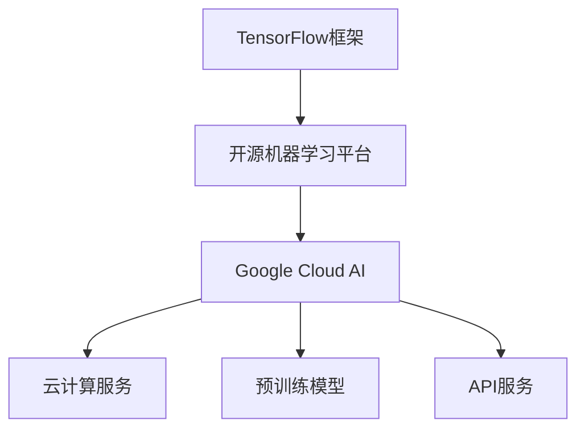

                 

关键词：Google AI、TensorFlow、Google Cloud AI、AI生态、深度学习、云计算、人工智能、机器学习

> 摘要：本文旨在深入探讨Google的AI生态布局，从TensorFlow到Google Cloud AI的发展历程、核心概念、算法原理、数学模型、项目实践以及未来应用展望，分析Google在人工智能领域的战略布局及其影响。

## 1. 背景介绍

随着计算机技术的飞速发展，人工智能（AI）已经成为推动科技进步和产业变革的关键驱动力。Google作为全球领先的科技公司，其在AI领域的研究与应用具有举足轻重的地位。本文将重点介绍Google的AI生态布局，从TensorFlow到Google Cloud AI的发展历程，旨在帮助读者了解Google在人工智能领域的战略布局和最新动态。

### 1.1 TensorFlow的起源与发展

TensorFlow是Google于2015年开源的一款基于数据流编程的端到端开源机器学习平台。它由Google大脑团队（Google Brain Team）开发，旨在为研究人员和开发者提供强大的机器学习工具和资源。TensorFlow自开源以来，得到了全球开发者的广泛支持，成为人工智能领域的标准框架之一。

TensorFlow的核心优势在于其灵活性和可扩展性。它支持多种编程语言，包括Python、C++和Java等，提供了丰富的API和工具，可以满足不同应用场景的需求。此外，TensorFlow支持多种深度学习模型，包括卷积神经网络（CNN）、循环神经网络（RNN）和生成对抗网络（GAN）等，使其在图像识别、自然语言处理、语音识别等领域具有广泛的应用。

### 1.2 Google Cloud AI的崛起

随着人工智能技术的不断成熟，Google意识到仅靠单个平台难以满足日益增长的AI应用需求。因此，Google于2016年推出了Google Cloud AI，这是一个基于云计算的人工智能服务，旨在为企业提供强大的AI解决方案。Google Cloud AI的核心产品包括Cloud Vision API、Cloud Natural Language API、Cloud Speech API等，覆盖了图像识别、自然语言处理、语音识别等多个领域。

Google Cloud AI的优势在于其高度集成和可扩展性。通过整合Google的各种AI技术和资源，Google Cloud AI为企业提供了一个一站式的人工智能平台，降低了企业使用AI的门槛。此外，Google Cloud AI基于云计算架构，可以实现弹性扩展，满足不同规模企业的需求。

## 2. 核心概念与联系

在探讨Google的AI生态布局之前，有必要了解一些核心概念和原理。以下是一个Mermaid流程图，展示了TensorFlow与Google Cloud AI之间的联系：



### 2.1 TensorFlow框架

TensorFlow是Google推出的一款开源机器学习平台，基于数据流图编程。它允许开发者构建和训练深度学习模型，并支持多种编程语言，如Python、C++和Java。TensorFlow的核心优势在于其灵活性和可扩展性，使其成为人工智能领域的标准框架之一。

### 2.2 Google Cloud AI

Google Cloud AI是基于云计算的人工智能服务，为企业提供强大的AI解决方案。它包括预训练模型、API服务和云计算服务。Google Cloud AI的核心产品如Cloud Vision API、Cloud Natural Language API和Cloud Speech API，覆盖了图像识别、自然语言处理、语音识别等多个领域。

### 2.3 预训练模型

预训练模型是近年来人工智能领域的一个重要突破。通过在大量数据上进行预训练，预训练模型可以在特定任务上达到很高的性能。Google Cloud AI提供了多种预训练模型，如BERT、GPT等，可以帮助企业快速实现AI应用。

### 2.4 API服务

API服务是Google Cloud AI的重要组成部分，为企业提供了便捷的AI接入方式。通过调用API服务，企业可以轻松实现图像识别、自然语言处理、语音识别等功能，无需深入了解底层技术。

## 3. 核心算法原理 & 具体操作步骤

### 3.1 算法原理概述

在Google的AI生态布局中，深度学习是核心算法之一。深度学习是一种通过模拟人脑神经网络进行学习的人工智能技术，具有强大的自适应和泛化能力。深度学习算法的核心在于神经网络的构建和训练。

神经网络由多个神经元（或称为节点）组成，每个神经元都与其他神经元相连。神经网络的训练过程是通过不断调整神经元之间的连接权重，使其在特定任务上达到最优性能。Google的AI生态布局中，TensorFlow提供了一个强大的深度学习框架，支持多种神经网络结构，如卷积神经网络（CNN）、循环神经网络（RNN）和生成对抗网络（GAN）等。

### 3.2 算法步骤详解

下面是使用TensorFlow构建一个简单的深度学习模型的具体步骤：

#### 3.2.1 数据预处理

在构建深度学习模型之前，需要对数据进行预处理，包括数据清洗、归一化和数据增强等。数据预处理是提高模型性能和降低过拟合风险的关键步骤。

```python
import tensorflow as tf

# 加载数据集
(x_train, y_train), (x_test, y_test) = tf.keras.datasets.mnist.load_data()

# 数据归一化
x_train = x_train.astype("float32") / 255.0
x_test = x_test.astype("float32") / 255.0

# 数据增强
x_train = tf.image.random_flip_left_right(x_train)
```

#### 3.2.2 构建神经网络

构建神经网络是深度学习模型的核心步骤。在TensorFlow中，可以使用`tf.keras.Sequential`模型构建一个简单的深度学习模型。

```python
model = tf.keras.Sequential([
    tf.keras.layers.Flatten(input_shape=(28, 28)),
    tf.keras.layers.Dense(128, activation='relu'),
    tf.keras.layers.Dropout(0.2),
    tf.keras.layers.Dense(10, activation='softmax')
])
```

#### 3.2.3 编译模型

在TensorFlow中，需要为模型指定优化器、损失函数和评估指标。常见的优化器有SGD、Adam和RMSProp等，损失函数有交叉熵、均方误差等。

```python
model.compile(optimizer='adam',
              loss='sparse_categorical_crossentropy',
              metrics=['accuracy'])
```

#### 3.2.4 训练模型

训练模型是深度学习模型的核心步骤。在TensorFlow中，可以使用`model.fit()`方法进行模型训练。

```python
model.fit(x_train, y_train, epochs=5)
```

#### 3.2.5 评估模型

训练完成后，可以使用`model.evaluate()`方法评估模型性能。

```python
test_loss, test_acc = model.evaluate(x_test, y_test, verbose=2)
print('\nTest accuracy:', test_acc)
```

### 3.3 算法优缺点

深度学习算法具有以下优点：

1. **强大的自适应能力**：深度学习算法可以自动从大量数据中学习特征，具有很强的自适应能力。
2. **广泛的适用性**：深度学习算法可以应用于各种领域，如图像识别、自然语言处理、语音识别等。
3. **高性能**：深度学习算法在特定任务上可以达到很高的性能。

然而，深度学习算法也存在以下缺点：

1. **计算资源需求大**：深度学习算法需要大量的计算资源，尤其是在训练大型模型时。
2. **数据依赖性强**：深度学习算法的性能高度依赖于数据质量，需要大量的高质量数据。
3. **黑箱问题**：深度学习算法的内部机制复杂，很难解释其决策过程，存在“黑箱”问题。

### 3.4 算法应用领域

深度学习算法在人工智能领域具有广泛的应用：

1. **图像识别**：深度学习算法在图像识别领域取得了显著的成果，广泛应用于人脸识别、物体识别等。
2. **自然语言处理**：深度学习算法在自然语言处理领域发挥了重要作用，如机器翻译、情感分析等。
3. **语音识别**：深度学习算法在语音识别领域取得了巨大突破，为语音助手、智能客服等提供了技术支持。

## 4. 数学模型和公式 & 详细讲解 & 举例说明

### 4.1 数学模型构建

深度学习算法的核心是构建神经网络模型。神经网络模型由多个神经元组成，每个神经元都是一个非线性函数。假设一个简单的单层神经网络，其输入层有n个神经元，输出层有m个神经元，每个神经元之间的连接权重为w_ij，激活函数为σ(x)。

神经网络的输入和输出可以表示为：

输入层：\[ x_1, x_2, ..., x_n \]

输出层：\[ y_1, y_2, ..., y_m \]

神经元i的输出为：

\[ z_i = \sigma(\sum_{j=1}^{n} w_{ij}x_j) \]

其中，σ(x)为激活函数，常见的激活函数有Sigmoid、ReLU和Tanh等。

### 4.2 公式推导过程

在构建神经网络时，需要计算每个神经元的输出。为了简化计算，可以使用矩阵运算来表示神经网络的计算过程。假设输入层、隐藏层和输出层的神经元数量分别为n、k和m，则神经网络的计算过程可以表示为：

输入层到隐藏层的计算：

\[ Z = XW_1 \]

其中，X为输入层神经元向量，W_1为输入层到隐藏层的权重矩阵。

隐藏层到输出层的计算：

\[ A = σ(ZW_2) \]

其中，Z为隐藏层神经元向量，W_2为隐藏层到输出层的权重矩阵，σ为激活函数。

### 4.3 案例分析与讲解

以一个简单的二分类问题为例，输入层有2个神经元，隐藏层有3个神经元，输出层有1个神经元。激活函数采用ReLU函数。

#### 4.3.1 模型构建

输入层神经元向量：

\[ X = \begin{bmatrix} x_1 \\ x_2 \end{bmatrix} \]

隐藏层神经元向量：

\[ Z = \begin{bmatrix} z_1 \\ z_2 \\ z_3 \end{bmatrix} \]

输出层神经元向量：

\[ A = \begin{bmatrix} y \end{bmatrix} \]

权重矩阵：

\[ W_1 = \begin{bmatrix} w_{11} & w_{12} \\ w_{21} & w_{22} \\ w_{31} & w_{32} \end{bmatrix} \]

\[ W_2 = \begin{bmatrix} w_{11} & w_{12} \\ w_{21} & w_{22} \\ w_{31} & w_{32} \end{bmatrix} \]

#### 4.3.2 模型训练

使用梯度下降法训练模型，目标是最小化损失函数。损失函数采用均方误差（MSE）：

\[ J = \frac{1}{2} \sum_{i=1}^{m} (y_i - a_i)^2 \]

训练过程中，需要计算每个权重矩阵的梯度：

\[ \frac{\partial J}{\partial W_1} = \frac{1}{m} X^T (A - Y) \]

\[ \frac{\partial J}{\partial W_2} = \frac{1}{m} Z^T (A - Y) \]

其中，X、Z、A分别为输入层、隐藏层和输出层的神经元向量，Y为真实标签。

#### 4.3.3 模型评估

训练完成后，使用测试数据集评估模型性能。计算测试数据集的均方误差，评估模型预测准确性。

## 5. 项目实践：代码实例和详细解释说明

### 5.1 开发环境搭建

在开始项目实践之前，需要搭建一个合适的开发环境。以下是在Python环境中搭建TensorFlow开发环境的步骤：

1. 安装Python 3.6及以上版本。
2. 安装TensorFlow：`pip install tensorflow`。
3. 安装其他依赖库：`pip install numpy pandas matplotlib`。

### 5.2 源代码详细实现

以下是一个使用TensorFlow实现简单线性回归的例子：

```python
import tensorflow as tf
import numpy as np
import matplotlib.pyplot as plt

# 设置随机种子，保证实验结果可复现
tf.random.set_seed(42)

# 生成数据集
n_samples = 100
x = np.random.rand(n_samples, 1)
y = 2 * x + 1 + np.random.randn(n_samples, 1)

# 定义模型
model = tf.keras.Sequential([
    tf.keras.layers.Dense(units=1, input_shape=(1,))
])

# 编译模型
model.compile(optimizer='sgd', loss='mean_squared_error')

# 训练模型
model.fit(x, y, epochs=1000)

# 评估模型
test_loss = model.evaluate(x, y)
print('Test loss:', test_loss)

# 预测
predictions = model.predict(x)
predictions = predictions.flatten()

# 可视化结果
plt.scatter(x, y, color='blue', label='Actual')
plt.plot(x, predictions, color='red', label='Prediction')
plt.xlabel('x')
plt.ylabel('y')
plt.legend()
plt.show()
```

### 5.3 代码解读与分析

上述代码实现了一个简单的线性回归模型。首先，我们生成一个包含n_samples个样本的数据集，每个样本由一个连续的x值和一个线性相关的y值组成。接着，我们定义了一个由一个全连接层（Dense）组成的简单模型，该层的输出单元数与输入单元数相同。模型使用随机梯度下降（SGD）优化器和均方误差（MSE）损失函数进行编译。

在训练模型时，我们使用`model.fit()`方法进行1000次迭代。每次迭代，模型会计算损失函数，并根据梯度更新模型的权重。训练完成后，我们使用`model.evaluate()`方法评估模型在测试数据集上的性能。

最后，我们使用`model.predict()`方法对数据进行预测，并将预测结果可视化，以便观察模型的表现。

## 6. 实际应用场景

### 6.1 图像识别

图像识别是深度学习的一个重要应用领域。Google的AI生态布局中，TensorFlow和Google Cloud AI都提供了强大的图像识别能力。例如，可以使用TensorFlow构建一个基于卷积神经网络的图像分类器，实现对大量图像的自动分类。同时，Google Cloud AI提供了预训练的图像识别模型，如Cloud Vision API，可以方便地实现图像识别功能。

### 6.2 自然语言处理

自然语言处理（NLP）是另一个重要的人工智能应用领域。Google的AI生态布局中，TensorFlow和Google Cloud AI都提供了丰富的NLP工具和资源。例如，可以使用TensorFlow构建一个基于循环神经网络（RNN）的文本分类模型，实现对大量文本数据的分类。同时，Google Cloud AI提供了预训练的语言模型，如BERT和GPT，可以方便地实现文本生成、情感分析等功能。

### 6.3 语音识别

语音识别是人工智能领域的另一个重要应用。Google的AI生态布局中，TensorFlow和Google Cloud AI都提供了强大的语音识别能力。例如，可以使用TensorFlow构建一个基于深度神经网络的语音识别模型，实现对语音信号的自动识别。同时，Google Cloud AI提供了预训练的语音识别模型，如Cloud Speech API，可以方便地实现语音识别功能。

## 7. 工具和资源推荐

### 7.1 学习资源推荐

1. **《深度学习》（Goodfellow, Bengio, Courville著）：这是一本经典的全栈深度学习教材，适合初学者和专业人士阅读。**
2. **TensorFlow官方文档：TensorFlow的官方文档提供了详细的教程和API参考，是学习TensorFlow的必备资源。**
3. **Google Cloud AI官方文档：Google Cloud AI的官方文档提供了丰富的API和使用案例，可以帮助开发者了解和使用Google Cloud AI的各种功能。**

### 7.2 开发工具推荐

1. **Google Colab：Google Colab是一个基于Google Drive的免费云端Python编程环境，提供了GPU和TPU加速功能，非常适合深度学习项目实践。**
2. **Jupyter Notebook：Jupyter Notebook是一种交互式计算环境，可以方便地编写和运行Python代码，适合进行数据分析和模型训练。**

### 7.3 相关论文推荐

1. **“A Theoretically Grounded Application of Dropout in Recurrent Neural Networks”（Xu et al., 2015）：这篇论文提出了在循环神经网络（RNN）中使用Dropout的方法，提高了RNN的训练效果。**
2. **“Bert: Pre-training of Deep Bidirectional Transformers for Language Understanding”（Devlin et al., 2019）：这篇论文介绍了BERT模型，是一种基于Transformer的预训练语言模型，在多种NLP任务上取得了显著性能。**

## 8. 总结：未来发展趋势与挑战

### 8.1 研究成果总结

近年来，人工智能领域取得了许多重要研究成果。深度学习算法的快速发展，使得计算机在图像识别、自然语言处理、语音识别等任务上取得了显著突破。Google的AI生态布局，从TensorFlow到Google Cloud AI，为研究人员和开发者提供了强大的工具和资源，推动了人工智能技术的广泛应用。

### 8.2 未来发展趋势

未来，人工智能领域将继续保持快速发展态势，以下是几个可能的发展趋势：

1. **算法创新**：随着计算能力和数据资源的不断增长，人工智能算法将不断优化和创新，提高模型性能和效率。
2. **跨领域融合**：人工智能与其他领域的融合，如医疗、金融、工业等，将带来更多的应用场景和商业机会。
3. **开源生态**：开源生态的不断发展，将促进人工智能技术的普及和推广，降低企业使用AI的门槛。

### 8.3 面临的挑战

尽管人工智能领域取得了许多成果，但仍面临一些挑战：

1. **数据隐私**：人工智能技术的广泛应用，对数据隐私保护提出了更高的要求。如何确保数据安全，防止数据泄露，是人工智能领域需要解决的重要问题。
2. **算法公平性**：人工智能算法在决策过程中，可能存在偏见和不公平现象。如何确保算法的公平性和透明性，是人工智能领域需要解决的重要问题。
3. **计算资源**：人工智能模型的训练和推理过程需要大量的计算资源，如何高效利用计算资源，是人工智能领域需要解决的重要问题。

### 8.4 研究展望

未来，人工智能领域将朝着以下几个方向发展：

1. **高效算法**：研究更加高效的人工智能算法，提高模型训练和推理的效率，降低计算资源消耗。
2. **跨学科研究**：推动人工智能与其他学科的融合，如医学、心理学、经济学等，解决实际问题。
3. **开源与共享**：加强人工智能技术的开源和共享，促进技术交流与合作，推动人工智能技术的发展。

## 9. 附录：常见问题与解答

### 9.1 TensorFlow是什么？

TensorFlow是Google推出的一款开源机器学习平台，基于数据流编程，支持多种编程语言，包括Python、C++和Java等。它提供了丰富的API和工具，可以用于构建和训练深度学习模型。

### 9.2 Google Cloud AI有什么优势？

Google Cloud AI提供了多种预训练模型和API服务，帮助企业快速实现人工智能应用。其优势包括：

1. **高度集成**：Google Cloud AI整合了Google的各种AI技术和资源，为企业提供了一个一站式的人工智能平台。
2. **可扩展性**：Google Cloud AI基于云计算架构，可以实现弹性扩展，满足不同规模企业的需求。
3. **易用性**：Google Cloud AI提供了丰富的文档和教程，帮助企业轻松实现AI应用。

### 9.3 如何使用TensorFlow进行模型训练？

使用TensorFlow进行模型训练的步骤如下：

1. **数据预处理**：对训练数据进行预处理，包括数据清洗、归一化和数据增强等。
2. **构建模型**：使用TensorFlow的API构建神经网络模型，指定优化器、损失函数和评估指标。
3. **编译模型**：编译模型，为模型指定优化器和损失函数。
4. **训练模型**：使用`model.fit()`方法进行模型训练，设置训练轮次和批量大小。
5. **评估模型**：使用`model.evaluate()`方法评估模型在测试数据集上的性能。

### 9.4 如何使用Google Cloud AI进行图像识别？

使用Google Cloud AI进行图像识别的步骤如下：

1. **注册并设置Google Cloud账号**：在Google Cloud Console注册并设置账号，创建项目。
2. **安装并配置Cloud SDK**：安装并配置Google Cloud SDK，设置项目ID和访问权限。
3. **上传图像数据**：将图像数据上传到Google Cloud Storage。
4. **调用Cloud Vision API**：使用Cloud Vision API的Python客户端库，调用图像识别接口。
5. **处理识别结果**：处理识别结果，根据需要使用图像识别功能。

### 9.5 如何优化深度学习模型的性能？

优化深度学习模型性能的方法包括：

1. **数据增强**：通过增加训练数据集的多样性，提高模型泛化能力。
2. **调整模型结构**：根据任务需求，调整神经网络的结构和参数。
3. **调整学习率**：使用适当的学习率，加快模型收敛速度。
4. **正则化**：使用正则化技术，防止模型过拟合。
5. **GPU加速**：使用GPU进行模型训练，提高计算效率。

