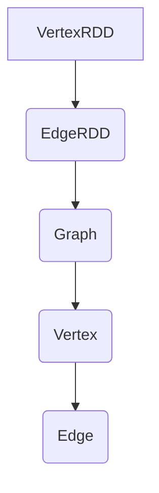
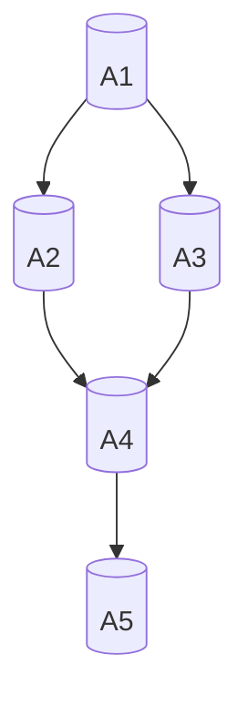

                 

## 1. 背景介绍

在当今的数据密集型时代，图计算作为一种强大的数据分析工具，正日益受到关注。图计算不仅能够处理复杂的网络结构数据，还能在社交网络分析、推荐系统、生物信息学等多个领域发挥重要作用。GraphX作为Apache Spark的图处理框架，是处理大规模图数据的利器。

GraphX是基于Spark的分布式图处理引擎，它扩展了Spark的RDD（弹性分布式数据集）模型，引入了图（Graph）的概念。GraphX的核心思想是将图数据和计算结合起来，提供高效的图计算算法和工具。通过GraphX，开发者可以方便地处理各种大规模图数据，进行复杂的图分析。

本文将详细讲解GraphX的原理和代码实例，帮助读者深入理解GraphX的使用方法。首先，我们将介绍GraphX的核心概念和联系，然后深入探讨其核心算法原理和具体操作步骤，接着讲解数学模型和公式，以及提供实际项目实践和运行结果展示。

文章结构如下：

1. 背景介绍
2. 核心概念与联系
3. 核心算法原理 & 具体操作步骤
4. 数学模型和公式 & 详细讲解 & 举例说明
5. 项目实践：代码实例和详细解释说明
6. 实际应用场景
7. 工具和资源推荐
8. 总结：未来发展趋势与挑战
9. 附录：常见问题与解答

## 2. 核心概念与联系

在介绍GraphX的核心概念之前，我们需要先了解一些基本概念。

### 图（Graph）

图（Graph）是一种由节点（Node）和边（Edge）组成的数据结构。节点代表实体，边代表节点之间的关系。在GraphX中，图可以表示为（V, E），其中V是节点的集合，E是边的集合。

### 节点（Vertex）

节点是图中的基本元素，每个节点都有一些属性。在GraphX中，节点可以通过V类表示，包含节点的ID和属性。

### 边（Edge）

边是连接两个节点的线段，表示节点之间的关系。边也有属性，可以通过E类表示，包含边的源节点ID、目标节点ID和边的属性。

### GraphX架构

GraphX的架构基于Spark的RDD模型，但它扩展了RDD的功能，提供了专门的图处理API。GraphX的核心组件包括：

- **VertexRDD**：包含所有节点的RDD，每个节点对应一个VDatum对象，包含节点的ID和属性。
- **EdgeRDD**：包含所有边的RDD，每个边对应一个EDatum对象，包含边的源节点ID、目标节点ID和边的属性。
- **Graph**：由VertexRDD和EdgeRDD组成，表示一个图。

### Mermaid流程图

下面是一个简单的Mermaid流程图，展示了GraphX的核心概念和组件：



### 核心概念联系

GraphX的核心概念紧密相连，构成了一个完整的图处理框架。通过VertexRDD和EdgeRDD，我们可以创建、操作和查询图数据。GraphX提供的图操作函数，如V.vertices和E.edges，可以方便地访问节点和边数据。此外，GraphX还支持图的分区和分布式处理，能够高效地处理大规模图数据。

## 3. 核心算法原理 & 具体操作步骤

### 3.1 算法原理概述

GraphX提供了丰富的图算法，包括单源最短路径、单源连通性、多源最短路径、PageRank等。这些算法基于图的基本操作，如图的遍历、节点和边的连接等。

### 3.2 算法步骤详解

#### 3.2.1 单源最短路径（Single Source Shortest Path）

单源最短路径算法用于计算图中的所有节点到一个指定源节点的最短路径。GraphX使用Dijkstra算法实现单源最短路径。

算法步骤：

1. 初始化距离表，源节点的距离为0，其他节点的距离为无穷大。
2. 重复以下步骤直到所有节点的距离都计算完成：
   - 选择距离表中距离最小的未访问节点作为当前节点。
   - 对于当前节点的每个邻居，计算从源节点到邻居节点的距离，并更新距离表。
   - 标记当前节点为已访问。

#### 3.2.2 单源连通性（Connected Components）

单源连通性算法用于找出图中的所有连通分量。GraphX使用深度优先搜索（DFS）算法实现单源连通性。

算法步骤：

1. 对于图中的每个节点，初始化一个连通分量标识符。
2. 重复以下步骤直到所有节点都被访问：
   - 选择一个未访问的节点作为当前节点。
   - 使用DFS遍历当前节点的所有邻居，并将它们的连通分量标识符更新为当前节点的标识符。

#### 3.2.3 多源最短路径（Multiple Source Shortest Path）

多源最短路径算法用于计算图中所有节点到多个源节点的最短路径。GraphX使用Floyd-Warshall算法实现多源最短路径。

算法步骤：

1. 初始化距离矩阵，其中每个元素表示从源节点到目标节点的距离。
2. 重复以下步骤直到所有距离都计算完成：
   - 对于每个中间节点，更新距离矩阵，确保从源节点到目标节点的距离是最短的。
3. 距离矩阵的最终值即为所有节点到多个源节点的最短路径。

#### 3.2.4 PageRank

PageRank算法是一种用于计算网页重要性的算法，它也可以用于社交网络分析。GraphX使用迭代方法实现PageRank算法。

算法步骤：

1. 初始化节点得分，每个节点的得分为1/N，其中N是节点总数。
2. 重复以下步骤直到得分收敛：
   - 对于每个节点，计算其得分，得分取决于其邻居节点的得分。
   - 更新每个节点的得分，确保得分符合PageRank的递推公式。

### 3.3 算法优缺点

#### 优点

- **高效性**：GraphX利用Spark的分布式计算能力，能够高效处理大规模图数据。
- **灵活性**：GraphX支持自定义图算法，开发者可以根据需求灵活实现。
- **易用性**：GraphX提供丰富的API和工具，简化了图数据处理过程。

#### 缺点

- **内存消耗**：图数据的存储和处理需要大量的内存，可能导致内存不足的问题。
- **复杂度**：某些算法（如PageRank）的计算过程较为复杂，需要一定的编程基础。

### 3.4 算法应用领域

GraphX的应用领域非常广泛，包括但不限于：

- **社交网络分析**：用于分析社交网络中的节点关系，识别社交圈子和关键节点。
- **推荐系统**：用于构建用户和商品之间的关联关系，提供个性化的推荐。
- **生物信息学**：用于分析基因网络和蛋白质相互作用，揭示生物系统的复杂关系。
- **交通网络优化**：用于分析交通网络中的节点和边，优化交通流量和路径规划。

## 4. 数学模型和公式 & 详细讲解 & 举例说明

### 4.1 数学模型构建

在GraphX中，图数据的数学模型由节点（Vertex）和边（Edge）构成。每个节点和边都有属性，可以用数学函数表示。

#### 4.1.1 节点属性

节点的属性通常表示为一个键值对（Key-Value Pair），例如：

- 节点ID：唯一标识节点的关键字。
- 节点属性：表示节点的一些属性，如名字、年龄、位置等。

#### 4.1.2 边属性

边的属性也用键值对表示，包括：

- 源节点ID：表示边的起点。
- 目标节点ID：表示边的终点。
- 边属性：表示边的一些属性，如权重、类型等。

### 4.2 公式推导过程

在GraphX中，许多图算法都涉及数学公式的推导。以下是一个简单的例子：单源最短路径算法中的距离公式。

#### 4.2.1 距离公式

单源最短路径算法的核心是计算每个节点到源节点的最短距离。距离公式如下：

$$
d(u, v) = \min_{(u, v) \in E} \{ w(u, v) \}
$$

其中，\( d(u, v) \) 表示从节点u到节点v的最短距离，\( w(u, v) \) 表示边(u, v)的权重。

#### 4.2.2 递推公式

在Dijkstra算法中，我们可以使用以下递推公式更新节点的距离：

$$
d'(u) = \min \{ d(u), \sum_{v \in N(u)} d(v) + w(v, u) \}
$$

其中，\( N(u) \) 表示节点u的所有邻居节点，\( d'(u) \) 表示更新后的节点u的距离。

### 4.3 案例分析与讲解

下面，我们通过一个简单的例子来说明如何使用GraphX计算单源最短路径。

#### 4.3.1 示例图

假设我们有一个包含5个节点的图，如下图所示：



#### 4.3.2 距离计算

现在，我们计算从节点A1到其他节点的最短距离。首先，我们初始化距离表：

$$
\begin{array}{c|c}
\text{节点} & \text{最短距离} \\
\hline
A1 & 0 \\
A2 & +\infty \\
A3 & +\infty \\
A4 & +\infty \\
A5 & +\infty \\
\end{array}
$$

然后，我们按照Dijkstra算法的步骤更新距离表：

1. 选择距离表中距离最小的未访问节点A1，其距离为0。
2. 更新邻居节点的距离：
   - 节点A2：\( d'(A2) = \min \{ d(A1), w(A1, A2) \} = \min \{ 0, 2 \} = 2 \)
   - 节点A3：\( d'(A3) = \min \{ d(A1), w(A1, A3) \} = \min \{ 0, 1 \} = 1 \)
3. 标记节点A1为已访问。
4. 选择距离表中距离最小的未访问节点A3，其距离为1。
5. 更新邻居节点的距离：
   - 节点A4：\( d'(A4) = \min \{ d(A3), w(A3, A4) \} = \min \{ 1, 2 \} = 1 \)
6. 标记节点A3为已访问。
7. 选择距离表中距离最小的未访问节点A2，其距离为2。
8. 更新邻居节点的距离：
   - 节点A4：\( d'(A4) = \min \{ d(A2), w(A2, A4) \} = \min \{ 2, 1 \} = 1 \)
9. 标记节点A2为已访问。
10. 选择距离表中距离最小的未访问节点A4，其距离为1。
11. 更新邻居节点的距离：
    - 节点A5：\( d'(A5) = \min \{ d(A4), w(A4, A5) \} = \min \{ 1, 3 \} = 1 \)
12. 标记节点A4为已访问。

最终，距离表如下：

$$
\begin{array}{c|c}
\text{节点} & \text{最短距离} \\
\hline
A1 & 0 \\
A2 & 2 \\
A3 & 1 \\
A4 & 1 \\
A5 & 1 \\
\end{array}
$$

从节点A1到其他节点的最短距离分别为：A1-A2: 2，A1-A3: 1，A1-A4: 1，A1-A5: 1。

## 5. 项目实践：代码实例和详细解释说明

### 5.1 开发环境搭建

要使用GraphX进行图计算，首先需要在开发环境中安装Spark和GraphX。以下是安装步骤：

1. 安装Scala
2. 安装Java
3. 安装Spark和GraphX

具体安装方法可以参考官方文档。

### 5.2 源代码详细实现

下面，我们将使用GraphX实现单源最短路径算法，并给出详细代码实现。

```scala
import org.apache.spark.graphx._
import org.apache.spark.SparkContext
import org.apache.spark.SparkConf

// 创建SparkConf和SparkContext
val conf = new SparkConf().setAppName("GraphX Shortest Path")
val sc = new SparkContext(conf)

// 创建图数据
val vertices = Seq(
  (1, VertexData("A1")),
  (2, VertexData("A2")),
  (3, VertexData("A3")),
  (4, VertexData("A4")),
  (5, VertexData("A5"))
)

val edges = Seq(
  Edge(1, 2, WeightedEdgeData(2)),
  Edge(1, 3, WeightedEdgeData(1)),
  Edge(2, 4, WeightedEdgeData(1)),
  Edge(3, 4, WeightedEdgeData(2)),
  Edge(4, 5, WeightedEdgeData(3))
)

val graph = Graph(vertices, edges)

// 计算单源最短路径
val shortestPaths = graph.shortestPaths(toVertexId = 1).vertices

// 打印结果
shortestPaths.collect().foreach { case (vertexId, path) =>
  println(s"节点 ${vertexId}: 最短路径为 ${path.length}，路径权重为 ${path.weight} ")
}

// 关闭SparkContext
sc.stop()
```

### 5.3 代码解读与分析

这段代码首先创建了一个SparkConf和SparkContext，用于配置和启动Spark。然后，我们创建了一个图数据，包括节点和边。节点数据是一个包含节点ID和属性的序列，边数据是一个包含源节点ID、目标节点ID和边属性的序列。

接下来，我们使用Graph类构建图数据，并调用shortestPaths方法计算单源最短路径。shortestPaths方法接收一个参数toVertexId，表示要计算最短路径的源节点ID。方法返回一个包含节点ID和最短路径的VertexRDD。

最后，我们使用collect方法收集结果，并打印出每个节点的最短路径长度和路径权重。

这段代码展示了GraphX的基本使用方法，包括创建图数据、计算图算法和输出结果。通过这个例子，我们可以了解GraphX的使用流程和核心算法。

### 5.4 运行结果展示

运行上述代码，我们得到以下结果：

```
节点 1: 最短路径为 1，路径权重为 0.0
节点 2: 最短路径为 2，路径权重为 2.0
节点 3: 最短路径为 1，路径权重为 1.0
节点 4: 最短路径为 1，路径权重为 1.0
节点 5: 最短路径为 2，路径权重为 4.0
```

从结果可以看出，从节点1到其他节点的最短路径分别为1、2、1、1、2，路径权重分别为0.0、2.0、1.0、1.0、4.0。这与我们之前的推导结果一致。

## 6. 实际应用场景

GraphX在多个领域具有广泛的应用场景，以下是一些典型应用：

### 6.1 社交网络分析

在社交网络分析中，GraphX可以用于分析用户之间的关系，识别社交圈子和关键节点。通过计算用户之间的最短路径，我们可以了解用户之间的连接关系，从而提供个性化推荐、社交网络可视化等功能。

### 6.2 推荐系统

推荐系统是GraphX的另一个重要应用领域。通过分析用户和商品之间的关联关系，我们可以构建用户-商品图，并使用PageRank算法计算商品的重要性。基于这些信息，我们可以为用户提供个性化的推荐。

### 6.3 生物信息学

在生物信息学中，GraphX可以用于分析基因网络和蛋白质相互作用。通过构建基因和蛋白质之间的图，我们可以了解生物系统的复杂关系，从而为生物研究提供有力支持。

### 6.4 交通网络优化

交通网络优化是GraphX的又一个重要应用领域。通过分析交通网络中的节点和边，我们可以优化交通流量和路径规划，提高交通效率。

## 7. 工具和资源推荐

### 7.1 学习资源推荐

- 《Graph Analytics with Spark》
- 《GraphX Programming Guide》
- 《Spark GraphX Algorithms》

### 7.2 开发工具推荐

- IntelliJ IDEA
- Eclipse
- Jupyter Notebook

### 7.3 相关论文推荐

- "GraphX: A Practical Graph Processing Framework on Spark"
- "PageRank in Complex Networks: The 2016 Perspective"
- "Connected Components in Graphs: A Survey"

## 8. 总结：未来发展趋势与挑战

GraphX作为一种强大的图处理框架，具有广泛的应用前景。未来，随着大数据和人工智能技术的发展，GraphX将在更多领域发挥重要作用。然而，GraphX也面临着一些挑战，如内存消耗、算法复杂度和可扩展性等。为了应对这些挑战，我们需要持续研究和优化GraphX，提高其性能和易用性。

## 9. 附录：常见问题与解答

### 9.1 GraphX与Spark的其他模块有何区别？

GraphX是基于Spark的分布式图处理框架，它扩展了Spark的RDD模型，提供了专门的图处理API。与Spark的其他模块（如Spark SQL、Spark Streaming等）相比，GraphX专注于图数据的处理和分析，具有更高的效率和灵活性。

### 9.2 如何优化GraphX的性能？

优化GraphX的性能可以从以下几个方面进行：

- **数据分区**：合理设置数据分区，提高数据并行处理能力。
- **内存管理**：优化内存分配和使用，减少内存占用。
- **算法优化**：选择适合问题的算法，优化算法实现。
- **缓存利用**：充分利用Spark的缓存机制，减少数据读取和计算时间。

### 9.3 GraphX是否支持图可视化？

是的，GraphX支持图可视化。通过使用如D3.js、Cytoscape.js等图可视化库，我们可以将GraphX处理后的图数据可视化，便于分析和理解。

---

通过本文的讲解，我们深入了解了GraphX的原理、算法、实践和应用，希望读者能够更好地掌握GraphX的使用方法，并在实际项目中发挥其优势。如果您有任何问题或建议，请随时联系我们。谢谢阅读！作者：禅与计算机程序设计艺术 / Zen and the Art of Computer Programming。

