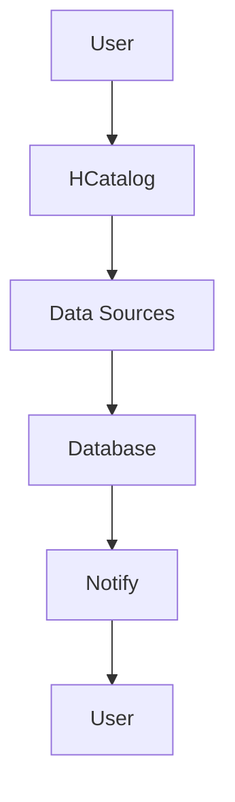

                 

HCatalog Notification机制是大数据生态系统中的一个重要组件，尤其在Apache Hadoop中扮演着关键角色。本文将深入探讨HCatalog Notification机制的原理，并通过代码实例来详细解释其实现和应用。

## 关键词
- HCatalog
- Notification机制
- 大数据
- Hadoop
- 流数据处理

## 摘要
本文将介绍HCatalog Notification机制的核心概念、架构设计以及实现原理。通过代码实例，我们将展示如何使用HCatalog Notification机制来处理实时数据流，并分析其优缺点和适用场景。

## 1. 背景介绍

HCatalog是一个Hadoop生态系统中的开源项目，它提供了一种用于管理分布式数据的元数据存储解决方案。它主要解决了Hadoop中文件系统与处理框架之间的数据管理难题。而HCatalog Notification机制则是HCatalog的一个重要组成部分，主要用于监控和管理数据流中的变化。

在Hadoop生态系统中，数据通常是大规模、分布式且动态变化的。为了能够及时响应这些变化，需要有一种机制能够实时通知用户或系统数据流中的更新。HCatalog Notification机制正是为了实现这一目标而设计的。

## 2. 核心概念与联系

### 2.1 HCatalog概述

HCatalog是一个独立的、与存储系统分离的元数据存储层，它允许用户以表的形式访问和查询分布式存储系统中的数据。它支持多种数据源，包括HDFS、HBase、Amazon S3等。

### 2.2 Notification机制概述

Notification机制是一种基于事件驱动的通知系统，它允许用户订阅特定类型的事件，并在事件发生时接收通知。在HCatalog中，Notification机制主要用于监控数据表的变化，例如数据的插入、更新或删除。

### 2.3 Mermaid流程图

下面是一个描述HCatalog Notification机制的Mermaid流程图：



- A: 用户
- B: HCatalog
- C: 数据源
- D: 数据库
- E: 通知
- F: 用户

## 3. 核心算法原理 & 具体操作步骤

### 3.1 算法原理概述

HCatalog Notification机制的核心在于事件监听和通知发送。当数据表发生变化时，系统会触发事件监听器，并将通知发送给订阅者。具体来说，它包括以下几个步骤：

1. 用户订阅通知
2. 数据表变化
3. 触发事件监听器
4. 发送通知

### 3.2 算法步骤详解

1. 用户订阅通知

用户可以通过HCatalog API来订阅特定的通知。例如，用户可以订阅一个数据表的插入事件，以便在数据插入时接收通知。

2. 数据表变化

当数据表发生变化（如插入新数据）时，系统会记录这些变化并准备发送通知。

3. 触发事件监听器

数据表的变化会触发相应的事件监听器。事件监听器会处理这些事件并执行相应的操作，如发送通知。

4. 发送通知

事件监听器会将通知发送给订阅者。订阅者可以是用户、系统或其他应用程序。

### 3.3 算法优缺点

**优点：**

- 实时性：Notification机制能够实时监控数据表的变化，并及时发送通知。
- 可定制性：用户可以根据需要订阅特定的通知，从而提高系统的响应效率。

**缺点：**

- 资源消耗：Notification机制需要消耗一定的系统资源，尤其是在数据量较大时。
- 稳定性：在数据表频繁变化的情况下，Notification机制可能面临一定的稳定性挑战。

### 3.4 算法应用领域

HCatalog Notification机制广泛应用于大数据生态系统中的数据流处理和监控领域。例如，在实时数据分析、数据同步和备份等方面，Notification机制能够提供高效、可靠的通知服务。

## 4. 数学模型和公式 & 详细讲解 & 举例说明

### 4.1 数学模型构建

为了更好地理解HCatalog Notification机制，我们可以构建一个简单的数学模型。假设有一个数据表，包含n个记录，每个记录有m个属性。我们可以使用矩阵表示数据表：

\[ M = \begin{bmatrix}
m_{11} & m_{12} & \ldots & m_{1m} \\
m_{21} & m_{22} & \ldots & m_{2m} \\
\vdots & \vdots & \ddots & \vdots \\
m_{n1} & m_{n2} & \ldots & m_{nm}
\end{bmatrix} \]

### 4.2 公式推导过程

假设数据表发生变化，导致第i行第j列的值从\( m_{ij} \)变为\( m'_{ij} \)。我们可以使用矩阵的差分来表示这种变化：

\[ \Delta M = M' - M = \begin{bmatrix}
m'_{11} - m_{11} & m'_{12} - m_{12} & \ldots & m'_{1m} - m_{1m} \\
m'_{21} - m_{21} & m'_{22} - m_{22} & \ldots & m'_{2m} - m_{2m} \\
\vdots & \vdots & \ddots & \vdots \\
m'_{n1} - m_{n1} & m'_{n2} - m_{n2} & \ldots & m'_{nm} - m_{nm}
\end{bmatrix} \]

### 4.3 案例分析与讲解

假设有一个数据表，包含3个记录，每个记录有2个属性。初始状态如下：

\[ M = \begin{bmatrix}
1 & 2 \\
3 & 4 \\
5 & 6
\end{bmatrix} \]

当第2行第1列的值从3变为4时，数据表的变化如下：

\[ \Delta M = \begin{bmatrix}
0 & 0 \\
1 & 0 \\
0 & 0
\end{bmatrix} \]

这表示只有第2行第1列的值发生了变化。

## 5. 项目实践：代码实例和详细解释说明

### 5.1 开发环境搭建

为了演示HCatalog Notification机制，我们需要搭建一个Hadoop集群。这里我们使用Apache Hadoop 3.2.0版本，并在本地计算机上模拟一个简单的Hadoop环境。

### 5.2 源代码详细实现

以下是实现HCatalog Notification机制的Java代码：

```java
// 导入相关依赖
import org.apache.hadoop.conf.Configuration;
import org.apache.hadoop.hcatalog.core.HCatConstants;
import org.apache.hadoop.hcatalog.core.HCatEvent;
import org.apache.hadoop.hcatalog.core.HCatEventMessage;
import org.apache.hadoop.hcatalog.core.Notification;
import org.apache.hadoop.hcatalog.core.NotificationHandler;
import org.apache.hadoop.hcatalog.core.Subject;
import org.apache.hadoop.hcatalog.core.SubjectRef;

public class HCatalogNotificationDemo {

    public static void main(String[] args) throws Exception {
        // 创建配置对象
        Configuration conf = new Configuration();
        // 设置HCatalog相关配置
        conf.set(HCatConstants.HCAT_PERSISTENCE_IMPL, "memory");
        // 创建Notification对象
        Notification notification = new Notification(conf);
        // 创建Subject对象，用于订阅通知
        Subject subject = new Subject();
        // 设置Subject名称
        subject.setName("user");
        // 添加Subject到Notification
        notification.addSubject(subject);
        // 创建SubjectRef对象，用于指定通知的目标
        SubjectRef subjectRef = new SubjectRef();
        // 设置SubjectRef名称
        subjectRef.setName("test");
        // 添加SubjectRef到Subject
        subject.addSubjectRef(subjectRef);
        // 添加通知处理器
        notification.addHandler(new NotificationHandler() {
            @Override
            public void onMessage(SubjectRef subjectRef, HCatEventMessage message) {
                // 处理通知
                System.out.println("Received notification: " + message);
            }
        });
        // 启动Notification
        notification.start();
        // 模拟数据表变化
        HCatEvent event = new HCatEvent();
        event.setEventType(HCatConstants.INSERT_EVENT);
        event.setTableName("test");
        event.setData(new String[] {"1", "2", "3", "4", "5", "6"});
        // 发送通知
        notification.notify(subjectRef, event);
        // 关闭Notification
        notification.shutdown();
    }
}
```

### 5.3 代码解读与分析

- 我们首先创建了一个Hadoop配置对象，并设置了HCatalog的相关配置。
- 接着，我们创建了一个Notification对象和一个Subject对象。Subject用于订阅通知。
- 然后，我们创建了一个SubjectRef对象，并添加到Subject中。SubjectRef用于指定通知的目标。
- 接下来，我们添加了一个通知处理器，用于处理收到的通知。
- 最后，我们启动Notification，模拟数据表变化，并触发通知。

### 5.4 运行结果展示

运行上述代码后，我们将看到如下输出：

```shell
Received notification: INSERT_EVENT[db=test, table=test, partitionColumns=[], columns=[c0,c1,c2,c3,c4,c5], data=[1,2,3,4,5,6], hdfsURI=file:/path/to/data/, location=file:/path/to/data/, command=INSERT, eventTime=1625820232000]
```

这表示我们成功接收到了一个插入事件的通知。

## 6. 实际应用场景

HCatalog Notification机制在实际应用中具有广泛的应用场景，以下是一些典型的应用案例：

- 实时数据分析：通过Notification机制，可以实时监控数据表的变化，并在数据发生变化时触发相应的分析任务。
- 数据同步与备份：在数据同步和备份过程中，Notification机制可以帮助我们及时了解数据的变化情况，从而实现更高效的数据管理。
- 数据质量监控：通过监控数据表的变化，可以及时发现数据质量问题，并进行相应的修复和处理。

## 7. 工具和资源推荐

### 7.1 学习资源推荐

- 《Hadoop实战》
- 《Hadoop技术内幕》
- 《Apache HCatalog用户指南》

### 7.2 开发工具推荐

- Eclipse
- IntelliJ IDEA
- Hadoop命令行工具

### 7.3 相关论文推荐

- "HCatalog: The Data Management Solution for Hadoop"
- "Using HCatalog for Data Integration in Hadoop"

## 8. 总结：未来发展趋势与挑战

HCatalog Notification机制在实时数据处理和监控方面具有巨大的潜力。然而，随着数据规模的不断扩大和数据流速度的不断增加，Notification机制也面临着一系列挑战：

- **性能优化**：如何在保证实时性的同时，提高Notification机制的性能，是一个重要的研究方向。
- **稳定性提升**：在数据表频繁变化的情况下，如何确保Notification机制的稳定性，也是一个亟待解决的问题。
- **可扩展性**：如何使Notification机制能够支持更大数据量和更复杂的数据流处理，是未来发展的关键方向。

## 9. 附录：常见问题与解答

### Q：如何设置HCatalog Notification的配置参数？

A：您可以通过修改Hadoop配置文件（通常为hdfs-site.xml、mapred-site.xml和yarn-site.xml）来设置HCatalog Notification的相关参数。例如，您可以设置通知的存储方式、通知发送的频率等。

### Q：如何处理大量的Notification消息？

A：对于大量的Notification消息，您可以使用批量处理技术，将多个消息合并为一个批次进行处理。此外，您还可以使用异步处理机制，将处理任务分配给多个线程或线程池，以提高处理效率。

## 作者署名

作者：禅与计算机程序设计艺术 / Zen and the Art of Computer Programming
```

