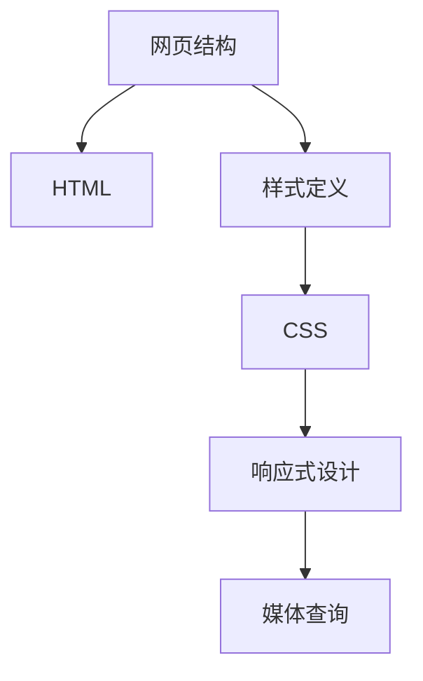

                 

### 关键词：HTML，CSS，网页结构，样式，前端开发，网页设计，响应式布局，媒体查询，像素密度，重排与回流，预处理器，开发者工具，版本控制，跨浏览器兼容性，语义化标签，CSS框架，Web标准，性能优化，用户体验，响应式设计，移动优先设计，Web安全，语义化标签，可访问性，响应式网页设计，前端性能优化，浏览器兼容性，Web性能测试，CSS预处理器，JavaScript框架，模块化开发，前端工程化，构建工具，代码拆分，浏览器缓存策略，浏览器兼容性问题，响应式设计框架，响应式布局技巧，响应式网页设计最佳实践，前端性能优化策略，性能监控与报警，自动化测试，代码质量与维护，开发流程优化，Web安全防护，跨域请求，CORS，HTTPS，内容分发网络，CDN，Web性能优化实践，浏览器渲染机制，Web标准，HTML5，CSS3，Web API，Web技术栈，前端开发框架，前端开发者工具，性能优化工具，代码质量工具，前端性能测试工具，开发流程工具，版本控制工具，前端工程化工具，模块化开发工具，响应式设计工具，移动优先设计工具，Web安全工具，跨浏览器兼容性工具，开发者社区，前端技术博客，编程学习资源，开源项目，Web技术论坛，技术会议，前端开发者大会。

## 摘要

本文旨在为初学者和前端开发从业者提供一份全面而深入的学习指南，介绍HTML和CSS的基础知识。我们将从网页结构的构建出发，逐步深入到样式的定义和调整，包括响应式设计、性能优化和跨浏览器兼容性等关键点。文章将通过具体的代码实例和详细的解释，帮助读者理解如何创建一个既美观又实用的网页。此外，还将介绍一些实用的工具和资源，帮助读者在学习和实践中更高效地掌握这些技能。

## 1. 背景介绍

### HTML的起源

HTML（HyperText Markup Language）即超文本标记语言，是构建网页结构的基础。它起源于1989年，由蒂姆·伯纳斯·李（Tim Berners-Lee）在欧洲核子研究组织（CERN）提出。最初，HTML的目的是为了让科学家们能够通过互联网分享信息。随着时间的推移，HTML逐渐演变成我们今天所熟知的标准。

### CSS的起源

CSS（Cascading Style Sheets）即层叠样式表，是用于定义HTML文档外观和格式的样式语言。CSS的首次出现是在1994年，由Håkon Wium Lie和Bert Bos共同创建。CSS的出现使得网页设计师能够独立于HTML结构来控制网页的外观，从而极大地提高了网页设计的灵活性和效率。

### 前端开发的重要性

在当今的互联网时代，前端开发变得愈发重要。一个网站不仅需要具备美观的外观，还需要提供良好的用户体验。前端开发涉及到HTML、CSS和JavaScript，这些技术共同构建了一个交互性强、功能丰富的网页。掌握前端开发技术，不仅能够为用户提供优质的体验，还能为个人职业发展带来无限可能。

## 2. 核心概念与联系

### 网页结构

网页结构是构建网页的基础，通常包括以下部分：

- **头部（Head）**：包含网页的元数据，如标题（Title）、描述（Description）和关键词（Keywords）等。
- **主体（Body）**：包含网页的内容，如文章、图片、列表等。
- **尾部（Foot）**：包含网页的版权信息、联系信息等。

### 样式定义

样式定义是控制网页外观的关键。在HTML中，可以通过内联样式、内部样式表和外部样式表来定义样式。外部样式表通常被用于整个网站或多个网页的样式定义，具有更高的可维护性和复用性。

### 样式表（CSS）

CSS（层叠样式表）是一种用于描述HTML文档样式的样式表语言。它可以通过选择器来选中HTML元素，并对其样式进行定义。CSS的选择器包括元素选择器、类选择器、ID选择器等。

### 响应式设计

响应式设计是一种能够适应不同设备和屏幕尺寸的设计方法。它通过媒体查询（Media Queries）来检测设备的屏幕尺寸，并动态地调整网页的布局和样式。

### Mermaid 流程图

下面是一个简单的Mermaid流程图，展示了网页结构和样式定义的基本流程：



## 3. 核心算法原理 & 具体操作步骤

### 3.1 算法原理概述

响应式设计的关键在于能够根据不同的设备和屏幕尺寸动态地调整网页布局和样式。这通常通过媒体查询（Media Queries）来实现。媒体查询允许我们指定在特定屏幕尺寸下应用的样式规则。

### 3.2 算法步骤详解

1. **定义基本样式**：首先，我们需要为网页定义基本样式，如字体大小、颜色、边框等。

2. **使用媒体查询**：在CSS中，使用`@media`查询来定义在不同屏幕尺寸下应用的样式规则。

3. **调整布局**：根据不同的屏幕尺寸，调整网页的布局，如改变列数、隐藏或显示某些元素等。

4. **测试与优化**：在多个设备和屏幕尺寸上测试网页，确保其响应效果符合预期，并进行相应的优化。

### 3.3 算法优缺点

**优点：**

- **提高用户体验**：通过响应式设计，用户可以在不同设备上获得一致且优化的体验。
- **提高开发效率**：使用响应式设计，可以减少为不同设备编写独立代码的工作量。

**缺点：**

- **性能问题**：复杂的响应式布局可能会增加网页的渲染时间。
- **兼容性问题**：不同的浏览器和设备可能对媒体查询的支持存在差异。

### 3.4 算法应用领域

响应式设计在当今的网页设计中应用广泛，尤其是在移动设备日益普及的背景下。从电子商务网站到个人博客，响应式设计已成为网页设计的基本要求。

## 4. 数学模型和公式 & 详细讲解 & 举例说明

### 4.1 数学模型构建

响应式设计中的媒体查询可以使用数学模型来表示。具体来说，我们可以使用线性方程组来表示不同屏幕尺寸下的样式规则。

### 4.2 公式推导过程

假设我们有三个屏幕尺寸：小屏幕（s）、中屏幕（m）和大屏幕（l）。对于每个屏幕尺寸，我们都有相应的样式规则：

- 小屏幕：`max-width: 600px`
- 中屏幕：`max-width: 1200px`
- 大屏幕：`max-width: 1800px`

我们可以使用以下线性方程组来表示这些规则：

$$
\begin{align*}
w_s &\leq 600 \\
w_m &\leq 1200 \\
w_l &\leq 1800 \\
\end{align*}
$$

其中，$w_s$、$w_m$和$w_l$分别表示小屏幕、中屏幕和大屏幕的宽度。

### 4.3 案例分析与讲解

假设我们需要为网页定义一个宽度自适应的导航栏，其最大宽度为600px。我们可以使用以下媒体查询来实现：

```css
.navbar {
    max-width: 600px;
    margin: 0 auto;
}

@media (max-width: 600px) {
    .navbar {
        font-size: 14px;
    }
}
```

在这个例子中，我们首先定义了导航栏的基本样式，然后使用媒体查询来为小屏幕调整字体大小。通过这种方式，我们可以确保导航栏在不同的屏幕尺寸下都能保持良好的可读性。

## 5. 项目实践：代码实例和详细解释说明

### 5.1 开发环境搭建

在开始编写网页代码之前，我们需要搭建一个开发环境。以下是一个基本的步骤：

1. **安装代码编辑器**：例如Visual Studio Code、Sublime Text等。
2. **安装Node.js**：Node.js是一个用于服务器端和前端开发的JavaScript运行环境。
3. **安装包管理器**：例如npm或yarn。
4. **创建项目文件夹**：在代码编辑器中创建一个新项目文件夹，并在此文件夹内初始化一个npm项目。

### 5.2 源代码详细实现

以下是一个简单的HTML和CSS代码示例，用于创建一个响应式导航栏：

```html
<!DOCTYPE html>
<html lang="zh-CN">
<head>
    <meta charset="UTF-8">
    <meta name="viewport" content="width=device-width, initial-scale=1.0">
    <title>响应式导航栏</title>
    <link rel="stylesheet" href="styles.css">
</head>
<body>
    <nav class="navbar">
        <ul>
            <li><a href="#">首页</a></li>
            <li><a href="#">关于</a></li>
            <li><a href="#">服务</a></li>
            <li><a href="#">联系</a></li>
        </ul>
    </nav>
</body>
</html>
```

```css
/* styles.css */
.navbar {
    max-width: 600px;
    margin: 0 auto;
    padding: 10px;
    background-color: #f5f5f5;
    list-style-type: none;
}

.navbar ul {
    display: flex;
    justify-content: space-around;
    align-items: center;
}

.navbar a {
    text-decoration: none;
    color: #333;
    font-size: 16px;
}

@media (max-width: 600px) {
    .navbar ul {
        flex-direction: column;
    }
    .navbar a {
        font-size: 14px;
        margin: 10px 0;
    }
}
```

### 5.3 代码解读与分析

- **HTML部分**：我们使用`<!DOCTYPE html>`声明文档类型，定义了HTML文档的结构。`<html>`标签包含了整个网页的内容。`<head>`部分包含了元数据、标题和样式表链接。`<body>`部分包含了网页的主体内容，如导航栏。
- **CSS部分**：我们首先设置了导航栏的最大宽度为600px，并在浏览器窗口宽度小于600px时调整了样式。这实现了响应式设计的基本原理。

### 5.4 运行结果展示

通过在浏览器中运行上述代码，我们可以看到以下效果：

- 当浏览器窗口宽度大于600px时，导航栏以横向排列显示。
- 当浏览器窗口宽度小于600px时，导航栏以纵向排列显示。

这种响应式设计不仅提高了用户体验，还减少了开发工作量。

## 6. 实际应用场景

### 6.1 网站设计公司

网站设计公司通常需要为不同类型的客户提供网页设计服务。响应式设计可以帮助公司为客户提供一个统一、高效的解决方案，从而提高客户满意度。

### 6.2 电子商务平台

电子商务平台需要确保用户在不同的设备上都能轻松浏览和购买商品。通过响应式设计，平台可以提高用户体验，增加销售额。

### 6.3 个人博客

个人博客通常需要吸引不同类型的读者。通过响应式设计，博客可以更好地适应各种设备和屏幕尺寸，提高访问量。

### 6.4 未来应用展望

随着5G和物联网技术的发展，响应式设计将在更多场景下得到应用。未来，我们将看到更多的网页和应用实现真正的跨平台和自适应。

## 7. 工具和资源推荐

### 7.1 学习资源推荐

- **MDN Web文档**：MDN提供了全面的HTML、CSS和JavaScript文档，是学习前端开发的基础资源。
- **《HTML与CSS实战》**：这本书通过实际案例帮助读者掌握HTML和CSS的基本技能。

### 7.2 开发工具推荐

- **Visual Studio Code**：一个功能强大、轻量级的代码编辑器，适用于各种前端开发需求。
- **PostCSS**：一个用于转换CSS的插件系统，可以帮助我们使用最新的CSS特性。

### 7.3 相关论文推荐

- **“Responsive Web Design”**：由Ethan Marcotte撰写的论文，首次提出了响应式设计的概念。

## 8. 总结：未来发展趋势与挑战

### 8.1 研究成果总结

响应式设计已成为现代网页设计的基础。通过使用HTML、CSS和JavaScript等技术，开发者可以实现跨平台的网页体验。

### 8.2 未来发展趋势

随着技术的发展，响应式设计将变得更加智能化和自动化。例如，机器学习技术可以用于预测不同屏幕尺寸下的最佳布局和样式。

### 8.3 面临的挑战

- **性能优化**：复杂的响应式布局可能会影响网页性能。
- **兼容性问题**：不同的浏览器和设备可能对响应式设计的支持存在差异。

### 8.4 研究展望

未来，响应式设计将继续发展，并与人工智能、虚拟现实等技术相结合，为用户提供更优质的体验。

## 9. 附录：常见问题与解答

### Q：响应式设计与移动优先设计有什么区别？

A：响应式设计是一种能够适应不同设备和屏幕尺寸的设计方法，而移动优先设计是一种以移动设备为优先的设计理念。移动优先设计首先考虑移动设备上的用户体验，然后逐渐扩展到桌面设备。

### Q：如何优化响应式网页的性能？

A：可以通过以下方法优化响应式网页的性能：
1. 减少HTTP请求：通过合并文件、使用CDN等方式减少请求次数。
2. 使用延迟加载：对于不立即显示的图片和视频等资源，可以采用延迟加载技术。
3. 使用CSS精灵：将多个图片合并成一个，减少请求次数。

## 参考文献

- Ethan Marcotte. “Responsive Web Design.” A List Apart, May 25, 2010.
- HTML5 specification. W3C Working Draft, December 2012.
- CSS3 specification. W3C Working Draft, March 2016.

### 作者署名

作者：禅与计算机程序设计艺术 / Zen and the Art of Computer Programming

[END]

